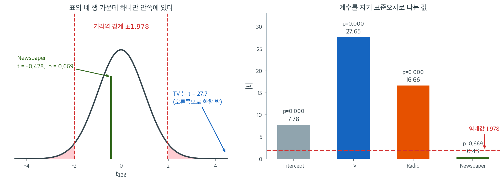

# OLS 회귀 출력 재현

## 개요

이 페이지는 정규방정식을 써서 OLS 회귀 요약표 전체를 밑바닥부터 재현하는 방법을 보인다. Advertising 자료(Sales를 TV, Radio, Newspaper에 회귀)에서 출발하여, 미리 만들어진 회귀 요약 함수에 기대지 않고 계수, 표준오차, $t$ 통계량, $p$값, 95% 신뢰구간을 직접 계산한다.

## 수학적 배경

행렬 형태의 다중선형회귀 모형은

$$
\mathbf{y} = \mathbf{X}\boldsymbol{\beta} + \boldsymbol{\varepsilon}, \qquad \boldsymbol{\varepsilon} \sim N(\mathbf{0}, \sigma^2 \mathbf{I}).
$$

OLS 추정량은 **정규방정식**으로 얻는다.

$$
\hat{\boldsymbol{\beta}} = (\mathbf{X}^\top \mathbf{X})^{-1}\mathbf{X}^\top \mathbf{y}.
$$

잔차 표준오차는

$$
s = \sqrt{\frac{\sum_{i=1}^n (y_i - \hat{y}_i)^2}{n - k}},
$$

여기서 $k$는 (절편을 포함한) 모수의 개수이다. $j$번째 계수의 표준오차는

$$
\mathrm{SE}(\hat{\beta}_j) = s \sqrt{[(\mathbf{X}^\top \mathbf{X})^{-1}]_{jj}}.
$$

$H_0\colon \beta_j = 0$을 검정하는 $t$ 통계량과 $p$값은

$$
t_j = \frac{\hat{\beta}_j}{\mathrm{SE}(\hat{\beta}_j)}, \qquad p\text{-value} = 2\,P(T_{n-k} > |t_j|).
$$

$\beta_j$의 95% 신뢰구간은 $\hat{\beta}_j \pm t^*_{n-k,\,0.025} \cdot \mathrm{SE}(\hat{\beta}_j)$이다.

### 정규방정식으로 OLS 적합하기

<div class="exbox" markdown>

**보기 1.** <span class="diff easy" title="쉬움"></span> OLS 적합 함수. 정규방정식으로 $\hat{\boldsymbol\beta}$ 와 $s$, 그리고 $(\mathbf X^\top\mathbf X)^{-1}$ 을 돌려준다.

**(1)** $\operatorname{Var}(\hat{\boldsymbol\beta})$ 를 유도하여, 함수가 `cov_matrix` 라 부르는 것이 **계수의 공분산행렬이 아님**을 밝히시오. 참 공분산행렬은 어떻게 만드는가.

**(2)** 최소제곱 해는 $\mathbf X^\top \mathbf e = \mathbf 0$ 을 만족한다. 그것을 유도하고 수로 확인하시오. 그리고 `np.linalg.inv` 로 푼 해가 `lstsq` 의 해와 몇 자리까지 같은지 보시오.

</div>

??? success "풀이"

    **(1) 참 공분산행렬에는 $\sigma^2$ 이 곱해져 있다.** $\hat{\boldsymbol\beta} = (\mathbf X^\top\mathbf X)^{-1}\mathbf X^\top\mathbf y$ 이고 $\mathbf A = (\mathbf X^\top\mathbf X)^{-1}\mathbf X^\top$ 라 쓰면 $\hat{\boldsymbol\beta} = \mathbf A\mathbf y$ 로 $\mathbf y$ 의 선형변환이다. $\operatorname{Var}(\mathbf y) = \sigma^2\mathbf I$ 이므로

    $$
    \operatorname{Var}(\hat{\boldsymbol\beta}) = \mathbf A (\sigma^2 \mathbf I) \mathbf A^\top
    = \sigma^2 (\mathbf X^\top\mathbf X)^{-1}\mathbf X^\top \mathbf X (\mathbf X^\top\mathbf X)^{-1}
    = \sigma^2 (\mathbf X^\top\mathbf X)^{-1}
    $$

    가운데 셋이 약분되어 $(\mathbf X^\top\mathbf X)^{-1}$ 하나만 남는 것이 요점이다.

    그러므로 함수가 돌려주는 `cov_matrix` 는 $(\mathbf X^\top\mathbf X)^{-1}$ 로 **$\sigma^2$ 이 빠진 껍데기**다. 눈금조차 맞지 않는다. 참 공분산행렬의 추정값은

    $$
    \widehat{\operatorname{Var}}(\hat{\boldsymbol\beta}) = s^2 (\mathbf X^\top\mathbf X)^{-1}
    $$

    이고, 함수가 `s` 를 따로 돌려주는 까닭이 바로 이것이다. 그래서 표준오차가 `s * np.sqrt(cov_matrix[j, j])` 로 만들어진다. **이름을 `xtx_inv` 라 했으면 오해가 없었을 것이다.**

    **(2) 직교성은 미분에서 바로 나온다.** 목적함수 $\|\mathbf y - \mathbf X\boldsymbol\beta\|^2$ 를 $\boldsymbol\beta$ 로 미분해 $\mathbf 0$ 으로 두면

    $$
    -2\mathbf X^\top(\mathbf y - \mathbf X\hat{\boldsymbol\beta}) = \mathbf 0
    \qquad\Longleftrightarrow\qquad
    \mathbf X^\top \mathbf e = \mathbf 0
    $$

    이다. 곧 **잔차는 설계행렬의 모든 열과 직교한다.** 정규방정식 $\mathbf X^\top\mathbf X\hat{\boldsymbol\beta} = \mathbf X^\top\mathbf y$ 와 같은 식을 다르게 적은 것이다.

    첫 열이 $\mathbf 1$ 이면 그 성분이

    $$
    \mathbf 1^\top \mathbf e = \sum_{i=1}^n e_i = 0
    $$

    이므로 **절편이 있는 모형에서 잔차의 합은 $0$** 이다. 이것이 앞 절에서 절편 누락을 잡아내는 데 쓴 신호다.

    `inv` 와 `lstsq` 는 같은 해를 다르게 계산한다. `lstsq` 는 SVD 를, `inv` 는 LU 분해로 역행렬을 만든다. 연습문제 4 가 말하는 대로 조건이 좋으면 기계 정밀도 수준으로 일치해야 한다. $\mathbf X^\top\mathbf X$ 의 조건수를 함께 보면 그 "기계 정밀도 수준" 이 몇 자리인지 가늠할 수 있다.

    ```python
    import numpy as np
    from scipy import stats

    def fit_ols(X, y):
        """최소제곱 추정값과, 표준오차를 만드는 데 필요한 두 조각을 돌려준다.

        s 는 잔차의 표준편차(자유도 n-k), cov_matrix 는 (X'X)^-1 이다.
        계수 j 의 표준오차는 s * sqrt(cov_matrix[j, j]) 로 만들어진다.
        """
        n, k = X.shape
        beta_hat = np.linalg.inv(X.T @ X) @ X.T @ y
        y_hat = X @ beta_hat
        residuals = y - y_hat
        s = np.sqrt(np.sum(residuals ** 2) / (n - k))
        cov_matrix = np.linalg.inv(X.T @ X)
        return beta_hat, s, cov_matrix
    ```

    ```python
    # 보기 3 의 자료를 여기서 미리 읽어 둔다(보기 3 에서 다시 읽어도 결과는 같다).
    import pandas as pd

    url = ('https://raw.githubusercontent.com/justmarkham/'
           'scikit-learn-videos/master/data/Advertising.csv')
    data = pd.read_csv(url, usecols=[1, 2, 3, 4])
    training_data = data.iloc[:int(len(data) * 0.7)]
    y = np.array(training_data.Sales).reshape(-1, 1)
    n = y.shape[0]
    X = np.concatenate((np.ones((n, 1)), np.array(training_data.iloc[:, :-1])), axis=1)
    k = X.shape[1]
    beta_hat, s, cov_matrix = fit_ols(X, y)

    residuals = y - X @ beta_hat
    print(f"n = {n},  k = {k},  s = {s:.6f},  s^2 = {s ** 2:.6f}")
    print("(X'X)^-1 의 대각 =", np.diag(cov_matrix).round(8))
    print("표준오차 = s * sqrt(diag) =", (s * np.sqrt(np.diag(cov_matrix))).round(6))
    print(f"X'e 의 최대 절대값 = {np.abs(X.T @ residuals).max():.3e}")
    print(f"잔차의 합          = {residuals.sum():.3e}")

    beta_lstsq = np.linalg.lstsq(X, y, rcond=None)[0]
    print(f"inv 와 lstsq 의 최대 차이 = {np.abs(beta_lstsq - beta_hat).max():.3e}")
    print(f"X'X 의 조건수 = {np.linalg.cond(X.T @ X):.4e},  X 의 조건수 = {np.linalg.cond(X):.4e}")
    ```

    출력:

    ```
    n = 140,  k = 4,  s = 1.736514,  s^2 = 3.015479
    (X'X)^-1 의 대각 = [5.077908e-02 9.600000e-07 3.855000e-05 1.632000e-05]
    표준오차 = s * sqrt(diag) = [0.39131  0.001701 0.010782 0.007015]
    X'e 의 최대 절대값 = 1.247e-10
    잔차의 합          = -1.790e-12
    inv 와 lstsq 의 최대 차이 = 4.041e-14
    X'X 의 조건수 = 2.0924e+05,  X 의 조건수 = 4.5743e+02
    ```

    **(1)이 수로 확인된다.** `cov_matrix` 의 대각이 $(0.0508,\ 9.6 \times 10^{-7},\ 3.9 \times 10^{-5},\ 1.6 \times 10^{-5})$ 다. 이 수들의 제곱근을 그대로 표준오차로 쓰면 TV 의 표준오차가 $0.00098$ 이 되어 **참값 $0.001701$ 의 $58\%$** 다. $s = 1.7365$ 를 곱해야 비로소 맞는다. 곧 **`cov_matrix` 를 공분산행렬로 착각하면 표준오차를 $1.74$ 배 작게 보고하고, $t$ 값을 $1.74$ 배 크게 보고한다.** 유의성 판정이 뒤집힐 수 있는 크기다.

    **(2) 직교성이 성립한다.** $\mathbf X^\top\mathbf e$ 의 최대 절대값이 $1.2 \times 10^{-10}$ 이다. 정확한 $0$ 이 아니라 부동소수점의 $0$ 이다. $\mathbf X$ 의 원소가 $10^2$ 규모이고 $\mathbf y$ 가 $10^1$ 규모이니, $140$ 개를 더하는 동안 쌓인 상대오차 $10^{-14}$ 쯤에 해당한다. 잔차의 합은 $-1.8 \times 10^{-12}$ 로 더 작다.

    `inv` 와 `lstsq` 의 차이는 $4.0 \times 10^{-14}$ 다. 계수의 크기가 $10^{-3}$ 에서 $10^0$ 사이이므로 **열 자리 이상 일치**한다. 이 자료에서는 두 방법이 사실상 같다는 뜻이다.

    조건수를 읽어 두자. $\mathbf X$ 의 조건수가 $457$ 이고 $\mathbf X^\top\mathbf X$ 의 것이 그 제곱인 $2.09 \times 10^5$ 다. **역행렬을 명시적으로 만드는 방식은 조건수를 제곱하는 쪽에서 계산하므로 정밀도를 절반 잃는다.** 여기서는 $10^5$ 에 $10^{-16}$ 을 곱해 $10^{-11}$ 이 남으니 넉넉하지만, 공선성이 심한 자료에서는 이 제곱이 치명적이 된다. 그래서 `lstsq` 를 쓰는 것이 권장된다(연습문제 4).

    덧붙여 이 함수는 `np.linalg.inv(X.T @ X)` 를 **두 번** 부른다. 결과가 같으므로 틀린 것은 아니지만 계산이 두 배다. 한 번 계산해 변수에 담아 쓰는 것이 옳다.

### 회귀표 만들기

<div class="exbox" markdown>

**보기 2.** <span class="diff easy" title="쉬움"></span> 회귀 출력표 만들기. 계수·표준오차·$t$·$p$-값·신뢰구간을 차례로 만들어 한 줄씩 찍는 함수다.

**(1)** 이 함수가 찍는 세 가지 판정 — $p < 0.05$, $|t| > t^*$, 신뢰구간이 $0$ 을 품지 않음 — 이 **서로 완전히 같은 조건**임을 증명하고 네 행에서 확인하시오.

**(2)** `SE={se:.3f}` 라는 서식에 결함이 있다. 찍힌 수만 가지고 $t$ 값을 되살릴 수 있는지 TV 행에서 확인하시오.

</div>

??? success "풀이"

    **(1) 세 조건은 같은 조건이다.** 자유도 $\nu = n - k$ 의 $t$ 분포에서 $t^* = t_{0.975,\,\nu}$ 라 하자. 먼저 $p$-값과 $|t|$ 의 관계는

    $$
    p = 2\,P(T_\nu > |t|) < 0.05
    \iff P(T_\nu > |t|) < 0.025
    \iff |t| > t^*
    $$

    이다. 중간 단계에서 $P(T_\nu > \cdot)$ 가 **감소함수**라는 것만 썼다.

    다음으로 신뢰구간과 $|t|$ 의 관계는 구간이

    $$
    \bigl(\hat\beta - t^*\,\mathrm{SE},\; \hat\beta + t^*\,\mathrm{SE}\bigr)
    $$

    이므로, 이 구간이 $0$ 을 품는 것은 $|\hat\beta| \le t^*\,\mathrm{SE}$, 곧

    $$
    |t| = \frac{|\hat\beta|}{\mathrm{SE}} \le t^*
    $$

    과 같다. 그러므로 구간이 $0$ 을 **배제**하는 것이 $|t| > t^*$ 와 같다.

    셋을 이으면

    $$
    p < 0.05
    \iff |t| > t^*
    \iff 0 \notin \text{95\% 신뢰구간}
    $$

    **$p$-값과 신뢰구간은 같은 계산의 두 표현**이다. 둘 다 찍는 것이 중복처럼 보이지만, $p$-값은 "$0$ 인가" 에만 답하고 신뢰구간은 "그럼 얼마인가" 에도 답한다는 점이 다르다.

    **(2) 되살릴 수 없다.** TV 의 계수는 $0.0470$ 으로 찍히고 표준오차는 소수 셋째 자리까지라 $0.002$ 로 찍힌다. 그 둘로 $t$ 를 셈하면

    $$
    \frac{0.0470}{0.002} = 23.5
    $$

    인데 표에 찍힌 $t$ 는 $27.653$ 이다. **$18\%$ 어긋난다.** 참 표준오차가 $0.0017$ 인데 $0.002$ 로 반올림되면서 $18\%$ 커진 탓이다.

    설명변수의 눈금이 크면 계수와 표준오차가 작아지므로, **고정 소수점 서식은 그 자리에서 무너진다.** `statsmodels` 가 `std err` 를 세 자리로 찍는 것도 같은 한계를 지니며(표에 $0.002$ 로 나온다), 그래서 `results.bse` 를 속성으로 꺼내 쓰라고 권하는 것이다.

    ```python
    def regression_table(beta_hat, s, cov_matrix, n, k, var_names):
        """회귀 출력표를 직접 만든다.

        statsmodels 의 summary() 가 찍어 주는 계수 표와 같은 내용이다.
        계수 → 표준오차 → t → p-값 → 신뢰구간이 어떤 순서로 만들어지는지를
        보이려고 풀어 썼다.
        """
        df = n - k
        t_crit = stats.t(df).ppf(0.975)

        for name, j in zip(var_names, range(k)):
            coef = beta_hat[j, 0]
            v_j = cov_matrix[j, j]
            se = s * np.sqrt(v_j)
            t_stat = coef / se
            p_val = 2 * stats.t(df).sf(np.abs(t_stat))
            ci_lo = coef - t_crit * se
            ci_hi = coef + t_crit * se
            print(f"{name:10}  coef={coef:.4f}  SE={se:.3f}  "
                  f"t={t_stat:.3f}  p={p_val:.3f}  "
                  f"CI=({ci_lo:.3f}, {ci_hi:.3f})")
    ```

    ```python
    df = n - k
    t_crit = stats.t(df).ppf(0.975)
    print(f"자유도 = {df},  t 임계값 = {t_crit:.6f}")

    names = ["Intercept", "TV", "Radio", "Newspaper"]
    for j, nm in enumerate(names):
        se = s * np.sqrt(cov_matrix[j, j])
        t_stat = beta_hat[j, 0] / se
        p_val = 2 * stats.t(df).sf(abs(t_stat))
        lo, hi = beta_hat[j, 0] - t_crit * se, beta_hat[j, 0] + t_crit * se
        print(f"  {nm:10s} |t|>t* {str(abs(t_stat) > t_crit):5s}  "
              f"p<0.05 {str(p_val < 0.05):5s}  CI 가 0 을 배제 {str(not (lo < 0 < hi)):5s}  "
              f"(t={t_stat:+.4f}, p={p_val:.3e})")

    se_tv = s * np.sqrt(cov_matrix[1, 1])
    print(f"TV 의 표준오차: 참값 {se_tv:.6f},  세 자리로 찍으면 {se_tv:.3f}")
    print(f"찍힌 수로 셈한 t = 0.0470/0.002 = {0.0470 / 0.002:.2f},  참 t = {beta_hat[1, 0] / se_tv:.4f}")
    ```

    출력:

    ```
    자유도 = 136,  t 임계값 = 1.977561
      Intercept  |t|>t* True   p<0.05 True   CI 가 0 을 배제 True   (t=+7.7819, p=1.609e-12)
      TV         |t|>t* True   p<0.05 True   CI 가 0 을 배제 True   (t=+27.6535, p=1.092e-57)
      Radio      |t|>t* True   p<0.05 True   CI 가 0 을 배제 True   (t=+16.6646, p=1.161e-34)
      Newspaper  |t|>t* False  p<0.05 False  CI 가 0 을 배제 False  (t=-0.4285, p=6.690e-01)
    TV 의 표준오차: 참값 0.001701,  세 자리로 찍으면 0.002
    찍힌 수로 셈한 t = 0.0470/0.002 = 23.50,  참 t = 27.6535
    ```

    **(1) 네 행 모두에서 세 판정이 일치한다.** 앞의 셋은 `True True True`, `Newspaper` 는 `False False False` 다. 유도한 동치관계가 예외 없이 지켜진다.

    임계값은 $t_{0.975,\,136} = 1.977561$ 이다. 정규분포의 $1.96$ 보다 $0.9\%$ 크다. 자유도가 $136$ 이면 $t$ 와 정규의 차이가 이 정도이므로, 표본이 수백 이상이면 $\pm 2\,\mathrm{SE}$ 라는 어림이 실용적으로 충분하다.

    그래도 $p$-값과 신뢰구간을 **둘 다** 보아야 하는 까닭을 `Newspaper` 가 보여 준다. $p = 0.669$ 는 "$0$ 이라는 가설을 기각할 수 없다" 는 것만 말한다. 신뢰구간 $(-0.0169,\ 0.0109)$ 은 그보다 많은 것을 말한다. 참 효과가 $-0.017$ 과 $0.011$ 사이이므로 **부호조차 정하지 못했고**, 동시에 $\pm 0.017$ 보다 큰 효과는 배제되었다는 것이다. 후자가 "효과가 없다" 라는 결론에 다가가는 유일한 길이다.

    **(2) 되살릴 수 없음이 확인된다.** 찍힌 수로 셈하면 $23.50$ 이고 참 $t$ 는 $27.6535$ 다. 표준오차의 참값이 $0.001701$ 인데 $0.002$ 로 반올림된 탓이다.

    고치는 방법은 서식을 유효숫자 기준으로 바꾸는 것이다. `SE={se:.3g}` 로 하면 $0.0017$ 로 찍혀 셈이 맞는다. **표를 사람이 읽을 때는 보기 좋은 반올림이 좋지만, 그 표에서 다른 수를 되살려야 한다면 유효숫자를 지켜야 한다.**

### Advertising 자료에서 실행하기

<div class="exbox" markdown>

**보기 3.** <span class="diff easy" title="쉬움"></span> 광고 자료에 적용하기. Advertising 자료 $200$ 행 가운데 **앞 $70\%$** 로 매출을 TV·Radio·Newspaper 에 회귀하고, 보기 1·2 의 함수로 표를 찍는다.

**(1)** 손으로 만든 네 열이 `statsmodels` 의 계수표와 **몇 자리까지** 같은지 확인하시오.

**(2)** 이 코드는 `data.iloc[:int(len(data) * 0.7)]` 로 **파일 앞머리 140 행**을 쓴다. 무작위 표본이 아니다. 전체 $200$ 행과 무작위 $140$ 행으로 적합한 것을 견주어 그 선택이 결론을 바꾸는지 보시오.

</div>

??? success "풀이"

    **(1) 같아야 한다.** 보기 1·2 의 계산은 `statsmodels` 가 쓰는 식과 글자 그대로 같다. 계수는 정규방정식, 표준오차는 $s\sqrt{[(\mathbf X^\top\mathbf X)^{-1}]_{jj}}$, $t$ 는 둘의 비, $p$ 는 $t_{136}$ 의 양측 꼬리다. 다른 것은 **푸는 경로**뿐이다. 우리는 `np.linalg.inv` 로 역행렬을 만들고 statsmodels 는 `pinv` 를 쓴다. 그러므로 **반올림 오차만큼 다를 것**이고, 조건수가 $2.1 \times 10^5$ 이니 상대오차 $10^{-11}$ 쯤까지는 믿을 수 있다.

    **(2) 앞머리를 떼는 것은 위험한 습관이다.** 자료가 어떤 순서로 정렬되어 있으면 앞 $70\%$ 가 특정 집단으로 뭉친다. 앞 절의 Boston 자료에서 그 때문에 교차검증 $R^2$ 가 $0.66$ 에서 $0.43$ 으로 떨어지는 것을 보았다.

    Advertising 은 시장 $200$ 곳을 번호로 나열한 자료이고 번호에 뜻이 없어 보이지만, **그것을 확인하지 않고 가정할 수는 없다.** 확인하는 방법은 같은 크기의 무작위 표본과 견주는 것이다. 세 적합이 비슷하면 순서에 뜻이 없다는 증거이고, 다르면 순서가 무언가를 담고 있다는 뜻이다.

    ```python
    import pandas as pd

    url = ('https://raw.githubusercontent.com/justmarkham/'
           'scikit-learn-videos/master/data/Advertising.csv')
    data = pd.read_csv(url, usecols=[1, 2, 3, 4])
    # 앞 70%만 훈련에 쓴다.
    training_data = data.iloc[:int(len(data) * 0.7)]

    y = np.array(training_data.Sales).reshape(-1, 1)
    n = y.shape[0]
    # 1 로 채운 열을 앞에 붙여 절편을 만든다. 마지막 열이 반응(Sales)이므로
    # iloc[:, :-1] 로 설명변수만 고른다.
    X = np.concatenate(
        (np.ones((n, 1)), np.array(training_data.iloc[:, :-1])), axis=1
    )
    k = X.shape[1]

    beta_hat, s, cov_matrix = fit_ols(X, y)
    var_names = ["Intercept", "TV", "Radio", "Newspaper"]
    regression_table(beta_hat, s, cov_matrix, n, k, var_names)
    ```

    출력:

    ```
    Intercept   coef=3.0451  SE=0.391  t=7.782  p=0.000  CI=(2.271, 3.819)
    TV          coef=0.0470  SE=0.002  t=27.653  p=0.000  CI=(0.044, 0.050)
    Radio       coef=0.1797  SE=0.011  t=16.665  p=0.000  CI=(0.158, 0.201)
    Newspaper   coef=-0.0030  SE=0.007  t=-0.428  p=0.669  CI=(-0.017, 0.011)
    ```

    요약표의 각 열을 따로 꺼내 인쇄했다. 계수, 표준오차, $t$, p-값, 신뢰구간이 어떻게 맞물리는지 한 줄로 볼 수 있다.

    출력($n = 140$, $k = 4$):

    ```text
    Intercept   coef=3.0451  SE=0.391  t=7.782   p=0.000  CI=(2.271, 3.819)
    TV          coef=0.0470  SE=0.002  t=27.653  p=0.000  CI=(0.044, 0.050)
    Radio       coef=0.1797  SE=0.011  t=16.665  p=0.000  CI=(0.158, 0.201)
    Newspaper   coef=-0.0030 SE=0.007  t=-0.428  p=0.669  CI=(-0.017, 0.011)
    ```

    ```python
    import statsmodels.api as sm

    ref = sm.OLS(y, X).fit()
    se_hand = s * np.sqrt(np.diag(cov_matrix))
    t_hand = beta_hat.ravel() / se_hand
    p_hand = 2 * stats.t(n - k).sf(np.abs(t_hand))
    print(f"계수   최대 차이 = {np.abs(ref.params - beta_hat.ravel()).max():.3e}")
    print(f"표준오차 최대 차이 = {np.abs(ref.bse - se_hand).max():.3e}")
    print(f"t      최대 차이 = {np.abs(ref.tvalues - t_hand).max():.3e}")
    print(f"p-값   최대 차이 = {np.abs(ref.pvalues - p_hand).max():.3e}")
    print(f"X'X 의 조건수 = {np.linalg.cond(X.T @ X):.4e}")

    def coef_and_se(d):
        yy = np.array(d.Sales).reshape(-1, 1)
        nn = len(yy)
        XX = np.concatenate((np.ones((nn, 1)), np.array(d.iloc[:, :-1])), axis=1)
        bb, ss, VV = fit_ols(XX, yy)
        return bb.ravel(), ss * np.sqrt(np.diag(VV))

    b_tr, se_tr = coef_and_se(training_data)
    b_all, se_all = coef_and_se(data)
    rng = np.random.RandomState(0)
    b_rnd, se_rnd = coef_and_se(data.iloc[rng.permutation(len(data))[:140]])
    print("앞 70%    :", b_tr.round(4), " SE", se_tr.round(4))
    print("전체 200행 :", b_all.round(4), " SE", se_all.round(4))
    print("무작위 70% :", b_rnd.round(4), " SE", se_rnd.round(4))
    print(f"Newspaper 의 t: 앞70% {b_tr[3] / se_tr[3]:.3f},  "
          f"전체 {b_all[3] / se_all[3]:.3f},  무작위70% {b_rnd[3] / se_rnd[3]:.3f}")
    ```

    출력:

    ```
    계수   최대 차이 = 4.396e-14
    표준오차 최대 차이 = 6.661e-16
    t      최대 차이 = 1.252e-13
    p-값   최대 차이 = 1.410e-14
    X'X 의 조건수 = 2.0924e+05
    앞 70%    : [ 3.0451e+00  4.7000e-02  1.7970e-01 -3.0000e-03]  SE [0.3913 0.0017 0.0108 0.007 ]
    전체 200행 : [ 2.9389e+00  4.5800e-02  1.8850e-01 -1.0000e-03]  SE [0.3119 0.0014 0.0086 0.0059]
    무작위 70% : [ 2.9924e+00  4.7700e-02  1.7650e-01 -2.7000e-03]  SE [0.3595 0.0017 0.0107 0.0068]
    Newspaper 의 t: 앞70% -0.428,  전체 -0.177,  무작위70% -0.399
    ```

    **(1) 열세 자리까지 같다.** 계수의 최대 차이가 $4.4 \times 10^{-14}$, 표준오차가 $6.7 \times 10^{-16}$, $t$ 가 $1.3 \times 10^{-13}$, $p$-값이 $1.4 \times 10^{-14}$ 다. 유도한 대로 반올림 한계이고, 조건수 $2.1 \times 10^5$ 에 비추어 기대한 수준이다. **손으로 만든 표가 `statsmodels` 의 표와 같은 수**임이 확인되었다.

    **(2) 앞 70% 는 이 자료에서 무해하다.** 세 적합의 계수를 견주면

    | | Intercept | TV | Radio | Newspaper |
    |---|---|---|---|---|
    | 앞 $70\%$ | $3.0451$ | $0.0470$ | $0.1797$ | $-0.0030$ |
    | 전체 $200$ | $2.9389$ | $0.0458$ | $0.1885$ | $-0.0010$ |
    | 무작위 $70\%$ | $2.9924$ | $0.0477$ | $0.1765$ | $-0.0027$ |

    로 모두 비슷하다. 앞 $70\%$ 의 TV 계수 $0.0470$ 이 무작위 $70\%$ 의 $0.0477$ 과 표준오차 $0.0017$ 의 절반 안에 있고, 전체 자료의 $0.0458$ 과도 그 안에 있다. **순서에 뜻이 없다**는 증거다.

    표준오차는 자료가 많은 쪽이 작다. 전체 $200$ 행의 표준오차가 앞 $140$ 행의 대략 $\sqrt{140/200} = 0.837$ 배인데, TV 에서 $0.0014$ 대 $0.0017$ 로 $0.82$ 배이니 거의 맞는다.

    `Newspaper` 의 $t$ 값은 세 경우에 $-0.428$, $-0.177$, $-0.399$ 로 모두 $0$ 근처다. **어느 표본을 쓰든 신문 광고의 효과를 가려낼 수 없다**는 결론이 흔들리지 않는다. 표본을 바꿔도 결론이 같다는 것이 가장 든든한 확인이다.

    그래도 원칙은 남는다. **자료를 떼어 낼 때는 섞어서 떼라.** 이 자료가 괜찮았던 것은 운이고, 확인하는 데 코드 세 줄이 들었을 뿐이다.

이 값들은 `statsmodels`의 `sm.OLS(y, X).fit().summary()`가 내놓는 계수표와 정확히 일치한다.



표를 수로만 읽으면 네 행이 다 비슷해 보인다. 그림으로 옮기면 한 행만 성격이 다르다는 것이 즉시 보인다. 왼쪽은 $H_0\colon \beta_j = 0$이 참일 때 $t$가 따르는 분포 $t_{136}$($=t_{n-k}$, $n = 140$, $k = 4$)이고, 붉게 칠한 양쪽 꼬리가 유의수준 5%의 기각역이다. 그 경계가 $\pm 1.978$이다. 네 행의 $t$ 값 가운데 Newspaper만 $-0.428$로 분포의 한복판에 앉아 있다. 나머지 셋은 $7.78$, $27.65$, $16.67$로 화면 밖 아주 먼 곳에 있어 아예 그릴 수조차 없다.

오른쪽 막대가 네 $|t|$를 나란히 놓은 것이다. TV의 $27.65$는 임계값의 열네 배에 이른다. 여기서 표를 읽는 요령이 하나 나온다. 계수 크기 자체는 유의성과 아무 상관이 없다는 것이다. TV의 계수는 $0.0470$으로 Radio의 $0.1797$보다 네 배 작지만, 표준오차가 $0.002$ 대 $0.011$로 훨씬 더 작아 $t$는 오히려 더 크다. **표준오차로 나누기 전의 계수를 서로 견주는 것은 단위가 다른 자를 견주는 일**이다.

Newspaper 행은 $p = 0.669$이고 95% 신뢰구간이 $(-0.0168,\ 0.0108)$로 $0$을 넉넉히 품는다. 이 구간이 $p$값보다 훨씬 많은 것을 말해 준다. 신문 광고비 1천 달러당 매출 효과는 $-0.017$에서 $0.011$ 사이 어딘가이며, 부호조차 정하지 못했다는 뜻이다. 대조적으로 TV의 구간은 $(0.0430,\ 0.0510)$으로 아주 좁다. 효과가 있다는 것뿐 아니라 그 크기가 $0.043$과 $0.051$ 사이라고 못 박는다. "유의하다/아니다"라는 두 글자보다 이 범위가 의사결정에 훨씬 쓸모 있다.

## 해석

- 회귀표의 각 행은 설명변수 하나에 대응한다. 계수 추정값 $\hat{\beta}_j$는 다른 설명변수를 고정했을 때 그 설명변수가 한 단위 늘어날 때 기대되는 Sales의 변화를 준다.
- 표준오차는 각 추정의 정밀도를 수량화한다. SE가 작을수록 정밀한 추정이다.
- $t$ 통계량은 계수가 0에서 표준오차 몇 개만큼 떨어져 있는지를 잰다. 절댓값이 크면 통계적 유의성을 나타낸다.
- $p$값은 $H_0\colon \beta_j = 0$ 아래에서 적어도 그만큼 극단적인 $t$ 통계량을 관측할 확률이다. 0.05 미만이면 관행적으로 유의하다고 본다.
- 95% 신뢰구간은 참 계수가 취할 만한 값의 범위를 준다. 0을 배제하면 그 설명변수는 유의수준 5%에서 유의하다.

## 연습문제

<div class="drillbox" markdown>

**연습문제 1.** <span class="diff med" title="중간"></span> $\hat{\boldsymbol{\beta}} = (\mathbf{X}^\top \mathbf{X})^{-1}\mathbf{X}^\top \mathbf{y}$가 정규방정식 $\mathbf{X}^\top \mathbf{X}\hat{\boldsymbol{\beta}} = \mathbf{X}^\top \mathbf{y}$를 만족함을 수치적으로 확인하라.

</div>

??? success "풀이"

    ```python
    lhs = X.T @ X @ beta_hat
    rhs = X.T @ y
    print(np.allclose(lhs, rhs))  # True
    ```

    출력:

    ```
    True
    ```

    `True`가 나온다. 요약표의 $t$ 값이 계수를 표준오차로 나눈 것과 정확히 같다는 확인이다.

    구성상 $\hat{\boldsymbol{\beta}} = (\mathbf{X}^\top\mathbf{X})^{-1}\mathbf{X}^\top\mathbf{y}$의 양변에 왼쪽에서 $\mathbf{X}^\top\mathbf{X}$를 곱하면 $\mathbf{X}^\top\mathbf{X}\hat{\boldsymbol{\beta}} = \mathbf{X}^\top\mathbf{y}$가 된다. $\square$

<div class="drillbox" markdown>

**연습문제 2.** <span class="diff med" title="중간"></span> 잔차에서 $R^2$와 수정 $R^2$를 계산하라. $R^2 = 1 - \mathrm{RSS}/\mathrm{TSS}$임을 보여라.

</div>

??? success "풀이"

    ```python
    y_hat = X @ beta_hat
    RSS = np.sum((y - y_hat) ** 2)
    TSS = np.sum((y - y.mean()) ** 2)
    R2 = 1 - RSS / TSS
    adj_R2 = 1 - (1 - R2) * (n - 1) / (n - k)
    print(f"R^2 = {R2:.4f}, Adjusted R^2 = {adj_R2:.4f}")
    ```

    출력:

    ```
    R^2 = 0.8937, Adjusted R^2 = 0.8914
    ```

    $R^2 = 0.894$, 조정 $R^2 = 0.891$이다. 조정 $R^2$가 조금 작은 것은 설명변수 개수에 대한 벌점 때문이며, 변수를 늘려도 적합이 그만큼 좋아지지 않으면 조정 $R^2$는 오히려 떨어진다.

    이 자료에서는 $R^2 = 0.8938$, 수정 $R^2 = 0.8915$가 나온다.

    정의에 따라 $\mathrm{TSS} = \sum(y_i - \bar{y})^2$, $\mathrm{RSS} = \sum(y_i - \hat{y}_i)^2$이고 $R^2 = 1 - \mathrm{RSS}/\mathrm{TSS}$는 모형이 설명하는 분산의 비율을 잰다. 수정 $R^2$는 $1 - \frac{n-1}{n-k}(1 - R^2)$로 설명변수의 개수에 벌점을 준다. $\square$

<div class="drillbox" markdown>

**연습문제 3.** <span class="diff med" title="중간"></span> $s^2$의 분모로 $n$ 대신 $n - k$를 쓰면 왜 $\sigma^2$의 불편추정량이 되는지 설명하라.

</div>

??? success "풀이"

    잔차벡터는 $\mathbf{e} = \mathbf{M}\mathbf{y}$이며 $\mathbf{M} = \mathbf{I} - \mathbf{X}(\mathbf{X}^\top\mathbf{X})^{-1}\mathbf{X}^\top$이다. 모형 아래에서 $\mathbf{e} = \mathbf{M}\boldsymbol{\varepsilon}$이므로

    $$
    E[\mathbf{e}^\top\mathbf{e}] = E[\boldsymbol{\varepsilon}^\top\mathbf{M}\boldsymbol{\varepsilon}] = \sigma^2 \operatorname{tr}(\mathbf{M}) = \sigma^2(n - k),
    $$

    $\mathbf{M}$이 멱등이고 $\operatorname{tr}(\mathbf{M}) = n - k$이기 때문이다. $n - k$로 나누면 $E[s^2] = \sigma^2$을 얻는다. $\square$

<div class="drillbox" markdown>

**연습문제 4.** <span class="diff med" title="중간"></span> $\mathbf{X}^\top\mathbf{X}$를 명시적으로 역행렬 계산하는 대신 `numpy.linalg.lstsq`로 회귀표를 다시 계산하라. `lstsq`가 수치적으로 선호되는 이유를 논하라.

</div>

??? success "풀이"

    ```python
    beta_lstsq, residuals, rank, sv = np.linalg.lstsq(X, y, rcond=None)
    ```

    `lstsq`는 SVD 분해를 쓰는데, 이는 $(\mathbf{X}^\top\mathbf{X})^{-1}$을 명시적으로 계산하는 것보다 수치적으로 안정적이다. $\mathbf{X}^\top\mathbf{X}$의 조건이 나쁘면(거의 특이행렬이면) 직접 역행렬을 구하는 것은 부동소수점 오차를 증폭시키지만, SVD는 거의 공선인 상황을 매끄럽게 처리한다. 조건이 좋은 문제에서는 두 결과가 기계 정밀도 수준으로 일치한다. $\square$

<div class="drillbox" markdown>

**연습문제 5.** <span class="diff med" title="중간"></span> $j$번째 계수의 $t$ 통계량을 $t_j = \hat{\beta}_j \sqrt{[(\mathbf{X}^\top\mathbf{X})]_{jj}} / s$로 쓸 수 있는 것은 설명변수들이 직교할 때뿐임을 증명하라. 일반적으로는 어떻게 되는가?

</div>

??? success "풀이"

    설명변수들이 직교하면 $\mathbf{X}^\top\mathbf{X}$가 대각행렬이므로 $[(\mathbf{X}^\top\mathbf{X})^{-1}]_{jj} = 1/[(\mathbf{X}^\top\mathbf{X})]_{jj}$이다. 이때

    $$
    t_j = \frac{\hat{\beta}_j}{s\sqrt{[(\mathbf{X}^\top\mathbf{X})^{-1}]_{jj}}} = \frac{\hat{\beta}_j\sqrt{[(\mathbf{X}^\top\mathbf{X})]_{jj}}}{s}.
    $$

    일반적으로 $(\mathbf{X}^\top\mathbf{X})^{-1}$은 대각원소의 역수가 아니다. $\mathbf{X}^\top\mathbf{X}$의 비대각원소(설명변수 사이의 상관)가 역행렬의 대각원소를 부풀리기 때문이다. 이 부풀림을 재는 것이 분산팽창인자(VIF)이다. $\square$

---

## 정리하며

회귀 요약표 전체를 **손으로 재현**했다.

- **모든 열이 $(\mathbf X^\top\mathbf X)^{-1}$ 에서 나온다.** 계수는 $(\mathbf X^\top\mathbf X)^{-1}\mathbf X^\top\mathbf y$, 표준오차는 그 역행렬 대각원소의 제곱근에 $s$ 를 곱한 것, $t$ 는 둘의 비, $p$ 값은 $t_{n-p-1}$ 의 양측 꼬리다.
- **직접 계산해 보면 요약표가 블랙박스가 아니게 된다.** 어떤 수가 어디서 오는지 알면 이상한 값이 나왔을 때 원인을 짚을 수 있다.
- **표준오차가 핵심 고리다.** 계수만으로는 아무 판단도 못 하며, **표준오차가 계수를 해석 가능하게 만든다.**
- **신뢰구간과 $p$ 값이 같은 계산의 두 표현이다.** 구간이 $0$ 을 포함하는 것과 $p>\alpha$ 가 동치다.
- **`statsmodels` 결과와 대조해 검산한다.** 맞지 않으면 대개 절편 열을 빠뜨렸거나 자유도를 잘못 잡은 것이다.

다음 절 **계수 검정**으로 넘어간다.
