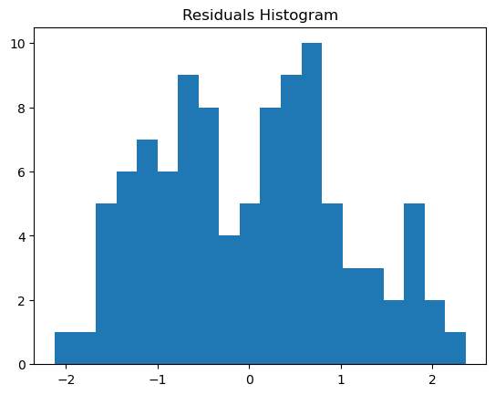

# 통계학에서 정규성 검정의 응용

정규성 검정은 통계 분석의 필수적인 부분이다. 흔히 쓰는 많은 통계 방법이 자료가 정규분포를 따른다는 가정에 기대기 때문이다.

## 언제 정규성 검정을 적용하는가

정규성 검정은 보통 정규성을 가정하는 모수적 통계 방법을 쓰기 전에 적용한다. 흔한 상황은 다음과 같다.

- **$t$ 검정**: 일표본과 이표본 $t$ 검정 모두 각 집단 안의 자료가 정규분포를 따른다고 가정한다.
- **분산분석**: 분산분석은 집단들에 걸쳐 잔차가 정규분포를 따른다고 가정한다.
- **선형회귀**: 회귀분석은 모형의 잔차(오차)가 정규분포를 따른다고 가정한다.
- **신뢰구간**: 모수의 신뢰구간을 만들 때, 특히 표본이 작을 때 정규성을 흔히 가정한다.

정규성 검정은 이런 방법을 쓰는 것이 적절한지, 아니면 대안(변수변환이나 비모수 검정)을 고려해야 하는지 판단하는 데 유용하다.

## 사례 1: t 검정 가정의 정규성 확인

이표본 $t$ 검정은 각 표본 안의 자료가 정규분포를 따른다고 가정한다. $t$ 검정을 수행하기 전에 두 집단의 정규성을 확인하는 것이 필수적이다.

<div class="exbox" markdown>

**보기 1.** <span class="diff easy" title="쉬움"></span> 정규성은 통과했는데 $t$ 검정이 기각하지 못한다. $\mathcal{N}(0,1)$과 $\mathcal{N}(0.5,1)$에서 각각 50개를 뽑아, 두 집단의 정규성을 확인한 뒤 이표본 $t$ 검정을 수행한다.

**(1)** 두 집단의 샤피로–윌크 $p$값과 $t$ 검정의 $p$값을 구하시오. 참 평균차가 $0.5$인데도 5% 수준에서 기각하지 못한다. 이 설계의 **이론 검정력**을 비중심 $t$ 분포로 계산해 그것이 뜻밖의 일이 아님을 보이시오. 검정력 80%를 얻으려면 집단당 몇 개가 필요한가.

**(2)** 이 코드는 정규성 검정의 결과에 따라 $t$ 검정과 비모수 검정 가운데 하나를 고른다. 널리 쓰이는 관행이지만 무엇이 문제인가.

</div>

??? success "풀이"

    **(1) 먼저 코드를 그대로 돌린다.**

    ```python
    import numpy as np
    from scipy.stats import ttest_ind, shapiro

    np.random.seed(0)

    # 두 집단 모두 실제로 정규분포에서 나왔다.
    group1 = np.random.normal(0, 1, 50)
    group2 = np.random.normal(0.5, 1, 50)

    # 집단마다 따로 검정한다. t 검정이 요구하는 것은 각 집단의 정규성이다.
    _, p_value_group1 = shapiro(group1)
    _, p_value_group2 = shapiro(group2)

    # 검정 결과에 따라 다음 절차를 고르는 흐름이다. 다만 이렇게 자료를 보고
    # 검정을 고르면 최종 p-값이 명목수준보다 커진다는 점은 알고 있어야 한다.
    if p_value_group1 > 0.05 and p_value_group2 > 0.05:
        stat, p_value = ttest_ind(group1, group2)
        print(f"Two-sample t-test: p-value={p_value}")
    else:
        print("One or both groups fail the normality test. Consider using a non-parametric alternative.")
    ```

    출력:

    ```text
    Two-sample t-test: p-value=0.09856078338184512
    ```

    두 집단의 샤피로–윌크 $p$값은 각각 $0.877$과 $0.837$로 정규성 확인을 가뿐히 통과하고, 이어진 $t$ 검정의 $p$값은 $0.0986$이다. **정규성은 문제가 아니었다.** 자료는 실제로 정규분포에서 나왔고 검정도 그렇게 말한다. 기각하지 못한 것은 전혀 다른 이유다.

    **이론 검정력을 계산해 보자.** 참 효과크기는 $d = (\mu_2 - \mu_1)/\sigma = 0.5$이고, 등표본 이표본 $t$ 검정의 표준오차는 $\mathrm{SE} = \sigma\sqrt{2/n}$이므로 대립가설 아래 통계량은 비중심모수

    $$
    \delta = \frac{\mu_2 - \mu_1}{\sigma\sqrt{2/n}} = d\sqrt{\frac{n}{2}}
    $$

    를 갖는 자유도 $2n-2$의 비중심 $t$ 분포를 따른다. $n = 50$, $d = 0.5$에서

    $$
    \delta = 0.5\sqrt{25} = 2.5, \qquad \nu = 98
    $$

    이고, 양쪽 검정의 임계값은 $t_{0.975,\,98} = 1.9845$이다. 따라서 검정력은

    $$
    1 - \beta = P(T_{98,\,2.5} > 1.9845) + P(T_{98,\,2.5} < -1.9845) = 0.6969
    $$

    이다. 곧 **이 설계는 애초에 열 번 가운데 세 번은 놓치도록 되어 있었다.** 이번 표본이 그 세 번 가운데 하나였을 뿐이다.

    ```python
    import numpy as np
    from scipy import stats

    np.random.seed(0)
    group1 = np.random.normal(0, 1, 50)
    group2 = np.random.normal(0.5, 1, 50)

    W1, p1 = stats.shapiro(group1)
    W2, p2 = stats.shapiro(group2)
    print(f"Shapiro group1: W = {W1:.4f}, p = {p1:.4f}")
    print(f"Shapiro group2: W = {W2:.4f}, p = {p2:.4f}")

    t, p = stats.ttest_ind(group1, group2)
    diff = group2.mean() - group1.mean()
    sp = np.sqrt((group1.var(ddof=1) + group2.var(ddof=1)) / 2)
    se = sp * np.sqrt(2 / 50)
    print(f"표본 평균차 = {diff:.4f}  (참값 0.5),  SE = {se:.4f}")
    print(f"t = {t:.4f},  p = {p:.4f}")

    # 이론 검정력: 비중심 t 분포
    d, n, df = 0.5, 50, 98
    ncp = d * np.sqrt(n / 2)
    tc = stats.t.ppf(0.975, df)
    power = stats.nct.sf(tc, df, ncp) + stats.nct.cdf(-tc, df, ncp)
    print(f"ncp = {ncp:.2f},  t_crit = {tc:.4f},  이론 검정력 = {power:.4f}")

    for m in range(10, 300):
        nc, dd = d * np.sqrt(m / 2), 2 * m - 2
        q = stats.t.ppf(0.975, dd)
        if stats.nct.sf(q, dd, nc) + stats.nct.cdf(-q, dd, nc) >= 0.80:
            print(f"검정력 80% 에 필요한 집단당 표본 = {m}")
            break
    ```

    출력:

    ```text
    Shapiro group1: W = 0.9876, p = 0.8766
    Shapiro group2: W = 0.9866, p = 0.8366
    표본 평균차 = 0.3385  (참값 0.5),  SE = 0.2030
    t = -1.6677,  p = 0.0986
    ncp = 2.50,  t_crit = 1.9845,  이론 검정력 = 0.6969
    검정력 80% 에 필요한 집단당 표본 = 64
    ```

    손으로 구한 $\delta = 2.50$, $t_{0.975,98} = 1.9845$, 검정력 $0.6969$가 코드와 그대로 맞는다. 표본에서 실제로 관측된 평균차는 $0.3385$로 참값 $0.5$보다 작게 나왔고, $\mathrm{SE} = 0.2030$으로 나누면 $0.3385/0.2030 = 1.668$이 되어 임계값 $1.9845$에 미치지 못한다. **검정력 80%를 원하면 집단당 64개**가 필요하다.

    **(2) 자료를 보고 검정을 고르면 최종 수준이 명목값에서 벗어난다.** 보고되는 $p$값은 "$t$ 검정을 쓰기로 미리 정했을 때"의 귀무분포에서 계산된 것인데, 실제로 수행된 절차는 "샤피로–윌크를 먼저 돌려 통과하면 $t$ 검정, 아니면 만–휘트니"라는 **두 단계 복합 절차**다. 복합 절차의 귀무분포는 $t$ 분포도 아니고 만–휘트니의 귀무분포도 아니다. 1단계의 선택이 같은 자료에 의존하므로 두 단계가 독립이 아니고, 그래서 최종 제1종 오류율이 $0.05$에서 비껴난다.

    더 실용적인 문제도 있다. 1단계의 검정력은 $n$에 지배되므로 **작은 표본에서는 무엇을 뽑아도 통과하고 큰 표본에서는 실무상 무해한 이탈도 걸러 낸다.** 곧 이 분기 규칙은 "자료가 정규인가"가 아니라 "표본이 큰가"에 따라 갈라진다. 정작 비모수 대안이 절실한 작은 표본에서 가장 쓸모가 없는 셈이다.

    실무에서는 ① 분석 방법을 자료를 보기 전에 정하거나, ② 두 결과를 모두 보고하거나, ③ 애초에 정규성에 덜 의존하는 절차(부트스트랩, 웰치 $t$)를 기본값으로 두는 편이 낫다.

한 집단이라도 정규성 검정을 통과하지 못하면 **Mann-Whitney U 검정** 같은 비모수 대안을 써야 한다.

!!! warning "정규성 검정 결과로 분석을 분기하는 것의 위험"
    위 코드처럼 "정규성 검정을 통과하면 $t$ 검정, 아니면 비모수 검정"으로 자동 분기하는 것은 널리 쓰이는 관행이지만 문제가 있다. 최종 검정의 선택이 같은 자료에 의존하게 되어 실제 제1종 오류율이 명목값에서 벗어난다. 실무에서는 사전에 분석 방법을 정하거나, 두 결과를 모두 보고하는 편이 낫다.

## 사례 2: 선형회귀 잔차의 정규성

선형회귀에서는 잔차(관측값과 예측값의 차이)가 정규분포를 따른다고 가정한다. 잔차에 정규성 검정을 적용하여 이 가정이 성립하는지 확인할 수 있다.

<div class="exbox" markdown>

**보기 2.** <span class="diff easy" title="쉬움"></span> 정규성은 $y$ 가 아니라 잔차의 성질이다. $X \sim \mathcal{N}(0,1)$, $y = 2X + \varepsilon$, $\varepsilon \sim \mathcal{N}(0,1)$로 $n = 100$을 만들어 최소제곱 적합의 잔차에 샤피로–윌크를 건다.

**(1)** 잔차의 $p$값을 구하시오. 같은 자료의 **반응변수 $y$** 에 똑같이 샤피로–윌크를 걸면 어떻게 되는가. $y$의 분포를 해석적으로 구해 그 결과를 설명하시오.

**(2)** (1)의 결과 때문에 **이 모의자료로는 "$y$ 가 아니라 잔차"라는 요점을 보일 수 없다.** 설계를 어떻게 바꾸면 보일 수 있는가. 수로 보이시오.

**(3)** 풀이의 히스토그램이 정규성 판정에 얼마나 쓸모가 있는가.

</div>

??? success "풀이"

    **(1) 쪽의 코드를 그대로 돌린다.**

    ```python
    import numpy as np
    import statsmodels.api as sm
    import matplotlib.pyplot as plt
    from scipy.stats import shapiro

    # 오차를 정규분포에서 만들었으므로 잔차도 정규여야 한다.
    np.random.seed(0)
    X = np.random.normal(0, 1, 100)
    y = 2 * X + np.random.normal(0, 1, 100)

    X = sm.add_constant(X)
    model = sm.OLS(y, X).fit()

    # 회귀에서 정규성을 요구받는 것은 반응변수 y 가 아니라 잔차다.
    # y 자체는 X 에 따라 중심이 옮겨 다니므로 정규일 까닭이 없다.
    residuals = model.resid
    _, p_value = shapiro(residuals)

    print(f"Shapiro-Wilk Test on Residuals: p-value={p_value}")

    # 검정과 그림을 함께 본다.
    plt.hist(residuals, bins=20)
    plt.title('Residuals Histogram')
    plt.show()

    if p_value > 0.05:
        print("Residuals are normally distributed.")
    else:
        print("Residuals are not normally distributed.")
    ```

    출력:

    ```text
    Shapiro-Wilk Test on Residuals: p-value=0.11418410564039025
    Residuals are normally distributed.
    ```

    

    잔차는 $p = 0.114$로 정규성 확인을 통과한다. 오차를 정규분포에서 만들었으니 당연한 결과다. (엄밀히 말하면 "잔차가 정규분포를 따른다"가 아니라 "잔차가 정규성과 일관된다"가 옳은 표현이다. 기각하지 못한 것이 정규성을 증명하지는 않는다.)

    **그런데 같은 자료의 $y$ 에 걸어도 통과한다.** 해석적으로 당연하다. $X \sim \mathcal{N}(0,1)$과 $\varepsilon \sim \mathcal{N}(0,1)$이 독립이므로 둘의 선형결합은 다시 정규이고

    $$
    y = 2X + \varepsilon \sim \mathcal{N}\bigl(0,\ 2^2 \cdot 1 + 1\bigr) = \mathcal{N}(0, 5)
    $$

    이다. 표준편차는 $\sqrt{5} = 2.2361$이다. 곧 **이 설계에서는 $y$ 도 엄밀히 정규**이고, 샤피로–윌크가 통과시키는 것이 옳다.

    **(2) 그러므로 코드 주석의 "$y$ 자체는 정규일 까닭이 없다"는 말은 이 자료로 확인되지 않는다.** 주석이 겨냥한 요점 자체는 맞다. 회귀에서 정규성을 요구받는 것은 조건부 분포 $y \mid X$이고, 주변분포 $y$는 $X$의 분포가 섞여 들어간 것이라 일반적으로 정규가 아니다. 다만 $X$를 **정규에서 뽑으면** 그 섞임이 다시 정규가 되어 차이가 사라진다. 요점을 보이려면 $X$를 비정규로 두어야 한다.

    $X \sim \text{Exponential}(1)$로 바꾸면 갈라진다.

    ```python
    import numpy as np
    import statsmodels.api as sm
    from scipy import stats

    # --- 같은 자료에서 y 와 잔차를 모두 검정한다.
    np.random.seed(0)
    X = np.random.normal(0, 1, 100)
    y = 2 * X + np.random.normal(0, 1, 100)
    resid = sm.OLS(y, sm.add_constant(X)).fit().resid

    print(f"X ~ N(0,1) 일 때")
    print(f"  y    shapiro p = {stats.shapiro(y)[1]:.4f},  y 표준편차 = {y.std(ddof=1):.4f}"
          f"  (이론 sqrt(5) = {np.sqrt(5):.4f})")
    print(f"  잔차 shapiro p = {stats.shapiro(resid)[1]:.4f}")
    print(f"  잔차 g1 = {stats.skew(resid):+.4f}, g2 = {stats.kurtosis(resid):+.4f}"
          f"   (bias=True 기본값)")

    # --- X 를 치우친 분포로 바꾸면 y 와 잔차가 갈라진다.
    rng = np.random.default_rng(0)
    Xs = rng.exponential(1.0, 100)
    ys = 2 * Xs + rng.normal(0, 1, 100)
    rs = sm.OLS(ys, sm.add_constant(Xs)).fit().resid

    print(f"X ~ Exp(1) 일 때")
    print(f"  y    shapiro p = {stats.shapiro(ys)[1]:.3g},  g1 = {stats.skew(ys):+.4f}")
    print(f"  잔차 shapiro p = {stats.shapiro(rs)[1]:.4f},  g1 = {stats.skew(rs):+.4f}")
    ```

    출력:

    ```text
    X ~ N(0,1) 일 때
      y    shapiro p = 0.7502,  y 표준편차 = 2.3783  (이론 sqrt(5) = 2.2361)
      잔차 shapiro p = 0.1142
      잔차 g1 = +0.2096, g2 = -0.7378   (bias=True 기본값)
    X ~ Exp(1) 일 때
      y    shapiro p = 0.000578,  g1 = +0.9816
      잔차 shapiro p = 0.2509,  g1 = -0.3300
    ```

    해석적으로 구한 $y$의 표준편차 $\sqrt 5 = 2.236$이 표본값 $2.378$과 맞는다($n = 100$에서 표준편차 추정의 상대 표준오차가 약 $1/\sqrt{2n} = 7\%$이므로 $6\%$ 차이는 그 안이다).

    아래 두 줄이 요점이다. $X$를 지수분포에서 뽑으면 $y$의 표본왜도가 $g_1 = +0.98$이 되어 샤피로–윌크가 $p = 0.00058$로 **기각**하지만, 같은 적합의 잔차는 $p = 0.251$로 통과한다. 모형은 조금도 틀리지 않았다. 오차는 여전히 정규이고 선형성도 성립한다. **$y$ 에 정규성 검정을 걸었다면 멀쩡한 모형을 버렸을 것이다.** 치우친 설명변수는 통계학에서 예외가 아니라 보통이다(소득, 거래량, 인구).

    왜도·첨도는 판본을 밝혀야 수가 맞는다. 위 값은 모두 `scipy.stats.skew`·`kurtosis`의 기본값이므로 보정하지 않은 $g_1$과 초과첨도 $g_2$다. pandas `.skew()`를 쓰면 보정판 $G_1$이 나와 값이 조금 달라진다.

    **(3) 히스토그램은 이 판정에 거의 쓸모가 없다.** $n = 100$에 구간을 20개 주었으니 구간마다 평균 5개다. 포아송 변동만으로도 높이가 $\pm\sqrt5 \approx \pm 2.2$, 곧 $\pm 45\%$씩 흔들리므로 들쭉날쭉한 모양이 자료의 성질인지 구간 분할의 잡음인지 분간할 수 없다. 실제로 잔차의 초과첨도는 $g_2 = -0.74$로 정규보다 다소 납작한데, 이것이 참인 성질이 아니라 표본 변동임을 히스토그램만으로는 알 수 없다. 정규성 진단에는 Q-Q 그림이 낫다. 구간을 나누지 않으므로 분할 선택에 흔들리지 않고, 벗어남이 어느 분위수에서 생기는지도 함께 보여 준다.

잔차가 정규분포를 따르지 않으면 회귀분석 결과를 믿기 어려워질 수 있으며, 변수변환이나 대안 회귀모형 같은 교정 조치가 필요할 수 있다.

## 사례 3: 분산분석의 정규성

**분산분석**은 집단들에 걸친 자료의 잔차가 정규분포를 따른다고 가정한다. 이 가정이 위배되면 분산분석의 결과가 오도할 수 있다.

<div class="exbox" markdown>

**보기 3.** <span class="diff easy" title="쉬움"></span> 집단별로 세 번 검정하는 것과 잔차 하나를 검정하는 것. $\mathcal{N}(0,1)$, $\mathcal{N}(0.5,1)$, $\mathcal{N}(1,1)$에서 각각 30개를 뽑아 집단마다 샤피로–윌크를 돌린 뒤 일원분산분석을 수행한다.

**(1)** 세 집단의 $p$값과 분산분석의 $F$, $p$를 구하시오. 분산분석이 요구하는 정규성은 집단별 자료가 아니라 **잔차**의 것이다. 집단평균을 뺀 잔차 하나($n = 90$)에 검정을 걸면 결론이 같은가.

**(2)** 중심화하지 **않고** 그냥 통합한 자료에 검정을 걸면 어떻게 되는가. 이 자료에서는 통과한다. 왜 그런지 설명하고, 집단 평균을 간격 $d$로 벌려 가며 언제 깨지는지 수로 보이시오.

**(3)** 간격이 $d$인 등간격 3성분 정규혼합의 **초과첨도를 닫힌 꼴로** 구하고 (2)의 모의값과 맞추시오.

</div>

??? success "풀이"

    **(1) 쪽의 코드를 그대로 돌린다.**

    ```python
    import numpy as np
    from scipy.stats import f_oneway, shapiro

    np.random.seed(0)

    # 세 집단의 평균은 다르지만 분산은 같다.
    group1 = np.random.normal(0, 1, 30)
    group2 = np.random.normal(0.5, 1, 30)
    group3 = np.random.normal(1, 1, 30)

    # 분산분석에서도 정규성은 잔차에 요구된다. 집단마다 평균을 뺀 값이
    # 곧 잔차이므로, 집단별로 검정하는 것이 그 일을 대신한다.
    _, p_value_group1 = shapiro(group1)
    _, p_value_group2 = shapiro(group2)
    _, p_value_group3 = shapiro(group3)

    # 자료가 정규인지 확인한다
    if p_value_group1 > 0.05 and p_value_group2 > 0.05 and p_value_group3 > 0.05:
        # 분산분석 수행
        stat, p_value = f_oneway(group1, group2, group3)
        print(f"ANOVA test: p-value={p_value}")
    else:
        print("One or more groups fail the normality test. Consider using a non-parametric alternative.")
    ```

    출력:

    ```text
    ANOVA test: p-value=0.039981492411499175
    ```

    **(3) 닫힌 꼴 먼저.** 세 집단의 평균이 $-d$, $0$, $d$이고(위치 이동은 첨도를 바꾸지 않으므로 간격만 중요하다) 각 성분이 분산 1인 정규라 하자. 집단을 고르는 확률변수를 $M$($\{-d,0,d\}$에 각각 $1/3$), 집단 안 변동을 $Z \sim \mathcal{N}(0,1)$이라 두면 통합 자료는 $X = M + Z$이고 둘은 독립이다. $E[M] = E[M^3] = 0$, $E[M^2] = \tfrac23 d^2$, $E[M^4] = \tfrac23 d^4$이므로

    $$
    \operatorname{Var}(X) = E[M^2] + 1 = 1 + \tfrac{2}{3}d^2
    $$

    이고, 홀수 적률이 사라지는 것을 쓰면

    $$
    E[X^4] = E[M^4] + 6E[M^2]E[Z^2] + E[Z^4] = \tfrac{2}{3}d^4 + 4d^2 + 3
    $$

    이다. 따라서 초과첨도는

    $$
    \gamma_2(d) = \frac{\tfrac{2}{3}d^4 + 4d^2 + 3}{\bigl(1 + \tfrac{2}{3}d^2\bigr)^2} - 3 .
    $$

    $d = 0$이면 $3/1 - 3 = 0$으로 정규가 되고, $d \to \infty$이면 $\tfrac23 d^4 / \tfrac49 d^4 - 3 = \tfrac32 - 3 = -\tfrac32$로 간다. **상한이 $-1.5$라는 것이 요점이다.** 평균을 벌려 통합하면 꼬리가 두꺼워지는 것이 아니라 가운데가 평평해진다. 비정규성이 **납작한 쪽**으로 생긴다.

    **(1)(2) 수치 확인.**

    ```python
    import numpy as np
    from scipy import stats

    np.random.seed(0)
    g1 = np.random.normal(0, 1, 30)
    g2 = np.random.normal(0.5, 1, 30)
    g3 = np.random.normal(1, 1, 30)

    for name, g in [("group1", g1), ("group2", g2), ("group3", g3)]:
        W, p = stats.shapiro(g)
        print(f"{name}: W = {W:.4f}, p = {p:.4f},  평균 = {g.mean():+.4f},"
              f"  표준편차 = {g.std(ddof=1):.4f}")

    F, p = stats.f_oneway(g1, g2, g3)
    print(f"F = {F:.4f}, p = {p:.4f},  임계 F(2, 87) = {stats.f.ppf(0.95, 2, 87):.4f}")

    # 분산분석이 요구하는 것은 집단평균을 뺀 잔차의 정규성이다.
    resid = np.concatenate([g - g.mean() for g in (g1, g2, g3)])
    print(f"집단중심화 잔차 (n = {resid.size}): shapiro p = {stats.shapiro(resid)[1]:.4f}")

    # 중심화하지 않고 그냥 통합하면?
    raw = np.concatenate([g1, g2, g3])
    print(f"중심화 안 한 통합자료:   shapiro p = {stats.shapiro(raw)[1]:.4f}")

    # 평균 간격을 d, 2d 로 벌려 가며 본다.
    print("\n평균간격 d   통합자료 shapiro p   표본 g2    닫힌꼴 초과첨도")
    for d in [0, 1, 2, 3, 4]:
        pooled = np.concatenate([resid[:30], resid[30:60] + d, resid[60:] + 2 * d])
        closed = ((2 / 3) * d**4 + 4 * d**2 + 3) / (1 + (2 / 3) * d**2) ** 2 - 3
        print(f"   {d}        {stats.shapiro(pooled)[1]:>10.2e}      "
              f"{stats.kurtosis(pooled):+.3f}      {closed:+.3f}")
    ```

    출력:

    ```text
    group1: W = 0.9695, p = 0.5254,  평균 = +0.4429,  표준편차 = 1.1003
    group2: W = 0.9835, p = 0.9085,  평균 = +0.2105,  표준편차 = 0.9142
    group3: W = 0.9763, p = 0.7204,  평균 = +0.8663,  표준편차 = 0.9650
    F = 3.3415, p = 0.0400,  임계 F(2, 87) = 3.1013
    집단중심화 잔차 (n = 90): shapiro p = 0.9106
    중심화 안 한 통합자료:   shapiro p = 0.8701

    평균간격 d   통합자료 shapiro p   표본 g2    닫힌꼴 초과첨도
       0          9.11e-01      -0.023      +0.000
       1          9.00e-01      +0.281      -0.240
       2          8.11e-01      -0.549      -0.793
       3          6.25e-02      -0.989      -1.102
       4          2.49e-03      -1.194      -1.254
    ```

    **(1) 결론은 같다.** 집단별 $p$값은 $0.525$, $0.909$, $0.720$이고 집단중심화 잔차 하나($n = 90$)의 $p$값은 $0.911$로, 모두 넉넉히 통과한다. 분산분석은 $F = 3.3415$로 임계값 $F_{0.95}(2,87) = 3.1013$을 겨우 넘어 $p = 0.0400$을 준다. 5% 수준에서 기각하지만 **임계값과의 여유가 $0.24$뿐**이라 결론이 단단하다고 말하기는 어렵다. 집단 표준편차도 $1.100$, $0.914$, $0.965$로 가장 큰 쪽이 가장 작은 쪽의 $1.20$배에 그쳐 등분산 가정에 무리가 없다.

    집단별 세 번과 잔차 한 번 가운데 **원칙에 맞는 것은 잔차 한 번**이다. 분산분석 모형 $y_{ij} = \mu + \alpha_i + \varepsilon_{ij}$에서 정규성을 요구받는 것은 $\varepsilon_{ij}$뿐이다. 실무적 차이도 있다. 집단별로 세 번 검정하면 세 번 다 통과해야 하므로 **전체 제1종 오류율이 부풀고**(독립이라 가정하면 $1 - 0.95^3 = 14.3\%$), 집단 수가 늘면 더 나빠진다. 게다가 집단마다 $n = 30$으로 쪼개므로 검정력도 낮다. 잔차를 모아 한 번 검정하면 $n = 90$을 다 쓰고 검정도 한 번이다.

    **(2) 중심화하지 않아도 이 자료에서는 통과한다($p = 0.870$).** 집단 평균이 $0.211$부터 $0.866$까지, 곧 $\sigma = 1$에 비해 $0.66$만큼만 떨어져 있어서다. 성분이 이렇게 겹치면 혼합이 단봉인 정규와 거의 구별되지 않는다. (3)의 닫힌 꼴에 등간격 근사 $d = (0.8663 - 0.2105)/2 = 0.328$을 넣으면 $\gamma_2 = -0.0067$로, 정규에서 사실상 떨어져 있지 않다.

    간격을 벌리면 깨진다. 표에서 $d = 2$까지는 $p$가 $0.8$ 위에 머물다가 $d = 3$에서 $0.0625$로 내려오고 $d = 4$에서 $0.0025$로 기각된다. **$\sigma$의 세 배쯤 떨어져야 비로소 샤피로–윌크가 알아챈다**는 뜻이고, $n = 90$에서도 그렇다. 그런데 중심화한 잔차는 이 모든 경우에 **똑같다** — 집단 평균을 어디로 옮기든 잔차는 변하지 않으므로 $p = 0.9106$이 그대로다. 이것이 중심화해야 하는 이유다. 중심화하지 않으면 **집단 평균의 차이, 곧 분산분석이 찾으려는 바로 그 효과**를 비정규성으로 오인한다.

    **(3) 닫힌 꼴과 모의값의 대조.** 표의 마지막 두 열이다.

    | $d$ | 닫힌 꼴 $\gamma_2$ | 표본 $g_2$ ($n=90$) |
    |---|---|---|
    | 0 | $+0.000$ | $-0.023$ |
    | 1 | $-0.240$ | $+0.281$ |
    | 2 | $-0.793$ | $-0.549$ |
    | 3 | $-1.102$ | $-0.989$ |
    | 4 | $-1.254$ | $-1.194$ |

    추세가 맞고 $d \ge 2$에서는 값도 가깝다. $d = 1$의 $0.52$ 차이가 눈에 걸리지만 $n = 90$에서 초과첨도의 귀무 표준오차가 $\sqrt{24/n} = \sqrt{24/90} = 0.516$이므로 1 표준오차 안이다. **표본 하나로 첨도를 재면 이만큼 흔들린다.** 추세를 보려면 표본 하나가 아니라 닫힌 꼴이 필요하다는 것이 이 대조의 교훈이다.

    (닫힌 꼴은 몬테카를로로도 확인했다. $4\times10^6$개를 뽑으면 $d = 1,2,3,4$에서 각각 $-0.2388$, $-0.7946$, $-1.1023$, $-1.2536$이 나와 닫힌 꼴 $-0.2400$, $-0.7934$, $-1.1020$, $-1.2539$와 소수 둘째 자리까지 맞는다.) 표본 $g_2$는 `scipy.stats.kurtosis`의 기본값이므로 보정하지 않은 초과첨도다.

세 집단의 샤피로–윌크 $p$값은 각각 $0.525$, $0.909$, $0.720$으로 모두 정규성 확인을 통과하고, 분산분석은 $p = 0.040$으로 5% 수준에서 집단 평균의 차이를 탐지한다.

분산분석을 적용하기 전에 Shapiro-Wilk 검정으로 각 집단의 자료가 정규분포를 따르는지 확인한다. 한 집단 이상이 검정을 통과하지 못하면 **Kruskal-Wallis 검정** 같은 비모수 대안이 더 적절할 수 있다.

## 결론

정규성 검정은 $t$ 검정, 분산분석, 선형회귀 같은 모수적 방법을 쓰는 여러 응용에서 결정적이다. 자료(또는 잔차)가 정규분포를 따르는지 확인해야 이 방법들이 타당한 결과를 낸다. 정규성 가정이 위배되면 변수변환이나 비모수 대안을 적용할 수 있다. 실무에서는 정규성 검정을 시각적 평가와 결합할 때 바탕 자료 분포를 더 뚜렷하게 파악할 수 있다.

## 연습문제

<div class="drillbox" markdown>

**연습문제 1.** <span class="diff med" title="중간"></span>
어떤 연구자가 관측값 $n = 15$개에 일표본 t 검정을 수행하여 $t = 2.35$를 얻었다. 결과를 해석하기 전에 정규성을 확인해야 한다. 그 이유를 설명하고, 자료가 심하게 치우쳐 있다면 무엇이 잘못될 수 있는지 기술하라.

</div>

??? success "풀이"
    일표본 t 검정은 자료가 정규분포에서 온다고 가정한다(또는 $n$이 중심극한정리를 쓸 만큼 크다고 가정한다). $n = 15$이면 자료가 심하게 치우쳐 있을 때 중심극한정리가 충분한 근사를 제공하지 못할 수 있다.

    자료가 오른쪽으로 치우쳐 있으면 $\bar{X}$의 표집분포도 치우치며 t 분포가 나쁜 근사가 된다. 그러면 (1) p값이 틀리고(실제 제1종 오류율이 명목 $\alpha$와 다르다), (2) 신뢰구간의 포함확률이 틀리며, (3) 실제 효과를 탐지할 검정력이 떨어진다. 치우침이 심하고 $n = 15$라면 비모수 검정(Wilcoxon 부호순위)이나 붓스트랩 검정이 더 믿을 만하다.

<div class="drillbox" markdown>

**연습문제 2.** <span class="diff med" title="중간"></span>
정규성 가정에 기대는 통계 방법 세 가지를 들고 각각이 비정규성에 얼마나 로버스트한지 서술하라.

</div>

??? success "풀이"

    1. **평균에 대한 t 검정:** 중간 정도로 로버스트하다. $n \geq 30$이고 치우침이 중간 정도이면 중심극한정리가 근사적 타당성을 보장한다. 작은 표본에서 두꺼운 꼬리나 극단적 이상점에는 로버스트하지 않다.

    2. **분산의 동일성에 대한 F 검정:** 로버스트하지 않다. F 검정은 비정규성에 매우 민감하여 가벼운 이탈만으로도 제1종 오류율이 심각하게 부풀려질 수 있다. Levene 검정이나 Brown-Forsythe 검정이 선호되는 대안이다.

    3. **선형회귀(OLS):** OLS 추정값 자체는 정규성 없이도 타당하다(불편, BLUE). 그러나 추론(t 검정, F 검정, 신뢰구간)에는 오차의 정규성이나 큰 $n$이 필요하다. 예측구간은 비정규성에 특히 민감하다.

<div class="drillbox" markdown>

**연습문제 3.** <span class="diff med" title="중간"></span>
통계검정을 수행하기 전에 정규성을 확인하는 실용적 절차를 설명하라.

</div>

??? success "풀이"
    권장 절차:

    1. **먼저 시각적으로 점검한다:** 자료(회귀에서는 잔차)의 히스토그램이나 밀도 그림과 Q-Q 그림을 만든다. 치우침, 두꺼운 꼬리, 이상점, 다봉성을 살핀다.

    2. **형식적 검정:** 시각적 방법을 보완하기 위해 정규성 검정을 적용한다($n < 50$이면 Shapiro-Wilk, 더 큰 표본에는 Anderson-Darling이나 D'Agostino).

    3. **결과를 함께 해석한다:** Q-Q 그림이 대략 선형이고 형식적 검정이 합리적인 수준에서 기각하지 않으면 정규론 방법으로 진행한다. 둘 다 비정규성을 시사하면 대안을 고려한다.

    4. **필요하면 대책을 고른다:** 변환(로그, Box-Cox), 비모수 검정, 붓스트랩 방법을 적용한다.

    5. **평가를 보고한다:** 정규성이 뒷받침되더라도 어떤 정규성 확인을 수행했고 그 결과가 무엇이었는지 서술한다.

<div class="drillbox" markdown>

**연습문제 4.** <span class="diff med" title="중간"></span>
큰 표본($n = 5000$)에서 Shapiro-Wilk 검정이 $p < 0.001$로 정규성을 기각했지만 Q-Q 그림은 거의 선형으로 보인다. 어떻게 진행해야 하는가?

</div>

??? success "풀이"
    $n = 5000$이면 형식적 검정의 검정력이 극도로 높아, 추론에 실질적 영향이 없는 사소한 이탈까지 탐지한다. Shapiro-Wilk $p < 0.001$은 자료가 정규에서 "멀다"는 뜻이 아니라 그 이탈이 통계적으로 탐지 가능하다는 뜻이다.

    Q-Q 그림이 거의 선형이므로 이탈은 작을 가능성이 높다. 다음과 같이 진행한다.

    1. **정규론 방법으로 진행한다:** $n = 5000$이면 중심극한정리의 보호가 강력하여 약간의 비정규성이 있어도 t 검정, 분산분석, 회귀 추론이 매우 정확하다.
    2. **두 결과를 모두 보고한다:** 형식적 검정은 정규성을 기각했지만 시각적 점검은 근사적 정규성을 시사한다고 밝힌다.
    3. **효과 크기를 고려한다:** 이분법적 기각/비기각 판정에 기대는 대신 왜도와 첨도 계수로 비정규성의 정도를 수량화한다.

---

## 정리하며

정규성 확인이 **어디에 필요한지**를 정리한다.

| 절차 | 정규성 필요도 | 대안 |
|---|---|---|
| $t$ 검정 | 낮음(대표본에서 강건) | 만–휘트니, 부트스트랩 |
| 분산분석 | 낮음 | 크루스칼–월리스, 웰치 |
| 회귀 계수 추론 | 낮음 | 로버스트 표준오차, 부트스트랩 |
| **분산 추론** | **높음** | 레빈, 부트스트랩 |
| **예측구간** | **높음** | 분위수 회귀, 부트스트랩 |

- **평균에 기반한 절차는 중심극한정리의 보호를 받는다.** 그래서 정규성 위반에 비교적 관대하다.
- **분산과 꼬리에 관한 절차는 그렇지 않다.** 4차적률에 의존하며 **표본을 늘려도 나아지지 않는다.** 이 책에서 여러 번 확인한 비대칭이다.
- **검정 결과를 판정 규칙으로 쓰지 않는다.** 그림으로 이탈의 모양과 크기를 보고, 쓰려는 절차의 강건성에 비추어 판단한다.
- **의심스러우면 여러 방법으로 돌려 본다.** 결론이 일치하면 안심할 수 있고, 갈리면 그 사실 자체가 보고할 내용이다.

**이것으로 14장이 끝난다.** 정규성의 뜻과 필요한 자리, 시각적·수치적·형식적 진단, 검정의 한계, 그리고 위반했을 때의 세 가지 대처(변환·부트스트랩·비모수)를 보았다.

다음 장 **분산 검정**으로 넘어간다. 이 장에서 거듭 확인한 "분산 추론은 정규성에 취약하다"는 사실을 정면으로 다룬다.
