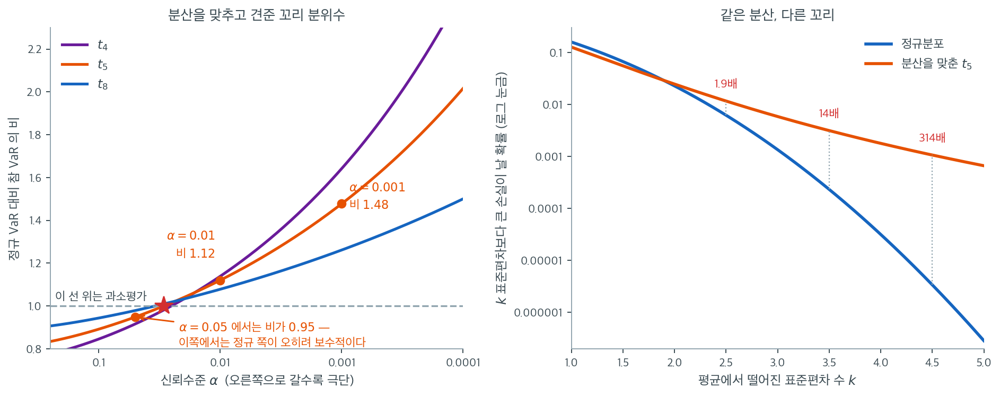

# 금융 수익률의 정규성

## 동기

금융 수익률은 응용통계학에서 가장 많이 연구된 자료 가운데 하나이며, 그것이 정규분포를 따르는지에 대한 질문은 깊은 함의를 갖는다. 포트폴리오 최적화, 옵션 가격결정, 위험 관리가 모두 수익률 분포에 대한 가정에 의존한다. 수익률이 정규라면 많은 문제에 닫힌 형태의 해가 존재한다. 그렇지 않다면 그 해들이 위험을 과소평가하여 나쁜 결정으로 이어질 수 있다. 이 절은 수익률 분포에 대한 경험적 증거와 그 결과를 살펴본다.

## 로그수익률과 정규 모형

한 기간 동안 자산의 **로그수익률**(연속복리 수익률)은

$$
r_t = \ln\left(\frac{P_t}{P_{t-1}}\right)
$$

여기서 $P_t$는 시점 $t$의 자산 가격이다. 정규 모형은 다음을 가정한다.

$$
r_t \overset{\text{iid}}{\sim} N(\mu, \sigma^2)
$$

이 모형은 (정규의 합이 정규이므로) 다기간 수익률도 정규임을 뜻하며, 가격 과정이 기하 브라운 운동을 따름을 함의한다.

$$
\ln P_T - \ln P_0 = \sum_{t=1}^{T} r_t \sim N(T\mu, T\sigma^2)
$$

정규 모형은 수학적으로 편리하지만 경험 자료는 그 예측을 일관되게 위배한다.

## 정규성에 반하는 경험적 증거

### 두꺼운 꼬리

가장 견고한 경험적 발견은 금융 수익률 분포가 정규분포보다 **두꺼운 꼬리**를 갖는다는 것이다. 수익률이 정말로 평균 $\mu$, 표준편차 $\sigma$인 정규분포를 따른다면 평균에서 4 표준편차 넘게 벗어날 확률은

$$
P(|r_t - \mu| > 4\sigma) \approx 6.3 \times 10^{-5}
$$

곧 일간 자료로 약 63년에 한 번이다. 실제로 그런 사건은 훨씬 자주 일어난다. 1987년 10월 19일 주식시장 붕괴 때 일간 수익률이 약 $-22\%$였는데, 이는 정규 모형에서 대략 20 표준편차에 해당하며 사실상 확률이 0인 사건이다.

일간 주식 수익률의 **초과첨도**는 흔히 3에서 50 사이로, 정규분포의 0보다 훨씬 크다. 정규분포와 비교하여 꼬리와 중앙에 질량이 더 많고 그 중간 구역에는 더 적다는 뜻이다.

### 음의 왜도

주식 수익률은 **음의 왜도**를 보이는 경향이 있다. 같은 크기의 큰 양의 수익률보다 큰 음의 수익률이 더 흔하다는 뜻이다. 이 비대칭은 정규분포의 대칭성을 위배한다. 일간 주식 수익률의 전형적인 왜도 값은 $-0.5$에서 $-1.0$ 사이이다.

### 변동성 군집

수익률은 **변동성 군집**을 보인다. (부호와 무관하게) 큰 수익률 뒤에 큰 수익률이, 작은 수익률 뒤에 작은 수익률이 따라오는 경향이 있다. 곧 $r_t$와 $r_{t+1}$은 근사적으로 무상관일 수 있어도 독립은 아니다. 형식적으로 $|r_t|$나 $r_t^2$의 자기상관이 여러 시차에서 유의하게 양수이다.

$$
\text{Corr}(r_t^2, r_{t+h}^2) > 0 \quad (h = 1, 2, \ldots)
$$

이 패턴은 정규 모형의 독립동일분포 가정을 위배하며, 분산이 시간에 따라 변하도록 허용하는 GARCH 같은 모형을 낳는다.

### 집계에 따른 정규화

수익률의 기간이 길어질수록(일간에서 주간, 월간, 연간으로) 수익률의 분포가 정규에 가까워진다. 이는 중심극한정리의 한 형태와 일관된다. 일간 수익률이 분산이 유한하고 약하게 종속되어 있다면 더 긴 기간의 합은 정규로 수렴한다. 다만 수렴이 느려서 월간 수익률조차 탐지 가능한 초과첨도를 보이는 일이 많다.

## 위험가치에 대한 함의

신뢰수준 $1 - \alpha$의 **위험가치**(VaR)는 확률 $\alpha$로 초과되는 손실 문턱값이다. 정규 모형에서는

$$
\text{VaR}_\alpha = -(\mu + z_\alpha \sigma)
$$

여기서 $z_\alpha$는 표준정규의 $\alpha$ 분위수이다. 정규분포가 꼬리 확률을 과소평가하므로 이 공식은 VaR를 체계적으로 과소평가한다.

예를 들어 1% 수준에서 정규 모형은 $z_{0.01} = -2.326$을 주므로

$$
\text{VaR}_{0.01} = -\mu + 2.326\,\sigma
$$

수익률이 실제로는 자유도 $\nu = 5$인 $t$ 분포를 따른다면(경험적으로 흔한 결과) 얼마나 달라질까?

!!! warning "분산을 맞추고 비교해야 한다"
    $t_5$ 분포의 1% 분위수는 $-3.365$이다. 이를 $z_{0.01} = -2.326$과 곧바로 비교하여 "45% 더 크다"고 말하는 것은 **틀렸다**. $t_5$의 분산은 1이 아니라 $\nu/(\nu-2) = 5/3$이므로 표준편차가 $1.291$이다. 두 분포의 분산을 맞춘 뒤 비교해야 공정하다.

    분산을 1로 표준화한 $t_5$의 1% 분위수는 $-3.365/1.291 = -2.607$이다. 정규의 $-2.326$보다 **12% 더 극단적**이다.

    다만 더 극단적인 수준으로 갈수록 격차가 빠르게 벌어진다.

    | $\alpha$ | 표준화한 $t_5$ 분위수 | 정규 $z_\alpha$ | 비 |
    |---|---|---|---|
    | 0.05 | $-1.561$ | $-1.645$ | 0.95 |
    | 0.01 | $-2.607$ | $-2.326$ | **1.12** |
    | 0.001 | $-4.565$ | $-3.090$ | **1.48** |

    5% 수준에서는 오히려 정규 쪽이 더 보수적이고(비 0.95), 1%에서 12%, 0.1%에서는 48% 과소평가가 된다. "정규 VaR가 꼬리 위험을 과소평가한다"는 명제는 **충분히 꼬리로 들어갔을 때** 성립하며, 그 정도는 신뢰수준에 크게 의존한다.

??? warning "정규 VaR는 꼬리 위험을 과소평가한다"
    VaR 계산에 정규분포를 쓰면 극단적 손실의 빈도와 크기를 체계적으로 과소평가하게 된다. Basel III 같은 규제 체계는 은행이 위험 모형에서 두꺼운 꼬리를 반영하도록 요구한다.

### 언제부터 과소평가가 되는가

위 표의 세 줄은 곡선 위의 세 점일 뿐이다. 곡선 전체를 그려 보면 "정규 VaR는 위험을 과소평가한다"는 명제가 조건부 명제임이 분명해진다.



왼쪽 칸의 가로축은 신뢰수준 $\alpha$이고 오른쪽으로 갈수록 극단으로 들어간다. 세로축은 참 VaR를 정규 VaR로 나눈 비이며, $1$보다 커야 정규 모형이 위험을 과소평가하는 것이다. $t_5$ 곡선(주황)이 $1$을 가로지르는 지점은 $\alpha = 0.029$다. 그보다 느슨한 수준 — 5%, 10% VaR — 에서는 비가 $1$보다 작아 **정규 모형이 오히려 더 보수적**이다. 꼬리가 두꺼운 분포는 같은 분산을 유지하려고 가운데를 좁게 모으기 때문에, 중간 정도의 분위수에서는 정규보다 덜 극단적이다.

$1\%$를 지나면서 상황이 뒤집힌다. $\alpha = 0.01$에서 비가 $1.12$, $\alpha = 0.001$에서 $1.48$이다. $t_4$(보라)처럼 꼬리가 더 두꺼우면 $0.001$ 수준에서 비가 $1.64$로 올라가고, $t_8$(파랑)처럼 가벼우면 $1.26$에 머문다. $0.0001$ 수준까지 내려가면 셋이 각각 $2.48$, $2.02$, $1.50$으로 벌어진다. **정규 가정의 위험은 신뢰수준과 꼬리의 두께에 함께 달려 있으며, 두 축 모두 극단으로 갈수록 빠르게 커진다.**

오른쪽 칸은 같은 사실을 규제 담당자의 언어로 옮긴 것이다. 평균에서 $k$ 표준편차 넘게 손실이 날 확률을 두 분포에서 비교하면, $k = 2.5$에서는 $1.9$배 차이에 불과하지만 $k = 3.5$에서 $14$배, $k = 4.5$에서 $314$배로 벌어진다. 앞 절에서 본 "4 표준편차 사건은 63년에 한 번"이라는 계산이 실제 시장에서 왜 그토록 빗나가는지가 이 비율에 들어 있다.

실무적 결론은 이렇다. 일상적인 $95\%$ VaR 보고서라면 정규 가정의 오차가 크지 않고 방향도 보수적인 쪽이다. 문제는 스트레스 테스트와 꼬리 위험 측정처럼 $99\%$ 너머로 들어가는 계산이다. 하필 그 영역에서 정규 가정의 오차가 가장 크고, 경험분위수로 그것을 대체하려 해도 표본이 부족해 추정이 가장 불안정하다.

## 수익률의 정규성 검정

수익률 계열이 정규분포를 따르는지 검정하려면 표준적인 정규성 검정을 적용한다.

1. **Jarque-Bera 검정**: 왜도와 첨도가 정규값과 맞는지 검정한다. 가장 두드러진 두 이탈을 직접 겨냥하므로 금융에서 가장 흔히 쓰인다.
2. **Shapiro-Wilk 검정**: 검정력이 높은 범용 정규성 검정.
3. **Anderson-Darling 검정**: 꼬리 이탈에 특히 민감하여 금융 자료에 잘 맞는다.
4. **Q-Q 그림**: 오른쪽 꼬리가 위로, 왼쪽 꼬리가 아래로 휘는 모습으로 두꺼운 꼬리를 시각적으로 드러낸다.

<div class="exbox" markdown>

**보기 1.** <span class="diff easy" title="쉬움"></span> 모집단 왜도가 0인데 표본왜도가 $+1.43$ 이다. 자유도 5인 $t$ 분포에 $0.01$을 곱해 일간 수익률 1000일을 만들고, 요약통계·정규성 검정·1% VaR를 함께 구한다.

**(1)** $t_5$ 의 **모집단** 왜도와 초과첨도를 닫힌 꼴로 구하시오. 표본값은 $g_1 = +1.4292$, $g_2 = +17.3412$ 다. 왜 이렇게 벌어지는가. $t_5$ 에서 몇 차 적률까지 존재하는지로 설명하시오.

**(2)** 자르크–베라 통계량을 $g_1$, $g_2$ 로 직접 계산해 출력의 $12870.3735$ 와 맞추시오.

**(3)** 1% VaR 비가 $1.02$ 로 나왔다. 그런데 이 모형의 **참** 비는 앞 표의 $1.12$ 다. 어긋남이 어디서 왔는지 수로 분리하시오.

</div>

??? success "풀이"

    **쪽의 코드를 먼저 그대로 돌린다.**

    ```python
    import numpy as np
    from scipy import stats

    # ===================================================================
    # 모의 수익률로 정규성 검정 — 그리고 그것이 위험 측정에 미치는 영향
    # ===================================================================

    np.random.seed(42)

    # 자유도 5 인 t 로 일별 수익률을 만든다. 실제 수익률처럼 꼬리가 두껍다.
    n_days = 1000
    df = 5
    daily_returns = stats.t.rvs(df=df, size=n_days) * 0.01

    # 먼저 요약통계로 훑는다. 정규라면 왜도 0, 초과첨도 0 이어야 한다.
    skew = stats.skew(daily_returns)
    kurt = stats.kurtosis(daily_returns)  # excess kurtosis

    # 세 검정을 함께 돌린다. 셋의 결론이 갈리는 일은 드물지만, 무엇에
    # 민감한지가 서로 달라 함께 보면 이탈의 성격을 짐작할 수 있다.
    sw_stat, sw_p = stats.shapiro(daily_returns)
    jb_stat, jb_p = stats.jarque_bera(daily_returns)
    ad_result = stats.anderson(daily_returns, dist="norm")

    # 정규성이 깨졌을 때 실무에서 치르는 대가를 숫자로 본다. 정규를 가정한
    # VaR 은 꼬리 쪽 손실을 실제보다 작게 잡는다. 아래 비가 1 보다 크면
    # 정규 가정이 위험을 그만큼 과소평가하고 있다는 뜻이다.
    alpha = 0.01
    var_normal = -(np.mean(daily_returns)
                   + stats.norm.ppf(alpha) * np.std(daily_returns, ddof=1))
    var_empirical = -np.quantile(daily_returns, alpha)

    if __name__ == "__main__":
        print(f"Simulated daily returns (t-distribution, df={df})")
        print(f"  Skewness:        {skew:.4f}")
        print(f"  Excess kurtosis: {kurt:.4f}")
        print(f"\nNormality tests:")
        print(f"  Shapiro-Wilk:  W = {sw_stat:.4f}, p = {sw_p:.4f}")
        print(f"  Jarque-Bera:   JB = {jb_stat:.4f}, p = {jb_p:.4f}")
        print(f"  Anderson-Darling: A2 = {ad_result.statistic:.4f}")
        print(f"\n1% VaR comparison:")
        print(f"  Normal VaR:    {var_normal:.6f}")
        print(f"  Empirical VaR: {var_empirical:.6f}")
        print(f"  Ratio:         {var_empirical / var_normal:.2f}")
    ```

    출력:

    ```text
    Simulated daily returns (t-distribution, df=5)
      Skewness:        1.4292
      Excess kurtosis: 17.3412

    Normality tests:
      Shapiro-Wilk:  W = 0.9177, p = 0.0000
      Jarque-Bera:   JB = 12870.3735, p = 0.0000
      Anderson-Darling: A2 = 6.4988

    1% VaR comparison:
      Normal VaR:    0.030028
      Empirical VaR: 0.030613
      Ratio:         1.02
    ```

    세 검정이 모두 압도적으로 기각한다. 자료가 $t_5$ 에서 나왔으니 당연하다. 재미있는 것은 그다음이다.

    **(1) $t_5$ 의 모집단 왜도는 0이고 초과첨도는 6이다.** $t_\nu$ 는 0을 중심으로 **대칭**이므로 3차 중심적률이 존재하는 한(곧 $\nu > 3$) 왜도는 정확히 0이다. 초과첨도는 $\nu > 4$에서

    $$
    \gamma_2(\nu) = \frac{6}{\nu - 4}
    $$

    이고, $\nu = 5$면 $6/1 = 6$이다. 표본값과 나란히 놓으면

    | | 모집단 | 표본($n = 1000$) |
    |---|---|---|
    | 왜도 | $0$ | $g_1 = +1.4292$ |
    | 초과첨도 | $6$ | $g_2 = +17.3412$ |

    **왜도는 0이어야 하는데 $+1.43$이 나왔고, 초과첨도는 6이어야 하는데 세 배 가까운 $17.34$가 나왔다.** 자료가 1000개인데도 그렇다.

    까닭은 적률의 존재 범위다. $t_\nu$ 는 **$\nu$보다 낮은 차수의 적률만 갖는다.** $\nu = 5$면 1차부터 4차까지 존재하고 **5차 이상은 발산한다.** 그런데 표본왜도 $\hat g_1$의 분산을 계산하려면 **6차 적률**이, 표본 초과첨도 $\hat g_2$의 분산을 계산하려면 **8차 적률**이 필요하다. 둘 다 $t_5$ 에는 없다. 곧 이 두 추정량은 **분산이 무한**하다. 큰수의 법칙으로 참값에 수렴하기는 하지만(일치성은 4차 적률만 있으면 되므로 $g_2$는 아슬아슬하게 일치, $g_1$은 넉넉히 일치), **중심극한정리가 적용되지 않으므로 "표준오차 ± 몇 배" 같은 말을 할 수 없다.**

    모의실험으로 그 표본분포를 직접 보면 뚜렷하다.

    ```python
    import numpy as np
    from scipy import stats

    np.random.seed(42)
    r = stats.t.rvs(df=5, size=1000) * 0.01
    n, nu = 1000, 5
    g1, g2 = stats.skew(r), stats.kurtosis(r)   # 둘 다 bias=True 기본값

    print("(1) 모집단 대 표본")
    print(f"  왜도      모집단 0        표본 g1 = {g1:+.4f}")
    print(f"  초과첨도  모집단 {6/(nu-4):.1f}      표본 g2 = {g2:+.4f}")

    print("\n(2) 자르크-베라")
    print(f"  (n/6)(g1^2 + g2^2/4) = {(n/6)*(g1**2 + g2**2/4):.4f}")
    print(f"  scipy.stats.jarque_bera = {stats.jarque_bera(r)[0]:.4f}")

    print("\n(3) VaR 1% 분해")
    sig, z = 0.01*np.sqrt(nu/(nu-2)), stats.norm.ppf(0.01)
    s, m = r.std(ddof=1), r.mean()
    print(f"  참 sigma = {sig:.6f},  표본 s = {s:.6f},  s/sigma = {s/sig:.4f}")
    print(f"  정규 VaR (참 모수)  = {-(0 + z*sig):.6f}")
    print(f"  정규 VaR (표본 모수) = {-(m + z*s):.6f}")
    print(f"  참 t5 VaR           = {-0.01*stats.t.ppf(0.01, nu):.6f}")
    print(f"  경험 VaR            = {-np.quantile(r, 0.01):.6f}")
    print(f"  참 비 = {(-0.01*stats.t.ppf(0.01,nu))/(-(z*sig)):.4f}"
          f"   표본 비 = {(-np.quantile(r,0.01))/(-(m+z*s)):.4f}")
    f0 = stats.t.pdf(stats.t.ppf(0.01, nu), nu) / 0.01
    se = np.sqrt(0.01*0.99/n) / f0
    print(f"  1% 경험분위수 점근 SE = {se:.6f}"
          f"  (부족분 {(-0.01*stats.t.ppf(0.01,nu)) - (-np.quantile(r,0.01)):.6f}"
          f" = {((-0.01*stats.t.ppf(0.01,nu)) - (-np.quantile(r,0.01)))/se:.2f} SE)")

    print("\n(1) 보충 — g1, g2 의 표본분포 (t5, n=1000, 2000 회)")
    rng = np.random.default_rng(1)
    G1, G2 = [], []
    for _ in range(2000):
        x = stats.t.rvs(df=nu, size=n, random_state=rng)
        G1.append(stats.skew(x)); G2.append(stats.kurtosis(x))
    G1, G2 = np.array(G1), np.array(G2)
    print(f"  g1: 중앙값 {np.median(G1):+.3f}  2.5~97.5% [{np.percentile(G1,2.5):+.2f},"
          f" {np.percentile(G1,97.5):+.2f}]  최대절대 {np.abs(G1).max():.2f}")
    print(f"  g2: 중앙값 {np.median(G2):.2f}   2.5~97.5% [{np.percentile(G2,2.5):.2f},"
          f" {np.percentile(G2,97.5):.2f}]   최대 {G2.max():.1f}")
    print(f"  관측 g1 의 백분위 {100*(G1<g1).mean():.1f}%,  g2 의 백분위 {100*(G2<g2).mean():.1f}%")
    ```

    출력:

    ```text
    (1) 모집단 대 표본
      왜도      모집단 0        표본 g1 = +1.4292
      초과첨도  모집단 6.0      표본 g2 = +17.3412

    (2) 자르크-베라
      (n/6)(g1^2 + g2^2/4) = 12870.3735
      scipy.stats.jarque_bera = 12870.3735

    (3) VaR 1% 분해
      참 sigma = 0.012910,  표본 s = 0.012907,  s/sigma = 0.9998
      정규 VaR (참 모수)  = 0.030033
      정규 VaR (표본 모수) = 0.030028
      참 t5 VaR           = 0.033649
      경험 VaR            = 0.030613
      참 비 = 1.1204   표본 비 = 1.0195
      1% 경험분위수 점근 SE = 0.002884  (부족분 0.003036 = 1.05 SE)

    (1) 보충 — g1, g2 의 표본분포 (t5, n=1000, 2000 회)
      g1: 중앙값 -0.006  2.5~97.5% [-0.89, +0.95]  최대절대 16.65
      g2: 중앙값 2.95   2.5~97.5% [1.18, 14.65]   최대 422.1
      관측 g1 의 백분위 99.0%,  g2 의 백분위 98.2%
    ```

    표본분포가 사정을 전부 말해 준다. $g_1$의 **중앙값은 $-0.006$으로 참값 0에 정확히 앉아 있는데** 95% 구간이 $[-0.89,\ +0.95]$로 벌어지고 2000번 가운데 최대 절대값은 $16.65$까지 간다. 관측된 $+1.43$은 그 분포의 99 백분위다. 드물지만 놀랄 일은 아니다.

    $g_2$는 더 고약하다. 참값이 6인데 **중앙값이 $2.95$**로 절반도 안 되고, 95% 구간은 $[1.18,\ 14.65]$이며 최대는 $422$다. 분포가 극도로 오른쪽으로 치우쳐 있어서 **대부분의 표본은 참값을 크게 밑돌고 소수의 표본이 참값을 크게 넘어 평균을 맞춘다.** 관측된 $17.34$는 98 백분위에 해당한다. 그러므로 "초과첨도 17이니 꼬리가 $t_5$ 보다도 훨씬 두껍다"고 읽으면 **틀린다.** 자료는 정확히 $t_5$ 에서 나왔고, 17은 운이 나쁜(또는 극단값이 하나 더 들어온) 표본의 값일 뿐이다.

    실무적 함의가 있다. 본문이 "일간 주식 수익률의 초과첨도는 흔히 3에서 50 사이"라고 한 그 폭의 상당 부분은 **자산의 차이가 아니라 추정량의 변동**일 수 있다. 표본 첨도 하나로 꼬리 두께를 보고할 때는 점추정값만 적지 말고 부트스트랩 구간을 함께 적어야 하며, 꼬리지수 $\hat\nu$ 를 직접 추정하는 편이 더 안정적이다.

    **(2) 자르크–베라는 $g_1$과 $g_2$ 를 그대로 쓴다.**

    $$
    \mathrm{JB} = \frac{n}{6}\Bigl(g_1^2 + \frac{g_2^2}{4}\Bigr)
    $$

    에 $n = 1000$, $g_1 = 1.4292$, $g_2 = 17.3412$를 넣으면

    $$
    \frac{1000}{6}\Bigl(1.4292^2 + \frac{17.3412^2}{4}\Bigr) = 166.6667\,(2.0426 + 75.1793) = 12870.37
    $$

    이고, 코드가 준 $12870.3735$와 소수 넷째 자리까지 맞는다. `scipy.stats.jarque_bera`도 같은 값을 준다.

    여기서 판본이 결정적이다. 위 식에 들어가는 것은 **보정하지 않은** $g_1$, $g_2$ 이고, `scipy.stats.skew`·`kurtosis`의 기본값(`bias=True`, `fisher=True`)이 바로 그것이다. 보정판 $G_1$, $G_2$ 를 넣으면 값이 달라져 맞지 않는다. 또 분해를 보면 첨도 항 $g_2^2/4 = 75.18$이 왜도 항 $2.04$의 **37배**다. 이 자료의 JB를 밀어 올린 것은 거의 전부 첨도이며, 자유도 2의 $\chi^2$ 임계값 $5.99$에 비해 $12870$은 사실상 무한대다.

    **(3) 어긋남은 전부 경험분위수에서 왔다.** 네 수를 나란히 놓자.

    | | 값 |
    |---|---|
    | 정규 VaR, **참** 모수 $\sigma = 0.01\sqrt{5/3} = 0.012910$ | $0.030033$ |
    | 정규 VaR, **표본** 모수 $s = 0.012907$ | $0.030028$ |
    | **참** $t_5$ VaR $= -0.01\,t_{0.01,5} = 0.01 \times 3.36493$ | $0.033649$ |
    | **경험** VaR (1% 표본분위수) | $0.030613$ |

    분모 쪽은 거의 움직이지 않았다. $s/\sigma = 0.9998$이므로 표본 표준편차가 참 $\sigma$와 **소수 넷째 자리까지 같고**, 정규 VaR도 $0.030033$에서 $0.030028$로 $0.02\%$만 달라졌다. 어긋남은 분자 쪽이다. 경험 VaR $0.030613$이 참값 $0.033649$보다 $0.003036$ 작다.

    그 크기가 설명된다. 1% 표본분위수의 점근 표준오차는

    $$
    \mathrm{SE} = \frac{\sqrt{\alpha(1-\alpha)/n}}{f(q_\alpha)}
    $$

    이고, $\alpha = 0.01$, $n = 1000$, $f$ 가 자료의 밀도(척도 $0.01$인 $t_5$)일 때 $0.002884$다. 부족분 $0.003036$은 정확히 $1.05$ 표준오차다. **곧 이 표본의 비 $1.02$는 참값 $1.12$에서 한 표준오차만큼 벗어난 것이고, 그것으로 전부 설명된다.** 이유가 하나뿐인 셈이다. $n = 1000$에서 1% 분위수는 사실상 10번째로 작은 값이 어디에 떨어지느냐에 달려 있고, 이 표본에서는 그것이 $-0.0313$으로 참값보다 안쪽이었다.

    !!! warning "본문의 두 번째 이유는 이 표본에서 작동하지 않는다"
        바로 아래 주의 상자는 "정규 VaR가 표본 표준편차를 쓰는데 그 표준편차가 두꺼운 꼬리 때문에 이미 부풀려져 있어 정규 VaR도 함께 커진다"를 둘째 이유로 든다. 그러나 이 표본에서는 $s/\sigma = 0.9998$로 **부풀려지지 않았다.** 더 근본적으로, $t_5$ 는 4차 적률이 존재하므로 $s^2$ 은 $\sigma^2$ 의 **불편추정량**이고 꼬리가 두껍다는 사실만으로 체계적으로 커지지는 않는다. 두꺼운 꼬리가 하는 일은 $s$ 를 **크게 흔드는** 것이지 한쪽으로 밀어 올리는 것이 아니다. 그래서 어떤 표본에서는 정규 VaR가 커지고 어떤 표본에서는 작아진다.

        이 쪽에서 $1.12$가 $1.02$로 내려앉은 것은 **첫째 이유 하나로 충분히** 설명된다(부족분 $= 1.05\,\mathrm{SE}$).

!!! note "VaR 비가 1.02밖에 안 되는 이유"
    이론적으로 이 자료의 참 VaR 비는 위 표의 $1.12$여야 하는데 모의실험에서는 $1.02$가 나왔다. 두 가지 이유가 있다. 첫째, 관측값 1000개에서 추정한 1% 경험분위수는 사실상 10번째로 작은 값 근처이므로 변동이 매우 크다. 둘째, 정규 VaR가 **표본** 표준편차를 쓰는데 그 표준편차가 두꺼운 꼬리 때문에 이미 부풀려져 있어 정규 VaR도 함께 커진다.

    이것이 실무에서 중요한 교훈이다. 표본에서 추정한 변동성으로 정규 VaR를 계산하면 1% 수준에서는 문제가 잘 드러나지 않는다. 문제가 뚜렷해지는 것은 0.1% 같은 더 극단적인 수준이며, 하필 그때 경험분위수의 추정도 가장 불안정해진다.

## 연습문제

<div class="drillbox" markdown>

**연습문제 1.** <span class="diff med" title="중간"></span>
어떤 주식의 일간 수익률이 표본왜도 $-0.3$, 표본 초과첨도 $4.2$를 보인다. 이 기술통계에 근거할 때 정규 Q-Q 그림이 선형일 것으로 기대하는가? 설명하라.

</div>

??? success "풀이"
    아니다. 정규 자료는 왜도 $= 0$, 초과첨도 $= 0$이다. 초과첨도 4.2는 정규보다 훨씬 두꺼운 꼬리(고첨)를 나타내며, 극단적 수익률이 정규 모형의 예측보다 자주 일어난다는 뜻이다. 왜도 $-0.3$은 약간의 왼쪽 꼬리 비대칭을 나타낸다(큰 음의 수익률이 큰 양의 수익률보다 더 극단적이다).

    Q-Q 그림에서 두꺼운 꼬리는 양 끝에서 기준선에서 벗어나는 모습으로 나타난다(양의 첨도이므로 왼쪽은 선 아래, 오른쪽은 선 위). 음의 왜도는 왼쪽 꼬리의 이탈을 더 두드러지게 만든다. 중앙 부분은 대략 선형으로 보일 수 있다.

<div class="drillbox" markdown>

**연습문제 2.** <span class="diff med" title="중간"></span>
정규분포가 일간 주식 수익률의 나쁜 모형인 이유를 설명하라. 금융 수익률의 어떤 정형화된 사실이 정규성을 위배하는가?

</div>

??? success "풀이"
    정규성을 위배하는 핵심적인 정형화된 사실:

    1. **두꺼운 꼬리(초과첨도):** 극단적 수익률(폭락, 급등)이 정규분포의 예측보다 훨씬 자주 일어난다. 일간 수익률의 초과첨도는 대개 3–10 이상이다.
    2. **음의 왜도:** 큰 음의 수익률(폭락)이 큰 양의 수익률보다 더 극단적인 경향이 있다.
    3. **변동성 군집:** 변동성이 높은 시기가 몰려 나타나며(GARCH 효과) 정규 모형의 바탕인 독립동일분포 가정을 위배한다.
    4. **시간에 따라 변하는 모수:** 수익률의 평균과 분산이 시간에 따라 변한다.

    이런 특징 때문에 정규성에 기초한 위험 측도(예: 정규분위수로 계산한 VaR)는 꼬리 위험을 체계적으로 과소평가한다.

<div class="drillbox" markdown>

**연습문제 3.** <span class="diff med" title="중간"></span>
자유도 $\nu$인 $t$ 분포를 수익률 모형화에서 정규분포의 대안으로 쓰기도 한다. 두꺼운 꼬리를 더 잘 포착하는 이유는 무엇인가?

</div>

??? success "풀이"
    $t$ 분포는 정규분포보다 꼬리가 두꺼우며 그 두꺼움을 자유도 $\nu$가 조절한다. $\nu$가 작으면(예: 3–5) 꼬리가 훨씬 두껍고, $\nu \to \infty$이면 $t$ 분포가 정규로 수렴한다.

    꼬리 확률 $P(|X| > x)$가 $t$ 분포에서는 다항식으로($\sim x^{-\nu}$), 정규분포에서는 지수적으로($\sim e^{-x^2/2}$) 감소한다. 곧 $t$ 분포는 극단적 사건에 훨씬 높은 확률을 부여하여 큰 주가 변동이 관측되는 빈도와 더 잘 맞는다.

    일간 수익률에 $t$ 분포를 적합하면 대개 $\hat{\nu} \approx 3\text{–}8$이 나오며, 정규분포보다 현실적인 VaR와 기대손실 추정을 준다.

<div class="drillbox" markdown>

**연습문제 4.** <span class="diff med" title="중간"></span>
어떤 위험 관리자가 일간 수익률 252개에 Jarque-Bera 검정을 수행하여 $p < 0.001$을 얻었다. 무엇을 결론짓고 어떤 조치를 취해야 하는가?

</div>

??? success "풀이"
    Jarque-Bera 검정이 정규성을 강하게 기각하며, 이는 일간 금융 수익률에서 거의 보편적으로 참인 사실을 확인해 준다. 결론은 정규 기반 위험 모형이 꼬리 위험을 과소평가하리라는 것이다.

    조치:

    1. VaR와 기대손실 계산에 **꼬리가 두꺼운 분포**(스튜던트 $t$, 일반화 쌍곡분포)를 쓴다.
    2. 모수적 정규 방법 대신 **역사적 시뮬레이션**이나 **필터링된 역사적 시뮬레이션**을 적용한다.
    3. 변동성 군집을 반영하기 위해 **GARCH 모형**을 고려한다(분산이 시간에 따라 변하는 조건부 정규성).
    4. **스트레스 테스트:** 통계 모형을 극단적 사건에 대한 시나리오 기반 스트레스 테스트로 보완한다.

---

## 정리하며

경험적 금융 수익률은 두꺼운 꼬리, 음의 왜도, 변동성 군집을 통해 정규성을 위배한다. 이 이탈은 주변적이지 않다. 위험 측정(VaR 과소평가), 옵션 가격결정(꼬리 위험의 잘못된 가격), 가설검정(왜곡된 $p$값)에 직접적인 결과를 낳는다. Jarque-Bera 검정과 Anderson-Darling 검정이 이런 이탈을 탐지하는 데 특히 알맞다. 금융 자료를 다루는 실무자는 정규성을 일상적으로 검정하고 두꺼운 꼬리와 시간에 따라 변하는 변동성을 수용하는 모형을 써야 한다.
