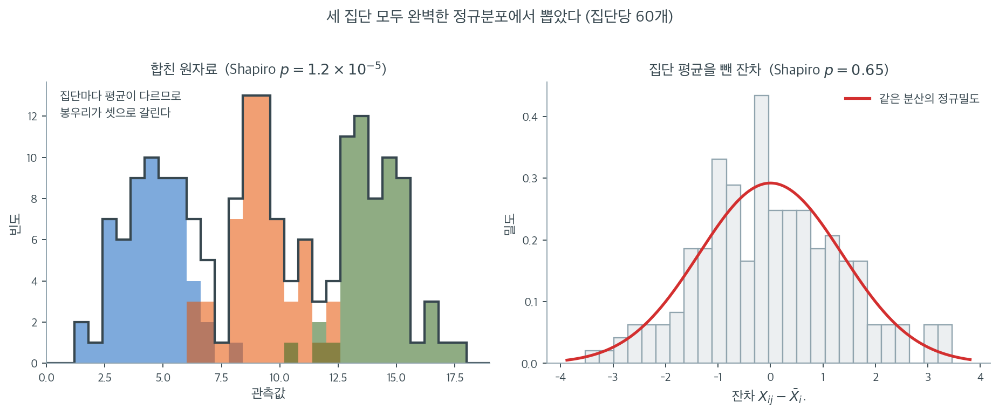

# t 검정과 분산분석에서의 정규성

## 가정이 들어오는 지점

$t$ 검정과 분산분석 모두 정규성을 요구하지만 가정의 정확한 형태는 둘이 다르다. $t$ 검정에서는 바탕 모집단(들)이 정규분포를 따른다고 가정한다. 분산분석에서는 각 집단 안의 관측값이 정규 모집단에서 뽑혔다고 가정한다. 두 경우 모두 정규성 가정이 검정통계량이 기준분포를 정확히 따르도록 보장하여 $p$값과 임계값이 정확해진다.

이 절차들을 적용하기 전에 정규성을 확인하는 것이 좋은 실무 관행이다. 이 절은 가정이 어디에서 들어오는지, 위배를 어떻게 진단하는지, 각 절차가 이탈에 얼마나 로버스트한지를 설명한다.

## 일표본 t 검정

평균 $\mu$, 분산 $\sigma^2$인 모집단에서 뽑은 표본 $X_1, X_2, \ldots, X_n$에 대해 일표본 $t$ 검정은 다음을 가정한다.

$$
X_i \overset{\text{iid}}{\sim} N(\mu, \sigma^2)
$$

이 가정 아래에서 검정통계량

$$
t = \frac{\bar{X} - \mu_0}{S / \sqrt{n}}
$$

는 자유도 $n - 1$의 $t$ 분포를 정확히 따른다. $X_i$의 정규성이 두 성질을 동시에 보장한다. $\bar{X}$가 정규분포를 따른다는 것과, $\bar{X}$와 $S^2$이 독립이라는 것이다. $t$ 분포가 성립하려면 둘 다 필요하다.

## 이표본 t 검정

독립인 이표본 $t$ 검정은 두 모집단의 정규성을 가정한다.

$$
X_{1i} \overset{\text{iid}}{\sim} N(\mu_1, \sigma^2), \quad X_{2j} \overset{\text{iid}}{\sim} N(\mu_2, \sigma^2)
$$

분산이 같으면 합동 $t$ 통계량이 자유도 $n_1 + n_2 - 2$의 $t$ 분포를 따른다. Welch의 $t$ 검정은 등분산 가정을 완화하지만, 근사 자유도가 타당하려면 여전히 각 집단의 정규성이 필요하다.

## 일원배치 분산분석

집단이 $k$개인 일원배치 분산분석의 모형은

$$
X_{ij} = \mu_i + \varepsilon_{ij}, \quad \varepsilon_{ij} \overset{\text{iid}}{\sim} N(0, \sigma^2)
$$

$i = 1, \ldots, k$이고 $j = 1, \ldots, n_i$이다. 정규성 가정은 오차항 $\varepsilon_{ij}$에 적용되며, 이는 각 집단 안의 관측값이 집단 평균 주위에서 정규분포를 따른다고 가정하는 것과 같다. $F$ 통계량

$$
F = \frac{\text{MSB}}{\text{MSW}}
$$

는 $H_0$과 정규성 가정 아래에서 자유도 $k - 1$과 $N - k$의 $F$ 분포를 따른다.

## 실무에서의 정규성 확인

### t 검정의 경우

$t$ 검정은 원자료(또는 각 집단의 자료)의 정규성을 가정하므로 확인도 표본값에 직접 적용해야 한다.

1. 표본값의 정규분위수에 대한 **Q-Q 그림**.
2. 표본값에 대한 **Shapiro-Wilk 검정**.
3. 대칭성과 꼬리 거동을 눈으로 평가하는 **히스토그램**.

### 분산분석의 경우

분산분석에서 정규성은 잔차 $\hat{\varepsilon}_{ij} = X_{ij} - \bar{X}_{i\cdot}$에 대한 가정이다. 여기서 $\bar{X}_{i\cdot}$는 집단 평균이다. 진단 절차는

1. 각 관측값에서 집단 평균을 빼서 **잔차를 계산**한다.
2. 합쳐진 잔차의 정규분위수에 대한 **Q-Q 그림**.
3. 합쳐진 잔차에 대한 **Shapiro-Wilk 검정**.

원자료가 아니라 잔차를 확인하는 것이 중요하다. 모든 집단이 정규여도 원자료는 (평균이 다른) $k$개 분포의 혼합이기 때문이다.

??? tip "분산분석에서는 원자료가 아니라 잔차를 확인하라"
    집단 평균이 크게 다르면 각 집단이 완벽하게 정규여도 합친 원자료는 (다봉으로 보이는 등) 정규가 아닌 것처럼 보일 수 있다. 언제나 잔차를 확인하라. 잔차는 집단 평균의 차이를 제거하여 분포 가정만 분리해 준다.

### 봉우리가 셋인데 각 집단은 완벽한 정규다

아래 자료는 평균이 $4$, $9$, $14$이고 표준편차가 모두 $1.4$인 정규분포에서 집단당 60개씩 뽑은 것이다. 세 모집단 모두 **정확히** 정규이고 분산도 같으므로 분산분석의 가정을 하나도 어기지 않았다. 집단별로 Shapiro-Wilk를 돌려도 각각 $p = 0.97$, $0.41$, $0.46$으로 아무 문제가 없다.



그런데 왼쪽 칸처럼 세 집단을 **합쳐** 놓으면 봉우리가 셋인 분포가 된다. 여기에 Shapiro-Wilk를 걸면 $p = 1.2 \times 10^{-5}$로 정규성을 기각한다. 자료 자체에는 아무 잘못이 없는데 검정만 보고 "정규성 위배"라고 적게 되는 것이다. 흔히 저지르는 실수이며, 집단 평균의 차이가 클수록 — 다시 말해 분산분석이 기각할 가능성이 높을수록 — 이 착시도 심해진다는 점이 특히 고약하다.

오른쪽 칸은 각 관측값에서 제 집단의 평균을 뺀 잔차 $\hat\varepsilon_{ij} = X_{ij} - \bar{X}_{i\cdot}$이다. 세 봉우리가 원점 하나로 포개지고 Shapiro-Wilk $p = 0.65$로 정규성과 잘 맞는다. 빨간 정규밀도 곡선과도 잘 겹친다. 모형이 가정한 것이 정확히 이 $\varepsilon_{ij}$였으므로, 확인해야 할 대상도 이것이다.

한 가지 덧붙일 것이 있다. 왼쪽의 $p = 1.2 \times 10^{-5}$는 봉우리가 눈으로도 뚜렷이 셋인 것치고는 그리 작지 않다. Shapiro-Wilk를 포함한 대부분의 정규성 검정이 다봉성에 특별히 강하지 않기 때문이다. 그래서 잔차를 쓰는 습관과 함께 히스토그램을 한 번 그려 보는 습관이 필요하다. 만약 잔차의 히스토그램에서도 봉우리가 둘 이상 보인다면, 그것은 정규성 문제가 아니라 **모형에 넣지 않은 집단 변수가 남아 있다**는 신호일 가능성이 높다.

## 비정규성에 대한 로버스트성

### t 검정

일표본과 이표본 $t$ 검정은 다음 조건에서 중간 정도의 정규성 이탈에 로버스트하다.

- 분포가 대칭일 때(꼬리가 두꺼워도 괜찮다).
- 집단당 표본크기가 최소 $n \geq 20$일 때.
- 이탈이 치우침이 아니라 꼬리에서 일어날 때.

치우친 모집단에서는 작은 표본에서 $t$ 검정의 제1종 오류율이 부풀려질 수 있다. 왜곡은 대체로 크지 않아, 명목 수준이 0.05일 때 실제로 0.06–0.08 정도이다.

### 분산분석

분산분석의 $F$ 검정은 다음 조건에서 비정규성에 중간 정도로 로버스트하다.

- 집단 크기가 같을 때(균형 설계).
- 분포가 대칭일 때.
- 집단당 관측값이 최소 15–20개일 때.

불균형 설계와 비정규성이 겹치면 더 문제가 된다. 그런 경우 (등분산을 가정하지 않는) Welch 분산분석과 더 큰 표본크기가 더 나은 보호를 제공한다.

<div class="exbox" markdown>

**보기 1.** <span class="diff easy" title="쉬움"></span> 잔차에 검정을 걸 때 자유도는 몇인가. 평균 $5.0$, $5.5$, $6.0$에 공통 표준편차 $1.5$인 세 정규 집단에서 각각 30개를 뽑아, 집단중심화 잔차에 샤피로–윌크를 걸고 일원분산분석을 수행한다.

**(1)** 출력의 $F = 6.3788$을 **분산분해로 손계산**해 맞추시오. $\hat\sigma = \sqrt{\mathrm{MSW}}$ 는 참값 $1.5$에서 얼마나 떨어져 있는가.

**(2)** 중심화하지 **않고** 그냥 통합한 자료에 샤피로–윌크를 걸면 어떻게 되는가. 이 자료에서는 통과한다. 본문은 "집단 평균이 크게 다르면 다봉으로 보인다"고 했는데, 왜 여기서는 그렇게 되지 않는가.

**(3)** 잔차는 90개이지만 집단마다 합이 0이라는 **제약 3개**를 받으므로 독립이 아니다. 샤피로–윌크는 독립 표본을 가정한다. 그러면 검정의 실제 크기가 명목 $0.05$에서 벗어나는가? 모의실험으로 재고, 집단 수 $k$를 늘리면 어떻게 되는지 보이시오.

</div>

??? success "풀이"

    **쪽의 코드를 먼저 그대로 돌린다.**

    ```python
    import numpy as np
    from scipy import stats

    # ===================================================================
    # 분산분석 잔차의 정규성 확인
    #
    # 집단마다 평균이 다르므로 자료 전체를 한 번에 검정하면 안 된다.
    # 각 관측값에서 제 집단의 평균을 뺀 것이 잔차이고, 정규성은 여기에 요구된다.
    # ===================================================================

    np.random.seed(42)

    # 평균이 조금씩 다른 세 집단. 분산은 모두 같다.
    group1 = np.random.normal(loc=5.0, scale=1.5, size=30)
    group2 = np.random.normal(loc=5.5, scale=1.5, size=30)
    group3 = np.random.normal(loc=6.0, scale=1.5, size=30)

    # 집단별 평균을 빼면 세 집단이 같은 중심으로 모인다. 이렇게 모은 뒤라야
    # 하나의 검정으로 정규성을 물을 수 있다.
    residuals = np.concatenate([
        group1 - np.mean(group1),
        group2 - np.mean(group2),
        group3 - np.mean(group3),
    ])

    # 잔차에 대한 Shapiro-Wilk 검정
    sw_stat, sw_p = stats.shapiro(residuals)

    # 가정을 확인했으니 본 검정으로 넘어간다.
    f_stat, f_p = stats.f_oneway(group1, group2, group3)

    if __name__ == "__main__":
        print("Normality check on ANOVA residuals:")
        print(f"  Shapiro-Wilk: W = {sw_stat:.4f}, p = {sw_p:.4f}")
        print(f"\nOne-way ANOVA:")
        print(f"  F = {f_stat:.4f}, p = {f_p:.4f}")

        if sw_p > 0.05:
            print("\n  Residuals are consistent with normality (p > 0.05).")
        else:
            print("\n  Evidence of non-normality in residuals (p <= 0.05).")
    ```

    출력:

    ```text
    Normality check on ANOVA residuals:
      Shapiro-Wilk: W = 0.9925, p = 0.8948

    One-way ANOVA:
      F = 6.3788, p = 0.0026

      Residuals are consistent with normality (p > 0.05).
    ```

    **(1) 분산분해.** 집단이 $k = 3$, 전체 $N = 90$, 집단당 $n_i = 30$이다. 집단평균은 $4.7178$, $5.3183$, $6.0193$이고 대평균은 $\bar x_{\cdot\cdot} = 5.3518$이다.

    $$
    \mathrm{SSB} = \sum_{i=1}^{3} n_i (\bar x_{i\cdot} - \bar x_{\cdot\cdot})^2 = 30\,(0.4020 + 0.0011 + 0.4456) = 25.4610
    $$

    $$
    \mathrm{SSW} = \sum_{i}\sum_{j} (x_{ij} - \bar x_{i\cdot})^2 = 173.6298
    $$

    자유도는 각각 $k - 1 = 2$와 $N - k = 87$이므로

    $$
    \mathrm{MSB} = \frac{25.4610}{2} = 12.7305,
    \qquad
    \mathrm{MSW} = \frac{173.6298}{87} = 1.9957
    $$

    $$
    F = \frac{\mathrm{MSB}}{\mathrm{MSW}} = \frac{12.7305}{1.9957} = 6.3788
    $$

    로 출력의 $6.3788$과 소수 넷째 자리까지 맞는다. 임계값 $F_{0.95}(2, 87) = 3.1013$을 두 배 넘게 넘으므로 $p = 0.0026$이다. (보기 1의 분산분석은 앞 쪽 `applications.md` 의 $F = 3.3415$처럼 아슬아슬하지 않다. 집단당 30개에 표준편차 $1.5$, 평균 간격 $0.5$라 효과가 뚜렷하다.)

    $\mathrm{MSW}$ 는 $\sigma^2$ 의 불편추정량이므로 $\hat\sigma = \sqrt{1.9957} = 1.4127$이다. 참값 $1.5$보다 $5.8\%$ 작다. 이것도 표본변동이다. $(N-k)\mathrm{MSW}/\sigma^2 \sim \chi^2_{87}$이므로 $\hat\sigma/\sigma$ 의 상대 표준오차는 약 $1/\sqrt{2(N-k)} = 1/\sqrt{174} = 0.0758$이고, 관측된 $-0.0582$는 $-0.77$ 표준오차다.

    **(2) 여기서는 통합해도 통과한다($p = 0.5458$).** 본문의 다봉 그림은 평균이 $4$, $9$, $14$이고 표준편차가 $1.4$인 자료였다. 간격을 표준편차로 재면 $5/1.4 = 3.6$이다. 반면 이 보기는 간격 $0.5$에 표준편차 $1.5$이므로

    $$
    \frac{\text{평균 간격}}{\sigma} = \frac{0.5}{1.5} = 0.333
    $$

    에 지나지 않는다. **열 배 이상 좁다.** 성분이 이만큼 겹치면 혼합은 단봉이고 정규와 거의 구별되지 않는다. 본문의 경고가 틀린 것이 아니라, 경고가 발동하는 **조건**이 간격 대 표준편차의 비라는 뜻이다. 간격이 $\sigma$ 의 세 배쯤 되어야 비로소 통합 자료가 기각되기 시작한다.

    그러므로 "중심화하지 않아도 통과했으니 괜찮다"고 읽으면 안 된다. 통과한 것은 **효과가 작아서**이고, 효과가 클 때 — 곧 분산분석이 기각할 때 — 정확히 그때 통합 검정이 오작동한다. 통과 여부와 무관하게 중심화하는 것이 옳다.

    **(3) 제약 3개는 거의 아무 일도 하지 않는다. 그러나 $k$가 커지면 달라진다.**

    ```python
    import numpy as np
    from scipy import stats

    np.random.seed(42)
    gs = [np.random.normal(loc=m, scale=1.5, size=30) for m in (5.0, 5.5, 6.0)]
    N, k = 90, 3
    grand = np.concatenate(gs).mean()

    print("(1) 분산분해로 F 를 손계산")
    SSB = sum(30 * (g.mean() - grand)**2 for g in gs)
    SSW = sum(((g - g.mean())**2).sum() for g in gs)
    MSB, MSW = SSB / (k - 1), SSW / (N - k)
    print(f"  집단평균 {np.round([g.mean() for g in gs], 4)},  대평균 {grand:.4f}")
    print(f"  SSB = {SSB:.4f},  SSW = {SSW:.4f}")
    print(f"  MSB = {MSB:.4f},  MSW = {MSW:.4f}")
    print(f"  F = MSB/MSW = {MSB/MSW:.4f}   scipy = {stats.f_oneway(*gs)[0]:.4f}")
    print(f"  p = {stats.f.sf(MSB/MSW, k-1, N-k):.4f},  임계 F = {stats.f.ppf(0.95, k-1, N-k):.4f}")
    print(f"  sigma-hat = sqrt(MSW) = {np.sqrt(MSW):.4f}  (참 1.5,"
          f" 상대편차 {(np.sqrt(MSW)-1.5)/1.5:+.4f} = {((np.sqrt(MSW)-1.5)/1.5)*np.sqrt(2*(N-k)):+.2f} SD)")

    print("\n(2) 중심화의 효과")
    resid = np.concatenate([g - g.mean() for g in gs])
    print(f"  잔차 shapiro p         = {stats.shapiro(resid)[1]:.4f}  (집단별 합 모두 0)")
    print(f"  중심화 안 한 통합 p    = {stats.shapiro(np.concatenate(gs))[1]:.4f}")
    print(f"  평균간격 / sigma = 0.5/1.5 = {0.5/1.5:.4f}")

    print("\n(3) 잔차에 샤피로를 걸면 크기가 명목값을 지키는가 (명목 0.05, R = 20000)")
    rng, R = np.random.default_rng(2026), 20000
    print(f"  몬테카를로 SE = {np.sqrt(0.05*0.95/R):.4f}")
    cnt = sum(stats.shapiro(rng.normal(0, 1, 90))[1] < 0.05 for _ in range(R))
    print(f"  iid n=90 (제약 없음)      크기 = {cnt/R:.4f}")
    for kk, m in [(3, 30), (9, 10), (30, 3)]:
        c = 0
        for _ in range(R):
            x = rng.normal(0, 1, (kk, m))
            c += stats.shapiro((x - x.mean(axis=1, keepdims=True)).ravel())[1] < 0.05
        print(f"  잔차 k={kk:<2d} 집단당 {m:<2d} (k/N = {kk/90:.3f})  크기 = {c/R:.4f}")
    ```

    출력:

    ```text
    (1) 분산분해로 F 를 손계산
      집단평균 [4.7178 5.3183 6.0193],  대평균 5.3518
      SSB = 25.4610,  SSW = 173.6298
      MSB = 12.7305,  MSW = 1.9957
      F = MSB/MSW = 6.3788   scipy = 6.3788
      p = 0.0026,  임계 F = 3.1013
      sigma-hat = sqrt(MSW) = 1.4127  (참 1.5, 상대편차 -0.0582 = -0.77 SD)

    (2) 중심화의 효과
      잔차 shapiro p         = 0.8948  (집단별 합 모두 0)
      중심화 안 한 통합 p    = 0.5458
      평균간격 / sigma = 0.5/1.5 = 0.3333

    (3) 잔차에 샤피로를 걸면 크기가 명목값을 지키는가 (명목 0.05, R = 20000)
      몬테카를로 SE = 0.0015
      iid n=90 (제약 없음)      크기 = 0.0496
      잔차 k=3  집단당 30 (k/N = 0.033)  크기 = 0.0500
      잔차 k=9  집단당 10 (k/N = 0.100)  크기 = 0.0482
      잔차 k=30 집단당 3  (k/N = 0.333)  크기 = 0.0316
    ```

    명목 $0.05$에 몬테카를로 표준오차가 $\sqrt{0.05 \times 0.95/20000} = 0.0015$이므로, $0.05$에서 $\pm 0.003$ 밖으로 나가면 유의한 차이다.

    | 설계 | $k/N$ | 실제 크기 | 명목값과의 차 |
    |---|---|---|---|
    | iid $n = 90$ | — | $0.0496$ | $-0.3\,\mathrm{SE}$ |
    | $k = 3$, 집단당 30 | $0.033$ | $0.0500$ | $0.0\,\mathrm{SE}$ |
    | $k = 9$, 집단당 10 | $0.100$ | $0.0482$ | $-1.2\,\mathrm{SE}$ |
    | $k = 30$, 집단당 3 | $0.333$ | $0.0316$ | $-12\,\mathrm{SE}$ |

    **이 보기의 설계($k = 3$, 집단당 30)에서는 걱정할 것이 없다.** 크기가 $0.0500$으로 명목값과 구별되지 않는다. 자유도 90 가운데 3을 쓴 것뿐이라 잔차가 $\mathrm{iid}$ 표본과 거의 다르지 않다.

    그러나 $k$를 늘리면 이야기가 달라진다. $k = 30$에 집단당 3개면 실제 크기가 $0.0316$으로 명목값의 **63%**에 지나지 않는다. 몬테카를로 표준오차의 12배나 벗어난 것이니 우연이 아니다. **검정이 지나치게 보수적**이 되어 실제로 비정규인 자료도 통과시키게 된다.

    까닭은 이 장 전체를 꿰는 주제와 같다. 모수를 추정한 뒤 남은 잔차는 **실제보다 더 정규처럼 보인다.** 집단당 $m$개에서 평균 하나를 뺐으니 집단 안의 자유도가 $m$에서 $m-1$로 줄고, 그 손실 비율이 $1/m$이다. $m = 30$이면 $3\%$라 무시할 수 있지만 $m = 3$이면 $33\%$다. 모수를 추정하고도 추정하지 않은 경우의 임계값을 쓰면 검정의 크기가 명목값 아래로 내려앉는다는 것, 그것이 콜모고로프–스미르노프에 릴리에포르 보정이 필요한 이유와 정확히 같은 구조다.

    실무 지침은 간단하다. **집단당 관측값이 넉넉하면($m \gtrsim 10$) 잔차에 그대로 검정을 걸어도 좋고, 집단은 많은데 집단당 관측값이 몇 개뿐이면 잔차 기반 정규성 검정의 $p$값을 그대로 믿지 말아야 한다.** 후자라면 모의실험으로 귀무분포를 직접 만들거나 Q-Q 그림으로 눈으로 보는 편이 낫다.

잔차가 정규성과 잘 맞고($p = 0.895$) 분산분석은 집단 평균의 차이를 유의하게 탐지한다($p = 0.0026$, 표본평균은 각각 4.72, 5.32, 6.02). 정규성 진단은 통과하고 관심 있는 검정은 기각하는, 이상적인 상황이다.

## 정규성이 무너졌을 때

$t$ 검정이나 분산분석 상황에서 진단이 비정규성을 드러내면 몇 가지 대안이 있다.

1. **표본크기를 늘린다.** 중심극한정리가 평균 기반 검정에 점근적 보호를 제공한다.
2. **변환을 적용한다.** 로그나 제곱근 변환이 치우침을 줄일 수 있다.
3. **비모수 검정을 쓴다.** Wilcoxon 순위합 검정이 이표본 $t$ 검정을, Kruskal-Wallis 검정이 일원배치 분산분석을 대신한다.
4. **순열검정을 쓴다.** 순열 기반 $p$값은 분포 가정을 요구하지 않는다.

## 연습문제

<div class="drillbox" markdown>

**연습문제 1.** <span class="diff med" title="중간"></span>
어떤 연구자가 중간 정도로 오른쪽으로 치우친 관측값 $n = 12$개에 t 검정을 적용한다. 정규성 가정을 걱정해야 하는가?

</div>

??? success "풀이"
    $n = 12$이면 중심극한정리의 보호가 제한적이므로 중간 정도의 치우침도 걱정거리이다. t 검정은 정확한 타당성을 위해 정규성을 가정한다. 치우친 자료와 작은 $n$에서는 실제 제1종 오류율이 명목 $\alpha$에서 벗어날 수 있고 신뢰구간의 포함확률도 틀릴 수 있다.

    연구자는 (1) Q-Q 그림으로 치우침의 정도를 평가하고, (2) 비모수 대안(Wilcoxon 부호순위 검정)을 고려하고, (3) 자료가 양수이고 오른쪽으로 치우쳤다면 로그 변환을 시도해야 한다. 치우침이 가벼우면 t 검정도 근사적으로 타당할 수 있지만, 민감도 분석을 함께 보고하는 것이 좋은 관행이다.

<div class="drillbox" markdown>

**연습문제 2.** <span class="diff med" title="중간"></span>
분산분석은 흔히 "비정규성에 로버스트하다"고 기술된다. 이 서술을 한정하라. 분산분석은 언제 로버스트하고 언제 그렇지 않은가?

</div>

??? success "풀이"
    분산분석이 로버스트한 경우: (1) 표본크기가 클 때(집단당 $n_j \geq 20$–$30$). 중심극한정리가 집단 평균을 정규화한다. (2) 집단 크기가 같을 때(균형 설계). 분산의 이질성에 대한 보호가 된다. (3) 정규성 이탈이 중간 정도일 때(가벼운 치우침, 극단적 이상점 없음).

    분산분석이 로버스트하지 **않은** 경우: (1) 표본크기가 작고 불균등하며 분산이 이질적일 때, (2) 작은 표본에서 자료가 심하게 치우쳤거나 이상점이 있을 때, (3) 자료가 심하게 비정규일 때(예: 이봉, 두꺼운 꼬리). 이런 경우 F 검정의 제1종 오류율이 크게 부풀려지거나 축소될 수 있다.

<div class="drillbox" markdown>

**연습문제 3.** <span class="diff med" title="중간"></span>
정규성이 의심스러울 때의 대안으로 Welch t 검정과 Mann-Whitney U 검정을 비교하라. 각각은 언제 선호되는가?

</div>

??? success "풀이"
    **Welch t 검정:** 등분산을 가정하지 않지만 여전히 근사적 정규성(또는 큰 $n$)을 가정한다. 평균이 다른지를 검정한다. 자료가 근사적으로 정규이거나 $n$이 크고 연구 질문이 평균에 관한 것일 때 선호된다.

    **Mann-Whitney U 검정:** 정규성을 가정하지 않는 비모수 검정이다. 분포의 모양이 같다는 가정 아래에서 한 집단이 더 큰 값을 갖는 경향이 있는지(확률적 우위)를 검정한다. 자료가 순서형이거나 심하게 치우쳤거나 이상점이 있거나 $n$이 작을 때 선호된다.

    핵심 차이: Welch 검정은 평균에 관한 것이고, Mann-Whitney는 분포 전체(대칭이면 중앙값)에 관한 것이다. 분포의 모양이 다르면 Mann-Whitney는 위치 이동이 아닌 다른 것을 검정하게 된다.

<div class="drillbox" markdown>

**연습문제 4.** <span class="diff med" title="중간"></span>
집단이 $k = 4$개이고 집단당 $n_j = 8$인 일원배치 분산분석이 $H_0$을 기각했다($p = 0.02$). 잔차에 대한 Shapiro-Wilk 검정은 $p = 0.04$를 준다. 분산분석 결과를 믿어야 하는가?

</div>

??? success "풀이"
    Shapiro-Wilk의 기각($p = 0.04$)은 우려를 낳지만 그 자체로 분산분석을 무효화하지는 않는다. $n_j = 8$(작은 집단)이면 t/F 분포 근사가 비정규성에 더 민감하다.

    권장 조치:

    1. 잔차의 Q-Q 그림과 히스토그램을 살펴 비정규성의 정도를 평가한다.
    2. 민감도 확인으로 비모수 대안(Kruskal-Wallis 검정)을 수행한다. 그것도 기각하면 분산분석의 결론이 뒷받침된다.
    3. 비정규성이 이상점 때문이라면 로버스트 분산분석이나 절사평균을 고려한다.
    4. 정규성에 대한 우려를 명시하면서 분산분석과 Kruskal-Wallis 결과를 모두 보고한다.

    Kruskal-Wallis도 $p < 0.05$를 준다면 결론에 대한 신뢰가 높아진다. 결과가 갈리면 정규성 위배가 원인일 수 있다.

---

## 정리하며

$t$ 검정의 정규성 가정은 원자료에, 분산분석의 정규성 가정은 잔차에 적용된다. 두 절차 모두 비정규성에 중간 정도로 로버스트하며 $t$ 검정이 $F$ 검정보다 더 로버스트하다. 정규성 확인에는 시각적 방법(잔차의 Q-Q 그림)과 형식적 검정(Shapiro-Wilk)을 모두 써야 한다. 위배가 탐지되면 대안 방법으로 갈아타기 전에 그 이탈이 실질적으로 유의한지 먼저 평가해야 한다.
