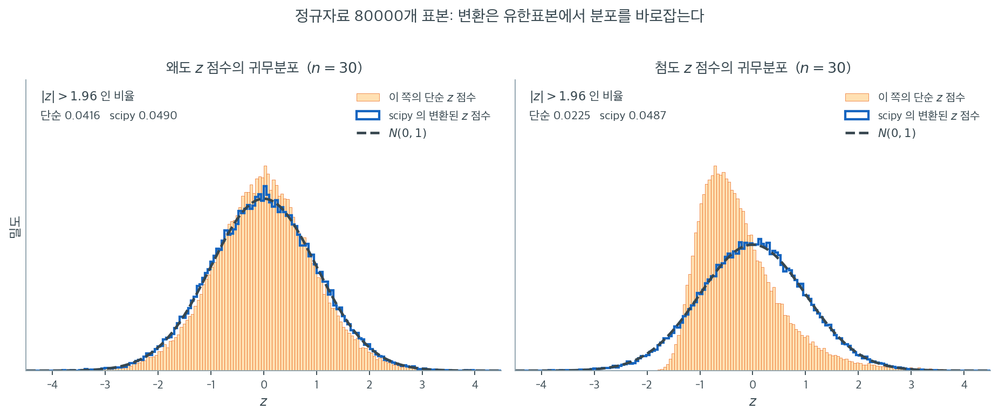

# D'Agostino의 K 제곱 검정

## 개요

**D'Agostino의 $K^2$ 검정**은 두 핵심 측도인 **왜도**와 **첨도**를 결합하여 주어진 표본이 정규분포를 따르는지 평가하는 형식적 통계검정이다. 자료 분포의 비대칭성(왜도)과 꼬리의 두꺼움(첨도)을 함께 살펴 정규성에서의 전반적 이탈을 재는 결합 검정통계량을 계산한다. 왜도와 첨도를 하나의 검정으로 함께 고려하고 싶을 때 특히 유용하다.

### 가설

- **귀무가설** ($H_0$): 자료가 정규분포를 따른다.
- **대립가설** ($H_1$): 자료가 정규분포를 따르지 않는다.

검정통계량은 왜도와 첨도의 z 점수를 하나의 값으로 결합한다. 이 검정통계량이 유의하고 그에 딸린 $p$값이 작으면(주어진 유의수준, 보통 0.05 미만) 귀무가설을 기각하고 자료가 정규분포를 따르지 않는다고 결론짓는다.

---

## 1. D'Agostino의 K 제곱 검정이 작동하는 방식

1. **왜도 계산**: 먼저 표본의 왜도, 곧 분포의 비대칭성을 잰다. 완전한 정규분포에서 왜도는 0에 가까워야 한다.

2. **첨도 계산**: 다음으로 첨도를 잰다. 첨도는 분포의 꼬리 두꺼움을 기술한다. 정규분포의 첨도는 3(중첨)이다.

3. **두 측도의 결합**: 왜도와 첨도의 z 점수 $Z_{\text{skewness}}$와 $Z_{\text{kurtosis}}$를 계산하고, 이 z 점수들의 제곱을 더해 검정통계량 $K^2$을 만든다.

    $$
    K^2 = Z_{\text{skewness}}^2 + Z_{\text{kurtosis}}^2
    $$

    이 검정통계량은 자유도 2인 카이제곱분포를 따른다.

4. **p값 계산**: $K^2$의 값에 근거하여 $p$값을 계산한다. 이는 귀무가설 아래에서 그만큼의 정규성 이탈을 관측할 확률을 알려준다.

---

## 2. Z_skewness를 계산하는 법

$Z_{\text{skewness}}$의 계산은 정규성이라는 귀무가설 아래에서 표본의 왜도가 0에서 유의하게 벗어나는지 검정하기 위해 왜도를 표준화하는 과정이다.

크기 $n$인 표본이 주어졌을 때:

**1. 표본왜도 $S$를 계산한다:**

$$
S = \frac{\frac{1}{n} \sum_{i=1}^n (x_i - \bar{x})^3}{\left(\frac{1}{n} \sum_{i=1}^n (x_i - \bar{x})^2\right)^{3/2}}
$$

여기서 $x_i$는 $i$번째 관측값, $\bar{x}$는 표본평균이며, 분자는 3차 적률(비대칭)을 재고 분모는 이를 무차원으로 정규화한다.

**2. $S$를 표준화한다:**

2.1 왜도의 표준오차 $\text{SE}_{S}$를 계산한다.

$$
\text{SE}_{S} = \sqrt{\frac{6n (n-1)}{(n-2)(n+1)(n+3)}}
$$

2.2 $S$를 표준화하여 $Z_{\text{skewness}}$를 얻는다.

$$
Z_{\text{skewness}} = \frac{S}{\text{SE}_{S}}
$$

**핵심 사항:**

- $Z_{\text{skewness}}$는 정규성이라는 귀무가설 아래에서 근사적으로 표준정규분포 $N(0, 1)$를 따른다.
- $|Z_{\text{skewness}}|$가 크면 왜도로 인한 유의한 정규성 이탈을 나타낸다.

---

## 3. Z_kurtosis를 계산하는 법

크기 $n$인 표본이 주어졌을 때:

**1. 표본첨도 $K$를 계산한다:**

$$
K = \frac{\frac{1}{n} \sum_{i=1}^n (x_i - \bar{x})^4}{\left(\frac{1}{n} \sum_{i=1}^n (x_i - \bar{x})^2\right)^2}
$$

여기서 $x_i$는 $i$번째 관측값, $\bar{x}$는 표본평균이며, 분자는 4차 적률(꼬리의 두꺼움)을 재고 분모는 이를 정규화한다.

**2. $K$를 초과첨도로 조정한다:**

$$
K_{\text{excess}} = K - 3
$$

**3. 첨도의 표준오차 $\text{SE}_{K}$를 계산한다:**

$$
\text{SE}_{K} = \sqrt{\frac{24n(n-1)^2}{(n-3)(n-2)(n+3)(n+5)}}
$$

**4. $K_{\text{excess}}$를 표준화한다:**

$$
Z_{\text{kurtosis}} = \frac{K_{\text{excess}}}{\text{SE}_{K}}
$$

**핵심 사항:**

- $Z_{\text{kurtosis}}$는 정규성이라는 귀무가설 아래에서 근사적으로 표준정규분포 $N(0, 1)$를 따른다.
- $|Z_{\text{kurtosis}}|$가 크면 첨도로 인한 유의한 정규성 이탈을 나타낸다.

!!! warning "위의 단순 z 점수는 scipy가 계산하는 값과 다르다"
    표준오차로 나누는 위의 z 점수는 $n \to \infty$일 때에만 표준정규로 수렴하는 **점근적** 근사이다. `scipy.stats.skewtest`와 `kurtosistest`는 D'Agostino와 Pearson이 제안한 추가 **정규화 변환**을 적용하여 유한표본에서 표준정규 근사를 훨씬 정확하게 만든다.

    두 값의 차이는 표본이 작을수록 커진다. 같은 자료에 대해

    | $n$ | 단순 $Z_{\text{skewness}}$ | scipy | 단순 $Z_{\text{kurtosis}}$ | scipy |
    |---|---|---|---|---|
    | 1000 | 0.4378 | 0.4402 | $-0.3026$ | $-0.1980$ |
    | 30 | $-1.1943$ | $-1.2927$ | 0.3925 | 0.9176 |

    $n = 30$에서 첨도 z 점수는 2배 이상 차이가 난다. 따라서 위 공식은 원리를 이해하는 용도로만 쓰고 실제 계산에는 `scipy.stats.normaltest`를 써야 한다.

### 변환이 정확히 무엇을 고치는가

위 경고 상자의 표는 한 표본에서 두 값이 다르다는 것만 보여준다. 그것이 왜 문제인지는 **귀무분포 전체**를 봐야 드러난다. 아래 그림은 진짜 $N(0,1)$ 자료에서 $n = 30$짜리 표본을 80000번 뽑아, 그때마다 단순 $z$ 점수(주황 히스토그램)와 `scipy`의 변환된 $z$ 점수(파란 윤곽선)를 계산한 결과다. 검은 파선이 두 통계량이 따라야 할 $N(0,1)$이다.



왼쪽 왜도 칸에서는 두 분포가 제법 비슷하다. 주황 히스토그램이 $N(0,1)$보다 가운데가 약간 높고 꼬리가 짧을 뿐이다. 그 결과 $|z| > 1.96$을 기각선으로 삼았을 때 실제 기각률이 $0.0416$이 된다. 약속한 $0.05$보다 17% 낮다. 변환을 거친 쪽은 $0.0490$으로 거의 정확하다.

오른쪽 첨도 칸은 사정이 전혀 다르다. 주황 히스토그램이 $-2$ 근처에서 벽에 부딪힌 듯 뚝 끊기고, 봉우리가 $-0.6$ 근처로 밀려 있으며, 오른쪽으로 길게 늘어져 있다. 표준정규와 닮은 구석이 거의 없다. 이렇게 생긴 이유는 간단하다. 초과첨도는 아래로 $-2$라는 수학적 한계가 있는 반면 위로는 끝이 없다. $n = 30$에서 그 비대칭이 고스란히 드러나는 것이다. 이 분포에 $|z| > 1.96$을 적용하면 실제 기각률은 $0.0225$, 약속한 값의 **절반도 되지 않는다**. 변환을 거친 파란 곡선은 $0.0487$로 $N(0,1)$에 잘 포개진다.

D'Agostino와 Pearson의 변환이 하는 일이 바로 이것이다. 표준오차로 나누는 것만으로는 **중심과 퍼짐**밖에 맞출 수 없다. 변환은 그 위에 비대칭까지 바로잡아 통계량의 모양 자체를 정규 쪽으로 옮긴다. $K^2 = Z_1^2 + Z_2^2$이 $\chi^2_2$을 따른다는 말은 $Z_1$과 $Z_2$가 각각 표준정규라는 전제 위에 서 있으므로, 이 교정 없이는 $K^2$의 $p$값도 믿을 수 없다.

<div class="exbox" markdown>

**보기 1.** <span class="diff easy" title="쉬움"></span> K-제곱이 두 검정의 합임을 확인하기. $\mathcal{N}(0,1)$에서 $n = 1000$개를 뽑아 세 함수를 모두 불러 본다.

**(1)** `normaltest`의 통계량이 `skewtest`와 `kurtosistest`의 $Z$ 제곱합과 같은지 확인하고, $p$값을 $K^2$만의 닫힌 꼴로 쓰시오.

**(2)** 제곱합을 $\chi^2_2$로 읽으려면 $Z_1$과 $Z_2$가 **독립인 표준정규**여야 한다. 정규 자료에서 실제로 그런지 모의실험으로 확인하시오. 상관계수, 두 표준편차, $K^2$의 평균·분산, 그리고 실제 기각률을 각각 이론값과 나란히 적으시오.

</div>

??? success "풀이"

    **(1) 끝자리까지 같고, $p = e^{-K^2/2}$다.** 이 표본에서 $Z_1 = 0.4402147002$, $Z_2 = -0.1979898523$이므로

    $$
    K^2 = Z_1^2 + Z_2^2 = 0.1937889... + 0.0392000... = 0.2329889638562599
    $$

    이고 `stats.normaltest`가 돌려주는 값이 **같은 부동소수점 수**다. `normaltest`가 두 검정을 내부에서 그대로 불러 제곱해 더하는 것이니 당연하지만, 직접 확인해 보면 $K^2$이 새로운 통계량이 아니라 **묶음**일 뿐이라는 점이 분명해진다.

    자유도 2인 카이제곱은 평균 2인 지수분포이므로 생존함수가 $e^{-x/2}$다. 따라서

    $$
    p = P(\chi^2_2 > K^2) = e^{-K^2/2} = e^{-0.11649448} = 0.8900350082402695
    $$

    이고, 이 역시 `normaltest`의 $p$값과 마지막 자리까지 일치한다. $K^2$이 작으니 기각하지 못한다.

    **(2) 네 가지 모두 이론값과 맞는다.** $n = 1000$인 정규 표본을 4만 번 뽑아 재면

    | 재는 것 | 이론값 | 모의값 | 몬테카를로 오차 |
    |---|---|---|---|
    | $\operatorname{corr}(Z_1, Z_2)$ | $0$ | $-0.0019$ | $\pm 0.0050$ |
    | $\mathrm{SD}(Z_1)$ | $1$ | $0.9922$ | — |
    | $\mathrm{SD}(Z_2)$ | $1$ | $0.9995$ | — |
    | $\mathbb{E}[K^2]$ | $2$ | $1.9834$ | — |
    | $\mathrm{Var}(K^2)$ | $4$ | $4.1826$ | — |
    | $P(K^2 > 5.991)$ | $0.05$ | $0.0502$ | $\pm 0.0011$ |

    이다. 상관계수가 $-0.0019$로 몬테카를로 오차 $1/\sqrt{R} = 0.0050$의 절반도 안 되니 **0과 구별되지 않는다.** 이것은 우연이 아니다. 정규분포는 대칭이므로 홀수 차수 적률에서 나온 $g_1$과 짝수 차수 적률에서 나온 $g_2$가 상관을 갖지 않는다. 부호를 뒤집어도 $g_2$는 그대로인데 $g_1$은 뒤집히므로, 둘의 공분산이 자기 자신의 음수와 같아야 하고 따라서 0이다.

    두 표준편차가 1에 붙고 상관이 0이므로 $K^2$은 제대로 $\chi^2_2$를 따른다. 기각률 $0.0502$가 명목 $0.05$에서 몬테카를로 표준오차의 $0.2$배 안이다. **$n = 1000$에서 다고스티노 $K^2$은 약속한 크기를 정확히 지킨다.**

    한 가지 짚어 둘 것이 있다. 위 본문의 두 표준오차

    $$
    \mathrm{SE}_S = \sqrt{\frac{6n(n-1)}{(n-2)(n+1)(n+3)}}, \qquad
    \mathrm{SE}_K = \sqrt{\frac{24n(n-1)^2}{(n-3)(n-2)(n+3)(n+5)}}
    $$

    는 **보정판** $G_1$, $G_2$의 것이다. 본문이 $S$와 $K$를 $1/n$ 적률로 정의했으므로 그것은 비보정판 $g_1$, $b_2$이고, 그 분산은

    $$
    \mathrm{Var}(g_1) = \frac{6(n-2)}{(n+1)(n+3)}, \qquad
    \mathrm{Var}(b_2) = \frac{24n(n-2)(n-3)}{(n+1)^2(n+3)(n+5)}
    $$

    이다. 두 쌍은 보정 계수로 정확히 이어진다. $G_1 = \frac{\sqrt{n(n-1)}}{n-2}g_1$에서

    $$
    \mathrm{Var}(G_1) = \frac{n(n-1)}{(n-2)^2}\cdot\frac{6(n-2)}{(n+1)(n+3)} = \frac{6n(n-1)}{(n-2)(n+1)(n+3)}
    $$

    이고, $G_2 = \frac{(n+1)(n-1)}{(n-2)(n-3)}\bigl(b_2 - \mathbb{E}[b_2]\bigr)$에서

    $$
    \mathrm{Var}(G_2) = \frac{(n+1)^2(n-1)^2}{(n-2)^2(n-3)^2}\cdot\frac{24n(n-2)(n-3)}{(n+1)^2(n+3)(n+5)} = \frac{24n(n-1)^2}{(n-2)(n-3)(n+3)(n+5)}
    $$

    이다. 두 항등식을 수로 확인하면 $n = 1000$에서 좌변과 우변이 열 자리까지 같다. 실제 값은 $\mathrm{SD}(g_1) = 0.07723$ 대 $\mathrm{SD}(G_1) = 0.07734$, $\mathrm{SD}(g_2) = 0.15376$ 대 $\mathrm{SD}(G_2) = 0.15453$이다. $n = 1000$에서는 차이가 $0.1$–$0.5\%$에 지나지 않지만, **비보정 통계량을 보정판의 표준오차로 나누면 $z$ 점수가 그만큼 틀어진다.** 작은 표본에서는 그 틀어짐이 커진다.

    ```python
    import numpy as np
    from scipy import stats

    np.random.seed(0)

    data = np.random.normal(0, 1, 1000)

    # D'Agostino 의 K^2 은 왜도 검정과 첨도 검정을 하나로 묶은 것이다.
    # 각 검정의 Z 를 제곱해 더하면 정확히 K^2 이 된다는 것을 아래에서 확인한다.
    # 두 Z 가 대략 독립인 표준정규이므로 그 합이 자유도 2 인 카이제곱을 따른다.
    Z_skewtest, p_value = stats.skewtest(data)
    Z_kurtosistest, p_value = stats.kurtosistest(data)
    print(f"{Z_skewtest**2 + Z_kurtosistest**2 = }")

    # scipy 에서는 normaltest 가 곧 D'Agostino 의 K^2 검정이다.
    stat, p_value = stats.normaltest(data)

    print(f"D'Agostino's K-squared Test: Statistic={stat}, p-value={p_value}")

    alpha = 0.05
    if p_value > alpha:
        print("Fail to reject H_0: The data is normally distributed.")
    else:
        print("Reject H_0: The data is not normally distributed.")
    ```

    출력:

    ```text
    Z_skewtest**2 + Z_kurtosistest**2 = 0.2329889638562599
    D'Agostino's K-squared Test: Statistic=0.2329889638562599, p-value=0.8900350082402695
    Fail to reject H_0: The data is normally distributed.
    ```

    $p$값의 닫힌 꼴과 독립성·보정을 함께 확인한다.

    ```python
    import numpy as np
    from scipy import stats

    np.random.seed(0)
    data = np.random.normal(0, 1, 1000)
    z1 = stats.skewtest(data)[0]
    z2 = stats.kurtosistest(data)[0]
    K2 = z1**2 + z2**2
    print(f"Z1 = {z1:.10f},  Z2 = {z2:.10f}")
    print(f"exp(-K2/2)   = {np.exp(-K2 / 2)!r}")
    print(f"normaltest p = {stats.normaltest(data)[1]!r}")

    # 두 Z 가 독립인 표준정규인가 — 정규 자료에서 직접 잰다.
    rng = np.random.default_rng(21)
    R, n = 40_000, 1000
    X = rng.standard_normal((R, n))
    Z1 = np.array([stats.skewtest(x)[0] for x in X])
    Z2 = np.array([stats.kurtosistest(x)[0] for x in X])
    print(f"\ncorr(Z1, Z2) = {np.corrcoef(Z1, Z2)[0, 1]:+.4f}   (MC SE 약 {1 / np.sqrt(R):.4f})")
    print(f"sd(Z1) = {Z1.std(ddof=1):.4f},  sd(Z2) = {Z2.std(ddof=1):.4f}   (이론 1)")
    K2s = Z1**2 + Z2**2
    print(f"K^2 평균 {K2s.mean():.4f} (이론 2),  분산 {K2s.var(ddof=1):.4f} (이론 4)")
    print(f"기각률 = {np.mean(K2s > stats.chi2.ppf(0.95, 2)):.4f}"
          f"  (명목 0.05, MC SE {np.sqrt(0.05 * 0.95 / R):.4f})")

    # 본문의 두 SE 가 어느 판본의 것인가 — 보정 항등식을 수로 확인한다.
    var_g1 = 6.0 * (n - 2) / ((n + 1) * (n + 3))
    var_G1 = 6.0 * n * (n - 1) / ((n - 2) * (n + 1) * (n + 3))
    var_b2 = 24.0 * n * (n - 2) * (n - 3) / ((n + 1) ** 2 * (n + 3) * (n + 5))
    var_G2 = 24.0 * n * (n - 1) ** 2 / ((n - 3) * (n - 2) * (n + 3) * (n + 5))
    c = (n + 1) * (n - 1) / ((n - 2) * (n - 3))
    print(f"\nn(n-1)/(n-2)^2 * Var(g1) = {n * (n - 1) / (n - 2)**2 * var_g1:.10f}"
          f"   Var(G1) = {var_G1:.10f}")
    print(f"c^2 * Var(b2)            = {c * c * var_b2:.10f}   Var(G2) = {var_G2:.10f}")
    print(f"SD(g1) = {np.sqrt(var_g1):.5f}, SD(G1) = {np.sqrt(var_G1):.5f}, "
          f"SD(g2) = {np.sqrt(var_b2):.5f}, SD(G2) = {np.sqrt(var_G2):.5f}")
    ```

    출력:

    ```text
    Z1 = 0.4402147002,  Z2 = -0.1979898523
    exp(-K2/2)   = 0.8900350082402695
    normaltest p = 0.8900350082402695

    corr(Z1, Z2) = -0.0019   (MC SE 약 0.0050)
    sd(Z1) = 0.9922,  sd(Z2) = 0.9995   (이론 1)
    K^2 평균 1.9834 (이론 2),  분산 4.1826 (이론 4)
    기각률 = 0.0502  (명목 0.05, MC SE 0.0011)

    n(n-1)/(n-2)^2 * Var(g1) = 0.0059820658   Var(G1) = 0.0059820658
    c^2 * Var(b2)            = 0.0238808359   Var(G2) = 0.0238808359
    SD(g1) = 0.07723, SD(G1) = 0.07734, SD(g2) = 0.15376, SD(G2) = 0.15453
    ```

    $e^{-K^2/2}$가 `normaltest`의 $p$값과 열여섯 자리까지 같고, 두 보정 항등식의 좌우가 열 자리까지 같다. 유도한 것이 모두 맞는다. $\square$

---

## 4. 응용

D'Agostino의 $K^2$ 검정은 정규성 가정이 결정적인 다음과 같은 상황에서 흔히 쓰인다.

- 정규분포 자료를 요구하는 **모수적 통계검정**($t$ 검정, 분산분석 등).
- 잔차의 정규성을 가정하는 **회귀분석**.
- 모형화와 의사결정에서 흔히 정규성을 가정하는 **품질관리**와 **금융 모형화**.

---

## 5. 한계

- **표본크기 민감성**: 다른 많은 정규성 검정과 마찬가지로 D'Agostino의 $K^2$ 검정도 표본크기에 민감하다. 표본이 작으면 정규성 이탈을 탐지할 검정력이 부족할 수 있다. 표본이 크면 정규성에서 아주 조금만 벗어나도 귀무가설을 기각할 수 있다.
- **연속 자료를 가정**: 이 검정은 연속 자료를 위해 설계되었다. 범주형이나 순서형 자료에 적용하는 것은 적절하지 않다.

D'Agostino의 $K^2$ 검정은 왜도와 첨도를 함께 반영하여 자료의 정규성을 확인하는 강력한 방법이다. 분포 모양의 두 중요한 측면을 결합하여 정규성을 견실하게 평가한다. 다만 모든 정규성 검정과 마찬가지로 자료의 분포를 종합적으로 이해하려면 시각적 방법(예: Q-Q 그림)과 다른 통계검정을 함께 써야 한다.

---

## 연습문제

<div class="drillbox" markdown>

**연습문제 1.** <span class="diff med" title="중간"></span>
D'Agostino의 $K^2$ 검정은 왜도 검정과 첨도 검정을 결합한다. 귀무가설과 검정통계량의 공식을 서술하라.

</div>

??? success "풀이"
    귀무가설은 $H_0$: 자료가 정규분포에서 왔다.

    검정통계량은

    $$
    K^2 = Z_1^2 + Z_2^2
    $$

    여기서 $Z_1$은 표준화된 왜도 통계량(표본왜도 $\sqrt{b_1}$의 변환)이고 $Z_2$는 표준화된 첨도 통계량(표본첨도 $b_2$의 변환)이다. $H_0$ 아래에서 $K^2 \sim \chi^2_2$가 근사적으로 성립한다.

    이 검정은 전방위적이다. 왜도, 첨도, 또는 둘 다에서 오는 정규성 이탈을 탐지한다. $K^2$가 크면(p값이 작으면) 비정규성을 나타낸다.

<div class="drillbox" markdown>

**연습문제 2.** <span class="diff med" title="중간"></span>
$n = 100$인 표본의 왜도가 $0.8$, 초과첨도가 $1.5$이다. 정확한 검정통계량을 계산하지 않고 D'Agostino 검정이 정규성을 기각할 가능성이 높은지 정성적으로 설명하라.

</div>

??? success "풀이"
    두 값 모두 정규분포의 기준값(왜도 $= 0$, 초과첨도 $= 0$)에서 눈에 띄게 벗어나 있다. 왜도 0.8은 중간 정도의 오른쪽 치우침을, 초과첨도 1.5는 정규보다 두꺼운 꼬리를 나타낸다.

    $n = 100$이면 이런 이탈을 탐지할 만한 검정력이 있다. 왜도의 기여 $Z_1^2$이 상당히 크고 첨도의 기여 $Z_2^2$도 양수일 것이다. $K^2 = Z_1^2 + Z_2^2$이므로 두 성분이 함께 검정통계량을 키워 기각할 가능성이 높다.

<div class="drillbox" markdown>

**연습문제 3.** <span class="diff med" title="중간"></span>
D'Agostino 검정을 Shapiro-Wilk 검정과 비교하라. 각각의 상대적 강점은 무엇인가?

</div>

??? success "풀이"
    **D'Agostino의 $K^2$:**

    - 강점: 중간에서 큰 표본($n \geq 20$)에서 잘 작동한다. 왜도와 첨도에 대한 별도의 통찰을 준다. 계산이 간단하다.
    - 약점: 작은 표본에서는 Shapiro-Wilk보다 검정력이 낮다. 왜도나 첨도에 영향을 주지 않는 이탈(예: 봉우리가 대칭인 이봉분포)은 놓칠 수 있다.

    **Shapiro-Wilk:**

    - 강점: 작거나 중간 크기의 $n$에서 가장 강력한 검정이다. 적률만으로는 잡히지 않는 것을 포함해 폭넓은 이탈을 탐지한다.
    - 약점: 본래 $n \leq 5000$으로 제한되었다(현대 구현은 더 큰 $n$도 다룬다). 왜도로 인한 이탈과 첨도로 인한 이탈을 구별해 주지 않는다.

<div class="drillbox" markdown>

**연습문제 4.** <span class="diff med" title="중간"></span>
D'Agostino 검정이 왜 "적률 기반" 정규성 검정이라 불리는지, 그리고 이것이 Jarque-Bera 검정과 어떻게 이어지는지 설명하라.

</div>

??? success "풀이"
    D'Agostino 검정이 "적률 기반"인 이유는 3차와 4차 중심적률(왜도와 첨도)을 통해 정규성을 평가하기 때문이다. 많은 대립분포에서 이 두 적률이 정규값과 가장 먼저 달라진다.

    **Jarque-Bera 검정**도 비슷한 접근을 쓴다.

    $$
    JB = \frac{n}{6}\left(S^2 + \frac{(K-3)^2}{4}\right)
    $$

    여기서 $S$는 표본왜도, $K$는 표본첨도이다. $H_0$ 아래에서 $JB \sim \chi^2_2$이다.

    주된 차이: D'Agostino 검정은 왜도와 첨도 통계량을 결합하기 전에 정규화 변환을 적용하여 유한표본에서 카이제곱 근사를 개선한다. Jarque-Bera 검정은 원래의 적률을 그대로 써서 유한표본 성질이 나쁠 수 있다. 따라서 표본크기가 200 아래일 때는 D'Agostino 검정이 선호된다.

---

## 정리하며

다고스티노 $K^2$ 는 **왜도와 첨도를 합친** 옴니버스 검정이다.

$$
K^2=Z_{\gamma_1}^2+Z_{\gamma_2}^2\;\sim\;\chi^2_2
$$

- **두 $Z$ 점수의 제곱합이다.** 각각 근사적으로 표준정규이므로 합이 자유도 2 의 카이제곱이 된다.
- **한쪽만 보는 검정보다 넓은 범위를 잡는다.** 치우침만 있거나 꼬리만 두꺼운 경우를 모두 탐지한다.
- **기각했을 때 원인을 알려면 개별 검정을 본다.** $K^2$ 자체는 "어딘가 다르다"까지만 말하며, 11장의 $F$ 검정과 같은 구조다.
- **$n\ge20$ 정도가 필요하다.** 첨도 검정의 요건 때문이며, 소표본에서는 샤피로–윌크가 낫다.
- **`scipy.stats.normaltest` 가 이 검정이다.** 이름만 보고 일반적인 정규성 검정으로 오해하기 쉽다.

다음 절 **Jarque-Bera 검정**으로 넘어간다.
