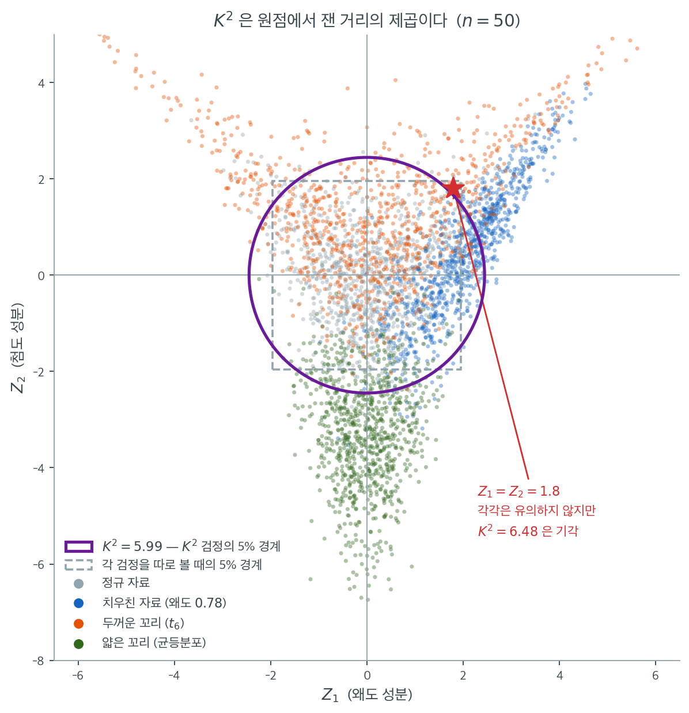

# D'Agostino K제곱 검정

## 개요

D'Agostino $K^2$ 검정은 왜도 검정과 첨도 검정을 하나의 통계량으로 결합한 옴니버스 정규성 검정이다. 왜도와 초과첨도가 모두 0과 일관되는지 동시에 검정함으로써, 어느 한쪽 검정만으로는 잡지 못하는 더 넓은 범위의 정규성 이탈을 탐지한다. SciPy에는 `stats.normaltest`로 구현되어 있다.

## 검정통계량

$K^2$ 통계량은 왜도 검정과 첨도 검정에서 나온 $Z$ 점수의 제곱합이다.

$$
K^2 = Z_1^2 + Z_2^2,
$$

여기서 $Z_1$은 D'Agostino 왜도 통계량, $Z_2$는 D'Agostino 첨도 통계량이다(자세한 내용은 각 검정 페이지 참조). $H_0$(정규성) 아래에서 $Z_1$과 $Z_2$는 근사적으로 독립인 표준정규이므로

$$
K^2 \;\underset{H_0}{\sim}\; \chi^2_2 \quad \text{(점근적으로)}.
$$

## 가설

$$
H_0: \text{자료가 정규분포를 따른다}, \qquad H_1: \text{자료가 정규분포를 따르지 않는다}.
$$

$p$값은

$$
p = P(\chi^2_2 \geq K^2_{\text{obs}}).
$$

$p < \alpha$일 때 $H_0$을 기각한다.

<div class="exbox" markdown>

**보기 1.** <span class="diff easy" title="쉬움"></span> 섞인 자료에 K-제곱 검정. $\mathcal{N}(0,1)$ 240개에 $\text{Lognormal}(0, 0.6^2)$ 60개를 섞은 $n = 300$ 표본에서 $K^2 = 22.2123$이 나온다.

**(1)** 두 성분의 제곱이 $K^2$을 이루는지 확인하고, $p$값을 $K^2$만의 닫힌 꼴로 쓰시오. 기각을 이끈 것은 치우침인가 꼬리인가.

**(2)** **같은 자료**에 자크–베라를 걸면 $JB = 47.5606$으로 $K^2$의 두 배가 넘는다. 두 통계량을 왜도 항과 첨도 항으로 각각 쪼개어, 그 차이가 **어느 항에서** 오는지 수로 밝히시오. $JB$가 더 크다는 것이 검정력이 더 좋다는 뜻인가.

</div>

??? success "풀이"

    **(1) 첨도 성분이 $69.8\%$다.** 분해는 정확히 맞아떨어진다.

    $$
    K^2 = Z_1^2 + Z_2^2 = 2.5915^2 + 3.9365^2 = 6.7159 + 15.4964 = 22.2123
    $$

    $\chi^2_2$의 생존함수가 $e^{-x/2}$이므로

    $$
    p = e^{-K^2/2} = e^{-11.10615} = 1.502\times10^{-5}
    $$

    이고 `normaltest`의 $p$값과 일치한다. 두 성분 모두 $\lvert Z\rvert > 1.96$을 넘으므로 둘 다 혼자서도 기각하는데, 첨도 쪽이 $15.50$ 대 $6.72$로 $2.3$배 크다. **대수정규 오염이 치우침과 두꺼운 꼬리를 동시에 들여왔고 꼬리 쪽 신호가 더 강하다.**

    **(2) 차이는 전부 첨도 항에서 온다.** 두 통계량을 나란히 쪼개면

    | 항 | $K^2$ | $JB$ | 비 |
    |---|---|---|---|
    | 왜도 | $Z_1^2 = 6.7159$ | $\frac{n}{6}g_1^2 = 6.8005$ | $1.01$ |
    | 첨도 | $Z_2^2 = 15.4964$ | $\frac{n}{24}g_2^2 = 40.7601$ | $2.63$ |
    | 합 | $22.2123$ | $47.5606$ | $2.14$ |

    이다. **왜도 항은 $1\%$ 안에서 같다.** $JB$의 왜도 항이 $\frac{n}{6}g_1^2 = (g_1/\sqrt{6/n})^2$, 곧 $\mathrm{Var}(g_1) \approx 6/n$을 쓴 단순 표준화의 제곱인데, $n = 300$에서 왜도 쪽 변환은 거의 아무것도 바꾸지 않으므로 $Z_1^2$과 사실상 같은 값이 된다.

    첨도 항은 $2.63$배 벌어진다. 까닭은 앞 쪽에서 본 대로 **$b_2$의 귀무분포가 크게 치우쳐 있다**는 데 있다. $JB$는 $g_2$를 그대로 제곱하므로 그 치우침을 전혀 고려하지 않고, $K^2$은 윌슨–힐퍼티 세제곱근 변환으로 치우침을 먼저 펴 준 다음 제곱한다. 두꺼운 꼬리 쪽 이탈에서는 변환이 값을 크게 깎으므로 $Z_2^2$이 작아진다.

    **그러므로 $JB$가 크다는 것은 검정력이 좋다는 뜻이 아니다.** 통계량이 커진 만큼 그 귀무분포도 함께 부풀어야 $\chi^2_2$가 맞는데, $JB$는 중간 크기 표본에서 그 보정 없이 $\chi^2_2$를 쓴다. 그래서 $p$값이 $4.70\times10^{-11}$까지 내려가지만, 이 쪽에서 $K^2$이 주는 $1.50\times10^{-5}$가 더 믿을 만한 수다. **두 $p$값의 자릿수 차이 여섯은 증거의 차이가 아니라 보정의 차이다.**

    ```python
    import numpy as np
    from scipy import stats

    # 정규 240개에 로그정규 60개를 섞었다. 겉보기에는 정규 같지만 오른쪽이
    # 조금 늘어난 자료다. 검정이 이것을 잡아내는지 본다.
    rng = np.random.default_rng(0)
    x = np.concatenate([rng.normal(0, 1, size=240),
                        rng.lognormal(0, 0.6, size=60)])

    # K^2 과 그것을 이루는 두 성분을 함께 구한다. 어느 쪽이 큰지를 보면
    # 정규에서 벗어난 까닭이 치우침인지 꼬리인지 알 수 있다.
    K2, p = stats.normaltest(x)
    z1, _ = stats.skewtest(x)
    z2, _ = stats.kurtosistest(x)

    print(f"Sample size n = {x.size}")
    print(f"D'Agostino's K^2 statistic = {K2:.4f}")
    print(f"  components: Z1 = {z1:.4f}, Z2 = {z2:.4f}")
    print(f"p-value = {p:.4g}")
    if p < 0.05:
        print("=> Reject normality at alpha = 0.05.")
    else:
        print("=> Fail to reject normality at alpha = 0.05.")
    ```

    출력:

    ```text
    Sample size n = 300
    D'Agostino's K^2 statistic = 22.2123
      components: Z1 = 2.5915, Z2 = 3.9365
    p-value = 1.502e-05
    => Reject normality at alpha = 0.05.
    ```

    두 통계량의 분해를 나란히 확인한다.

    ```python
    import numpy as np
    from scipy import stats

    rng = np.random.default_rng(0)
    x = np.concatenate([rng.normal(0, 1, size=240),
                        rng.lognormal(0, 0.6, size=60)])
    n = x.size
    K2, p = stats.normaltest(x)
    z1, _ = stats.skewtest(x)
    z2, _ = stats.kurtosistest(x)
    print(f"Z1^2 = {z1**2:.4f},  Z2^2 = {z2**2:.4f},  합 = {z1**2 + z2**2:.4f}  (K2 = {K2:.4f})")
    print(f"첨도 성분의 비중 = {100 * z2**2 / K2:.1f}%")
    print(f"p = exp(-K2/2) = {np.exp(-K2 / 2):.4g},  normaltest p = {p:.4g}")

    g1, g2 = stats.skew(x), stats.kurtosis(x)
    jb, pjb = stats.jarque_bera(x)
    jb_s, jb_k = n / 6 * g1**2, n / 24 * g2**2
    print(f"\nJB = {jb:.4f} = {jb_s:.4f} + {jb_k:.4f},  첨도 비중 {100 * jb_k / jb:.1f}%")
    print(f"  p(JB) = {pjb:.4g}")
    print(f"\n왜도 쪽:  JB 항 {jb_s:.4f}  대  Z1^2 {z1**2:.4f}   (비 {jb_s / z1**2:.2f})")
    print(f"첨도 쪽:  JB 항 {jb_k:.4f}  대  Z2^2 {z2**2:.4f}   (비 {jb_k / z2**2:.2f})")
    ```

    출력:

    ```text
    Z1^2 = 6.7159,  Z2^2 = 15.4964,  합 = 22.2123  (K2 = 22.2123)
    첨도 성분의 비중 = 69.8%
    p = exp(-K2/2) = 1.502e-05,  normaltest p = 1.502e-05

    JB = 47.5606 = 6.8005 + 40.7601,  첨도 비중 85.7%
      p(JB) = 4.703e-11

    왜도 쪽:  JB 항 6.8005  대  Z1^2 6.7159   (비 1.01)
    첨도 쪽:  JB 항 40.7601  대  Z2^2 15.4964   (비 2.63)
    ```

    분해가 양쪽 모두 끝까지 맞고, $e^{-K^2/2}$가 `normaltest`의 $p$값과 일치한다. 마지막 두 줄이 (2)의 답이다. **같은 자료에서 두 옴니버스 검정이 왜도에는 똑같이 반응하고 첨도에만 다르게 반응한다.** $\square$

## 왜 옴니버스 검정인가

두 상황을 생각해 보자.

1. **오른쪽으로 치우쳤지만 첨도는 정상인 자료:** 왜도 검정은 기각하지만 첨도 검정은 기각하지 않을 수 있다. $Z_1^2$이 크므로 $K^2$ 검정은 여전히 기각한다.
2. **대칭이지만 꼬리가 두꺼운 자료:** 왜도 검정은 기각하지 않지만($Z_1 \approx 0$) 첨도 검정은 기각한다. 이번에도 $K^2$이 기각한다.

두 적률을 결합함으로써 $K^2$은 어느 방향의 이탈에도 민감해진다. 나아가 자료가 *약간* 치우쳤고 *동시에* 약간 고첨인 경우처럼 각 성분의 증거가 개별적으로는 유의하지 않아도, 둘을 합친 증거가 $K^2$을 임계값 너머로 밀어 올릴 수 있다. 예컨대 $Z_1 = 1.8$, $Z_2 = 1.8$이면 각각은 $p = 0.072$로 기각하지 못하지만 $K^2 = 6.48$은 $p = 0.039$로 기각한다.

### 평면 위에서 보면 한눈에 들어온다

$K^2 = Z_1^2 + Z_2^2$이라는 식은 피타고라스 정리다. $(Z_1, Z_2)$를 평면 위의 한 점으로 보면 $K^2$은 그 점이 원점에서 떨어진 **거리의 제곱**이고, 기각역은 반지름 $\sqrt{5.991} = 2.447$인 원의 바깥이다. 아래 그림은 $n = 50$인 표본을 네 종류의 모집단에서 900개씩 뽑아 이 평면 위에 찍은 것이다.



회색 점(정규 자료)은 원점 주위에 둥글게 모여 있다. 두 성분의 중앙값이 각각 $-0.03$과 $0.05$로, 표준정규 두 개가 독립으로 흩어진 모습 그대로다. 보라색 원 바깥으로 나가는 회색 점의 비율이 곧 검정의 크기이며 $0.060$이 나왔다.

나머지 세 무리는 각자 **다른 방향으로** 날아간다. 치우친 자료(파랑)는 오른쪽으로 뻗어 $Z_1$ 중앙값이 $2.03$이고 $Z_2$는 $0.48$에 머문다. 두꺼운 꼬리($t_6$, 주황)는 위쪽으로 올라가 $Z_2$ 중앙값이 $1.25$이다. 얇은 꼬리(균등분포, 초록)는 아래로 곤두박질쳐 $Z_2$ 중앙값이 $-3.27$까지 내려간다. 세 무리 모두 원점에서 멀어지지만 멀어지는 방향이 제각각이다. 이것이 "옴니버스"라는 말의 그림이다. **원은 방향을 가리지 않는다.**

회색 점선 정사각형은 두 검정을 따로 볼 때의 기각역 경계, 곧 $|Z_1| < 1.96$이고 $|Z_2| < 1.96$인 영역이다. 원과 정사각형이 서로를 완전히 포함하지 않는다는 점이 중요하다. 빨간 별로 찍은 $Z_1 = Z_2 = 1.8$이 그 차이가 드러나는 자리다. 정사각형 **안**이므로 두 검정 어느 쪽도 기각하지 못하지만, 원점에서의 거리는 $\sqrt{1.8^2 + 1.8^2} = 2.55$로 원의 반지름 $2.447$을 넘어 $K^2$은 기각한다. 반대로 $Z_1 = 2.3$, $Z_2 = 0$ 같은 점은 정사각형 밖이지만 원 안이라 왜도 검정만 기각하고 $K^2$은 기각하지 못한다. 세 검정을 다 돌려놓고 마음에 드는 결과를 고르면 안 되는 이유가 여기에 있다. **어느 검정을 쓸지는 자료를 보기 전에 정해야 한다.**

## 해석

혼합 보기(정규 + 대수정규)에서 자료는 대수정규 성분에서 0이 아닌 왜도와 0이 아닌 초과첨도를 모두 물려받는다. $K^2 = 22.21$, $p = 1.5 \times 10^{-5}$로 강하게 기각한다. 성분을 보면 $Z_1 = 2.59$, $Z_2 = 3.94$로 첨도 성분이 조금 더 크지만 둘 다 기여한다.

실무에서 $K^2$이 기각하면 `stats.skewtest`와 `stats.kurtosistest`로 $Z_1$과 $Z_2$를 따로 살펴 *어느* 적률이 기각을 이끌었는지 파악하는 것이 유용하다.

**표본크기 요구조건.** SciPy의 `stats.normaltest`는 $n \geq 20$을 요구한다. 왜도 변환과 첨도 변환 모두 최소 표본크기가 필요하기 때문이다.

## 연습문제

<div class="drillbox" markdown>

**연습문제 1.** <span class="diff easy" title="쉬움"></span> 표준정규 관측값 $n = 500$개를 생성하라. D'Agostino $K^2$ 검정을 수행하고 $p > 0.05$임을 확인하라.

</div>

??? success "풀이"

    ```python
    import numpy as np
    from scipy import stats

    rng = np.random.default_rng(0)
    x = rng.normal(0, 1, size=500)

    K2, p = stats.normaltest(x)
    print(f"K^2 = {K2:.4f}, p = {p:.4f}")
    ```

    출력:

    ```text
    K^2 = 5.9058, p = 0.0522
    ```

    $p = 0.0522$로 0.05를 **간신히** 넘었다. 형식적으로는 기각하지 못하지만 문턱에 아슬아슬하게 걸쳐 있다.

    자료를 정확히 표준정규에서 생성했으므로 이것이 우연임을 우리는 안다. 귀무가설 아래에서 $p$값은 $\text{Uniform}(0,1)$을 따르므로 0.05 근처의 값이 나올 확률도 다른 구간과 똑같다.

    이 예는 **$\alpha = 0.05$라는 문턱의 자의성**을 잘 보여준다. $p = 0.0522$와 $p = 0.0478$은 증거로서 사실상 구별되지 않는데도 이분법적 판정은 정반대가 된다. $p$값을 그대로 보고하고 문턱 통과 여부만 말하지 않는 편이 낫다. $\square$

<div class="drillbox" markdown>

**연습문제 2.** <span class="diff easy" title="쉬움"></span> $\text{Uniform}(0,1)$ 분포에서 관측값 $n = 300$개를 생성하라. $K^2$ 검정을 수행하라. 기각의 주된 원인은 어느 성분($Z_1$ 또는 $Z_2$)인가?

</div>

??? success "풀이"

    ```python
    import numpy as np
    from scipy import stats

    rng = np.random.default_rng(1)
    x = rng.uniform(0, 1, size=300)

    K2, p = stats.normaltest(x)
    z1, p1 = stats.skewtest(x)
    z2, p2 = stats.kurtosistest(x)

    print(f"K^2 = {K2:.4f}, p = {p:.4g}")
    print(f"Skewness:  Z1 = {z1:.4f}, p = {p1:.4g}")
    print(f"Kurtosis:  Z2 = {z2:.4f}, p = {p2:.4g}")
    ```

    출력:

    ```text
    K^2 = 194.4187, p = 6.06e-43
    Skewness:  Z1 = 0.2788, p = 0.7804
    Kurtosis:  Z2 = -13.9406, p = 3.588e-44
    ```

    균등분포는 대칭이고($\gamma_1 = 0$) 저첨이다($\gamma_2 = -1.2$). 따라서 $Z_1 = 0.279$는 작고 유의하지 않은 반면 $Z_2 = -13.94$는 크고 매우 유의하다.

    분해를 보면 기여가 명확하다.

    $$
    K^2 = 0.279^2 + (-13.941)^2 = 0.078 + 194.34 = 194.42.
    $$

    왜도 성분의 기여가 전체의 $0.04\%$에 불과하다. $K^2$의 기각은 **전적으로 첨도 성분이 이끈다**. $\square$

<div class="drillbox" markdown>

**연습문제 3.** <span class="diff med" title="중간"></span> $H_0$ 아래에서 $K^2$이 $\chi^2_2$ 분포를 따르는 이유를 설명하고, 이 근사가 성립하는 데 필요한 조건을 서술하라.

</div>

??? success "풀이"

    $H_0$ 아래에서 D'Agostino의 변환은 $g_1$과 $g_2$를 각각 근사적으로 $\mathcal{N}(0,1)$인 $Z_1$과 $Z_2$로 보낸다. 이 변환들은 $Z_1$과 $Z_2$가 근사적으로 독립이 되도록 설계되어 있다(하나는 홀수 차수 중심적률에, 다른 하나는 짝수 차수에 의존한다). 독립인 두 표준정규의 제곱합은 정의상 $\chi^2_2$이다.

    근사가 성립하려면 다음이 필요하다.

    1. $Z_1$과 $Z_2$의 정규근사가 성립할 만큼 $n$이 커야 한다(SciPy는 $Z_1$에 $n \geq 8$, $Z_2$에 $n \geq 20$을 요구한다).
    2. 자료가 i.i.d.여야 한다. 자료에 계열상관이 있으면 $g_1$과 $g_2$의 분산이 달라져 $\chi^2_2$ 근사가 무너진다.

    독립성 가정도 근사에 불과하다는 점을 유념하라. 유한표본에서 $Z_1$과 $Z_2$ 사이에는 약한 상관이 남아 있으며, 이것이 연습문제 4에서 관찰할 크기 왜곡의 한 원인이다. $\square$

<div class="drillbox" markdown>

**연습문제 4.** <span class="diff med" title="중간"></span> 10,000회 반복의 몬테카를로 모의실험으로 $n = 50$일 때 $\alpha = 0.05$에서 $K^2$ 검정의 경험적 크기가 근사적으로 0.05인지 확인하라.

</div>

??? success "풀이"

    ```python
    import numpy as np
    from scipy import stats

    rng = np.random.default_rng(0)
    n, reps, alpha = 50, 10000, 0.05
    rejections = 0

    for _ in range(reps):
        x = rng.normal(0, 1, size=n)
        _, p = stats.normaltest(x)
        if p < alpha:
            rejections += 1

    empirical_size = rejections / reps
    print(f"Empirical size: {empirical_size:.4f}")
    ```

    출력:

    ```text
    Empirical size: 0.0571
    ```

    추정값의 표준오차는 $\sqrt{0.05 \times 0.95 / 10000} = 0.0022$이다. 관측된 $0.0571$은 명목값 $0.05$보다 $3.2$ 표준오차 위에 있다. **우연으로 설명하기 어렵다.**

    반복수를 20,000회로 늘려 여러 $n$에서 확인하면 체계적인 경향이 드러난다.

    | $n$ | 경험적 크기 | 명목값과의 차이 |
    |---|---|---|
    | 50 | 0.0583 | $+0.0083$ ($5.4$ SE) |
    | 100 | 0.0559 | $+0.0059$ ($3.8$ SE) |
    | 500 | 0.0519 | $+0.0019$ ($1.2$ SE) |

    (SE $= 0.0015$.)

    곧 $K^2$ 검정은 **작은 표본에서 약간 자유주의적(liberal)**이다. 실제 제1종 오류율이 명목값보다 높다. $n$이 커지면서 차이가 줄어들어 $n = 500$에서는 무시할 만해진다.

    원인은 두 가지이다. 하나는 $Z_1$, $Z_2$ 각각의 정규근사가 작은 $n$에서 불완전하다는 것이고, 다른 하나는 연습문제 3에서 언급한 대로 유한표본에서 두 통계량이 완전히 독립이 아니라는 것이다.

    실용적 함의: $n = 50$에서 $\alpha = 0.05$로 $K^2$ 검정을 쓰면 실제 크기는 약 0.058이다. 크기 조정이 결정적으로 중요하다면 모의실험으로 임계값을 얻거나, 작은 표본에서 크기가 더 정확한 Shapiro-Wilk를 쓰는 편이 낫다. $\square$

<div class="drillbox" markdown>

**연습문제 5.** <span class="diff hard" title="어려움"></span> $Z_1$과 $Z_2$가 독립인 $\mathcal{N}(0,1)$ 확률변수이면 $K^2 = Z_1^2 + Z_2^2$의 CDF가 $k \geq 0$에 대해 $F_{K^2}(k) = 1 - e^{-k/2}$임을 증명하라.

</div>

??? success "풀이"

    $Z_1, Z_2 \overset{\text{iid}}{\sim} \mathcal{N}(0,1)$이면 정의상 $Z_1^2 \sim \chi^2_1$이고 $Z_2^2 \sim \chi^2_1$이다. 두 변수가 독립이므로 $K^2 = Z_1^2 + Z_2^2 \sim \chi^2_2$이다. $\chi^2_2$ 분포의 밀도는

    $$
    f_{K^2}(k) = \frac{1}{2} e^{-k/2}, \qquad k \geq 0,
    $$

    이며 이는 $\text{Exponential}(1/2)$의 밀도이다. 적분하면

    $$
    F_{K^2}(k) = \int_0^k \frac{1}{2} e^{-t/2}\, dt = \bigl[-e^{-t/2}\bigr]_0^k = 1 - e^{-k/2}.
    $$

    주장이 확인되었다. 자유도 2인 카이제곱분포가 평균 2인 지수분포와 같다는 사실은 유용한 특수 성질이다.

    한 가지 따름 결과로, $K^2$ 검정의 $p$값을 닫힌 형태로 계산할 수 있다.

    $$
    p = 1 - F_{K^2}(K^2_{\text{obs}}) = e^{-K^2_{\text{obs}}/2}.
    $$

    본문 보기로 확인해 보자. $K^2 = 22.2123$이므로 $p = e^{-11.106} = 1.50 \times 10^{-5}$이고, SciPy가 보고한 $1.502 \times 10^{-5}$와 일치한다. $\square$

---

## 정리하며

`scipy.stats.normaltest` 로 **$K^2$ 검정을 구현**했다.

- **두 $Z$ 의 제곱합이라는 구조가 코드에서 확인된다.** `skewtest` 와 `kurtosistest` 를 각각 호출해 제곱해 더하면 `normaltest` 와 같은 값이 나온다.
- **옴니버스라 원인을 말하지 않는다.** 기각한 뒤 개별 검정으로 내려가 어느 쪽이 문제인지 확인하는 것이 절차다.
- **$n\ge20$ 요건을 확인한다.** 작은 표본에서는 경고 없이 부정확한 결과가 나올 수 있다.
- **Q-Q 그림과 함께 보고한다.** 검정은 하나의 수를 주고 그림은 모양을 주며, 둘이 함께 있어야 독자가 판단할 수 있다.
- **다른 검정들과 결과가 갈릴 수 있다.** 각 검정이 겨냥하는 이탈의 방향이 다르기 때문이며, **여러 검정을 돌려 유의한 것만 보고하는 것은 $p$-해킹이다.**

다음 절 **Jarque-Bera 검정 (코드)** 로 넘어간다.
