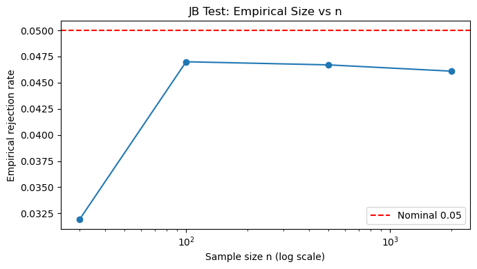

# Jarque-Bera 검정

## 개요

Jarque-Bera(JB) 검정은 계량경제학과 금융에서 널리 쓰이는 정규성 검정으로, D'Agostino $K^2$ 검정처럼 왜도와 첨도를 함께 평가한다. 표본왜도와 표본 초과첨도에 직접 기반한 더 단순한 공식을 쓰며, 귀무분포는 점근적으로 $\chi^2_2$이다. 큰 표본에 가장 적합하며 많은 계량경제 소프트웨어의 기본 정규성 진단이다.

## 검정통계량

표본왜도 $g_1$, 표본 초과첨도 $g_2$를 갖는 표본 $X_1, \ldots, X_n$에 대해 Jarque-Bera 통계량은

$$
\text{JB} = \frac{n}{6}\!\left(g_1^2 + \frac{g_2^2}{4}\right).
$$

근거는 간단하다. 정규성 아래에서 $\mathbb{E}[g_1] = 0$, $\mathbb{E}[g_2] = 0$이고 근사 분산은 $\text{Var}(g_1) \approx 6/n$, $\text{Var}(g_2) \approx 24/n$이다. 표준화하여 제곱합을 취하면

$$
\text{JB} \approx \left(\frac{g_1}{\sqrt{6/n}}\right)^2 + \left(\frac{g_2}{\sqrt{24/n}}\right)^2 \;\underset{H_0}{\sim}\; \chi^2_2.
$$

## 가설

$$
H_0: \gamma_1 = 0 \text{ 이고 } \gamma_2 = 0, \qquad H_1: \gamma_1 \neq 0 \text{ 또는 } \gamma_2 \neq 0.
$$

$p$값은 $p = P(\chi^2_2 \geq \text{JB}_{\text{obs}})$이며 $p < \alpha$일 때 $H_0$을 기각한다.

### 코드

```python
import numpy as np
from scipy import stats

rng = np.random.default_rng(0)
x = np.concatenate([rng.normal(0, 1, size=240),
                    rng.lognormal(0, 0.6, size=60)])

jb_stat, p = stats.jarque_bera(x)
g1 = stats.skew(x, bias=False)
g2 = stats.kurtosis(x, fisher=True, bias=False)

print(f"Sample size n = {x.size}")
print(f"Skewness g1 = {g1:.4f}")
print(f"Excess kurtosis g2 = {g2:.4f}")
print(f"Jarque-Bera: JB = {jb_stat:.4f}, p-value = {p:.4g}")
if p < 0.05:
    print("=> Reject normality at alpha = 0.05.")
else:
    print("=> Fail to reject normality at alpha = 0.05.")
```

출력:

```text
Sample size n = 300
Skewness g1 = 0.3707
Excess kurtosis g2 = 1.8565
Jarque-Bera: JB = 47.5606, p-value = 4.703e-11
=> Reject normality at alpha = 0.05.
```

## D'Agostino K제곱과의 비교

JB 검정과 D'Agostino $K^2$ 검정은 모두 왜도와 첨도를 결합하지만 구성이 다르다.

| 특징 | Jarque-Bera | D'Agostino $K^2$ |
|---|---|---|
| 공식 | $g_1, g_2$에 대한 직접적인 2차식 | $Z_1, Z_2$로의 비선형 변환 |
| 귀무분포 | $\chi^2_2$ (점근적) | $\chi^2_2$ (유한표본 적합이 더 좋음) |
| 작은 표본 정확도 | $n < 100$에서 나쁨 | $n \geq 20$에서 더 나음 |
| 전형적 용도 | 계량경제학, 금융 | 일반 통계학 |

$n$이 크면 두 검정은 비슷한 결과를 준다. 중간 정도의 $n$에서는 D'Agostino $K^2$ 검정의 $p$값이 더 정확한 경향이 있다.

같은 자료에 대한 두 검정의 값을 비교해 보자. 위 혼합 예제에서 $K^2 = 22.21$($p = 1.5 \times 10^{-5}$)인 반면 $\text{JB} = 47.56$($p = 4.7 \times 10^{-11}$)이다. JB가 훨씬 큰 값을 내는데, 이는 검정력이 더 좋아서가 아니라 JB가 $g_2$를 D'Agostino의 비선형 변환 없이 그대로 제곱하기 때문이다. 유한표본에서 $g_2$는 오른쪽으로 크게 치우쳐 있으므로 JB 통계량이 부풀려지기 쉽다.

## 해석

혼합 예제에서 대수정규 성분이 양의 왜도와 양의 초과첨도를 모두 들여온다. JB 통계량이 크고 $p$값이 사실상 0이다.

왜도와 첨도의 상대적 기여는 JB 공식의 두 항을 나누어 보면 알 수 있다. 이 자료에서

$$
\frac{n}{6} g_1^2 = 6.80, \qquad \frac{n}{24} g_2^2 = 40.76,
$$

이므로 (편향 추정값 $g_1 = 0.3688$, $g_2 = 1.8058$ 사용) 첨도 항이 전체 $47.56$의 $86\%$를 차지한다. 기각이 주로 두꺼운 꼬리에서 비롯됨을 알 수 있다.

## 연습문제

<div class="drillbox" markdown>

**연습문제 1.** 표준정규 관측값 $n = 500$개를 생성하라. JB 통계량과 $p$값을 계산하라. $\alpha = 0.05$에서 기각하지 않음을 확인하라.

</div>

??? success "풀이"

    ```python
    import numpy as np
    from scipy import stats

    rng = np.random.default_rng(42)
    x = rng.normal(0, 1, size=500)

    jb, p = stats.jarque_bera(x)
    print(f"JB = {jb:.4f}, p = {p:.4f}")
    ```

    출력:

    ```text
    JB = 0.7827, p = 0.6762
    ```

    $\text{JB} = 0.783$은 $\chi^2_2$의 95백분위수 $5.99$보다 훨씬 작고 $p = 0.676$이므로 기각하지 않는다. 자료가 참으로 정규이므로 기대한 결과이다.

    $\chi^2_2$의 평균이 2이므로 $\text{JB} = 0.783$은 오히려 평균보다 작은 값이다. 귀무가설 아래에서 흔히 일어나는 일이다. $\square$

<div class="drillbox" markdown>

**연습문제 2.** $\frac{n}{6}(g_1^2 + g_2^2/4)$를 손으로 계산하여 `stats.jarque_bera`의 출력과 비교함으로써 JB 공식을 확인하라.

</div>

??? success "풀이"

    ```python
    import numpy as np
    from scipy import stats

    rng = np.random.default_rng(0)
    x = np.concatenate([rng.normal(0, 1, 240), rng.lognormal(0, 0.6, 60)])

    g1 = stats.skew(x, bias=True)
    g2 = stats.kurtosis(x, fisher=True, bias=True)
    n = x.size
    jb_manual = (n / 6) * (g1**2 + g2**2 / 4)

    jb_scipy, _ = stats.jarque_bera(x)

    print(f"g1 (biased) = {g1:.4f}, g2 (biased) = {g2:.4f}")
    print(f"Manual JB:  {jb_manual:.4f}")
    print(f"SciPy JB:   {jb_scipy:.4f}")
    ```

    출력:

    ```text
    g1 (biased) = 0.3688, g2 (biased) = 1.8058
    Manual JB:  47.5606
    SciPy JB:   47.5606
    ```

    수치 정밀도까지 정확히 일치한다.

    **중요한 함정:** `stats.jarque_bera`는 왜도와 첨도의 **편향 추정값**(`bias=True`)을 쓴다. 손으로 계산할 때도 반드시 같게 맞춰야 한다. 편향 보정판($g_1 = 0.3707$, $g_2 = 1.8565$)을 쓰면 $\text{JB} = 49.95$가 나와 SciPy 값 $47.56$과 어긋난다. 차이가 5%다.

    $n$이 크면 두 추정값의 차이가 사라지지만, 작은 표본에서는 어느 쪽을 쓰는지가 실질적으로 중요하다. $\square$

<div class="drillbox" markdown>

**연습문제 3.** Jarque-Bera 검정이 작은 표본(예: $n = 30$)에서 크기 조절이 나쁜 이유를 설명하라.

</div>

??? success "풀이"

    JB 통계량은 점근 분산 $\text{Var}(g_1) \approx 6/n$과 $\text{Var}(g_2) \approx 24/n$에서 유도된다. 작은 $n$에서는 이 근사가 부정확하다. 참된 유한표본 분산이 다르고, $g_1$과 $g_2$의 분포가 정규로 잘 근사되지 않는다. 게다가 작은 $n$에서 $g_1$과 $g_2$가 독립이 아닐 수 있다.

    특히 $g_2$의 유한표본 분포는 **오른쪽으로 심하게 치우쳐** 있다. 정규성 아래에서도 $g_2$는 아래로는 $-2$ 정도까지밖에 갈 수 없지만 위로는 얼마든지 커질 수 있다. 그 결과 $g_2^2$의 분포가 $\chi^2_1$과 크게 다르다.

    결과적으로 $\chi^2_2$ 기준분포가 잘 맞지 않는다. JB의 실제 귀무분포는 $\chi^2_2$보다 **작은 값 쪽에 더 몰려 있어서** 명목 $\alpha = 0.05$ 임계값($\approx 5.99$)이 너무 크다. 검정이 *과소기각*하며(경험적 크기 $< 0.05$) 그만큼 검정력이 낮아진다. 연습문제 5에서 수치로 확인한다.

    작은 표본에는 D'Agostino $K^2$ 검정이나 Shapiro-Wilk 검정이 선호된다. $\square$

<div class="drillbox" markdown>

**연습문제 4.** JB 공식에서 $g_2^2$에 붙은 가중치 $1/4$이 점근 분산의 비율 $\text{Var}(g_2)/\text{Var}(g_1) \to 4$에서 나옴을 보여라.

</div>

??? success "풀이"

    점근 분산에서 $\text{Var}(g_1) \to 6/n$, $\text{Var}(g_2) \to 24/n$이다. 비율은

    $$
    \frac{\text{Var}(g_2)}{\text{Var}(g_1)} = \frac{24/n}{6/n} = 4.
    $$

    JB 공식에서 각 적률을 표준화하면

    $$
    \left(\frac{g_1}{\sqrt{6/n}}\right)^2 + \left(\frac{g_2}{\sqrt{24/n}}\right)^2 = \frac{n}{6} g_1^2 + \frac{n}{24} g_2^2 = \frac{n}{6}\left(g_1^2 + \frac{g_2^2}{4}\right).
    $$

    따라서 $g_2^2$에 붙은 인자 $1/4$은 $g_2$의 분산이 $g_1$의 네 배라는 사실을 보정하며, 두 표준화 성분이 모두 단위분산을 갖고 그 합이 $\chi^2_2$을 따르도록 보장한다.

    실무적 함의: 이 가중치 때문에 **JB는 같은 크기의 왜도보다 첨도에 덜 민감하다**. $|g_1| = |g_2| = c$이면 왜도 항이 첨도 항의 네 배를 기여한다. 그러나 실제 자료에서는 비정규성이 흔히 첨도 쪽에서 더 큰 값으로 나타나므로(본문 예제에서 $g_2 = 1.86$ 대 $g_1 = 0.37$), 결국 첨도 항이 지배하는 경우가 많다. $\square$

<div class="drillbox" markdown>

**연습문제 5.** $n \in \{30, 100, 500, 2000\}$에 대해 $\alpha = 0.05$에서 JB 검정의 경험적 크기를 추정하는 10,000회 반복 몬테카를로 연구를 수행하라. 결과를 그림으로 그리고 경험적 크기가 0.05 근처에서 안정되는 표본크기를 찾아라.

</div>

??? success "풀이"

    ```python
    import numpy as np
    from scipy import stats
    import matplotlib.pyplot as plt

    rng = np.random.default_rng(0)
    reps, alpha = 10000, 0.05
    ns = [30, 100, 500, 2000]
    sizes = []

    for n in ns:
        rej = sum(1 for _ in range(reps)
                  if stats.jarque_bera(rng.normal(0, 1, n))[1] < alpha)
        sizes.append(rej / reps)
        print(f"n = {n:>4}: empirical size = {rej/reps:.4f}")

    fig, ax = plt.subplots(figsize=(7, 4))
    ax.plot(ns, sizes, marker="o")
    ax.axhline(0.05, color="red", linestyle="--", label="Nominal 0.05")
    ax.set_xscale("log")
    ax.set_xlabel("Sample size n (log scale)")
    ax.set_ylabel("Empirical rejection rate")
    ax.set_title("JB Test: Empirical Size vs n")
    ax.legend()
    plt.tight_layout()
    plt.show()
    ```

    출력:

    ```text
    n =   30: empirical size = 0.0319
    n =  100: empirical size = 0.0470
    n =  500: empirical size = 0.0467
    n = 2000: empirical size = 0.0461
    ```

    

    $n = 30$에서 경험적 크기 $0.0319$는 명목값의 **64%에 불과하다**. 연습문제 3에서 설명한 과소기각을 확인해 준다. 실제 유의수준이 0.032라면 검정력도 그만큼 떨어진다.

    $n = 100$에서 $0.047$로 크게 개선되며 사실상 여기서 안정된다.

    다만 눈여겨볼 점이 있다. **$n = 100$에서 $n = 2000$으로 가도 더 나아지지 않는다**($0.0470 \to 0.0467 \to 0.0461$). 여전히 명목값보다 살짝 낮은 수준에 머문다. 몬테카를로 표준오차가 $\sqrt{0.05 \times 0.95/10000} = 0.0022$이므로 $0.046$과 $0.05$의 차이는 약 1.8 표준오차로 경계선상이지만, 세 표본크기에서 일관되게 같은 방향으로 나타난다는 점이 우연이 아님을 시사한다.

    이는 JB 검정의 잘 알려진 성질이다. $\chi^2_2$ 근사로의 수렴이 **매우 느리다**. $g_2$의 유한표본 분포가 치우쳐 있어 아주 큰 표본에서도 잔여 왜곡이 남는다. 실무적 결론: $n \geq 100$이면 JB를 쓸 만하지만, 크기 정확도가 결정적이면 모의실험 임계값을 쓰라. $\square$

---

## 정리하며

자크–베라를 **직접 구현하고 검산**했다.

- **공식이 단순해 손으로 적기 쉽다.** $g_1$ 과 $g_2$ 만 계산하면 되며, `scipy.stats.jarque_bera` 와 대조해 확인할 수 있다.
- **`scipy` 의 왜도·첨도 기본값에 주의한다.** `skew(x)` 와 `kurtosis(x)` 는 기본이 **편향 보정 없음**(`bias=True`)이고 첨도는 초과첨도(`fisher=True`)다. 보정 여부에 따라 통계량이 달라진다.
- **점근 분포라 소표본에서 부정확하다.** $n<50$ 이면 제1종 오류율이 명목값에서 눈에 띄게 벗어나며, 정확한 $p$ 값이 필요하면 몬테카를로로 귀무분포를 만든다.
- **회귀 잔차 진단으로 가장 자주 쓰인다.** `statsmodels` 의 요약표에 기본 포함되어 있다.
- **대표본에서 거의 언제나 기각한다는 점을 기억한다.** 그 자체로는 정보가 적으며, $g_1$·$g_2$ 값과 Q-Q 그림이 실질적 판단의 근거다.

다음 절부터 **형식적 정규성 검정**들로 넘어간다.
