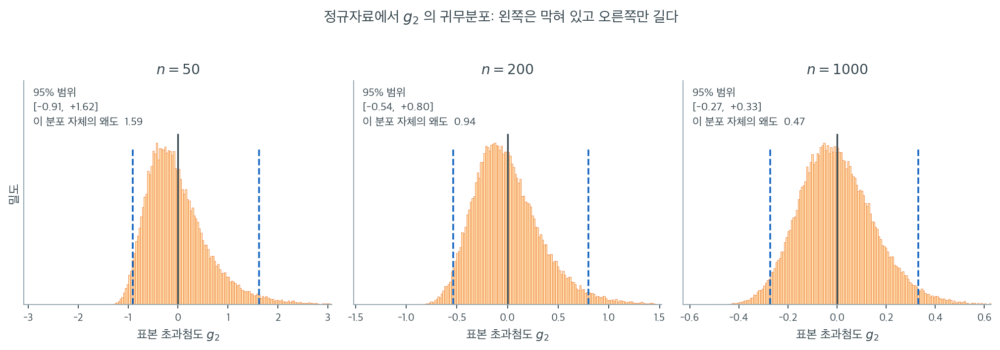

# 첨도 검정

## 개요

D'Agostino 첨도 검정은 자료의 초과첨도가 정규성 아래에서 기대되는 값인 0과 유의하게 다른지 평가한다. 초과첨도는 정규분포에 견준 꼬리의 두꺼움을 잰다. 이 검정은 표본 초과첨도를 귀무가설 아래에서 근사적으로 표준정규를 따르는 $Z$ 통계량으로 변환하여 꼬리 거동을 겨냥한 확인을 제공한다.

---

## 1. 표본 초과첨도

표본 $X_1, \ldots, X_n$에 대한 편향 보정 Fisher 초과첨도는

$$
g_2 = \frac{n(n+1)}{(n-1)(n-2)(n-3)} \sum_{i=1}^{n} \left(\frac{X_i - \bar{X}}{S}\right)^4 - \frac{3(n-1)^2}{(n-2)(n-3)}.
$$

정규성 아래에서 $\mathbb{E}[g_2] = 0$이다. $g_2 > 0$인 분포를 *고첨*(leptokurtic, 정규보다 꼬리가 두꺼움), $g_2 < 0$인 분포를 *저첨*(platykurtic, 꼬리가 얇음)이라 한다.

---

## 2. D'Agostino 첨도 변환

왜도 검정과 비슷하게, D'Agostino와 Pearson은 $g_2$를 비선형 사상으로 변환하여 $H_0$ 아래에서 근사적으로 $\mathcal{N}(0,1)$인 통계량 $Z_2$를 만든다. 정규성 아래에서 $g_2$의 분산은 근사적으로

$$
\text{Var}(g_2) \approx \frac{24n(n-2)(n-3)}{(n+1)^2(n+3)(n+5)}.
$$

표준화와 추가 보정을 거친 $Z_2$를 추론에 쓴다.

### g2의 귀무분포는 왜 표준화만으로 부족한가

위 분산 공식만 보면 $g_2$를 $\sqrt{\text{Var}(g_2)}$로 나누기만 하면 될 것 같다. 그렇지 않은 이유는 $g_2$의 귀무분포가 **대칭이 아니기** 때문이다. 아래 그림은 진짜 정규자료에서 표본을 60000번씩 뽑아 $g_2$의 분포를 세 표본크기에 대해 그린 것이다.



$n = 50$에서 히스토그램은 왼쪽이 $-1.2$ 근처에서 뚝 끊기고 오른쪽으로는 $+3$ 너머까지 늘어진다. 95% 범위가 $[-0.91, +1.62]$로 0을 중심으로 전혀 대칭이 아니다. 이 분포 자체의 왜도를 재면 $1.59$다. 정규성을 검정하겠다고 쓰는 통계량의 귀무분포가 정작 크게 치우쳐 있는 셈이다.

구조적인 이유가 있다. 초과첨도는 정의상 아래로 막혀 있다. 어떤 자료를 가져와도 $g_2$가 $-2$보다 작아질 수 없는 반면 위로는 한계가 없다. 게다가 앞에서 본 대로 $g_2$는 꼬리의 몇 안 되는 관측값이 좌우하므로, 우연히 큰 값 하나가 들어오면 값이 위로 크게 튄다. 한쪽으로만 튈 수 있는 통계량은 대칭일 수 없다.

표본을 키우면 나아지기는 한다. $n = 200$에서 95% 범위는 $[-0.54, +0.80]$이고 분포 자체의 왜도는 $0.94$, $n = 1000$에서는 $[-0.27, +0.33]$에 왜도 $0.47$이다. 그런데 이 속도를 보라. 표본을 20배로 늘렸는데도 왜도가 $1.59$에서 $0.47$로 줄었을 뿐 0에 가깝다고는 말하기 어렵다. **실무에서 만나는 거의 모든 표본크기에서 $g_2$의 귀무분포는 눈에 띄게 치우쳐 있다.** 그래서 단순 표준화로는 $N(0,1)$ 근사를 얻을 수 없고, D'Agostino와 Pearson이 고안한 비선형 변환이 필요한 것이다.

---

## 3. 가설

$$
H_0: \gamma_2 = 0 \quad (\text{모집단 초과첨도가 0이다}), \qquad H_1: \gamma_2 \neq 0.
$$

양측 $p$값은 $p = 2\,\Phi(-|Z_2|)$이다.

<div class="exbox" markdown>

**보기 1.** <span class="diff easy" title="쉬움"></span> 꼬리만 두꺼운 자료의 첨도 검정. $\mathcal{N}(0,1)$ 220개에 $t_4$ 80개를 섞은 $n = 300$ 표본에서 $Z_2 = 2.7603$, $p = 0.00577$이 나온다.

**(1)** 변환 전의 **단순 표준화** $u = \{b_2 - \mathbb{E}[b_2]\}/\mathrm{SD}(b_2)$를 구하시오. 정규성 아래에서 $\mathbb{E}[b_2]$가 3이 아니라는 점에 주의하라. 변환은 $u$를 어디로 옮기며, 단순 표준화를 그대로 썼다면 $p$값이 몇 배 달라지는가.

**(2)** `scipy.stats.kurtosistest`가 쓰는 첨도는 어느 판본인가. 출력에 찍힌 $1.0493$과 같은 값인가.

</div>

??? success "풀이"

    **(1) $u = 3.7403$이고 변환이 그것을 $2.7603$으로 끌어내린다.** 먼저 중심이 3이 아니다. 정규성 아래에서 비보정 첨도 $b_2 = m_4/m_2^2$의 기댓값은

    $$
    \mathbb{E}[b_2] = \frac{3(n-1)}{n+1}
    $$

    이고 $n = 300$에서 $2.980066$이다. 3보다 작다. **표본첨도는 정규 자료에서도 3을 밑돌게 나오는 쪽으로 편향되어 있다.** 분산은 위 본문의 식

    $$
    \mathrm{Var}(b_2) = \frac{24n(n-2)(n-3)}{(n+1)^2(n+3)(n+5)}
    $$

    에서 $\mathrm{SD}(b_2) = 0.275877$이다. 이 표본의 $b_2 = 4.011938$을 넣으면

    $$
    u = \frac{4.011938 - 2.980066}{0.275877} = 3.740339
    $$

    이다. 변환은 앞 절의 왜도 검정과 달리 역쌍곡사인이 아니라 **윌슨–힐퍼티 꼴의 세제곱근**을 쓴다. $b_2$의 귀무분포가 치우친 정도를 $\sqrt{\beta_1}$로 재고, 그만큼 치우친 카이제곱을 펴는 세제곱근 변환을 적용하는 것이다.

    $$
    \sqrt{\beta_1} = \frac{6(n^2 - 5n + 2)}{(n+7)(n+9)}\sqrt{\frac{6(n+3)(n+5)}{n(n-2)(n-3)}}, \quad
    A = 6 + \frac{8}{\sqrt{\beta_1}}\left(\frac{2}{\sqrt{\beta_1}} + \sqrt{1 + \frac{4}{\beta_1}}\right)
    $$

    $$
    Z_2 = \frac{\bigl(1 - \frac{2}{9A}\bigr) - \left(\dfrac{1 - 2/A}{1 + u\sqrt{2/(A-4)}}\right)^{1/3}}{\sqrt{2/(9A)}}
    $$

    $n = 300$에서 $\sqrt{\beta_1} = 0.808923$, $A = 56.827255$이고 $Z_2 = 2.760321$이 나온다.

    **$p$값은 31배 달라진다.** 단순 표준화 $u = 3.7403$을 표준정규 분위수로 읽으면 $p = 0.000184$인데, 변환을 거친 참값은 $p = 0.005774$다. 비 $0.005774/0.000184 = 31.4$다. $b_2$의 귀무분포가 오른쪽으로 치우쳐 있어 큰 양의 값이 정규 자료에서도 흔히 나오는데, 단순 표준화는 그 사실을 모르고 과장한다. 이 보기에서는 어느 쪽이든 $\alpha = 0.05$에서 기각하지만, 결론의 **강도**가 "매우 유의"에서 "유의"로 내려앉는다.

    **(2) 쓰는 것은 비보정 $b_2$이고, 출력의 $1.0493$과 다르다.** 세 판본을 나란히 놓으면

    | 판본 | 값 |
    |---|---|
    | $b_2 = m_4/m_2^2$ (`fisher=False, bias=True`) | $4.011938$ |
    | $g_2 = b_2 - 3$ (`fisher=True, bias=True`, 기본값) | $1.011938$ |
    | 보정 초과첨도 $G_2$ (`fisher=True, bias=False`) | $1.049279$ |

    이고, `kurtosistest`가 쓰는 것은 첫 줄의 $b_2$다. 코드는 세 번째 줄의 $G_2 = 1.0493$을 찍으므로 **출력의 두 수가 서로 맞물리지 않는다.** 손으로 $Z_2$를 재현하려면 `fisher=False`에 `bias` 인자 없이 불러야 한다.

    같은 이유로 본문의 분산식은 **비보정판** $b_2$(또는 $g_2$, 상수 이동이니 분산은 같다)의 것이다. 모의실험으로 $n = 300$, 200만 번 반복해 재면 $\mathrm{SD}(b_2) = 0.27588$로 공식값 $0.275877$과 소수 다섯째 자리까지 맞는데, 같은 실험에서 보정판은 $\mathrm{SD}(G_2) = 0.2789$로 어긋난다.

    ```python
    import numpy as np
    from scipy import stats

    # 정규에 자유도 4 짜리 t 를 섞었다. 중심은 그대로이고 꼬리만 두꺼워진다.
    # 왜도 검정으로는 잡히지 않고 첨도 검정에만 걸리는 자료다.
    rng = np.random.default_rng(0)
    x = np.concatenate([rng.normal(0, 1, size=220),
                        rng.standard_t(df=4, size=80)])

    # 표본첨도를 바로 쓰지 않고 Z 로 바꾸는 까닭은, 첨도의 표집분포가 표본이
    # 상당히 클 때까지도 크게 치우쳐 있기 때문이다. 이 검정은 n>=20 부터 쓸 만하다.
    g2 = stats.kurtosis(x, fisher=True, bias=False)
    z, p = stats.kurtosistest(x)

    print(f"Sample size n = {x.size}")
    print(f"Sample excess kurtosis (Fisher) g2 = {g2:.4f}")
    print(f"D'Agostino kurtosis test: Z = {z:.4f}, p-value = {p:.4g}")
    if p < 0.05:
        print("=> Evidence of non-normal kurtosis (departing from normality).")
    else:
        print("=> No strong evidence of non-normal kurtosis.")
    ```

    출력:

    ```text
    Sample size n = 300
    Sample excess kurtosis (Fisher) g2 = 1.0493
    D'Agostino kurtosis test: Z = 2.7603, p-value = 0.005774
    => Evidence of non-normal kurtosis (departing from normality).
    ```

    변환을 한 단계씩 손으로 짚으면 다음과 같다.

    ```python
    import numpy as np
    from scipy import stats

    rng = np.random.default_rng(0)
    x = np.concatenate([rng.normal(0, 1, size=220),
                        rng.standard_t(df=4, size=80)])
    n = x.size

    b2 = stats.kurtosis(x, fisher=False)              # 비보정, 3 을 빼지 않은 것
    g2 = stats.kurtosis(x)                            # 비보정 초과첨도 = b2 - 3
    G2 = stats.kurtosis(x, fisher=True, bias=False)   # 보정 초과첨도
    print(f"b2 (비보정)      = {b2:.6f}")
    print(f"g2 = b2 - 3      = {g2:.6f}")
    print(f"G2 (보정)        = {G2:.6f}")

    # 1단계: 정규성 아래의 평균과 분산으로 표준화.
    E = 3.0 * (n - 1) / (n + 1)
    varb2 = 24.0 * n * (n - 2) * (n - 3) / ((n + 1) ** 2 * (n + 3) * (n + 5))
    u = (b2 - E) / np.sqrt(varb2)
    print(f"\nE[b2] = 3(n-1)/(n+1) = {E:.6f},  SD(b2) = {np.sqrt(varb2):.6f}")
    print(f"단순 표준화 u = {u:.6f}")

    # 2단계: 귀무분포의 왜도를 윌슨–힐퍼티 세제곱근으로 펴 준다.
    sqrtbeta1 = (6.0 * (n * n - 5 * n + 2) / ((n + 7) * (n + 9))
                 * np.sqrt(6.0 * (n + 3) * (n + 5) / (n * (n - 2) * (n - 3))))
    A = 6.0 + 8.0 / sqrtbeta1 * (2.0 / sqrtbeta1 + np.sqrt(1 + 4.0 / sqrtbeta1**2))
    term1 = 1 - 2 / (9.0 * A)
    term2 = ((1 - 2.0 / A) / (1 + u * np.sqrt(2 / (A - 4.0)))) ** (1 / 3)
    Z = (term1 - term2) / np.sqrt(2 / (9.0 * A))
    print(f"sqrt(beta1) = {sqrtbeta1:.6f},  A = {A:.6f}")
    print(f"손계산 Z2 = {Z:.6f},  p = {2 * stats.norm.sf(abs(Z)):.6f}")

    z_scipy, p_scipy = stats.kurtosistest(x)
    print(f"scipy  Z2 = {z_scipy:.6f},  p = {p_scipy:.6f}")
    print(f"\n단순 표준화만 했다면 p = {2 * stats.norm.sf(abs(u)):.6f}")
    ```

    출력:

    ```text
    b2 (비보정)      = 4.011938
    g2 = b2 - 3      = 1.011938
    G2 (보정)        = 1.049279

    E[b2] = 3(n-1)/(n+1) = 2.980066,  SD(b2) = 0.275877
    단순 표준화 u = 3.740339
    sqrt(beta1) = 0.808923,  A = 56.827255
    손계산 Z2 = 2.760321,  p = 0.005774
    scipy  Z2 = 2.760321,  p = 0.005774

    단순 표준화만 했다면 p = 0.000184
    ```

    손으로 밟은 $Z_2 = 2.760321$이 `scipy.stats.kurtosistest`의 값과 **소수점 여섯째 자리까지** 같다. 맨 아래 줄이 (1)의 요점이다. 변환을 생략하면 $p$값이 $0.005774$가 아니라 $0.000184$가 되어, 같은 자료를 두고 증거의 강도를 서른 배 넘게 부풀리게 된다. $\square$

---

## 4. 해석

위 예는 정규 추출값과 $t_4$ 추출값의 혼합이라 순수 정규표본보다 꼬리가 두껍다. 초과첨도 $g_2 = 1.049$로 뚜렷하게 양수이고 검정은 $\alpha = 0.05$에서 기각한다($p = 0.0058$).

첨도 검정은 두꺼운 꼬리의 오염, 이상점이 잘 생기는 분포, 균등분포 같은 얇은 꼬리 분포를 탐지하는 데 특히 유용하다.

**최소 표본크기.** SciPy의 `kurtosistest`는 $n \geq 20$을 요구한다. 더 작은 표본에서는 $Z_2$의 정규근사를 믿을 수 없다.

---

## 연습문제

<div class="drillbox" markdown>

**연습문제 1.** <span class="diff easy" title="쉬움"></span> 표준정규 관측값 $n = 300$개를 생성하라. $g_2$와 첨도 검정 $p$값을 계산하라. $g_2$가 0에 가깝고 검정이 기각하지 않음을 확인하라.

</div>

??? success "풀이"

    ```python
    import numpy as np
    from scipy import stats

    rng = np.random.default_rng(10)
    x = rng.normal(0, 1, size=300)

    g2 = stats.kurtosis(x, fisher=True, bias=False)
    z, p = stats.kurtosistest(x)

    print(f"g2 = {g2:.4f}")
    print(f"Z = {z:.4f}, p = {p:.4f}")
    ```

    출력:

    ```text
    g2 = 0.1380
    Z = 0.6014, p = 0.5476
    ```

    $g_2 = 0.138$로 0에 가깝고 $p = 0.548$이므로 검정은 귀무가설을 올바르게 유지한다.

    참고로 $n = 300$에서 $g_2$의 표준오차는 약 $\sqrt{24/300} = 0.283$이므로, $0.138$은 채 반 표준오차도 되지 않는다. $\square$

---

<div class="drillbox" markdown>

**연습문제 2.** <span class="diff easy" title="쉬움"></span> $\text{Uniform}(0,1)$ 분포에서 관측값 $n = 300$개를 생성하라. $g_2$를 계산하고 첨도 검정을 수행하라. 균등분포는 대칭이지만 저첨이다($\gamma_2 = -1.2$). 검정이 이를 탐지하는가?

</div>

??? success "풀이"

    ```python
    import numpy as np
    from scipy import stats

    rng = np.random.default_rng(0)
    x = rng.uniform(0, 1, size=300)

    g2 = stats.kurtosis(x, fisher=True, bias=False)
    z, p = stats.kurtosistest(x)

    print(f"g2 = {g2:.4f}, Z = {z:.4f}, p = {p:.4g}")
    ```

    출력:

    ```text
    g2 = -1.1951, Z = -12.5358, p = 4.755e-36
    ```

    표본 $g_2 = -1.195$가 이론값 $-1.2$에 거의 정확히 일치하고, $p$값이 $4.8 \times 10^{-36}$으로 초과첨도가 0이라는 귀무가설을 압도적으로 기각한다.

    첨도 검정이 **대칭인 비정규 분포도 탐지**할 수 있음을 보여준다. 같은 자료에서 왜도 검정은 $p = 0.307$로 기각하지 못한다(왜도 검정 페이지의 연습문제 2 참조). 두 검정이 서로 다른 이탈 방향을 담당하며, D'Agostino $K^2$가 둘을 결합하는 이유이다.

    저첨 자료에서 검정력이 유난히 높다는 점도 눈여겨볼 만하다. $|\gamma_2| = 1.2$는 $t_{10}$의 $\gamma_2 = 1$과 비슷한 크기인데도 $|Z| = 12.5$가 나온다. 균등분포는 유계이므로 $g_2$의 표집변동이 작기 때문이다. 연습문제 4의 두꺼운 꼬리 경우와 정반대이다. $\square$

---

<div class="drillbox" markdown>

**연습문제 3.** <span class="diff med" title="중간"></span> 바탕 분포가 정규이더라도 이상점이 많은 자료가 $g_2 > 0$을 만들어 내는 이유를 설명하고, 첨도 검정에 대한 함의를 논하라.

</div>

??? success "풀이"

    첨도 공식의 네제곱 $(X_i - \bar{X})^4$은 극단 관측값에 불균형하게 큰 영향력을 준다. $|X_i - \bar{X}|$가 큰 이상점 몇 개가 분모의 $S^4$을 부풀리는 것보다 분자를 훨씬 크게 부풀려 $g_2$를 0 위로 밀어 올린다.

    이상점이 진짜라면(곧 참 분포의 꼬리가 두껍다면) $g_2 > 0$은 고첨을 올바르게 탐지한 것이다. 그러나 이상점이 자료 입력 오류나 측정 이상이라면 첨도 검정이 잘못된 이유로 정규성을 기각할 수 있다.

    유의한 첨도 검정 결과를 해석하기 전에 반드시 이상 관측값이 있는지 자료를 살피고 그것이 진짜인지 평가해야 한다. 실용적인 절차는 이상점을 제외하고 검정을 다시 돌려 결론이 뒤집히는지 보는 것이다. 뒤집힌다면 결론이 소수의 점에 의존한다는 뜻이므로 그 사실을 보고해야 한다. $\square$

---

<div class="drillbox" markdown>

**연습문제 4.** <span class="diff med" title="중간"></span> 5,000회 반복의 몬테카를로 모의실험으로 $t_5$ 분포에서 뽑은 관측값 $n = 100$개에 대해 $\alpha = 0.05$에서 첨도 검정의 검정력을 추정하라. $t_{10}$에 대한 검정력과 비교하라.

</div>

??? success "풀이"

    ```python
    import numpy as np
    from scipy import stats

    rng = np.random.default_rng(0)
    n, reps, alpha = 100, 5000, 0.05

    for df in [5, 10]:
        rejections = 0
        for _ in range(reps):
            x = rng.standard_t(df=df, size=n)
            _, p = stats.kurtosistest(x)
            if p < alpha:
                rejections += 1
        print(f"t({df}): power = {rejections / reps:.4f}")
    ```

    출력:

    ```text
    t(5): power = 0.6058
    t(10): power = 0.2448
    ```

    $t_5$의 초과첨도는 $\gamma_2 = 6/(5-4) = 6$이고 $t_{10}$은 $\gamma_2 = 6/(10-4) = 1$이다. 예상대로 정규에서 더 멀리 떨어진 $t_5$에 대한 검정력($0.606$)이 $t_{10}$에 대한 검정력($0.245$)보다 훨씬 높다.

    !!! warning "$\gamma_2 = 6$인데도 검정력이 0.61밖에 안 되는 이유"
        $n = 100$에서 $g_2$의 귀무 표준오차는 $\sqrt{24/100} = 0.49$이므로, 신호 $\gamma_2 = 6$은 명목상 12 표준오차에 해당한다. 그렇다면 검정력이 1에 가까워야 할 것 같지만 실제로는 0.61이다.

        이유는 **$g_2$의 분산 공식이 귀무가설(정규성) 아래에서만 유효**하기 때문이다. 대립가설 아래에서 $g_2$의 분산은 바탕 분포의 **8차 적률**에 의존한다. $t_\nu$는 차수가 $\nu$ 미만인 적률만 가지므로 $t_5$에는 8차 적률이 존재하지 않는다. 곧 $t_5$ 아래에서 $g_2$의 분산은 **무한대**이다.

        결과적으로 $g_2$의 표집분포가 극도로 두꺼운 꼬리를 갖게 되어, 평균은 6 근처로 크게 이동하지만 개별 표본의 값이 심하게 요동한다. 상당수 표본에서 $g_2$가 임계값 아래로 떨어져 기각에 실패한다.

        $t_{10}$은 8차 적률이 존재하지만($\nu = 10 > 8$) 신호 $\gamma_2 = 1$이 작아서 검정력이 낮다.

    실무적 교훈: **첨도 검정은 두꺼운 꼬리를 탐지하는 데 생각보다 약하다.** 자기가 탐지하려는 바로 그 성질이 자신의 추정량을 불안정하게 만들기 때문이다. 두꺼운 꼬리가 의심되면 첨도 검정 하나에 의존하지 말고 Q-Q 그림과 Anderson-Darling 같은 꼬리 가중 검정을 함께 쓰라. $\square$

---

<div class="drillbox" markdown>

**연습문제 5.** <span class="diff hard" title="어려움"></span> 정확한 공식에서 출발하여 $n \to \infty$일 때 $\text{Var}(g_2) \to 24/n$임을 유도하라.

</div>

??? success "풀이"

    다음에서 출발한다.

    $$
    \text{Var}(g_2) = \frac{24n(n-2)(n-3)}{(n+1)^2(n+3)(n+5)}.
    $$

    분자에서 $n^3$을, 분모에서 $n^5$을 묶어낸다.

    $$
    \text{Var}(g_2) = \frac{24\, n^3\bigl(1 - \frac{2}{n}\bigr)\bigl(1 - \frac{3}{n}\bigr)}{n^5\bigl(1 + \frac{1}{n}\bigr)^2\bigl(1 + \frac{3}{n}\bigr)\bigl(1 + \frac{5}{n}\bigr)} = \frac{24}{n} \cdot \frac{(1 - 2/n)(1 - 3/n)}{(1 + 1/n)^2(1 + 3/n)(1 + 5/n)}.
    $$

    $n \to \infty$일 때 모든 보정 인자가 1로 가므로 $\text{Var}(g_2) \to 24/n$이다. 따라서 $g_2$의 표준오차는 근사적으로 $\sqrt{24/n}$이다.

    $g_1$의 표준오차 $\sqrt{6/n}$과 비교하면 $g_2$의 표준오차가 두 배임을 알 수 있다. 첨도가 왜도보다 추정하기 어렵다는 뜻이고, 이는 검정력에도 그대로 반영된다. $\square$

---

## 정리하며

첨도 검정은 **꼬리의 두꺼움**을 겨냥한다.

- **초과첨도 $g_2$ 를 $Z$ 로 변환한다.** 왜도보다도 수렴이 느려 변환이 더 복잡하며, `scipy` 는 $n\ge20$ 을 요구한다.
- **4차 적률에 의존해 추정이 불안정하다.** 표준오차가 크고 이상치 몇 개에 크게 흔들리므로, **$n$ 이 수백은 되어야 신뢰할 만하다.**
- **양수면 두꺼운 꼬리(급첨), 음수면 얇은 꼬리(평첨)다.** 금융 수익률은 거의 언제나 전자다.
- **대칭이지만 정규가 아닌 경우를 잡는다.** 왜도 검정이 놓치는 $t$ 분포나 균등분포를 이 검정이 잡아낸다. **둘을 함께 써야 하는 이유다.**
- **4차적률이 무한한 분포에서는 무의미하다.** $t_4$ 이하나 $\alpha\le4$ 인 파레토가 그런 경우다.

다음 절 **D'Agostino $K^2$ 검정 (코드)** 로 넘어간다.
