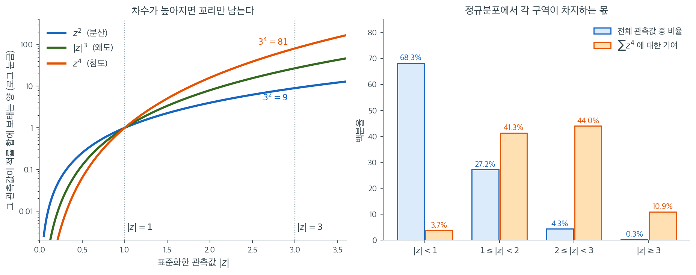

# 왜도와 첨도

기술통계는 분포의 모양을 수량화하고 그것이 정규분포와 얼마나 닮았는지 평가한다. 정규성을 평가하는 두 핵심 측도가 **왜도**와 **첨도**이다. 이 지표들은 각각 자료 분포의 비대칭성과 꼬리의 두꺼움을 기술한다.

## 왜도

**왜도**는 분포의 비대칭성을 잰다. 완전한 정규분포에서 왜도는 0이다. 양의 왜도는 오른쪽 꼬리가 길다는(자료가 오른쪽으로 치우쳤다는) 뜻이고, 음의 왜도는 왼쪽 꼬리가 길다는 뜻이다.

왜도의 공식은

$$
\text{Skewness} = \frac{1}{n} \sum_{i=1}^{n} \left( \frac{x_i - \bar{x}}{s} \right)^3
$$

여기서

- $n$은 자료점의 개수,
- $x_i$는 각 자료점,
- $\bar{x}$는 표본평균,
- $s$는 표본표준편차이다.

왜도가 0에 가까우면 모집단 분포가 대칭일 가능성이 높아 정규성을 시사한다. 0에서 크게 벗어나면 비정규성을 시사한다.

<div class="exbox" markdown>

**보기 1.** <span class="diff easy" title="쉬움"></span> 정규자료의 왜도. $\mathcal{N}(0, 3^2)$에서 $n = 1000$개를 뽑아 왜도를 재면 $0.0339$가 나온다.

**(1)** 왜도가 **척도에 휘둘리지 않는다**는 것을 공식에서 보이시오. 같은 씨앗으로 표준편차만 1에서 3으로 바꿔 뽑으면 왜도가 어떻게 되는가.

**(2)** 관측된 $0.0339$는 참값 0과 구별되는가. 표준오차를 구해 판정하시오. 그 표준오차는 어느 판본($g_1$인가 $G_1$인가)의 것인가.

</div>

??? success "풀이"

    **(1) 척도불변성은 분모의 거듭제곱에서 바로 나온다.** 중심적률을 $m_k = \frac1n\sum(x_i - \bar x)^k$라 두면 공식은

    $$
    g_1 = \frac{m_3}{m_2^{3/2}}
    $$

    이다. $y_i = c\,x_i + d$ ($c > 0$)로 옮기고 늘이면 $\bar y = c\bar x + d$이므로 편차가 $y_i - \bar y = c(x_i - \bar x)$가 되고

    $$
    m_k(y) = \frac1n\sum c^k (x_i - \bar x)^k = c^k m_k(x)
    $$

    이다. 따라서

    $$
    g_1(y) = \frac{c^3 m_3(x)}{\bigl(c^2 m_2(x)\bigr)^{3/2}} = \frac{c^3}{c^3}\cdot\frac{m_3(x)}{m_2(x)^{3/2}} = g_1(x)
    $$

    로 **$c$와 $d$가 완전히 약분된다.** 첨도도 $m_4/m_2^2$에서 $c^4/c^4$가 되어 같은 이유로 불변이다. 다만 $c < 0$이면 $c^3 < 0$이라 왜도의 **부호가 뒤집힌다**. 뒤집힌 분포의 치우침이 반대쪽인 것이 당연하다.

    `numpy`의 `normal(0, scale, size)`는 표준정규 추출값에 `scale`을 곱하는 방식이라, 씨앗을 고정하면 `normal(0, 3, 1000)`이 `normal(0, 1, 1000)`의 **정확히 3배**다. 그러므로 두 왜도는 마지막 자리까지 같아야 하고, 실제로 둘 다 $0.0338589532$다.

    **(2) 구별되지 않는다. 표준오차의 $0.44$배에 지나지 않는다.** 정규 i.i.d. 표본에서 **보정판** $G_1$의 표준오차는 닫힌 꼴로

    $$
    \mathrm{SE}(G_1) = \sqrt{\frac{6n(n-1)}{(n-2)(n+1)(n+3)}}
    $$

    이다. $n = 1000$에서 $0.07734$이고, 흔히 쓰는 어림 $\sqrt{6/n} = 0.07746$이 그 값을 조금 위로 잡는다. **이 식은 $g_1$의 것이 아니다.** 두 판본은

    $$
    G_1 = \frac{\sqrt{n(n-1)}}{n-2}\,g_1
    $$

    로 묶여 있으니 역으로 $\mathrm{SE}(g_1) = \mathrm{SE}(G_1)\cdot\frac{n-2}{\sqrt{n(n-1)}} = 0.07734/1.001503 = 0.07723$이다. $n = 1000$에서는 둘의 차이가 $0.1\%$로 실무상 무해하지만, 작은 표본에서는 차이가 커지므로 어느 판본의 표준오차인지 밝혀야 한다.

    `scipy.stats.skew`의 기본값은 `bias=True`이므로 코드가 돌려준 $0.0338590$은 $g_1$이다. 따라서 비교 대상은 $\mathrm{SE}(g_1) = 0.0772$이고

    $$
    \frac{g_1}{\mathrm{SE}(g_1)} = \frac{0.0338590}{0.0772} = 0.44
    $$

    다. $2\,\mathrm{SE}$에 한참 못 미치니 **"왜도가 0이 아니다"고 말할 근거가 전혀 없다.** 정규 자료에서 이보다 큰 왜도가 나올 확률이 $66\%$나 된다.

    ```python
    import numpy as np
    from scipy import stats

    np.random.seed(0)

    # 정규분포는 좌우대칭이므로 왜도가 0 근처로 나온다. 표준편차를 3 으로
    # 키워도 마찬가지다 — 왜도는 척도에 휘둘리지 않는 값이다.
    data = np.random.normal(0, 3, 1000)
    # data = np.random.exponential(1, 1000)

    skewness_value = stats.skew(data)
    print(f"Skewness: {skewness_value:.4f}")
    ```

    출력:

    ```
    Skewness: 0.0339
    ```

    척도불변성과 표준오차를 수로 확인하면 다음과 같다.

    ```python
    import numpy as np
    from scipy import stats

    np.random.seed(0)

    # 같은 씨앗에서 척도만 바꾸어 뽑으면 자료는 정확히 3배가 된다.
    a = np.random.normal(0, 3, 1000)
    np.random.seed(0)
    b = np.random.normal(0, 1, 1000)
    print(f"a 가 b 의 정확히 3배인가: {np.array_equal(a, 3 * b)}")
    print(f"skew(a) = {stats.skew(a):.10f}")
    print(f"skew(b) = {stats.skew(b):.10f}")

    # 표준오차: 보정판 G1 에 대한 정확식과 어림값.
    n = 1000
    se_G1 = np.sqrt(6 * n * (n - 1) / ((n - 2) * (n + 1) * (n + 3)))
    se_g1 = se_G1 * (n - 2) / np.sqrt(n * (n - 1))
    print(f"\nSE(G1) 정확식 = {se_G1:.5f},  sqrt(6/n) = {np.sqrt(6 / n):.5f}")
    print(f"SE(g1) = SE(G1) * (n-2)/sqrt(n(n-1)) = {se_g1:.5f}")

    # 모의실험으로 두 판본의 표준편차를 직접 잰다.
    rng = np.random.default_rng(11)
    R = 50_000
    X = rng.standard_normal((R, n))
    sd_g1 = stats.skew(X, axis=1).std(ddof=1)
    sd_G1 = stats.skew(X, axis=1, bias=False).std(ddof=1)
    print(f"모의 sd(g1) = {sd_g1:.5f},  모의 sd(G1) = {sd_G1:.5f}  (R = {R})")
    print(f"관측된 g1 = {stats.skew(b):.4f} 은 SE 의 {stats.skew(b) / sd_g1:.2f} 배")
    ```

    출력:

    ```text
    a 가 b 의 정확히 3배인가: True
    skew(a) = 0.0338589532
    skew(b) = 0.0338589532

    SE(G1) 정확식 = 0.07734,  sqrt(6/n) = 0.07746
    SE(g1) = SE(G1) * (n-2)/sqrt(n(n-1)) = 0.07723
    모의 sd(g1) = 0.07741,  모의 sd(G1) = 0.07753  (R = 50000)
    관측된 g1 = 0.0339 은 SE 의 0.44 배
    ```

    모의실험이 닫힌 꼴을 재현한다. $\mathrm{SE}(G_1)$의 정확식 $0.07734$에 대해 모의값이 $0.07753$인데, $R = 50000$에서 표준편차 추정의 몬테카를로 오차가 대략 $\mathrm{SE}/\sqrt{2R} = 0.00024$이므로 차이 $0.00019$는 그 안에 들어온다. $g_1$ 쪽도 닫힌 꼴 $0.07723$ 대 모의 $0.07741$로 같은 수준에서 맞는다.

    한 가지 짚어 둘 것은 이 쪽 본문의 공식

    $$
    \frac{1}{n}\sum_{i=1}^{n}\left(\frac{x_i - \bar x}{s}\right)^3
    $$

    에서 $s$를 **$1/n$로 나눈 $\sqrt{m_2}$로 읽어야** `scipy`와 맞는다는 점이다. $1/(n-1)$짜리 표본표준편차를 넣으면 결과가 $g_1\cdot\bigl(\frac{n-1}{n}\bigr)^{3/2}$이 되어, $n = 1000$에서도 $0.0338590$이 아니라 $0.0338083$이 나온다. 넷째 자리가 달라진다.

    주석 처리된 지수 자료로 바꿔 실행하면 왜도가 $2.0526$이 되어(이론값 2) 강한 오른쪽 치우침을 보여 준다. 그때는 $2.05/0.077 = 27$배이니 판정이 전혀 다르다. $\square$

## 첨도

**첨도**는 분포의 "꼬리 두꺼움"을 기술한다. 정규분포의 첨도 값은 3이다(**중첨**이라고도 한다). 첨도가 3보다 크면 꼬리가 두꺼운 분포(**고첨**)이고, 3보다 작으면 꼬리가 얇은 분포(**저첨**)이다.

첨도의 공식은

$$
\text{Kurtosis} = \frac{1}{n} \sum_{i=1}^{n} \left( \frac{x_i - \bar{x}}{s} \right)^4
$$

**초과첨도**의 공식은

$$
\text{Excess Kurtosis} = \frac{1}{n} \sum_{i=1}^{n} \left( \frac{x_i - \bar{x}}{s} \right)^4 - 3
$$

3을 빼면 정규분포의 초과첨도가 0이 되어 비교하기 쉬워진다. `scipy.stats.kurtosis` 함수는 원래의 첨도가 아니라 이 **초과첨도**를 계산한다.

(`scipy.stats.kurtosis`로 계산한) 첨도 값이 0에 가까우면 정규분포를 시사한다. 값이 크면 꼬리가 두껍고, 작으면 정규보다 꼬리가 얇다는 뜻이다.

<div class="exbox" markdown>

**보기 2.** <span class="diff easy" title="쉬움"></span> 지수자료의 왜도와 첨도. $\text{Exponential}(1)$에서 $n = 1000$개를 뽑아 재면 왜도 $2.0526$, 초과첨도 $6.476$이 나온다.

**(1)** $\text{Exponential}(1)$의 **이론** 왜도와 이론 초과첨도를 중심적률로 유도하시오.

**(2)** 표본값이 이론값에서 벗어난 정도를 설명할 수 있는가. 정규이론 표준오차 $\sqrt{24/n}$을 첨도의 잣대로 쓰면 어떻게 되는가.

</div>

??? success "풀이"

    **(1) 왜도 2, 초과첨도 6이다.** $X \sim \text{Exponential}(1)$의 적률은

    $$
    \mathbb{E}[X^k] = \int_0^\infty x^k e^{-x}\,dx = \Gamma(k+1) = k!
    $$

    이므로 $\mathbb{E}[X] = 1$, $\mathbb{E}[X^2] = 2$, $\mathbb{E}[X^3] = 6$, $\mathbb{E}[X^4] = 24$다. $\mu = 1$ 주위의 중심적률을 전개하면

    $$
    \mu_2 = \mathbb{E}[X^2] - \mu^2 = 2 - 1 = 1
    $$

    $$
    \mu_3 = \mathbb{E}[X^3] - 3\mu\,\mathbb{E}[X^2] + 3\mu^2\,\mathbb{E}[X] - \mu^3 = 6 - 6 + 3 - 1 = 2
    $$

    $$
    \mu_4 = \mathbb{E}[X^4] - 4\mu\,\mathbb{E}[X^3] + 6\mu^2\,\mathbb{E}[X^2] - 4\mu^3\,\mathbb{E}[X] + \mu^4 = 24 - 24 + 12 - 4 + 1 = 9
    $$

    이다. 따라서

    $$
    \gamma_1 = \frac{\mu_3}{\mu_2^{3/2}} = \frac{2}{1} = 2, \qquad
    \gamma_2 = \frac{\mu_4}{\mu_2^{2}} - 3 = \frac{9}{1} - 3 = 6
    $$

    이다. 지수분포는 척도만 다를 뿐 모양이 하나로 정해진 분포이므로 비율을 바꿔도 이 두 값은 변하지 않는다. (1)에서 본 척도불변성이 그것을 보장한다.

    **(2) 벗어난 정도는 표집변동으로 설명되지만, $\sqrt{24/n}$으로는 설명할 수 없다.** 관측값 $g_1 = 2.0526$은 이론값 2에서 $+0.053$, $g_2 = 6.476$은 6에서 $+0.476$ 떨어져 있다. 이것이 큰 차이인지 보려면 **지수 자료에서의** 표집분포를 알아야 한다. 모의실험으로 재면 $n = 1000$에서

    | 통계량 | 이론값 | 표집분포의 평균 | 표집분포의 표준편차 | 관측값의 위치 |
    |---|---|---|---|---|
    | $g_1$ | $2$ | $1.974$ | $0.251$ | $+0.31$ 표준편차 |
    | $g_2$ | $6$ | $5.741$ | $2.470$ | $+0.30$ 표준편차 |

    이다. 둘 다 표집분포의 가운데에서 $0.3$ 표준편차 안에 있으니 **이론값과 완전히 양립한다.**

    여기서 두 가지가 드러난다. 첫째, 표집분포의 평균이 $1.974$와 $5.741$로 이론값보다 **작다.** 유한표본에서 $g_1$과 $g_2$는 치우침·꼬리를 아래로 깎아 추정하며, 특히 첨도의 편향이 $-0.26$으로 크다. 둘째, **$g_2$의 표준편차가 $2.47$이다.** 정규이론이 주는 $\sqrt{24/n} = \sqrt{24/1000} = 0.155$의 **16배**다. 정규 자료용 표준오차를 두꺼운 꼬리 자료에 가져다 쓰면 변동을 열여섯 분의 일로 과소평가하게 되고, 그러면 $6.476$과 $6$의 차이 $0.476$이 $3\,\mathrm{SE}$를 넘는 "유의한 이탈"로 오판된다. 실제로는 $0.3\,\mathrm{SE}$다.

    ```python
    import numpy as np
    from scipy import stats

    np.random.seed(0)

    # 이번에는 지수분포다. 오른쪽으로 길게 늘어졌으므로 왜도가 양으로 크게 나온다.
    # data = np.random.normal(0, 1, 1000)
    data = np.random.exponential(1, 1000)

    skewness_value = stats.skew(data)
    print(f"Skewness: {skewness_value:.4f}")

    # scipy 의 kurtosis 는 기본이 초과첨도다(정규가 0). 다른 책에서 3 을 더한
    # 값을 쓰는 일이 많으니 견줄 때 주의해야 한다.
    kurtosis_value = stats.kurtosis(data)
    print(f"Kurtosis: {kurtosis_value:.4}")
    ```

    출력:

    ```text
    Skewness: 2.0526
    Kurtosis: 6.476
    ```

    이론값과 표집분포를 함께 확인한다.

    ```python
    import numpy as np
    from scipy import stats

    # 지수분포의 이론 적률: E[X^k] = k! (비율 1)
    mu = 1.0
    m2 = 2 - 1**2
    m3 = 6 - 3 * 2 * 1 + 3 * 1 * 1**2 - 1**3
    m4 = 24 - 4 * 6 * 1 + 6 * 2 * 1**2 - 4 * 1 * 1**3 + 1**4
    print(f"중심적률  mu2 = {m2:.0f}, mu3 = {m3:.0f}, mu4 = {m4:.0f}")
    print(f"이론 왜도   = mu3 / mu2^1.5 = {m3 / m2**1.5:.0f}")
    print(f"이론 초과첨도 = mu4 / mu2^2 - 3 = {m4 / m2**2 - 3:.0f}")

    # 표본값이 이론값에서 얼마나 떨어질 수 있는가 — 표집분포를 직접 잰다.
    rng = np.random.default_rng(3)
    R, n = 20_000, 1000
    Y = rng.exponential(1.0, size=(R, n))
    g1 = stats.skew(Y, axis=1)
    g2 = stats.kurtosis(Y, axis=1)
    print(f"\n지수 자료 n = {n} 의 표집분포 (R = {R})")
    print(f"  g1: 평균 {g1.mean():.3f}  표준편차 {g1.std(ddof=1):.3f}")
    print(f"  g2: 평균 {g2.mean():.3f}  표준편차 {g2.std(ddof=1):.3f}")
    print(f"  관측 g1 = 2.0526 은 평균에서 {(2.0526 - g1.mean()) / g1.std(ddof=1):+.2f} 표준편차")
    print(f"  관측 g2 = 6.476  은 평균에서 {(6.476 - g2.mean()) / g2.std(ddof=1):+.2f} 표준편차")
    ```

    출력:

    ```text
    중심적률  mu2 = 1, mu3 = 2, mu4 = 9
    이론 왜도   = mu3 / mu2^1.5 = 2
    이론 초과첨도 = mu4 / mu2^2 - 3 = 6

    지수 자료 n = 1000 의 표집분포 (R = 20000)
      g1: 평균 1.974  표준편차 0.251
      g2: 평균 5.741  표준편차 2.470
      관측 g1 = 2.0526 은 평균에서 +0.31 표준편차
      관측 g2 = 6.476  은 평균에서 +0.30 표준편차
    ```

    유도한 $\gamma_1 = 2$, $\gamma_2 = 6$이 모의실험의 표집분포 중심($1.974$, $5.741$)과 유한표본 편향만큼 떨어진 자리에서 맞아떨어진다. **표본값이 "그에 가깝다"는 말은 $g_1$에서는 참이지만 $g_2$에서는 운이 좋았다는 뜻으로 읽어야 한다.** 같은 모의실험에서 $g_2$의 $95\%$ 구간이 $[2.80,\ 11.81]$이다. 표본을 다시 뽑으면 초과첨도가 $3$으로도 $11$로도 나올 수 있다는 뜻이다. $\square$

## 이 두 값은 왜 그렇게 흔들리는가

앞의 보기에서 $n = 1000$인 정규 표본의 왜도가 정확히 0이 아니라 $0.0339$였고, 표준오차가 대략 $\sqrt{6/n} \approx 0.077$이라고 했다. 평균의 표준오차가 $1/\sqrt{n}$인 것과 견주면 상당히 크다. 왜 그런지는 공식 안의 **거듭제곱**을 보면 알 수 있다.

왜도와 첨도는 표준화한 값 $z_i = (x_i - \bar{x})/s$를 각각 세제곱, 네제곱해서 더한다. 거듭제곱은 1을 기준으로 작은 값과 큰 값을 정반대 방향으로 밀어낸다. $|z| = 0.5$인 관측값이 $z^4$에 보태는 양은 $0.0625$이지만, $|z| = 3$인 관측값은 $81$을 보탠다. 1300배 차이다.



왼쪽 칸이 그 거듭제곱 곡선이다(세로축은 로그 눈금이다). 세 곡선이 $|z| = 1$에서 한 점으로 모이고, 거기서 왼쪽으로 가면 차수가 높은 쪽이 더 빨리 0으로 꺼지며 오른쪽으로 가면 더 빨리 치솟는다. 분산은 $3^2 = 9$로 올라가는 데 그치지만 첨도는 $3^4 = 81$까지 올라간다.

오른쪽 칸은 그 결과를 정규분포에서 계산한 것이다. 관측값의 $68.3\%$가 $|z| < 1$ 구역에 있지만 그들이 $\sum z^4$에 보태는 몫은 $3.7\%$에 불과하다. 반대로 $|z| \geq 2$인 관측값은 전체의 $4.6\%$뿐인데 $\sum z^4$의 **$54.9\%$**를 만들어 낸다. $|z| \geq 3$인 극단값은 1000개 중 세 개도 안 되지만 그것만으로 $10.9\%$를 차지한다.

여기서 두 가지 실무적 결론이 나온다. 첫째, **왜도와 첨도는 자료 전체의 요약이 아니라 사실상 꼬리의 요약이다.** "첨도가 높다"는 말은 "꼬리가 두껍다"로 읽어야지 "봉우리가 뾰족하다"로 읽으면 안 된다. 둘째, **그래서 이 두 값은 표본을 다시 뽑을 때마다 크게 흔들린다.** 몇 안 되는 꼬리 관측값이 값을 좌우하는데 그 관측값이 몇 개 나올지는 운이기 때문이다. 이상점 하나가 들어오고 나가는 것만으로 첨도가 통째로 달라질 수 있다. 이 불안정성이 다음 쪽부터 다룰 왜도 검정과 첨도 검정이 표본값을 그대로 쓰지 않고 표준화된 $Z$ 점수로 바꾸는 이유이다.

## 연습문제

<div class="drillbox" markdown>

**연습문제 1.** <span class="diff easy" title="쉬움"></span>
자료 $\{1, 2, 2, 3, 3, 3, 4, 4, 5, 100\}$의 표본왜도와 초과첨도를 계산하라. 결과는 무엇을 말해 주는가?

</div>

??? success "풀이"
    $\bar{x} = 12.7$, $n = 10$이다. 이상점 하나(100)가 고차 적률을 지배할 것이다.

    표본왜도는 크고 양수이며(이상점이 오른쪽 꼬리를 끌어당긴다) 초과첨도도 매우 크다(이상점이 4차 적률에 극단적으로 기여한다).

    `scipy.stats`로 계산하면

    ```python
    import numpy as np
    from scipy import stats
    d = np.array([1, 2, 2, 3, 3, 3, 4, 4, 5, 100.0])
    print(stats.skew(d))       # 2.6596
    print(stats.kurtosis(d))   # 5.0891
    ```

    출력:

    ```
    2.659594282898852
    5.089118705274686
    ```

    왜도 $2.6596$, 초과첨도 $5.0891$이다. 심한 오른쪽 치우침과 매우 두꺼운 꼬리를 나타낸다. 이상점 하나가 두 측도를 극적으로 부풀릴 수 있음을 보여주며, 이 통계량들이 극단값에 얼마나 민감한지 드러낸다.

    !!! note "표본왜도에는 상한이 있다"
        관측값이 $n$개인 표본의 왜도 절댓값은 $(n-2)/\sqrt{n-1}$을 넘을 수 없다. $n = 10$이면 이 상한이 $8/3 = 2.667$이다. 여기서 얻은 $2.6596$은 그 상한에 거의 닿아 있으며, 이상점 하나가 나머지 아홉 개를 완전히 지배하고 있다는 뜻이다.

<div class="drillbox" markdown>

**연습문제 2.** <span class="diff easy" title="쉬움"></span>
표준정규분포의 왜도와 (보통의 것과 초과의) 첨도의 이론값을 서술하라. 초과첨도를 더 자주 쓰는 이유는 무엇인가?

</div>

??? success "풀이"
    $N(0,1)$에 대해: 왜도 $= 0$(대칭), 첨도 $= 3$, 초과첨도 $= 3 - 3 = 0$이다.

    초과첨도는 정규분포의 기준값 3을 빼서 정규분포의 초과첨도가 0이 되게 한다. 그러면 해석이 쉬워진다. 양의 초과첨도(고첨)는 정규보다 두꺼운 꼬리를, 음의 값(저첨)은 얇은 꼬리를 뜻한다. 이 조정이 없으면 첨도 4가 어떤 의미인지 맥락 없이는 알기 어렵다.

<div class="drillbox" markdown>

**연습문제 3.** <span class="diff med" title="중간"></span>
균등분포의 초과첨도는 $-1.2$이다. 정규분포와 비교한 꼬리 거동의 관점에서 이것이 무엇을 뜻하는지 설명하라.

</div>

??? success "풀이"
    음의 초과첨도는 균등분포가 정규분포보다 **얇은 꼬리**(그리고 평평한 봉우리)를 갖는다는 뜻이다. 균등분포는 유계이므로 지지집합 바깥에는 꼬리가 아예 없어 극단값이 불가능하다.

    첨도를 "뾰족함"으로 잘못 해석하는 일이 있지만, 첨도는 주로 꼬리의 두꺼움을 재는 측도이다. 균등분포는 (완전히 유계이므로) 가능한 가장 얇은 꼬리를 가지며, 그래서 강한 음의 초과첨도가 나온다. 균등분포의 관측값은 고정된 범위 안에 놓이지만 정규분포의 관측값은 이론적으로 어떤 실수도 될 수 있다.

<div class="drillbox" markdown>

**연습문제 4.** <span class="diff med" title="중간"></span>
한 금융 분석가가 일간 주식 수익률의 초과첨도가 5라고 보고했다. 위험 관리의 맥락에서 이를 해석하라.

</div>

??? success "풀이"
    초과첨도 5는 수익률 분포의 꼬리가 정규분포보다 훨씬 두껍다는 뜻이다. 구체적으로 극단적 수익률(큰 이익과 큰 손실 모두)이 정규 모형의 예측보다 훨씬 자주 일어난다.

    위험 관리에 대한 결정적 함의:

    - **VaR 과소평가:** 실제 1번째 백분위수가 더 극단적이므로 정규 기반 99% VaR(1% 꼬리 확률)가 잠재 손실을 과소평가한다.
    - **더 잦은 꼬리 사건:** 정규 모형이 100년에 한 번으로 보는 사건이 초과첨도가 5(첨도 8)인 분포에서는 10년에 한 번 일어날 수 있다.
    - **모형 선택:** 위험 모형에 정규분포 대신 꼬리가 두꺼운 분포(스튜던트 $t$, 일반화 Pareto)를 쓴다.

<div class="drillbox" markdown>

**연습문제 5.** <span class="diff hard" title="어려움"></span>
왜도와 첨도는 서로 독립적인 양이 아니다. 부등식 $\gamma_1^2 \le \gamma_2 + 2$를 확인하고, 표본 첨도의 표준오차도 함께 재라. 계산할 때 조심할 점은 무엇인가?

</div>

??? success "풀이"
    **부등식.** $Z = (X-\mu)/\sigma$라 하면 $\mathbb{E}[Z]=0$, $\mathbb{E}[Z^2]=1$이다. $\operatorname{Var}(Z^2) \ge 0$과 코시–슈바르츠에서

    $$
    \gamma_1^2 = \left(\mathbb{E}[Z^3]\right)^2 = \left(\mathbb{E}[Z \cdot Z^2]\right)^2 \le \mathbb{E}[Z^2]\,\mathbb{E}[Z^4] = \gamma_2 + 3
    $$

    이 나오고, 더 정밀하게 다루면 $\gamma_1^2 \le \gamma_2 + 2$를 얻는다. **치우친 분포는 반드시 첨도도 커야 한다.**

    ```python
    import numpy as np
    from scipy import stats

    rng = np.random.default_rng(0)
    n = 300_000

    print(f"{'분포':>8}{'왜도':>10}{'초과첨도':>12}{'왜도^2':>10}{'초과첨도+2':>13}")
    for label, x in [("정규", rng.normal(0, 1, n)), ("지수", rng.exponential(1, n)),
                     ("로그정규", rng.lognormal(0, 1, n)),
                     ("균등", rng.uniform(-1, 1, n))]:
        s, k = stats.skew(x), stats.kurtosis(x)
        print(f"{label:>8}{s:>10.3f}{k:>12.3f}{s * s:>10.3f}{k + 2:>13.3f}")
    ```

    출력:

    ```
          분포        왜도        초과첨도      왜도^2       초과첨도+2
          정규    -0.005       0.006     0.000        2.006
          지수     2.002       5.966     4.007        7.966
        로그정규     5.978      91.554    35.735       93.554
          균등    -0.001      -1.200     0.000        0.800
    ```

    네 경우 모두 $\gamma_1^2 \le \gamma_2 + 2$가 성립한다. 로그정규가 가장 빠듯한데($37.6$ 대 $97.1$), 강하게 치우친 분포가 반드시 두꺼운 꼬리를 동반함을 보여 준다.

    **표준오차와 계산상의 함정.**

    ```python
    import numpy as np
    from scipy import stats

    rng = np.random.default_rng(0)
    print(f"{'n':>6}{'SE(왜도)':>22}{'SE(첨도)':>24}")
    print(f"{'':>6}{'기본값':>11}{'bias=False':>11}{'이론':>10}{'bias=False':>13}{'이론':>10}")
    for n in (20, 50, 200, 1000):
        s_def = np.std([stats.skew(rng.normal(0, 1, n)) for _ in range(20_000)])
        s_unb = np.std([stats.skew(rng.normal(0, 1, n), bias=False) for _ in range(20_000)])
        k_unb = np.std([stats.kurtosis(rng.normal(0, 1, n), bias=False) for _ in range(20_000)])
        se_s = np.sqrt(6 * n * (n - 1) / ((n - 2) * (n + 1) * (n + 3)))
        se_k = np.sqrt(24 * n * (n - 1) ** 2 / ((n - 3) * (n - 2) * (n + 3) * (n + 5)))
        print(f"{n:>6}{s_def:>11.4f}{s_unb:>11.4f}{se_s:>10.4f}{k_unb:>13.4f}{se_k:>10.4f}")
    ```

    출력:

    ```
         n                SE(왜도)                  SE(첨도)
                  기본값 bias=False        이론   bias=False        이론
        20     0.4712     0.5143    0.5121       0.9969    0.9924
        50     0.3246     0.3375    0.3366       0.6609    0.6619
       200     0.1707     0.1719    0.1719       0.3461    0.3422
      1000     0.0773     0.0767    0.0773       0.1541    0.1545
    ```

    **`bias=False` 를 쓰면 이론값과 정확히 맞고, 기본값은 어긋난다.** $n = 20$에서 기본값의 표준편차가 $0.51$ 대신 $0.47$로 나온다.

    **이유.** `scipy.stats.skew` 와 `kurtosis` 의 기본값은 `bias=True` 로, 표본 적률을 그대로 쓰는 $g_1$, $g_2$를 계산한다. 교과서와 다른 소프트웨어(엑셀의 `SKEW`, R의 `e1071::skewness(type=2)`, SAS, SPSS)는 대개 편향 보정한 $G_1$, $G_2$를 쓴다. **표준오차 공식은 $G_1$, $G_2$에 대한 것이므로 반드시 짝을 맞추어야 한다.**

    위에서 얻은 표준오차와 합치면 이렇다. $n = 20$에서 표본 왜도의 표준오차가 $0.51$이므로, **$\lvert$왜도$\rvert$가 $1$ 정도는 정규분포에서도 흔히 나온다.** 소표본의 왜도·첨도로 분포 모양을 논하는 것은 거의 언제나 과잉 해석이다. $\square$

---

## 정리하며

왜도와 첨도가 **정규성 이탈의 두 축**이다.

$$
\gamma_1=\frac{\mathbb{E}[(X-\mu)^3]}{\sigma^3}, \qquad
\gamma_2=\frac{\mathbb{E}[(X-\mu)^4]}{\sigma^4}-3
$$

- **정규분포에서 둘 다 $0$ 이다.** 첨도에서 $3$ 을 빼는 것이 그 때문이며, 그래서 **초과**첨도라 부른다.
- **왜도는 비대칭, 첨도는 꼬리의 두꺼움**을 잰다. 서로 독립적인 두 방향의 이탈이며, 하나만 봐서는 부족하다.
- **3차·4차 적률이라 추정이 불안정하다.** 7장에서 보았듯 차수가 올라갈수록 필요한 표본이 급격히 는다. **첨도의 표준오차는 특히 크다.**
- **이상치 몇 개가 값을 좌우한다.** 편차를 세제곱·네제곱하므로 극단값의 영향이 증폭된다.
- **해석의 기준.** $|\gamma_1|>1$ 이면 뚜렷한 치우침, $\gamma_2>1$ 이면 두꺼운 꼬리로 보는 것이 흔한 관례다.

다음 절 **왜도·첨도 검정**으로 넘어간다.
