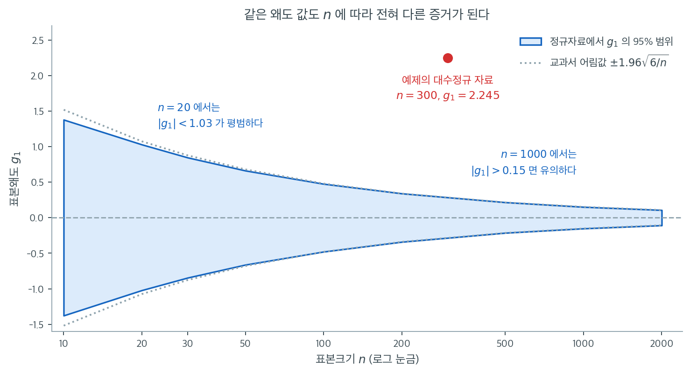

# 왜도 검정

## 개요

D'Agostino 왜도 검정은 자료의 왜도가 정규분포에서 기대되는 값인 0과 유의하게 다른지 평가한다. 표본왜도를 귀무가설 아래에서 근사적으로 표준정규를 따르는 $Z$ 통계량으로 변환하므로, 비대칭을 겨냥한 표적 검정이 된다. 이 페이지는 핵심 공식을 유도하고, Python에서 검정을 시연하며, 실무적 사용을 논의한다.

---

## 1. 표본왜도

표본 $X_1, \ldots, X_n$에 대한 Fisher-Pearson 왜도 계수(편향 보정판)는

$$
g_1 = \frac{n}{(n-1)(n-2)} \sum_{i=1}^{n} \left(\frac{X_i - \bar{X}}{S}\right)^3,
$$

여기서 $\bar{X}$는 표본평균, $S$는 (Bessel 보정을 한) 표본표준편차이다. 정규성 아래에서 $\mathbb{E}[g_1] = 0$이고

$$
\text{Var}(g_1) \approx \frac{6(n-2)}{(n+1)(n+3)}.
$$

---

## 2. D'Agostino 변환

$H_0$ 아래에서도 $g_1$의 분포가 정확히 정규가 아니므로, D'Agostino와 Pearson(1973)은 $g_1$을 $\mathcal{N}(0,1)$에 훨씬 가까운 통계량 $Z_1$으로 보내는 비선형 변환을 제안했다. 변환은 먼저

$$
Y = g_1 \sqrt{\frac{(n+1)(n+3)}{6(n-2)}},
$$

를 계산한 뒤 고차 누적률에 대한 추가 조정을 거친다. 최종 $Z_1$은 $H_0: \text{왜도} = 0$ 아래에서 근사적으로 표준정규이다.

---

## 3. 가설

$$
H_0: \gamma_1 = 0 \quad (\text{모집단 왜도가 0이다}), \qquad H_1: \gamma_1 \neq 0.
$$

양측 $p$값은 $p = 2\,\Phi(-|Z_1|)$이며 $\Phi$는 표준정규 CDF이다.

<div class="exbox" markdown>

**보기 1.** <span class="diff easy" title="쉬움"></span> 로그정규 자료의 왜도 검정. $\text{Lognormal}(0, 0.6^2)$에서 $n = 300$개를 뽑으면 $Z_1 = 10.4038$이 나온다.

**(1)** 위 변환 $Y = g_1\sqrt{(n+1)(n+3)/\{6(n-2)\}}$가 사실 **단순 표준화** $g_1/\mathrm{SD}(g_1)$임을 확인하시오. 그 값은 얼마이며, 다고스티노 변환은 그것을 어느 쪽으로 얼마나 옮기는가.

**(2)** `scipy.stats.skewtest`가 쓰는 왜도는 **어느 판본**인가. 코드가 찍어 주는 $2.2452$를 변환에 넣으면 $Z_1$이 얼마가 되는가.

</div>

??? success "풀이"

    **(1) $Y$는 정확히 단순 표준화이고, 그 값은 $15.9548$이다.** 정규성 아래 비보정 왜도의 분산이

    $$
    \mathrm{Var}(g_1) = \frac{6(n-2)}{(n+1)(n+3)}
    $$

    이므로 그 역수의 제곱근을 곱하는 것이 곧 표준화다.

    $$
    Y = g_1\sqrt{\frac{(n+1)(n+3)}{6(n-2)}} = \frac{g_1}{\mathrm{SD}(g_1)}
    $$

    $n = 300$에서 $\mathrm{SD}(g_1) = \sqrt{6\cdot298/(301\cdot303)} = 0.14002$이고 $g_1 = 2.233937$이니 $Y = 15.9548$이다.

    **변환은 이 값을 $10.4038$로 끌어내린다.** $15.95$에서 $10.40$으로, 곧 **35%를 깎는다.** 다고스티노와 피어슨의 변환은 $Y$의 4차 누적률을 보정한 뒤 역쌍곡사인을 씌우는 것이다.

    $$
    \beta_2 = \frac{3(n^2 + 27n - 70)(n+1)(n+3)}{(n-2)(n+5)(n+7)(n+9)}, \quad
    W^2 = -1 + \sqrt{2(\beta_2 - 1)}
    $$

    $$
    \delta = \frac{1}{\sqrt{\tfrac12\ln W^2}}, \quad
    \alpha = \sqrt{\frac{2}{W^2 - 1}}, \quad
    Z_1 = \delta\,\operatorname{arcsinh}\!\left(\frac{Y}{\alpha}\right)
    $$

    여기서 $\operatorname{arcsinh} u = \ln\bigl(u + \sqrt{u^2+1}\bigr)$다. $n = 300$에서 $\beta_2 = 3.110831$, $W^2 = 1.054668$, $\delta = 6.129875$, $\alpha = 6.048490$이고

    $$
    Z_1 = 6.129875 \cdot \operatorname{arcsinh}\!\left(\frac{15.954814}{6.048490}\right) = 10.403829
    $$

    가 나온다. **깎는 방향이 중요하다.** $\operatorname{arcsinh}$는 큰 인수에서 로그처럼 자라므로 꼬리를 눌러 준다. 유한표본에서 $g_1$의 분포가 오른쪽으로 치우쳐 있어 단순 표준화는 큰 값을 과대평가하는데, 변환이 그것을 바로잡는다. 만약 $Y = 15.95$를 그대로 표준정규 분위수로 읽으면 $p = 2.64\times10^{-57}$이 되는데, 실제 $p$는 $2.38\times10^{-25}$다. **자릿수가 서른 둘 벌어진다.**

    **(2) `skewtest`가 쓰는 것은 비보정판 $g_1 = \sqrt{b_1} = m_3/m_2^{3/2}$다.** 이 표본에서 $g_1 = 2.233937$인데, 코드는 `bias=False`로 구한 **보정판** $G_1 = 2.245179$를 찍는다. 둘은

    $$
    G_1 = \frac{\sqrt{n(n-1)}}{n-2}\,g_1 = \frac{\sqrt{300\cdot299}}{298}\cdot 2.233937 = 2.245179
    $$

    로 묶여 있고 $n = 300$에서 비는 $1.00503$이다. $G_1$을 변환에 넣으면 $Z_1 = 10.4326$이 되어 `scipy`가 돌려준 $10.4038$과 **다르다.** 차이가 $0.3\%$로 작아 이 보기에서는 결론이 바뀌지 않지만, 출력에 나란히 찍힌 두 수가 서로 맞물리지 않는다는 사실은 알아 두어야 한다. 손으로 재현하려면 `bias` 인자를 떼야 한다.

    같은 이유로 위 본문의 분산식 $\mathrm{Var}(g_1) \approx 6(n-2)/\{(n+1)(n+3)\}$은 **비보정판**의 것이다. 보정판의 분산은

    $$
    \mathrm{Var}(G_1) = \frac{n(n-1)}{(n-2)^2}\,\mathrm{Var}(g_1) = \frac{6n(n-1)}{(n-2)(n+1)(n+3)}
    $$

    이고, $n = 300$에서 표준편차가 $0.14002$ 대 $0.14072$로 갈린다.

    ```python
    import numpy as np
    from scipy import stats

    # 로그정규는 오른쪽으로 길게 늘어진 대표적인 분포다.
    rng = np.random.default_rng(0)
    x = rng.lognormal(mean=0.0, sigma=0.6, size=300)

    # 표본왜도를 그대로 쓰지 않고 Z 로 바꾼다. 왜도의 표집분포가 정규에서
    # 멀어, 값 자체로는 얼마나 큰 것인지 판단할 수 없기 때문이다.
    # 이 변환은 n>=8 부터 쓸 수 있다.
    g1 = stats.skew(x, bias=False)
    z, p = stats.skewtest(x)

    print(f"Sample size n = {x.size}")
    print(f"Sample skewness (Fisher's g1) = {g1:.4f}")
    print(f"D'Agostino skewness test: Z = {z:.4f}, p-value = {p:.4g}")
    if p < 0.05:
        print("=> Evidence of non-zero skewness (departing from normality).")
    else:
        print("=> No strong evidence of non-zero skewness.")
    ```

    출력:

    ```text
    Sample size n = 300
    Sample skewness (Fisher's g1) = 2.2452
    D'Agostino skewness test: Z = 10.4038, p-value = 2.382e-25
    => Evidence of non-zero skewness (departing from normality).
    ```

    변환을 한 단계씩 손으로 짚어 보면 다음과 같다.

    ```python
    import numpy as np
    from scipy import stats

    rng = np.random.default_rng(0)
    x = rng.lognormal(mean=0.0, sigma=0.6, size=300)
    n = x.size

    g1 = stats.skew(x)              # 비보정 sqrt(b1) — skewtest 가 쓰는 판본
    G1 = stats.skew(x, bias=False)  # 보정판
    print(f"g1 (비보정) = {g1:.6f}")
    print(f"G1 (보정)   = {G1:.6f}")
    print(f"G1 = g1*sqrt(n(n-1))/(n-2) = {g1 * np.sqrt(n * (n - 1)) / (n - 2):.6f}")

    # 1단계: 단순 표준화. 이것이 본문의 Y 다.
    sd_g1 = np.sqrt(6 * (n - 2) / ((n + 1) * (n + 3)))
    Y = g1 / sd_g1
    print(f"\nSD(g1) = {sd_g1:.5f},  단순 표준화 Y = g1/SD = {Y:.6f}")

    # 2단계: 고차 누적률 보정 후 역쌍곡사인 변환.
    beta2 = (3.0 * (n**2 + 27 * n - 70) * (n + 1) * (n + 3)
             / ((n - 2.0) * (n + 5) * (n + 7) * (n + 9)))
    W2 = -1 + np.sqrt(2 * (beta2 - 1))
    delta = 1 / np.sqrt(0.5 * np.log(W2))
    alpha = np.sqrt(2.0 / (W2 - 1))
    Z = delta * np.arcsinh(Y / alpha)
    print(f"beta2 = {beta2:.6f}, W^2 = {W2:.6f}, delta = {delta:.6f}, alpha = {alpha:.6f}")
    print(f"손계산 Z1 = {Z:.6f},  p = {2 * stats.norm.sf(abs(Z)):.4g}")

    z_scipy, p_scipy = stats.skewtest(x)
    print(f"scipy  Z1 = {z_scipy:.6f},  p = {p_scipy:.4g}")

    # 보정판을 넣으면 답이 달라진다.
    Z_wrong = delta * np.arcsinh((G1 / sd_g1) / alpha)
    print(f"\nG1 을 넣었을 때의 Z1 = {Z_wrong:.6f}  (scipy 와 다르다)")
    ```

    출력:

    ```text
    g1 (비보정) = 2.233937
    G1 (보정)   = 2.245179
    G1 = g1*sqrt(n(n-1))/(n-2) = 2.245179

    SD(g1) = 0.14002,  단순 표준화 Y = g1/SD = 15.954814
    beta2 = 3.110831, W^2 = 1.054668, delta = 6.129875, alpha = 6.048490
    손계산 Z1 = 10.403829,  p = 2.382e-25
    scipy  Z1 = 10.403829,  p = 2.382e-25

    G1 을 넣었을 때의 Z1 = 10.432609  (scipy 와 다르다)
    ```

    손으로 밟은 $Z_1 = 10.403829$가 `scipy.stats.skewtest`의 값과 **소수점 여섯째 자리까지** 같다. 변환이 투명한 공식 몇 줄로 끝난다는 뜻이며, $p$값도 $2.382\times10^{-25}$로 일치한다. $\square$

---

## 4. 해석

보기의 대수정규 자료에서 $g_1 = 2.245$로 크게 양수이고(오른쪽 치우침), $p$값이 $2.4 \times 10^{-25}$로 왜도가 0이라는 가설을 압도적으로 기각한다. 이론적 왜도는 $2.261$(연습문제 3 참조)이므로 표본값이 잘 맞는다.

왜도 검정은 비대칭이 의심되지만 다른 이탈은 꼭 의심되지 않을 때 특히 유용하다. 왜도 검정과 첨도 검정을 결합한 D'Agostino $K^2$ 옴니버스 검정의 한 구성요소이기도 하다.

### 얼마나 큰 왜도가 "큰" 왜도인가

"왜도가 $0.5$면 치우친 것인가"라는 물음에는 $n$을 모르면 답할 수 없다. 이 절의 변환이 필요한 이유도 결국 그것이다. 아래 그림은 진짜 정규자료에서 표본왜도 $g_1$이 어디까지 흔들리는지를 표본크기별로 40000번씩 재어 띠로 그린 것이다. 띠 안쪽이 "정규자료에서 흔히 나오는" 범위, 곧 양측 5% 수준에서 기각하지 못하는 영역이다.



$n = 20$에서 띠는 $[-1.02, +1.03]$으로 대단히 넓다. 왜도 $0.9$짜리 표본을 손에 쥐고도 "정규일 수 있다"는 말밖에 할 수 없다는 뜻이다. $n = 50$에서 $\pm 0.66$, $n = 100$에서 $\pm 0.48$로 줄고, $n = 1000$이면 $\pm 0.15$까지 좁아진다. 같은 $g_1 = 0.5$가 $n = 20$에서는 아무 증거도 아니고 $n = 1000$에서는 압도적 증거가 된다. **왜도 값 하나만 보고 판단하는 습관은 $n$을 빠뜨리는 순간 무의미해진다.**

회색 점선은 흔히 쓰는 어림값 $\pm 1.96\sqrt{6/n}$이다. $n$이 50을 넘으면 모의실험으로 얻은 실제 경계와 거의 겹치지만, $n$이 작을수록 실제 경계보다 바깥쪽에 놓인다. $n = 10$에서 어림값은 $\pm 1.52$인데 실제 범위는 $\pm 1.38$이다. 작은 표본에서 $g_1$의 분포가 정규가 아니기 때문이며, `skewtest`가 단순 표준화 대신 비선형 변환을 쓰는 이유이기도 하다.

빨간 점은 이 쪽 보기의 대수정규 자료다. $n = 300$에서 $g_1 = 2.245$이므로 띠에서 아득히 벗어나 있다. $Z_1 = 10.4$, $p = 2.4 \times 10^{-25}$라는 숫자가 어디서 나왔는지를 그림 한 장으로 확인할 수 있다.

**최소 표본크기.** SciPy의 `skewtest`는 $n \geq 8$을 요구한다. 근사는 $n$이 클수록 좋아지며, $n < 20$이면 $p$값을 조심스럽게 해석해야 한다.

---

## 연습문제

<div class="drillbox" markdown>

**연습문제 1.** <span class="diff easy" title="쉬움"></span> 표준정규분포에서 관측값 $n = 300$개를 생성하라. $g_1$과 왜도 검정 $p$값을 계산하라. $\alpha = 0.05$에서 기각할 것으로 기대하는가?

</div>

??? success "풀이"

    ```python
    import numpy as np
    from scipy import stats

    rng = np.random.default_rng(42)
    x = rng.normal(0, 1, size=300)

    g1 = stats.skew(x, bias=False)
    z, p = stats.skewtest(x)

    print(f"g1 = {g1:.4f}")
    print(f"Z = {z:.4f}, p = {p:.4g}")
    ```

    출력:

    ```text
    g1 = 0.2933
    Z = 2.0725, p = 0.03822
    ```

    !!! warning "이 표본은 제1종 오류를 보여준다"
        자료를 정확히 표준정규에서 생성했는데도 $p = 0.038 < 0.05$이므로 **검정이 기각한다**. 이것이 바로 제1종 오류이다.

    기대와 실제를 구분해야 한다. 자료가 참으로 정규이므로 우리는 기각하지 *않기를* 기대하고, 실제로 표본의 95%에서는 기각하지 않는다. 그러나 나머지 5%에서는 기각한다. 이 표본이 그 5%에 들어갔을 뿐이다.

    $g_1 = 0.2933$은 절댓값으로는 작아 보이지만, $n = 300$에서 $g_1$의 표준오차가

    $$
    \sqrt{\frac{6(n-2)}{(n+1)(n+3)}} = \sqrt{\frac{6 \times 298}{301 \times 303}} = 0.1400
    $$

    에 불과하므로 $0.2933$은 2 표준오차가 넘는다. 표본이 커지면 작은 왜도도 통계적으로 유의해진다는 점을 잘 보여준다.

    실무적 교훈: **$p$값 하나로 판정하지 말라.** 여기서 실질적으로 중요한 것은 $g_1 = 0.29$가 어떤 응용에서든 무시할 만한 크기라는 사실이다. 효과 크기를 함께 보고해야 하는 이유이다. $\square$

<div class="drillbox" markdown>

**연습문제 2.** <span class="diff easy" title="쉬움"></span> $\text{Uniform}(0, 1)$ 분포에서 뽑은 관측값 $n = 200$개에 대해 표본왜도를 계산하고 왜도 검정을 수행하라. 균등분포는 대칭이지만 정규가 아니다. 검정이 기각하는가?

</div>

??? success "풀이"

    ```python
    import numpy as np
    from scipy import stats

    rng = np.random.default_rng(0)
    x = rng.uniform(0, 1, size=200)

    g1 = stats.skew(x, bias=False)
    z, p = stats.skewtest(x)
    print(f"g1 = {g1:.4f}, Z = {z:.4f}, p = {p:.4g}")
    ```

    출력:

    ```text
    g1 = -0.1735, Z = -1.0217, p = 0.3069
    ```

    균등분포의 모집단 왜도는 $\gamma_1 = 0$이므로 왜도 검정은 기각하지 *않는다*($p = 0.307$).

    이는 한계를 보여준다. 왜도 검정은 우연히 대칭인 비정규 분포를 놓칠 수 있다. $\text{Uniform}(0,1)$은 대칭이지만 초과첨도가 $-1.2$인 저첨분포이다. 첨도 검정이나 옴니버스 검정이었다면 이 이탈을 탐지했을 것이다.

    확인해 보면 같은 자료에서 `stats.kurtosistest(x)`는 $Z = -9.78$, $p = 1.4 \times 10^{-22}$로 압도적으로 기각한다. 이탈의 유형에 맞는 검정을 골라야 한다는 교훈이다. $\square$

<div class="drillbox" markdown>

**연습문제 3.** <span class="diff med" title="중간"></span> $\text{Lognormal}(\mu, \sigma^2)$ 분포의 모집단 왜도가 $(e^{\sigma^2} + 2)\sqrt{e^{\sigma^2} - 1}$임을 보여라. $\sigma = 0.6$에 대한 값을 계산하라.

</div>

??? success "풀이"

    대수정규의 적률 성질에서 $\mathbb{E}[X^k] = e^{k\mu + k^2\sigma^2/2}$이다. 처음 세 중심적률을 계산하면 왜도가 다음으로 정리된다.

    $$
    \gamma_1 = (e^{\sigma^2} + 2)\sqrt{e^{\sigma^2} - 1}.
    $$

    왜도는 척도불변이므로 $\mu$에 의존하지 않고 $\sigma$에만 의존한다는 점에 주목하라.

    $\sigma = 0.6$이면 $e^{0.36} = 1.4333$이므로 $e^{\sigma^2} - 1 = 0.4333$이고 $\sqrt{0.4333} = 0.6583$이다. 따라서

    $$
    \gamma_1 = (1.4333 + 2)(0.6583) = 3.4333 \times 0.6583 \approx 2.261.
    $$

    이 큰 양의 왜도 때문에 대수정규 표본에서 왜도 검정이 단호하게 기각한다. 실제로 본문의 시연에서 표본값 $g_1 = 2.245$가 이 이론값에 가깝게 나왔다. $\square$

<div class="drillbox" markdown>

**연습문제 4.** <span class="diff med" title="중간"></span> $\text{Lognormal}(0, 0.4)$에서 뽑은 관측값 $n = 100$개에 대해 $\alpha = 0.05$에서 왜도 검정의 검정력을 추정하는 모의실험을 5,000회 반복으로 수행하라.

</div>

??? success "풀이"

    ```python
    import numpy as np
    from scipy import stats

    rng = np.random.default_rng(0)
    n, reps, alpha = 100, 5000, 0.05
    rejections = 0

    for _ in range(reps):
        x = rng.lognormal(0, 0.4, size=n)
        _, p = stats.skewtest(x)
        if p < alpha:
            rejections += 1

    power = rejections / reps
    print(f"Empirical power: {power:.4f}")
    ```

    출력:

    ```text
    Empirical power: 0.9770
    ```

    검정력이 $0.977$로 매우 높다. $\sigma = 0.4$인 대수정규의 왜도는

    $$
    \gamma_1 = (e^{0.16} + 2)\sqrt{e^{0.16} - 1} = 3.1735 \times \sqrt{0.1735} = 1.322
    $$

    로 중간 정도인데, $n = 100$에서 $g_1$의 표준오차가 약 $\sqrt{6/100} = 0.245$이므로 신호 대 잡음비가 $1.322/0.245 \approx 5.4$에 이른다. 이만한 비율이면 사실상 언제나 탐지된다.

    (몬테카를로 오차는 $\sqrt{0.977 \times 0.023 / 5000} = 0.0021$이다.) $\square$

<div class="drillbox" markdown>

**연습문제 5.** <span class="diff hard" title="어려움"></span> 정확한 공식 $\text{Var}(g_1) = 6(n-2)/[(n+1)(n+3)]$에서 출발하여 큰 $n$에 대해 $\text{Var}(g_1) \approx 6/n$임을 증명하라.

</div>

??? success "풀이"

    다음에서 출발한다.

    $$
    \text{Var}(g_1) = \frac{6(n-2)}{(n+1)(n+3)}.
    $$

    분자와 분모를 각각 $n$과 $n^2$으로 나누면

    $$
    \text{Var}(g_1) = \frac{6\,(1 - 2/n)}{n\,(1 + 1/n)(1 + 3/n)}.
    $$

    $n \to \infty$일 때 $(1 - 2/n) \to 1$, $(1 + 1/n) \to 1$, $(1 + 3/n) \to 1$이므로

    $$
    \text{Var}(g_1) \to \frac{6}{n}.
    $$

    따라서 $g_1$의 표준오차는 $\sqrt{6/n}$ 정도, 곧 $1/\sqrt{n}$ 차수이며, 표본이 클수록 0이 아닌 왜도를 탐지하기 쉬워진다.

    수렴 속도를 보자. $n = 100$에서 정확한 값은 $\sqrt{6 \times 98/(101 \times 103)} = 0.2377$이고 근사값은 $\sqrt{6/100} = 0.2449$로 3% 차이이다. $n = 1000$에서는 각각 $0.07723$과 $0.07746$으로 0.3% 차이이다. $\square$

---

## 정리하며

왜도 검정의 **구성과 구현**을 살폈다.

- **피셔–피어슨 편향 보정 왜도**를 쓴다. 표본 왜도는 편향되어 있으므로 $\sqrt{n(n-1)}/(n-2)$ 를 곱해 보정한다.
- **$Z$ 로 변환하는 과정이 정교하다.** 표본 왜도의 분포가 정규와 거리가 멀어, 존슨 변환류의 보정을 거쳐야 근사적으로 표준정규가 된다. **단순히 표준오차로 나누는 것이 아니다.**
- **$n\ge8$ 이 요건이다.** 그보다 작으면 `scipy` 가 오류를 낸다.
- **치우침만 겨냥한다.** 대칭이면서 꼬리가 두꺼운 분포($t$ 분포 등)는 이 검정으로 잡히지 않는다.
- **방향을 알 수 있다는 것이 장점이다.** $Z$ 의 부호가 어느 쪽으로 치우쳤는지 말해 주며, 변환의 방향을 정하는 데 쓴다.

다음 절 **첨도 검정**으로 넘어간다.
