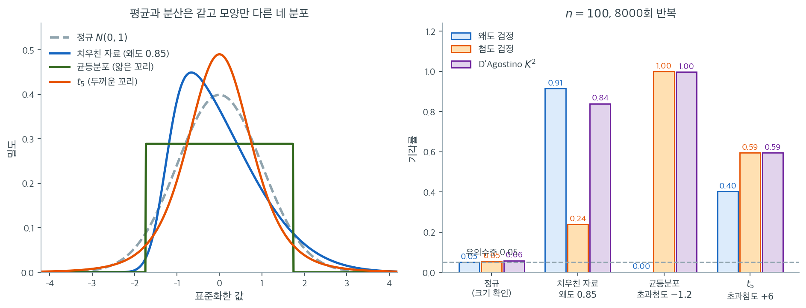

# 왜도 검정과 첨도 검정

## 왜도 검정

`scipy.stats.skewtest()`가 제공하는 **왜도 검정**은 자료의 왜도가 0에서 유의하게 벗어나는지, 곧 자료가 대칭인지 아닌지를 평가하는 형식적 통계검정이다.

### 가설

- **귀무가설** ($H_0$): 자료의 왜도가 0이다(대칭분포이다).
- **대립가설** ($H_1$): 자료의 왜도가 0이 아니다(비대칭이다).

왜도 검정은 검정통계량과 $p$값을 제공한다. $p$값이 작으면(보통 0.05 미만) 귀무가설을 기각하고 자료가 대칭분포가 아니라고 결론짓는다.

### 단계별 설명

1. **표본왜도 계산**: 먼저 다음 공식으로 표본왜도를 계산한다.

    $$
    \text{Skewness} = \frac{1}{n} \sum_{i=1}^{n} \left( \frac{x_i - \bar{x}}{\sigma} \right)^3
    $$

    여기서 $n$은 자료점의 개수, $x_i$는 개별 자료점, $\bar{x}$는 평균, $\sigma$는 표준편차이다.

2. **z 점수 계산**: 검정통계량인 **z 점수**는 관측된 왜도를 그 표준오차로 나누어 계산한다. z 점수는 왜도가 기댓값(정규분포에서는 0)에서 얼마나 떨어져 있는지를 알려준다.

3. **z 점수를 p값으로 변환**: 표준정규분포의 누적분포함수로 p값을 계산한다. 앞 단계에서 얻은 z 점수를 표준정규분포와 비교하여 **양측 p값**을 얻는다. 이 p값은 왜도가 0(대칭분포)이라는 귀무가설 아래에서 관측된 값만큼 극단적인 왜도를 볼 가능성을 수량화한다.

### 응용

왜도 검정은 대칭성을 가정하는 모수적 통계 방법(특정 형태의 $t$ 검정이나 분산분석 등)으로 자료를 분석할 수 있는지 평가할 때 실용적이다. 자료가 치우쳤다고 결론지으면 자료를 변환하거나(예: 로그나 Box-Cox 변환) 대칭성을 가정하지 않는 비모수 방법을 써야 할 수 있다.

<div class="exbox" markdown>

**보기 1.** <span class="diff easy" title="쉬움"></span> 왜도 검정. $\mathcal{N}(2, 2^2)$에서 $n = 1000$개를 뽑으면 $Z_1 = 0.4402$, $p = 0.6598$로 기각하지 못한다.

**(1)** 이 검정이 $n = 1000$에서 **잡아낼 수 있는 가장 작은 왜도**는 얼마인가. $\lvert Z_1\rvert = 1.96$이 되는 $g_1$을 구하고, 흔히 쓰는 어림 $1.96\sqrt{6/n}$과 비교하시오.

**(2)** 코드의 주석을 풀어 $\text{Gamma}(k = 2,\ \theta = 2)$로 돌리면 어떻게 되는가. 감마분포의 **이론** 왜도를 구해 표본값과 견주시오.

</div>

??? success "풀이"

    **(1) 경계는 $g_1 = 0.1515$다.** `skewtest`의 변환 $Z_1 = \delta\operatorname{arcsinh}(Y/\alpha)$는 $g_1$의 단조증가함수이므로, $Z_1 = 1.959964$가 되는 $g_1$을 수치적으로 찾으면 유일한 답이 나온다. $n = 1000$에서

    $$
    g_1^{\ast} = 0.1515
    $$

    이고, 어림 $1.96\sqrt{6/n} = 1.959964\times0.0774597 = 0.1518$이 그것을 거의 그대로 맞힌다(차이 $0.2\%$). $n$이 1000쯤 되면 $g_1$의 귀무분포가 충분히 정규에 가까워져 단순 어림이 통한다는 뜻이다. 앞 쪽에서 본 대로 $n$이 작을 때는 그렇지 않다.

    관측값 $g_1 = 0.0339$는 이 경계의 $22\%$에 지나지 않는다. 그래서 $p = 0.66$이다.

    **거꾸로 읽는 것이 중요하다.** "기각하지 못했다"는 **"왜도가 $0.15$보다 작다"는 말일 뿐 "0이다"라는 말이 아니다.** 모집단 왜도가 $0.1$인 자료를 $n = 1000$으로 조사하면 이 검정은 대개 통과시킨다. $\lvert g_1\rvert < 0.15$가 실무상 무해한지는 검정이 답해 줄 수 없는 질문이고, 쓰려는 방법이 무엇인지에 달려 있다.

    **(2) 이론 왜도는 $2/\sqrt{k} = 1.4142$이고 표본값은 $1.3583$이다.** 형상모수 $k$, 척도모수 $\theta$인 감마분포의 중심적률은

    $$
    \mu_2 = k\theta^2, \qquad \mu_3 = 2k\theta^3
    $$

    이므로

    $$
    \gamma_1 = \frac{\mu_3}{\mu_2^{3/2}} = \frac{2k\theta^3}{(k\theta^2)^{3/2}} = \frac{2}{\sqrt{k}}
    $$

    다. **척도 $\theta$가 약분되어 사라진다**는 점에 주의하라. $\theta = 2$를 $\theta = 100$으로 바꿔도 왜도는 그대로다. $k = 2$이므로 $\gamma_1 = 2/\sqrt2 = 1.41421$이다.

    표본값 $g_1 = 1.3583$은 이론값보다 $0.056$ 작다. 유한표본에서 $g_1$이 치우침을 아래로 깎는 쪽으로 편향되어 있고 또 표집변동도 있으니 예상 범위다. 중요한 것은 이 값이 경계 $0.1515$의 **아홉 배**라는 사실이다. 검정은 $Z_1 = 13.6656$, $p = 1.63\times10^{-42}$로 압도적으로 기각한다.

    ```python
    import numpy as np
    from scipy import stats

    np.random.seed(0)

    # 지금은 정규자료다. 위 주석을 바꿔 감마분포로 돌리면 검정이 기각되는 것을
    # 볼 수 있다. 두 경우를 견주는 것이 이 코드의 쓰임이다.
    # data = np.random.gamma(2, 2, 1000)
    data = np.random.normal(2, 2, 1000)

    skewness_value = stats.skew(data)
    print(f"Skewness: {skewness_value:.4f}")

    # 귀무가설은 "모집단의 왜도가 0" 이다. 이 검정은 치우침만 보므로,
    # 대칭이면서 꼬리만 두꺼운 분포는 잡아내지 못한다.
    stat, p_value = stats.skewtest(data)
    print(f"Skewness Test: Statistic={stat:.4f}, p-value={p_value:.4f}")

    # 결과 해석
    alpha = 0.05
    if p_value <= alpha:
        print("Reject H_0: The data is not symmetrically distributed (significant skewness).")
    else:
        print("Fail to reject H_0: The data is symmetrically distributed (no significant skewness).")
    ```

    출력:

    ```text
    Skewness: 0.0339
    Skewness Test: Statistic=0.4402, p-value=0.6598
    Fail to reject H_0: The data is symmetrically distributed (no significant skewness).
    ```

    경계와 감마 쪽 값을 함께 확인한다.

    ```python
    import numpy as np
    from scipy import stats
    from scipy.optimize import brentq

    n = 1000

    # skewtest 의 변환을 g1 의 함수로 쓴다 (단조증가이므로 역이 하나다).
    def z1_of(g1, n):
        Y = g1 * np.sqrt((n + 1) * (n + 3) / (6.0 * (n - 2)))
        beta2 = (3.0 * (n**2 + 27 * n - 70) * (n + 1) * (n + 3)
                 / ((n - 2.0) * (n + 5) * (n + 7) * (n + 9)))
        W2 = -1 + np.sqrt(2 * (beta2 - 1))
        delta = 1 / np.sqrt(0.5 * np.log(W2))
        alpha = np.sqrt(2.0 / (W2 - 1))
        return delta * np.arcsinh(Y / alpha)

    g1_cut = brentq(lambda g: z1_of(g, n) - 1.959964, 0.0, 1.0)
    print(f"|Z1| = 1.96 이 되는 g1 = {g1_cut:.4f}")
    print(f"어림 1.96*sqrt(6/n)   = {1.959964 * np.sqrt(6 / n):.4f}")

    print(f"\nGamma(k=2) 이론 왜도 = 2/sqrt(k) = {2 / np.sqrt(2.0):.4f}")
    np.random.seed(0)
    gam = np.random.gamma(2, 2, 1000)
    zg, pg = stats.skewtest(gam)
    print(f"감마 표본 g1 = {stats.skew(gam):.4f},  Z1 = {zg:.4f},  p = {pg:.4g}")

    # 정규 자료에서의 실제 기각률이 명목을 지키는지도 본다.
    rng = np.random.default_rng(42)
    R = 4000
    rej = np.mean([stats.skewtest(s)[1] < 0.05 for s in rng.standard_normal((R, n))])
    print(f"\n정규 자료 기각률 = {rej:.4f}  (명목 0.05, MC SE {np.sqrt(0.05 * 0.95 / R):.4f})")
    ```

    출력:

    ```text
    |Z1| = 1.96 이 되는 g1 = 0.1515
    어림 1.96*sqrt(6/n)   = 0.1518

    Gamma(k=2) 이론 왜도 = 2/sqrt(k) = 1.4142
    감마 표본 g1 = 1.3583,  Z1 = 13.6656,  p = 1.629e-42

    정규 자료 기각률 = 0.0530  (명목 0.05, MC SE 0.0034)
    ```

    세 가지가 맞아떨어진다. 수치적으로 구한 경계 $0.1515$가 어림 $0.1518$과 맞고, 유도한 이론 왜도 $1.4142$가 표본 $1.3583$과 표집변동 범위에서 맞으며, 정규 자료에서의 실제 기각률 $0.0530$이 명목 $0.05$에서 몬테카를로 표준오차의 $0.9$배 안에 들어온다. **검정이 약속한 크기를 지킨다**는 확인이다. $\square$

---

## 첨도 검정

`scipy.stats.kurtosistest()`가 제공하는 **첨도 검정**은 자료의 초과첨도가 정규분포의 첨도에서 유의하게 벗어나는지 평가하는 형식적 통계검정이다.

### 가설

- **귀무가설** ($H_0$): 자료의 첨도가 정규분포의 것과 같다.
- **대립가설** ($H_1$): 자료의 첨도가 정규분포의 것과 다르다.

첨도 검정은 검정통계량과 $p$값을 제공한다. $p$값이 작으면(보통 0.05 미만) 귀무가설을 기각하고 자료의 첨도가 정규가 아니라고 결론짓는다.

### 단계별 설명

1. **표본 초과첨도 계산**: 먼저 다음 공식으로 표본 초과첨도를 계산한다.

    $$
    \text{Excess Kurtosis} = \frac{1}{n} \sum_{i=1}^{n} \left( \frac{x_i - \bar{x}}{\sigma} \right)^4 - 3
    $$

    여기서 $n$은 자료점의 개수, $x_i$는 개별 자료점, $\bar{x}$는 평균, $\sigma$는 표준편차이다.

2. **z 점수 계산**: 검정통계량인 **z 점수**는 관측된 초과첨도를 그 표준오차로 나누어 계산한다. z 점수는 초과첨도가 기댓값(정규분포에서는 0)에서 얼마나 떨어져 있는지를 알려준다.

3. **z 점수를 p값으로 변환**: 표준정규분포의 누적분포함수로 **양측 p값**을 계산한다. 이 p값은 귀무가설 아래에서 관측된 값만큼 극단적인 초과첨도를 볼 가능성을 수량화한다.

### 응용

정규 첨도를 가정하는 모수적 방법($t$ 검정, 분산분석 등)이 적절한지 평가할 때 첨도 검정을 쓴다. 첨도 검정이 자료의 꼬리가 유의하게 두껍거나 얇다고 나타내면 변환(로그나 Box-Cox 변환)이나 비모수 방법이 필요할 수 있다.

<div class="exbox" markdown>

**보기 2.** <span class="diff easy" title="쉬움"></span> 첨도 검정. 보기 1과 **같은** $\mathcal{N}(2, 2^2)$ 표본에 첨도 검정을 걸면 $g_2 = -0.0468$, $Z_2 = -0.1980$, $p = 0.8431$이다.

**(1)** $\lvert Z_2\rvert = 1.96$이 되는 $g_2$의 두 경계를 구하시오. 왜도 검정의 경계와 달리 **0을 중심으로 대칭이 아닐 것이다.** 어느 쪽이 넓으며 왜 그런가.

**(2)** $\text{Gamma}(k = 2,\ \theta = 2)$의 이론 초과첨도를 유도해 표본값과 견주시오. 감마 자료에서 왜도 검정과 첨도 검정 중 어느 쪽이 더 강하게 기각하는가.

</div>

??? success "풀이"

    **(1) 경계는 $[-0.2744,\ +0.3272]$이고 위쪽이 $19\%$ 넓다.** 앞 쪽의 변환을 $b_2$의 함수로 보면 단조증가이므로 $Z_2 = \pm1.959964$를 주는 $b_2$를 수치적으로 찾을 수 있다. $n = 1000$에서 $g_2 = b_2 - 3$으로 옮겨 적으면

    $$
    -0.2744 \;\le\; g_2 \;\le\; +0.3272
    $$

    가 기각하지 못하는 구간이다. 비가 $0.3272/0.2744 = 1.192$다. 대칭 어림 $1.96\sqrt{24/n} = \pm0.3036$은 위쪽 경계를 $7\%$ 작게, 아래쪽 경계를 $11\%$ 크게 잡는다.

    **비대칭의 까닭은 $b_2$의 귀무분포가 치우쳐 있다는 것이다.** 초과첨도는 아래로 막혀 있고($g_2 \ge -2$) 위로는 열려 있다. 게다가 $g_2$는 꼬리의 몇 안 되는 관측값이 좌우하므로 큰 값 하나가 들어오면 위로만 크게 튄다. 한쪽으로만 튈 수 있는 통계량의 분포는 대칭일 수 없고, 그러므로 **같은 크기의 이탈이라도 양수 쪽이 더 흔하다.** 검정이 그 사실을 반영해 위쪽 경계를 더 멀리 둔다.

    관측값 $-0.0468$은 아래쪽 경계의 $17\%$ 자리다. 그래서 $p = 0.84$다. **$Z_2$의 부호가 음수라는 사실에는 아무 정보가 없다.** 정규 자료에서 $g_2$가 음수로 나올 확률은 절반을 넘는데(비보정 $b_2$의 기댓값이 $3(n-1)/(n+1) < 3$이므로 중앙값도 3 아래다), "꼬리가 얇다는 증거"로 읽으면 안 된다.

    **(2) 이론 초과첨도는 $6/k = 3$이고 표본값은 $2.4079$다.** 형상 $k$, 척도 $\theta$인 감마분포의 중심적률은 $\mu_2 = k\theta^2$, $\mu_4 = 3k(k+2)\theta^4$이므로

    $$
    \gamma_2 = \frac{\mu_4}{\mu_2^2} - 3 = \frac{3k(k+2)\theta^4}{k^2\theta^4} - 3 = \frac{3(k+2)}{k} - 3 = \frac{6}{k}
    $$

    다. 왜도와 마찬가지로 **척도가 약분된다.** $k = 2$이므로 $\gamma_2 = 3$이다. 표본값 $2.4079$는 이론값보다 $0.59$ 작은데, 앞 쪽에서 본 $g_2$의 아래쪽 편향과 큰 표집변동을 생각하면 놀랄 일이 아니다.

    **기각은 왜도 쪽이 훨씬 강하다.** 같은 감마 표본에서

    | 검정 | 통계량 | $p$값 |
    |---|---|---|
    | 왜도 검정 | $Z_1 = 13.6656$ | $1.63\times10^{-42}$ |
    | 첨도 검정 | $Z_2 = 7.7918$ | $6.61\times10^{-15}$ |

    이다. 이론값으로 보면 감마 $k=2$는 왜도 $1.414$와 초과첨도 $3$을 **둘 다** 가지므로 두 검정이 모두 기각하는 것이 당연하다. 그런데 $Z_1$이 $Z_2$의 $1.75$배다. 치우친 분포에서는 왜도 쪽 신호가 먼저, 더 크게 잡힌다. 거꾸로 꼬리만 두꺼운 $t$나 꼬리만 얇은 균등분포에서는 첨도 검정만 반응한다. **두 검정을 함께 돌리고 어느 $Z$가 컸는지 보는 것이 "어떻게 정규가 아닌가"에 대한 답이 된다.**

    ```python
    import numpy as np
    from scipy import stats

    np.random.seed(0)

    # data = np.random.gamma(2, 2, 1000)
    data = np.random.normal(2, 2, 1000)

    kurtosis_value = stats.kurtosis(data)
    print(f"Kurtosis: {kurtosis_value:.4f}")

    # 귀무가설은 "모집단의 초과첨도가 0" 이다. 앞의 왜도 검정과 짝을 이루며,
    # 둘을 합친 것이 D'Agostino 의 K^2 이다.
    stat, p_value = stats.kurtosistest(data)
    print(f"Kurtosis Test: Statistic={stat:.4f}, p-value={p_value:.4f}")

    # 결과 해석
    alpha = 0.05
    if p_value <= alpha:
        print("Reject H_0: The data does not have normal kurtosis.")
    else:
        print("Fail to reject H_0: The data has normal kurtosis.")
    ```

    출력:

    ```text
    Kurtosis: -0.0468
    Kurtosis Test: Statistic=-0.1980, p-value=0.8431
    Fail to reject H_0: The data has normal kurtosis.
    ```

    비대칭 경계와 감마 쪽 값을 함께 확인한다.

    ```python
    import numpy as np
    from scipy import stats
    from scipy.optimize import brentq

    n = 1000

    # kurtosistest 의 변환을 b2 의 함수로 쓴다 (단조증가이므로 역이 하나다).
    def z2_of(b2, n):
        E = 3.0 * (n - 1) / (n + 1)
        varb2 = 24.0 * n * (n - 2) * (n - 3) / ((n + 1) ** 2 * (n + 3) * (n + 5))
        u = (b2 - E) / np.sqrt(varb2)
        sqrtbeta1 = (6.0 * (n * n - 5 * n + 2) / ((n + 7) * (n + 9))
                     * np.sqrt(6.0 * (n + 3) * (n + 5) / (n * (n - 2) * (n - 3))))
        A = 6.0 + 8.0 / sqrtbeta1 * (2.0 / sqrtbeta1 + np.sqrt(1 + 4.0 / sqrtbeta1**2))
        term1 = 1 - 2 / (9.0 * A)
        term2 = ((1 - 2.0 / A) / (1 + u * np.sqrt(2 / (A - 4.0)))) ** (1 / 3)
        return (term1 - term2) / np.sqrt(2 / (9.0 * A))

    lo = brentq(lambda g: z2_of(g + 3.0, n) + 1.959964, -0.5, 0.0)
    hi = brentq(lambda g: z2_of(g + 3.0, n) - 1.959964, 0.0, 2.0)
    print(f"기각하지 않는 g2 구간 = [{lo:.4f}, {hi:.4f}]")
    print(f"폭의 비 (위/아래) = {hi / abs(lo):.3f}")
    print(f"대칭 어림 1.96*sqrt(24/n) = +-{1.959964 * np.sqrt(24 / n):.4f}")

    print(f"\nGamma(k=2) 이론 초과첨도 = 3(k+2)/k - 3 = 6/k = {6 / 2.0:.4f}")
    np.random.seed(0)
    gam = np.random.gamma(2, 2, 1000)
    z1, p1 = stats.skewtest(gam)
    z2, p2 = stats.kurtosistest(gam)
    print(f"감마 표본 g2 = {stats.kurtosis(gam):.4f},  Z2 = {z2:.4f},  p = {p2:.4g}")
    print(f"감마 표본 Z1 = {z1:.4f} (왜도)  대  Z2 = {z2:.4f} (첨도)")

    # 정규 자료에서의 실제 기각률
    rng = np.random.default_rng(43)
    R = 4000
    rej = np.mean([stats.kurtosistest(s)[1] < 0.05 for s in rng.standard_normal((R, n))])
    print(f"\n정규 자료 기각률 = {rej:.4f}  (명목 0.05, MC SE {np.sqrt(0.05 * 0.95 / R):.4f})")
    ```

    출력:

    ```text
    기각하지 않는 g2 구간 = [-0.2744, 0.3272]
    폭의 비 (위/아래) = 1.192
    대칭 어림 1.96*sqrt(24/n) = +-0.3036

    Gamma(k=2) 이론 초과첨도 = 3(k+2)/k - 3 = 6/k = 3.0000
    감마 표본 g2 = 2.4079,  Z2 = 7.7918,  p = 6.607e-15
    감마 표본 Z1 = 13.6656 (왜도)  대  Z2 = 7.7918 (첨도)

    정규 자료 기각률 = 0.0470  (명목 0.05, MC SE 0.0034)
    ```

    구한 구간 $[-0.2744,\ 0.3272]$가 앞 쪽 [첨도 검정](./kurtosistest.md)에서 모의실험으로 얻은 $n = 1000$의 95% 범위 $[-0.27,\ +0.33]$과 일치한다. 한쪽은 변환식을 역으로 푼 것이고 다른 쪽은 자료를 6만 번 뽑아 센 것인데 같은 수가 나왔다. 유도한 이론 초과첨도 $3$도 표본 $2.4079$와 표집변동 범위에서 맞고, 정규 자료에서의 실제 기각률 $0.0470$이 명목 $0.05$에서 몬테카를로 표준오차의 $0.9$배 안에 든다. $\square$

---

## 두 검정은 서로의 맹점을 덮는다

두 검정을 따로 배웠으니 이제 나란히 세워 보자. 아래 그림의 왼쪽 칸에는 평균 0, 분산 1로 맞춘 네 분포가 있다. 모두 중심과 퍼짐이 같고 **모양만** 다르다. 오른쪽 칸은 각 모집단에서 $n = 100$인 표본을 8000번 뽑아 두 검정과 D'Agostino $K^2$의 기각률을 잰 것이다.



정규 모집단에서는 세 막대가 모두 $0.05$ 근처에 머문다($0.05$, $0.05$, $0.06$). 약속이 지켜진다는 확인이다.

치우친 자료(왜도 $0.85$)에서는 왜도 검정이 $0.91$로 압도적이고 첨도 검정은 $0.24$에 그친다. 예상대로다. 정작 눈여겨볼 곳은 세 번째 칸이다. 균등분포는 완벽하게 대칭이고 꼬리만 얇다(초과첨도 $-1.2$). 첨도 검정은 $0.999$로 거의 언제나 잡아내는 반면, 왜도 검정의 기각률은 $0.001$이다. 8000번 중 열 번 남짓. 이것이 맹점이라는 말의 뜻이다. **왜도 검정은 균등분포와 정규분포를 구별할 능력이 전혀 없다.** 오히려 명목 $0.05$보다도 한참 낮은데, 꼬리가 얇으면 $g_1$의 실제 변동이 정규성 아래에서 가정한 것보다 작아져 검정이 지나치게 보수적이 되기 때문이다.

네 번째 칸은 좀 더 미묘하다. $t_5$는 역시 완벽하게 대칭인데 왜도 검정의 기각률이 $0.40$이나 된다. 이것을 "왜도 검정이 두꺼운 꼬리도 잡아낸다"고 읽으면 안 된다. 모집단의 왜도는 정확히 0이므로 이 기각은 전부 **잘못된 기각**이다. 원인은 왜도 검정이 $g_1$의 분산을 $6/n$ 근처로 가정하는 데 있다. 꼬리가 두꺼우면 $g_1$이 그보다 훨씬 크게 흔들리므로 정규성 아래의 잣대로 재면 자꾸 "유의하게 치우쳤다"는 결론이 나온다. 앞 쪽에서 본 대로 $g_1$은 사실상 꼬리의 요약이기 때문이다.

정리하면 이렇다. 두 검정은 서로 다른 방향을 보며, 각자 보지 못하는 방향이 있고, 자기 방향이 아닌 곳에서 나온 기각은 해석을 조심해야 한다. 그래서 실무에서는 둘을 함께 돌리고 — 더 낫게는 둘을 하나로 묶은 D'Agostino $K^2$을 쓰고 — 기각되었을 때 $Z_1$과 $Z_2$ 중 어느 쪽이 컸는지를 확인한다. 위 그림에서 보라색 $K^2$ 막대가 네 칸 모두에서 두 검정 중 높은 쪽에 거의 붙어 있는 것이 그 이유다.

## 연습문제

<div class="drillbox" markdown>

**연습문제 1.** <span class="diff med" title="중간"></span>
`scipy.stats.skewtest`로 어떤 연구자가 z 점수 3.2와 p값 0.001을 얻었다. 이 결과를 해석하라.

</div>

??? success "풀이"
    왜도 검정은 $H_0$: 모집단 왜도가 0(정규성과 일관됨)을 검정한다. z 점수 3.2는 0에서 멀고 $p = 0.001$은 어떤 관행적 유의수준보다도 훨씬 작다.

    해석: 자료가 치우친(비대칭) 분포에서 왔다는 강한 증거가 있다. z 점수가 양수이므로 오른쪽 치우침(오른쪽 꼬리가 왼쪽보다 무겁다)을 나타낸다. 이는 비정규성의 한 요소이며, 자료에 변환이나 비모수 방법이 필요할 수 있다.

<div class="drillbox" markdown>

**연습문제 2.** <span class="diff med" title="중간"></span>
`skewtest`와 단순히 표본왜도를 계산하는 것의 차이를 설명하라. 형식적 검정이 왜 필요한가?

</div>

??? success "풀이"
    표본왜도 $g_1 = \frac{m_3}{m_2^{3/2}}$는 점추정값이며, 자료가 진짜 정규여도 표집변동 때문에 언제나 0이 아니다. 검정이 없으면 관측된 왜도가 통계적으로 유의한지 단순한 표집 잡음인지 판단할 길이 없다.

    `skewtest`는 D'Agostino 변환으로 $g_1$을 z 통계량으로 바꾼다. 이 변환은 정규성 아래에서 왜도의 표집분포를 반영한다. 그러면 p값이 관측된 왜도가 귀무가설 아래에서 얼마나 있을 법하지 않은지를 수량화한다. 예를 들어 $g_1 = 0.3$은 $n = 500$에서는 유의하지만 $n = 20$에서는 유의하지 않을 수 있다.

<div class="drillbox" markdown>

**연습문제 3.** <span class="diff med" title="중간"></span>
`kurtosistest`에는 최소 표본크기 요건이 있다. 작은 표본이 첨도 추정에 문제가 되는 이유를 설명하라.

</div>

??? success "풀이"
    표본첨도는 편차의 4제곱 $(x_i - \bar{x})^4$을 쓰므로 개별 관측값에 극도로 민감하다. 작은 표본에서는

    1. **큰 분산:** 첨도 추정량의 표집분포가 매우 넓어 추정을 믿을 수 없다.
    2. **편향:** 작은 표본에서 표본첨도가 편향되어 있고 편향 보정 공식도 불확실성이 크다.
    3. **추정량의 비정규성:** `kurtosistest`가 쓰는 z 변환은 $n$이 근사적으로 표준정규가 될 만큼 커야 한다는 것을 가정한다. $n \approx 20$ 아래에서는 이 근사가 무너진다.

    scipy에서 `kurtosistest`는 $n < 20$이면 경고를 내고 $n < 5$이면 아예 오류를 낸다. 참고로 `skewtest`는 $n < 8$이면 오류를 낸다.

    작은 표본에서는 적률 기반 검정보다 시각적 방법(Q-Q 그림)과 Shapiro-Wilk 검정이 더 믿을 만하다.

<div class="drillbox" markdown>

**연습문제 4.** <span class="diff med" title="중간"></span>
`skewtest`가 $p = 0.15$를, `kurtosistest`가 $p = 0.03$을 준다면 비정규성의 성격에 대해 무엇을 결론지을 수 있는가?

</div>

??? success "풀이"
    왜도 검정은 기각하지 않으므로($p = 0.15$) 자료가 근사적으로 대칭임을 시사한다. 첨도 검정은 기각하므로($p = 0.03$) 자료의 꼬리 거동이 비정상임을(꼬리가 두껍거나 얇음을) 나타낸다.

    이 패턴은 분포가 **대칭이지만 고첨**(두꺼운 꼬리)이거나 **대칭이지만 저첨**(얇은 꼬리)임을 시사한다. 예로는 자유도가 작은 $t$ 분포(대칭, 두꺼운 꼬리)나 균등분포(대칭, 얇은 꼬리)가 있다.

    실질적 함의는 방향에 달려 있다. 두꺼운 꼬리(양의 초과첨도)는 기대보다 이상점이 많다는 뜻으로 평균 기반 추론에 영향을 준다. 얇은 꼬리(음의 초과첨도)는 표준적인 방법에 대체로 덜 문제가 된다.

---

## 정리하며

왜도와 첨도를 **각각 형식적으로 검정**할 수 있다.

- **$H_0$ 이 각각 $\gamma_1=0$, $\gamma_2=0$ 이다.** 표본 통계량을 표준화해 근사적으로 $N(0,1)$ 이 되도록 변환한다.
- **표적 검정이라는 것이 장점이다.** 어느 방향으로 이탈했는지 알려 주므로, 옴니버스 검정이 기각했을 때 **원인을 짚는 데 쓴다.**
- **최소 표본크기 요건이 있다.** `scipy` 의 `skewtest` 는 $n\ge8$, `kurtosistest` 는 $n\ge20$ 을 요구하며, 그보다 작으면 근사가 성립하지 않는다.
- **두 검정을 따로 하면 다중검정 문제가 생긴다.** 그래서 둘을 합친 다고스티노 $K^2$ 나 자크–베라를 쓴다.
- **표본이 크면 사소한 이탈도 기각한다.** 다른 모든 정규성 검정과 같은 문제이며, 통계량의 **크기**를 함께 보아야 한다.

다음 절 **D'Agostino $K^2$ 검정**으로 넘어간다.
