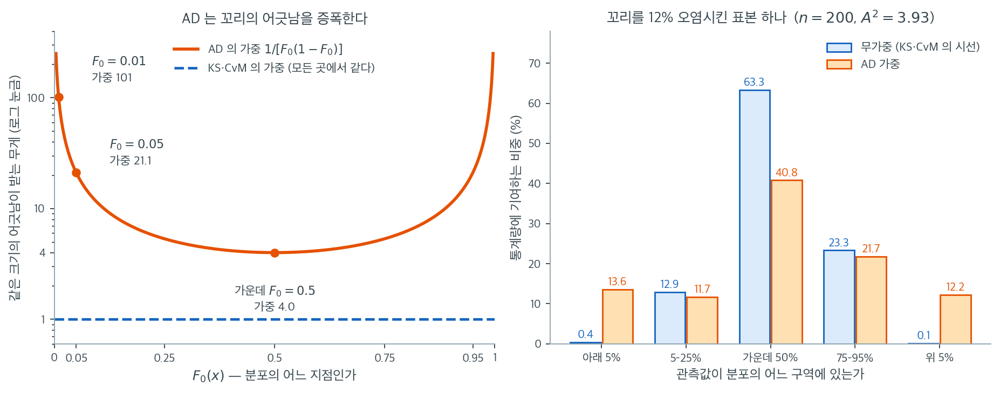

# Anderson-Darling 검정

## 개요

**Anderson-Darling 검정**은 Kolmogorov-Smirnov 검정을 개선한 것으로, 표본이 정규분포 같은 특정 분포에서 왔는지 평가하도록 설계되었다. 꼬리에서의 이탈에 특히 민감하여 작은 표본에서 정규성 이탈을 탐지하는 데 특히 유용하다.

### 가설

- **귀무가설** ($H_0$): 자료가 정규분포를 따른다.
- **대립가설** ($H_1$): 자료가 정규분포를 따르지 않는다.

## Anderson-Darling 검정통계량의 계산

Anderson-Darling 검정통계량 $A^2$은 다음 단계로 계산한다.

1. **자료 정렬**: 표본자료 $X_1, X_2, \dots, X_n$을 오름차순으로 정렬하여 $X_{(1)} \leq X_{(2)} \leq \dots \leq X_{(n)}$을 얻는다.

2. **자료 표준화**: 각 자료점을 평균 0, 분산 1이 되도록 표준화한다. 이 변환이 자료에 정규성을 강제하는 것은 아니라는 점에 유의하라. 각 자료점 $X_i$에 대해 표준화 값 $Z_i$를 계산한다.

    $$
    Z_i = \frac{X_i - \mu}{\sigma}
    $$

    여기서 $\mu$는 표본평균, $\sigma$는 표본표준편차이다.

3. **경험분포함수 계산**: 정렬된 각 표준화 값 $Z_{(i)}$에 대해 정규분포의 누적분포함수 $F(Z_{(i)})$를 계산한다.

4. **검정통계량 $A^2$ 계산**:

    $$
    A^2 = -n - \frac{1}{n} \sum_{i=1}^{n} \left[ (2i-1) \left( \ln(F(Z_{(i)})) + \ln(1 - F(Z_{(n+1-i)})) \right) \right]
    $$

    여기서 $n$은 표본크기이고 $F(Z_{(i)})$는 정렬된 각 표준화 자료점 $Z_{(i)}$에서의 정규분포 누적분포함수이다.

    이 공식은 아래쪽과 위쪽 꼬리를 함께 반영하여 분포 꼬리에서의 이탈에 검정이 더 민감해지게 한다.

## 꼬리에 무게를 싣는다는 말의 뜻

위 합 공식은 정체를 감추고 있다. $A^2$은 사실 KS와 같은 재료 — 경험분포함수와 이론분포함수의 차이 — 를 쓰되, 그 차이를 분포의 위치에 따라 다르게 저울질한 적분이다.

$$
A^2 = n \int_{-\infty}^{\infty} \frac{\bigl[F_n(x) - F_0(x)\bigr]^2}{F_0(x)\,\bigl[1 - F_0(x)\bigr]}\, dF_0(x)
$$

분모의 $F_0(1 - F_0)$은 가운데($F_0 = 0.5$)에서 최대 $0.25$이고 꼬리로 갈수록 0에 가까워진다. 따라서 그 역수인 가중치는 가운데에서 가장 작고 꼬리에서 폭발한다. 아래 왼쪽 칸이 그 가중함수이며, 세로축은 로그 눈금이다.



숫자로 보면 차이가 분명하다. 분포의 정중앙에서 생긴 어긋남은 무게 $4.0$을 받는다. 하위 5% 지점의 같은 크기 어긋남은 $21.1$, 하위 1% 지점에서는 $101$을 받는다. 정중앙 대비 **25배**이다. KS와 Cramér-von Mises는 이 곡선 대신 어디서나 $1$인 평평한 직선을 쓴다. 두 검정의 철학적 차이 전부가 이 한 장의 그림에 들어 있다.

오른쪽 칸은 그 가중이 실제 자료에서 어떻게 작동하는지를 보인다. $n = 200$인 표본에서 12%를 표준편차 3배짜리 관측값으로 오염시킨 뒤, 각 관측값이 통계량에 기여하는 몫을 분포의 다섯 구역으로 나누어 모았다. 무가중으로 보면 가운데 50% 구간이 전체의 $63.3\%$를 만들고, 양 끝 5%씩은 합쳐서 $0.5\%$밖에 기여하지 않는다. KS나 CvM이 꼬리를 사실상 보지 않는다는 뜻이다. AD 가중을 걸면 가운데 몫이 $40.8\%$로 내려가고, 양 끝 5%의 몫이 $13.6\%$와 $12.2\%$, 합쳐서 $25.8\%$로 뛴다. 같은 자료, 같은 어긋남인데 저울만 바꿨더니 꼬리의 발언권이 50배 커진 것이다.

이 구조가 AD 검정의 장점이자 한계다. 두꺼운 꼬리나 극단의 이상점처럼 꼬리에서 일어나는 이탈에는 대단히 예민하다. 반대로 꼬리는 멀쩡한데 가운데 모양만 다른 이탈 — 예를 들어 봉우리가 둘인 자료 — 에서는 그만한 이점이 없다. 어떤 저울을 쓸지는 무엇이 문제가 될지에 대한 사전 판단이며, 그 판단이 틀리면 저울도 틀린다.

## p값 유도

검정통계량 $A^2$을 계산한 뒤에는 대상 분포 유형과 표본크기에 맞는 Anderson-Darling 분포의 임계값과 비교한다. 임계값은 유의수준 $\alpha$(예: 0.01, 0.05, 0.10)에 따라 선택한다.

- 주어진 $\alpha$의 임계값보다 $A^2$이 크면 $p$값이 $\alpha$ 아래가 되어 귀무가설을 기각한다.
- $A^2$이 임계값보다 작으면 $p$값이 $\alpha$ 위가 되어 귀무가설을 기각할 증거가 부족하다.

### 판정 규칙

- 유의수준 $\alpha$에서 $A^2 > \text{임계값}$이면 $H_0$을 기각한다(자료가 정규분포를 따르지 않는다).
- $A^2 < \text{임계값}$이면 $H_0$을 기각하지 못한다(자료가 정규분포를 따를 수 있다).

## `stats.anderson`을 이용한 Python 구현

<div class="exbox" markdown>

**보기 1.** <span class="diff easy" title="쉬움"></span> 기각값 표로 판정하기. $\mathcal{N}(1, 10^2)$에서 $n = 1000$개를 뽑으면 $A^2 = 0.2432$이고 다섯 유의수준 모두에서 기각하지 못한다.

**(1)** 이 쪽의 세 보기는 $\mathcal{N}(1, 10^2)$과 $\mathcal{N}(0, 1)$을 번갈아 쓰는데 $A^2$이 모두 $0.2432$다. 왜 그런지 공식에서 보이시오. 그런데 끝자리까지 완전히 같지는 않다. 그것은 왜인가.

**(2)** 임계값 $[0.574,\ 0.653,\ 0.784,\ 0.914,\ 1.088]$은 어디서 온 수인가. $n$에 어떻게 의존하며 $n = 20$이면 얼마가 되는가.

</div>

??? success "풀이"

    **(1) $A^2$은 위치와 척도에 불변이다.** 통계량이 자료에 의존하는 경로는 표준화 값

    $$
    Z_i = \frac{X_i - \bar X}{S}
    $$

    하나뿐이다. $Y_i = cX_i + d$ ($c > 0$)로 옮기고 늘이면 $\bar Y = c\bar X + d$이고 $S_Y = cS_X$이므로

    $$
    Z_i(Y) = \frac{(cX_i + d) - (c\bar X + d)}{cS_X} = \frac{c(X_i - \bar X)}{cS_X} = Z_i(X)
    $$

    로 **$c$와 $d$가 완전히 약분된다.** 표준화 값이 같으면 $F(Z_{(i)})$도 같고 합 공식의 모든 항이 같으니 $A^2$도 같다. 이것은 근사가 아니라 항등식이다.

    씨앗을 고정하면 `normal(1, 10, 1000)`이 `normal(0, 1, 1000)`의 $10$배에 1을 더한 것과 **정확히** 같으므로($c = 10$, $d = 1$) 두 보기의 $A^2$은 같은 수여야 한다. 실제로

    $$
    A^2(\mathcal{N}(1,10^2)\text{ 자료}) = 0.2432179174631983, \qquad
    A^2(\mathcal{N}(0,1)\text{ 자료}) = 0.2432179174634257
    $$

    로 **소수 열두째 자리까지 같다.** 차이는 $2.3\times10^{-13}$이고 **부동소수점 반올림이 전부다.** 자료를 10배로 늘려 더한 뒤 다시 나누는 과정에서 유효숫자 아래쪽이 조금 어긋나며, 거기에 로그 1000개를 더하면서 그 오차가 쌓인다. 수학적으로는 완전히 같은 수다.

    **"평균과 표준편차를 바꿔도 결론은 같아야 한다"는 코드의 주석은 그래서 결론보다 강한 말이다.** 결론만 같은 것이 아니라 통계량 자체가 같다.

    한 가지 덧붙이면, 표준화에 쓰는 $S$가 $1/(n-1)$짜리인지 $1/n$짜리인지는 불변성과 무관하지만 값에는 영향을 준다. 정의대로 손계산하면 `ddof=1`로 $0.2432179174633120$, `ddof=0`으로 $0.2425011779185979$가 나오고, `scipy`의 값과 맞는 쪽은 **`ddof=1`**이다. 셋째 자리에서 갈린다.

    **(2) 스티븐스의 표본크기 보정이다.** `scipy`는 모수를 추정한 경우($\mu$, $\sigma$를 둘 다 표본에서 재는 경우)의 점근 임계값

    $$
    A^2_{\infty} = [0.576,\ 0.656,\ 0.787,\ 0.918,\ 1.092] \quad (\alpha = 15, 10, 5, 2.5, 1\%)
    $$

    를 표본크기로 나누어 보정한다.

    $$
    A^2_{\text{crit}}(n) = \frac{A^2_{\infty}}{1 + \dfrac{4}{n} - \dfrac{25}{n^2}}
    $$

    $n = 1000$에서 분모가 $1 + 0.004 - 0.000025 = 1.003975$이므로 $0.576/1.003975 = 0.5737$ 등이 되어 반올림하면 **$[0.574, 0.653, 0.784, 0.914, 1.088]$으로 출력과 정확히 맞는다.**

    $n$이 작으면 분모가 커져 임계값이 내려간다.

    | $n$ | 15% | 10% | 5% | 2.5% | 1% |
    |---|---|---|---|---|---|
    | 20 | $0.506$ | $0.577$ | $0.692$ | $0.807$ | $0.960$ |
    | 50 | $0.538$ | $0.613$ | $0.736$ | $0.858$ | $1.021$ |
    | 100 | $0.555$ | $0.632$ | $0.759$ | $0.885$ | $1.053$ |
    | 1000 | $0.574$ | $0.653$ | $0.784$ | $0.914$ | $1.088$ |

    $n = 20$의 5% 임계값 $0.692$는 $n = 1000$의 $0.784$보다 $12\%$ 작다. **보정의 방향을 눈여겨볼 것.** 작은 표본에서 임계값이 **낮아지는** 것은 $\mu$와 $\sigma$를 표본에서 추정했기 때문이다. 추정한 모수로 표준화하면 경험분포가 이론분포에 억지로 끌어당겨져 $A^2$이 작게 나오는데, 그 효과가 작은 표본에서 크다. 보정을 생략하고 점근값 $0.787$을 $n = 20$에 그대로 쓰면 검정이 지나치게 보수적이 되어 명목보다 작은 크기로 굴러간다. 같은 함정의 더 극적인 사례가 [KS 와 릴리에포르](./ks_lilliefors.md) 쪽에 있다.

    ```python
    import numpy as np
    from scipy import stats

    np.random.seed(0)

    # 평균과 표준편차를 바꿔도 결론은 같아야 한다. 정규성 검정은 위치와
    # 척도가 아니라 모양을 묻기 때문이다.
    # data = np.random.normal(0, 1, 1000)
    data = np.random.normal(1, 10, 1000)

    # scipy 의 anderson 은 p-값 대신 유의수준별 기각값을 돌려준다.
    # 통계량이 기각값보다 크면 기각이다.
    result = stats.anderson(data)
    statistic = result.statistic
    print(f"Anderson-Darling Test: Statistic={statistic}")

    # 기각값은 유의수준이 낮아질수록 커진다. 통계량 하나로 여러 수준의
    # 판정을 한꺼번에 읽을 수 있다.
    for significance_level, critical_value in zip(result.significance_level, result.critical_values):
        if statistic >= critical_value:
            print(f"At {significance_level}% significance level: Reject H_0. The data is not normally distributed.")
        else:
            print(f"At {significance_level}% significance level: Fail to reject H_0. The data is normally distributed.")
    ```

    출력:

    ```text
    Anderson-Darling Test: Statistic=0.24321791746319832
    At 15.0% significance level: Fail to reject H_0. The data is normally distributed.
    At 10.0% significance level: Fail to reject H_0. The data is normally distributed.
    At 5.0% significance level: Fail to reject H_0. The data is normally distributed.
    At 2.5% significance level: Fail to reject H_0. The data is normally distributed.
    At 1.0% significance level: Fail to reject H_0. The data is normally distributed.
    ```

    불변성과 임계값의 출처를 함께 확인한다.

    ```python
    import numpy as np
    from scipy import stats

    np.random.seed(0)
    a = np.random.normal(1, 10, 1000)   # 보기 1·3 의 자료
    np.random.seed(0)
    b = np.random.normal(0, 1, 1000)    # 보기 2 의 자료
    print(f"a 가 10b + 1 인가: {np.array_equal(a, 10 * b + 1)}")

    ra, rb = stats.anderson(a), stats.anderson(b)
    print(f"A2(a) = {ra.statistic:.16f}")
    print(f"A2(b) = {rb.statistic:.16f}")
    print(f"두 값의 차 = {abs(ra.statistic - rb.statistic):.3e}")

    # 정의대로 손계산. 표준화에 쓰는 표준편차가 ddof=1 인지 0 인지가 갈린다.
    def A2(x, ddof):
        z = np.sort((x - x.mean()) / x.std(ddof=ddof))
        n = len(z)
        F = stats.norm.cdf(z)
        i = np.arange(1, n + 1)
        return -n - np.sum((2 * i - 1) * (np.log(F) + np.log(1 - F[::-1]))) / n

    print(f"\n손계산 (ddof=1) = {A2(b, 1):.16f}")
    print(f"손계산 (ddof=0) = {A2(b, 0):.16f}")

    # 임계값의 출처: Stephens 의 표본크기 보정
    base = np.array([0.576, 0.656, 0.787, 0.918, 1.092])
    for nn in (20, 50, 100, 1000):
        print(f"n = {nn:>4}: {np.round(base / (1 + 4.0 / nn - 25.0 / nn**2), 3)}")
    print(f"scipy 가 준 임계값 (n = 1000): {ra.critical_values}")
    ```

    출력:

    ```text
    a 가 10b + 1 인가: True
    A2(a) = 0.2432179174631983
    A2(b) = 0.2432179174634257
    두 값의 차 = 2.274e-13

    손계산 (ddof=1) = 0.2432179174633120
    손계산 (ddof=0) = 0.2425011779185979
    n =   20: [0.506 0.577 0.692 0.807 0.96 ]
    n =   50: [0.538 0.613 0.736 0.858 1.021]
    n =  100: [0.555 0.632 0.759 0.885 1.053]
    n = 1000: [0.574 0.653 0.784 0.914 1.088]
    scipy 가 준 임계값 (n = 1000): [0.574 0.653 0.784 0.914 1.088]
    ```

    세 가지가 맞아떨어진다. 불변성이 $10^{-13}$ 수준에서 성립하고, 정의대로 손계산한 $A^2$이 `scipy`의 값과 열두 자리까지 같으며(`ddof=1`일 때), 스티븐스 보정식이 출력된 임계값을 그대로 재현한다. $\square$

---

## `stats.anderson`에서 p값을 얻을 수 있는가

SciPy의 `stats.anderson()` 함수는 $p$값을 직접 제공하지 **않는다**. 검정통계량과 특정 유의수준에서의 임계값만 돌려준다.

### 왜 직접적인 p값이 없는가

Anderson-Darling 검정은 각 유의수준(정규분포의 경우 15%, 10%, 5%, 2.5%, 1%)에 대해 모의실험이나 이론적 분포표에서 얻은 미리 정해진 임계값을 쓴다. Anderson-Darling 통계량의 분포는 표본크기와 검정 대상 분포에 따라 달라지므로 정확한 $p$값을 계산하는 일이 복잡하다.

### 근사 p값 (정규성 검정의 경우)

정규성 검정에서 근사 $p$값이 필요하다면 두 가지 선택지가 있다.

**선택지 1: `statsmodels` 사용**

`statsmodels` 라이브러리가 근사 $p$값을 함께 제공하는 구현을 제공한다.

<div class="exbox" markdown>

**보기 2.** <span class="diff easy" title="쉬움"></span> p-값으로 판정하기. 같은 자료에 `statsmodels`의 `normal_ad`를 걸면 통계량에 $p$값이 붙어 나온다.

**(1)** `normal_ad`의 통계량이 `scipy.stats.anderson`의 것과 같은가. 몇째 자리까지 같은지 확인하고, 표준화에 쓰는 표준편차가 어느 판본인지 정의대로 손계산해 가리시오.

**(2)** `scipy`가 주지 않는 $p$값을 `statsmodels`는 어떻게 만드는가. 그 과정을 손으로 밟아 $0.7659878263029309$를 재현하시오.

</div>

??? success "풀이"

    **(1) 같은 부동소수점 수이고, 표준화는 `ddof=1`이다.** 두 함수가 돌려주는 통계량은 모두

    $$
    A^2 = 0.2432179174634257
    $$

    로 **마지막 비트까지** 같다. 정의대로 손계산하면 $0.2432179174633120$이 나와 열두째 자리에서 갈리는데, 이는 합을 더하는 순서가 달라 생기는 반올림 차이다. 중요한 것은 `ddof=0`으로 표준화했을 때의 $0.2425011779185979$와는 **셋째 자리에서** 갈린다는 점이다. 두 라이브러리 모두 $1/(n-1)$짜리 표본표준편차로 표준화한다.

    **(2) 표본크기 보정 한 번과 구간별 근사식 한 줄이다.** `normal_ad`는 먼저 통계량을 보정한다.

    $$
    A^{2\ast} = A^2\left(1 + \frac{0.75}{n} + \frac{2.25}{n^2}\right)
    $$

    $n = 1000$이면 괄호가 $1.00075$이므로 $A^{2\ast} = 0.2434008781$이다. 그다음 $A^{2\ast}$가 떨어지는 구간에 따라 네 개의 근사식 가운데 하나를 쓴다.

    | $A^{2\ast}$ 구간 | $p$값 공식 |
    |---|---|
    | $[0,\ 0.200)$ | $1 - \exp(-13.436 + 101.14\,A^{2\ast} - 223.73\,A^{2\ast 2})$ |
    | $[0.200,\ 0.340)$ | $1 - \exp(-8.318 + 42.796\,A^{2\ast} - 59.938\,A^{2\ast 2})$ |
    | $[0.340,\ 0.600)$ | $\exp(0.9177 - 4.279\,A^{2\ast} - 1.380\,A^{2\ast 2})$ |
    | $[0.600,\ 13]$ | $\exp(1.2937 - 5.709\,A^{2\ast} + 0.0186\,A^{2\ast 2})$ |

    $A^{2\ast} = 0.2434$는 두 번째 구간이므로

    $$
    p = 1 - \exp\bigl(-8.318 + 42.796(0.2434008781) - 59.938(0.2434008781)^2\bigr) = 0.7659878263029309
    $$

    이고 `normal_ad`가 돌려준 값과 **열여섯 자리까지** 같다.

    **여기서 두 가지를 눈여겨볼 것.** 첫째, 이 $p$값은 분석적으로 유도된 것이 아니라 모의실험 표에 **곡선을 맞춘 근사식**이다. 구간 경계에서 공식이 바뀌므로 $A^{2\ast}$가 $0.200$이나 $0.340$을 가로지르는 자리에서는 $p$값이 매끄럽지 않다. 둘째, 네 번째 구간의 상한 $13$을 넘으면 `statsmodels`는 $p = 0$을 돌려준다. 자릿수가 필요한 자리에서 $p$를 $0$으로 보고하면 안 되므로, 그런 경우에는 $A^2$ 자체를 적는 편이 정직하다.

    `scipy`가 $p$값 대신 임계값 표를 주는 이유도 여기서 보인다. **근사식은 쓸 만하지만 정확하지는 않다.** 임계값 표는 "5% 수준에서 기각/기각 못 함"이라는 이항 판정만 주되 그 판정은 믿을 만하고, 근사 $p$값은 연속적인 수를 주지만 그 수의 끝자리는 곡선 맞춤의 산물이다.

    ```python
    import numpy as np
    from statsmodels.stats.diagnostic import normal_ad

    np.random.seed(0)
    data = np.random.normal(0, 1, 1000)

    # statsmodels 의 normal_ad 는 같은 통계량에 p-값까지 붙여 준다.
    # 기각값 표를 읽는 대신 p-값으로 바로 판단하고 싶을 때 쓴다.
    statistic, p_value = normal_ad(data)
    print(f"Anderson-Darling Test: Statistic={statistic}, p-value={p_value}")
    ```

    출력:

    ```
    Anderson-Darling Test: Statistic=0.2432179174634257, p-value=0.7659878263029309
    ```

    통계량의 일치와 $p$값의 출처를 함께 확인한다.

    ```python
    import numpy as np
    from scipy import stats
    from statsmodels.stats.diagnostic import normal_ad

    np.random.seed(0)
    data = np.random.normal(0, 1, 1000)
    n = data.size
    ad2, p = normal_ad(data)
    print(f"normal_ad:        A2 = {ad2:.16f},  p = {p:.16f}")
    print(f"scipy.anderson:   A2 = {stats.anderson(data).statistic:.16f}")

    # 정의대로 손계산 — 표준화에 ddof=1 을 쓴다.
    z = np.sort((data - data.mean()) / data.std(ddof=1))
    F = stats.norm.cdf(z)
    i = np.arange(1, n + 1)
    A2_hand = -n - np.sum((2 * i - 1) * (np.log(F) + np.log(1 - F[::-1]))) / n
    print(f"손계산 (ddof=1):  A2 = {A2_hand:.16f}")

    # statsmodels 의 p 값: 표본크기 보정 뒤 구간별 근사식
    ad2a = ad2 * (1 + 0.75 / n + 2.25 / n**2)
    print(f"\n보정된 A2* = {ad2a:.10f}  ->  구간 [0.200, 0.340)")
    p_hand = 1 - np.exp(-8.318 + 42.796 * ad2a - 59.938 * ad2a**2)
    print(f"손계산 p = 1 - exp(-8.318 + 42.796 A2* - 59.938 A2*^2) = {p_hand:.16f}")
    print(f"normal_ad p                                            = {p:.16f}")
    ```

    출력:

    ```text
    normal_ad:        A2 = 0.2432179174634257,  p = 0.7659878263029309
    scipy.anderson:   A2 = 0.2432179174634257
    손계산 (ddof=1):  A2 = 0.2432179174633120

    보정된 A2* = 0.2434008781  ->  구간 [0.200, 0.340)
    손계산 p = 1 - exp(-8.318 + 42.796 A2* - 59.938 A2*^2) = 0.7659878263029309
    normal_ad p                                            = 0.7659878263029309
    ```

    두 라이브러리의 통계량이 완전히 같고, 손으로 밟은 $p$값이 `normal_ad`의 값과 끝까지 같다. $p = 0.766$은 앞의 임계값 비교에서 1% 수준까지 모두 기각하지 못한 결과와 일치한다. $\square$

**선택지 2: 임계값으로 해석하기**

추가 라이브러리 없이 대략적인 근사를 원한다면 검정통계량과 제공된 임계값의 비교로 $p$값의 범위를 해석할 수 있다.

- 어떤 유의수준의 임계값보다 검정통계량이 **작으면** $p$값이 그 유의수준보다 **크다**.
- 임계값보다 검정통계량이 **크면** $p$값이 그 유의수준보다 **작다**.

### `normal_ad`를 이용한 Python 구현

<div class="exbox" markdown>

**보기 3.** <span class="diff easy" title="쉬움"></span> 치우친 자료에 적용 — 그 전에, 이 자료는 정말 치우쳐 있는가

**(1)** 이 보기가 실제로 넣는 자료는 $\mathcal{N}(1, 10^2)$이다. 왜도를 재어 치우쳤는지 판정하고, $A^2$이 보기 2의 값과 같은 까닭을 말하시오.

**(2)** 정말로 치우친 자료를 넣으면 어떻게 되는가. $\text{Lognormal}(0, 0.6^2)$으로 바꾸어 $A^2$과 $p$값을 구하고, 보기 2에서 본 근사식의 **어느 구간**으로 떨어지는지 확인하시오.

</div>

??? success "풀이"

    **(1) 치우쳐 있지 않다. 이 자료는 완전한 정규자료다.** 왜도를 재면

    $$
    g_1 = +0.0339, \qquad G_1 = +0.0339, \qquad g_2 = -0.0468
    $$

    이고 왜도 검정의 $p$값이 $0.6598$이다. 앞 절에서 본 대로 $n = 1000$에서 유의한 왜도의 경계가 $0.1515$인데 관측값은 그 $22\%$에 지나지 않는다. **제목이 "치우친 자료"라고 하지만 코드가 뽑는 것은 평균 1, 표준편차 10인 정규자료다.** 활성화된 줄과 주석 처리된 줄 모두 `np.random.normal`이니, 이 보기만으로는 치우침에 대해 아무것도 확인할 수 없다.

    $A^2$이 보기 2와 같은 것은 보기 1에서 본 **위치·척도 불변성** 때문이다. 씨앗이 같으므로 이 자료는 보기 2의 자료를 10배 하고 1을 더한 것이고, 표준화 단계에서 그 변환이 완전히 약분된다. 따라서

    $$
    A^2 = 0.2432179175, \qquad p = 0.7659878263
    $$

    으로 보기 2와 같은 수가 나온다. 정보가 새로 더해지지 않는다.

    **(2) 대수정규를 넣으면 $A^2 = 38.07$이 되고 `normal_ad`는 $p = 0$을 돌려준다.** $\sigma = 0.6$인 대수정규의 이론 왜도는

    $$
    \gamma_1 = (e^{\sigma^2} + 2)\sqrt{e^{\sigma^2} - 1} = (e^{0.36} + 2)\sqrt{e^{0.36} - 1} = 2.2601
    $$

    이고 표본값은 $g_1 = 1.8107$이다(유한표본에서 치우침이 아래로 깎인다). 통계량은

    | 자료 | $A^2$ | 5% 임계값 | $p$ |
    |---|---|---|---|
    | $\mathcal{N}(1, 10^2)$ | $0.2432$ | $0.784$ | $0.7660$ |
    | $\text{Lognormal}(0, 0.6^2)$ | $38.0734$ | $0.784$ | `0.0` |

    으로, 치우친 자료의 $A^2$이 5% 임계값의 **48.6배**다. 압도적인 기각이다.

    그런데 $p$값이 정확히 `0.0`으로 찍히는 것이 눈여겨볼 대목이다. 보정된 통계량이 $A^{2\ast} = 38.1020$인데, 보기 2에서 본 근사식의 마지막 구간이 $[0.600,\ 13]$까지만 정의되어 있다. `statsmodels`는 상한을 넘으면 계산을 포기하고 $0$을 돌려준다. 네 번째 구간의 공식을 상한 밖으로 억지로 늘려 쓰면

    $$
    p = \exp(1.2937 - 5.709\times38.1020 + 0.0186\times38.1020^2) = 6.6\times10^{-83}
    $$

    이 나오는데, 이 수에는 아무 근거가 없다. 곡선 맞춤이 $A^{2\ast} \le 13$ 범위에서만 보증되기 때문이다. **그러므로 이런 경우에는 $p$값을 보고하지 말고 $A^2 = 38.07$과 임계값 $0.784$를 나란히 적는 것이 정직하다.** "$p < 10^{-10}$" 정도로 쓰는 것도 가능하지만, `0.0`을 액면 그대로 옮겨 적는 것은 잘못이다.

    ```python
    import numpy as np
    from statsmodels.stats.diagnostic import normal_ad

    np.random.seed(0)

    # data = np.random.normal(0, 1, 1000)
    data = np.random.normal(1, 10, 1000)

    # Anderson-Darling 은 꼬리 쪽 이탈에 특히 민감하다. 꼬리가 문제가 되는
    # 금융 자료에서 이 검정을 즐겨 쓰는 까닭이다.
    statistic, p_value = normal_ad(data)
    print(f"Anderson-Darling Test: Statistic={statistic}, p-value={p_value}")

    # 결과 해석
    alpha = 0.05
    if p_value <= alpha:
        print("Reject H_0: The data is not normally distributed.")
    else:
        print("Fail to reject H_0: The data is normally distributed.")
    ```

    출력:

    ```text
    Anderson-Darling Test: Statistic=0.243217917463312, p-value=0.7659878263032931
    Fail to reject H_0: The data is normally distributed.
    ```

    자료가 치우쳤는지 재고, 정말 치우친 자료를 넣어 본다.

    ```python
    import numpy as np
    from scipy import stats
    from statsmodels.stats.diagnostic import normal_ad

    np.random.seed(0)
    data = np.random.normal(1, 10, 1000)   # 이 보기가 실제로 쓰는 자료
    n = data.size
    print("이 보기의 자료 — 치우쳐 있는가?")
    print(f"  g1 = {stats.skew(data):+.4f},  G1 = {stats.skew(data, bias=False):+.4f}")
    print(f"  g2 = {stats.kurtosis(data):+.4f}")
    print(f"  skewtest p = {stats.skewtest(data)[1]:.4f}")
    ad2, p = normal_ad(data)
    print(f"  A2 = {ad2:.10f},  p = {p:.10f}")

    # 정말로 치우친 자료를 넣으면
    np.random.seed(0)
    sk = np.random.lognormal(0, 0.6, 1000)
    ad2s, ps = normal_ad(sk)
    ad2a = ad2s * (1 + 0.75 / n + 2.25 / n**2)
    print(f"\n대수정규 자료 (sigma = 0.6)")
    print(f"  g1 = {stats.skew(sk):+.4f}   (이론 {(np.exp(0.36) + 2) * np.sqrt(np.exp(0.36) - 1):+.4f})")
    print(f"  A2 = {ad2s:.4f},  보정된 A2* = {ad2a:.4f}  ->  네 번째 구간 [0.600, 13]")
    print(f"  근사식 p = {np.exp(1.2937 - 5.709 * ad2a + 0.0186 * ad2a**2):.6g}")
    print(f"  normal_ad p = {ps:.6g}")
    print(f"  scipy 임계값 5% = {stats.anderson(sk).critical_values[2]:.3f}"
          f"  (A2 가 {ad2s / stats.anderson(sk).critical_values[2]:.1f} 배)")
    ```

    출력:

    ```text
    이 보기의 자료 — 치우쳐 있는가?
      g1 = +0.0339,  G1 = +0.0339
      g2 = -0.0468
      skewtest p = 0.6598
      A2 = 0.2432179175,  p = 0.7659878263

    대수정규 자료 (sigma = 0.6)
      g1 = +1.8107   (이론 +2.2601)
      A2 = 38.0734,  보정된 A2* = 38.1020  ->  네 번째 구간 [0.600, 13]
      근사식 p = 6.59708e-83
      normal_ad p = 0
      scipy 임계값 5% = 0.784  (A2 가 48.6 배)
    ```

    유도한 이론 왜도 $2.2601$이 표본 $1.8107$과 같은 방향에 있고, $A^{2\ast} = 38.10$이 근사식의 정의 구간 $[0.600,\ 13]$을 벗어나 `normal_ad`가 $p = 0$을 내놓는 것까지 확인된다. **이 보기의 제목은 자료와 맞지 않으며, 치우침을 보려면 자료를 바꿔야 한다.** $\square$

---

## `stats.anderson`과 `normal_ad` 중 무엇을 쓸 것인가

1. **정규성에 국한되지 않는 일반적인 분포 검정**이 필요하고 $p$값이 필요 없다면 **`stats.anderson`**이 낫다. 정규, 지수, Weibull, 로지스틱, 극값 분포를 검정할 수 있고 각각의 임계값을 제공한다.

2. **정규성 검정이 목표이고 $p$값이 필요하다면** **`statsmodels`의 `normal_ad`**가 이상적이다. 정규성 검정을 위해 특별히 설계되었고 근사 $p$값을 포함하므로 전통적인 가설검정 틀에서 결과를 해석하기 쉽다.

### 권장 사항

**명확한 $p$값 해석**이 필요한 **정규성 검정**이 초점이면 `normal_ad`를 쓴다. 여러 분포에 대해 유연하게 검정하려면 `stats.anderson`을 쓰고 제공된 임계값으로 결과를 해석한다.

## 연습문제

<div class="drillbox" markdown>

**연습문제 1.** <span class="diff med" title="중간"></span>
Anderson-Darling 검정은 Kolmogorov-Smirnov 검정보다 분포의 꼬리에 더 큰 가중치를 준다. 가중함수가 어떻게 이를 달성하는지 설명하라.

</div>

??? success "풀이"
    Anderson-Darling 통계량은

    $$
    A^2 = -n - \frac{1}{n}\sum_{i=1}^n (2i-1)[\ln F(x_{(i)}) + \ln(1 - F(x_{(n+1-i)}))]
    $$

    이는 경험적 CDF와 이론적 CDF의 제곱차를 가중 적분한 것으로 표현할 수 있다: $A^2 = n\int_{-\infty}^{\infty} \frac{[F_n(x) - F(x)]^2}{F(x)(1-F(x))}dF(x)$.

    가중함수 $w(x) = 1/[F(x)(1-F(x))]$는 ($F(x)$가 0이나 1에 가까운) 꼬리에서 크고 중앙에서 작다. 그래서 Anderson-Darling 검정이 (분포의 모든 부분에 같은 가중치를 주는) KS 검정보다 꼬리 이탈에 더 민감해지고, 꼬리가 두껍거나 얇은 대립가설을 더 잘 탐지한다.

<div class="drillbox" markdown>

**연습문제 2.** <span class="diff easy" title="쉬움"></span>
관측값 50개에 대한 Anderson-Darling 검정에서 $A^2 = 0.85$를 얻었다. 임계값이 $0.631$(10%), $0.752$(5%), $1.035$(1%)일 때 $\alpha = 0.05$에서의 결론을 정하라.

</div>

??? success "풀이"
    $A^2 = 0.85 > 0.752$(5% 임계값)이므로 유의수준 5%에서 $H_0$(정규성)을 기각한다. 다만 $A^2 = 0.85 < 1.035$(1% 임계값)이므로 1% 수준에서는 기각하지 않는다.

    결론: 5% 수준에서 비정규성의 증거가 있다($0.01 < p < 0.05$). 이탈의 성격을 파악하려면 시각적 점검(Q-Q 그림)을 함께 해야 한다.

<div class="drillbox" markdown>

**연습문제 3.** <span class="diff med" title="중간"></span>
정규성 이탈 탐지에서 Anderson-Darling, Shapiro-Wilk, Kolmogorov-Smirnov 검정의 검정력을 비교하라.

</div>

??? success "풀이"
    모의실험 연구는 대체로 다음을 보여준다.

    1. **Shapiro-Wilk**가 전반적으로 검정력이 가장 높다. 특히 작거나 중간 크기의 $n$에서, 그리고 폭넓은 대립가설(치우침, 두꺼운 꼬리, 얇은 꼬리)에 대해 그렇다.
    2. **Anderson-Darling**은 Shapiro-Wilk에 거의 견줄 만하고 KS보다 우수하다. 꼬리 가중 덕분에 두꺼운 꼬리 대립가설을 특히 잘 탐지한다.
    3. **Kolmogorov-Smirnov(Lilliefors)**는 검정력이 가장 낮다. 가중 없이 최대 편차만 쓰므로 (이탈이 작은) 중앙과 (가장 중요한) 꼬리에 같은 관심을 주기 때문이다.

    권장: Shapiro-Wilk를 주 검정으로 쓰고, (특히 $n$이 클 때) Anderson-Darling을 대안으로 쓰며, KS는 완전히 지정된 분포와 비교할 때에만 쓴다(복합 정규성 검정에는 쓰지 않는다).

<div class="drillbox" markdown>

**연습문제 4.** <span class="diff med" title="중간"></span>
Anderson-Darling 검정은 정규분포가 아닌 분포(지수, 와이불 등)에도 적용할 수 있다. 일반 원리를 설명하라.

</div>

??? success "풀이"
    Anderson-Darling 검정은 일반적인 적합도 검정이다. 경험적 CDF를 임의로 지정한 이론적 CDF $F_0(x)$와 비교한다. 정규성 검정에서는 추정된 모수로 $F_0 = \Phi((x-\hat{\mu})/\hat{\sigma})$를 쓴다.

    자료가 지수분포를 따르는지 검정하려면 $F_0(x) = 1 - e^{-x/\hat{\lambda}}$를 쓴다. 와이불이라면 추정된 모양·척도 모수를 가진 Weibull CDF를 쓴다.

    검정통계량 공식은 모든 경우에 같고 $F_0$만 바뀐다. 임계값은 분포족마다 다른데, $A^2$의 귀무분포가 추정한 모수의 개수와 기준분포의 모양에 의존하기 때문이다. 각 분포족에 대해 전용 임계값 표나 모의실험 기반 p값을 쓴다.

---

## 정리하며

앤더슨–달링은 **꼬리에 가중**을 둔 EDF 검정이다.

- **KS 를 개선한 것이다.** 적분 안에 $1/[F_0(x)(1-F_0(x))]$ 가중을 넣어 **꼬리에서의 차이를 크게 센다.**
- **꼬리 이탈 탐지에 강하다.** 금융 자료처럼 꼬리가 문제인 상황에서 KS 보다 훨씬 예민하다.
- **$p$ 값 대신 임계값 표를 준다.** `scipy.stats.anderson` 은 $A^2$ 통계량과 여러 유의수준의 임계값을 돌려주며, **$p$ 값을 직접 주지 않는다.**
- **분포마다 임계값이 다르다.** 정규·지수·로지스틱 등 지정한 분포에 따라 표가 달라지며, 모수를 추정했다는 사실이 이미 반영되어 있다.
- **소표본에서도 쓸 만하다.** 샤피로–윌크와 함께 실무의 주력이다.

다음 절 **Shapiro-Wilk 검정**으로 넘어간다.
