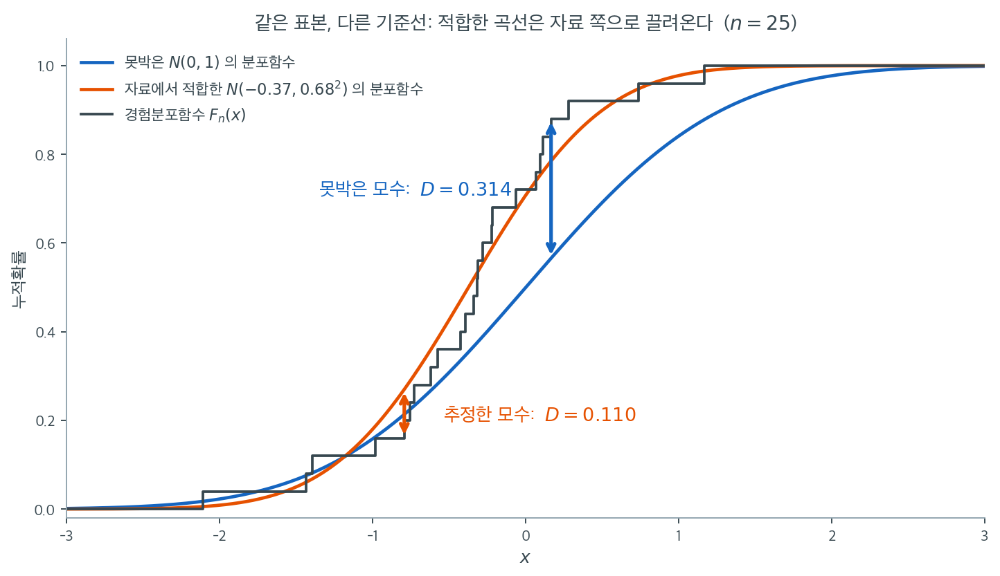

# Kolmogorov-Smirnov 검정과 Lilliefors 검정

시각적 방법과 기술통계가 자료 분포에 대한 통찰을 주는 반면, 형식적 통계검정은 정규성을 평가하는 더 엄밀한 방법을 제공한다. 이 검정들은 관측된 자료가 기대되는 정규분포에서 유의하게 벗어나는지 평가하여 판단의 통계적 근거를 제공한다.

## Kolmogorov-Smirnov 검정

**Kolmogorov-Smirnov(K-S) 검정**은 표본자료의 경험적 누적분포함수(ECDF)를 기준분포(여기서는 정규분포)의 누적분포함수(CDF)와 비교하는 비모수 검정이다. 두 분포의 중심위치와 전반적 모양(분산) 양쪽의 차이에 민감하다.

### 가설

- **귀무가설** ($H_0$): 자료가 지정한 분포(정규분포)를 따른다.
- **대립가설** ($H_1$): 자료가 지정한 분포를 따르지 않는다.

### K-S 검정통계량의 계산

Kolmogorov-Smirnov 검정통계량 $D$는 표본의 경험적 CDF와 기준분포의 CDF 사이의 최대 절대차로 계산한다. 절차는 다음과 같다.

1. **자료 정렬**: $X_1, X_2, \dots, X_n$을 오름차순으로 정렬하여 $X_{(1)} \leq X_{(2)} \leq \dots \leq X_{(n)}$을 얻는다.

2. **경험적 CDF 계산**: 정렬된 각 자료점 $X_{(i)}$에 대해 ECDF를 그 이하인 자료점의 비율로 정의한다.

    $$
    F_{\text{emp}}(X_{(i)}) = \frac{i}{n}
    $$

    여기서 $n$은 전체 표본크기이고 $i$는 자료점의 순위이다.

3. **이론적 CDF 계산**: $X_{(i)}$에서 평가한 정규분포의 이론적 CDF $F_{\text{norm}}(X_{(i)})$는

    $$
    F_{\text{norm}}(X_{(i)}) = \Phi\left( \frac{X_{(i)} - \mu}{\sigma} \right)
    $$

    여기서 $\Phi$는 표준정규 누적분포함수이고 $\mu$와 $\sigma$는 각각 표본평균과 표본표준편차이다.

4. **검정통계량 $D$**: K-S 검정통계량 $D$는 임의의 표본점에서 경험적 CDF와 이론적 CDF의 최대 절대차이다.

    $$
    D = \max_i \left| F_{\text{emp}}(X_{(i)}) - F_{\text{norm}}(X_{(i)}) \right|
    $$

    곧 $D$는 자료 범위에 걸쳐 두 CDF 사이의 가장 큰 수직 거리를 잰다.

!!! note "실제 구현은 양쪽 계단을 모두 본다"
    경험적 CDF는 각 자료점에서 뛰어오르는 계단함수이므로, 엄밀한 통계량은 각 점의 왼쪽 극한 $(i-1)/n$과 오른쪽 값 $i/n$ 모두에 대한 차이의 최댓값을 취한다. `scipy.stats.kstest`가 이 방식으로 계산한다.

### 판정 규칙

- $D$가 선택한 유의수준 $\alpha$의 임계값을 넘으면 $H_0$을 기각한다(자료가 정규분포를 따르지 않는다).
- $D$가 임계값보다 작으면 $H_0$을 기각하지 못한다(자료가 정규분포를 따를 수 있다).

K-S 검정은 분포의 중심위치와 모양의 차이를 탐지하는 데 효과적이다. 다만 Anderson-Darling 검정 같은 방법에 비해 꼬리에서의 이탈에는 덜 민감하다.

<div class="exbox" markdown>

**보기 1.** <span class="diff easy" title="쉬움"></span> KS 검정의 함정. 자료에서 추정한 평균과 표준편차로 표준화한 뒤 표준 KS 임계값을 쓰면 $D = 0.019034$, $p = 0.8548$이 나온다.

**(1)** $D$를 정의대로 손계산해 `kstest`의 값을 재현하시오. 계단의 위쪽 틈 $D^+$와 아래쪽 틈 $D^-$ 중 어느 쪽이 통계량이 되었는가. 표준화에 쓰인 `data.std()`는 어느 판본인가.

**(2)** 이 "검정"의 **실제 크기**를 모의실험으로 재시오. 명목 $0.05$가 얼마가 되는가. 정규 자료에서 $p$값이 균등분포를 따라야 하는데 실제로 어떤가.

</div>

??? success "풀이"

    **(1) $D^+$가 이겼고, 표준화는 `ddof=0`이다.** 정렬된 자료를 표준화한 $z_{(i)}$에 대해 경험분포함수는 $z_{(i)}$에서 $(i-1)/n$에서 $i/n$으로 뛰는 계단이므로, 두 방향의 틈을 따로 재야 한다.

    $$
    D^+ = \max_i\left(\frac{i}{n} - \Phi(z_{(i)})\right), \qquad
    D^- = \max_i\left(\Phi(z_{(i)}) - \frac{i-1}{n}\right), \qquad
    D = \max(D^+, D^-)
    $$

    이 표본에서 재면

    | 표준화 | $D^+$ | $D^-$ | $D = \max$ |
    |---|---|---|---|
    | `ddof=0` ($1/n$) | $0.0190341127$ | $0.0098858448$ | $\mathbf{0.0190341127}$ |
    | `ddof=1` ($1/(n-1)$) | $0.0191252945$ | $0.0098072163$ | $0.0191252945$ |

    이다. **위쪽 줄의 $D = 0.0190341127$이 `kstest`의 값과 열 자리까지 같다.** 코드가 쓴 `data.std()`의 기본값이 `ddof=0`이기 때문이다. 아래쪽 줄의 $0.0191252945$는 보기 2에서 릴리에포르가 돌려주는 통계량과 정확히 같은 수인데, `statsmodels`의 `lilliefors`가 $1/(n-1)$짜리 표준편차로 표준화하기 때문이다. **두 검정의 통계량이 "거의 같다"고 하는 차이의 정체가 이것이고, 통계량의 차이는 자료가 아니라 `ddof` 하나다.**

    $D^+$가 $D^-$의 거의 두 배인 것은 이 표본에서 경험분포함수가 적합 정규분포함수보다 위로 더 멀리 벗어나는 자리가 있다는 뜻이다. 어느 쪽이 이기느냐 자체에는 특별한 의미가 없다.

    **(2) 명목 $0.05$가 실제로 $0.0005$다. 백 분의 일이다.** 진짜 표준정규 자료에 같은 절차를 4000번 적용하면

    | 명목 수준 | 실제 기각률 |
    |---|---|
    | $0.05$ | $0.00050$ (4000번 중 2번) |
    | $0.10$ | $0.00150$ (6번) |
    | $0.20$ | $0.00725$ (29번) |

    이다. 어느 수준에서도 **두 자릿수**로 작다. $p$값의 평균은 $0.7869$로, 귀무가설이 참일 때 $p$가 $[0,1]$에 균등해야 한다는 것(평균 $0.5$)과 전혀 다르다. 더 결정적인 것은 4000번 가운데 **가장 작은 $p$값이 $0.0408$**이라는 사실이다. 곧 이 절차는 명목 $0.01$에서 아무리 뽑아도 **단 한 번도** 기각하지 못한다.

    까닭은 쪽 위에서 본 대로다. 표준화가 경험분포함수를 기준 곡선 쪽으로 끌어당기므로 $D$가 체계적으로 작아지는데, `kstest`는 그 사실을 모르고 **모수를 알고 있을 때의** 귀무분포로 $p$값을 계산한다. 작아진 통계량을 작아지지 않은 잣대로 재니 $p$값이 1 쪽으로 몰린다.

    **그러므로 $p = 0.855$는 자료에 대해 아무것도 말해 주지 않는다.** 자료가 어떻든 이 절차는 큰 $p$값을 내놓는다. 고쳐야 할 것은 통계량이 아니라 그것을 비교할 귀무분포이고, 보기 2에서 그 교정을 본다.

    ```python
    import numpy as np
    from scipy import stats

    np.random.seed(0)

    # 예시 자료를 만든다
    # data = np.random.normal(0, 1, 1000)
    data = np.random.normal(1, 10, 1000)

    # kstest 는 모수를 미리 알고 있다고 전제한다. 그래서 표준화해 N(0,1) 과
    # 견주는데, 그 평균과 표준편차를 자료에서 뽑아 썼다는 것이 함정이다.
    # 이러면 검정이 지나치게 너그러워져 p-값이 실제보다 크게 나온다.
    # 아래 Lilliefors 가 바로 이 문제를 고친 검정이다.
    data_ks = (data - data.mean()) / data.std()

    stat, p_value = stats.kstest(data_ks, 'norm')
    print(f"Kolmogorov-Smirnov Test: Statistic={stat}, p-value={p_value}")

    alpha = 0.05
    if p_value <= alpha:
        print("Reject H_0: The data is not normally distributed.")
    else:
        print("Fail to reject H_0: The data is normally distributed.")
    ```

    출력:

    ```text
    Kolmogorov-Smirnov Test: Statistic=0.01903411267034605, p-value=0.8547733408587939
    Fail to reject H_0: The data is normally distributed.
    ```

    손계산과 실제 크기를 함께 확인한다.

    ```python
    import numpy as np
    from scipy import stats

    np.random.seed(0)
    data = np.random.normal(1, 10, 1000)
    n = data.size

    # 정의대로 D 를 손계산한다. 계단의 양쪽을 모두 본다.
    def D_of(x, ddof):
        z = np.sort((x - x.mean()) / x.std(ddof=ddof))
        F = stats.norm.cdf(z)
        i = np.arange(1, len(z) + 1)
        d_plus = np.max(i / len(z) - F)
        d_minus = np.max(F - (i - 1) / len(z))
        return max(d_plus, d_minus), d_plus, d_minus

    D0, dp0, dm0 = D_of(data, 0)
    D1, dp1, dm1 = D_of(data, 1)
    print(f"ddof=0:  D+ = {dp0:.10f},  D- = {dm0:.10f},  D = {D0:.10f}")
    print(f"ddof=1:  D+ = {dp1:.10f},  D- = {dm1:.10f},  D = {D1:.10f}")

    data_ks = (data - data.mean()) / data.std()
    print(f"\nkstest   D = {stats.kstest(data_ks, 'norm')[0]:.10f}")

    # 이 "검정" 의 실제 크기를 재 본다.
    rng = np.random.default_rng(7)
    R = 4000
    ps = np.array([stats.kstest((lambda x: (x - x.mean()) / x.std())(
        rng.standard_normal(n)), 'norm')[1] for _ in range(R)])
    for a in (0.05, 0.10, 0.20):
        print(f"명목 {a:.2f}: 실제 기각률 = {np.mean(ps < a):.5f}"
              f"  ({np.sum(ps < a)}/{R})")
    print(f"\np 값의 평균 = {ps.mean():.4f}  (균등이면 0.5),  최솟값 = {ps.min():.4f}")
    ```

    출력:

    ```text
    ddof=0:  D+ = 0.0190341127,  D- = 0.0098858448,  D = 0.0190341127
    ddof=1:  D+ = 0.0191252945,  D- = 0.0098072163,  D = 0.0191252945

    kstest   D = 0.0190341127
    명목 0.05: 실제 기각률 = 0.00050  (2/4000)
    명목 0.10: 실제 기각률 = 0.00150  (6/4000)
    명목 0.20: 실제 기각률 = 0.00725  (29/4000)

    p 값의 평균 = 0.7869  (균등이면 0.5),  최솟값 = 0.0408
    ```

    손계산한 $D$가 `kstest`의 값과 열 자리까지 같고, 모의실험이 쪽 위의 "보수적이 된다"는 서술을 **백 배**라는 수로 바꾸어 준다. $\square$

!!! warning "이 코드는 사실 타당한 K-S 검정이 아니다"
    위 코드는 **자료에서 추정한** 평균과 표준편차로 자료를 표준화한 뒤 표준 K-S 임계값을 쓴다. 표준화가 경험적 CDF를 이론적 CDF 쪽으로 인위적으로 끌어당기므로 $D$가 작아지고 $p$값이 지나치게 커진다. 곧 검정이 보수적이 되어 검정력을 잃는다. 이것이 바로 다음 절의 Lilliefors 검정이 필요한 이유이다.

### 끌어당긴다는 말의 뜻

"인위적으로 끌어당긴다"는 표현은 비유가 아니라 그림으로 그릴 수 있는 사실이다. 아래는 $N(0,1)$에서 뽑은 $n = 25$짜리 표본 하나다. 검은 계단이 경험분포함수이고, 파란 곡선은 모수를 $N(0,1)$로 못박았을 때의 기준선, 주황 곡선은 같은 자료에서 추정한 $\hat\mu = -0.37$, $\hat\sigma = 0.68$을 꽂아 넣은 기준선이다.



이 표본은 우연히 평균이 $-0.37$로 왼쪽에 치우치고 표준편차도 $0.68$로 좁게 나왔다. 그러니 못박은 $N(0,1)$과는 잘 맞지 않아 최대 틈이 $D = 0.314$나 된다. 그런데 모수를 자료에서 다시 추정하면 주황 곡선이 계단을 따라 왼쪽으로 이동하고 동시에 가팔라져서, 같은 자료인데도 최대 틈이 $D = 0.110$으로 3분의 1토막이 난다. 자료에 맞춰 기준선을 움직였으니 당연한 결과다.

이것은 이 표본만의 운이 아니다. $N(0,1)$에서 $n = 25$짜리 표본을 40000번 뽑아 두 $D$의 평균을 재면 못박았을 때 $0.167$, 추정했을 때 $0.120$이다. 평균적으로 **28% 줄어든다**. 그런데 `stats.kstest`가 돌려주는 $p$값은 못박은 경우의 분포를 기준으로 계산된다. 줄어든 $D$를 줄어들지 않은 잣대로 재니 $p$값이 부풀 수밖에 없다.

그래서 위 코드의 $p = 0.855$는 "자료가 정규와 잘 맞는다"는 증거로 읽어서는 안 된다. 자료가 어떻든 저 코드는 큰 $p$값을 잘 내놓는다. 고쳐야 할 것은 통계량이 아니라 그것을 비교할 **기준분포**이며, 바로 그 일을 하는 것이 다음 절의 Lilliefors 검정이다.

---

## Kolmogorov-Smirnov 검정과 Lilliefors 검정

SciPy의 `stats.kstest` 함수는 **Kolmogorov-Smirnov(K-S) 검정**을 수행하며 **Lilliefors 검정**이 아니다. 두 검정의 차이는 다음과 같다.

### Kolmogorov-Smirnov 검정 (`stats.kstest`)

- **목적**: 일반적인 **적합도 검정**으로, 표본을 **모수가 고정된** 알려진 분포와 비교한다.
- **모수 가정**: 분포의 모수(예: 평균, 표준편차)를 **사전에 안다**고 가정한다.
- **용도**: 미리 정해진 모수를 가진 특정 분포에 자료가 맞는지 보고 싶을 때 적절하다.

### Lilliefors 검정 (`statsmodels.stats.diagnostic.lilliefors`)

- **목적**: 모집단 모수(평균과 표준편차)가 **미지이고 표본에서 추정될 때**의 **정규성 검정**을 위해 K-S를 수정한 것이다.
- **모수 가정**: 모수를 표본에서 추정한다는 사실을 조정하여 이 상황에 맞춘 다른 임계값을 제공한다.
- **제공처**: SciPy에는 없고 `statsmodels`가 제공한다.

### 비교

| 항목 | `stats.kstest` (K-S 검정) | Lilliefors 검정 |
|---------------------------|--------------------------------------------------|-------------------------------------------------|
| **목적** | 일반적 적합도(임의의 분포) | 모수가 미지일 때의 정규성 검정 |
| **모수 지식** | 모수를 안다고 가정 | 모수를 모른다고 가정 |
| **모수 추정** | 추정된 모수를 위해 설계되지 않음 | 추정된 모수에 맞게 조정됨 |
| **SciPy 구현** | 있음 (`stats.kstest`) | SciPy에는 직접 구현 없음 |

<div class="exbox" markdown>

**보기 2.** <span class="diff easy" title="쉬움"></span> KS와 Lilliefors 견주기. 같은 자료에 두 검정을 나란히 돌리면 통계량은 $0.01903$ 대 $0.01913$으로 거의 같은데 $p$값은 $0.855$ 대 $0.582$로 갈린다.

**(1)** 통계량의 차이 $0.0001$은 어디서 오는가. **릴리에포르의 통계량을 `kstest`의 귀무분포로 읽으면** $p$값이 얼마가 되는가. 그 수를 보면 $p$값의 차이가 통계량에서 오는 것인지 귀무분포에서 오는 것인지 가려진다.

**(2)** 릴리에포르는 보기 1에서 본 왜곡을 얼마나 바로잡는가. $n = 50,\ 200,\ 1000$에서 두 절차의 실제 크기를 재어 명목값과 나란히 적으시오.

</div>

??? success "풀이"

    **(1) 통계량의 차이는 `ddof` 하나이고, $p$값의 차이는 전부 귀무분포에서 온다.** 보기 1에서 이미 확인했듯이

    $$
    \text{`kstest` 쪽}: \ \texttt{data.std(ddof=0)}, \qquad
    \text{`lilliefors` 쪽}: \ \texttt{data.std(ddof=1)}
    $$

    이고, 자료를 `ddof=1`로 표준화해 `kstest`에 넣으면 통계량이 $0.019125294462$가 되어 **릴리에포르의 값과 소수 열두째 자리까지 같다.** 두 검정은 같은 통계량을 쓴다. 차이는 그것을 표준화할 때 분모에 $n$을 쓰느냐 $n-1$을 쓰느냐뿐이고, 그 차이는 $0.5\%$다.

    결정적인 수는 세 번째 줄이다. **같은 통계량 $0.019125$**를

    | 읽는 방식 | $p$값 |
    |---|---|
    | 릴리에포르의 귀무분포 | $0.5818$ |
    | `kstest`의 귀무분포(모수를 안다고 가정) | $0.8508$ |

    로 읽으면 $0.582$와 $0.851$이 나온다. 본문의 $0.855$와 $0.582$ 차이 가운데 통계량의 몫은 $0.855 - 0.851 = 0.004$에 지나지 않고, **나머지 $0.269$가 전부 귀무분포의 몫이다.** 곧 "통계량은 거의 같은데 $p$값이 갈린다"는 서술은 정확하며, 갈리는 까닭은 **같은 수를 다른 잣대로 재기 때문**이다. 모수를 추정했다면 추정했을 때의 잣대를 써야 한다.

    **(2) KS는 끝까지 무너지고 릴리에포르는 대체로 명목을 지킨다.** 진짜 표준정규 자료에서 2000번씩 재면

    | $n$ | 명목 $0.05$ — 릴리에포르 | 명목 $0.05$ — KS | 명목 $0.10$ — 릴리에포르 | 명목 $0.10$ — KS |
    |---|---|---|---|---|
    | 50 | $0.0540$ | $0.0000$ | $0.1080$ | $0.0005$ |
    | 200 | $0.0470$ | $0.0000$ | $0.0970$ | $0.0010$ |
    | 1000 | $0.0365$ | $0.0000$ | $0.0745$ | $0.0020$ |

    몬테카를로 표준오차는 $0.05$에서 $0.0049$, $0.10$에서 $0.0067$이다.

    **KS 쪽은 세 표본크기 모두에서 사실상 0이다.** 2000번 뽑아 명목 $0.05$에서 한 번도 기각하지 못한다. 표본을 키워도 나아지지 않는다는 점이 중요하다. 이것은 수렴이 느린 문제가 아니라 **잘못된 귀무분포를 쓰는 문제**라서 $n$으로 고쳐지지 않는다.

    **릴리에포르 쪽은 $n = 50$에서 $0.0540$, $n = 200$에서 $0.0470$으로 명목 $0.05$를 몬테카를로 오차 안에서 지킨다.** 교정이 제 일을 한다. 다만 $n = 1000$에서는 $0.0365$로 명목보다 $27\%$ 작고, 이는 몬테카를로 표준오차의 $2.8$배이므로 잡음이 아니다. 명목 $0.10$에서도 $0.0745$로 같은 방향이다. `statsmodels`의 `lilliefors`가 기본으로 쓰는 $p$값 근사표가 큰 $n$에서 다소 보수적이라는 뜻이다. **"교정했으니 완벽하다"가 아니라 "교정하면 두 자릿수 왜곡이 수십 퍼센트 왜곡으로 줄어든다"가 정직한 요약이다.**

    ```python
    import numpy as np
    from scipy import stats
    from statsmodels.stats.diagnostic import lilliefors

    np.random.seed(0)

    # 예시 자료를 만든다
    # data = np.random.normal(0, 1, 1000)
    data = np.random.normal(1, 10, 1000)

    data_ks = (data - data.mean()) / data.std()

    # 같은 자료에 두 검정을 나란히 돌린다. 통계량은 거의 같은데 p-값이 갈린다.
    stat, p_value = stats.kstest(data_ks, 'norm')
    print(f"Kolmogorov-Smirnov Test: Statistic={stat}, p-value={p_value}")

    # Lilliefors 는 모수를 자료에서 추정했다는 사실을 셈에 넣은 기각값을 쓴다.
    # 그래서 같은 통계량에도 더 작은 p-값을 준다. 모수를 추정했다면 이쪽이 맞다.
    stat, p_value = lilliefors(data)
    print(f"Lilliefors Test: Statistic={stat}, p-value={p_value}")

    # 결과 해석
    alpha = 0.05
    if p_value <= alpha:
        print("Reject H_0: The data is not normally distributed.")
    else:
        print("Fail to reject H_0: The data is normally distributed.")
    ```

    출력:

    ```text
    Kolmogorov-Smirnov Test: Statistic=0.01903411267034605, p-value=0.8547733408587939
    Lilliefors Test: Statistic=0.019125294462402076, p-value=0.5818164701330186
    Fail to reject H_0: The data is normally distributed.
    ```

    통계량의 출처와 두 절차의 실제 크기를 함께 확인한다.

    ```python
    import numpy as np
    from scipy import stats
    from statsmodels.stats.diagnostic import lilliefors

    np.random.seed(0)
    data = np.random.normal(1, 10, 1000)

    z0 = (data - data.mean()) / data.std(ddof=0)
    z1 = (data - data.mean()) / data.std(ddof=1)
    print(f"ddof=0 으로 표준화한 KS 통계량 = {stats.kstest(z0, 'norm')[0]:.12f}")
    print(f"ddof=1 으로 표준화한 KS 통계량 = {stats.kstest(z1, 'norm')[0]:.12f}")
    print(f"lilliefors 의 통계량           = {lilliefors(data)[0]:.12f}")
    print(f"\n같은 통계량에 붙는 두 p 값")
    print(f"  kstest     p = {stats.kstest(z0, 'norm')[1]:.6f}")
    print(f"  lilliefors p = {lilliefors(data)[1]:.6f}")
    print(f"  ddof=1 통계량을 kstest 의 귀무분포로 읽으면 p = {stats.kstest(z1, 'norm')[1]:.6f}")

    # 릴리에포르가 실제 크기를 얼마나 바로잡는가
    rng = np.random.default_rng(1234)
    R = 2000
    print(f"\n정규 자료에서의 실제 기각률 (R = {R})")
    for n in (50, 200, 1000):
        pl = np.array([lilliefors(rng.standard_normal(n))[1] for _ in range(R)])
        pk = np.array([stats.kstest((lambda x: (x - x.mean()) / x.std())(
            rng.standard_normal(n)), 'norm')[1] for _ in range(R)])
        print(f"{n:>6}  릴리에포르 {np.mean(pl < 0.05):.4f}  KS {np.mean(pk < 0.05):.4f}"
              f"   |  릴리에포르 {np.mean(pl < 0.10):.4f}  KS {np.mean(pk < 0.10):.4f}")
    print(f"\n몬테카를로 표준오차: 0.05 에서 {np.sqrt(0.05 * 0.95 / R):.4f},"
          f"  0.10 에서 {np.sqrt(0.10 * 0.90 / R):.4f}")
    ```

    출력:

    ```text
    ddof=0 으로 표준화한 KS 통계량 = 0.019034112670
    ddof=1 으로 표준화한 KS 통계량 = 0.019125294462
    lilliefors 의 통계량           = 0.019125294462

    같은 통계량에 붙는 두 p 값
      kstest     p = 0.854773
      lilliefors p = 0.581816
      ddof=1 통계량을 kstest 의 귀무분포로 읽으면 p = 0.850822

    정규 자료에서의 실제 기각률 (R = 2000)
        50  릴리에포르 0.0540  KS 0.0000   |  릴리에포르 0.1080  KS 0.0005
       200  릴리에포르 0.0470  KS 0.0000   |  릴리에포르 0.0970  KS 0.0010
      1000  릴리에포르 0.0365  KS 0.0000   |  릴리에포르 0.0745  KS 0.0020

    몬테카를로 표준오차: 0.05 에서 0.0049,  0.10 에서 0.0067
    ```

    릴리에포르의 통계량이 `ddof=1`짜리 KS 통계량과 열두 자리까지 같음이 확인되고, 같은 통계량이 두 귀무분포에서 $0.582$와 $0.851$이라는 서로 다른 $p$값을 받는다. 본문이 "자료가 정규가 아니라면 릴리에포르 쪽이 훨씬 먼저 잡아낸다"고 적은 것의 근거가 아래 표다. **KS 쪽은 애초에 기각하는 일이 거의 없으므로, 먼저 잡아내는 것이 아니라 KS가 끝내 잡아내지 못하는 것이다.** $\square$

---

## 어느 검정을 고를 것인가

### `stats.kstest`(Kolmogorov-Smirnov 검정)를 고를 때

- **용도**: **모수가 고정된** 알려진 이론적 분포와 표본을 비교하는 일반적 적합도 검정.
- **유연성**: 분포의 모수를 미리 지정하기만 하면 어떤 분포(정규, 지수 등)에 대해서도 검정할 수 있다.
- **장점**: 정규성을 넘어 다양한 이론적 분포와 경험적 자료를 비교하는 데 폭넓게 적용된다.
- **한계**: 추정된 모수로 정규성 검정에 쓰면 부정확하다. 모수 추정을 조정하지 않기 때문이다.

### `statsmodels.stats.diagnostic.lilliefors`(Lilliefors 검정)를 고를 때

- **용도**: 분포의 모수가 **미지이고 표본에서 추정될 때**의 **정규성 검정**을 위해 특별히 설계되었다.
- **유연성**: 정규성 검정에 한정되지만 그 맥락에서는 매우 정확하다.
- **장점**: 모수를 추정하는 상황에서 정규성 검정을 더 정확하게 수행한다.
- **한계**: 정규성 검정에 한정되며 다른 분포의 검정에는 쓸 수 없다.

### 권장 사항

- **일반적인 분포 검정**(예: 모수가 고정된 지수분포나 와이불분포에 자료가 맞는지 확인)에는 **`stats.kstest`**가 낫다.
- **모수가 미지인 정규성 검정**에는 모수 추정 과정을 반영하여 더 정확하게 평가하는 **`statsmodels`의 `lilliefors`**가 선호된다.

## 연습문제

<div class="drillbox" markdown>

**연습문제 1.** <span class="diff med" title="중간"></span>
Kolmogorov-Smirnov 검정과 Lilliefors 검정의 차이를 설명하라. KS 대신 Lilliefors를 반드시 써야 하는 경우는 언제인가?

</div>

??? success "풀이"
    **Kolmogorov-Smirnov 검정**은 경험적 CDF를 완전히 지정된 이론적 CDF(모든 모수를 앎)와 비교한다. 예를 들어 자료가 정확히 $N(0, 1)$에서 왔는지 검정하는 경우이다.

    **Lilliefors 검정**은 모수를 자료에서 추정하는 복합가설을 위한 수정이다. 정규성 검정에서는 보통 자료에서 $\mu$와 $\sigma$를 추정한 뒤 $N(\hat{\mu}, \hat{\sigma}^2)$과 비교한다.

    검정 대상과 같은 자료에서 모수를 추정하는 경우에는 반드시 KS가 아니라 Lilliefors를 써야 한다. 추정된 모수로 KS 임계값을 쓰는 것은 타당하지 않다. 모수를 추정하면 경험적 CDF가 이론적 CDF에 더 가까워지므로(적합이 최적화되므로) KS의 $p$값이 지나치게 커지고(보수적이 되고) 검정력을 잃는다.

<div class="drillbox" markdown>

**연습문제 2.** <span class="diff med" title="중간"></span>
KS 검정통계량은 $D_n = \sup_x |F_n(x) - F_0(x)|$이다. 이것이 기하학적으로 무엇을 재는지 설명하라.

</div>

??? success "풀이"
    $D_n$은 모든 $x$에 걸쳐 경험적 CDF(계단함수)와 이론적 CDF(매끄러운 곡선)의 최대 수직 거리이다. 기하학적으로는 두 곡선 사이의 가장 큰 틈이다.

    자료가 $F_0$에서 왔다면 Glivenko-Cantelli 정리에 의해 경험적 CDF가 이론적 CDF를 가깝게 따라가므로 $D_n$이 작아야 한다. $D_n$이 크다는 것은 분포의 어느 지점에서 관측 자료가 이론적 분포의 예측에서 크게 벗어난다는 뜻이다. 어떤 구역에 관측값이 너무 많거나 너무 적다는 것이다.

<div class="drillbox" markdown>

**연습문제 3.** <span class="diff med" title="중간"></span>
비정규성 탐지에서 KS/Lilliefors 검정이 Shapiro-Wilk나 Anderson-Darling 검정보다 대체로 검정력이 낮은 이유는 무엇인가?

</div>

??? success "풀이"
    KS 검정은 최대 편차 $D_n$만 쓴다. 이는 최악의 불일치를 하나의 수치로 요약한 것이며 두 가지 단점이 있다.

    1. **꼬리 가중이 없다:** KS 검정은 (자료가 빽빽한) 분포 중앙의 이탈과 (정규성에 더 중요한) 꼬리의 이탈을 똑같이 다룬다. Anderson-Darling 검정은 꼬리의 이탈에 더 큰 가중치를 준다.

    2. **한 점에만 초점:** 상한만 쓰므로 KS는 이탈의 패턴을 무시한다. Shapiro-Wilk 검정은 상관 기반 계산에 모든 순서통계량을 써서 자료에서 더 많은 정보를 뽑아낸다.

    KS 검정은 (임의의 분포에 대한) 일반적 적합도 검정으로 설계되었지 정규성 전용이 아니다. Shapiro-Wilk 같은 특화된 검정은 정규분포의 구조를 활용한다.

<div class="drillbox" markdown>

**연습문제 4.** <span class="diff easy" title="쉬움"></span>
관측값 $n = 30$개에 대한 Lilliefors 검정에서 $D_n = 0.14$를 얻었다. $\alpha = 0.05$의 임계값은 $0.161$이다. 결론은 무엇인가?

</div>

??? success "풀이"
    $D_n = 0.14 < 0.161$이므로 $\alpha = 0.05$에서 $H_0$을 기각하지 못한다. Lilliefors 검정에 따르면 자료가 정규성과 일관된다.

    (참고로 이 임계값은 잘 알려진 근사식 $0.886/\sqrt{n} = 0.886/\sqrt{30} = 0.1618$과 일치한다.)

    다만 $n = 30$이면 검정력이 제한적이다. 특히 가벼운 두꺼운 꼬리 같은 미묘한 대립가설에 대해 그렇다. 기각하지 못했다는 것이 정규성을 증명하지는 않으며, 표본크기가 부족했음을 반영할 뿐일 수 있다. Q-Q 그림을 함께 보면 이탈의 성격과 정도에 대한 추가적인 시각적 증거를 얻을 수 있다.

---

## 정리하며

KS 계열 검정은 **경험분포함수와 이론 CDF 의 거리**를 본다.

- **KS 통계량은 최대 수직 거리다.** $D=\sup_x|F_n(x)-F_0(x)|$ 이며, 3장의 글리벤코–칸텔리가 그 근거다.
- **결정적 단서 조항이 있다.** 표준 KS 는 **$\mu$ 와 $\sigma$ 를 미리 지정**해야 한다. 자료에서 추정하면 $p$ 값이 무효가 되며 지나치게 보수적이 된다.
- **릴리포스가 그 문제를 고친다.** 모수를 추정한 상황에 맞게 귀무분포를 보정한 판본이며, **실무의 정규성 검정에서는 거의 언제나 이쪽이 맞다.**
- **꼬리에 둔감하다.** 최대 거리는 분포의 중앙 부근에서 잡히기 마련이라, 꼬리의 이탈을 잘 못 본다. 앤더슨–달링이 그 약점을 보완한다.
- **검정력이 상대적으로 낮다.** 정규성 검정으로서는 샤피로–윌크나 앤더슨–달링보다 떨어진다.

다음 절 **Anderson-Darling 검정**으로 넘어간다.
