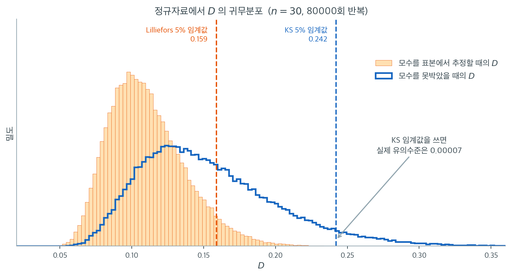

# Lilliefors 검정

## 개요

Lilliefors 검정은 귀무가설의 모수(평균과 분산)를 미리 지정하지 않고 자료에서 추정하는 흔한 상황을 위해 고안된 Kolmogorov-Smirnov 검정의 변형이다. 모수적 붓스트랩으로 KS 통계량의 귀무분포를 보정함으로써, 복합(composite) 정규성을 검정할 때 타당한 $p$값을 제공한다.

---

## 1. 표준 KS 검정의 문제

일표본 KS 통계량은

$$
D_n = \sup_x |F_n(x) - F_0(x)|.
$$

$F_0 = \mathcal{N}(\cdot\,; \mu, \sigma)$이고 $\mu$, $\sigma$를 $\hat{\mu} = \bar{X}$, $\hat{\sigma} = S$로 추정하면, 적합된 CDF $\hat{F}_0$이 미리 지정된 $F_0$보다 $F_n$에 체계적으로 더 가까워진다. 이는 $D_n$을 줄이고 $p$값을 부풀려 표준 KS 검정을 보수적으로(과소기각하게) 만든다.

---

## 2. 모수적 붓스트랩 알고리즘

Lilliefors 검정은 모수 추정을 포함한 상태에서 $D_n$의 귀무분포를 모의생성하여 이를 바로잡는다.

1. **관측 통계량을 계산한다.** 자료에서 $\hat{\mu}, \hat{\sigma}$를 적합하고

    $$
    D_{\text{obs}} = \sup_x |F_n(x) - \mathcal{N}(x;\, \hat{\mu}, \hat{\sigma})|
    $$

    를 계산한다.

2. **붓스트랩 반복.** $b = 1, \ldots, B$에 대해
    - $X_1^*, \ldots, X_n^* \overset{\text{iid}}{\sim} \mathcal{N}(\hat{\mu}, \hat{\sigma}^2)$를 모의생성한다.
    - $\hat{\mu}^* = \bar{X}^*$, $\hat{\sigma}^* = S^*$를 **다시 추정한다**.
    - $D_b^* = \sup_x |F_n^*(x) - \mathcal{N}(x;\, \hat{\mu}^*, \hat{\sigma}^*)|$를 계산한다.

3. **$p$값을 계산한다.**

    $$
    p \approx \frac{1}{B} \sum_{b=1}^{B} \mathbf{1}(D_b^* \geq D_{\text{obs}}).
    $$

<div class="exbox" markdown>

**보기 1.** <span class="diff easy" title="쉬움"></span> Lilliefors 검정 직접 구현. $\text{Lognormal}(0, 0.6^2)$에서 $n = 300$개를 뽑아 붓스트랩으로 귀무분포를 만들면 $D = 0.1391$, $p = 0.0000$이 나온다.

**(1)** 붓스트랩으로 얻은 귀무분포의 95백분위를 구하고, 릴리에포르 검정의 어림 임계값 $0.886/\sqrt{n}$과 견주시오. 둘이 맞는가.

**(2)** 붓스트랩 $p = 0.0000$으로 **정확히 말할 수 있는 것**은 무엇인가. 같은 자료에 `statsmodels`의 `lilliefors`와 샤피로–윌크를 걸면 각각 어떤 $p$값을 주며, 세 수를 어떻게 읽어야 하는가.

</div>

??? success "풀이"

    **(1) $0.0509$와 $0.0512$로 $0.6\%$ 안에서 맞는다.** 적합 정규분포 $\mathcal{N}(1.1025,\ 0.7348^2)$에서 $n = 300$짜리 표본을 1500번 뽑아 그때마다 같은 방식으로 $D$를 구하면

    | 백분위 | 90% | 95% | 99% | 최댓값 |
    |---|---|---|---|---|
    | $D^\ast$ | $0.0471$ | $0.0509$ | $0.0590$ | $0.0769$ |

    이다. 릴리에포르의 점근 어림은

    $$
    D_{\text{crit}}(0.05) \approx \frac{0.886}{\sqrt{n}} = \frac{0.886}{\sqrt{300}} = 0.0512
    $$

    이고 붓스트랩이 준 $0.0509$와 차이가 $0.6\%$에 지나지 않는다. **모수를 추정했을 때의 귀무분포를 표에서 찾는 것과 모의실험으로 직접 만드는 것이 같은 답을 준다**는 확인이다. 붓스트랩 쪽이 더 번거롭지만, 표가 없는 상황(예: 정규가 아닌 다른 분포족, 또는 결측·절단이 섞인 자료)에서도 쓸 수 있다는 것이 장점이다.

    비교를 위해 적어 두면, 모수를 **못박았을 때**의 KS 임계값은 $1.36/\sqrt{n} = 0.0785$다. 추정했을 때의 $0.0512$보다 $53\%$ 크다. 이 두 수의 차이가 곧 이 장에서 되풀이해 나온 "표준 KS 임계값을 추정된 모수에 쓰면 지나치게 보수적이 된다"는 말의 크기다.

    **(2) 정확히 말할 수 있는 것은 $p < 1/1500 = 0.000667$뿐이다.** 관측값 $D = 0.1391$은 붓스트랩 귀무분포의 최댓값 $0.0769$보다도 **$1.81$배** 크고, 95백분위 $0.0509$의 $2.73$배다. 1500번 가운데 $D^\ast \ge D_{\text{obs}}$인 경우가 **하나도 없으므로** 경험적 비율이 $0/1500 = 0$이 되는데, 이것은 "확률이 0"이라는 뜻이 아니라 **붓스트랩의 분해능이 거기까지**라는 뜻이다. $B = 1500$으로는 $1/1500$보다 작은 $p$값을 구별할 수 없다.

    같은 자료에 다른 방법을 걸면

    | 방법 | $p$값 | 그 수의 정체 |
    |---|---|---|
    | 붓스트랩 ($B = 1500$) | $0.0000$ | 분해능 바닥. 뜻은 $p < 6.7\times10^{-4}$ |
    | `statsmodels` `lilliefors` | $0.001$ | 내장 근사표의 바닥값 |
    | 샤피로–윌크 | $4.65\times10^{-21}$ | 실제 근사 $p$값 |

    이다. **앞의 두 수는 $p$값이 아니라 바닥이다.** `lilliefors`가 돌려주는 $0.001$을 "천 번에 한 번"으로 읽으면 안 된다. 그 함수의 표가 거기서 끝나기 때문에 나온 수이고, 실제 증거는 훨씬 강하다. 샤피로–윌크의 $4.65\times10^{-21}$이 그것을 보여 준다.

    보고할 때는 **$p$값 대신 통계량과 임계값을 적는 것**이 정직하다. "$D = 0.1391$, 5% 임계값 $0.0512$, 곧 임계값의 $2.7$배"가 "$p = 0.001$"보다 정확한 진술이다. 분해능 바닥에 닿았을 때는 $B$를 늘리거나(계산이 $B$에 선형이므로 $10^6$까지는 어렵지 않다) 애초에 $p$값에 매달리지 않는 편이 낫다.

    ```python
    import numpy as np
    from scipy import stats

    def ks_stat_fitted_normal(x):
        """자료에서 추정한 정규분포와의 KS 통계량을 구한다."""
        x = np.asarray(x, dtype=float)
        mu, sd = x.mean(), x.std(ddof=1)
        D, _ = stats.kstest(x, 'norm', args=(mu, sd))
        return float(D), float(mu), float(sd)

    def lilliefors_normal_bootstrap(x, B=2000, seed=0):
        """Lilliefors 검정을 모의실험으로 직접 구현한다.

        모수를 자료에서 추정하면 KS 통계량의 귀무분포가 달라진다. 표를 찾는
        대신, 추정된 모수의 정규분포에서 같은 크기의 표본을 B 번 뽑아
        그때마다 같은 방식으로 D 를 구하면 그 귀무분포를 직접 얻을 수 있다.
        관측된 D 가 그중 몇 번째로 큰지가 곧 p-값이다.
        """
        x = np.asarray(x, dtype=float)
        n = x.size
        D_obs, mu, sd = ks_stat_fitted_normal(x)

        rng = np.random.default_rng(seed)
        D_star = np.empty(B)
        for b in range(B):
            xb = rng.normal(mu, sd, size=n)
            D_star[b], _, _ = ks_stat_fitted_normal(xb)

        p_boot = float(np.mean(D_star >= D_obs))
        return D_obs, p_boot, mu, sd

    # 로그정규 자료이므로 기각되어야 한다.
    rng = np.random.default_rng(1)
    x = rng.lognormal(0.0, 0.6, size=300)

    D, p, mu, sd = lilliefors_normal_bootstrap(x, B=1500, seed=7)
    print(f"Fitted Normal: mu = {mu:.4f}, sd = {sd:.4f}")
    print(f"Lilliefors KS D = {D:.4f}, bootstrap p = {p:.4f}")
    if p < 0.05:
        print("=> Reject normality at alpha = 0.05.")
    else:
        print("=> Fail to reject normality at alpha = 0.05.")
    ```

    출력:

    ```text
    Fitted Normal: mu = 1.1025, sd = 0.7348
    Lilliefors KS D = 0.1391, bootstrap p = 0.0000
    => Reject normality at alpha = 0.05.
    ```

    붓스트랩 $p$값이 정확히 0이라는 것은 1,500번의 붓스트랩 표본 중 $D_{\text{obs}} = 0.1391$ 이상을 낸 것이 하나도 없었다는 뜻이다. 붓스트랩 귀무분포의 95백분위수는 $0.0509$로, 관측값이 그 세 배에 가깝다. 정확한 $p$값을 알 수는 없고 $p < 1/1500$이라고만 말할 수 있다.

    귀무분포의 분위수와 세 방법의 $p$값을 함께 구한다.

    ```python
    import numpy as np
    from scipy import stats
    from statsmodels.stats.diagnostic import lilliefors


    def ks_stat_fitted_normal(x):
        x = np.asarray(x, dtype=float)
        mu, sd = x.mean(), x.std(ddof=1)
        D, _ = stats.kstest(x, 'norm', args=(mu, sd))
        return float(D)


    rng = np.random.default_rng(1)
    x = rng.lognormal(0.0, 0.6, size=300)
    n = x.size
    D_obs = ks_stat_fitted_normal(x)
    mu, sd = x.mean(), x.std(ddof=1)
    print(f"Fitted Normal: mu = {mu:.4f}, sd = {sd:.4f}")
    print(f"D_obs = {D_obs:.4f}")

    # 붓스트랩 귀무분포 (위 코드와 같은 씨앗·반복수)
    rg = np.random.default_rng(7)
    B = 1500
    Ds = np.array([ks_stat_fitted_normal(rg.normal(mu, sd, size=n)) for _ in range(B)])
    q = np.percentile(Ds, [90, 95, 99])
    print(f"\n붓스트랩 귀무분포 (B = {B})")
    print(f"  90 백분위 {q[0]:.4f},  95 백분위 {q[1]:.4f},  99 백분위 {q[2]:.4f}")
    print(f"  최댓값 {Ds.max():.4f}   (D_obs 의 {D_obs / Ds.max():.2f} 배)")
    print(f"  D* >= D_obs 인 횟수 = {np.sum(Ds >= D_obs)} / {B}")
    print(f"  릴리에포르 어림 임계값 0.886/sqrt(n) = {0.886 / np.sqrt(n):.4f}")
    print(f"  D_obs / 95 백분위 = {D_obs / q[1]:.2f}")

    print(f"\nstatsmodels lilliefors: D = {lilliefors(x)[0]:.4f}, p = {lilliefors(x)[1]:.4g}")
    print(f"샤피로-윌크:            W = {stats.shapiro(x)[0]:.4f}, p = {stats.shapiro(x)[1]:.4g}")
    print(f"\n붓스트랩이 말할 수 있는 상한: p < 1/B = {1 / B:.6f}")
    ```

    출력:

    ```text
    Fitted Normal: mu = 1.1025, sd = 0.7348
    D_obs = 0.1391

    붓스트랩 귀무분포 (B = 1500)
      90 백분위 0.0471,  95 백분위 0.0509,  99 백분위 0.0590
      최댓값 0.0769   (D_obs 의 1.81 배)
      D* >= D_obs 인 횟수 = 0 / 1500
      릴리에포르 어림 임계값 0.886/sqrt(n) = 0.0512
      D_obs / 95 백분위 = 2.73

    statsmodels lilliefors: D = 0.1391, p = 0.001
    샤피로-윌크:            W = 0.7487, p = 4.651e-21

    붓스트랩이 말할 수 있는 상한: p < 1/B = 0.000667
    ```

    붓스트랩이 만든 임계값 $0.0509$와 점근 어림 $0.886/\sqrt{n} = 0.0512$가 맞아떨어지므로 **구현이 옳다**고 믿을 수 있다. 그리고 세 $p$값 가운데 둘($0.0000$과 $0.001$)이 서로 다른 바닥값이라는 사실이 (2)의 요점이다. $\square$

---

## 3. 붓스트랩이 작동하는 이유

붓스트랩은 원자료에 적용한 것과 *같은* 절차로 표본을 생성한다. 정규분포에서 뽑고, 모수를 다시 추정하고, KS 통계량을 계산한다. 이렇게 하면 편향의 원천(모수 추정이 $D$를 줄이는 것)이 기준분포에도 그대로 복제되어 올바르게 보정된 임계값이 만들어진다.

핵심은 2단계에서 모수를 **다시 추정**하는 것이다. 이 단계를 빠뜨리고 원래의 $\hat{\mu}, \hat{\sigma}$를 고정한 채 쓰면 표준 KS 검정으로 되돌아가 버린다.

---

## 4. 두 귀무분포는 얼마나 다른가

보정이 필요한 이유는 $D$의 귀무분포가 **모수를 추정하는 순간 다른 분포로 바뀌기** 때문이다. 아래 그림은 $N(0,1)$에서 $n = 30$짜리 표본을 80000번 뽑아 두 가지 방식으로 $D$를 계산한 결과다. 파란 윤곽선은 모수를 $N(0,1)$로 못박았을 때(Kolmogorov 분포에 해당), 주황 히스토그램은 같은 표본에서 $\bar{X}$와 $S$를 추정해 꽂아 넣었을 때이다.



두 분포는 위치도 모양도 다르다. 주황 분포는 왼쪽으로 뚜렷이 이동해 있고 폭도 훨씬 좁다. 그 결과 5% 임계값이 $0.242$에서 $0.159$로 내려간다. Lilliefors 검정이 표로 제공하는 임계값, 또는 앞의 붓스트랩이 만들어 내는 임계값이 바로 이 $0.159$이다.

만약 추정된 모수로 계산한 $D$를 못박은 경우의 임계값 $0.242$와 비교하면 어떻게 될까. 그림의 화살표가 가리키는 자리다. 주황 분포에서 $0.242$를 넘는 표본은 80000개 중 여섯 개, 곧 실제 유의수준이 $0.00007$이다. **5%라고 약속한 검정이 실제로는 0.01%에도 못 미치는 수준으로 굴러간다.** 제1종 오류를 이렇게까지 아끼는 대가는 검정력이고, 「형식적 정규성 검정 모음」 쪽의 표에서 Lilliefors가 이미 가장 약한 검정이었다는 점을 떠올리면 여기서 더 잃을 여유가 없다.

이 그림은 또 하나를 알려준다. 보정의 방향이 항상 같다는 것이다. 추정은 $D$를 줄이고, 줄어든 $D$에는 더 낮은 임계값을 써야 한다. 그러니 실수로 순진한 KS를 쓴 사람은 **결코 과잉기각하지 않는다.** 오히려 정규가 아닌 자료를 정규라고 통과시킨다. 조용히 틀리는 쪽이라 더 위험한 실수다.

---

## 5. 해석

대수정규 예에서 Lilliefors 검정은 정규성을 기각하여($p \approx 0$) 오른쪽 치우침을 올바르게 식별한다.

다만 이 예에서는 이탈이 워낙 커서 모수를 추정한 순진한 KS 검정도 $p = 1.6 \times 10^{-5}$로 기각한다. 곧 **Lilliefors 보정이 결론을 바꾸는 것은 경계선 근처에서다.** 신호가 압도적이면 어느 쪽을 쓰든 기각한다. 보정이 결정적으로 중요한 이유는 결론이 뒤집히는 사례가 있어서라기보다, 순진한 검정의 제1종 오류율이 명목값과 전혀 다르기 때문이다(연습문제 2 참조).

---

## 연습문제

<div class="drillbox" markdown>

**연습문제 1.** <span class="diff med" title="중간"></span> 표준정규 관측값 $n = 200$개를 생성하라. 순진한 KS 검정($\hat{\mu}, \hat{\sigma}$ 추정)과 Lilliefors 붓스트랩 검정을 모두 수행하라. 두 $p$값을 비교하라.

</div>

??? success "풀이"

    ```python
    import numpy as np
    from scipy import stats

    rng = np.random.default_rng(0)
    x = rng.normal(0, 1, size=200)

    mu_hat, sd_hat = x.mean(), x.std(ddof=1)
    D_naive, p_naive = stats.kstest(x, 'norm', args=(mu_hat, sd_hat))

    # 붓스트랩으로 구한 Lilliefors 기각값
    B = 2000
    D_obs = D_naive
    D_star = np.empty(B)
    for b in range(B):
        xb = rng.normal(mu_hat, sd_hat, size=200)
        mu_b, sd_b = xb.mean(), xb.std(ddof=1)
        D_star[b], _ = stats.kstest(xb, 'norm', args=(mu_b, sd_b))
    p_boot = np.mean(D_star >= D_obs)

    print(f"D = {D_obs:.4f}")
    print(f"Naive KS p-value:       {p_naive:.4f}")
    print(f"Lilliefors bootstrap p: {p_boot:.4f}")
    ```

    출력:

    ```text
    D = 0.0306
    Naive KS p-value:       0.9892
    Lilliefors bootstrap p: 0.9345
    ```

    같은 $D = 0.0306$에 대해 순진한 $p$값이 $0.989$로 붓스트랩 $p$값 $0.935$보다 크다. 표준 KS 임계값이 모수 추정을 고려하지 않기 때문이다.

    이 표본에서는 둘 다 0.05를 크게 넘어 결론이 같다. 편향의 방향을 보여줄 뿐 실질적 차이는 없다. 편향의 실제 규모는 $p$값이 아니라 검정의 크기를 보아야 드러난다(연습문제 2). $\square$

<div class="drillbox" markdown>

**연습문제 2.** <span class="diff med" title="중간"></span> $n = 100$에 대해 $\alpha = 0.05$에서 Lilliefors 붓스트랩 검정($B = 500$)의 경험적 크기를 추정하는 몬테카를로 실험을 5,000회 반복으로 수행하라. 순진한 KS 검정과 비교하라.

</div>

??? success "풀이"

    ```python
    import numpy as np
    from scipy import stats

    rng = np.random.default_rng(0)
    n, reps, alpha, B = 100, 5000, 0.05, 500

    rej_naive, rej_boot = 0, 0
    for _ in range(reps):
        x = rng.normal(0, 1, size=n)
        mu, sd = x.mean(), x.std(ddof=1)
        D, p_naive = stats.kstest(x, 'norm', args=(mu, sd))
        if p_naive < alpha:
            rej_naive += 1

        D_star = np.empty(B)
        for b in range(B):
            xb = rng.normal(mu, sd, size=n)
            mu_b, sd_b = xb.mean(), xb.std(ddof=1)
            D_star[b], _ = stats.kstest(xb, 'norm', args=(mu_b, sd_b))
        if np.mean(D_star >= D) < alpha:
            rej_boot += 1

    print(f"Naive KS size:   {rej_naive / reps:.4f}")
    print(f"Lilliefors size: {rej_boot / reps:.4f}")
    ```

    출력:

    ```text
    Naive KS size:   0.0002
    Lilliefors size: 0.0484
    ```

    (이 실험은 5,000 × 500 = 250만 번의 KS 계산을 수행하므로 시간이 꽤 걸린다.)

    결과가 놀랍다. 순진한 KS 검정이 5,000번 가운데 **단 한 번** 기각했다. 명목값 $0.05$라면 약 $250$번을 기각했어야 한다.

    **이 자리의 수는 반복 횟수로 묶어 읽어야 한다.** 기각이 한 번뿐이면 비율 $0.0002$를 소수점 네 자리까지 믿을 수 없다. 크기가 이렇게 작을 때 $5{,}000$번으로는 점추정이 아니라 **상한**만 얻는다. 기각 $1$회에 대한 $95\%$ 클로퍼–피어슨 상한은 약 $0.0009$이므로, 정직한 진술은 "크기가 $0.001$ 아래다" 이지 "정확히 $0$이다" 가 아니다. 씨앗을 바꾸면 $0$회나 $2$회가 나오며 그때마다 $0.0000$, $0.0004$로 적히게 된다. **결론을 바꾸지 않는 흔들림이지만, 적는 방식은 바꾸어야 한다.**

    이는 "0.01~0.02 정도로 보수적"인 수준을 훨씬 넘어선다. 모수를 추정한 KS 검정은 사실상 **절대 기각하지 않는다**. 이유는 임계값의 차이가 크기 때문이다. $n = 100$에서 표준 KS의 5% 임계값은 $1.358/\sqrt{100} = 0.136$인 반면, 모수를 추정했을 때 $D$의 참 95백분위수는 $0.0892$에 불과하다. 임계값이 참값의 1.5배이니 기각이 일어날 리 없다.

    Lilliefors 붓스트랩의 크기 $0.0484$는 명목값 $0.05$와 잘 맞는다(몬테카를로 표준오차 $0.0031$). 보정이 올바르게 작동함을 확인해 준다.

    실무적 결론: **모수를 추정한 뒤 표준 KS 검정을 쓰는 것은 검정을 하지 않는 것과 거의 같다.** 반드시 Lilliefors 보정을 쓰거나 Shapiro-Wilk / Anderson-Darling 같은 다른 검정을 쓰라. $\square$

<div class="drillbox" markdown>

**연습문제 3.** <span class="diff med" title="중간"></span> Lilliefors $p$값의 해상도가 $1/B$인 이유를 설명하라. $p = 0.04$와 $p = 0.06$을 안정적으로 구별하려면 $B$가 얼마나 커야 하는가?

</div>

??? success "풀이"

    붓스트랩 $p$값은 $\hat{p} = \frac{1}{B}\sum_{b=1}^B \mathbf{1}(D_b^* \geq D_{\text{obs}})$이므로 $\{0, 1/B, 2/B, \ldots, 1\}$의 값만 가질 수 있다. 지시함수의 합이 정수이기 때문이다.

    귀무가설 아래에서 표준오차는 $\sqrt{\hat{p}(1-\hat{p})/B}$이다. $p = 0.04$와 $p = 0.06$을 구별하려면 표준오차가 $0.01$보다 훨씬 작아야 한다. $p \approx 0.05$에서 $\text{SE} = \sqrt{0.05 \times 0.95/B}$이므로 $\text{SE} < 0.005$를 요구하면

    $$
    \frac{0.0475}{B} < 0.000025 \quad \Longrightarrow \quad B > 1900.
    $$

    실무에서는 5% 문턱 근처의 신뢰할 만한 추론을 위해 $B \geq 2000$이 합리적인 최솟값이다. 문턱에서 더 멀리 떨어진 결정만 필요하다면 $B = 500$으로도 충분하다(연습문제 2에서 그렇게 썼다). $\square$

<div class="drillbox" markdown>

**연습문제 4.** <span class="diff med" title="중간"></span> 정규성 대신 지수성을 검정하도록 Lilliefors 붓스트랩을 수정하라. 알고리즘에 필요한 변경을 개략적으로 서술하라.

</div>

??? success "풀이"

    변경 사항은 다음과 같다.

    1. **모수 추정:** $\hat{\mu}, \hat{\sigma}$를 지수 비율의 최대가능도추정량 $\hat{\lambda} = 1/\bar{X}$로 바꾼다.
    2. **관측 통계량:** $D_{\text{obs}} = \sup_x |F_n(x) - (1 - e^{-\hat{\lambda} x})|$를 계산한다.
    3. **붓스트랩 반복:** $X_b^* \sim \text{Exp}(\hat{\lambda})$를 모의생성하고 $\hat{\lambda}_b^* = 1/\bar{X}_b^*$로 다시 추정한 뒤, 다시 적합된 지수 CDF에 대해 $D_b^*$를 계산한다.
    4. **$p$값:** 이전과 같이 $\hat{p} = \frac{1}{B}\sum \mathbf{1}(D_b^* \geq D_{\text{obs}})$.

    핵심 원리는 동일하다. 붓스트랩이 모수 추정 단계를 복제하므로 $D$의 기준분포가 올바르게 보정된다.

    한 가지 편리한 점이 있다. 정규의 경우와 마찬가지로 지수의 경우에도 $D$의 귀무분포가 **모수에 의존하지 않는다**. 지수족이 척도족이고 $\hat{\lambda}$가 척도동변 추정량이기 때문이다. 따라서 $\hat{\lambda} = 1$로 두고 임계값 표를 한 번만 만들어 두면 모든 자료에 재사용할 수 있다. $\square$

<div class="drillbox" markdown>

**연습문제 5.** <span class="diff hard" title="어려움"></span> 고정된 자료에 대해 $B \to \infty$일 때 붓스트랩 $p$값 $\hat{p}_B$가 참 $p$값으로 수렴함을 증명하라.

</div>

??? success "풀이"

    자료가 고정되어 있으면 $D_{\text{obs}}$는 상수이다. 각 붓스트랩 추출은 $D_b^*$를 만들어 내고, $\mathbf{1}(D_b^* \geq D_{\text{obs}})$는 성공확률

    $$
    p^* = P^*(D^* \geq D_{\text{obs}})
    $$

    를 갖는 베르누이 확률변수이다. 여기서 $P^*$는 붓스트랩 분포($\mathcal{N}(\hat{\mu}, \hat{\sigma}^2)$에서의 표집)를 나타낸다. 붓스트랩 $p$값은

    $$
    \hat{p}_B = \frac{1}{B}\sum_{b=1}^{B} \mathbf{1}(D_b^* \geq D_{\text{obs}}).
    $$

    자료에 조건부로 $D_b^*$들이 i.i.d.이므로 강대수의 법칙에 의해 $B \to \infty$일 때 $\hat{p}_B \xrightarrow{\text{a.s.}} p^*$이다. 여기서 $p^*$는 적합된 귀무분포 아래의 정확한 Lilliefors $p$값이다.

    중심극한정리에 의해 수렴속도는 $O(1/\sqrt{B})$이고 $\hat{p}_B$의 표준오차는 $\sqrt{p^*(1-p^*)/B}$이다.

    한 가지 주의할 점을 덧붙인다. 이 수렴은 **자료를 고정한 조건부 수렴**이다. $B \to \infty$로 보내도 $\hat{\mu}, \hat{\sigma}$가 참값이 아니라는 데서 오는 오차는 사라지지 않는다. 그러나 정규 위치-척도족에서 $D$의 귀무분포가 $\mu, \sigma$에 의존하지 않으므로(척도동변성), 이 오차는 실제로 0이다. 그래서 Lilliefors 검정이 유한표본에서도 정확한 크기를 갖는다. $\square$

---

## 정리하며

릴리포스는 **모수를 추정한 상황의 KS 검정**이다.

- **통계량은 KS 와 같다.** 다른 것은 **귀무분포**뿐이며, 모수적 부트스트랩으로 보정한다.
- **절차가 명료하다.** 적합된 정규분포에서 같은 크기의 표본을 반복 생성하고, 매번 모수를 다시 추정해 KS 통계량을 계산해 귀무분포를 만든다.
- **"모수를 추정했다"는 사실이 분포를 바꾼다는 것**이 핵심 통찰이며, 이 아이디어는 다른 복합가설 검정에도 그대로 쓰인다.
- **`statsmodels.stats.diagnostic.lilliefors` 가 구현이다.** `scipy` 의 `kstest` 를 잘못 쓰는 대신 이쪽을 써야 한다.
- **검정력은 여전히 샤피로–윌크보다 낮다.** 타당성은 확보되지만 최강은 아니다.

다음 절 **Anderson-Darling 검정 (코드)** 로 넘어간다.
