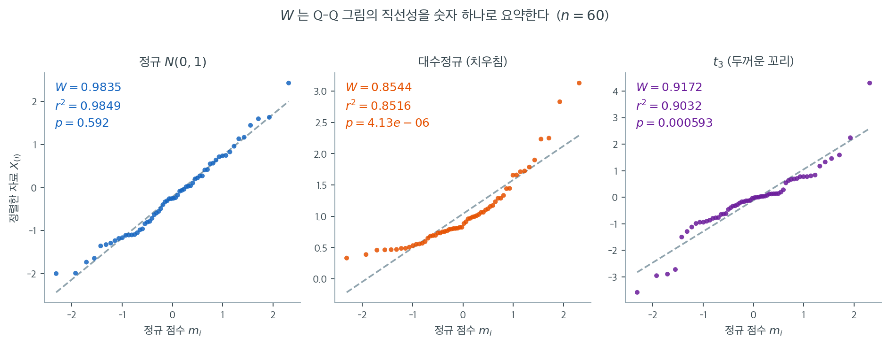

# Shapiro-Wilk 검정

## 개요

Shapiro-Wilk 검정은 자료의 정규성을 평가하는 널리 쓰이는 방법이다. 검정통계량과 그에 대응하는 $p$값을 계산하여 표본자료가 정규분포를 따르는 모집단에서 왔는지 판정한다.

### 가설

- **귀무가설** ($H_0$): 자료가 정규분포를 따른다.
- **대립가설** ($H_1$): 자료가 정규분포를 따르지 않는다.

---

## 1. 검정통계량 W의 계산

Shapiro-Wilk 검정통계량 $W$는 다음 단계로 계산한다.

1. **자료 정렬**: $X_1, X_2, \dots, X_n$을 오름차순으로 정렬하여 $X_{(1)} \leq X_{(2)} \leq \dots \leq X_{(n)}$을 얻는다.

2. **기댓값**: 표준정규분포에서 크기 $n$인 표본의 순서통계량의 기댓값 $m_i$를 계산한다. 이 값들의 벡터를 $\mathbf{m}^\top = [m_1, m_2, \dots, m_n]$이라 하자.

3. **공분산행렬**: 정규분포 순서통계량의 공분산행렬 $\Sigma$를 이용해 가중치 $a_i$를 만든다. 이 가중치들은 정규성 이탈에 대한 검정의 민감도를 최적화하도록 계산된다. 가중치 벡터를 $\mathbf{a}^\top = [a_1, a_2, \dots, a_n]$이라 하면

    $$
    [a_1, a_2, \dots, a_n] = \frac{[m_1, m_2, \dots, m_n]\Sigma^{-1}}{\sqrt{[m_1, m_2, \dots, m_n]\Sigma^{-1}\Sigma^{-1}[m_1, m_2, \dots, m_n]^\top}}
    $$

4. **검정통계량 $W$**: 검정통계량 $W$를 다음과 같이 계산한다.

    $$
    W = \frac{\left( \sum_{i=1}^{n} a_i X_{(i)} \right)^2}{\sum_{i=1}^{n} (X_i - \bar{X})^2}
    $$

    여기서

    - $X_{(i)}$는 $i$번째로 정렬된 자료점,
    - $a_i$는 벡터 $\mathbf{a}$의 대응하는 가중치,
    - $\bar{X}$는 표본평균이다.

    분자는 정렬된 표본의 선형결합을 제곱한 것이고 분모는 표본자료의 전체 변동이다.

---

## 2. W를 Q-Q 그림으로 읽기

위 공식만 보면 $W$가 무엇을 재는지 감이 잘 오지 않는다. 그러나 정체는 단순하다. 정규 점수 $m_i$를 가로축에, 정렬한 자료 $X_{(i)}$를 세로축에 놓은 산점도 — 곧 Q-Q 그림 — 의 **직선성**이다. 분자의 $\sum a_i X_{(i)}$는 자료를 정규 점수 방향으로 사영한 길이이고, 분모는 자료 전체의 길이이다. 둘의 비는 두 벡터가 이루는 각의 코사인 제곱, 곧 상관계수의 제곱에 다름 아니다.

아래 그림은 같은 $n = 60$으로 세 가지 모집단에서 뽑은 표본의 Q-Q 그림에 $W$와 상관계수 제곱 $r^2$을 나란히 적은 것이다.



정규 표본에서는 점들이 파선 주위에 붙어 있고 $W = 0.9835$, $r^2 = 0.9849$로 두 값이 거의 같다. 대수정규 표본은 오른쪽 위가 위로 휘어 올라가는 전형적인 치우침 패턴을 보이고 $W = 0.8544$, $r^2 = 0.8516$으로 함께 떨어진다. $t_3$ 표본은 가운데가 직선에 잘 붙어 있는데도 양끝이 각각 아래와 위로 벌어지는 S자를 그리며 $W = 0.9172$, $r^2 = 0.9032$가 된다.

세 경우 모두 $W$와 $r^2$이 소수 둘째 자리까지 일치한다. 정확히 같지는 않다. $r^2$은 정규 점수 $m_i$를 그대로 가중치로 쓰는 반면 $W$는 순서통계량의 공분산 $\Sigma$까지 반영한 $a_i$를 쓰기 때문이다. 그 보정이 $W$를 약간 더 예민하게 만들지만, 실무적 직관으로는 **"$W$는 Q-Q 그림이 직선에서 얼마나 벗어났는지를 0과 1 사이 숫자 하나로 요약한 것"**으로 읽어도 충분하다.

이 관점은 $W$의 두 가지 성질도 설명해 준다. 첫째, 자료에 상수를 더하거나 곱해도 $W$는 변하지 않는다. 산점도의 직선성이 위치와 척도에 영향받지 않기 때문이다. 둘째, $W$는 어떤 방식으로 벗어났는지를 알려주지 못한다. 치우침이든 두꺼운 꼬리든 결국 "직선에서 벗어남" 하나로 뭉뚱그려지기 때문이다. 위 그림에서 $0.8544$와 $0.9172$가 전혀 다른 모양에서 나왔다는 사실이 그 한계를 그대로 보여준다.

---

## 3. p값 유도

검정통계량 $W$를 계산한 뒤, 정규성이라는 귀무가설 아래에서의 $W$ 분포와 비교하여 $p$값을 얻는다. $p$값은 귀무가설이 참이라는 가정 아래에서 $W$만큼 극단적인 검정통계량을 관측할 확률이다.

- $p$값이 작으면(예: $\alpha = 0.05$ 미만) 귀무가설을 기각한다. 자료가 정규분포를 따르지 않음을 시사한다.
- $p$값이 크면($\alpha$ 이상이면) 귀무가설을 기각하지 못한다.

### 판정 규칙

- $p$값 $\leq \alpha$이면 $H_0$을 기각한다(자료가 정규분포를 따르지 않는다).
- $p$값 $> \alpha$이면 $H_0$을 기각하지 못한다(자료가 정규분포를 따를 수 있다).

<div class="exbox" markdown>

**보기 1.** <span class="diff easy" title="쉬움"></span> Shapiro-Wilk 검정. $\mathcal{N}(1, 10^2)$에서 $n = 1000$개를 뽑으면 $W = 0.9986$, $p = 0.5912$다.

**(1)** $W$가 위치와 척도에 불변임을 정의에서 보이시오. 가중치 $a_i$의 어떤 성질이 필요한가.

**(2)** "$W = 0.9986$이 1에 매우 가깝다"는 말에 정보가 있는가. $n = 1000$에서 $W$의 귀무분포를 모의실험으로 구해 **기각 경계가 되는 $W$**를 찾고, 관측값이 그 분포의 어디에 있는지 적으시오.

</div>

??? success "풀이"

    **(1) 분자와 분모가 모두 2차 동차이고, 상수항은 $\sum a_i = 0$으로 지워진다.** 통계량은

    $$
    W = \frac{\left(\sum_{i=1}^{n} a_i X_{(i)}\right)^2}{\sum_{i=1}^{n}(X_i - \bar X)^2}
    $$

    이다. $Y_i = cX_i + d$ ($c > 0$)로 옮기면 순서가 보존되므로 $Y_{(i)} = cX_{(i)} + d$이고

    $$
    \sum_i a_i Y_{(i)} = c\sum_i a_i X_{(i)} + d\sum_i a_i
    $$

    이다. **가중치 벡터 $a$는 반대칭이어서 $a_{n+1-i} = -a_i$이고 따라서 $\sum_i a_i = 0$이다.** 정규분포의 기대 순서통계량이 중앙에 대해 대칭이므로 거기서 유도되는 가중치도 그렇다. 그러므로 둘째 항이 사라지고 분자는 $c^2(\sum a_i X_{(i)})^2$이 된다. 분모도 $\sum(Y_i - \bar Y)^2 = c^2\sum(X_i - \bar X)^2$이니

    $$
    W(Y) = \frac{c^2(\sum a_i X_{(i)})^2}{c^2\sum(X_i - \bar X)^2} = W(X)
    $$

    로 $c$와 $d$가 완전히 약분된다. 씨앗을 고정하면 `normal(1, 10, 1000)`이 `normal(0, 1, 1000)`의 $10$배에 1을 더한 것이므로 두 $W$는 같아야 하는데, 실제로

    $$
    W = 0.9985554728235057
    $$

    가 양쪽에서 **같은 부동소수점 수**로 나오고 $p$값도 $0.5912267898687746$으로 같다. 앤더슨–달링에서는 $10^{-13}$의 반올림 차이가 남았는데 여기서는 그조차 없다. $W$의 계산 경로가 짧아서다.

    **(2) 정보가 없다. $W$는 정규 자료에서도 늘 1에 가깝다.** $n = 1000$인 표준정규 표본을 2만 번 뽑아 $W$의 귀무분포를 재면

    | 백분위 | 1% | 5% | 50% | 95% | 최솟값 | 최댓값 |
    |---|---|---|---|---|---|---|
    | $W$ | $0.99598$ | $0.99689$ | $0.99840$ | $0.99915$ | $0.98960$ | $0.99961$ |

    이다. **귀무분포 전체가 $[0.9896,\ 0.9996]$ 안에 들어 있다.** 5% 기각 경계가 $0.99689$이니 1에서 고작 $0.0031$ 떨어져 있을 뿐이다. 곧 $n = 1000$에서는 $W = 0.996$도 "1에 매우 가까운" 값이지만 기각된다. **소수점 셋째 자리까지 보고하면 판정에 필요한 정보가 통째로 사라진다.**

    관측값 $W = 0.99856$은 이 분포의 **60.6 백분위**다. 중앙값 $0.99840$보다 오히려 조금 크다. 그래서 $p = 0.591$이 나온다. 바꾸어 말하면 이 표본은 정규 자료 가운데서도 평균보다 약간 더 정규답게 나온 표본이다.

    실무적 결론은 **$W$ 값 자체를 읽지 말고 $p$값을 읽으라**는 것이다. $W$의 귀무분포는 $n$에 따라 크게 움직인다. 작은 표본에서는 $W = 0.95$도 흔하지만 $n = 1000$에서는 그런 값이 2만 번 중 한 번도 나오지 않는다. "$W$가 1에 가까우면 정규"라는 어림은 $n$을 모르면 쓸 수 없다.

    ```python
    import numpy as np
    from scipy import stats

    np.random.seed(0)

    # 위치와 척도를 바꿔도 결론은 같다. 검정이 묻는 것은 모양이다.
    # data = np.random.normal(0, 1, 1000)
    data = np.random.normal(1, 10, 1000)

    # W 는 1 에 가까울수록 정규에 가깝다. 순서통계량과 정규분포의 기대
    # 순서통계량이 얼마나 잘 맞는지를 재므로, Q-Q 그림을 숫자로 옮긴 셈이다.
    stat, p_value = stats.shapiro(data)
    print(f"Shapiro-Wilk Test: Statistic={stat:.4f}, p-value={p_value:.4f}")

    # 결과 해석
    alpha = 0.05
    if p_value <= alpha:
        print("Reject H_0: The data is not normally distributed.")
    else:
        print("Fail to reject H_0: The data is normally distributed.")
    ```

    출력:

    ```text
    Shapiro-Wilk Test: Statistic=0.9986, p-value=0.5912
    Fail to reject H_0: The data is normally distributed.
    ```

    불변성과 귀무분포를 함께 확인한다.

    ```python
    import numpy as np
    from scipy import stats

    np.random.seed(0)
    a = np.random.normal(1, 10, 1000)
    np.random.seed(0)
    b = np.random.normal(0, 1, 1000)
    print(f"a = 10b + 1 인가: {np.array_equal(a, 10 * b + 1)}")
    print(f"W(a) = {stats.shapiro(a)[0]:.16f},  p = {stats.shapiro(a)[1]:.16f}")
    print(f"W(b) = {stats.shapiro(b)[0]:.16f},  p = {stats.shapiro(b)[1]:.16f}")

    # n = 1000 에서 W 의 귀무분포. 기각 경계는 아래쪽 꼬리에 있다.
    rng = np.random.default_rng(5)
    R, n = 20_000, 1000
    W = np.array([stats.shapiro(rng.standard_normal(n))[0] for _ in range(R)])
    q = np.percentile(W, [1, 5, 50, 95])
    print(f"\nn = {n} 에서 W 의 귀무분포 (R = {R})")
    print(f"  1 백분위 {q[0]:.5f},  5 백분위 {q[1]:.5f},  중앙값 {q[2]:.5f},  95 백분위 {q[3]:.5f}")
    print(f"  관측 W = 0.99862 의 백분위 = {100 * np.mean(W < stats.shapiro(a)[0]):.1f}")
    print(f"  가장 작은 W = {W.min():.5f},  가장 큰 W = {W.max():.5f}")
    ```

    출력:

    ```text
    a = 10b + 1 인가: True
    W(a) = 0.9985554728235057,  p = 0.5912267898687746
    W(b) = 0.9985554728235057,  p = 0.5912267898687746

    n = 1000 에서 W 의 귀무분포 (R = 20000)
      1 백분위 0.99598,  5 백분위 0.99689,  중앙값 0.99840,  95 백분위 0.99915
      관측 W = 0.99862 의 백분위 = 60.6
      가장 작은 W = 0.98960,  가장 큰 W = 0.99961
    ```

    불변성이 마지막 비트까지 성립하고, 모의실험이 $W$ 값만으로는 판정할 수 없음을 수로 보여 준다. 자료를 실제로 정규분포에서 생성했으므로 기각하지 못하는 것이 기대한 결과이고, $W$가 중앙값보다 조금 큰 쪽에 떨어진 것도 그에 맞는다. $\square$

정리하면, Shapiro-Wilk 검정은 정렬된 표본자료와 미리 계산된 가중치로 검정통계량 $W$를 구해 자료가 정규분포에서 왔을 가능성을 판정한다. 특히 작거나 중간 크기의 표본에서 가장 강력한 정규성 검정 가운데 하나로 평가된다.

---

## 연습문제

<div class="drillbox" markdown>

**연습문제 1.** <span class="diff easy" title="쉬움"></span>
관측값 $n = 25$개에 대한 Shapiro-Wilk 검정에서 $W = 0.94$, $p = 0.15$를 얻었다. 이 결과를 해석하라.

</div>

??? success "풀이"
    $W = 0.94$이고 $p = 0.15 > 0.05$이므로 정규성이라는 귀무가설을 기각하지 못한다. 자료가 정규분포에서 왔다고 보아도 일관된다.

    $W = 0.94$는 1에 어느 정도 가까워 정규성에서의 이탈이 (있더라도) 작음을 시사한다. $n = 25$면 검정력이 중간 정도이므로 큰 이탈이었다면 탐지되었을 것이다. 다만 미묘한 비정규성은 놓칠 수 있다.

    언제나 그렇듯 Q-Q 그림으로 시각적 평가를 보완하라.

---

<div class="drillbox" markdown>

**연습문제 2.** <span class="diff med" title="중간"></span>
Shapiro-Wilk 검정통계량 $W$는 0과 1 사이의 값을 갖는다. 1에 가까운 값과 1에서 먼 값이 각각 무엇을 나타내는지 설명하라.

</div>

??? success "풀이"
    Shapiro-Wilk 통계량 $W$는 순서통계량이 기대되는 정규 순서통계량과 얼마나 잘 맞는지를 잰다. $W$가 1에 가까우면 자료가 정규성과 일관됨을(Q-Q 그림이 대략 선형임을) 나타낸다. $W$가 1보다 뚜렷이 작으면 정규성에서의 이탈을 나타낸다.

    형식적으로 $W = (\sum a_i x_{(i)})^2 / \sum(x_i - \bar{x})^2$이며 $a_i$는 정규분포에 대한 최적 계수이다. 분자는 순서통계량을 기대 정규점수에 회귀시킨 것을 제곱한 것이고 분모는 전체 변동이다. 자료가 정규이면 이 둘이 거의 같아 $W \approx 1$이 된다.

---

<div class="drillbox" markdown>

**연습문제 3.** <span class="diff med" title="중간"></span>
Shapiro-Wilk 검정이 작거나 중간 크기의 표본에서 가장 강력한 정규성 검정으로 평가되는 이유는 무엇인가?

</div>

??? success "풀이"
    Shapiro-Wilk 검정이 높은 검정력을 갖는 이유:

    1. **모든 순서통계량을 쓴다:** (최대 편차만 쓰는) KS 검정과 달리 Shapiro-Wilk는 정렬된 표본 전체를 선형결합으로 써서 정보를 최대한 뽑아낸다.
    2. **최적 가중치:** 계수 $a_i$가 정규 순서통계량의 기댓값과 공분산행렬에서 유도되어 검정통계량이 정규성 이탈에 최적으로 민감해진다.
    3. **상관에 기초:** $W$는 본질적으로 정렬된 자료와 기대 정규분위수 사이의 상관(Q-Q 상관)의 제곱이다. 자료가 "얼마나 정규처럼 보이는지"를 직접 잰다.

    모의실험 연구들은 $n < 50$에서 Shapiro-Wilk가 KS, Lilliefors, Anderson-Darling을 일관되게 앞서며 더 큰 $n$에서도 경쟁력이 있음을 보여준다.

---

<div class="drillbox" markdown>

**연습문제 4.** <span class="diff med" title="중간"></span>
Shapiro-Wilk 검정이 서로 다른 유형의 비정규성(치우침 대 두꺼운 꼬리)을 구별할 수 있는가? 이탈의 성격은 어떻게 판단하는가?

</div>

??? success "풀이"
    Shapiro-Wilk 검정은 **전방위적**이다. 정규성에서의 어떤 이탈이든 탐지하지만 그 유형은 알려주지 않는다. $p$값이 작다는 것은 자료가 정규가 아니라는 뜻이지, 문제가 치우침인지 두꺼운 꼬리인지 이봉성인지 다른 무엇인지는 말해 주지 않는다.

    이탈의 성격을 판단하려면

    1. **Q-Q 그림:** S자 곡선은 두껍거나 얇은 꼬리를, 비대칭 곡률은 치우침을, 계단이나 도약은 이산성이나 반올림을 나타낸다.
    2. **왜도와 첨도:** 표본왜도(비대칭)와 초과첨도(꼬리의 두꺼움)를 계산해 방향을 확인한다.
    3. **개별 검정:** `skewtest`와 `kurtosistest`를 따로 수행해 원인을 분리한다.
    4. **히스토그램:** 적률 기반 진단이 놓치는 다봉성을 눈으로 확인할 수 있다.

---

## 정리하며

샤피로–윌크는 **소·중 표본에서 가장 강력한** 정규성 검정으로 꼽힌다.

- **$W$ 는 0 과 1 사이다.** 정렬된 관측이 기대 정규 순서통계량과 얼마나 잘 맞는지를 재며, **$W$ 가 1 에 가까우면 정규와 일관**된다.
- **Q-Q 그림의 수치판이라 볼 수 있다.** 회귀적으로 보면 Q-Q 그림의 결정계수와 비슷한 양이며, 그래서 그림과 함께 읽기 좋다.
- **`scipy` 는 $n\le5000$ 으로 제한한다.** 그보다 크면 다른 검정을 쓰거나 표본을 나눠 본다.
- **여러 이탈 유형에 고루 강하다.** 치우침과 두꺼운 꼬리 모두 잘 잡아내는 옴니버스 검정이다.
- **대표본에서는 여전히 과민하다.** $n$ 이 수천이면 실질적으로 무시할 만한 이탈에도 기각하며, 이것이 다음 절 한계 논의의 핵심이다.

다음 절 **정규성 검정 개관**에서 이들을 비교한다.
