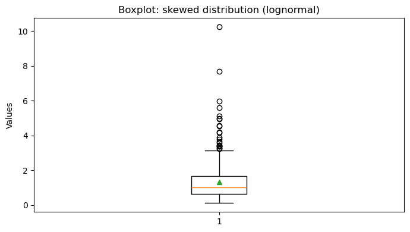
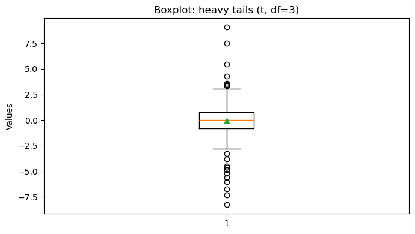
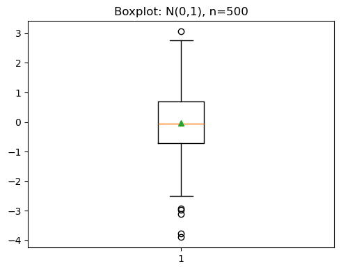
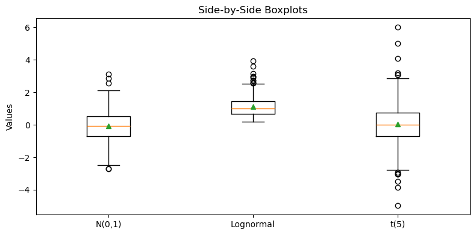
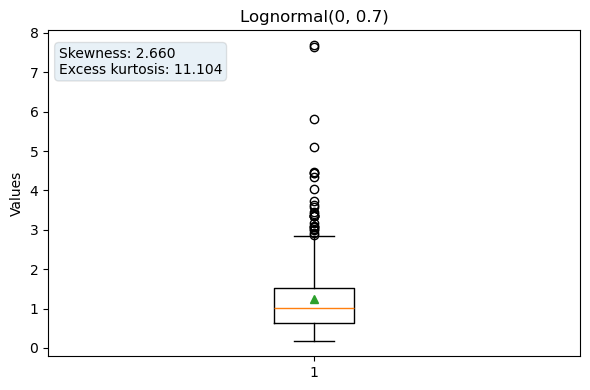

# 상자그림으로 보는 분포의 모양

## 개요

상자그림은 사분위수, 중앙값, 잠재적 이상점으로 분포를 요약하므로 치우침과 두꺼운 꼬리를 한눈에 탐지하는 데 효과적이다. 대칭이고 정규에 가까운 분포는 대략 대칭인 상자그림과 소수의 이상점을 만들어 내는 반면, 치우쳤거나 꼬리가 두꺼운 분포는 특징적인 시각적 흔적을 남긴다. 이 페이지는 대수정규(치우침)와 Student $t$(두꺼운 꼬리) 예를 써서 상자그림이 정규성 이탈을 어떻게 드러내는지 시연한다.

## 상자그림의 구조

표준 상자그림은 다섯 개의 요약통계량을 표시하고 이상점을 표시한다.

| 구성요소 | 정의 |
|---|---|
| 중앙값 선 | $Q_2$ (50백분위수) |
| 상자의 양 끝 | $Q_1$ (25백분위수) ~ $Q_3$ (75백분위수) |
| 사분위범위 | $\text{IQR} = Q_3 - Q_1$ |
| 아래 수염 | $Q_1 - 1.5\,\text{IQR}$ 이상인 관측값 중 최솟값 |
| 위 수염 | $Q_3 + 1.5\,\text{IQR}$ 이하인 관측값 중 최댓값 |
| 이상점 | 수염 바깥의 점들 |

정규분포 $\mathcal{N}(\mu, \sigma^2)$에서 이론적 사분위수는

$$
Q_1 = \mu - 0.6745\,\sigma, \qquad Q_3 = \mu + 0.6745\,\sigma,
$$

이므로 $\text{IQR} = 1.349\,\sigma$이다. 수염의 경계는 대략 $\mu \pm 2.698\,\sigma$까지 뻗는다. 정규성 아래에서 관측값이 수염 바깥에 놓일 확률은 근사적으로

$$
P(|X - \mu| > 2.698\,\sigma) \approx 0.007,
$$

이므로 관측값의 약 0.7%가 이상점으로 나타날 것으로 기대된다.

## 치우친 분포: 대수정규

$\text{Lognormal}(0, 0.7)$처럼 오른쪽으로 치우친 분포에서 자료가 오면 상자그림은 다음을 보인다.

- 중앙값이 상자의 아래쪽 끝에 더 가깝고,
- 위 수염이 아래 수염보다 훨씬 길며,
- 위 수염 위쪽에 이상점이 많이 나타난다.

<div class="codebox" markdown>

**예제 1.** 치우친 자료의 상자그림

```python
import numpy as np
import matplotlib.pyplot as plt

# 치우친 자료에서는 중앙값이 상자 가운데가 아니라 한쪽으로 쏠리고,
# 한쪽 수염만 길어진다. showmeans=True 로 평균을 함께 찍으면, 평균이
# 중앙값보다 긴 꼬리 쪽으로 끌려간 것도 눈에 보인다.
rng = np.random.default_rng(3)
x_skew = rng.lognormal(0.0, 0.7, size=400)

fig, ax = plt.subplots(figsize=(7, 4))
ax.boxplot(x_skew, showmeans=True)
ax.set_title("Boxplot: skewed distribution (lognormal)")
ax.set_ylabel("Values")
plt.tight_layout()
plt.show()
```



이 표본에서는 이상점 $21$개가 모두 **위쪽**에만 나타나고 아래쪽에는 하나도 없다. 표본왜도는 $3.06$이다(이론값 $2.89$). 이상점의 완전한 한쪽 쏠림이 치우침의 뚜렷한 신호이다.

</div>

## 꼬리가 두꺼운 분포: Student t

자유도가 낮은 Student $t$ 분포(예: $\nu = 3$)는 대칭이지만 정규분포보다 꼬리가 훨씬 두껍다. 상자그림은 다음을 보인다.

- 상자는 대략 대칭이지만(중앙값이 가운데에 있다),
- 이상점이 **양쪽**에 나타나며, 정규성 아래에서 기대되는 $\approx 0.7\%$보다 훨씬 많다.

<div class="codebox" markdown>

**예제 2.** 꼬리가 두꺼운 자료의 상자그림

```python
import numpy as np
import matplotlib.pyplot as plt

# 꼬리가 두꺼운 자료는 대칭이므로 상자는 반듯하다. 대신 수염 밖의 점이
# 유난히 많아진다. 정규자료라면 400개 중 서너 개가 보통이다.
rng = np.random.default_rng(3)
x_t = rng.standard_t(df=3, size=400)

fig, ax = plt.subplots(figsize=(7, 4))
ax.boxplot(x_t, showmeans=True)
ax.set_title("Boxplot: heavy tails (t, df=3)")
ax.set_ylabel("Values")
plt.tight_layout()
plt.show()
```



이 표본에서는 이상점이 $18$개 나타난다. 정규성 아래에서 기대되는 $0.007 \times 400 = 2.8$개의 여섯 배가 넘는다. 대수정규 예와 달리 이상점이 위아래로 나뉘어 나타난다는 점이 결정적 차이이다.

</div>

## 해석

상자그림은 정규성에 대한 빠른 진단을 제공한다.

- **대칭 상자 + 소수의 이상점:** 정규성과 일관된다.
- **비대칭 상자 또는 길이가 다른 수염:** 치우침을 시사한다.
- **대칭 상자 + 많은 이상점:** 두꺼운 꼬리(고첨)를 시사한다.

핵심은 **이상점의 개수와 좌우 배분을 함께** 보는 것이다. 개수만 보면 치우침과 두꺼운 꼬리를 구별할 수 없다.

상자그림만으로 정규성을 확정할 수는 없지만, 특히 여러 집단을 나란히 비교할 때 가치 있는 1차 선별 도구이다.

## 연습문제

<div class="drillbox" markdown>

**연습문제 1.** <span class="diff easy" title="쉬움"></span> 표준정규 관측값 $n = 500$개를 생성하고 상자그림을 만들어라. 이상점의 개수를 세어 이론적 기댓값 $0.007 \times 500 \approx 3.5$와 비교하라.

</div>

??? success "풀이"

    ```python
    import numpy as np
    import matplotlib.pyplot as plt

    rng = np.random.default_rng(0)
    x = rng.normal(0, 1, size=500)

    q1, q3 = np.percentile(x, [25, 75])
    iqr = q3 - q1
    outliers = np.sum((x < q1 - 1.5 * iqr) | (x > q3 + 1.5 * iqr))
    print(f"Outliers: {outliers} (expected ~3.5)")

    fig, ax = plt.subplots(figsize=(5, 4))
    ax.boxplot(x, showmeans=True)
    ax.set_title("Boxplot: N(0,1), n=500")
    plt.tight_layout()
    plt.show()
    ```

    출력:

    ```text
    Outliers: 6 (expected ~3.5)
    ```

    

    관측된 6개는 기댓값 3.5보다 크지만 놀랄 일이 아니다. 이 실험을 정규표본 3000개에 대해 반복하면 이상점 개수는 평균 $3.78$, 중앙값 $3$이고 5~95백분위수 범위가 $[1, 8]$이다.

    평균이 이론값 3.5보다 살짝 큰 이유는 수염 경계를 이론적 사분위수가 아니라 **표본** 사분위수로 계산하기 때문이다. 표본 IQR은 변동하고, 그것이 작게 나온 표본에서는 이상점이 많이 잡힌다. 이 비대칭적 효과가 평균을 조금 위로 밀어 올린다.

    실용적 함의: $n = 500$인 정규자료에서 이상점 6개는 정상 범위이다. 이상점 하나하나를 문제로 취급해서는 안 된다. $\square$

<div class="drillbox" markdown>

**연습문제 2.** <span class="diff med" title="중간"></span> (a) $\mathcal{N}(0,1)$, (b) $\text{Lognormal}(0, 0.5)$, (c) $t_5$에서 뽑은 크기 400인 표본들의 상자그림을 나란히 그려라. 시각적 차이를 기술하라.

</div>

??? success "풀이"

    ```python
    import numpy as np
    import matplotlib.pyplot as plt

    rng = np.random.default_rng(1)
    normal = rng.normal(0, 1, size=400)
    lognorm = rng.lognormal(0, 0.5, size=400)
    t5 = rng.standard_t(df=5, size=400)

    fig, ax = plt.subplots(figsize=(8, 4))
    # 상자 이름을 boxplot에 직접 주는 인자는 matplotlib 버전에 따라 다르다
    # (3.9 미만은 labels=, 3.9 이상은 tick_labels=). 축에 직접 주면 버전과 무관하다.
    ax.boxplot([normal, lognorm, t5], showmeans=True)
    ax.set_xticklabels(["N(0,1)", "Lognormal", "t(5)"])
    ax.set_title("Side-by-Side Boxplots")
    ax.set_ylabel("Values")
    plt.tight_layout()
    plt.show()
    ```

    

    정규 상자그림은 대칭이고 이상점이 매우 적다. 대수정규 상자그림은 위 수염이 길고 위쪽 이상점이 많다(오른쪽 치우침). $t_5$ 상자그림은 대칭이지만 양쪽에 이상점이 있어 더 두꺼운 꼬리를 반영한다.

    (참고: 상자 이름을 `boxplot`에 직접 주는 인자는 `matplotlib` 3.9에서 `labels=`가 `tick_labels=`로 바뀌었다. 위처럼 `ax.set_xticklabels`를 쓰면 버전에 상관없이 작동한다.) $\square$

<div class="drillbox" markdown>

**연습문제 3.** <span class="diff med" title="중간"></span> $\mathcal{N}(0,1)$에서 나온 관측값 하나가 상자그림의 수염 바깥에 놓일(즉 $Q_1 - 1.5\,\text{IQR}$ 아래이거나 $Q_3 + 1.5\,\text{IQR}$ 위일) 이론적 확률을 유도하라.

</div>

??? success "풀이"

    $X \sim \mathcal{N}(0,1)$에 대해 이론적 사분위수는 $Q_1 = \Phi^{-1}(0.25) = -0.6745$, $Q_3 = \Phi^{-1}(0.75) = 0.6745$이다. 따라서 $\text{IQR} = 1.3490$이고 수염 경계는

    $$
    Q_1 - 1.5 \times \text{IQR} = -0.6745 - 2.0235 = -2.6980,
    $$

    $$
    Q_3 + 1.5 \times \text{IQR} = 0.6745 + 2.0235 = 2.6980.
    $$

    바깥에 놓일 확률은

    $$
    P(|X| > 2.6980) = 2\,\Phi(-2.6980) = 2 \times 0.003488 = 0.006977 \approx 0.7\%.
    $$

    이 $0.7\%$가 Tukey의 $1.5 \times \text{IQR}$ 규칙이 관행이 된 이유이다. 정규자료에서 이상점을 드물게 표시하되, 아주 드물지는 않게 하는 절충점이다. $\square$

<div class="drillbox" markdown>

**연습문제 4.** <span class="diff med" title="중간"></span> $t_\nu$ 분포의 첨도는 $\nu > 4$일 때 $3 + 6/(\nu - 4)$이다. 이를 이용해 $t_3$ 상자그림에 정규 상자그림보다 훨씬 많은 이상점이 나타나는 이유를 설명하라.

</div>

??? success "풀이"

    첨도 공식 $\kappa = 3 + 6/(\nu - 4)$는 $\nu > 4$를 요구한다. $\nu = 3$에서는 첨도가 실제로 **무한대**이다(네 번째 적률이 존재하지 않는다).

    $t_3$ 밀도의 꼬리는 $|x|^{-(\nu+1)} = |x|^{-4}$로 감쇠한다. 거듭제곱 법칙이며, 정규분포의 지수적 감쇠 $e^{-x^2/2}$보다 훨씬 느리다. 따라서 극단값이 나올 확률이 훨씬 높다.

    결정적인 점은 **상자의 폭은 크게 다르지 않다**는 것이다. $t_3$의 사분위수는 $\pm 0.765$로 정규의 $\pm 0.674$와 비슷하므로, 표본 IQR로 계산한 수염 경계도 정규의 경우와 비슷하다. 그러나 꼬리 감쇠가 느리므로 그 경계를 훌쩍 넘어가는 관측값이 많아진다.

    이것이 상자그림에서 두꺼운 꼬리를 알아보는 방식이다. **상자는 정상인데 이상점만 유난히 많다**. 앞의 시연에서 $t_3$ 표본 400개 중 18개가 이상점으로 잡혔다(정규라면 약 2.8개). $\square$

<div class="drillbox" markdown>

**연습문제 5.** <span class="diff med" title="중간"></span> 자료 배열을 받아 상자그림을 만들고 표본왜도와 초과첨도를 주석으로 표시하는 함수를 작성하라. $\text{Lognormal}(0, 0.7)$ 자료로 시험하라.

</div>

??? success "풀이"

    ```python
    import numpy as np
    from scipy import stats
    import matplotlib.pyplot as plt

    def annotated_boxplot(data, title="Boxplot"):
        g1 = stats.skew(data, bias=False)
        g2 = stats.kurtosis(data, fisher=True, bias=False)

        fig, ax = plt.subplots(figsize=(6, 4))
        ax.boxplot(data, showmeans=True)
        ax.set_title(title)
        ax.set_ylabel("Values")
        ax.text(0.02, 0.95,
                f"Skewness: {g1:.3f}\nExcess kurtosis: {g2:.3f}",
                transform=ax.transAxes, verticalalignment='top',
                fontsize=10, bbox=dict(boxstyle='round', alpha=0.1))
        plt.tight_layout()
        plt.show()
        return g1, g2

    rng = np.random.default_rng(42)
    x = rng.lognormal(0, 0.7, size=400)
    g1, g2 = annotated_boxplot(x, title="Lognormal(0, 0.7)")
    print(f"Skewness = {g1:.3f}, Excess kurtosis = {g2:.3f}")
    ```

    출력:

    ```text
    Skewness = 2.660, Excess kurtosis = 11.104
    ```

    

    주석은 큰 양의 왜도 $2.66$과 큰 양의 초과첨도 $11.10$을 보여준다. 둘 다 비대칭 상자그림 및 위쪽에 몰린 많은 이상점과 일관된다.

    이론값과 비교해 보자. $\text{Lognormal}(0, \sigma^2)$의 왜도는 $(\omega + 2)\sqrt{\omega - 1}$이고 여기서 $\omega = e^{\sigma^2}$이다. $\sigma = 0.7$이면 $\omega = e^{0.49} = 1.632$이므로 왜도 $= 3.632 \times \sqrt{0.632} = 2.888$이다. 표본값 $2.66$이 이보다 작은 것은 예상된 일이다. **표본왜도는 치우친 분포에서 체계적으로 아래로 편향**되며, 특히 꼬리가 두꺼울수록 그렇다. 표본이 꼬리의 가장 극단적인 부분을 거의 담지 못하기 때문이다. $\square$

---

## 정리하며

분포의 종류마다 **상자그림에 남는 흔적**이 다르다.

- **로그정규(치우침).** 중앙값이 상자 아래쪽에 붙고 위쪽 수염이 길며, 위쪽에만 이상점이 몰린다.
- **Student $t$(두꺼운 꼬리).** 상자는 대칭인데 **양쪽에 이상점이 많다.** 상자 크기에 비해 이상점의 수가 많다는 것이 신호다.
- **두 흔적을 구별하는 것이 요점이다.** 치우침은 **비대칭**으로, 두꺼운 꼬리는 **이상점의 개수**로 나타난다.
- **정규 자료의 기준을 기억한다.** $1.5\times\text{IQR}$ 밖의 비율이 약 $0.7\%$ 이므로 $n=100$ 이면 한 점 이하가 보통이다. **다섯 개가 보이면 꼬리를 의심한다.**
- **$n$ 이 커지면 이상점 수도 늘어난다.** 비율이 일정하므로, 개수만 보지 말고 비율로 판단해야 한다.

다음 절 **금융 수익률의 Q-Q 그림**으로 넘어간다.
