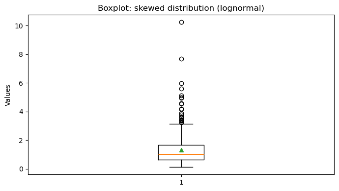
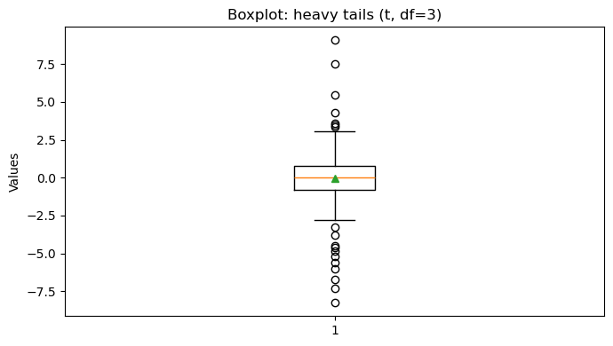
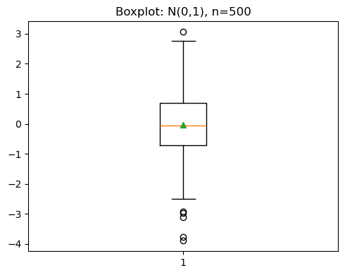
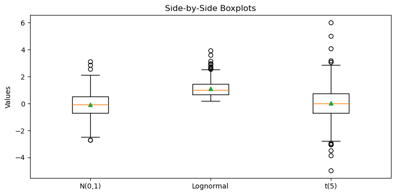
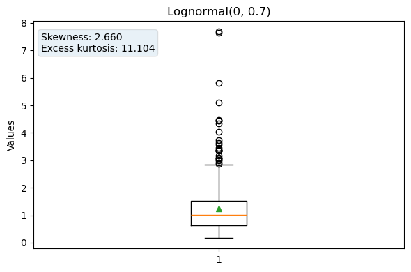

# 상자그림으로 보는 분포의 모양

## 개요

상자그림은 사분위수, 중앙값, 잠재적 이상점으로 분포를 요약하므로 치우침과 두꺼운 꼬리를 한눈에 탐지하는 데 효과적이다. 대칭이고 정규에 가까운 분포는 대략 대칭인 상자그림과 소수의 이상점을 만들어 내는 반면, 치우쳤거나 꼬리가 두꺼운 분포는 특징적인 시각적 흔적을 남긴다. 이 페이지는 대수정규(치우침)와 스튜던트 $t$(두꺼운 꼬리) 예를 써서 상자그림이 정규성 이탈을 어떻게 드러내는지 시연한다.

## 상자그림의 구조

표준 상자그림은 다섯 개의 요약통계량을 표시하고 이상점을 표시한다.

| 구성요소 | 정의 |
|---|---|
| 중앙값 선 | $Q_2$ (50백분위수) |
| 상자의 양 끝 | $Q_1$ (25백분위수) ~ $Q_3$ (75백분위수) |
| 사분위범위 | $\text{IQR} = Q_3 - Q_1$ |
| 아래 수염 | $Q_1 - 1.5\,\text{IQR}$ 이상인 관측값 중 최솟값 |
| 위 수염 | $Q_3 + 1.5\,\text{IQR}$ 이하인 관측값 중 최댓값 |
| 이상점 | 수염 바깥의 점들 |

정규분포 $\mathcal{N}(\mu, \sigma^2)$에서 이론적 사분위수는

$$
Q_1 = \mu - 0.6745\,\sigma, \qquad Q_3 = \mu + 0.6745\,\sigma,
$$

이므로 $\text{IQR} = 1.349\,\sigma$이다. 수염의 경계는 대략 $\mu \pm 2.698\,\sigma$까지 뻗는다. 정규성 아래에서 관측값이 수염 바깥에 놓일 확률은 근사적으로

$$
P(|X - \mu| > 2.698\,\sigma) \approx 0.007,
$$

이므로 관측값의 약 0.7%가 이상점으로 나타날 것으로 기대된다.

## 치우친 분포: 대수정규

$\text{Lognormal}(0, 0.7)$처럼 오른쪽으로 치우친 분포에서 자료가 오면 상자그림은 다음을 보인다.

- 중앙값이 상자의 아래쪽 끝에 더 가깝고,
- 위 수염이 아래 수염보다 훨씬 길며,
- 위 수염 위쪽에 이상점이 많이 나타난다.

<div class="exbox" markdown>

**보기 1.** <span class="diff easy" title="쉬움"></span> 치우친 자료의 상자그림. $\text{Lognormal}(0, 0.7^2)$에서 $n = 400$개를 뽑아 평균 표시를 켠 상자그림을 그린다.

**(1)** 그려 보고 무엇이 읽히는지 말하시오. 중앙값의 상자 안 위치, 두 수염의 길이, 이상점의 좌우 배분을 **수로** 적으시오. 평균 표시는 중앙값에 대해 어느 쪽에 찍히는가.

**(2)** 대수정규의 분위수는 전부 닫힌 꼴이다. $Q_1$, $Q_3$, 두 울타리, 그리고 **이상점 비율**을 손으로 구하고 표본과 맞춰 보시오. 아래쪽 이상점이 원리상 불가능한 까닭도 말하시오.

</div>

??? success "풀이"

    **(1) 그림.**

    ```python
    import numpy as np
    import matplotlib.pyplot as plt

    # 치우친 자료에서는 중앙값이 상자 가운데가 아니라 한쪽으로 쏠리고,
    # 한쪽 수염만 길어진다. showmeans=True 로 평균을 함께 찍으면, 평균이
    # 중앙값보다 긴 꼬리 쪽으로 끌려간 것도 눈에 보인다.
    rng = np.random.default_rng(3)
    x_skew = rng.lognormal(0.0, 0.7, size=400)

    fig, ax = plt.subplots(figsize=(7, 4))
    ax.boxplot(x_skew, showmeans=True)
    ax.set_title("Boxplot: skewed distribution (lognormal)")
    ax.set_ylabel("Values")
    plt.tight_layout()
    plt.show()
    ```

    

    **(2) 이론값.** $X = e^{0.7 Z}$에서 $Z \sim \mathcal{N}(0,1)$이므로 $X$의 $p$분위수는 지수가 단조증가함수인 덕에 그대로 넘어간다.

    $$
    Q_p = \exp(0.7\, z_p), \qquad
    Q_1 = e^{-0.7 z_{0.75}} = 0.6237, \quad
    Q_2 = e^0 = 1, \quad
    Q_3 = e^{0.7 z_{0.75}} = 1.6034
    $$

    **중앙값이 정확히 1이다.** 따라서 $\mathrm{IQR} = 1.6034 - 0.6237 = 0.9798$이고 울타리는

    $$
    Q_3 + 1.5\,\mathrm{IQR} = 3.0731, \qquad
    Q_1 - 1.5\,\mathrm{IQR} = -0.8460
    $$

    이다. **아래쪽 울타리가 음수다.** 대수정규의 지지집합이 $(0, \infty)$이므로 그보다 작은 값은 존재할 수 없고, 따라서 **아래쪽 이상점은 원리상 하나도 나올 수 없다.** 위쪽 비율은 로그를 취해 정규로 돌리면 바로 읽힌다.

    $$
    P(X > 3.0731) = P\!\left(Z > \frac{\log 3.0731}{0.7}\right) = 1 - \Phi(1.6038) = 0.054376
    $$

    곧 **$5.44\%$** 이고 400개 중 $21.75$개다. 정규 자료의 기준선 $0.70\%$의 **7.8배**다.

    ```python
    import numpy as np
    from scipy import stats

    rng = np.random.default_rng(3)
    x = rng.lognormal(0.0, 0.7, size=400)

    q1, med, q3 = np.percentile(x, [25, 50, 75])
    iqr = q3 - q1
    lo, hi = q1 - 1.5 * iqr, q3 + 1.5 * iqr
    ins = x[(x >= lo) & (x <= hi)]
    n_lo, n_hi = int((x < lo).sum()), int((x > hi).sum())

    print(f"표본: Q1 = {q1:.4f}  중앙값 = {med:.4f}  Q3 = {q3:.4f}  IQR = {iqr:.4f}  평균 = {x.mean():.4f}")
    print(f"표본: 울타리 lo = {lo:.4f}  hi = {hi:.4f}")
    print(f"표본: 상자안비 = {(q3 - med) / (med - q1):.4f}   수염비 = {(ins.max() - q3) / (q1 - ins.min()):.4f}")
    print(f"표본: 이상점 아래 {n_lo}개, 위 {n_hi}개, 합 {n_lo + n_hi}개 = {100 * (n_lo + n_hi) / len(x):.2f}%")
    print(f"표본: G1 = {stats.skew(x, bias=False):.4f}  G2 = {stats.kurtosis(x, bias=False):.4f}")
    print(f"표본: g1 = {stats.skew(x):.4f}  g2 = {stats.kurtosis(x):.4f}")

    # Lognormal(0, s^2) 의 분위수는 exp(s * z_p) 이라 전부 닫힌 꼴이다.
    s = 0.7
    z = stats.norm.ppf(0.75)
    Q1, MED, Q3 = np.exp(-s * z), 1.0, np.exp(s * z)
    IQR = Q3 - Q1
    LO, HI = Q1 - 1.5 * IQR, Q3 + 1.5 * IQR
    p_hi = stats.norm.sf(np.log(HI) / s)
    w = np.exp(s ** 2)
    print(f"이론: Q1 = {Q1:.4f}  중앙값 = {MED:.4f}  Q3 = {Q3:.4f}  IQR = {IQR:.4f}")
    print(f"이론: 울타리 lo = {LO:.4f}  hi = {HI:.4f}   (lo < 0 이므로 아래 이상점은 불가능)")
    print(f"이론: 상자안비 = {(Q3 - MED) / (MED - Q1):.4f}")
    print(f"이론: 위 이상점 비율 = {p_hi:.6f} = {100 * p_hi:.4f}%  ->  400개 중 {400 * p_hi:.2f}개")
    print(f"이론: 왜도 = (w+2)sqrt(w-1) = {(w + 2) * np.sqrt(w - 1):.4f}   (w = exp(0.49) = {w:.4f})")
    print(f"이론: 초과첨도 = w^4+2w^3+3w^2-6 = {w ** 4 + 2 * w ** 3 + 3 * w ** 2 - 6:.4f}")
    ```

    출력:

    ```text
    표본: Q1 = 0.6474  중앙값 = 1.0178  Q3 = 1.6649  IQR = 1.0175  평균 = 1.3148
    표본: 울타리 lo = -0.8789  hi = 3.1911
    표본: 상자안비 = 1.7468   수염비 = 2.7742
    표본: 이상점 아래 0개, 위 21개, 합 21개 = 5.25%
    표본: G1 = 3.0588  G2 = 15.8860
    표본: g1 = 3.0473  g2 = 15.6731
    이론: Q1 = 0.6237  중앙값 = 1.0000  Q3 = 1.6034  IQR = 0.9798
    이론: 울타리 lo = -0.8460  hi = 3.0731   (lo < 0 이므로 아래 이상점은 불가능)
    이론: 상자안비 = 1.6034
    이론: 위 이상점 비율 = 0.054376 = 5.4376%  ->  400개 중 21.75개
    이론: 왜도 = (w+2)sqrt(w-1) = 2.8884   (w = exp(0.49) = 1.6323)
    이론: 초과첨도 = w^4+2w^3+3w^2-6 = 17.7912
    ```

    **두 답이 맞는다.** 표본과 이론을 나란히 놓으면

    | 재는 것 | 표본 | 이론 |
    |---|---|---|
    | $Q_1$ / 중앙값 / $Q_3$ | $0.647$ / $1.018$ / $1.665$ | $0.624$ / $1.000$ / $1.603$ |
    | 위 울타리 | $3.191$ | $3.073$ |
    | 상자안비 $(Q_3 - Q_2)/(Q_2 - Q_1)$ | $1.75$ | $1.60$ |
    | 이상점 (아래 / 위) | $0$ / $21$ | $0$ / $21.75$ |
    | 왜도 | $G_1 = 3.059$ | $2.888$ |

    **이상점 개수가 21개 대 21.75개로 거의 정확히 맞는다.** 아래쪽이 0개인 것도 이론과 정확히 맞는다.

    **읽기.** 치우침을 가리키는 세 수치는 이렇다. 중앙값은 상자 안에서 아래쪽에 붙어 있다($1.75$배). 수염은 위쪽이 아래쪽의 $2.77$배다. 그리고 **이상점 21개가 전부 위쪽에만 있다.** 세 번째가 가장 강한 신호다. 좌우 어느 한쪽이 완전히 비어 있다는 것은 대칭분포에서 거의 일어나지 않는 일이기 때문이다.

    평균 표시는 $1.3148$에 찍히고 중앙값은 $1.0178$이다. **평균이 중앙값보다 긴 꼬리 쪽으로 $0.30$ 끌려가 있고**, 이는 $\mathrm{IQR}$의 $29\%$에 해당한다. 평균과 중앙값이 벌어지는 방향이 치우침의 방향이라는 규칙이 이 그림에서 눈으로 확인된다. 참 평균은 $e^{0.49/2} = 1.2776$, 참 중앙값은 $1$이므로 이 벌어짐도 표본의 우연이 아니다.

    표본왜도는 판본을 밝혀야 수가 맞는다. 보정판 $G_1 = 3.059$이고 보정하지 않은 $g_1 = 3.047$이다. 본문이 적은 $3.06$은 전자다. 둘 다 이론값 $2.888$보다 큰데, 이 방향의 어긋남은 흔하지 않다. 대수정규처럼 꼬리가 두꺼운 분포에서 표본왜도는 보통 아래로 편향되기 때문이다(연습문제 5가 그 경우를 보인다). 이 표본은 반대로 나온 것이고, 표본왜도 자체가 변동이 큰 통계량이라는 것을 보여 준다. 참 초과첨도가 $17.79$나 되므로 네 제곱에 기대는 통계량은 표본마다 크게 흔들린다.

## 꼬리가 두꺼운 분포: 스튜던트 t

자유도가 낮은 스튜던트 $t$ 분포(예: $\nu = 3$)는 대칭이지만 정규분포보다 꼬리가 훨씬 두껍다. 상자그림은 다음을 보인다.

- 상자는 대략 대칭이지만(중앙값이 가운데에 있다),
- 이상점이 **양쪽**에 나타나며, 정규성 아래에서 기대되는 $\approx 0.7\%$보다 훨씬 많다.

<div class="exbox" markdown>

**보기 2.** <span class="diff easy" title="쉬움"></span> 꼬리가 두꺼운 자료의 상자그림. 같은 씨앗으로 $t_3$에서 $n = 400$개를 뽑아 보기 1과 같은 그림을 그린다.

**(1)** $t_3$에서 $1.5 \times \mathrm{IQR}$ 규칙에 걸리는 비율의 이론값을 구하고 표본과 맞춰 보시오. 보기 1의 대수정규에서 얻은 값과 나란히 놓으면 무엇이 보이는가.

**(2)** 그렇다면 **상자그림에서 치우침과 두꺼운 꼬리를 무엇으로 구별하는가.** 보기 1과 이 보기의 수치를 나란히 두고 답하시오. 덧붙여, 이 상자그림의 **상자 자체가 가리고 있는 것**을 수로 보이시오.

</div>

??? success "풀이"

    **(1) 그림과 이론값.**

    ```python
    import numpy as np
    import matplotlib.pyplot as plt

    # 꼬리가 두꺼운 자료는 대칭이므로 상자는 반듯하다. 대신 수염 밖의 점이
    # 유난히 많아진다. 정규자료라면 400개 중 서너 개가 보통이다.
    rng = np.random.default_rng(3)
    x_t = rng.standard_t(df=3, size=400)

    fig, ax = plt.subplots(figsize=(7, 4))
    ax.boxplot(x_t, showmeans=True)
    ax.set_title("Boxplot: heavy tails (t, df=3)")
    ax.set_ylabel("Values")
    plt.tight_layout()
    plt.show()
    ```

    

    $t_3$는 0에서 대칭이므로 $Q_3 = -Q_1$이고, 보기 1의 정규에서와 똑같은 꼴로 울타리가 떨어진다.

    $$
    \mathrm{IQR} = 2 Q_3, \qquad
    Q_3 + 1.5\,\mathrm{IQR} = Q_3 + 3 Q_3 = 4 Q_3
    $$

    $t_3$의 $0.75$분위수는 $Q_3 = 0.7649$이므로 울타리가 $\pm 3.0596$이고 이상점 비율은

    $$
    2\,P(T_3 > 3.0596) = 0.055012
    $$

    곧 **$5.50\%$** 다. 400개 중 $22.00$개다.

    ```python
    import numpy as np
    from scipy import stats

    rng = np.random.default_rng(3)
    y = rng.standard_t(df=3, size=400)

    q1, med, q3 = np.percentile(y, [25, 50, 75])
    iqr = q3 - q1
    lo, hi = q1 - 1.5 * iqr, q3 + 1.5 * iqr
    ins = y[(y >= lo) & (y <= hi)]
    n_lo, n_hi = int((y < lo).sum()), int((y > hi).sum())

    print(f"표본: Q1 = {q1:.4f}  중앙값 = {med:.4f}  Q3 = {q3:.4f}  IQR = {iqr:.4f}")
    print(f"표본: 상자안비 = {(q3 - med) / (med - q1):.4f}   수염 아래 {q1 - ins.min():.4f}  위 {ins.max() - q3:.4f}")
    print(f"표본: 이상점 아래 {n_lo}개, 위 {n_hi}개, 합 {n_lo + n_hi}개 = {100 * (n_lo + n_hi) / len(y):.2f}%")
    print(f"표본: 최소 {y.min():.4f}  최대 {y.max():.4f}")
    print(f"표본: g1 = {stats.skew(y):.4f}  g2 = {stats.kurtosis(y):.4f}")

    # t_3 는 0 에서 대칭이라 Q3 = -Q1 이고 울타리가 4*Q3 에 놓인다 (정규와 같은 꼴).
    t3 = stats.t(3)
    Q3 = t3.ppf(0.75)
    IQR = 2 * Q3
    FENCE = 4 * Q3
    p_out = 2 * t3.sf(FENCE)
    print(f"이론: Q3 = {Q3:.4f}  IQR = {IQR:.4f}  울타리 = ±{FENCE:.4f}")
    print(f"이론: 이상점 비율 = {p_out:.6f} = {100 * p_out:.4f}%  ->  400개 중 {400 * p_out:.2f}개")
    print(f"이론: 정규 기준 0.6977% -> 400개 중 {400 * 0.0069770:.2f}개   (비 {p_out / 0.0069770:.2f}배)")
    print(f"이론: t3 의 표준편차 = sqrt(3) = {np.sqrt(3):.4f}")
    print(f"이론: IQR 로 추정한 sigma = IQR/1.34898 = {IQR / 1.34898:.4f}  (참값의 {100 * IQR / 1.34898 / np.sqrt(3):.1f}%)")

    # 대수정규(보기 1)의 이론 이상점 비율과 견준다.
    s = 0.7
    z = stats.norm.ppf(0.75)
    QL1, QL3 = np.exp(-s * z), np.exp(s * z)
    HL = QL3 + 1.5 * (QL3 - QL1)
    print(f"견주기: 대수정규 이론 이상점 {100 * stats.norm.sf(np.log(HL) / s):.4f}%"
          f"  vs  t3 이론 이상점 {100 * p_out:.4f}%")
    ```

    출력:

    ```text
    표본: Q1 = -0.7977  중앙값 = 0.0061  Q3 = 0.7969  IQR = 1.5946
    표본: 상자안비 = 0.9838   수염 아래 1.9700  위 2.2926
    표본: 이상점 아래 11개, 위 7개, 합 18개 = 4.50%
    표본: 최소 -8.2714  최대 9.0930
    표본: g1 = -0.2972  g2 = 7.3025
    이론: Q3 = 0.7649  IQR = 1.5298  울타리 = ±3.0596
    이론: 이상점 비율 = 0.055012 = 5.5012%  ->  400개 중 22.00개
    이론: 정규 기준 0.6977% -> 400개 중 2.79개   (비 7.88배)
    이론: t3 의 표준편차 = sqrt(3) = 1.7321
    이론: IQR 로 추정한 sigma = IQR/1.34898 = 1.1340  (참값의 65.5%)
    견주기: 대수정규 이론 이상점 5.4376%  vs  t3 이론 이상점 5.5012%
    ```

    **(1) 이론값이 맞고, 맞춰 보니 놀라운 것이 나온다.** 표본에서 18개($4.50\%$)가 잡혔고 이론은 $22.00$개($5.50\%$)다. 몬테카를로 표준오차가 $\sqrt{0.055 \times 0.945/400} = 1.14$포인트이니 차이 $1.00$포인트는 $0.9$ 표준오차로 잘 맞는다. 정규 기준 $2.79$개와 견주면 $6.5$배이고 이론끼리 견주면 $7.9$배다.

    놀라운 것은 마지막 줄이다.

    $$
    \text{대수정규}(0, 0.7^2):\ 5.4376\%
    \qquad\text{대}\qquad
    t_3:\ 5.5012\%
    $$

    **두 분포의 이상점 비율이 사실상 같다.** 하나는 심하게 치우쳤고($\text{왜도} = 2.888$) 다른 하나는 완벽하게 대칭인데, $1.5 \times \mathrm{IQR}$ 규칙은 둘을 똑같이 $5.5\%$쯤으로 잡아낸다. 우연이 겹친 수치이지만 교훈은 우연이 아니다. **이상점 개수는 "정규가 아니다"까지만 말하고 "어떻게 아닌가"는 말하지 않는다.**

    **(2) 구별하는 것은 좌우 배분이다.** 두 보기를 한 표에 놓으면 분명하다.

    | 재는 것 | 대수정규(보기 1) | $t_3$(보기 2) |
    |---|---|---|
    | 상자안비 | $1.75$ | $0.98$ |
    | 수염비 (위/아래) | $2.77$ | $1.16$ |
    | 이상점 총수 | $21$ | $18$ |
    | 이상점 (아래 / 위) | $\mathbf{0 / 21}$ | $\mathbf{11 / 7}$ |

    **총수는 $21$ 대 $18$로 구별이 안 되지만 배분은 $0/21$ 대 $11/7$로 전혀 다르다.** 대수정규는 한쪽이 완전히 비었고 $t_3$는 양쪽에 나뉘었다. 상자안비와 수염비도 같은 말을 한다. $t_3$는 $0.98$과 $1.16$으로 둘 다 1에 가까워 상자가 반듯하다. 곧 읽는 순서는 **① 이상점이 한쪽에만 몰렸는가 → ② 상자와 수염이 대칭인가 → ③ 이상점이 몇 개인가**이고, ③만으로는 아무것도 결론 낼 수 없다.

    다만 배분을 읽을 때도 조심해야 한다. $t_3$는 대칭인데 표본의 배분이 $11/7$로 기울었다. 대칭이면 아래쪽 개수가 $\text{Binomial}(18, 0.5)$를 따르므로 표준편차가 $\sqrt{18/4} = 2.12$이고, $11$은 중심 $9$에서 $0.94$ 표준편차 떨어진 값이다. **치우침의 증거가 아니라 잡음이다.** 같은 이유로 표본왜도 $g_1 = -0.297$도 치우침의 증거가 아니다. $t_3$는 세 번째 적률이 존재하긴 하지만 네 번째 적률이 없어 $g_1$의 표본변동이 매우 크다.

    **상자가 가리고 있는 것은 산포의 크기다.** 표본 $\mathrm{IQR} = 1.5946$, 이론 $\mathrm{IQR} = 1.5298$인데 정규분포의 $\mathrm{IQR}$는 $1.349\,\sigma$다. 그래서 상자 폭으로 $\sigma$를 역산하면

    $$
    \hat\sigma = \frac{\mathrm{IQR}}{1.349} = \frac{1.5298}{1.349} = 1.1340
    $$

    이 나오는데, $t_3$의 참 표준편차는 $\sqrt{3} = 1.7321$이다. 곧 **상자는 참 산포의 $65.5\%$만 보고하고 있다.** 상자만 보면 이 자료가 표준정규보다 조금 넓을 뿐인 것처럼 보이지만, 실제 변동은 1.73배다. 자료의 실제 범위가 $[-8.27,\ 9.09]$로 상자 폭의 11배에 걸쳐 있는데, 상자그림에서 그 사실은 점 몇 개로만 표시되므로 눈에 들어오지 않는다.

    이것이 두꺼운 꼬리의 핵심 성질이다. **분포의 가운데 50%는 거의 정규처럼 보이고, 산포의 대부분이 바깥 몇 퍼센트에 들어 있다.** 상자그림은 가운데 50%를 상자로, 바깥을 점으로 그리므로 이 불균형을 구조적으로 작게 보여 준다.

## 해석

상자그림은 정규성에 대한 빠른 진단을 제공한다.

- **대칭 상자 + 소수의 이상점:** 정규성과 일관된다.
- **비대칭 상자 또는 길이가 다른 수염:** 치우침을 시사한다.
- **대칭 상자 + 많은 이상점:** 두꺼운 꼬리(고첨)를 시사한다.

핵심은 **이상점의 개수와 좌우 배분을 함께** 보는 것이다. 개수만 보면 치우침과 두꺼운 꼬리를 구별할 수 없다.

상자그림만으로 정규성을 확정할 수는 없지만, 특히 여러 집단을 나란히 비교할 때 가치 있는 1차 선별 도구이다.

## 연습문제

<div class="drillbox" markdown>

**연습문제 1.** <span class="diff easy" title="쉬움"></span> 표준정규 관측값 $n = 500$개를 생성하고 상자그림을 만들어라. 이상점의 개수를 세어 이론적 기댓값 $0.007 \times 500 \approx 3.5$와 비교하라.

</div>

??? success "풀이"

    ```python
    import numpy as np
    import matplotlib.pyplot as plt

    rng = np.random.default_rng(0)
    x = rng.normal(0, 1, size=500)

    q1, q3 = np.percentile(x, [25, 75])
    iqr = q3 - q1
    outliers = np.sum((x < q1 - 1.5 * iqr) | (x > q3 + 1.5 * iqr))
    print(f"Outliers: {outliers} (expected ~3.5)")

    fig, ax = plt.subplots(figsize=(5, 4))
    ax.boxplot(x, showmeans=True)
    ax.set_title("Boxplot: N(0,1), n=500")
    plt.tight_layout()
    plt.show()
    ```

    출력:

    ```text
    Outliers: 6 (expected ~3.5)
    ```

    

    관측된 6개는 기댓값 3.5보다 크지만 놀랄 일이 아니다. 이 실험을 정규표본 3000개에 대해 반복하면 이상점 개수는 평균 $3.78$, 중앙값 $3$이고 5~95백분위수 범위가 $[1, 8]$이다.

    평균이 이론값 3.5보다 살짝 큰 이유는 수염 경계를 이론적 사분위수가 아니라 **표본** 사분위수로 계산하기 때문이다. 표본 IQR은 변동하고, 그것이 작게 나온 표본에서는 이상점이 많이 잡힌다. 이 비대칭적 효과가 평균을 조금 위로 밀어 올린다.

    실용적 함의: $n = 500$인 정규자료에서 이상점 6개는 정상 범위이다. 이상점 하나하나를 문제로 취급해서는 안 된다. $\square$

<div class="drillbox" markdown>

**연습문제 2.** <span class="diff med" title="중간"></span> (a) $\mathcal{N}(0,1)$, (b) $\text{Lognormal}(0, 0.5)$, (c) $t_5$에서 뽑은 크기 400인 표본들의 상자그림을 나란히 그려라. 시각적 차이를 기술하라.

</div>

??? success "풀이"

    ```python
    import numpy as np
    import matplotlib.pyplot as plt

    rng = np.random.default_rng(1)
    normal = rng.normal(0, 1, size=400)
    lognorm = rng.lognormal(0, 0.5, size=400)
    t5 = rng.standard_t(df=5, size=400)

    fig, ax = plt.subplots(figsize=(8, 4))
    # 상자 이름을 boxplot에 직접 주는 인자는 matplotlib 버전에 따라 다르다
    # (3.9 미만은 labels=, 3.9 이상은 tick_labels=). 축에 직접 주면 버전과 무관하다.
    ax.boxplot([normal, lognorm, t5], showmeans=True)
    ax.set_xticklabels(["N(0,1)", "Lognormal", "t(5)"])
    ax.set_title("Side-by-Side Boxplots")
    ax.set_ylabel("Values")
    plt.tight_layout()
    plt.show()
    ```

    

    정규 상자그림은 대칭이고 이상점이 매우 적다. 대수정규 상자그림은 위 수염이 길고 위쪽 이상점이 많다(오른쪽 치우침). $t_5$ 상자그림은 대칭이지만 양쪽에 이상점이 있어 더 두꺼운 꼬리를 반영한다.

    (참고: 상자 이름을 `boxplot`에 직접 주는 인자는 `matplotlib` 3.9에서 `labels=`가 `tick_labels=`로 바뀌었다. 위처럼 `ax.set_xticklabels`를 쓰면 버전에 상관없이 작동한다.) $\square$

<div class="drillbox" markdown>

**연습문제 3.** <span class="diff med" title="중간"></span> $\mathcal{N}(0,1)$에서 나온 관측값 하나가 상자그림의 수염 바깥에 놓일(즉 $Q_1 - 1.5\,\text{IQR}$ 아래이거나 $Q_3 + 1.5\,\text{IQR}$ 위일) 이론적 확률을 유도하라.

</div>

??? success "풀이"

    $X \sim \mathcal{N}(0,1)$에 대해 이론적 사분위수는 $Q_1 = \Phi^{-1}(0.25) = -0.6745$, $Q_3 = \Phi^{-1}(0.75) = 0.6745$이다. 따라서 $\text{IQR} = 1.3490$이고 수염 경계는

    $$
    Q_1 - 1.5 \times \text{IQR} = -0.6745 - 2.0235 = -2.6980,
    $$

    $$
    Q_3 + 1.5 \times \text{IQR} = 0.6745 + 2.0235 = 2.6980.
    $$

    바깥에 놓일 확률은

    $$
    P(|X| > 2.6980) = 2\,\Phi(-2.6980) = 2 \times 0.003488 = 0.006977 \approx 0.7\%.
    $$

    이 $0.7\%$가 Tukey의 $1.5 \times \text{IQR}$ 규칙이 관행이 된 이유이다. 정규자료에서 이상점을 드물게 표시하되, 아주 드물지는 않게 하는 절충점이다. $\square$

<div class="drillbox" markdown>

**연습문제 4.** <span class="diff med" title="중간"></span> $t_\nu$ 분포의 첨도는 $\nu > 4$일 때 $3 + 6/(\nu - 4)$이다. 이를 이용해 $t_3$ 상자그림에 정규 상자그림보다 훨씬 많은 이상점이 나타나는 이유를 설명하라.

</div>

??? success "풀이"

    첨도 공식 $\beta_2 = 3 + 6/(\nu - 4)$는 $\nu > 4$를 요구한다. $\nu = 3$에서는 첨도가 실제로 **무한대**이다(네 번째 적률이 존재하지 않는다).

    $t_3$ 밀도의 꼬리는 $|x|^{-(\nu+1)} = |x|^{-4}$로 감쇠한다. 거듭제곱 법칙이며, 정규분포의 지수적 감쇠 $e^{-x^2/2}$보다 훨씬 느리다. 따라서 극단값이 나올 확률이 훨씬 높다.

    결정적인 점은 **상자의 폭은 크게 다르지 않다**는 것이다. $t_3$의 사분위수는 $\pm 0.765$로 정규의 $\pm 0.674$와 비슷하므로, 표본 IQR로 계산한 수염 경계도 정규의 경우와 비슷하다. 그러나 꼬리 감쇠가 느리므로 그 경계를 훌쩍 넘어가는 관측값이 많아진다.

    이것이 상자그림에서 두꺼운 꼬리를 알아보는 방식이다. **상자는 정상인데 이상점만 유난히 많다**. 앞의 시연에서 $t_3$ 표본 400개 중 18개가 이상점으로 잡혔다(정규라면 약 2.8개). $\square$

<div class="drillbox" markdown>

**연습문제 5.** <span class="diff med" title="중간"></span> 자료 배열을 받아 상자그림을 만들고 표본왜도와 초과첨도를 주석으로 표시하는 함수를 작성하라. $\text{Lognormal}(0, 0.7)$ 자료로 시험하라.

</div>

??? success "풀이"

    ```python
    import numpy as np
    from scipy import stats
    import matplotlib.pyplot as plt

    def annotated_boxplot(data, title="Boxplot"):
        g1 = stats.skew(data, bias=False)
        g2 = stats.kurtosis(data, fisher=True, bias=False)

        fig, ax = plt.subplots(figsize=(6, 4))
        ax.boxplot(data, showmeans=True)
        ax.set_title(title)
        ax.set_ylabel("Values")
        ax.text(0.02, 0.95,
                f"Skewness: {g1:.3f}\nExcess kurtosis: {g2:.3f}",
                transform=ax.transAxes, verticalalignment='top',
                fontsize=10, bbox=dict(boxstyle='round', alpha=0.1))
        plt.tight_layout()
        plt.show()
        return g1, g2

    rng = np.random.default_rng(42)
    x = rng.lognormal(0, 0.7, size=400)
    g1, g2 = annotated_boxplot(x, title="Lognormal(0, 0.7)")
    print(f"Skewness = {g1:.3f}, Excess kurtosis = {g2:.3f}")
    ```

    출력:

    ```text
    Skewness = 2.660, Excess kurtosis = 11.104
    ```

    

    주석은 큰 양의 왜도 $2.66$과 큰 양의 초과첨도 $11.10$을 보여준다. 둘 다 비대칭 상자그림 및 위쪽에 몰린 많은 이상점과 일관된다.

    이론값과 비교해 보자. $\text{Lognormal}(0, \sigma^2)$의 왜도는 $(\omega + 2)\sqrt{\omega - 1}$이고 여기서 $\omega = e^{\sigma^2}$이다. $\sigma = 0.7$이면 $\omega = e^{0.49} = 1.632$이므로 왜도 $= 3.632 \times \sqrt{0.632} = 2.888$이다. 표본값 $2.66$이 이보다 작은 것은 예상된 일이다. **표본왜도는 치우친 분포에서 체계적으로 아래로 편향**되며, 특히 꼬리가 두꺼울수록 그렇다. 표본이 꼬리의 가장 극단적인 부분을 거의 담지 못하기 때문이다. $\square$

---

## 정리하며

분포의 종류마다 **상자그림에 남는 흔적**이 다르다.

- **로그정규(치우침).** 중앙값이 상자 아래쪽에 붙고 위쪽 수염이 길며, 위쪽에만 이상점이 몰린다.
- **스튜던트 $t$(두꺼운 꼬리).** 상자는 대칭인데 **양쪽에 이상점이 많다.** 상자 크기에 비해 이상점의 수가 많다는 것이 신호다.
- **두 흔적을 구별하는 것이 요점이다.** 치우침은 **비대칭**으로, 두꺼운 꼬리는 **이상점의 개수**로 나타난다.
- **정규 자료의 기준을 기억한다.** $1.5\times\text{IQR}$ 밖의 비율이 약 $0.7\%$ 이므로 $n=100$ 이면 한 점 이하가 보통이다. **다섯 개가 보이면 꼬리를 의심한다.**
- **$n$ 이 커지면 이상점 수도 늘어난다.** 비율이 일정하므로, 개수만 보지 말고 비율로 판단해야 한다.

다음 절 **금융 수익률의 Q-Q 그림**으로 넘어간다.
