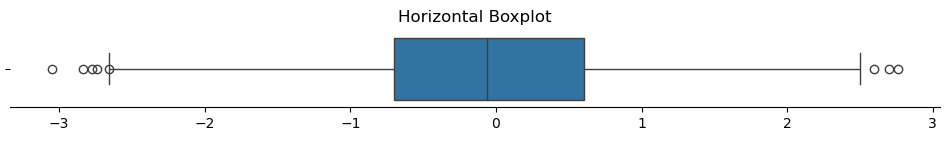
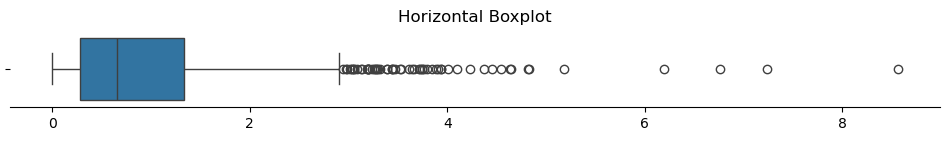
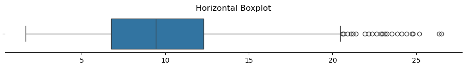

# 상자그림과 그 해석

## 개요

**상자그림**은 중앙값, 사분위수, 잠재적 이상점을 보여 분포를 요약한다. 정규성 검정을 위해 특별히 고안된 것은 아니지만, 정규분포 자료의 특징인 치우침 여부와 대칭성에 대한 단서를 준다.

정규분포를 따르는 자료의 상자그림은 대칭이며, (자료의 범위를 나타내는) 수염이 양쪽에서 대략 같은 길이를 갖는다.

## 정규분포의 상자그림

<div class="codebox" markdown>

**예제 1.** 정규분포의 상자그림

```python
import numpy as np
import matplotlib.pyplot as plt
import seaborn as sns
import warnings

def plot_horizontal_boxplot(data, figsize=(12, 1)):
    """가로로 누운 상자그림을 그린다.

    상자그림은 다섯 수치 요약을 그린 것이므로, 정규성을 보려면 두 가지만
    보면 된다. 중앙값이 상자 가운데에 있는가(대칭), 수염 밖의 점이
    얼마나 많은가(꼬리 두께).

    매개변수
    --------
    data : 그릴 자료
    figsize : 그림 크기 (가로, 세로)
    """
    warnings.simplefilter(action='ignore', category=FutureWarning)

    fig, ax = plt.subplots(figsize=figsize)
    sns.boxplot(data=data, orient='h', ax=ax)

    ax.spines["top"].set_visible(False)
    ax.spines["right"].set_visible(False)
    ax.spines["left"].set_visible(False)

    ax.set_title('Horizontal Boxplot')
    plt.show()

if __name__ == "__main__":
    # 정규자료: 중앙값이 가운데 있고 수염이 좌우로 고르다.
    np.random.seed(0)
    sample_data = np.random.normal(loc=0, scale=1, size=1000)
    plot_horizontal_boxplot(sample_data)
```



</div>

정규분포 자료에서는 상자그림이 대칭이다. 중앙값 선이 상자 가운데에 놓이고 수염이 양쪽으로 거의 같게 뻗는다.

## 지수분포의 상자그림

<div class="codebox" markdown>

**예제 2.** 지수분포의 상자그림

```python
import numpy as np
import matplotlib.pyplot as plt
import seaborn as sns
import warnings

def plot_horizontal_boxplot(data, figsize=(12, 1)):
    """가로로 누운 상자그림을 그린다.

    상자그림은 다섯 수치 요약을 그린 것이므로, 정규성을 보려면 두 가지만
    보면 된다. 중앙값이 상자 가운데에 있는가(대칭), 수염 밖의 점이
    얼마나 많은가(꼬리 두께).
    """
    warnings.simplefilter(action='ignore', category=FutureWarning)

    fig, ax = plt.subplots(figsize=figsize)
    sns.boxplot(data=data, orient='h', ax=ax)

    ax.spines["top"].set_visible(False)
    ax.spines["right"].set_visible(False)
    ax.spines["left"].set_visible(False)

    ax.set_title('Horizontal Boxplot')
    plt.show()

if __name__ == "__main__":
    # 지수자료: 오른쪽으로 치우쳐 중앙값이 상자 왼쪽에 붙고, 오른쪽
    # 수염만 길며 그 밖의 점도 한쪽에만 몰린다.
    np.random.seed(0)
    sample_data = np.random.exponential(scale=1, size=1000)
    plot_horizontal_boxplot(sample_data)
```



</div>

지수 자료에서는 상자그림이 뚜렷하게 비대칭이다. 오른쪽 수염이 왼쪽보다 훨씬 길게 뻗고 오른쪽에 이상점이 여럿 나타나 강한 양의 치우침을 나타낸다.

## 카이제곱분포의 상자그림

<div class="codebox" markdown>

**예제 3.** 카이제곱분포의 상자그림

```python
import numpy as np
import matplotlib.pyplot as plt
import seaborn as sns
import warnings

def plot_horizontal_boxplot(data, figsize=(12, 1)):
    """가로로 누운 상자그림을 그린다.

    상자그림은 다섯 수치 요약을 그린 것이므로, 정규성을 보려면 두 가지만
    보면 된다. 중앙값이 상자 가운데에 있는가(대칭), 수염 밖의 점이
    얼마나 많은가(꼬리 두께).
    """
    warnings.simplefilter(action='ignore', category=FutureWarning)

    fig, ax = plt.subplots(figsize=figsize)
    sns.boxplot(data=data, orient='h', ax=ax)

    ax.spines["top"].set_visible(False)
    ax.spines["right"].set_visible(False)
    ax.spines["left"].set_visible(False)

    ax.set_title('Horizontal Boxplot')
    plt.show()

if __name__ == "__main__":
    # 자유도 10 인 카이제곱: 지수보다는 덜하지만 여전히 오른쪽으로 치우쳐
    # 있다. 자유도를 키우면 정규에 가까워진다.
    np.random.seed(0)
    sample_data = np.random.chisquare(df=10, size=1000)
    plot_horizontal_boxplot(sample_data)
```



</div>

자유도 10인 카이제곱 자료는 상자그림에서 중간 정도의 오른쪽 치우침을 보인다. 중앙값이 상자 안에서 왼쪽으로 치우쳐 있고 오른쪽 수염이 왼쪽보다 길다.

## 시각적 방법의 한계

시각적 방법은 정규성을 눈으로 평가하는 데 도움이 되지만 주관적이며 해석에 의존한다. 정규성에서 조금 벗어난 것은 알아채기 어려울 수 있고, 같은 그림을 사람마다 다르게 해석할 수 있다. 게다가 표본이 작으면 자료의 변동이 패턴을 가리므로 시각적 방법의 효과가 떨어진다.

## 연습문제

<div class="drillbox" markdown>

**연습문제 1.** <span class="diff easy" title="쉬움"></span>
어떤 상자그림에서 중앙값이 50, $Q_1$이 35, $Q_3$이 65이고 자료에 5와 120이라는 두 극단값이 있다. IQR와 1.5×IQR 규칙에 따른 수염 경계를 계산하라.

</div>

??? success "풀이"
    IQR는 $Q_3 - Q_1 = 65 - 35 = 30$이다.

    수염 경계는

    - 아래쪽 울타리: $Q_1 - 1.5 \times \text{IQR} = 35 - 45 = -10$
    - 위쪽 울타리: $Q_3 + 1.5 \times \text{IQR} = 65 + 45 = 110$

    아래쪽 수염은 $-10$보다 큰 가장 작은 자료점까지 뻗는다($-10$ 자체까지가 아니다). 위쪽 수염은 110보다 작은 가장 큰 자료점까지 뻗는다.

    이제 두 극단값을 판정하면

    - $5 > -10$이므로 **이상점이 아니다**. 아래쪽 수염 끝에 놓이거나 그 근처에 있을 뿐이다.
    - $120 > 110$이므로 **이상점이다**.

    곧 1.5×IQR 규칙으로는 120만 이상점으로 표시된다. 눈으로 보기에 "극단적"인 값이 반드시 상자그림의 이상점 기준을 넘는 것은 아니라는 점을 보여주는 예이다.

<div class="drillbox" markdown>

**연습문제 2.** <span class="diff med" title="중간"></span>
집단 간 분포를 비교하는 도구로서 나란히 놓은 상자그림과 분산분석을 비교하라. 상자그림이 보여줄 수 있지만 분산분석은 보여주지 못하는 것은 무엇인가?

</div>

??? success "풀이"
    상자그림은 분포의 모양 전체를 보여준다. 중앙값, 산포(IQR), 대칭성, 꼬리 거동, 이상점이다. 분산분석은 평균이 다른지에 대한 검정 하나만 제공한다.

    상자그림이 드러낼 수 있는 것: (1) 중앙값과 평균의 차이, (2) 집단 간 분산의 불균등(상자 높이의 차이), (3) 치우침(비대칭 수염), (4) 특정 집단의 이상점, (5) 차이가 실질적으로 의미 있는지(상자가 겹치면 효과가 작다는 뜻).

    분산분석은 이 가운데 어느 것도 보여주지 못한다. 비교를 하나의 p값으로 압축해 버린다. 상자그림(시각)과 분산분석(형식적 검정)을 함께 쓰는 것이 이상적이다.

<div class="drillbox" markdown>

**연습문제 3.** <span class="diff med" title="중간"></span>
분산분석의 정규성과 등분산성 가정을 평가하는 데 상자그림을 어떻게 쓸 수 있는지 설명하라.

</div>

??? success "풀이"
    **정규성:** 각 집단의 상자그림에서 대칭성을 확인한다. 중앙값이 상자($Q_1$–$Q_3$) 안에서 대략 가운데에 있어야 하고 수염의 길이가 비슷해야 한다. 상자가 심하게 비대칭이거나 이상점이 많으면 비정규성을 시사한다.

    **등분산성:** 집단 간 상자의 높이(IQR)를 비교한다. 모든 상자의 높이가 비슷하면 분산이 대략 같다. 한 집단의 상자가 다른 집단보다 훨씬 높으면 등분산 가정이 위배되었을 수 있다.

    이는 형식적 검정이 아니라 빠른 시각적 확인이지만, 분산분석을 수행하기 전에 가장 뚜렷한 위배를 잡아낸다.

<div class="drillbox" markdown>

**연습문제 4.** <span class="diff med" title="중간"></span>
이봉분포에서 상자그림이 오도할 수 있는 이유는 무엇인가? 이봉성을 더 잘 드러내는 대안 그림은 무엇인가?

</div>

??? success "풀이"
    상자그림은 분포를 다섯 수치(최솟값, $Q_1$, 중앙값, $Q_3$, 최댓값)와 이상점으로 요약한다. 이봉분포(뚜렷이 구분되는 두 무리)는 IQR가 넓은 하나의 대칭분포처럼 보이는 상자그림을 만들어 두 봉우리를 완전히 감출 수 있다.

    예를 들어 $N(0,1)$과 $N(5,1)$의 혼합은 2.5 근처를 중심으로 IQR가 큰 상자그림을 보여, 넓은 단봉분포 하나와 구별되지 않는다.

    **더 나은 대안:** 바이올린 그림(상자그림에 KDE를 겹쳐 다봉성을 드러낸다), 히스토그램, 스트립/스웜 그림(상자와 함께 개별 자료점을 보여준다).

---

## 정리하며

상자그림은 정규성 전용 도구가 아니지만 **대칭성과 이상점**을 빠르게 보여 준다.

- **정규 자료의 상자그림은 대칭이다.** 중앙값이 상자 가운데에 있고 수염 길이가 비슷하며, 이상점이 드물게 나타난다.
- **치우침이 즉시 보인다.** 중앙값이 한쪽으로 치우치고 한쪽 수염이 길어진다.
- **이상점 표시가 꼬리의 단서다.** 정규분포에서 $1.5\times\text{IQR}$ 규칙으로 표시되는 비율은 약 $0.7\%$ 이므로, **그보다 훨씬 많으면 꼬리가 두꺼운 것**이다.
- **봉우리가 둘인 분포를 못 본다.** 다섯 수치 요약만 쓰므로 이봉성이 완전히 가려지며, 히스토그램이나 바이올린 그림이 필요하다.
- **여러 집단을 나란히 비교하기에 좋다.** 정규성만이 아니라 등분산성 확인에도 유용하다.

다음 절 **시각적 확인 종합**으로 넘어간다.
