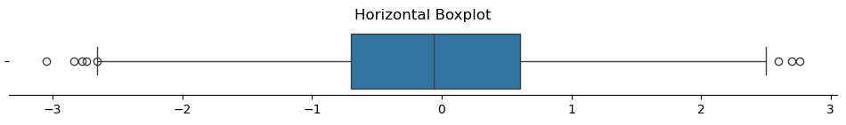
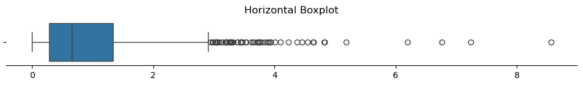
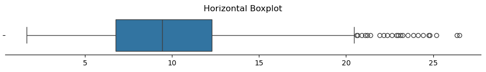

# 상자그림과 그 해석

## 개요

**상자그림**은 중앙값, 사분위수, 잠재적 이상점을 보여 분포를 요약한다. 정규성 검정을 위해 특별히 고안된 것은 아니지만, 정규분포 자료의 특징인 치우침 여부와 대칭성에 대한 단서를 준다.

정규분포를 따르는 자료의 상자그림은 대칭이며, (자료의 범위를 나타내는) 수염이 양쪽에서 대략 같은 길이를 갖는다.

## 정규분포의 상자그림

<div class="exbox" markdown>

**보기 1.** <span class="diff easy" title="쉬움"></span> 정규분포의 상자그림. $\mathcal{N}(0,1)$에서 $n = 1000$개를 뽑아 가로 상자그림을 그린다.

**(1)** 그려 보고 무엇이 읽히는지 말하시오. 중앙값이 상자 가운데에 있는지, 두 수염의 길이가 같은지를 **수로** 재어 답하시오.

**(2)** 표준정규분포에서 $1.5 \times \mathrm{IQR}$ 규칙에 걸리는 점의 비율을 **닫힌 꼴로** 구하고, 모의실험이 그 값을 재현하는지 확인하시오.

</div>

??? success "풀이"

    **(1) 그림.** 먼저 상자그림을 그린다.

    ```python
    import numpy as np
    import matplotlib.pyplot as plt
    import seaborn as sns
    import warnings

    plt.rcParams["font.family"] = "Apple SD Gothic Neo"
    plt.rcParams["axes.unicode_minus"] = False

    def plot_horizontal_boxplot(data, figsize=(12, 1)):
        """가로로 누운 상자그림을 그린다.

        상자그림은 다섯 수치 요약을 그린 것이므로, 정규성을 보려면 두 가지만
        보면 된다. 중앙값이 상자 가운데에 있는가(대칭), 수염 밖의 점이
        얼마나 많은가(꼬리 두께).

        매개변수
        --------
        data : 그릴 자료
        figsize : 그림 크기 (가로, 세로)
        """
        warnings.simplefilter(action='ignore', category=FutureWarning)

        fig, ax = plt.subplots(figsize=figsize)
        sns.boxplot(data=data, orient='h', ax=ax)

        ax.spines["top"].set_visible(False)
        ax.spines["right"].set_visible(False)
        ax.spines["left"].set_visible(False)

        ax.set_title('Horizontal Boxplot')
        plt.show()

    if __name__ == "__main__":
        # 정규자료: 중앙값이 가운데 있고 수염이 좌우로 고르다.
        np.random.seed(0)
        sample_data = np.random.normal(loc=0, scale=1, size=1000)
        plot_horizontal_boxplot(sample_data)
    ```

    

    눈으로는 "대칭이다"까지만 보인다. 그 말을 수로 바꾸려면 다섯 수 요약을 직접 재야 한다.

    **(2) 이론값.** 표준정규는 0을 중심으로 대칭이므로 $Q_3 = -Q_1 = z_{0.75}$이고

    $$
    \mathrm{IQR} = 2 z_{0.75}, \qquad
    Q_3 + 1.5\,\mathrm{IQR} = z_{0.75} + 3 z_{0.75} = 4 z_{0.75}
    $$

    이다. **울타리가 정확히 $4 z_{0.75}$에 놓인다.** $z_{0.75} = 0.674490$이므로 울타리는 $\pm 2.697959$이고, 이상점으로 찍히는 비율은

    $$
    2\,\Phi(-4 z_{0.75}) = 2 \times 0.0034886 = 0.0069772
    $$

    곧 **약 $0.70\%$** 다. 이것이 정규 자료의 기준선이다. 1000개를 뽑으면 평균 7개쯤이 이상점으로 찍힌다는 뜻이고, 그보다 훨씬 많으면 꼬리가 두꺼운 것이다.

    ```python
    import numpy as np
    from scipy import stats

    np.random.seed(0)
    x = np.random.normal(loc=0, scale=1, size=1000)

    q1, med, q3 = np.percentile(x, [25, 50, 75])
    iqr = q3 - q1
    lo, hi = q1 - 1.5 * iqr, q3 + 1.5 * iqr
    inside = x[(x >= lo) & (x <= hi)]
    n_out = int(np.sum((x < lo) | (x > hi)))

    print(f"Q1 = {q1:.4f}   중앙값 = {med:.4f}   Q3 = {q3:.4f}   IQR = {iqr:.4f}")
    print(f"중앙값-Q1 = {med - q1:.4f}   Q3-중앙값 = {q3 - med:.4f}")
    print(f"아래 수염 {q1 - inside.min():.4f}   위 수염 {inside.max() - q3:.4f}")
    print(f"이상점 {n_out}개 = {100 * n_out / len(x):.2f}%")

    # 표준정규는 대칭이라 Q3 = -Q1 = z 이고 IQR = 2z, 울타리는 Q3 + 3z = 4z 다.
    z = stats.norm.ppf(0.75)
    print(f"이론: z = {z:.6f}  IQR = {2 * z:.6f}  울타리 = ±{4 * z:.6f}")
    print(f"이론 이상점 비율 = {2 * stats.norm.sf(4 * z):.6f} = {200 * stats.norm.sf(4 * z):.4f}%")
    print(f"몬테카를로 표준오차 = {100 * np.sqrt(0.006977 * 0.993023 / 1000):.4f}%")
    ```

    출력:

    ```text
    Q1 = -0.6984   중앙값 = -0.0580   Q3 = 0.6070   IQR = 1.3054
    중앙값-Q1 = 0.6404   Q3-중앙값 = 0.6650
    아래 수염 1.9572   위 수염 1.8902
    이상점 8개 = 0.80%
    이론: z = 0.674490  IQR = 1.348980  울타리 = ±2.697959
    이론 이상점 비율 = 0.006977 = 0.6977%
    몬테카를로 표준오차 = 0.2632%
    ```

    **두 답이 맞는다.** 상자 안에서 중앙값까지의 거리가 왼쪽 $0.6404$, 오른쪽 $0.6650$으로 비가 $1.04$, 두 수염은 $1.9572$ 대 $1.8902$로 비가 $0.97$이다. 어느 쪽도 1에서 $5\%$ 안쪽이니 **"중앙값이 상자 가운데에 있고 수염이 고르다"는 눈대중이 수로 확인된다.** 표본 $\mathrm{IQR} = 1.3054$도 이론값 $1.3490$에 가깝다.

    이상점은 8개로 $0.80\%$가 나왔고 이론값은 $0.6977\%$다. 차이 $0.10$포인트는 몬테카를로 표준오차 $0.26$포인트의 절반에 못 미치므로 **우연으로 충분히 설명된다.**

    **이 그림이 가리는 것**은 분포의 모양이다. 상자그림은 다섯 수와 이상점만 그리므로 **봉우리가 하나인지 둘인지는 알려 주지 않는다.** 위의 여섯 수치($Q_1$, 중앙값, $Q_3$, 두 수염, 이상점 비율)가 모두 정규 자료의 기준선과 맞아떨어졌다고 해서 자료가 정규라고 결론 내릴 수는 없다. 같은 다섯 수 요약을 갖는 분포는 무수히 많으며, 이봉분포도 그 안에 들어간다(연습문제 4). 상자그림은 **대칭성과 꼬리 두께**를 걸러내는 체일 뿐이고, 모양 전체를 보려면 히스토그램이나 밀도추정이 필요하다.

## 지수분포의 상자그림

<div class="exbox" markdown>

**보기 2.** <span class="diff easy" title="쉬움"></span> 지수분포의 상자그림. $\text{Exponential}(1)$에서 $n = 1000$개를 뽑아 보기 1과 같은 그림을 그린다.

**(1)** 그려 보고 보기 1의 정규 상자그림과 무엇이 달라졌는지 말하시오. "오른쪽으로 치우쳤다"를 **상자 안 두 거리의 비와 두 수염 길이의 비**로 바꾸어 적으시오.

**(2)** $\text{Exponential}(1)$의 분위수는 모두 닫힌 꼴이다. $Q_1$, 중앙값, $Q_3$, $\mathrm{IQR}$, 두 울타리, 그리고 **이상점 비율**을 손으로 구하고 모의실험과 맞춰 보시오. 아래쪽에는 이상점이 하나도 나올 수 없는 까닭도 말하시오.

</div>

??? success "풀이"

    **(1) 그림.** 보기 1과 같은 함수에 자료만 바꾸어 넣는다.

    ```python
    import numpy as np
    import matplotlib.pyplot as plt
    import seaborn as sns
    import warnings

    plt.rcParams["font.family"] = "Apple SD Gothic Neo"
    plt.rcParams["axes.unicode_minus"] = False

    def plot_horizontal_boxplot(data, figsize=(12, 1)):
        """가로로 누운 상자그림을 그린다.

        상자그림은 다섯 수치 요약을 그린 것이므로, 정규성을 보려면 두 가지만
        보면 된다. 중앙값이 상자 가운데에 있는가(대칭), 수염 밖의 점이
        얼마나 많은가(꼬리 두께).
        """
        warnings.simplefilter(action='ignore', category=FutureWarning)

        fig, ax = plt.subplots(figsize=figsize)
        sns.boxplot(data=data, orient='h', ax=ax)

        ax.spines["top"].set_visible(False)
        ax.spines["right"].set_visible(False)
        ax.spines["left"].set_visible(False)

        ax.set_title('Horizontal Boxplot')
        plt.show()

    if __name__ == "__main__":
        # 지수자료: 오른쪽으로 치우쳐 중앙값이 상자 왼쪽에 붙고, 오른쪽
        # 수염만 길며 그 밖의 점도 한쪽에만 몰린다.
        np.random.seed(0)
        sample_data = np.random.exponential(scale=1, size=1000)
        plot_horizontal_boxplot(sample_data)
    ```

    

    **(2) 이론값.** $\text{Exponential}(1)$의 CDF가 $F(t) = 1 - e^{-t}$이므로 분위수함수는 $F^{-1}(p) = -\log(1-p)$이고, 세 사분위수가 전부 로그로 떨어진다.

    $$
    Q_1 = \log\tfrac{4}{3} = 0.2877, \qquad
    \text{중앙값} = \log 2 = 0.6931, \qquad
    Q_3 = \log 4 = 1.3863
    $$

    따라서

    $$
    \mathrm{IQR} = \log 4 - \log\tfrac{4}{3} = \log 3 = 1.0986
    $$

    로 $\mathrm{IQR}$가 깔끔하게 $\log 3$이다. 울타리는

    $$
    Q_3 + 1.5\,\mathrm{IQR} = \log 4 + \tfrac{3}{2}\log 3 = \log\!\bigl(4 \cdot 3^{3/2}\bigr) = 3.0342,
    $$

    $$
    Q_1 - 1.5\,\mathrm{IQR} = \log\tfrac{4}{3} - \tfrac{3}{2}\log 3 = -1.3602
    $$

    이다. **아래쪽 울타리가 음수다.** 지수분포의 지지집합이 $[0, \infty)$이니 그보다 작은 값은 존재할 수 없고, 그래서 **아래쪽 이상점은 원리상 하나도 나올 수 없다.** 위쪽 이상점 비율은 꼬리확률을 그대로 읽으면 되므로

    $$
    P\bigl(X > \log(4 \cdot 3^{3/2})\bigr) = e^{-\log(4 \cdot 3^{3/2})} = \frac{1}{4 \cdot 3^{3/2}} = 0.048113
    $$

    곧 **$4.81\%$** 다. 보기 1에서 구한 정규의 $0.70\%$와 견주면 **일곱 배**다. 상자 안 두 거리의 비도 닫힌 꼴로 나온다.

    $$
    \frac{Q_3 - \text{중앙값}}{\text{중앙값} - Q_1}
    = \frac{\log 4 - \log 2}{\log 2 - \log \frac{4}{3}}
    = \frac{\log 2}{\log \frac{3}{2}} = 1.7095
    $$

    ```python
    import numpy as np

    np.random.seed(0)
    x = np.random.exponential(scale=1, size=1000)

    q1, med, q3 = np.percentile(x, [25, 50, 75])
    iqr = q3 - q1
    lo, hi = q1 - 1.5 * iqr, q3 + 1.5 * iqr
    inside = x[(x >= lo) & (x <= hi)]
    n_lo = int(np.sum(x < lo))
    n_hi = int(np.sum(x > hi))

    print(f"Q1 = {q1:.4f}   중앙값 = {med:.4f}   Q3 = {q3:.4f}   IQR = {iqr:.4f}")
    print(f"중앙값-Q1 = {med - q1:.4f}   Q3-중앙값 = {q3 - med:.4f}   비 = {(q3 - med) / (med - q1):.4f}")
    print(f"아래 수염 {q1 - inside.min():.4f}   위 수염 {inside.max() - q3:.4f}"
          f"   비 = {(inside.max() - q3) / (q1 - inside.min()):.4f}")
    print(f"울타리 lo = {lo:.4f}   hi = {hi:.4f}")
    print(f"이상점: 아래 {n_lo}개, 위 {n_hi}개 = {100 * (n_lo + n_hi) / len(x):.2f}%")

    # Exp(1) 의 분위수는 -log(1-p) 라 모두 닫힌 꼴이다.
    Q1, MED, Q3 = np.log(4 / 3), np.log(2), np.log(4)
    IQR = Q3 - Q1          # = log 3
    FENCE = Q3 + 1.5 * IQR  # = log(4 * 3**1.5)
    print(f"이론: Q1 = {Q1:.4f}  중앙값 = {MED:.4f}  Q3 = {Q3:.4f}  IQR = log 3 = {IQR:.4f}")
    print(f"이론: 위 울타리 = log(4*3^1.5) = {FENCE:.4f}   아래 울타리 = {Q1 - 1.5 * IQR:.4f}")
    print(f"이론: 위 이상점 비율 = 1/(4*3^1.5) = {1 / (4 * 3 ** 1.5):.6f} = {100 / (4 * 3 ** 1.5):.4f}%")
    print(f"이론: (Q3-중앙값)/(중앙값-Q1) = log2/log1.5 = {np.log(2) / np.log(1.5):.4f}")
    print(f"몬테카를로 표준오차 = {100 * np.sqrt(0.048113 * 0.951887 / 1000):.4f}%")
    ```

    출력:

    ```text
    Q1 = 0.2845   중앙값 = 0.6565   Q3 = 1.3366   IQR = 1.0521
    중앙값-Q1 = 0.3720   Q3-중앙값 = 0.6801   비 = 1.8284
    아래 수염 0.2840   위 수염 1.5693   비 = 5.5266
    울타리 lo = -1.2936   hi = 2.9147
    이상점: 아래 0개, 위 60개 = 6.00%
    이론: Q1 = 0.2877  중앙값 = 0.6931  Q3 = 1.3863  IQR = log 3 = 1.0986
    이론: 위 울타리 = log(4*3^1.5) = 3.0342   아래 울타리 = -1.3602
    이론: 위 이상점 비율 = 1/(4*3^1.5) = 0.048113 = 4.8113%
    이론: (Q3-중앙값)/(중앙값-Q1) = log2/log1.5 = 1.7095
    몬테카를로 표준오차 = 0.6767%
    ```

    **읽기.** 세 사분위수는 이론값과 소수 둘째 자리까지 맞는다($0.2845$ 대 $0.2877$, $0.6565$ 대 $0.6931$, $1.3366$ 대 $1.3863$). 비대칭을 가리키는 두 수는 이렇다.

    | 재는 것 | 정규(보기 1) | 지수 | 지수 이론 |
    |---|---|---|---|
    | $(Q_3 - \text{중앙값})/(\text{중앙값} - Q_1)$ | $1.04$ | $1.83$ | $\log 2/\log\frac{3}{2} = 1.71$ |
    | 위 수염 / 아래 수염 | $0.97$ | $5.53$ | — |
    | 이상점 비율 | $0.80\%$ | $6.00\%$ | $4.81\%$ |

    **눈에 가장 크게 띄는 것은 수염 비 $5.53$이다.** 중앙값은 상자 안에서 왼쪽으로 조금 밀렸을 뿐($1.83$배)인데 수염은 다섯 배 넘게 차이가 난다. 까닭은 아래쪽이 0에서 잘려 아래 수염이 $Q_1 - \min = 0.2840$ 이상 길어질 수 없기 때문이다. **벽에 막힌 쪽은 짧고 열린 쪽만 늘어난다** — 이것이 한쪽이 유계인 분포의 상자그림이 보이는 전형적인 꼴이다.

    이상점은 아래 0개로 이론과 정확히 맞고, 위쪽은 60개($6.00\%$)가 나와 이론값 $4.81\%$보다 $1.19$포인트 높다. 몬테카를로 표준오차가 $0.68$포인트이니 $1.8$배로 조금 큰데, 그 까닭이 분명하다. **표본 울타리가 이론 울타리보다 낮게 잡혔다.** 표본 $Q_3 = 1.3366$이 이론 $1.3863$보다 작아 울타리가 $2.9147$로 내려앉았고, 이론 울타리 $3.0342$를 넘는 점은 55개뿐인데 그 사이 구간에서 5개가 더 걸려 60개가 되었다. 55개($5.50\%$)는 이론값에서 $1.0$ 표준오차 안쪽이다. 곧 **차이의 절반은 표본 사분위수 자체의 변동에서 온다.** 울타리를 자료로부터 추정한다는 사실을 잊으면 이 어긋남을 설명할 수 없다.

## 카이제곱분포의 상자그림

<div class="exbox" markdown>

**보기 3.** <span class="diff easy" title="쉬움"></span> 카이제곱분포의 상자그림. $\chi^2_{10}$에서 $n = 1000$개를 뽑아 보기 1·2와 같은 그림을 그린다.

**(1)** 세 상자그림(정규·지수·카이제곱)을 나란히 두고 보기 1·2에서 쓴 세 수치 — 상자 안 비대칭, 수염 비, 이상점 비율 — 를 재어 **치우침의 사다리**를 만드시오.

**(2)** 이 표본에서 **상자 안 비대칭은 $1.07$에 지나지 않는다.** 그런데도 자료는 분명히 오른쪽으로 치우쳐 있다. 상자그림의 어느 부분이 치우침을 말해 주고 있는가. 이로부터 상자그림을 읽는 순서에 대해 무엇을 배울 수 있는가.

</div>

??? success "풀이"

    **(1) 그림과 수치.** 자료만 $\chi^2_{10}$으로 바꾼다.

    ```python
    import numpy as np
    import matplotlib.pyplot as plt
    import seaborn as sns
    import warnings

    plt.rcParams["font.family"] = "Apple SD Gothic Neo"
    plt.rcParams["axes.unicode_minus"] = False

    def plot_horizontal_boxplot(data, figsize=(12, 1)):
        """가로로 누운 상자그림을 그린다.

        상자그림은 다섯 수치 요약을 그린 것이므로, 정규성을 보려면 두 가지만
        보면 된다. 중앙값이 상자 가운데에 있는가(대칭), 수염 밖의 점이
        얼마나 많은가(꼬리 두께).
        """
        warnings.simplefilter(action='ignore', category=FutureWarning)

        fig, ax = plt.subplots(figsize=figsize)
        sns.boxplot(data=data, orient='h', ax=ax)

        ax.spines["top"].set_visible(False)
        ax.spines["right"].set_visible(False)
        ax.spines["left"].set_visible(False)

        ax.set_title('Horizontal Boxplot')
        plt.show()

    if __name__ == "__main__":
        # 자유도 10 인 카이제곱: 지수보다는 덜하지만 여전히 오른쪽으로 치우쳐
        # 있다. 자유도를 키우면 정규에 가까워진다.
        np.random.seed(0)
        sample_data = np.random.chisquare(df=10, size=1000)
        plot_horizontal_boxplot(sample_data)
    ```

    

    $\chi^2_{10}$의 분위수는 닫힌 꼴이 없으므로 이론값도 수치로 구한다. 모양 통계량은 닫힌 꼴이 있다. $\chi^2_d$의 왜도는 $\sqrt{8/d}$, 초과첨도는 $12/d$이므로 $d = 10$에서 $0.8944$와 $1.2000$이다.

    ```python
    import numpy as np
    from scipy import stats

    np.random.seed(0)
    x = np.random.chisquare(df=10, size=1000)

    q1, med, q3 = np.percentile(x, [25, 50, 75])
    iqr = q3 - q1
    lo, hi = q1 - 1.5 * iqr, q3 + 1.5 * iqr
    inside = x[(x >= lo) & (x <= hi)]
    n_lo, n_hi = int(np.sum(x < lo)), int(np.sum(x > hi))

    print(f"Q1 = {q1:.4f}   중앙값 = {med:.4f}   Q3 = {q3:.4f}   IQR = {iqr:.4f}")
    print(f"비대칭 (Q3-중앙값)/(중앙값-Q1) = {(q3 - med) / (med - q1):.4f}")
    print(f"수염 아래 {q1 - inside.min():.4f}  위 {inside.max() - q3:.4f}"
          f"  비 = {(inside.max() - q3) / (q1 - inside.min()):.4f}")
    print(f"울타리 lo = {lo:.4f}  hi = {hi:.4f}")
    print(f"이상점: 아래 {n_lo}개, 위 {n_hi}개 = {100 * (n_lo + n_hi) / len(x):.2f}%")
    print(f"표본 g1 = {stats.skew(x):.4f}   표본 g2(초과) = {stats.kurtosis(x):.4f}")

    # chi2_10 의 분위수는 닫힌 꼴이 없어 수치로 구한다.
    c = stats.chi2(10)
    Q1, MED, Q3 = c.ppf([0.25, 0.50, 0.75])
    IQR = Q3 - Q1
    LO, HI = Q1 - 1.5 * IQR, Q3 + 1.5 * IQR
    print(f"이론: Q1 = {Q1:.4f}  중앙값 = {MED:.4f}  Q3 = {Q3:.4f}  IQR = {IQR:.4f}")
    print(f"이론: 비대칭 = {(Q3 - MED) / (MED - Q1):.4f}")
    print(f"이론: 울타리 lo = {LO:.4f}  hi = {HI:.4f}")
    print(f"이론: 위 이상점 비율 = {c.sf(HI):.6f} = {100 * c.sf(HI):.4f}%   아래 = {c.cdf(LO):.6f}")
    print(f"이론: 왜도 = sqrt(8/10) = {np.sqrt(0.8):.4f}   초과첨도 = 12/10 = {12 / 10:.4f}")
    print(f"몬테카를로 표준오차 = {100 * np.sqrt(0.019311 * 0.980689 / 1000):.4f}%")
    ```

    출력:

    ```text
    Q1 = 6.7592   중앙값 = 9.4358   Q3 = 12.2908   IQR = 5.5316
    비대칭 (Q3-중앙값)/(중앙값-Q1) = 1.0666
    수염 아래 5.0970  위 8.1598  비 = 1.6009
    울타리 lo = -1.5382  hi = 20.5881
    이상점: 아래 0개, 위 23개 = 2.30%
    표본 g1 = 0.8519   표본 g2(초과) = 0.8951
    이론: Q1 = 6.7372  중앙값 = 9.3418  Q3 = 12.5489  IQR = 5.8117
    이론: 비대칭 = 1.2313
    이론: 울타리 lo = -1.9803  hi = 21.2664
    이론: 위 이상점 비율 = 0.019311 = 1.9311%   아래 = 0.000000
    이론: 왜도 = sqrt(8/10) = 0.8944   초과첨도 = 12/10 = 1.2000
    몬테카를로 표준오차 = 0.4352%
    ```

    세 보기를 한 표에 모으면 사다리가 된다. 이론 왜도는 각각 $0$, $2$, $\sqrt{8/10} = 0.894$다.

    | 재는 것 | 정규 | $\chi^2_{10}$ | 지수 |
    |---|---|---|---|
    | 이론 왜도 | $0$ | $0.894$ | $2$ |
    | 상자 안 비대칭 (표본) | $1.04$ | $1.07$ | $1.83$ |
    | 상자 안 비대칭 (이론) | $1$ | $1.23$ | $1.71$ |
    | 위 수염 / 아래 수염 (표본) | $0.97$ | $1.60$ | $5.53$ |
    | 이상점 비율 (표본) | $0.80\%$ | $2.30\%$ | $6.00\%$ |
    | 이상점 비율 (이론) | $0.70\%$ | $1.93\%$ | $4.81\%$ |

    **세 수치가 모두 왜도의 순서를 지킨다.** 특히 이상점 비율이 $0.70\% \to 1.93\% \to 4.81\%$로 단정히 늘어난다. 이 표본의 $2.30\%$는 이론 $1.93\%$에서 $0.85$ 표준오차 떨어진 값이니($\mathrm{SE} = 0.44$포인트) 맞는다고 보아야 한다. 아래쪽 이상점이 0개인 것도 이론과 정확히 맞는다. 아래 울타리가 $-1.98$로 음수이고 $\chi^2$의 지지집합이 $(0, \infty)$이므로 **지수분포에서와 같은 이유로 아래쪽 이상점은 나올 수 없다.**

    **(2) 치우침을 말해 주는 것은 상자가 아니라 수염과 이상점이다.** 상자 안 비대칭은 $1.07$, 곧 중앙값이 상자 가운데에서 $3\%$만 밀려 있다. 그림으로 보면 거의 가운데다. 이론값조차 $1.23$에 그치니 **표본의 운이 나빠서가 아니라 $\chi^2_{10}$의 성질이다.** 사분위수는 분포의 가운데 50%만 보는 수치이고, 가운데 50%는 왜도가 $0.894$나 되는 분포에서도 꽤 대칭적이다.

    치우침이 드러나는 자리는 그 밖이다. 수염 비가 $1.60$이고 이상점이 위쪽에만 23개 몰려 있다. 아래쪽에 하나도 없다는 **비대칭 그 자체**가 가장 강한 신호다. 정규 자료였다면 위아래에 고르게 나뉘어야 하고(보기 1에서 5개 대 3개였다) 총량도 $0.70\%$에 머물렀어야 한다.

    배울 것은 **상자그림을 읽는 순서**다. 상자 안 중앙값의 위치부터 보면 중간 정도의 치우침을 놓친다. 먼저 **이상점이 한쪽에만 몰렸는지**를 보고, 다음에 **수염 길이의 비**를 보고, 상자 안 중앙값의 위치는 마지막에 보는 것이 옳다. 신호의 세기가 그 순서로 세기 때문이다. 다만 어느 쪽도 분포의 **모양**은 말해 주지 않는다. 표본 초과첨도 $g_2 = 0.895$(`scipy.stats.kurtosis`의 기본값 `fisher=True, bias=True`이므로 초과첨도의 보정하지 않은 판본이다)가 이론값 $1.2$에 미치지 못하는 것 같은 사정은 상자그림을 아무리 들여다보아도 알 수 없다.

## 시각적 방법의 한계

시각적 방법은 정규성을 눈으로 평가하는 데 도움이 되지만 주관적이며 해석에 의존한다. 정규성에서 조금 벗어난 것은 알아채기 어려울 수 있고, 같은 그림을 사람마다 다르게 해석할 수 있다. 게다가 표본이 작으면 자료의 변동이 패턴을 가리므로 시각적 방법의 효과가 떨어진다.

## 연습문제

<div class="drillbox" markdown>

**연습문제 1.** <span class="diff easy" title="쉬움"></span>
어떤 상자그림에서 중앙값이 50, $Q_1$이 35, $Q_3$이 65이고 자료에 5와 120이라는 두 극단값이 있다. IQR와 1.5×IQR 규칙에 따른 수염 경계를 계산하라.

</div>

??? success "풀이"
    IQR는 $Q_3 - Q_1 = 65 - 35 = 30$이다.

    수염 경계는

    - 아래쪽 울타리: $Q_1 - 1.5 \times \text{IQR} = 35 - 45 = -10$
    - 위쪽 울타리: $Q_3 + 1.5 \times \text{IQR} = 65 + 45 = 110$

    아래쪽 수염은 $-10$보다 큰 가장 작은 자료점까지 뻗는다($-10$ 자체까지가 아니다). 위쪽 수염은 110보다 작은 가장 큰 자료점까지 뻗는다.

    이제 두 극단값을 판정하면

    - $5 > -10$이므로 **이상점이 아니다**. 아래쪽 수염 끝에 놓이거나 그 근처에 있을 뿐이다.
    - $120 > 110$이므로 **이상점이다**.

    곧 1.5×IQR 규칙으로는 120만 이상점으로 표시된다. 눈으로 보기에 "극단적"인 값이 반드시 상자그림의 이상점 기준을 넘는 것은 아니라는 점을 보여주는 예이다.

<div class="drillbox" markdown>

**연습문제 2.** <span class="diff med" title="중간"></span>
집단 간 분포를 비교하는 도구로서 나란히 놓은 상자그림과 분산분석을 비교하라. 상자그림이 보여줄 수 있지만 분산분석은 보여주지 못하는 것은 무엇인가?

</div>

??? success "풀이"
    상자그림은 분포의 모양 전체를 보여준다. 중앙값, 산포(IQR), 대칭성, 꼬리 거동, 이상점이다. 분산분석은 평균이 다른지에 대한 검정 하나만 제공한다.

    상자그림이 드러낼 수 있는 것: (1) 중앙값과 평균의 차이, (2) 집단 간 분산의 불균등(상자 높이의 차이), (3) 치우침(비대칭 수염), (4) 특정 집단의 이상점, (5) 차이가 실질적으로 의미 있는지(상자가 겹치면 효과가 작다는 뜻).

    분산분석은 이 가운데 어느 것도 보여주지 못한다. 비교를 하나의 p값으로 압축해 버린다. 상자그림(시각)과 분산분석(형식적 검정)을 함께 쓰는 것이 이상적이다.

<div class="drillbox" markdown>

**연습문제 3.** <span class="diff med" title="중간"></span>
분산분석의 정규성과 등분산성 가정을 평가하는 데 상자그림을 어떻게 쓸 수 있는지 설명하라.

</div>

??? success "풀이"
    **정규성:** 각 집단의 상자그림에서 대칭성을 확인한다. 중앙값이 상자($Q_1$–$Q_3$) 안에서 대략 가운데에 있어야 하고 수염의 길이가 비슷해야 한다. 상자가 심하게 비대칭이거나 이상점이 많으면 비정규성을 시사한다.

    **등분산성:** 집단 간 상자의 높이(IQR)를 비교한다. 모든 상자의 높이가 비슷하면 분산이 대략 같다. 한 집단의 상자가 다른 집단보다 훨씬 높으면 등분산 가정이 위배되었을 수 있다.

    이는 형식적 검정이 아니라 빠른 시각적 확인이지만, 분산분석을 수행하기 전에 가장 뚜렷한 위배를 잡아낸다.

<div class="drillbox" markdown>

**연습문제 4.** <span class="diff med" title="중간"></span>
이봉분포에서 상자그림이 오도할 수 있는 이유는 무엇인가? 이봉성을 더 잘 드러내는 대안 그림은 무엇인가?

</div>

??? success "풀이"
    상자그림은 분포를 다섯 수치(최솟값, $Q_1$, 중앙값, $Q_3$, 최댓값)와 이상점으로 요약한다. 이봉분포(뚜렷이 구분되는 두 무리)는 IQR가 넓은 하나의 대칭분포처럼 보이는 상자그림을 만들어 두 봉우리를 완전히 감출 수 있다.

    예를 들어 $N(0,1)$과 $N(5,1)$의 혼합은 2.5 근처를 중심으로 IQR가 큰 상자그림을 보여, 넓은 단봉분포 하나와 구별되지 않는다.

    **더 나은 대안:** 바이올린 그림(상자그림에 KDE를 겹쳐 다봉성을 드러낸다), 히스토그램, 스트립/스웜 그림(상자와 함께 개별 자료점을 보여준다).

---

## 정리하며

상자그림은 정규성 전용 도구가 아니지만 **대칭성과 이상점**을 빠르게 보여 준다.

- **정규 자료의 상자그림은 대칭이다.** 중앙값이 상자 가운데에 있고 수염 길이가 비슷하며, 이상점이 드물게 나타난다.
- **치우침이 즉시 보인다.** 중앙값이 한쪽으로 치우치고 한쪽 수염이 길어진다.
- **이상점 표시가 꼬리의 단서다.** 정규분포에서 $1.5\times\text{IQR}$ 규칙으로 표시되는 비율은 약 $0.7\%$ 이므로, **그보다 훨씬 많으면 꼬리가 두꺼운 것**이다.
- **봉우리가 둘인 분포를 못 본다.** 다섯 수치 요약만 쓰므로 이봉성이 완전히 가려지며, 히스토그램이나 바이올린 그림이 필요하다.
- **여러 집단을 나란히 비교하기에 좋다.** 정규성만이 아니라 등분산성 확인에도 유용하다.

다음 절 **시각적 확인 종합**으로 넘어간다.
