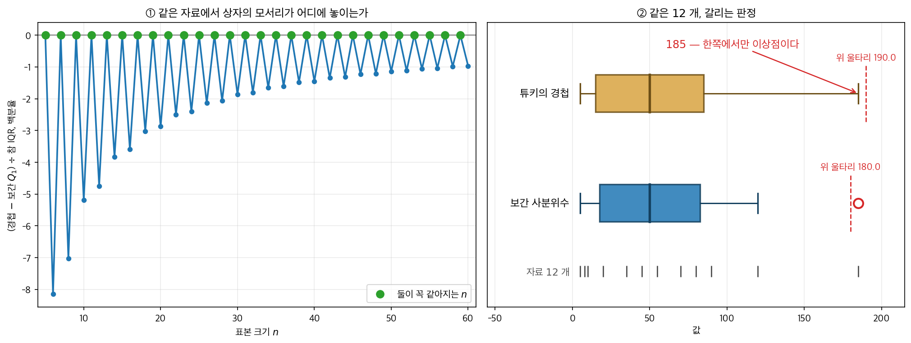

# 상자그림과 그 해석

## 개요

**상자그림**은 중앙값, 사분위수, 잠재적 이상점을 보여 분포를 요약한다. 정규성 검정을 위해 특별히 고안된 것은 아니지만, 정규분포 자료의 특징인 치우침 여부와 대칭성에 대한 단서를 준다.

정규분포를 따르는 자료의 상자그림은 대칭이며, (자료의 범위를 나타내는) 수염이 양쪽에서 대략 같은 길이를 갖는다.

---

## 1. 상자그림의 구조

표준 상자그림은 다섯 개의 요약통계량을 표시하고 이상점을 표시한다.

| 구성요소 | 정의 |
|---|---|
| 중앙값 선 | $Q_2$ (50백분위수) |
| 상자의 양 끝 | $Q_1$ (25백분위수) ~ $Q_3$ (75백분위수) |
| 사분위범위 | $\text{IQR} = Q_3 - Q_1$ |
| 아래 수염 | $Q_1 - 1.5\,\text{IQR}$ 이상인 관측값 중 최솟값 |
| 위 수염 | $Q_3 + 1.5\,\text{IQR}$ 이하인 관측값 중 최댓값 |
| 이상점 | 수염 바깥의 점들 |

정규분포 $\mathcal{N}(\mu, \sigma^2)$에서 이론적 사분위수는

$$
Q_1 = \mu - 0.6745\,\sigma, \qquad Q_3 = \mu + 0.6745\,\sigma,
$$

이므로 $\text{IQR} = 1.349\,\sigma$이다. 수염의 경계는 대략 $\mu \pm 2.698\,\sigma$까지 뻗는다. 정규성 아래에서 관측값이 수염 바깥에 놓일 확률은 근사적으로

$$
P(|X - \mu| > 2.698\,\sigma) \approx 0.007,
$$

이므로 관측값의 약 0.7%가 이상점으로 나타날 것으로 기대된다.

---

## 2. 정규분포의 상자그림

<div class="exbox" markdown>

**보기 1.** <span class="diff easy" title="쉬움"></span> 정규분포의 상자그림. $\mathcal{N}(0,1)$에서 $n = 1000$개를 뽑아 가로 상자그림을 그린다.

**(1)** 그려 보고 무엇이 읽히는지 말하시오. 중앙값이 상자 가운데에 있는지, 두 수염의 길이가 같은지를 **수로** 재어 답하시오.

**(2)** 표준정규분포에서 $1.5 \times \mathrm{IQR}$ 규칙에 걸리는 점의 비율을 **닫힌 꼴로** 구하고, 모의실험이 그 값을 재현하는지 확인하시오.

</div>

??? success "풀이"

    **(1) 그림.** 먼저 상자그림을 그린다.

    ```python
    import numpy as np
    import matplotlib.pyplot as plt
    import seaborn as sns
    import warnings

    plt.rcParams["font.sans-serif"] = ["NanumGothic", "Apple SD Gothic Neo", "Malgun Gothic"]
    plt.rcParams["font.family"] = "sans-serif"
    plt.rcParams["axes.unicode_minus"] = False

    def plot_horizontal_boxplot(data, figsize=(12, 1)):
        """가로로 누운 상자그림을 그린다.

        상자그림은 다섯 수치 요약을 그린 것이므로, 정규성을 보려면 두 가지만
        보면 된다. 중앙값이 상자 가운데에 있는가(대칭), 수염 밖의 점이
        얼마나 많은가(꼬리 두께).

        매개변수
        --------
        data : 그릴 자료
        figsize : 그림 크기 (가로, 세로)
        """
        warnings.simplefilter(action='ignore', category=FutureWarning)

        fig, ax = plt.subplots(figsize=figsize)
        sns.boxplot(data=data, orient='h', ax=ax)

        ax.spines["top"].set_visible(False)
        ax.spines["right"].set_visible(False)
        ax.spines["left"].set_visible(False)

        ax.set_title('Horizontal Boxplot')
        plt.show()

    if __name__ == "__main__":
        # 정규자료: 중앙값이 가운데 있고 수염이 좌우로 고르다.
        np.random.seed(0)
        sample_data = np.random.normal(loc=0, scale=1, size=1000)
        plot_horizontal_boxplot(sample_data)
    ```

    

    눈으로는 "대칭이다"까지만 보인다. 그 말을 수로 바꾸려면 다섯 수 요약을 직접 재야 한다.

    **(2) 이론값.** 표준정규는 0을 중심으로 대칭이므로 $Q_3 = -Q_1 = z_{0.75}$이고

    $$
    \mathrm{IQR} = 2 z_{0.75}, \qquad
    Q_3 + 1.5\,\mathrm{IQR} = z_{0.75} + 3 z_{0.75} = 4 z_{0.75}
    $$

    이다. **울타리가 정확히 $4 z_{0.75}$에 놓인다.** $z_{0.75} = 0.674490$이므로 울타리는 $\pm 2.697959$이고, 이상점으로 찍히는 비율은

    $$
    2\,\Phi(-4 z_{0.75}) = 2 \times 0.0034886 = 0.0069772
    $$

    곧 **약 $0.70\%$** 다. 이것이 정규 자료의 기준선이다. 1000개를 뽑으면 평균 7개쯤이 이상점으로 찍힌다는 뜻이고, 그보다 훨씬 많으면 꼬리가 두꺼운 것이다.

    ```python
    import numpy as np
    from scipy import stats

    np.random.seed(0)
    x = np.random.normal(loc=0, scale=1, size=1000)

    q1, med, q3 = np.percentile(x, [25, 50, 75])
    iqr = q3 - q1
    lo, hi = q1 - 1.5 * iqr, q3 + 1.5 * iqr
    inside = x[(x >= lo) & (x <= hi)]
    n_out = int(np.sum((x < lo) | (x > hi)))

    print(f"Q1 = {q1:.4f}   중앙값 = {med:.4f}   Q3 = {q3:.4f}   IQR = {iqr:.4f}")
    print(f"중앙값-Q1 = {med - q1:.4f}   Q3-중앙값 = {q3 - med:.4f}")
    print(f"아래 수염 {q1 - inside.min():.4f}   위 수염 {inside.max() - q3:.4f}")
    print(f"이상점 {n_out}개 = {100 * n_out / len(x):.2f}%")

    # 표준정규는 대칭이라 Q3 = -Q1 = z 이고 IQR = 2z, 울타리는 Q3 + 3z = 4z 다.
    z = stats.norm.ppf(0.75)
    print(f"이론: z = {z:.6f}  IQR = {2 * z:.6f}  울타리 = ±{4 * z:.6f}")
    print(f"이론 이상점 비율 = {2 * stats.norm.sf(4 * z):.6f} = {200 * stats.norm.sf(4 * z):.4f}%")
    print(f"몬테카를로 표준오차 = {100 * np.sqrt(0.006977 * 0.993023 / 1000):.4f}%")
    ```

    출력:

    ```text
    Q1 = -0.6984   중앙값 = -0.0580   Q3 = 0.6070   IQR = 1.3054
    중앙값-Q1 = 0.6404   Q3-중앙값 = 0.6650
    아래 수염 1.9572   위 수염 1.8902
    이상점 8개 = 0.80%
    이론: z = 0.674490  IQR = 1.348980  울타리 = ±2.697959
    이론 이상점 비율 = 0.006977 = 0.6977%
    몬테카를로 표준오차 = 0.2632%
    ```

    **두 답이 맞는다.** 상자 안에서 중앙값까지의 거리가 왼쪽 $0.6404$, 오른쪽 $0.6650$으로 비가 $1.04$, 두 수염은 $1.9572$ 대 $1.8902$로 비가 $0.97$이다. 어느 쪽도 1에서 $5\%$ 안쪽이니 **"중앙값이 상자 가운데에 있고 수염이 고르다"는 눈대중이 수로 확인된다.** 표본 $\mathrm{IQR} = 1.3054$도 이론값 $1.3490$에 가깝다.

    이상점은 8개로 $0.80\%$가 나왔고 이론값은 $0.6977\%$다. 차이 $0.10$포인트는 몬테카를로 표준오차 $0.26$포인트의 절반에 못 미치므로 **우연으로 충분히 설명된다.**

    **이 그림이 가리는 것**은 분포의 모양이다. 상자그림은 다섯 수와 이상점만 그리므로 **봉우리가 하나인지 둘인지는 알려 주지 않는다.** 위의 여섯 수치($Q_1$, 중앙값, $Q_3$, 두 수염, 이상점 비율)가 모두 정규 자료의 기준선과 맞아떨어졌다고 해서 자료가 정규라고 결론 내릴 수는 없다. 같은 다섯 수 요약을 갖는 분포는 무수히 많으며, 이봉분포도 그 안에 들어간다(연습문제 4). 상자그림은 **대칭성과 꼬리 두께**를 걸러내는 체일 뿐이고, 모양 전체를 보려면 히스토그램이나 밀도추정이 필요하다.

---

## 3. 지수분포의 상자그림

<div class="exbox" markdown>

**보기 2.** <span class="diff easy" title="쉬움"></span> 지수분포의 상자그림. $\text{Exponential}(1)$에서 $n = 1000$개를 뽑아 보기 1과 같은 그림을 그린다.

**(1)** 그려 보고 보기 1의 정규 상자그림과 무엇이 달라졌는지 말하시오. "오른쪽으로 치우쳤다"를 **상자 안 두 거리의 비와 두 수염 길이의 비**로 바꾸어 적으시오.

**(2)** $\text{Exponential}(1)$의 분위수는 모두 닫힌 꼴이다. $Q_1$, 중앙값, $Q_3$, $\mathrm{IQR}$, 두 울타리, 그리고 **이상점 비율**을 손으로 구하고 모의실험과 맞춰 보시오. 아래쪽에는 이상점이 하나도 나올 수 없는 까닭도 말하시오.

</div>

??? success "풀이"

    **(1) 그림.** 보기 1과 같은 함수에 자료만 바꾸어 넣는다.

    ```python
    import numpy as np
    import matplotlib.pyplot as plt
    import seaborn as sns
    import warnings

    plt.rcParams["font.sans-serif"] = ["NanumGothic", "Apple SD Gothic Neo", "Malgun Gothic"]
    plt.rcParams["font.family"] = "sans-serif"
    plt.rcParams["axes.unicode_minus"] = False

    def plot_horizontal_boxplot(data, figsize=(12, 1)):
        """가로로 누운 상자그림을 그린다.

        상자그림은 다섯 수치 요약을 그린 것이므로, 정규성을 보려면 두 가지만
        보면 된다. 중앙값이 상자 가운데에 있는가(대칭), 수염 밖의 점이
        얼마나 많은가(꼬리 두께).
        """
        warnings.simplefilter(action='ignore', category=FutureWarning)

        fig, ax = plt.subplots(figsize=figsize)
        sns.boxplot(data=data, orient='h', ax=ax)

        ax.spines["top"].set_visible(False)
        ax.spines["right"].set_visible(False)
        ax.spines["left"].set_visible(False)

        ax.set_title('Horizontal Boxplot')
        plt.show()

    if __name__ == "__main__":
        # 지수자료: 오른쪽으로 치우쳐 중앙값이 상자 왼쪽에 붙고, 오른쪽
        # 수염만 길며 그 밖의 점도 한쪽에만 몰린다.
        np.random.seed(0)
        sample_data = np.random.exponential(scale=1, size=1000)
        plot_horizontal_boxplot(sample_data)
    ```

    

    **(2) 이론값.** $\text{Exponential}(1)$의 CDF가 $F(t) = 1 - e^{-t}$이므로 분위수함수는 $F^{-1}(p) = -\log(1-p)$이고, 세 사분위수가 전부 로그로 떨어진다.

    $$
    Q_1 = \log\tfrac{4}{3} = 0.2877, \qquad
    \text{중앙값} = \log 2 = 0.6931, \qquad
    Q_3 = \log 4 = 1.3863
    $$

    따라서

    $$
    \mathrm{IQR} = \log 4 - \log\tfrac{4}{3} = \log 3 = 1.0986
    $$

    로 $\mathrm{IQR}$가 깔끔하게 $\log 3$이다. 울타리는

    $$
    Q_3 + 1.5\,\mathrm{IQR} = \log 4 + \tfrac{3}{2}\log 3 = \log\!\bigl(4 \cdot 3^{3/2}\bigr) = 3.0342,
    $$

    $$
    Q_1 - 1.5\,\mathrm{IQR} = \log\tfrac{4}{3} - \tfrac{3}{2}\log 3 = -1.3602
    $$

    이다. **아래쪽 울타리가 음수다.** 지수분포의 지지집합이 $[0, \infty)$이니 그보다 작은 값은 존재할 수 없고, 그래서 **아래쪽 이상점은 원리상 하나도 나올 수 없다.** 위쪽 이상점 비율은 꼬리확률을 그대로 읽으면 되므로

    $$
    P\bigl(X > \log(4 \cdot 3^{3/2})\bigr) = e^{-\log(4 \cdot 3^{3/2})} = \frac{1}{4 \cdot 3^{3/2}} = 0.048113
    $$

    곧 **$4.81\%$** 다. 보기 1에서 구한 정규의 $0.70\%$와 견주면 **일곱 배**다. 상자 안 두 거리의 비도 닫힌 꼴로 나온다.

    $$
    \frac{Q_3 - \text{중앙값}}{\text{중앙값} - Q_1}
    = \frac{\log 4 - \log 2}{\log 2 - \log \frac{4}{3}}
    = \frac{\log 2}{\log \frac{3}{2}} = 1.7095
    $$

    ```python
    import numpy as np

    np.random.seed(0)
    x = np.random.exponential(scale=1, size=1000)

    q1, med, q3 = np.percentile(x, [25, 50, 75])
    iqr = q3 - q1
    lo, hi = q1 - 1.5 * iqr, q3 + 1.5 * iqr
    inside = x[(x >= lo) & (x <= hi)]
    n_lo = int(np.sum(x < lo))
    n_hi = int(np.sum(x > hi))

    print(f"Q1 = {q1:.4f}   중앙값 = {med:.4f}   Q3 = {q3:.4f}   IQR = {iqr:.4f}")
    print(f"중앙값-Q1 = {med - q1:.4f}   Q3-중앙값 = {q3 - med:.4f}   비 = {(q3 - med) / (med - q1):.4f}")
    print(f"아래 수염 {q1 - inside.min():.4f}   위 수염 {inside.max() - q3:.4f}"
          f"   비 = {(inside.max() - q3) / (q1 - inside.min()):.4f}")
    print(f"울타리 lo = {lo:.4f}   hi = {hi:.4f}")
    print(f"이상점: 아래 {n_lo}개, 위 {n_hi}개 = {100 * (n_lo + n_hi) / len(x):.2f}%")

    # Exp(1) 의 분위수는 -log(1-p) 라 모두 닫힌 꼴이다.
    Q1, MED, Q3 = np.log(4 / 3), np.log(2), np.log(4)
    IQR = Q3 - Q1          # = log 3
    FENCE = Q3 + 1.5 * IQR  # = log(4 * 3**1.5)
    print(f"이론: Q1 = {Q1:.4f}  중앙값 = {MED:.4f}  Q3 = {Q3:.4f}  IQR = log 3 = {IQR:.4f}")
    print(f"이론: 위 울타리 = log(4*3^1.5) = {FENCE:.4f}   아래 울타리 = {Q1 - 1.5 * IQR:.4f}")
    print(f"이론: 위 이상점 비율 = 1/(4*3^1.5) = {1 / (4 * 3 ** 1.5):.6f} = {100 / (4 * 3 ** 1.5):.4f}%")
    print(f"이론: (Q3-중앙값)/(중앙값-Q1) = log2/log1.5 = {np.log(2) / np.log(1.5):.4f}")
    print(f"몬테카를로 표준오차 = {100 * np.sqrt(0.048113 * 0.951887 / 1000):.4f}%")
    ```

    출력:

    ```text
    Q1 = 0.2845   중앙값 = 0.6565   Q3 = 1.3366   IQR = 1.0521
    중앙값-Q1 = 0.3720   Q3-중앙값 = 0.6801   비 = 1.8284
    아래 수염 0.2840   위 수염 1.5693   비 = 5.5266
    울타리 lo = -1.2936   hi = 2.9147
    이상점: 아래 0개, 위 60개 = 6.00%
    이론: Q1 = 0.2877  중앙값 = 0.6931  Q3 = 1.3863  IQR = log 3 = 1.0986
    이론: 위 울타리 = log(4*3^1.5) = 3.0342   아래 울타리 = -1.3602
    이론: 위 이상점 비율 = 1/(4*3^1.5) = 0.048113 = 4.8113%
    이론: (Q3-중앙값)/(중앙값-Q1) = log2/log1.5 = 1.7095
    몬테카를로 표준오차 = 0.6767%
    ```

    **읽기.** 세 사분위수는 이론값과 소수 둘째 자리까지 맞는다($0.2845$ 대 $0.2877$, $0.6565$ 대 $0.6931$, $1.3366$ 대 $1.3863$). 비대칭을 가리키는 두 수는 이렇다.

    | 재는 것 | 정규(보기 1) | 지수 | 지수 이론 |
    |---|---|---|---|
    | $(Q_3 - \text{중앙값})/(\text{중앙값} - Q_1)$ | $1.04$ | $1.83$ | $\log 2/\log\frac{3}{2} = 1.71$ |
    | 위 수염 / 아래 수염 | $0.97$ | $5.53$ | — |
    | 이상점 비율 | $0.80\%$ | $6.00\%$ | $4.81\%$ |

    **눈에 가장 크게 띄는 것은 수염 비 $5.53$이다.** 중앙값은 상자 안에서 왼쪽으로 조금 밀렸을 뿐($1.83$배)인데 수염은 다섯 배 넘게 차이가 난다. 까닭은 아래쪽이 0에서 잘려 아래 수염이 $Q_1 - \min = 0.2840$ 이상 길어질 수 없기 때문이다. **벽에 막힌 쪽은 짧고 열린 쪽만 늘어난다** — 이것이 한쪽이 유계인 분포의 상자그림이 보이는 전형적인 꼴이다.

    이상점은 아래 0개로 이론과 정확히 맞고, 위쪽은 60개($6.00\%$)가 나와 이론값 $4.81\%$보다 $1.19$포인트 높다. 몬테카를로 표준오차가 $0.68$포인트이니 $1.8$배로 조금 큰데, 그 까닭이 분명하다. **표본 울타리가 이론 울타리보다 낮게 잡혔다.** 표본 $Q_3 = 1.3366$이 이론 $1.3863$보다 작아 울타리가 $2.9147$로 내려앉았고, 이론 울타리 $3.0342$를 넘는 점은 55개뿐인데 그 사이 구간에서 5개가 더 걸려 60개가 되었다. 55개($5.50\%$)는 이론값에서 $1.0$ 표준오차 안쪽이다. 곧 **차이의 절반은 표본 사분위수 자체의 변동에서 온다.** 울타리를 자료로부터 추정한다는 사실을 잊으면 이 어긋남을 설명할 수 없다.

---

## 4. 카이제곱분포의 상자그림

<div class="exbox" markdown>

**보기 3.** <span class="diff easy" title="쉬움"></span> 카이제곱분포의 상자그림. $\chi^2_{10}$에서 $n = 1000$개를 뽑아 보기 1·2와 같은 그림을 그린다.

**(1)** 세 상자그림(정규·지수·카이제곱)을 나란히 두고 보기 1·2에서 쓴 세 수치 — 상자 안 비대칭, 수염 비, 이상점 비율 — 를 재어 **치우침의 사다리**를 만드시오.

**(2)** 이 표본에서 **상자 안 비대칭은 $1.07$에 지나지 않는다.** 그런데도 자료는 분명히 오른쪽으로 치우쳐 있다. 상자그림의 어느 부분이 치우침을 말해 주고 있는가. 이로부터 상자그림을 읽는 순서에 대해 무엇을 배울 수 있는가.

</div>

??? success "풀이"

    **(1) 그림과 수치.** 자료만 $\chi^2_{10}$으로 바꾼다.

    ```python
    import numpy as np
    import matplotlib.pyplot as plt
    import seaborn as sns
    import warnings

    plt.rcParams["font.sans-serif"] = ["NanumGothic", "Apple SD Gothic Neo", "Malgun Gothic"]
    plt.rcParams["font.family"] = "sans-serif"
    plt.rcParams["axes.unicode_minus"] = False

    def plot_horizontal_boxplot(data, figsize=(12, 1)):
        """가로로 누운 상자그림을 그린다.

        상자그림은 다섯 수치 요약을 그린 것이므로, 정규성을 보려면 두 가지만
        보면 된다. 중앙값이 상자 가운데에 있는가(대칭), 수염 밖의 점이
        얼마나 많은가(꼬리 두께).
        """
        warnings.simplefilter(action='ignore', category=FutureWarning)

        fig, ax = plt.subplots(figsize=figsize)
        sns.boxplot(data=data, orient='h', ax=ax)

        ax.spines["top"].set_visible(False)
        ax.spines["right"].set_visible(False)
        ax.spines["left"].set_visible(False)

        ax.set_title('Horizontal Boxplot')
        plt.show()

    if __name__ == "__main__":
        # 자유도 10 인 카이제곱: 지수보다는 덜하지만 여전히 오른쪽으로 치우쳐
        # 있다. 자유도를 키우면 정규에 가까워진다.
        np.random.seed(0)
        sample_data = np.random.chisquare(df=10, size=1000)
        plot_horizontal_boxplot(sample_data)
    ```

    

    $\chi^2_{10}$의 분위수는 닫힌 꼴이 없으므로 이론값도 수치로 구한다. 모양 통계량은 닫힌 꼴이 있다. $\chi^2_d$의 왜도는 $\sqrt{8/d}$, 초과첨도는 $12/d$이므로 $d = 10$에서 $0.8944$와 $1.2000$이다.

    ```python
    import numpy as np
    from scipy import stats

    np.random.seed(0)
    x = np.random.chisquare(df=10, size=1000)

    q1, med, q3 = np.percentile(x, [25, 50, 75])
    iqr = q3 - q1
    lo, hi = q1 - 1.5 * iqr, q3 + 1.5 * iqr
    inside = x[(x >= lo) & (x <= hi)]
    n_lo, n_hi = int(np.sum(x < lo)), int(np.sum(x > hi))

    print(f"Q1 = {q1:.4f}   중앙값 = {med:.4f}   Q3 = {q3:.4f}   IQR = {iqr:.4f}")
    print(f"비대칭 (Q3-중앙값)/(중앙값-Q1) = {(q3 - med) / (med - q1):.4f}")
    print(f"수염 아래 {q1 - inside.min():.4f}  위 {inside.max() - q3:.4f}"
          f"  비 = {(inside.max() - q3) / (q1 - inside.min()):.4f}")
    print(f"울타리 lo = {lo:.4f}  hi = {hi:.4f}")
    print(f"이상점: 아래 {n_lo}개, 위 {n_hi}개 = {100 * (n_lo + n_hi) / len(x):.2f}%")
    print(f"표본 g1 = {stats.skew(x):.4f}   표본 g2(초과) = {stats.kurtosis(x):.4f}")

    # chi2_10 의 분위수는 닫힌 꼴이 없어 수치로 구한다.
    c = stats.chi2(10)
    Q1, MED, Q3 = c.ppf([0.25, 0.50, 0.75])
    IQR = Q3 - Q1
    LO, HI = Q1 - 1.5 * IQR, Q3 + 1.5 * IQR
    print(f"이론: Q1 = {Q1:.4f}  중앙값 = {MED:.4f}  Q3 = {Q3:.4f}  IQR = {IQR:.4f}")
    print(f"이론: 비대칭 = {(Q3 - MED) / (MED - Q1):.4f}")
    print(f"이론: 울타리 lo = {LO:.4f}  hi = {HI:.4f}")
    print(f"이론: 위 이상점 비율 = {c.sf(HI):.6f} = {100 * c.sf(HI):.4f}%   아래 = {c.cdf(LO):.6f}")
    print(f"이론: 왜도 = sqrt(8/10) = {np.sqrt(0.8):.4f}   초과첨도 = 12/10 = {12 / 10:.4f}")
    print(f"몬테카를로 표준오차 = {100 * np.sqrt(0.019311 * 0.980689 / 1000):.4f}%")
    ```

    출력:

    ```text
    Q1 = 6.7592   중앙값 = 9.4358   Q3 = 12.2908   IQR = 5.5316
    비대칭 (Q3-중앙값)/(중앙값-Q1) = 1.0666
    수염 아래 5.0970  위 8.1598  비 = 1.6009
    울타리 lo = -1.5382  hi = 20.5881
    이상점: 아래 0개, 위 23개 = 2.30%
    표본 g1 = 0.8519   표본 g2(초과) = 0.8951
    이론: Q1 = 6.7372  중앙값 = 9.3418  Q3 = 12.5489  IQR = 5.8117
    이론: 비대칭 = 1.2313
    이론: 울타리 lo = -1.9803  hi = 21.2664
    이론: 위 이상점 비율 = 0.019311 = 1.9311%   아래 = 0.000000
    이론: 왜도 = sqrt(8/10) = 0.8944   초과첨도 = 12/10 = 1.2000
    몬테카를로 표준오차 = 0.4352%
    ```

    세 보기를 한 표에 모으면 사다리가 된다. 이론 왜도는 각각 $0$, $2$, $\sqrt{8/10} = 0.894$다.

    | 재는 것 | 정규 | $\chi^2_{10}$ | 지수 |
    |---|---|---|---|
    | 이론 왜도 | $0$ | $0.894$ | $2$ |
    | 상자 안 비대칭 (표본) | $1.04$ | $1.07$ | $1.83$ |
    | 상자 안 비대칭 (이론) | $1$ | $1.23$ | $1.71$ |
    | 위 수염 / 아래 수염 (표본) | $0.97$ | $1.60$ | $5.53$ |
    | 이상점 비율 (표본) | $0.80\%$ | $2.30\%$ | $6.00\%$ |
    | 이상점 비율 (이론) | $0.70\%$ | $1.93\%$ | $4.81\%$ |

    **세 수치가 모두 왜도의 순서를 지킨다.** 특히 이상점 비율이 $0.70\% \to 1.93\% \to 4.81\%$로 단정히 늘어난다. 이 표본의 $2.30\%$는 이론 $1.93\%$에서 $0.85$ 표준오차 떨어진 값이니($\mathrm{SE} = 0.44$포인트) 맞는다고 보아야 한다. 아래쪽 이상점이 0개인 것도 이론과 정확히 맞는다. 아래 울타리가 $-1.98$로 음수이고 $\chi^2$의 지지집합이 $(0, \infty)$이므로 **지수분포에서와 같은 이유로 아래쪽 이상점은 나올 수 없다.**

    **(2) 치우침을 말해 주는 것은 상자가 아니라 수염과 이상점이다.** 상자 안 비대칭은 $1.07$, 곧 중앙값이 상자 가운데에서 $3\%$만 밀려 있다. 그림으로 보면 거의 가운데다. 이론값조차 $1.23$에 그치니 **표본의 운이 나빠서가 아니라 $\chi^2_{10}$의 성질이다.** 사분위수는 분포의 가운데 50%만 보는 수치이고, 가운데 50%는 왜도가 $0.894$나 되는 분포에서도 꽤 대칭적이다.

    치우침이 드러나는 자리는 그 밖이다. 수염 비가 $1.60$이고 이상점이 위쪽에만 23개 몰려 있다. 아래쪽에 하나도 없다는 **비대칭 그 자체**가 가장 강한 신호다. 정규 자료였다면 위아래에 고르게 나뉘어야 하고(보기 1에서 5개 대 3개였다) 총량도 $0.70\%$에 머물렀어야 한다.

    배울 것은 **상자그림을 읽는 순서**다. 상자 안 중앙값의 위치부터 보면 중간 정도의 치우침을 놓친다. 먼저 **이상점이 한쪽에만 몰렸는지**를 보고, 다음에 **수염 길이의 비**를 보고, 상자 안 중앙값의 위치는 마지막에 보는 것이 옳다. 신호의 세기가 그 순서로 세기 때문이다. 다만 어느 쪽도 분포의 **모양**은 말해 주지 않는다. 표본 초과첨도 $g_2 = 0.895$(`scipy.stats.kurtosis`의 기본값 `fisher=True, bias=True`이므로 초과첨도의 보정하지 않은 판본이다)가 이론값 $1.2$에 미치지 못하는 것 같은 사정은 상자그림을 아무리 들여다보아도 알 수 없다.

## 5. 치우친 분포와 꼬리가 두꺼운 분포

앞의 네 절은 정규·지수·카이제곱을 보았다. 치우침과 두꺼운 꼬리가 상자그림에서
**어떻게 다르게** 나타나는지는 대수정규와 $t$ 로 보는 편이 또렷하다.

### 치우친 분포: 대수정규

<div class="exbox" markdown>

**보기 4.** <span class="diff easy" title="쉬움"></span> 치우친 자료의 상자그림. $\text{Lognormal}(0, 0.7^2)$에서 $n = 400$개를 뽑아 평균 표시를 켠 상자그림을 그린다.

**(1)** 그려 보고 무엇이 읽히는지 말하시오. 중앙값의 상자 안 위치, 두 수염의 길이, 이상점의 좌우 배분을 **수로** 적으시오. 평균 표시는 중앙값에 대해 어느 쪽에 찍히는가.

**(2)** 대수정규의 분위수는 전부 닫힌 꼴이다. $Q_1$, $Q_3$, 두 울타리, 그리고 **이상점 비율**을 손으로 구하고 표본과 맞춰 보시오. 아래쪽 이상점이 원리상 불가능한 까닭도 말하시오.

</div>

??? success "풀이"

    **(1) 그림.**

    ```python
    import numpy as np
    import matplotlib.pyplot as plt

    # 치우친 자료에서는 중앙값이 상자 가운데가 아니라 한쪽으로 쏠리고,
    # 한쪽 수염만 길어진다. showmeans=True 로 평균을 함께 찍으면, 평균이
    # 중앙값보다 긴 꼬리 쪽으로 끌려간 것도 눈에 보인다.
    rng = np.random.default_rng(3)
    x_skew = rng.lognormal(0.0, 0.7, size=400)

    fig, ax = plt.subplots(figsize=(7, 4))
    ax.boxplot(x_skew, showmeans=True)
    ax.set_title("Boxplot: skewed distribution (lognormal)")
    ax.set_ylabel("Values")
    plt.tight_layout()
    plt.show()
    ```

    

    **(2) 이론값.** $X = e^{0.7 Z}$에서 $Z \sim \mathcal{N}(0,1)$이므로 $X$의 $p$분위수는 지수가 단조증가함수인 덕에 그대로 넘어간다.

    $$
    Q_p = \exp(0.7\, z_p), \qquad
    Q_1 = e^{-0.7 z_{0.75}} = 0.6237, \quad
    Q_2 = e^0 = 1, \quad
    Q_3 = e^{0.7 z_{0.75}} = 1.6034
    $$

    **중앙값이 정확히 1이다.** 따라서 $\mathrm{IQR} = 1.6034 - 0.6237 = 0.9798$이고 울타리는

    $$
    Q_3 + 1.5\,\mathrm{IQR} = 3.0731, \qquad
    Q_1 - 1.5\,\mathrm{IQR} = -0.8460
    $$

    이다. **아래쪽 울타리가 음수다.** 대수정규의 지지집합이 $(0, \infty)$이므로 그보다 작은 값은 존재할 수 없고, 따라서 **아래쪽 이상점은 원리상 하나도 나올 수 없다.** 위쪽 비율은 로그를 취해 정규로 돌리면 바로 읽힌다.

    $$
    P(X > 3.0731) = P\!\left(Z > \frac{\log 3.0731}{0.7}\right) = 1 - \Phi(1.6038) = 0.054376
    $$

    곧 **$5.44\%$** 이고 400개 중 $21.75$개다. 정규 자료의 기준선 $0.70\%$의 **7.8배**다.

    ```python
    import numpy as np
    from scipy import stats

    rng = np.random.default_rng(3)
    x = rng.lognormal(0.0, 0.7, size=400)

    q1, med, q3 = np.percentile(x, [25, 50, 75])
    iqr = q3 - q1
    lo, hi = q1 - 1.5 * iqr, q3 + 1.5 * iqr
    ins = x[(x >= lo) & (x <= hi)]
    n_lo, n_hi = int((x < lo).sum()), int((x > hi).sum())

    print(f"표본: Q1 = {q1:.4f}  중앙값 = {med:.4f}  Q3 = {q3:.4f}  IQR = {iqr:.4f}  평균 = {x.mean():.4f}")
    print(f"표본: 울타리 lo = {lo:.4f}  hi = {hi:.4f}")
    print(f"표본: 상자안비 = {(q3 - med) / (med - q1):.4f}   수염비 = {(ins.max() - q3) / (q1 - ins.min()):.4f}")
    print(f"표본: 이상점 아래 {n_lo}개, 위 {n_hi}개, 합 {n_lo + n_hi}개 = {100 * (n_lo + n_hi) / len(x):.2f}%")
    print(f"표본: G1 = {stats.skew(x, bias=False):.4f}  G2 = {stats.kurtosis(x, bias=False):.4f}")
    print(f"표본: g1 = {stats.skew(x):.4f}  g2 = {stats.kurtosis(x):.4f}")

    # Lognormal(0, s^2) 의 분위수는 exp(s * z_p) 이라 전부 닫힌 꼴이다.
    s = 0.7
    z = stats.norm.ppf(0.75)
    Q1, MED, Q3 = np.exp(-s * z), 1.0, np.exp(s * z)
    IQR = Q3 - Q1
    LO, HI = Q1 - 1.5 * IQR, Q3 + 1.5 * IQR
    p_hi = stats.norm.sf(np.log(HI) / s)
    w = np.exp(s ** 2)
    print(f"이론: Q1 = {Q1:.4f}  중앙값 = {MED:.4f}  Q3 = {Q3:.4f}  IQR = {IQR:.4f}")
    print(f"이론: 울타리 lo = {LO:.4f}  hi = {HI:.4f}   (lo < 0 이므로 아래 이상점은 불가능)")
    print(f"이론: 상자안비 = {(Q3 - MED) / (MED - Q1):.4f}")
    print(f"이론: 위 이상점 비율 = {p_hi:.6f} = {100 * p_hi:.4f}%  ->  400개 중 {400 * p_hi:.2f}개")
    print(f"이론: 왜도 = (w+2)sqrt(w-1) = {(w + 2) * np.sqrt(w - 1):.4f}   (w = exp(0.49) = {w:.4f})")
    print(f"이론: 초과첨도 = w^4+2w^3+3w^2-6 = {w ** 4 + 2 * w ** 3 + 3 * w ** 2 - 6:.4f}")
    ```

    출력:

    ```text
    표본: Q1 = 0.6474  중앙값 = 1.0178  Q3 = 1.6649  IQR = 1.0175  평균 = 1.3148
    표본: 울타리 lo = -0.8789  hi = 3.1911
    표본: 상자안비 = 1.7468   수염비 = 2.7742
    표본: 이상점 아래 0개, 위 21개, 합 21개 = 5.25%
    표본: G1 = 3.0588  G2 = 15.8860
    표본: g1 = 3.0473  g2 = 15.6731
    이론: Q1 = 0.6237  중앙값 = 1.0000  Q3 = 1.6034  IQR = 0.9798
    이론: 울타리 lo = -0.8460  hi = 3.0731   (lo < 0 이므로 아래 이상점은 불가능)
    이론: 상자안비 = 1.6034
    이론: 위 이상점 비율 = 0.054376 = 5.4376%  ->  400개 중 21.75개
    이론: 왜도 = (w+2)sqrt(w-1) = 2.8884   (w = exp(0.49) = 1.6323)
    이론: 초과첨도 = w^4+2w^3+3w^2-6 = 17.7912
    ```

    **두 답이 맞는다.** 표본과 이론을 나란히 놓으면

    | 재는 것 | 표본 | 이론 |
    |---|---|---|
    | $Q_1$ / 중앙값 / $Q_3$ | $0.647$ / $1.018$ / $1.665$ | $0.624$ / $1.000$ / $1.603$ |
    | 위 울타리 | $3.191$ | $3.073$ |
    | 상자안비 $(Q_3 - Q_2)/(Q_2 - Q_1)$ | $1.75$ | $1.60$ |
    | 이상점 (아래 / 위) | $0$ / $21$ | $0$ / $21.75$ |
    | 왜도 | $G_1 = 3.059$ | $2.888$ |

    **이상점 개수가 21개 대 21.75개로 거의 정확히 맞는다.** 아래쪽이 0개인 것도 이론과 정확히 맞는다.

    **읽기.** 치우침을 가리키는 세 수치는 이렇다. 중앙값은 상자 안에서 아래쪽에 붙어 있다($1.75$배). 수염은 위쪽이 아래쪽의 $2.77$배다. 그리고 **이상점 21개가 전부 위쪽에만 있다.** 세 번째가 가장 강한 신호다. 좌우 어느 한쪽이 완전히 비어 있다는 것은 대칭분포에서 거의 일어나지 않는 일이기 때문이다.

    평균 표시는 $1.3148$에 찍히고 중앙값은 $1.0178$이다. **평균이 중앙값보다 긴 꼬리 쪽으로 $0.30$ 끌려가 있고**, 이는 $\mathrm{IQR}$의 $29\%$에 해당한다. 평균과 중앙값이 벌어지는 방향이 치우침의 방향이라는 규칙이 이 그림에서 눈으로 확인된다. 참 평균은 $e^{0.49/2} = 1.2776$, 참 중앙값은 $1$이므로 이 벌어짐도 표본의 우연이 아니다.

    표본왜도는 판본을 밝혀야 수가 맞는다. 보정판 $G_1 = 3.059$이고 보정하지 않은 $g_1 = 3.047$이다. 본문이 적은 $3.06$은 전자다. 둘 다 이론값 $2.888$보다 큰데, 이 방향의 어긋남은 흔하지 않다. 대수정규처럼 꼬리가 두꺼운 분포에서 표본왜도는 보통 아래로 편향되기 때문이다(연습문제 5가 그 경우를 보인다). 이 표본은 반대로 나온 것이고, 표본왜도 자체가 변동이 큰 통계량이라는 것을 보여 준다. 참 초과첨도가 $17.79$나 되므로 네 제곱에 기대는 통계량은 표본마다 크게 흔들린다.

---

### 꼬리가 두꺼운 분포: 스튜던트 t

<div class="exbox" markdown>

**보기 5.** <span class="diff easy" title="쉬움"></span> 꼬리가 두꺼운 자료의 상자그림. 같은 씨앗으로 $t_3$에서 $n = 400$개를 뽑아 보기 1과 같은 그림을 그린다.

**(1)** $t_3$에서 $1.5 \times \mathrm{IQR}$ 규칙에 걸리는 비율의 이론값을 구하고 표본과 맞춰 보시오. 보기 1의 대수정규에서 얻은 값과 나란히 놓으면 무엇이 보이는가.

**(2)** 그렇다면 **상자그림에서 치우침과 두꺼운 꼬리를 무엇으로 구별하는가.** 보기 1과 이 보기의 수치를 나란히 두고 답하시오. 덧붙여, 이 상자그림의 **상자 자체가 가리고 있는 것**을 수로 보이시오.

</div>

??? success "풀이"

    **(1) 그림과 이론값.**

    ```python
    import numpy as np
    import matplotlib.pyplot as plt

    # 꼬리가 두꺼운 자료는 대칭이므로 상자는 반듯하다. 대신 수염 밖의 점이
    # 유난히 많아진다. 정규자료라면 400개 중 서너 개가 보통이다.
    rng = np.random.default_rng(3)
    x_t = rng.standard_t(df=3, size=400)

    fig, ax = plt.subplots(figsize=(7, 4))
    ax.boxplot(x_t, showmeans=True)
    ax.set_title("Boxplot: heavy tails (t, df=3)")
    ax.set_ylabel("Values")
    plt.tight_layout()
    plt.show()
    ```

    

    $t_3$는 0에서 대칭이므로 $Q_3 = -Q_1$이고, 보기 1의 정규에서와 똑같은 꼴로 울타리가 떨어진다.

    $$
    \mathrm{IQR} = 2 Q_3, \qquad
    Q_3 + 1.5\,\mathrm{IQR} = Q_3 + 3 Q_3 = 4 Q_3
    $$

    $t_3$의 $0.75$분위수는 $Q_3 = 0.7649$이므로 울타리가 $\pm 3.0596$이고 이상점 비율은

    $$
    2\,P(T_3 > 3.0596) = 0.055012
    $$

    곧 **$5.50\%$** 다. 400개 중 $22.00$개다.

    ```python
    import numpy as np
    from scipy import stats

    rng = np.random.default_rng(3)
    y = rng.standard_t(df=3, size=400)

    q1, med, q3 = np.percentile(y, [25, 50, 75])
    iqr = q3 - q1
    lo, hi = q1 - 1.5 * iqr, q3 + 1.5 * iqr
    ins = y[(y >= lo) & (y <= hi)]
    n_lo, n_hi = int((y < lo).sum()), int((y > hi).sum())

    print(f"표본: Q1 = {q1:.4f}  중앙값 = {med:.4f}  Q3 = {q3:.4f}  IQR = {iqr:.4f}")
    print(f"표본: 상자안비 = {(q3 - med) / (med - q1):.4f}   수염 아래 {q1 - ins.min():.4f}  위 {ins.max() - q3:.4f}")
    print(f"표본: 이상점 아래 {n_lo}개, 위 {n_hi}개, 합 {n_lo + n_hi}개 = {100 * (n_lo + n_hi) / len(y):.2f}%")
    print(f"표본: 최소 {y.min():.4f}  최대 {y.max():.4f}")
    print(f"표본: g1 = {stats.skew(y):.4f}  g2 = {stats.kurtosis(y):.4f}")

    # t_3 는 0 에서 대칭이라 Q3 = -Q1 이고 울타리가 4*Q3 에 놓인다 (정규와 같은 꼴).
    t3 = stats.t(3)
    Q3 = t3.ppf(0.75)
    IQR = 2 * Q3
    FENCE = 4 * Q3
    p_out = 2 * t3.sf(FENCE)
    print(f"이론: Q3 = {Q3:.4f}  IQR = {IQR:.4f}  울타리 = ±{FENCE:.4f}")
    print(f"이론: 이상점 비율 = {p_out:.6f} = {100 * p_out:.4f}%  ->  400개 중 {400 * p_out:.2f}개")
    print(f"이론: 정규 기준 0.6977% -> 400개 중 {400 * 0.0069770:.2f}개   (비 {p_out / 0.0069770:.2f}배)")
    print(f"이론: t3 의 표준편차 = sqrt(3) = {np.sqrt(3):.4f}")
    print(f"이론: IQR 로 추정한 sigma = IQR/1.34898 = {IQR / 1.34898:.4f}  (참값의 {100 * IQR / 1.34898 / np.sqrt(3):.1f}%)")

    # 대수정규(보기 1)의 이론 이상점 비율과 견준다.
    s = 0.7
    z = stats.norm.ppf(0.75)
    QL1, QL3 = np.exp(-s * z), np.exp(s * z)
    HL = QL3 + 1.5 * (QL3 - QL1)
    print(f"견주기: 대수정규 이론 이상점 {100 * stats.norm.sf(np.log(HL) / s):.4f}%"
          f"  vs  t3 이론 이상점 {100 * p_out:.4f}%")
    ```

    출력:

    ```text
    표본: Q1 = -0.7977  중앙값 = 0.0061  Q3 = 0.7969  IQR = 1.5946
    표본: 상자안비 = 0.9838   수염 아래 1.9700  위 2.2926
    표본: 이상점 아래 11개, 위 7개, 합 18개 = 4.50%
    표본: 최소 -8.2714  최대 9.0930
    표본: g1 = -0.2972  g2 = 7.3025
    이론: Q3 = 0.7649  IQR = 1.5298  울타리 = ±3.0596
    이론: 이상점 비율 = 0.055012 = 5.5012%  ->  400개 중 22.00개
    이론: 정규 기준 0.6977% -> 400개 중 2.79개   (비 7.88배)
    이론: t3 의 표준편차 = sqrt(3) = 1.7321
    이론: IQR 로 추정한 sigma = IQR/1.34898 = 1.1340  (참값의 65.5%)
    견주기: 대수정규 이론 이상점 5.4376%  vs  t3 이론 이상점 5.5012%
    ```

    **(1) 이론값이 맞고, 맞춰 보니 놀라운 것이 나온다.** 표본에서 18개($4.50\%$)가 잡혔고 이론은 $22.00$개($5.50\%$)다. 몬테카를로 표준오차가 $\sqrt{0.055 \times 0.945/400} = 1.14$포인트이니 차이 $1.00$포인트는 $0.9$ 표준오차로 잘 맞는다. 정규 기준 $2.79$개와 견주면 $6.5$배이고 이론끼리 견주면 $7.9$배다.

    놀라운 것은 마지막 줄이다.

    $$
    \text{대수정규}(0, 0.7^2):\ 5.4376\%
    \qquad\text{대}\qquad
    t_3:\ 5.5012\%
    $$

    **두 분포의 이상점 비율이 사실상 같다.** 하나는 심하게 치우쳤고($\text{왜도} = 2.888$) 다른 하나는 완벽하게 대칭인데, $1.5 \times \mathrm{IQR}$ 규칙은 둘을 똑같이 $5.5\%$쯤으로 잡아낸다. 우연이 겹친 수치이지만 교훈은 우연이 아니다. **이상점 개수는 "정규가 아니다"까지만 말하고 "어떻게 아닌가"는 말하지 않는다.**

    **(2) 구별하는 것은 좌우 배분이다.** 두 보기를 한 표에 놓으면 분명하다.

    | 재는 것 | 대수정규(보기 1) | $t_3$(보기 2) |
    |---|---|---|
    | 상자안비 | $1.75$ | $0.98$ |
    | 수염비 (위/아래) | $2.77$ | $1.16$ |
    | 이상점 총수 | $21$ | $18$ |
    | 이상점 (아래 / 위) | $\mathbf{0 / 21}$ | $\mathbf{11 / 7}$ |

    **총수는 $21$ 대 $18$로 구별이 안 되지만 배분은 $0/21$ 대 $11/7$로 전혀 다르다.** 대수정규는 한쪽이 완전히 비었고 $t_3$는 양쪽에 나뉘었다. 상자안비와 수염비도 같은 말을 한다. $t_3$는 $0.98$과 $1.16$으로 둘 다 1에 가까워 상자가 반듯하다. 곧 읽는 순서는 **① 이상점이 한쪽에만 몰렸는가 → ② 상자와 수염이 대칭인가 → ③ 이상점이 몇 개인가**이고, ③만으로는 아무것도 결론 낼 수 없다.

    다만 배분을 읽을 때도 조심해야 한다. $t_3$는 대칭인데 표본의 배분이 $11/7$로 기울었다. 대칭이면 아래쪽 개수가 $\text{Binomial}(18, 0.5)$를 따르므로 표준편차가 $\sqrt{18/4} = 2.12$이고, $11$은 중심 $9$에서 $0.94$ 표준편차 떨어진 값이다. **치우침의 증거가 아니라 잡음이다.** 같은 이유로 표본왜도 $g_1 = -0.297$도 치우침의 증거가 아니다. $t_3$는 세 번째 적률이 존재하긴 하지만 네 번째 적률이 없어 $g_1$의 표본변동이 매우 크다.

    **상자가 가리고 있는 것은 산포의 크기다.** 표본 $\mathrm{IQR} = 1.5946$, 이론 $\mathrm{IQR} = 1.5298$인데 정규분포의 $\mathrm{IQR}$는 $1.349\,\sigma$다. 그래서 상자 폭으로 $\sigma$를 역산하면

    $$
    \hat\sigma = \frac{\mathrm{IQR}}{1.349} = \frac{1.5298}{1.349} = 1.1340
    $$

    이 나오는데, $t_3$의 참 표준편차는 $\sqrt{3} = 1.7321$이다. 곧 **상자는 참 산포의 $65.5\%$만 보고하고 있다.** 상자만 보면 이 자료가 표준정규보다 조금 넓을 뿐인 것처럼 보이지만, 실제 변동은 1.73배다. 자료의 실제 범위가 $[-8.27,\ 9.09]$로 상자 폭의 11배에 걸쳐 있는데, 상자그림에서 그 사실은 점 몇 개로만 표시되므로 눈에 들어오지 않는다.

    이것이 두꺼운 꼬리의 핵심 성질이다. **분포의 가운데 50%는 거의 정규처럼 보이고, 산포의 대부분이 바깥 몇 퍼센트에 들어 있다.** 상자그림은 가운데 50%를 상자로, 바깥을 점으로 그리므로 이 불균형을 구조적으로 작게 보여 준다.

---

---

## 6. 시각적 방법의 한계

시각적 방법은 정규성을 눈으로 평가하는 데 도움이 되지만 주관적이며 해석에 의존한다. 정규성에서 조금 벗어난 것은 알아채기 어려울 수 있고, 같은 그림을 사람마다 다르게 해석할 수 있다. 게다가 표본이 작으면 자료의 변동이 패턴을 가리므로 시각적 방법의 효과가 떨어진다.

<div class="storybox" markdown>

**그림으로 보는 통계학 1.** 그는 그것을 사분위수라 부르지 않았다

위 문단은 「같은 그림을 사람마다 다르게 해석할 수 있다」고 적었다. 그 앞에 한 걸음이 더
있다. **사람이 읽기 전에 그림 자체가 이미 갈린다.**

이 쪽이 세 번 그린 상자의 두 모서리를 우리는 $Q_1$, $Q_3$ 이라 불렀다. 그런데 이 그림을
만든 사람은 그 말을 **쓰지 않았다.** 존 튜키가 $1977$ 년 『**Exploratory Data Analysis**』
에서 붙인 이름은 따로 있다. 모서리는 **경첩**(hinge), 상자의 길이는 사분위범위가 아니라
**H-스프레드**, 수염이 멈추는 선은 **울타리**(fence) — 안쪽 울타리가 H-스프레드의
$1.5$ 배, 바깥쪽이 $3$ 배다.

이름만 다른 것이 아니다. 경첩의 정의는 이렇다.

> 자료를 반으로 가르고, **각 반의 중앙값**을 잡는다. $n$ 이 홀수면 중앙값을 양쪽 반에
> 모두 넣는다.

보간이 아니다. 중앙값을 두 번 쓰는 것이고, 그래서 경첩은 **또 하나의 순서통계량**이다.
요즘 도구가 기본으로 쓰는 보간 사분위수와 어긋날 수밖에 없다. 얼마나 어긋나는지는
자릿수를 세어 보면 정확히 나온다.

<figure markdown>
{ width="960" }
  <figcaption markdown>왼쪽은 $\mathcal{N}(0,1)$ 에서 반복 $200{,}000$ 회로 잰 기댓값 차이다. 오른쪽의 열두 수는 $5,\,8,\,10,\,20,\,35,\,45,\,55,\,70,\,80,\,90,\,120,\,185$ 다.</figcaption>
</figure>

왼쪽 칸의 톱니가 규칙을 그대로 드러낸다. **$n$ 이 홀수면 둘은 정확히 같고, 짝수면
경첩이 꼬리 쪽으로 꼭 $1/4$ 칸 더 나가 있다.** 우연이 아니라 자릿수 계산이다. 경첩의
깊이는 $(\lfloor (n{+}1)/2 \rfloor + 1)/2$ 이고 보간 $Q_1$ 이 읽는 자리는 $(n{-}1)/4$
번째(0 부터 셈)인데, $n$ 이 홀수면 둘이 같은 수가 되고 짝수면 정확히 $1/4$ 만큼
벌어진다. 벌어진 폭은 $n = 6$ 에서 참 사분위범위의 $8.1\%$, $n = 12$ 에서 $4.8\%$,
$n = 30$ 에서 $1.9\%$ 로 줄어든다.

$2\%$ 쯤이면 눈에 안 보이지 않느냐고 물을 수 있다. 오른쪽 칸이 답이다. 열두 개짜리
자료 하나에서

| | 모서리 | 폭 | 위 울타리 | $185$ 는 |
|---|---:|---:|---:|---|
| 튜키의 경첩 | $15.0$, $85.0$ | $70.0$ | $190.0$ | 수염 안 |
| 보간 사분위수 | $17.5$, $82.5$ | $65.0$ | $180.0$ | **이상점** |

모서리가 $2.5$ 씩 어긋나면서 폭이 $70$ 에서 $65$ 로 줄고, $1.5$ 배가 곱해지면서
울타리가 $190$ 에서 $180$ 으로 내려온다. **그 사이에 $185$ 가 들어 있다.** 같은 자료,
같은 $1.5$ 배 규칙인데 한쪽 그림에는 이상점이 하나 찍히고 다른 쪽에는 없다.

그러면 보간법을 튜키 쪽에 맞추면 되지 않을까. 되지 않는다. 흔히 고를 수 있는 보간법
다섯 가지를 $n = 5$ 부터 $40$ 까지 걸어 보면, 홀수에서는 여럿이 맞지만 짝수에서는
`midpoint` 가 $n = 8, 12, 16, \ldots$ 에만, `nearest` 가 $n = 6, 10, 14, \ldots$ 에만
맞는다. **한 가지를 골라 끝까지 쓰면 반드시 어긋나는 $n$ 이 생긴다.**

이것이 특별한 사정도 아니다. $2006$ 년에 에릭 랭퍼드가 『Journal of Statistics
Education』 $14$ 권 $3$ 호에 「초등통계에서의 사분위수」를 싣는데, 세어 보니
**이름 붙은 방법만 열다섯 가지**였고 튜키의 경첩은 그중 셋째다. 글은 한 학생이
「제 계산기와 꾸러미들이 저마다 다른 답을 줍니다」라고 물어 온 사연에서 시작한다.

그러니 상자그림을 근거로 「이 점은 이상점이다」라고 적을 때는, 그 판정이 자료만의
성질이 아니라 **쓴 도구의 기본값까지 섞인 것**임을 알고 적어야 한다. 「왜 하필 $1.5$
인가」는 2.5절 [상자그림](../../ch02/visualization/boxplots.md) 연습문제가 따로 따지고,
보간법마다 사분위수가 달라지는 것은 2.4절
[사분위범위와 강건 측도](../../ch02/spread/robust.md) 보기 $3$ 이 다룬다. 이 상자가
보탠 것은 **그 가운데 어느 것도 튜키의 경첩이 아니라는 것**이다.

_확인한 곳 — 튜키가 $1977$ 년 『Exploratory Data Analysis』에서 경첩·H-스프레드·울타리라는 이름을 쓴 것과 안쪽 울타리 $1.5$ 배·바깥쪽 $3$ 배, 경첩의 정의(각 반의 중앙값, 홀수면 중앙값을 양쪽에 넣는다), 랭퍼드($2006$) 『Journal of Statistics Education』 $14$ 권 $3$ 호 「Quartiles in Elementary Statistics」가 이름 붙은 방법 열다섯 가지를 세었고 튜키의 경첩이 그중 셋째이며 글이 학생의 질문에서 시작한다는 것. 그림과 표의 수는 모두 직접 계산한 값이다_

</div>

---

## 연습문제

<div class="drillbox" markdown>

**연습문제 1.** <span class="diff easy" title="쉬움"></span>
어떤 상자그림에서 중앙값이 50, $Q_1$이 35, $Q_3$이 65이고 자료에 5와 120이라는 두 극단값이 있다. IQR와 1.5×IQR 규칙에 따른 수염 경계를 계산하라.

</div>

??? success "풀이"
    IQR는 $Q_3 - Q_1 = 65 - 35 = 30$이다.

    수염 경계는

    - 아래쪽 울타리: $Q_1 - 1.5 \times \text{IQR} = 35 - 45 = -10$
    - 위쪽 울타리: $Q_3 + 1.5 \times \text{IQR} = 65 + 45 = 110$

    아래쪽 수염은 $-10$보다 큰 가장 작은 자료점까지 뻗는다($-10$ 자체까지가 아니다). 위쪽 수염은 110보다 작은 가장 큰 자료점까지 뻗는다.

    이제 두 극단값을 판정하면

    - $5 > -10$이므로 **이상점이 아니다**. 아래쪽 수염 끝에 놓이거나 그 근처에 있을 뿐이다.
    - $120 > 110$이므로 **이상점이다**.

    곧 1.5×IQR 규칙으로는 120만 이상점으로 표시된다. 눈으로 보기에 "극단적"인 값이 반드시 상자그림의 이상점 기준을 넘는 것은 아니라는 점을 보여주는 예이다.

<div class="drillbox" markdown>

**연습문제 2.** <span class="diff med" title="중간"></span>
집단 간 분포를 비교하는 도구로서 나란히 놓은 상자그림과 분산분석을 비교하라. 상자그림이 보여줄 수 있지만 분산분석은 보여주지 못하는 것은 무엇인가?

</div>

??? success "풀이"
    상자그림은 분포의 모양 전체를 보여준다. 중앙값, 산포(IQR), 대칭성, 꼬리 거동, 이상점이다. 분산분석은 평균이 다른지에 대한 검정 하나만 제공한다.

    상자그림이 드러낼 수 있는 것: (1) 중앙값과 평균의 차이, (2) 집단 간 분산의 불균등(상자 높이의 차이), (3) 치우침(비대칭 수염), (4) 특정 집단의 이상점, (5) 차이가 실질적으로 의미 있는지(상자가 겹치면 효과가 작다는 뜻).

    분산분석은 이 가운데 어느 것도 보여주지 못한다. 비교를 하나의 p값으로 압축해 버린다. 상자그림(시각)과 분산분석(형식적 검정)을 함께 쓰는 것이 이상적이다.

<div class="drillbox" markdown>

**연습문제 3.** <span class="diff med" title="중간"></span>
분산분석의 정규성과 등분산성 가정을 평가하는 데 상자그림을 어떻게 쓸 수 있는지 설명하라.

</div>

??? success "풀이"
    **정규성:** 각 집단의 상자그림에서 대칭성을 확인한다. 중앙값이 상자($Q_1$–$Q_3$) 안에서 대략 가운데에 있어야 하고 수염의 길이가 비슷해야 한다. 상자가 심하게 비대칭이거나 이상점이 많으면 비정규성을 시사한다.

    **등분산성:** 집단 간 상자의 높이(IQR)를 비교한다. 모든 상자의 높이가 비슷하면 분산이 대략 같다. 한 집단의 상자가 다른 집단보다 훨씬 높으면 등분산 가정이 위배되었을 수 있다.

    이는 형식적 검정이 아니라 빠른 시각적 확인이지만, 분산분석을 수행하기 전에 가장 뚜렷한 위배를 잡아낸다.

<div class="drillbox" markdown>

**연습문제 4.** <span class="diff med" title="중간"></span>
이봉분포에서 상자그림이 오도할 수 있는 이유는 무엇인가? 이봉성을 더 잘 드러내는 대안 그림은 무엇인가?

</div>

??? success "풀이"
    상자그림은 분포를 다섯 수치(최솟값, $Q_1$, 중앙값, $Q_3$, 최댓값)와 이상점으로 요약한다. 이봉분포(뚜렷이 구분되는 두 무리)는 IQR가 넓은 하나의 대칭분포처럼 보이는 상자그림을 만들어 두 봉우리를 완전히 감출 수 있다.

    예를 들어 $N(0,1)$과 $N(5,1)$의 혼합은 2.5 근처를 중심으로 IQR가 큰 상자그림을 보여, 넓은 단봉분포 하나와 구별되지 않는다.

    **더 나은 대안:** 바이올린 그림(상자그림에 KDE를 겹쳐 다봉성을 드러낸다), 히스토그램, 스트립/스웜 그림(상자와 함께 개별 자료점을 보여준다).

<div class="drillbox" markdown>

**연습문제 5.** <span class="diff med" title="중간"></span>
보기 1 은 이상점 비율 $2\Phi(-4z_{0.75}) = 0.6977\%$ 를 "정규 자료의 기준선"이라 불렀다. 그런데 실제 자료의 $\mu$ 와 $\sigma$ 는 모르는 값이다. 그 기준선을 $\mu$, $\sigma$ 를 모르고도 쓸 수 있는 까닭을 따진다.

**(1)** $Y = aX + b$ ($a > 0$) 로 두면 분위수가 $Q_p(Y) = a\,Q_p(X) + b$ 임을 쓰고, 다음 다섯 가지가 각각 어떻게 바뀌는지 적으시오: $\mathrm{IQR}$, 두 울타리, 상자 안 비대칭 비 $(Q_3 - \text{중앙값})/(\text{중앙값} - Q_1)$, 위 수염 / 아래 수염, 이상점 비율. 다섯 가운데 변하는 것은 무엇인가.

**(2)** $a < 0$ 이면 (1) 의 답이 어떻게 달라지는가.

**(3)** 보기 2 의 이상점 비율 $1/(4 \cdot 3^{3/2}) = 4.81\%$ 가 $\text{Exponential}(\lambda)$ 의 모든 $\lambda$ 에 대해 같은 값임을 (1) 로 설명하시오.

**(4)** 연습문제 3 은 상자그림으로 정규성과 등분산성을 **둘 다** 본다고 했다. (1) 에 따르면 두 점검 가운데 하나만 $\sigma$ 에 민감하다. 어느 쪽인가. 그리고 그것이 왜 모순이 아닌가.

</div>

??? success "풀이"
    **(1)** $a > 0$ 이면 $F_Y(y) = P(aX + b \le y) = F_X\!\bigl((y-b)/a\bigr)$ 이므로 $Q_p(Y) = a\,Q_p(X) + b$ 다. 곧 아핀변환은 세 사분위수를 같은 식으로 옮긴다. 따라서

    $$
    \mathrm{IQR}(Y) = a\,\mathrm{IQR}(X), \qquad
    \text{울타리}(Y) = a \cdot \text{울타리}(X) + b
    $$

    이다. 울타리도 자료와 **같은** 아핀변환을 받는다는 것이 핵심이다. 변환이 증가함수이므로 $y_i$ 가 울타리 밖에 있는 것과 $x_i$ 가 울타리 밖에 있는 것이 동치이고, 따라서 **이상점이 되는 점의 집합 자체가 바뀌지 않는다** — 이상점 비율은 불변이다.

    상자 안 비대칭 비는 분자와 분모가 모두 $a$ 배가 되므로 불변이고($b$ 는 차에서 지워진다), 두 수염 길이도 모두 $a$ 배가 되므로 그 비 역시 불변이다. 결국 다섯 가운데 변하는 것은 $\mathrm{IQR}$ 와 울타리의 **위치**뿐이고, **세 비는 모두 불변**이다.

    **(2)** $a < 0$ 이면 순서가 뒤집혀 $Q_p(Y) = a\,Q_{1-p}(X) + b$ 이므로 $Q_1$ 과 $Q_3$ 의 역할이 바뀐다. $\mathrm{IQR}(Y) = \lvert a \rvert\,\mathrm{IQR}(X)$ 이고, 상자 안 비대칭 비와 수염 비는 **각각 역수**가 된다(좌우가 거울처럼 뒤집힌다). 이상점 비율은 여전히 불변이다. 곧 뒤집기로 바뀌는 것은 치우침의 **방향**뿐이고, 꼬리의 **양**은 그대로다.

    **(3)** $X \sim \text{Exponential}(1)$ 이면 $Y = X/\lambda \sim \text{Exponential}(\lambda)$ 이고 이는 $a = 1/\lambda > 0$, $b = 0$ 인 아핀변환이다. (1) 에 따라 이상점 비율은 불변이므로 모든 $\lambda$ 에서 $4.81\%$ 다. 상자 안 비대칭 비 $\log 2 / \log \frac{3}{2} = 1.7095$ 도 같은 까닭으로 $\lambda$ 와 무관하다. 실제로 세 사분위수는 $\lambda$ 로 나뉘어 $\log(4/3)/\lambda$, $\log 2/\lambda$, $\log 4/\lambda$ 가 되지만 비에서 $\lambda$ 가 약분된다.

    **(4)** $\sigma$ 에 민감한 쪽은 **등분산성 점검**이다. 상자 높이 $\mathrm{IQR}$ 가 (1) 에서 유일하게 변하는 수이고, 정규 자료에서는 $\mathrm{IQR} = 1.349\,\sigma$ 이므로 상자 높이가 곧 $\sigma$ 의 추정이다. 반대로 정규성 점검에 쓰는 세 비는 모두 불변이므로 $\sigma$ 를 전혀 보지 않는다.

    모순이 아니다. 두 점검이 서로 다른 성분을 읽기 때문이다. 상자그림 **하나**는 $\mu$, $\sigma$ 를 모르고도 모양을 판정할 수 있고(그래서 표준화가 필요 없다), 여러 상자그림을 **나란히** 놓을 때만 변하는 수 하나인 상자 높이를 통해 $\sigma$ 를 비교한다. 다시 말해 상자그림은 모양 정보와 척도 정보를 깔끔하게 나누어 담고 있으며, 정규성 점검이 척도에 자유롭다는 점은 모수를 추정해 꽂아야 하는 검정(표본평균·표본표준편차를 넣은 KS 검정 같은 것)에 비해 상자그림이 누리는 이점이다.

<div class="drillbox" markdown>

**연습문제 6.** <span class="diff med" title="중간"></span>
보기 1 은 $n = 1000$ 에서 이상점 8 개($0.80\%$)와 이론값 $0.6977\%$ 의 차이를 몬테카를로 표준오차 $0.26$ 포인트로 설명했다. 같은 점검을 $n = 20$ 에서 한다고 하자. 우선 울타리가 이론값에 고정되어 있다고 보고 이상점 개수를 이항분포로 다룬다.

**(1)** 자료가 정규일 때 이상점 개수의 기댓값과 이상점이 하나라도 나올 확률을 구하시오.

**(2)** 자료가 $\text{Exponential}(1)$ 일 때 같은 두 수를 구하시오($p = 0.048113$). 이상점이 **하나도** 없을 확률은 얼마인가.

**(3)** $n = 20$ 에서 이상점 비율의 표준오차를 구해 기준선 $0.6977\%$ 와 견주시오. (1)–(3) 에서 상자그림의 이상점 세기가 작은 표본에서 무엇을 할 수 없는지 한 문장으로 적으시오.

**(4)** 울타리를 실제로는 자료에서 추정한다는 사실은 (1)–(3) 의 이항 계산을 낙관적으로 만드는가 비관적으로 만드는가. 보기 2 의 어느 대목이 근거인가.

</div>

??? success "풀이"
    **(1)** $p_0 = 0.006977$ 이므로 기댓값은 $20 p_0 = 0.1395$ 개다. 하나라도 나올 확률은

    $$
    1 - (1 - p_0)^{20} = 1 - 0.993023^{20} = 1 - 0.86933 = 0.13066
    $$

    곧 $13.1\%$ 다. 정규 자료 $20$ 개를 그려도 **여덟 번 중 한 번은 이상점이 찍힌다.**

    **(2)** $p_1 = 0.048113$ 이므로 기댓값은 $20 p_1 = 0.9623$ 개다.

    $$
    P(\text{이상점 0 개}) = 0.951887^{20} = 0.37300, \qquad P(\ge 1) = 0.62700
    $$

    곧 지수 자료 $20$ 개에서 **이상점이 아예 없을 확률이 $37.3\%$** 다.

    **(3)** 이항 표준오차는

    $$
    \sqrt{\frac{p_0 (1 - p_0)}{20}} = \sqrt{\frac{0.0069283}{20}} = \sqrt{3.4641 \times 10^{-4}} = 0.01861
    $$

    곧 $1.86$ 포인트다. **재려는 값이 $0.70$ 포인트인데 그 오차가 $1.86$ 포인트,** 재려는 값의 $2.7$ 배다. 비율로 재는 일 자체가 성립하지 않는다.

    세 수를 묶으면 이렇다. $n = 20$ 에서 정규 자료는 $13\%$ 의 확률로 이상점을 하나 보이고 지수 자료는 $37\%$ 의 확률로 하나도 보이지 않으므로, **이상점 개수의 분포가 두 분포에서 거의 겹친다.** 곧 작은 표본에서 이상점 세기는 꼬리의 두께를 판정할 수 없다. $n = 1000$ 이면 기댓값이 $7$ 개 대 $48$ 개로 갈려(보기 2 에서는 실제로 $60$ 개가 나왔다) 한눈에 구별된다. 같은 눈금, 같은 규칙인데 표본크기만으로 판정력이 생기고 사라진다.

    **(4)** **낙관적으로** 만든다. 울타리는 표본 $Q_1$, $Q_3$ 에서 오므로 표본마다 흔들리고, 그 흔들림이 이항 변동 **위에** 변동을 더한다. 따라서 참 표준오차는 (3) 의 $1.86$ 포인트보다 크고, 이항 계산은 점검이 실제보다 정밀한 척한다.

    근거는 보기 2 의 마지막 단락이다. 표본 $Q_3 = 1.3366$ 이 이론 $1.3863$ 보다 작아 울타리가 $2.9147$ 로 내려앉았고, 이론 울타리 $3.0342$ 위에는 $55$ 개뿐인데 내려앉은 울타리 덕에 $60$ 개가 걸렸다. 이상점 비율이 이론값에서 벗어난 $1.19$ 포인트 가운데 절반이 **표본 사분위수 자체의 변동**에서 왔다. 표본이 작을수록 사분위수가 더 흔들리므로 이 효과는 $n = 20$ 에서 훨씬 심하다.

<div class="drillbox" markdown>

**연습문제 7.** <span class="diff hard" title="어려움"></span>
보기 1 은 표준정규의 울타리가 정확히 $4 z_{0.75}$ 라는 데서 출발했다. 이것이 정규의 성질이 아니라 **대칭**의 성질임을 보이고 써 본다.

**(1)** 중앙값이 $0$ 이고 그에 대해 대칭인 분포에서는 위 울타리가 $4 Q_3$, 아래 울타리가 $-4 Q_3$ 임을 보이시오. (연습문제 5 에 따라 중앙값을 $0$ 으로 두어도 일반성을 잃지 않는다.)

**(2)** 라플라스분포 $f(x) = \tfrac{1}{2} e^{-\lvert x \rvert}$ 의 $Q_3$, $\mathrm{IQR}$, 두 울타리, 이상점 비율을 **닫힌 꼴로** 구하시오.

**(3)** 라플라스는 왜도가 $0$, 첨도가 $\beta_2 = 6$(초과첨도 $3$)이다. 이 분포의 자료 $n = 1000$ 개를 상자그림으로 보면 보기 1 이 쓴 세 수치 — 상자 안 비대칭, 수염 비, 이상점 비율 — 가 각각 무엇을 말하겠는가. 셋 가운데 비정규를 알리는 것은 몇 개인가. 분산이 $1$ 이 되도록 척도를 맞추었을 때 상자 폭 $Q_3$ 를 정규의 $z_{0.75} = 0.6745$ 와 견주고, 그 결과를 해석하시오.

</div>

??? success "풀이"
    **(1)** $0$ 에 대해 대칭이면 $Q_1 = -Q_3$ 이므로 $\mathrm{IQR} = Q_3 - Q_1 = 2 Q_3$ 이고

    $$
    Q_3 + 1.5\,\mathrm{IQR} = Q_3 + 3 Q_3 = 4 Q_3, \qquad
    Q_1 - 1.5\,\mathrm{IQR} = -Q_3 - 3 Q_3 = -4 Q_3
    $$

    이다. 표준정규는 $Q_3 = z_{0.75} = 0.674490$ 이므로 울타리가 $\pm 4 z_{0.75} = \pm 2.697959$ 로 보기 1 의 수와 같아진다. **"울타리 $=$ $Q_3$ 의 네 배"에는 정규성이 전혀 쓰이지 않았다.** 대칭성만 썼다. (일반적으로 중앙값이 $m$ 인 대칭분포에서는 위 울타리가 $4 Q_3 - 3 m$ 이다.)

    **(2)** $x \ge 0$ 에서 $F(x) = 1 - \tfrac{1}{2} e^{-x}$ 이므로 $F(Q_3) = 0.75$ 는 $\tfrac{1}{2} e^{-Q_3} = 0.25$, 곧

    $$
    Q_3 = \log 2 = 0.693147, \qquad \mathrm{IQR} = 2 \log 2 = \log 4 = 1.386294
    $$

    이다. (1) 에 따라 울타리는

    $$
    \pm 4 \log 2 = \pm \log 16 = \pm 2.772589
    $$

    이고, 위 꼬리확률은

    $$
    P(X > \log 16) = \tfrac{1}{2} e^{-\log 16} = \frac{1}{2} \cdot \frac{1}{16} = \frac{1}{32}
    $$

    이므로 양쪽을 합한 이상점 비율은

    $$
    2 \cdot \frac{1}{32} = \frac{1}{16} = 6.25\%
    $$

    다. 정규 기준선 $0.6977\%$ 의 $8.96$ 배, 거의 **아홉 배**다. 보기 2 의 지수분포 $4.81\%$ 보다도 크다.

    **(3)** 세 수치는 이렇게 갈린다.

    | 재는 것 | 라플라스 | 정규 기준선 | 판정 |
    |---|---|---|---|
    | 상자 안 비대칭 | $1$ (정확히) | $1$ | 정규와 같다 |
    | 위 수염 / 아래 수염 | $\approx 1$ | $\approx 1$ | 정규와 같다 |
    | 이상점 비율 | $6.25\%$ | $0.70\%$ | 아홉 배 — 비정규 |

    라플라스는 $0$ 에 대해 대칭이므로 상자 안 비대칭은 모집단에서 정확히 $1$ 이고 수염 비도 $1$ 근처다. 두 수치는 "대칭이다"만 말하므로 정규와 구별되지 않는다. **셋 가운데 하나만** 비정규를 알린다. 그 하나는 크게 알린다. $n = 1000$ 에서 기대 이상점이 $62.5$ 개로 정규의 $7$ 개와 비교가 되지 않는다.

    척도를 맞추면 사정이 더 분명해진다. $f(x) = \tfrac{1}{2} e^{-\lvert x \rvert}$ 의 분산은 $2$ 이므로 $X/\sqrt{2}$ 가 분산 $1$ 이고, 연습문제 5 에 따라 이상점 비율은 그대로 $6.25\%$ 인 채 상자 폭만

    $$
    Q_3 = \frac{\log 2}{\sqrt{2}} = 0.4901
    $$

    로 바뀐다. 정규의 $0.6745$ 보다 **좁다.** 곧 라플라스 자료의 상자그림은 **상자는 정규보다 좁은데 이상점은 아홉 배 많은** 그림이다. 이것이 두꺼운 꼬리의 전형적인 모습이다. 질량이 가운데에 몰려 사분위수가 안쪽으로 당겨지고, 그 때문에 $\mathrm{IQR}$ 로 만든 울타리도 안으로 당겨지며, 남은 질량은 멀리 흩어져 울타리 밖으로 쏟아진다. 부수적으로 $\mathrm{IQR}/1.349 = 0.9803/1.349 = 0.727$ 이므로, 연습문제 5(4) 의 $\sigma$ 추정은 참값 $1$ 을 $27\%$ 낮게 잡는다. 두꺼운 꼬리에서는 상자 높이를 $\sigma$ 로 읽는 일조차 어긋난다.

    상자그림이 놓칠 뻔한 이 분포를 적률을 보는 검정은 쉽게 잡는다. 초과첨도가 $3$ 이므로 자크–베라의 첨도 항이 곧바로 반응한다. **대칭이면서 꼬리만 두꺼운 이탈**은 상자그림의 세 수치 가운데 둘을 통과해 버리는 종류의 이탈이다.

<div class="drillbox" markdown>

**연습문제 8.** <span class="diff hard" title="어려움"></span>
보기 3 은 정규 · $\chi^2_{10}$ · 지수를 이론 왜도 $0$, $0.894$, $2$ 의 순서로 늘어놓고 이상점 비율이 $0.70\% \to 1.93\% \to 4.81\%$ 로 "단정히 늘어난다"고 했다. 이 사다리가 정말 왜도의 사다리인지 따진다. 연습문제 7 의 라플라스를 넷째 칸으로 넣는다.

**(1)** 네 분포의 왜도 $\gamma_1$, 첨도 $\beta_2$, 이상점 비율을 표로 적으시오. (지수는 $\gamma_1 = 2$, $\beta_2 = 9$; 라플라스는 $\gamma_1 = 0$, $\beta_2 = 6$; $\chi^2_d$ 는 왜도 $\sqrt{8/d}$, 초과첨도 $12/d$.)

**(2)** 이상점 비율이 $\gamma_1$ 의 증가함수가 아님을, 또 $\beta_2$ 의 증가함수도 아님을 각각 어느 두 칸을 견주어 보이시오.

**(3)** 2 장의 부등식 $\beta_2 \ge 1 + \gamma_1^2$ 를 써서, 보기 3 의 세 분포에서 사다리가 단정해 보였던 까닭을 설명하시오.

**(4)** 그렇다면 상자그림의 세 수치 가운데 **왜도**를 재는 것은 무엇이고 **꼬리 두께**를 재는 것은 무엇인가. 보기 3(2) 의 결론과 어떻게 맞물리는가.

</div>

??? success "풀이"
    **(1)** $\chi^2_{10}$ 은 $\gamma_1 = \sqrt{8/10} = 0.8944$, $\beta_2 = 3 + 12/10 = 4.2$ 다.

    | 분포 | $\gamma_1$ | $\beta_2$ | 이상점 비율 | 이상점의 좌우 |
    |---|---|---|---|---|
    | 정규 | $0$ | $3$ | $0.70\%$ | 반반 |
    | 라플라스 | $0$ | $6$ | $6.25\%$ | 반반 ($\tfrac{1}{32}$ 씩) |
    | $\chi^2_{10}$ | $0.894$ | $4.2$ | $1.93\%$ | 전부 위쪽 |
    | 지수 | $2$ | $9$ | $4.81\%$ | 전부 위쪽 |

    **(2)** $\gamma_1$ 에 대해서는 두 가지로 깨진다. 첫째, 정규와 라플라스는 $\gamma_1$ 이 모두 $0$ 인데 비율이 $0.70\%$ 와 $6.25\%$ 로 아홉 배 다르다. 곧 이상점 비율은 $\gamma_1$ 의 **함수조차 아니다.** 둘째, 라플라스($\gamma_1 = 0$)의 $6.25\%$ 가 지수($\gamma_1 = 2$)의 $4.81\%$ 보다 크므로 증가하지도 않는다.

    $\beta_2$ 에 대해서도 깨진다. 라플라스는 $\beta_2 = 6$ 으로 지수의 $9$ 보다 작은데 비율은 $6.25\% > 4.81\%$ 로 더 크다. 곧 $\beta_2$ 의 증가함수도 아니다. ($1.5 \times \mathrm{IQR}$ 규칙이 세는 비율은 사분위수와 꼬리확률로 만든 **분위수 범함수**이지 적률의 함수가 아니다. 적률은 분포 전체를 적분해 얻는 수이고 이상점 비율은 두 점 $Q_1$, $Q_3$ 와 그 밖의 확률만 보므로, 둘이 일대일로 대응할 까닭이 없다.)

    **(3)** 2 장의 부등식은 왜도가 커지면 첨도의 **바닥**이 올라간다고 말한다. 지수는 $\gamma_1 = 2$ 이므로 $\beta_2 \ge 1 + 4 = 5$ 를 피할 수 없고(실제로 $9$), $\chi^2_{10}$ 은 $\gamma_1 = 0.894$ 이므로 $\beta_2 \ge 1.80$ 이다(실제로 $4.2$). 그래서 보기 3 이 고른 세 분포는 왜도를 $0 \to 0.894 \to 2$ 로 올리면서 첨도도 $3 \to 4.2 \to 9$ 로 함께 올라갔고, 이상점 비율은 꼬리에 반응하는 수이므로 **왜도의 사다리처럼 보이는 것이 사실은 첨도의 사다리였다.**

    부등식은 바닥만 주고 천장은 주지 않는다. 그래서 왜도를 $0$ 에 묶어 둔 채 첨도만 올리는 일이 언제나 가능하고, 라플라스가 바로 그 보기다. 사다리를 "왜도가 커지면 이상점이 많아진다"로 읽으면 이 칸에서 틀린다.

    **(4)** 꼬리 두께를 재는 것은 이상점의 **총량**이고, 왜도를 재는 것은 이상점이 **한쪽에만 몰렸는지** 그리고 상자 안 비대칭 비와 수염 비다. 표의 마지막 열이 이 둘을 갈라 놓는다. 라플라스는 총량만 크고 좌우로 반반 나뉘며, 지수와 $\chi^2_{10}$ 은 전부 위쪽이다.

    보기 3(2) 의 결론 — "먼저 이상점이 한쪽에만 몰렸는지를 보고, 다음에 수염 비를, 상자 안 중앙값의 위치는 마지막에" — 가 여기서 완성된다. 그 순서는 치우침을 읽는 순서이고, 그것과 **따로** 이상점의 총량을 기준선 $0.70\%$ 와 견주는 일이 꼬리 두께를 읽는 절차다. 두 읽기를 한 수치로 섞으면 라플라스를 "치우친 분포"로 오해하거나(총량만 보고) 정규로 오해한다(좌우 균형만 보고).

<div class="drillbox" markdown>

**연습문제 9.** <span class="diff hard" title="어려움"></span>
보기 2 는 지수 표본에서 이상점이 $60$ 개 나온 까닭을 "표본 울타리가 이론 울타리보다 낮게 잡혔다"로 설명하고, 이론 울타리 $3.0342$ 위에는 $55$ 개뿐이라고 했다. 그 차이 $5$ 개를 수로 맞춰 본다. ($n = 1000$, 표본 울타리 $2.9147$.)

**(1)** $\text{Exponential}(1)$ 자료 $1000$ 개 가운데 구간 $(2.9147,\ 3.0342)$ 에 들어가는 개수의 기댓값을 구하고, 관측된 $5$ 개와 견주시오.

**(2)** 밀도를 그 구간에서 상수로 보는 일차근사로 같은 수를 구하시오. 구간의 두 끝에서 밀도를 읽어 (1) 의 값을 위아래로 가두어 보시오.

**(3)** 울타리가 $\Delta$ 만큼 내려가면 이상점 비율이 얼마나 늘어나는지를 일반적으로 적고, 지수분포에서는 그 증가가 정확히 $e^{\Delta}$ 배임을 보이시오. $\Delta = 0.1195$ 에서 몇 퍼센트 늘어나는가.

**(4)** 이것이 보기 1 · 2 · 3 의 "이론 이상점 비율"을 쓰는 방식에 어떤 경고를 주는가. 14 장의 다른 검정 가운데 같은 사정을 겪는 것은 무엇인가.

</div>

??? success "풀이"
    **(1)** $P(X > t) = e^{-t}$ 이므로 구간의 확률은

    $$
    e^{-2.9147} - e^{-3.0342} = 0.0542203 - 0.0481131 = 0.0061072
    $$

    이고 기댓값은 $1000 \times 0.0061072 = 6.11$ 개다. 관측된 추가 개수는 $5$ 개($60 - 55$)로, 기댓값 $6.11$ 에서 포아송 표준편차 $\sqrt{6.11} = 2.47$ 의 절반도 떨어지지 않았다. **보기 2 의 "그 사이 구간에서 $5$ 개가 더 걸렸다"는 설명이 수로 맞는다.**

    **(2)** $\Delta = 3.0342 - 2.9147 = 0.1195$ 이고 구간 오른쪽 끝의 밀도는 $f(3.0342) = e^{-3.0342} = 0.048113$ 이므로

    $$
    n f(3.0342)\,\Delta = 1000 \times 0.048113 \times 0.1195 = 5.75
    $$

    이다. 왼쪽 끝에서는 $f(2.9147) = 0.054220$ 이므로 $1000 \times 0.054220 \times 0.1195 = 6.48$ 이다. 지수밀도는 감소함수이므로 참값은 두 수 사이에 있어야 하고, 실제로

    $$
    5.75 < 6.11 < 6.48
    $$

    로 가두어진다. 구간이 좁아 일차근사가 $6\%$ 안쪽으로 맞는다.

    **(3)** 울타리를 $t$ 에서 $t - \Delta$ 로 내리면 (한쪽) 이상점 비율은

    $$
    P(X > t - \Delta) - P(X > t) \approx f(t)\,\Delta
    $$

    만큼 늘어난다. 지수분포에서는 근사 없이 정확하게

    $$
    \frac{P(X > t - \Delta)}{P(X > t)} = \frac{e^{-(t-\Delta)}}{e^{-t}} = e^{\Delta}
    $$

    이다. 무기억성 때문에 꼬리확률의 **비**가 $t$ 와 무관하게 $e^{\Delta}$ 로 결정된다. $\Delta = 0.1195$ 이면 $e^{0.1195} = 1.1269$ 이므로 비율이 $12.7\%$ 늘어나고, 실제로 $0.048113 \times 1.1269 = 0.054220$ 으로 (1) 의 왼쪽 끝 꼬리확률이 그대로 나온다. 곧 울타리가 $0.12$ 미끄러지는 작은 일이 이상점 비율을 $12.7\%$ 들어 올린다.

    **(4)** 경고는 분명하다. 보기 1 · 2 · 3 이 적은 "이론 이상점 비율"은 **모분위수로 만든 울타리** 밖의 확률이고, 그림에 실제로 그려지는 울타리는 표본 $Q_1$, $Q_3$ 에서 온다. 두 울타리가 다르므로 관측 비율은 이항 변동 위에 **울타리 자체의 변동**을 더 얹은 수다. 따라서 관측 개수를 이론값과 견줄 때 이항 표준오차만 쓰면 어긋남을 과소평가한다(연습문제 6(4)). 보기 2 의 $1.19$ 포인트 초과 가운데 절반이 바로 이 몫이었다.

    14 장에서 같은 사정을 겪는 것은 **KS 검정**이다. 가설분포의 $\mu$, $\sigma$ 를 모르는 채 $\bar{x}$ 와 $s$ 를 꽂으면 경험분포가 자기 자신에 맞춰진 분포와 비교되어 거리가 체계적으로 작아지고, 원래의 KS 임계값을 그대로 쓰면 검정이 보수적이 된다. 그래서 임계값을 다시 계산한 것이 릴리포스 검정이다. 상자그림의 울타리도 자료에서 추정한 수이므로 같은 종류의 보정이 필요하다.

    방향까지 말할 수 있다. 지수분포의 꼬리확률 $t \mapsto e^{-t}$ 는 **볼록함수**이므로, 울타리 $\hat{t}$ 가 참값 $t$ 를 중심으로 흔들리면 옌센 부등식에 따라

    $$
    E\bigl[e^{-\hat{t}}\bigr] \ge e^{-E[\hat{t}]} \approx e^{-t}
    $$

    이다. 곧 울타리가 낮게 잡혀 이상점이 늘어나는 쪽의 효과가 높게 잡혀 줄어드는 쪽의 효과보다 커서, 평균적으로 **이론값보다 조금 많게** 나온다. 보정 없이 쓰면 보수적으로 기우는 KS 와 반대 방향이다. 보기 2 에서 $55$ 개가 $60$ 개로 늘어난 것이 그 한 표본에서의 모습이다.

<div class="drillbox" markdown>

**연습문제 10.** <span class="diff hard" title="어려움"></span>
연습문제 4 는 $\mathcal{N}(0,1)$ 과 $\mathcal{N}(5,1)$ 의 혼합이 상자그림에서 "하나의 넓은 단봉분포"처럼 보인다고 했다. 그 말을 수로 바꾼다. 반반 혼합

$$
f(x) = \tfrac{1}{2}\varphi(x - \mu) + \tfrac{1}{2}\varphi(x + \mu), \qquad \mu > 0
$$

을 본다($\varphi$ 는 표준정규 밀도).

**(1)** $f$ 가 봉우리를 둘 가지는 것이 $\mu > 1$ 일 때임을 $f''(0)$ 의 부호로 보이시오.

**(2)** $\mu = 1.5$ 로 둔다. $\Phi(0) = 0.5$, $\Phi(3) = 0.99865$ 로 $Q_3 > 1.5$ 임을 확인하고, $Q_3 = 1.5033$ 을 받아들여 $\mathrm{IQR}$ 와 두 울타리를 구하시오(연습문제 7(1) 을 쓸 수 있다).

**(3)** 이상점 비율을 $1 - \Phi(4.5) = 3.40 \times 10^{-6}$, $1 - \Phi(7.5) \approx 3 \times 10^{-14}$ 로 구하고 정규 기준선 $0.6977\%$ 와 견주시오. $n = 1000$ 에서 이상점을 몇 개 기대하는가.

**(4)** 이 혼합의 초과첨도는 $-2\mu^4/(1 + \mu^2)^2$ 이다. $\mu = 1.5$ 에서 값을 구하고, (3) 과 묶어 **상자그림의 이상점 점검이 어떤 비정규에 대해 어느 방향으로 틀리는지** 적으시오. 연습문제 7 의 라플라스와 견주시오.

</div>

??? success "풀이"
    **(1)** $\varphi'(x) = -x\varphi(x)$ 이므로 $\varphi''(x) = (x^2 - 1)\varphi(x)$ 이고

    $$
    \frac{d^2}{dx^2}\varphi(x \mp \mu) = \bigl((x \mp \mu)^2 - 1\bigr)\varphi(x \mp \mu)
    $$

    이다. $x = 0$ 에서 두 항이 모두 $(\mu^2 - 1)\varphi(\mu)$ 를 주므로

    $$
    f''(0) = \tfrac{1}{2}(\mu^2 - 1)\varphi(\mu) + \tfrac{1}{2}(\mu^2 - 1)\varphi(\mu) = (\mu^2 - 1)\,\varphi(\mu)
    $$

    이다. $f$ 는 $0$ 에 대해 대칭이므로 $f'(0) = 0$ 이고, $\mu > 1$ 이면 $f''(0) > 0$ 이라 $x = 0$ 이 **국소 최소**가 된다. $f$ 는 $\pm\infty$ 에서 $0$ 으로 가므로 $x > 0$ 과 $x < 0$ 에 각각 봉우리가 적어도 하나씩 있어야 한다. 곧 이봉이다. $\mu < 1$ 이면 $f''(0) < 0$ 으로 $0$ 이 국소 최대이고 단봉이며, $\mu = 1$ 이 경계다. $\mu = 1.5$ 는 이봉 쪽에 있다. $\square$

    **(2)** 혼합의 CDF 는 $F(q) = \tfrac{1}{2}\Phi(q - 1.5) + \tfrac{1}{2}\Phi(q + 1.5)$ 이므로

    $$
    F(1.5) = \tfrac{1}{2}\Phi(0) + \tfrac{1}{2}\Phi(3) = \tfrac{1}{2}(0.5) + \tfrac{1}{2}(0.99865) = 0.749325
    $$

    다. $0.749325 < 0.75$ 이고 $F$ 가 증가함수이므로 $Q_3 > 1.5$ 다. 정확한 값은 $Q_3 = 1.5033$ 이다. 혼합은 $0$ 에 대해 대칭이므로 중앙값은 $0$, $Q_1 = -1.5033$ 이고

    $$
    \mathrm{IQR} = 2 Q_3 = 3.0067, \qquad \text{울타리} = \pm 4 Q_3 = \pm 6.013
    $$

    이다. **울타리가 $\pm 6$ 까지 밀려났다.** 봉우리가 $\pm 1.5$ 에 있고 각 봉우리의 표준편차가 $1$ 뿐인데도 그렇다. 가운데가 비어 $\mathrm{IQR}$ 가 부풀었기 때문이다. 실제로 전체 표준편차는 $\sqrt{1 + \mu^2} = 1.8028$ 이고 $\mathrm{IQR}/\sigma = 3.0067/1.8028 = 1.668$ 로 정규의 $1.349$ 보다 크다.

    **(3)** 위쪽 이상점 확률은 두 성분의 꼬리를 섞어

    $$
    P(X > 6.013) = \tfrac{1}{2}\bigl(1 - \Phi(6.013 - 1.5)\bigr) + \tfrac{1}{2}\bigl(1 - \Phi(6.013 + 1.5)\bigr)
    $$

    $$
    \approx \tfrac{1}{2}\bigl(3.40 \times 10^{-6}\bigr) + \tfrac{1}{2}\bigl(3 \times 10^{-14}\bigr) = 1.70 \times 10^{-6}
    $$

    이다. 둘째 항은 완전히 무시된다. 대칭이므로 양쪽을 합하면

    $$
    3.40 \times 10^{-6} = 0.00034\%
    $$

    로, 정규 기준선 $0.6977\%$ 의 **$1/2050$** 이다. $n = 1000$ 에서 기대 이상점은 $0.0034$ 개이고 하나라도 보일 확률이 $0.34\%$ 다. 정규 자료라면 $7$ 개를 본다. 곧 **이 이봉 자료의 상자그림은 수염 밖에 점이 하나도 없는, 정규 자료보다 깨끗한 그림이다.**

    **(4)** 초과첨도는

    $$
    -\frac{2 \mu^4}{(1 + \mu^2)^2} = -\frac{2 (1.5)^4}{(1 + 2.25)^2} = -\frac{10.125}{10.5625} = -0.9586
    $$

    로 **음수**다. 꼬리가 정규보다 가볍다. 이봉성은 가운데를 비우고 질량을 두 봉우리에 모으므로 산포가 커지지만 그 산포는 "멀리 흩어진 몇 점"이 아니라 "서로 떨어진 두 덩어리"에서 온다. $\mathrm{IQR}$ 는 그 덩어리 사이 거리까지 세어 부풀고, 울타리는 $\mathrm{IQR}$ 의 $1.5$ 배로 더 밀려나며, 정작 그 먼 곳에는 질량이 거의 없다.

    따라서 이상점 점검은 **두 방향으로** 틀린다.

    | 비정규의 종류 | 초과첨도 | 이상점 비율 | 점검의 오류 방향 |
    |---|---|---|---|
    | 두꺼운 꼬리 (라플라스) | $+3$ | $6.25\%$ | 잡아낸다 (아홉 배) |
    | 이봉 (혼합, $\mu = 1.5$) | $-0.96$ | $0.00034\%$ | 안심시킨다 ($1/2050$) |

    연습문제 7 의 라플라스는 상자가 좁고 이상점이 쏟아져 기준선 위로 크게 벗어나므로 잡힌다. 이 혼합은 상자가 넓고 이상점이 사라져 **기준선 아래로** 벗어난다. 상자그림의 세 수치 가운데 어느 것도 경보를 울리지 않는다 — 대칭이고, 수염이 고르고, 이상점이 없다. 그러므로 "이상점이 $0.7\%$ 쯤이거나 그보다 적다"는 정규성의 증거가 될 수 없다. 기준선은 **위로** 벗어날 때만 뜻이 있는 한쪽 꼬리짜리 점검이고, 아래로 벗어나는 이탈을 보려면 연습문제 4 가 말한 히스토그램이나 바이올린 그림이 필요하다.

<div class="drillbox" markdown>

**연습문제 11.** <span class="diff med" title="중간"></span> $t_\nu$ 분포의 첨도는 $\nu > 4$일 때 $3 + 6/(\nu - 4)$이다. 이를 이용해 $t_3$ 상자그림에 정규 상자그림보다 훨씬 많은 이상점이 나타나는 이유를 설명하라.

</div>

??? success "풀이"

    첨도 공식 $\beta_2 = 3 + 6/(\nu - 4)$는 $\nu > 4$를 요구한다. $\nu = 3$에서는 첨도가 실제로 **무한대**이다(네 번째 적률이 존재하지 않는다).

    $t_3$ 밀도의 꼬리는 $|x|^{-(\nu+1)} = |x|^{-4}$로 감쇠한다. 거듭제곱 법칙이며, 정규분포의 지수적 감쇠 $e^{-x^2/2}$보다 훨씬 느리다. 따라서 극단값이 나올 확률이 훨씬 높다.

    결정적인 점은 **상자의 폭은 크게 다르지 않다**는 것이다. $t_3$의 사분위수는 $\pm 0.765$로 정규의 $\pm 0.674$와 비슷하므로, 표본 IQR로 계산한 수염 경계도 정규의 경우와 비슷하다. 그러나 꼬리 감쇠가 느리므로 그 경계를 훌쩍 넘어가는 관측값이 많아진다.

    이것이 상자그림에서 두꺼운 꼬리를 알아보는 방식이다. **상자는 정상인데 이상점만 유난히 많다**. 앞의 시연에서 $t_3$ 표본 400개 중 18개가 이상점으로 잡혔다(정규라면 약 2.8개). $\square$


<div class="drillbox" markdown>

**연습문제 12.** <span class="diff med" title="중간"></span> 보기 2 는 $\text{Lognormal}(0, 0.7^2)$ 의 이상점 비율 $5.4376\%$ 와 $t_3$ 의 $5.5012\%$ 가 "사실상 같다"며 그것을 "우연이 겹친 수치"라 했다. 우연을 지우고 **정확히** 같게 만들어 보자.

**(a)** $\text{Lognormal}(0, \sigma^2)$ 에서 $1.5\times\mathrm{IQR}$ 울타리 밖의 비율 $p_{\mathrm{LN}}(\sigma)$ 를 닫힌 꼴로 쓰시오. 보기 4 은 $\sigma = 0.7$ 에서 아래쪽 울타리가 음수여서 아래쪽 이상점이 불가능하다고 했다. 아래쪽 울타리가 **양수**가 되는 $\sigma$ 의 범위를 구하시오.

**(b)** $p_{\mathrm{LN}}(\sigma) = 0.055012$ 를 푸는 $\sigma^*$ 를 수치로 구하시오.

**(c)** 그 $\sigma^*$ 에서 상자그림의 다른 눈금들(상자안비, 좌우 이상점 배분)을 구하여, 이상점 비율로는 두 분포를 끝내 구별할 수 없고 **무엇으로는** 구별되는지 보이시오.

</div>

??? success "풀이"

    **(a) 닫힌 꼴.** $z = z_{0.75} = 0.6745$ 라 두면 $Q_1 = e^{-\sigma z}$, $Q_3 = e^{\sigma z}$ 이고 두 울타리는 분위수의 아핀결합이다.

    $$
    Q_3 + 1.5\,\mathrm{IQR} = 2.5\,e^{\sigma z} - 1.5\,e^{-\sigma z}, \qquad
    Q_1 - 1.5\,\mathrm{IQR} = 2.5\,e^{-\sigma z} - 1.5\,e^{\sigma z}
    $$

    $\log$ 를 취해 정규로 돌리면

    $$
    p_{\mathrm{LN}}(\sigma) = 1 - \Phi\!\left(\frac{\log\!\left(2.5 e^{\sigma z} - 1.5 e^{-\sigma z}\right)}{\sigma}\right) + \Phi\!\left(\frac{\log\!\left(2.5 e^{-\sigma z} - 1.5 e^{\sigma z}\right)}{\sigma}\right)
    $$

    이고, 둘째 항은 로그의 인자가 $0$ 이하일 때 $0$ 으로 읽는다. 아래쪽 울타리가 양수인 조건은 $2.5 e^{-\sigma z} > 1.5 e^{\sigma z}$, 곧 $e^{2\sigma z} < 5/3$ 이므로

    $$
    \sigma < \frac{\log(5/3)}{2 z_{0.75}} = \frac{0.510826}{1.348980} = 0.378676
    $$

    이다. $\sigma = 0.7$ 은 이 범위 밖이므로 보기 4 의 결론이 나온다. 다만 **범위 안이어도 아래쪽 이상점은 사실상 없다.** $\sigma = 0.37$ 에서 아래쪽 울타리는 $0.0227$ 이지만 그 아래로 갈 확률은 $7 \times 10^{-25}$ 다. 대수정규는 $0$ 근처에서 밀도가 지수적으로 빨리 죽기 때문이다.

    **(b)(c) 수치.**

    ```python
    import numpy as np
    from scipy import stats
    from scipy.optimize import brentq

    z = stats.norm.ppf(0.75)            # 0.6745

    def p_lognormal(s):
        """Lognormal(0, s^2) 에서 1.5 x IQR 울타리 밖의 비율 (닫힌 꼴)."""
        Q1, Q3 = np.exp(-s * z), np.exp(s * z)
        iqr = Q3 - Q1
        lo, hi = Q1 - 1.5 * iqr, Q3 + 1.5 * iqr
        p_hi = stats.norm.sf(np.log(hi) / s)
        p_lo = stats.norm.cdf(np.log(lo) / s) if lo > 0 else 0.0
        return p_lo + p_hi

    t3 = stats.t(3)
    target = 2 * t3.sf(4 * t3.ppf(0.75))         # 보기 5 의 0.055012
    s_star = brentq(lambda s: p_lognormal(s) - target, 0.3, 2.0, xtol=1e-12)

    print(f"t3 의 이상점 비율            = {target:.6f}")
    print(f"sigma = 0.70 (보기 4)       = {p_lognormal(0.70):.6f}")
    print(f"sigma* (정확히 일치)        = {s_star:.6f}  ->  {p_lognormal(s_star):.6f}")

    # 두 분포를 상자그림의 다른 눈금으로 견준다.
    Q1, Q3 = np.exp(-s_star * z), np.exp(s_star * z)
    lo, hi = Q1 - 1.5 * (Q3 - Q1), Q3 + 1.5 * (Q3 - Q1)
    w = np.exp(s_star ** 2)
    print()
    print(f"LN(0, {s_star:.4f}^2): 상자안비 = {(Q3 - 1) / (1 - Q1):.4f}"
          f"   아래울타리 = {lo:.4f}   이상점 아래/위 = 0.0000 / {p_lognormal(s_star):.6f}")
    print(f"           왜도 = {(w + 2) * np.sqrt(w - 1):.4f}"
          f"   초과첨도 = {w ** 4 + 2 * w ** 3 + 3 * w ** 2 - 6:.4f}")
    print(f"t3:        상자안비 = 1.0000   아래울타리 = {-4 * t3.ppf(0.75):.4f}"
          f"   이상점 아래/위 = {target / 2:.6f} / {target / 2:.6f}")
    print(f"           왜도 = 0.0000   초과첨도 = 무한")
    ```

    출력:

    ```text
    t3 의 이상점 비율            = 0.055012
    sigma = 0.70 (보기 4)       = 0.054376
    sigma* (정확히 일치)        = 0.707785  ->  0.055012

    LN(0, 0.7078^2): 상자안비 = 1.6119   아래울타리 = -0.8668   이상점 아래/위 = 0.0000 / 0.055012
               왜도 = 2.9437   초과첨도 = 18.5772
    t3:        상자안비 = 1.0000   아래울타리 = -3.0596   이상점 아래/위 = 0.027506 / 0.027506
               왜도 = 0.0000   초과첨도 = 무한
    ```

    **(b)** $\sigma^* = 0.707785$ 다. 보기 4 이 쓴 $0.7$ 에서 $1.1\%$ 밖에 떨어져 있지 않다. 곧 보기 5 의 "우연"은 아주 작은 우연이었다. $\sigma$ 를 $0.7$ 에서 $0.7078$ 로 **$0.008$ 만** 올리면 두 분포의 이상점 비율이 소수점 여섯째 자리까지 같아진다.

    **(c)** 그 $\sigma^*$ 에서 두 분포를 나란히 놓으면 이렇다.

    | 재는 것 | $\text{LN}(0, 0.7078^2)$ | $t_3$ |
    |---|---|---|
    | 이상점 비율 | $0.055012$ | $0.055012$ |
    | 상자안비 $(Q_3 - Q_2)/(Q_2 - Q_1)$ | $1.6119$ | $1.0000$ |
    | 이상점 (아래 / 위) | $0 / 0.055012$ | $0.027506 / 0.027506$ |
    | 왜도 | $2.9437$ | $0$ |
    | 초과첨도 | $18.5772$ | 무한 |

    **첫 줄은 완전히 같고 나머지는 전부 다르다.** 이상점의 **총 비율**은 두 분포를 구별할 능력이 원리적으로 없다. 구별하는 것은 두 가지다. 첫째 **좌우 배분**이다. 대수정규는 아래쪽이 정확히 $0$ 인데 $t_3$ 는 반반으로 나뉜다. 둘째 **상자안비**다. $1.61$ 대 $1.00$ 으로, 중앙값이 상자 안에서 어디에 있는지가 다르다.

    세 번째 줄과 네 번째 줄이 재미있다. 왜도는 $2.94$ 대 $0$ 으로 완벽히 갈라지지만, 초과첨도는 $18.58$ 대 **무한**이다. 곧 **첨도는 $t_3$ 쪽이 압도적으로 크면서도 울타리 밖 비율은 똑같다.** 울타리는 분위수로만 만들어지므로 꼬리의 **아주 먼 쪽**($t_3$ 의 네 번째 적률을 없애는 바로 그 부분)을 전혀 보지 않기 때문이다. $\square$


<div class="drillbox" markdown>

**연습문제 13.** <span class="diff hard" title="어려움"></span> 보기 1 은 "지수가 단조증가함수인 덕에" 분위수가 그대로 넘어간다는 사실을 썼다. 그런데 $X \sim \text{Lognormal}(0, 0.7^2)$ 의 이상점 비율은 $5.4376\%$ 이고 $\log X \sim \mathcal{N}(0, 0.7^2)$ 의 이상점 비율은 $0.6977\%$ 다. 울타리는 분위수로만 만들어지는데 왜 비율이 여덟 배 차이가 나는가.

**(a)** $\log X$ 의 위 울타리를 구하고, 그것을 $\exp$ 로 보낸 값을 $X$ 의 위 울타리 $3.0731$ 과 견주시오. 두 울타리를 $Z = (\log X)/0.7$ 단위로 환산하면 이 쪽에 이미 나와 있는 두 수가 나온다. 어느 두 수인가.

**(b)** 일반적으로 $g$ 가 미분가능한 증가 **볼록**함수이고 $Y = g(X)$ 일 때, $Y$ 의 위 울타리를 $g^{-1}$ 로 되돌린 값이 $X$ 의 위 울타리보다 **작거나 같음**을 증명하시오. 아래 울타리에 대해서도 같은 논법을 돌려 부등호의 방향을 말하고, 그것이 보기 4 에서 본 "위쪽에만 이상점"과 어떻게 이어지는지 설명하시오.

</div>

??? success "풀이"

    **(a) 두 울타리.** $\log X \sim \mathcal{N}(0, 0.7^2)$ 의 이론 사분위수는 $Q_1 = -0.7 \times 0.6745 = -0.4721$, $Q_3 = 0.4721$ 이므로 $\mathrm{IQR} = 0.9443$ 이고

    $$
    F_{\log X} = 0.4721 + 1.5 \times 0.9443 = 1.8886 = 0.7 \times 2.6980
    $$

    이다. 이것을 $\exp$ 로 보내면 $e^{1.8886} = 6.6099$ 다. 그런데 $X$ 의 위 울타리는 $3.0731$ 로 그 **절반도 되지 않는다.**

    $Z$ 단위로 환산하면 두 수의 정체가 드러난다.

    $$
    \frac{F_{\log X}}{0.7} = 2.6980, \qquad \frac{\log 3.0731}{0.7} = 1.6038
    $$

    앞의 $2.6980$ 은 연습문제 3 에서 유도한 정규의 울타리이고, 뒤의 $1.6038$ 은 보기 4(2)에서 $P(X > 3.0731) = 1 - \Phi(1.6038)$ 을 계산할 때 나온 수다. **곧 $\exp$ 를 취하면 울타리가 $2.698\sigma$ 에서 $1.604\sigma$ 로 안쪽으로 당겨진다.** 비율이 $0.70\%$ 에서 $5.44\%$ 로 뛴 것은 분포의 꼬리가 두꺼워졌기 때문만이 아니라 **울타리가 끌려 들어왔기 때문**이다.

    **(b) 증명.** $g$ 가 증가하므로 $Y = g(X)$ 의 사분위수는 $g(Q_1)$, $g(Q_3)$ 이고 위 울타리는

    $$
    F_Y = g(Q_3) + 1.5\,\bigl(g(Q_3) - g(Q_1)\bigr)
    $$

    이다. 할선 기울기를 $m = \dfrac{g(Q_3) - g(Q_1)}{Q_3 - Q_1}$ 라 두고 $F_X = Q_3 + 1.5(Q_3 - Q_1)$ 라 쓰면 $1.5(Q_3 - Q_1) = F_X - Q_3$ 이므로

    $$
    F_Y = g(Q_3) + m\,(F_X - Q_3).
    $$

    **$F_Y$ 는 점 $(Q_3, g(Q_3))$ 에서 기울기 $m$ 으로 그은 직선을 $x = F_X$ 까지 늘린 값이다.** 평균값정리로 $m = g'(\xi)$ 인 $\xi \in (Q_1, Q_3)$ 가 있고, $g$ 가 볼록이면 $g'$ 가 비감소이므로 $m = g'(\xi) \le g'(Q_3)$ 다. 또 볼록성에서 모든 $t$ 에 대해 접선이 아래에 놓이므로

    $$
    g(F_X) \ge g(Q_3) + g'(Q_3)(F_X - Q_3) \ge g(Q_3) + m\,(F_X - Q_3) = F_Y
    $$

    이다(두 번째 부등호는 $F_X - Q_3 = 1.5\,\mathrm{IQR} > 0$ 이라서 성립한다). $g^{-1}$ 이 증가하므로

    $$
    g^{-1}(F_Y) \le F_X.
    $$

    등호는 $g$ 가 $[Q_1, F_X]$ 에서 아핀일 때만 성립한다. 따라서 위쪽 이상점 비율은

    $$
    P(Y > F_Y) = P\bigl(X > g^{-1}(F_Y)\bigr) \ge P(X > F_X)
    $$

    로 **반드시 늘어난다.** $\square$

    **아래 울타리.** $F_X^- = Q_1 - 1.5\,\mathrm{IQR} < Q_1$ 이라 두면 같은 꼴로 $F_Y^- = g(Q_1) + m\,(F_X^- - Q_1)$ 이다. 이번에는 $F_X^- - Q_1 < 0$ 이고 볼록성에서 $g'(Q_1) \le m$ 이므로 $g'(Q_1)(F_X^- - Q_1) \ge m\,(F_X^- - Q_1)$ 이고

    $$
    g(F_X^-) \ge g(Q_1) + g'(Q_1)(F_X^- - Q_1) \ge F_Y^-
    $$

    곧 $g^{-1}(F_Y^-) \le F_X^-$ 다. 부등호의 꼴은 위쪽과 같은 $\le$ 인데 **아래쪽에서는 그 뜻이 뒤집힌다.** 아래 울타리는 원래 자리보다 더 **바깥으로** 밀려나므로 아래쪽 이상점 비율은 줄어든다. $g = \exp$ 에서는 아예 지지집합 밖($-0.8460$)으로 밀려나 $0$ 이 된다.

    **읽기.** 울타리는 분위수의 **아핀결합**이다. 단조변환은 분위수 하나하나는 보존하지만 아핀결합은 보존하지 않는다. 바로 이 어긋남이 $1.5\times\mathrm{IQR}$ 규칙이 아핀변환에만 불변인 이유이고, 볼록변환이 이상점을 전부 **위쪽으로** 몰아넣는 이유다. 보기 4 의 $0/21$ 이라는 배분은 대수정규라는 특정 분포의 성질이 아니라 **"정규를 볼록변환으로 비틀었다"는 사실의 흔적**이다. $\square$


<div class="drillbox" markdown>

**연습문제 14.** <span class="diff hard" title="어려움"></span> 이 쪽은 "이상점이 몇 개인가"를 정규성의 진단으로 쓴다. 그것을 검정으로 만들어 검정력을 재어 보자. 통계량은 **표본** 울타리 밖의 개수 $K_n$ 이고 $K_n \ge c_n$ 일 때 정규성을 기각한다.

**(a)** 임계값 $c_n$ 을 연습문제 6 의 포아송 계산으로 정하지 말고 **정규표본 모의**로 정하라($n = 20, 100, 500$, 유의수준 $\le 0.05$). 연습문제 6 에서 얻은 값과 다르게 나오는데, $E[K_n]$ 의 모의값과 이론값 $n p_0$ 를 견주어 그 까닭을 설명하시오. 포아송 임계값을 그냥 썼다면 실제 유의수준이 얼마였겠는가.

**(b)** $t_3$, $t_{10}$, $t_{30}$ 에 대한 검정력을 세 $n$ 에서 구하시오.

**(c)** 표를 보고 **표본크기와 검정력의 역설**을 두 문장으로 적으시오.

</div>

??? success "풀이"

    ```python
    import numpy as np
    from scipy import stats

    # 상자그림의 "이상점이 몇 개인가" 를 그대로 검정통계량으로 쓴다.
    # K_n = 표본 울타리 Q1 - 1.5 IQR, Q3 + 1.5 IQR 밖의 관측값 개수.
    def outlier_counts(samples):
        q1 = np.percentile(samples, 25, axis=1, keepdims=True)
        q3 = np.percentile(samples, 75, axis=1, keepdims=True)
        iqr = q3 - q1
        return ((samples < q1 - 1.5 * iqr) | (samples > q3 + 1.5 * iqr)).sum(axis=1)

    def counts(df, n, reps, rng, chunk=5000):
        out, done = [], 0
        while done < reps:
            m = min(chunk, reps - done)
            x = rng.standard_normal((m, n)) if df is None else rng.standard_t(df, size=(m, n))
            out.append(outlier_counts(x))
            done += m
        return np.concatenate(out)

    REPS = 100_000
    P0 = 2 * stats.norm.sf(4 * stats.norm.ppf(0.75))   # 0.006977 (연습문제 3)
    rng = np.random.default_rng(0)

    print("   n   임계 c    크기   (c-1 의 크기)   E[K_0]   이론 n*p0 "
          "    t3      t10     t30")
    for n in (20, 100, 500):
        k0 = counts(None, n, REPS, rng)
        c = 1
        while (k0 >= c).mean() > 0.05:
            c += 1
        power = [(counts(df, n, REPS, rng) >= c).mean() for df in (3, 10, 30)]
        print(f"{n:4d}   {c:4d}   {(k0 >= c).mean():.4f}      {(k0 >= c - 1).mean():.4f}"
              f"      {k0.mean():6.3f}   {n * P0:7.3f}  "
              f"  {power[0]:.4f}  {power[1]:.4f}  {power[2]:.4f}")

    print()
    print(f"초과첨도: t3 = 무한, t10 = {6 / 6:.4f}, t30 = {6 / 26:.4f}")
    ```

    출력:

    ```text
       n   임계 c    크기   (c-1 의 크기)   E[K_0]   이론 n*p0     t3      t10     t30
      20      3   0.0376      0.1071       0.466     0.140    0.1532  0.0586  0.0439
     100      4   0.0489      0.1149       1.013     0.698    0.8065  0.2014  0.0837
     500      9   0.0427      0.0746       3.779     3.488    1.0000  0.6010  0.1500

    초과첨도: t3 = 무한, t10 = 1.0000, t30 = 0.2308
    ```

    **(a) 모의 임계값은 포아송 임계값보다 한 칸 크다.** 모의는 $n = 100$ 에서 $c = 4$, $n = 500$ 에서 $c = 9$ 를 주는데 연습문제 6 의 포아송 계산은 $3$ 과 $8$ 이었다. 까닭은 $E[K_n]$ 에 있다.

    | $n$ | 모의 $E[K_n]$ | 이론 $n p_0$ | 비 |
    |---|---|---|---|
    | $20$ | $0.466$ | $0.140$ | $3.33$ |
    | $100$ | $1.013$ | $0.698$ | $1.45$ |
    | $500$ | $3.779$ | $3.488$ | $1.08$ |

    이론값 $n p_0$ 는 **이론** 사분위수로 울타리를 그었을 때의 값이다(연습문제 3). 실제로는 **표본** 사분위수를 쓰고, 표본 $\mathrm{IQR}$ 가 작게 나온 표본에서 이상점이 많이 잡히는 비대칭 효과가 평균을 위로 민다(연습문제 1 풀이가 말한 바로 그 효과다). $n = 500$ 의 모의값 $3.779$ 는 그 쪽이 보고한 $3.78$ 과 같다. **$n$ 이 작을수록 어긋남이 커서 $n = 20$ 에서는 이론값의 $3.3$ 배다.**

    포아송 임계값을 그냥 썼다면 유의수준이 "$c-1$ 의 크기" 열에 적힌 값이 된다. $n = 100$ 에서 $c = 3$ 은 공칭 $0.034$ 인데 실제로는 **$0.1149$**, $n = 500$ 에서 $c = 8$ 은 공칭 $0.026$ 인데 실제로는 **$0.0746$** 이다. 곧 **이론 임계값을 쓰면 실제 유의수준이 공칭값의 $3.4$ 배($n = 100$), $2.8$ 배($n = 500$) 로 부풀어 오른다.**

    이것이 이 장에서 되풀이되는 구조다. **분포를 모수(여기서는 사분위수)를 추정해서 쓰면 영분포가 바뀐다.** KS 검정에 표본평균·표본표준편차를 꽂으면 임계값이 달라져 릴리포스 표를 따로 써야 하는 것과 같은 일이다. 다만 방향이 반대다. 릴리포스 쪽은 추정 때문에 통계량이 **작아져** 검정이 보수적이 되는데, 여기서는 울타리가 흔들려 이상점이 **더** 잡히므로 반보수적이 된다.

    **(b) 검정력.**

    | $n$ | 크기 | $t_3$ (초과첨도 무한) | $t_{10}$ ($1.00$) | $t_{30}$ ($0.23$) |
    |---|---|---|---|---|
    | $20$ | $0.0376$ | $0.1532$ | $0.0586$ | $0.0439$ |
    | $100$ | $0.0489$ | $0.8065$ | $0.2014$ | $0.0837$ |
    | $500$ | $0.0427$ | $1.0000$ | $0.6010$ | $0.1500$ |

    **(c) 역설.** $n = 20$ 에서는 네 번째 적률이 아예 존재하지 않는 $t_3$ 조차 검정력 $0.153$ 으로, 여섯 번에 다섯 번은 놓친다. $n = 500$ 에서는 초과첨도가 $0.23$ 밖에 안 되어 상자그림으로 정규와 눈으로 구별할 수 없는 $t_{30}$ 을 $0.150$ 으로 기각한다. **곧 작은 $n$ 에서는 심한 이탈을 놓치고 큰 $n$ 에서는 쓸모없이 작은 이탈을 잡아낸다.** 검정이 말해 주는 것은 "이탈이 실무적으로 큰가"가 아니라 "$n$ 이 이탈을 볼 만큼 큰가"다.

    같은 표를 가로로 읽어도 된다. $t_{10}$ 열이 $0.059 \to 0.201 \to 0.601$ 로 오르는 것은 $t_{10}$ 이 "더 비정규가 되었기" 때문이 아니다. 분포는 그대로인데 $n$ 만 바뀌었다. $\square$


<div class="drillbox" markdown>

**연습문제 15.** <span class="diff hard" title="어려움"></span> $1.5$ 라는 상수는 어디서 왔는가. 정규 아래에서 $k \times \mathrm{IQR}$ 규칙의 이상점 비율을 $p(k)$ 라 쓴다.

**(a)** $p(k) = 2\,\Phi\!\bigl(-z_{0.75}(1 + 2k)\bigr)$ 임을 보이고, $k = 1.5$ 에서 연습문제 3 의 $0.006977$ 을 재현하시오.

**(b)** 정규표본 $n$ 개에서 이상점이 **하나도** 나오지 않을 확률이 정확히 $1/2$ 이 되는 $k_n$ 을 $n$ 의 식으로 쓰고 $n = 100, 400, 10^4$ 에 대한 값을 구하시오. $k_{100}$ 을 보고 Tukey 가 $1.5$ 를 고른 뜻을 말하시오.

**(c)** $k$ 를 $1.5$ 로 고정해 두면 $n \to \infty$ 에서 무슨 일이 벌어지는가. 그리고 $k_n$ 이 $n$ 에 대해 **얼마나 느리게** 자라는지 밝히시오.

</div>

??? success "풀이"

    **(a)** $\mathcal{N}(\mu, \sigma^2)$ 에서 본문의 식대로 $Q_1 = \mu - z_{0.75}\sigma$, $Q_3 = \mu + z_{0.75}\sigma$ 이므로 $\mathrm{IQR} = 2 z_{0.75}\sigma$ 이고 울타리는

    $$
    Q_3 + k\,\mathrm{IQR} = \mu + z_{0.75}\sigma + 2k z_{0.75}\sigma = \mu + z_{0.75}(1 + 2k)\,\sigma
    $$

    이다(아래쪽은 대칭). 따라서

    $$
    p(k) = P\bigl(\lvert X - \mu \rvert > z_{0.75}(1+2k)\,\sigma\bigr) = 2\,\Phi\!\bigl(-z_{0.75}(1+2k)\bigr).
    $$

    $k = 1.5$ 를 넣으면 $z_{0.75}(1 + 3) = 4 \times 0.674490 = 2.697959$ 이고 $p = 2\Phi(-2.697959) = 0.006977$ 이다. 본문의 $2.698\sigma$ 와 $0.7\%$ 가 그대로 나온다. **$1.5$ 가 하는 일은 $\mathrm{IQR}$ 를 네 배 해서 울타리를 잡는 것이다.**

    **(b)** 이상점 개수가 $\text{Binomial}(n, p)$ 를 따르므로

    $$
    P(K_n = 0) = (1 - p)^n = \tfrac12 \iff p = 1 - 2^{-1/n} \approx \frac{\log 2}{n}.
    $$

    이 $p$ 를 (a)의 식에 되꽂아 $k$ 에 대해 풀면

    $$
    k_n = \frac{1}{2}\left(\frac{z_{1 - p_n/2}}{z_{0.75}} - 1\right), \qquad p_n = 1 - 2^{-1/n}.
    $$

    | $n$ | $p_n$ | $z_{1 - p_n/2}$ | $k_n$ |
    |---|---|---|---|
    | $100$ | $0.0069075$ | $2.7013$ | $\mathbf{1.5025}$ |
    | $400$ | $0.0017314$ | $3.1328$ | $1.8224$ |
    | $10^4$ | $0.0000693$ | $3.9786$ | $2.4494$ |

    **$k_{100} = 1.5025$ 다.** 곧 **Tukey 의 $1.5$ 는 "정규표본 $100$ 개에서 이상점이 보일 확률이 반반"이 되도록 고른 상수다.** 거꾸로 확인해도 맞는다. $k = 1.5$, $n = 100$ 에서

    $$
    P(K_{100} = 0) = (1 - 0.006977)^{100} = 0.4965.
    $$

    본문 "정리하며"가 "$n = 100$ 이면 한 점 이하가 보통이다"라고 쓴 것은 이 눈금을 말한 것이고, 연습문제 3 이 "드물게 표시하되 아주 드물지는 않게 하는 절충점"이라 한 것의 정확한 뜻이 이것이다. 절충의 기준점이 **$n = 100$** 이다.

    **(c) 고정 $k$ 는 큰 $n$ 에서 무너진다.** $k = 1.5$ 로 두면 $p$ 가 $n$ 과 무관한 $0.006977$ 이므로

    $$
    E[K_n] = 0.006977\,n, \qquad P(K_n = 0) = (1 - 0.006977)^n \to 0.
    $$

    $n = 400$ 에서 이미 $P(K_n = 0) = 0.0608$ 이고, $n = 10^4$ 에서는 $E[K_n] = 69.8$ 개다. **완벽한 정규자료에서도 이상점은 반드시, 그리고 $n$ 에 비례해 나타난다.** 상자그림에 점이 $70$ 개 찍혀 있다는 사실만으로는 아무것도 말할 수 없다.

    그런데 이를 바로잡으려 $k_n$ 을 키우려 해도 **거의 키울 수 없다.** 정규 꼬리의 $\Phi(-t) \approx \phi(t)/t$ 에서 $p_n \approx \log 2 / n$ 을 풀면 $z_{1 - p_n/2} \sim \sqrt{2\log(1/p_n)} \sim \sqrt{2 \log n}$ 이므로

    $$
    k_n \approx \frac{1}{2}\left(\frac{\sqrt{2\log n}}{z_{0.75}} - 1\right) = O\!\left(\sqrt{\log n}\right).
    $$

    $n$ 이 $100$ 에서 $10^4$ 로 **$100$ 배** 커질 때 $k_n$ 은 $1.50$ 에서 $2.45$ 로 $1.6$ 배만 커진다. (근사식은 $n = 10^4$ 에서 $2.68$ 을 주어 참값 $2.45$ 보다 거칠다. $\sqrt{2\log n}$ 근사가 느리게 수렴하기 때문이다.)

    **읽기.** 이것이 이 장의 긴장을 상자그림 쪽에서 본 모습이다. 이상점 개수는 $n$ 에 비례해 자라므로 "이상점이 있다"는 사실 자체는 $n$ 이 크면 정보가 없고, 그것을 유의수준으로 교정하려면 울타리를 $\sqrt{\log n}$ 만큼 넓혀야 한다. 그런데 그렇게 넓히면 이번에는 작은 $n$ 에서 아무것도 잡지 못한다(연습문제 14 의 $n = 20$ 줄). **같은 $1.5$ 가 $n = 100$ 에서는 절묘하고 $n = 10^4$ 에서는 쓸모없다. 상자그림의 이상점 규칙은 특정 표본크기에 맞춰진 눈금이다.** $\square$


---

## 정리하며

상자그림은 정규성 전용 도구가 아니지만 **대칭성과 이상점**을 빠르게 보여 준다.

- **정규 자료의 상자그림은 대칭이다.** 중앙값이 상자 가운데에 있고 수염 길이가 비슷하며, 이상점이 드물게 나타난다.
- **치우침이 즉시 보인다.** 중앙값이 한쪽으로 치우치고 한쪽 수염이 길어진다.
- **이상점 표시가 꼬리의 단서다.** 정규분포에서 $1.5\times\text{IQR}$ 규칙으로 표시되는 비율은 약 $0.7\%$ 이므로, **그보다 훨씬 많으면 꼬리가 두꺼운 것**이다.
- **봉우리가 둘인 분포를 못 본다.** 다섯 수치 요약만 쓰므로 이봉성이 완전히 가려지며, 히스토그램이나 바이올린 그림이 필요하다.
- **여러 집단을 나란히 비교하기에 좋다.** 정규성만이 아니라 등분산성 확인에도 유용하다.

다음 절 **금융 수익률의 Q-Q 그림**으로 넘어간다. 두꺼운 꼬리와 치우침이 꼬리 위험을 어떻게 과소평가하게 만드는지를 실제 수익률에서 본다.
