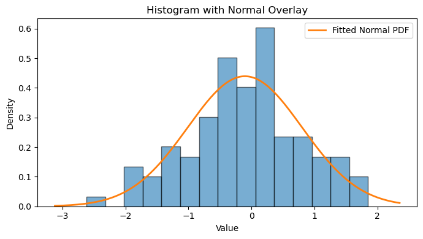
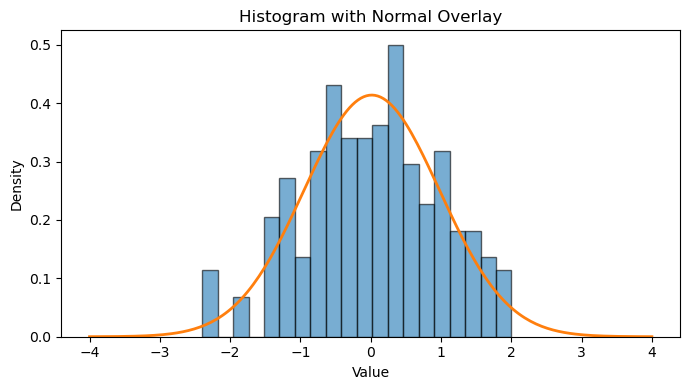
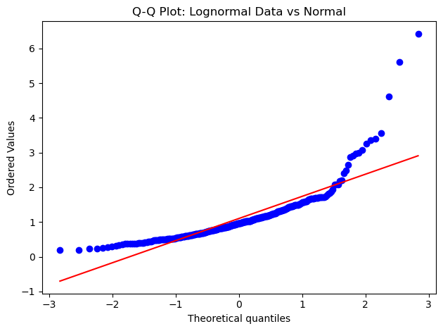
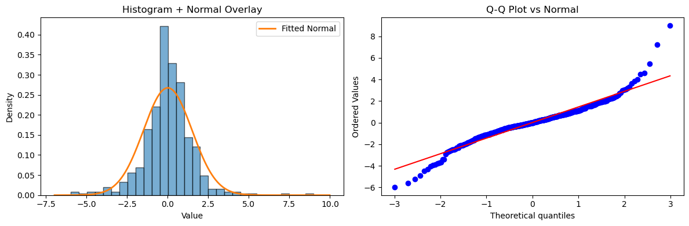

# 시각적 정규성 확인

## 개요

시각적 방법은 자료가 정규분포를 따르는지 평가하는 직관적인 첫 단계를 제공한다. 형식적 가설검정을 수행하기 전에 히스토그램, 밀도 겹쳐 그리기, 분위수-분위수(Q-Q) 그림을 눈으로 살피면 치우침, 두꺼운 꼬리, 다봉성 등 정규성에서의 이탈을 드러낼 수 있다. 이 방법들은 자료가 *이탈하는지*뿐 아니라 *어떻게* 이탈하는지를 보여주어 형식적 검정을 보완한다.

## 정규 밀도를 겹친 히스토그램

가장 단순한 시각적 확인은 관측 자료의 히스토그램을 그리고 평균과 분산을 표본 추정값에 맞춘 정규분포의 확률밀도함수를 겹쳐 그리는 것이다.

$X_1, X_2, \ldots, X_n$을 독립인 확률표본이라 하자. 표본평균과 표본표준편차는

$$
\bar{X} = \frac{1}{n}\sum_{i=1}^{n} X_i, \qquad S = \sqrt{\frac{1}{n-1}\sum_{i=1}^{n}(X_i - \bar{X})^2}.
$$

적합된 정규 밀도는

$$
\hat{f}(x) = \frac{1}{S\sqrt{2\pi}} \exp\!\Bigl(-\frac{(x - \bar{X})^2}{2S^2}\Bigr).
$$

히스토그램 막대가 $\hat{f}$와 가깝게 맞으면 자료가 정규성과 일관된다.

<div class="exbox" markdown>

**보기 1.** <span class="diff easy" title="쉬움"></span> 히스토그램에 정규곡선 겹치기. $\mathcal{N}(0,1)$에서 $n = 100$개를 뽑아 구간 15개의 히스토그램에 적합 정규곡선을 겹친다. 자료는 **정말로** 정규다.

**(1)** 그려 보고 무엇이 읽히는지 말하시오. 구간 도수를 나열하여 **봉우리가 몇 개로 보이는지** 세고, 최고 막대가 적합 곡선을 몇 퍼센트 넘어서는지 적으시오.

**(2)** (1)에서 읽은 울퉁불퉁함이 자료의 성질인지 그림의 성질인지 가르시오. 구간 수를 바꾸어 보고, 세 구간 규칙(Sturges·Scott·Freedman–Diaconis)이 권하는 값과 비교하시오. 자료가 정규라는 것은 어떻게 확인하는가.

</div>

??? success "풀이"

    유도할 답이 있는 문제가 아니다. **그림에서 무엇이 읽히고 그중 무엇이 자료의 성질이 아닌가**가 이 보기의 전부다.

    **(1) 그림.**

    ```python
    import numpy as np
    from scipy import stats
    import matplotlib.pyplot as plt

    np.random.seed(42)

    n = 100
    data = np.random.normal(loc=0, scale=1, size=n)

    # 히스토그램에 적합한 정규곡선을 겹친다. 위치와 척도를 자료에서 뽑아 썼으므로
    # 남는 차이는 모양뿐이다. 다만 계급 수에 따라 인상이 달라지므로, 이 그림만으로
    # 판단하지 말고 Q-Q 그림과 함께 본다.
    fig, ax = plt.subplots(figsize=(7, 4))
    ax.hist(data, bins=15, density=True, alpha=0.6, edgecolor="black")
    x_grid = np.linspace(data.min() - 0.5, data.max() + 0.5, 200)
    ax.plot(x_grid, stats.norm.pdf(x_grid, data.mean(), data.std(ddof=1)),
            linewidth=2, label="Fitted Normal PDF")
    ax.set_xlabel("Value")
    ax.set_ylabel("Density")
    ax.set_title("Histogram with Normal Overlay")
    ax.legend()
    plt.tight_layout()
    plt.show()
    ```

    

    **(2) 구간 수를 흔들고 검정으로 확인한다.**

    ```python
    import numpy as np
    from scipy import stats

    np.random.seed(42)
    n = 100
    data = np.random.normal(loc=0, scale=1, size=n)

    mu, s = data.mean(), data.std(ddof=1)
    dens, bins = np.histogram(data, bins=15, density=True)
    cnt, _ = np.histogram(data, bins=15)
    ctr = (bins[:-1] + bins[1:]) / 2


    def n_peaks(counts):
        pad = np.r_[-1.0, counts.astype(float), -1.0]
        return int(np.sum((pad[1:-1] > pad[:-2]) & (pad[1:-1] >= pad[2:])))


    print(f"평균 = {mu:.4f}   S(ddof=1) = {s:.4f}   구간 폭 = {bins[1] - bins[0]:.4f}")
    print(f"구간 도수: {cnt}")
    print(f"구간당 평균 도수 = {cnt.mean():.2f}   봉우리 {n_peaks(cnt)}개   빈 구간 {int((cnt == 0).sum())}개")

    diff = dens - stats.norm.pdf(ctr, mu, s)
    j = int(np.abs(diff).argmax())
    print(f"최고 막대 밀도 = {dens.max():.4f} @ {ctr[int(dens.argmax())]:+.3f}"
          f"   적합 곡선 최대 = {stats.norm.pdf(mu, mu, s):.4f} @ {mu:+.3f}")
    print(f"가장 어긋난 구간: 중심 {ctr[j]:+.3f}  막대 {dens[j]:.4f}  곡선 {stats.norm.pdf(ctr[j], mu, s):.4f}"
          f"  차 {diff[j]:+.4f} ({100 * diff[j] / stats.norm.pdf(ctr[j], mu, s):.0f}%)")

    print("\n같은 자료, 구간 수만 바꾼다:")
    for m in (5, 8, 10, 15, 20, 30):
        c, b = np.histogram(data, bins=m)
        print(f"  구간 {m:2d}개  폭 {b[1] - b[0]:.3f}  봉우리 {n_peaks(c)}개"
              f"  빈 구간 {int((c == 0).sum())}개  최대 도수 {c.max():2d}")

    q1, q3 = np.percentile(data, [25, 75])
    rg = data.max() - data.min()
    print(f"\n권장 구간 수:  Sturges {1 + np.log2(n):.2f}"
          f"   Scott {rg / (3.49 * s * n ** (-1 / 3)):.2f}"
          f"   FD {rg / (2 * (q3 - q1) * n ** (-1 / 3)):.2f}")

    print(f"\n이 표본은 실제로 정규인가:")
    print(f"  Shapiro-Wilk  p = {stats.shapiro(data).pvalue:.4f}")
    print(f"  D'Agostino K2 p = {stats.normaltest(data).pvalue:.4f}")
    print(f"  G1 = {stats.skew(data, bias=False):.4f}   G2 = {stats.kurtosis(data, bias=False):.4f}")
    ```

    출력:

    ```text
    평균 = -0.1038   S(ddof=1) = 0.9082   구간 폭 = 0.2981
    구간 도수: [ 1  0  4  3  6  5  9 15 12 18  7  7  5  5  3]
    구간당 평균 도수 = 6.67   봉우리 5개   빈 구간 1개
    최고 막대 밀도 = 0.6038 @ +0.213   적합 곡선 최대 = 0.4393 @ -0.104
    가장 어긋난 구간: 중심 +0.213  막대 0.6038  곡선 0.4134  차 +0.1903 (46%)

    같은 자료, 구간 수만 바꾼다:
      구간  5개  폭 0.894  봉우리 1개  빈 구간 0개  최대 도수 36
      구간  8개  폭 0.559  봉우리 1개  빈 구간 0개  최대 도수 23
      구간 10개  폭 0.447  봉우리 3개  빈 구간 0개  최대 도수 21
      구간 15개  폭 0.298  봉우리 5개  빈 구간 1개  최대 도수 18
      구간 20개  폭 0.224  봉우리 7개  빈 구간 1개  최대 도수 14
      구간 30개  폭 0.149  봉우리 9개  빈 구간 4개  최대 도수 10

    권장 구간 수:  Sturges 7.64   Scott 6.55   FD 10.31

    이 표본은 실제로 정규인가:
      Shapiro-Wilk  p = 0.6552
      D'Agostino K2 p = 0.7501
      G1 = -0.1779   G2 = -0.1010
    ```

    **(1) 읽기.** 구간 도수가

    $$
    1,\ 0,\ 4,\ 3,\ 6,\ 5,\ 9,\ 15,\ 12,\ 18,\ 7,\ 7,\ 5,\ 5,\ 3
    $$

    이다. 오르내림을 세면 **봉우리가 5개**이고 **빈 구간도 하나** 있다. 가운데에서 $15 \to 12 \to 18$로 한 번 꺼졌다가 다시 솟는 자리가 특히 눈에 띈다. 최고 막대는 밀도 $0.6038$로 그 자리의 적합 곡선 $0.4134$를 **$46\%$ 넘어선다.** 적합 곡선의 최대 $0.4393$과 견주어도 $37\%$ 높다. 봉우리의 자리도 어긋난다. 최고 막대의 중심이 $+0.213$인데 표본평균은 $-0.104$다.

    그림만 보고 적으면 "가운데가 이봉 같고, 봉우리가 곡선보다 많이 높고, 봉우리 자리도 평균에서 밀려 있으니 정규가 아닌 듯하다"가 된다. **그 결론은 전부 틀렸다.**

    **(2) 울퉁불퉁함은 그림의 성질이다.** 두 가지가 그것을 보인다.

    첫째, **자료는 정규를 잘 통과한다.** 샤피로–윌크 $p = 0.655$, 다고스티노 $K^2$ $p = 0.750$이고 $G_1 = -0.178$, $G_2 = -0.101$로 둘 다 0에 붙어 있다(보정판이다. `bias=False`를 주었다). 애초에 $\mathcal{N}(0,1)$에서 뽑은 자료이니 당연한 일이다.

    둘째, **봉우리 개수가 구간 수만 따라 움직인다.** 자료는 한 번도 바뀌지 않았다.

    | 구간 수 | 5 | 8 | 10 | 15 | 20 | 30 |
    |---|---|---|---|---|---|---|
    | 봉우리 | 1 | 1 | 3 | **5** | 7 | 9 |
    | 빈 구간 | 0 | 0 | 0 | 1 | 1 | 4 |

    8개 이하에서는 봉우리가 하나뿐이다. 그리고 **세 구간 규칙이 모두 그 아래쪽을 권한다.** Sturges $7.64$, Scott $6.55$, Freedman–Diaconis $10.31$이다. 쪽에서 쓴 `bins=15`는 세 권고값을 모두 넘어서니 **$n = 100$에 비해 구간이 너무 많다.**

    까닭은 산술로 분명하다. 구간당 평균 도수가 $6.67$개뿐이다. 각 구간의 도수는 대략 평균 $6.67$의 포아송처럼 흔들리므로 표준편차가 $\sqrt{6.67} = 2.58$, 곧 상대변동이 $39\%$다. **인접한 막대의 높이가 $40\%$씩 들쭉날쭉한 것이 정상이고**, 가운데의 $15 \to 12 \to 18$ 같은 골은 그 변동이 만든 것이다. 최고 막대가 곡선을 $46\%$ 넘어선 것도 같은 크기의 잡음이다.

    **따라서 이 그림에서 읽어야 할 것은 "대략 종 모양이다"까지이고, 봉우리의 개수·높이·위치는 읽어서는 안 된다.** 이 쪽의 '정리하며'는 히스토그램의 강점이 다봉성이라고 적어 두었는데, 그 강점은 $n$이 넉넉할 때의 이야기다. $n = 100$에서는 **없는 다봉성을 만들어 내는 쪽이 먼저다.**

    실무에서 할 일은 둘이다. 구간 수를 몇 가지로 바꿔 그려 **어느 선택에서도 남는 특징만 인정하는 것**, 그리고 Q-Q 그림이나 형식적 검정으로 **그림의 인상을 따로 확인하는 것**이다. 여기서는 구간 8개 이하에서 봉우리가 하나로 합쳐지고 두 검정이 모두 통과하므로, 단봉 정규라고 판단하는 것이 옳다.

## 커널밀도추정

커널밀도추정(KDE)은 히스토그램을 매끄럽게 만들어 다봉성이나 비대칭을 발견하는 데 유용하다. Gauss 핵과 띠너비 $h$를 쓰면 KDE는

$$
\hat{f}_h(x) = \frac{1}{nh}\sum_{i=1}^{n} \phi\!\Bigl(\frac{x - X_i}{h}\Bigr),
$$

여기서 $\phi$는 표준정규 밀도이다. 이를 적합된 정규 곡선과 겹쳐 그린다. 체계적인 차이가 보이면 정규성에서의 이탈을 나타낸다.

## Q-Q 그림

분위수-분위수(Q-Q) 그림은 가장 정보량이 많은 단일 시각적 정규성 확인법이다. 각 순서통계량 $X_{(i)}$에 대해 대응하는 이론적 분위수를 계산하고

$$
q_i = \Phi^{-1}\!\Bigl(\frac{i - 0.5}{n}\Bigr),
$$

쌍 $(q_i,\, X_{(i)})$를 그린다. 정규성 아래에서는 점들이 대략 직선 위에 놓인다. 흔한 이탈에는 알아볼 수 있는 특징이 있다.

| 패턴 | 이탈 |
|---|---|
| S자 곡선 | 두꺼운 꼬리(고첨) |
| 아래로 볼록한 호(양 끝이 선 위로) | 오른쪽 치우침 |
| 위로 볼록한 호(양 끝이 선 아래로) | 왼쪽 치우침 |
| 계단 모양 | 이산성 또는 반올림 |

!!! note "치우침의 곡률 방향"
    오른쪽으로 치우친 자료를 $(q_i, X_{(i)})$로 그리면 곡선이 **아래로 볼록**(convex)해진다. 왼쪽 꼬리에서는 표본분위수가 기대보다 덜 음수라 선 위에 있고, 오른쪽 꼬리에서는 기대보다 더 양수라 역시 선 위에 있기 때문이다. 곧 양 끝이 모두 선 위로 올라간다. 왼쪽 치우침은 그 반대로 위로 볼록(concave)해진다.

## 해석

시각적 확인은 주관적이지만 매우 값지다. 뚜렷하게 이봉인 히스토그램, 두드러진 비대칭을 드러내는 KDE, 꼬리에서 급격히 휘는 Q-Q 그림은 모두 형식적 정규성 검정이 기각할 가능성이 높음을 알린다. 반대로 시각적 확인이 깨끗해 보이면 형식적 검정의 애매한 $p$값을 덜 걱정해도 된다. 균형 잡힌 평가를 위해 언제나 시각적 방법과 형식적 방법을 함께 쓰라.

## 연습문제

<div class="drillbox" markdown>

**연습문제 1.** <span class="diff easy" title="쉬움"></span> 표준정규분포에서 관측값 $n = 200$개를 생성하라. 구간 20개의 히스토그램을 그리고 적합된 정규 밀도를 겹쳐라. 적합에 대해 논평하라.

</div>

??? success "풀이"

    ```python
    import numpy as np
    from scipy import stats
    import matplotlib.pyplot as plt

    rng = np.random.default_rng(0)
    data = rng.normal(0, 1, size=200)

    fig, ax = plt.subplots(figsize=(7, 4))
    ax.hist(data, bins=20, density=True, alpha=0.6, edgecolor="black")
    x_grid = np.linspace(-4, 4, 200)
    ax.plot(x_grid, stats.norm.pdf(x_grid, data.mean(), data.std(ddof=1)),
            linewidth=2)
    ax.set_xlabel("Value")
    ax.set_ylabel("Density")
    ax.set_title("Histogram with Normal Overlay")
    plt.tight_layout()
    plt.show()
    ```

    

    표준정규 추출값 $n = 200$개이면 히스토그램 막대가 종 모양의 적합 곡선을 가깝게 따라간다. 표집변동으로 인한 작은 이탈은 예상되는 일이다. $\square$

<div class="drillbox" markdown>

**연습문제 2.** <span class="diff easy" title="쉬움"></span> $\text{Lognormal}(0, 0.6)$ 분포에서 관측값 $n = 300$개를 생성하라. 정규분포에 대한 Q-Q 그림을 만들고 관찰되는 모양을 기술하라.

</div>

??? success "풀이"

    ```python
    import numpy as np
    from scipy import stats
    import matplotlib.pyplot as plt

    rng = np.random.default_rng(1)
    data = rng.lognormal(0, 0.6, size=300)

    stats.probplot(data, dist="norm", plot=plt)
    plt.title("Q-Q Plot: Lognormal Data vs Normal")
    plt.tight_layout()
    plt.show()
    ```

    

    Q-Q 그림은 **아래로 볼록한**(convex, 위로 휘는) 곡선을 보인다. 자료의 위쪽 분위수가 이론적 정규분위수를 크게 넘어선다. 오른쪽 치우침의 전형적인 특징이다.

    수치로 확인해 보자. $\text{Lognormal}(0, 0.6)$의 1%, 50%, 99% 분위수는 각각 $e^{0.6 \times (-2.326)} = 0.248$, $1$, $e^{0.6 \times 2.326} = 4.04$이다. 중앙값에서 아래로는 $0.752$, 위로는 $3.04$ 떨어져 있어 위쪽이 네 배 넘게 길다. 왼쪽 아래 구간의 기울기는 작고 오른쪽 위 구간의 기울기는 크므로 곡선이 아래로 볼록해진다. $\square$

<div class="drillbox" markdown>

**연습문제 3.** <span class="diff med" title="중간"></span> Q-Q 그림이 정규성 이탈의 *유형*(예: 치우침 대 두꺼운 꼬리)을 드러낼 수 있는 반면 형식적 검정의 $p$값 하나로는 그럴 수 없는 이유를 설명하라.

</div>

??? success "풀이"

    형식적 정규성 검정은 정규성에서의 전반적 이탈을 재는 검정통계량과 $p$값 하나를 내놓는다. $p$값은 분포가 *어떻게* 벗어나는지에 대해 아무것도 말해 주지 않는다. 반면 Q-Q 그림은 모든 순서통계량을 그에 대응하는 이론값과 나란히 보여주므로, 이탈이 꼬리에서 일어나는지(두꺼운 꼬리는 S자를 만든다), 한쪽 꼬리에서만 일어나는지(치우침은 볼록하거나 오목한 호를 만든다), 중앙에서 일어나는지(다봉성은 계단이나 평평한 구역을 만든다) 볼 수 있다. 이 진단의 풍부함 때문에 형식적 검정과 함께 시각적 확인이 권장된다. $\square$

<div class="drillbox" markdown>

**연습문제 4.** <span class="diff hard" title="어려움"></span> 연속분포 $F$에서 크기 $n$인 확률표본을 뽑았을 때, $F = \Phi$라는 귀무가설 아래에서 Q-Q 그림의 $i$번째 순서통계량 플로팅 위치의 기댓값이 근사적으로 $\Phi^{-1}\!\bigl(\frac{i - 0.5}{n}\bigr)$임을 보여라.

</div>

??? success "풀이"

    $F = \Phi$ 아래에서 확률적분변환에 의해 $U_i = \Phi(X_i) \sim \text{Uniform}(0,1)$이다. 균등표본의 $i$번째 순서통계량 $U_{(i)}$는 $\mathbb{E}[U_{(i)}] = \frac{i}{n+1}$을 만족한다. $n$이 크면 Blom 근사가 이를 $p_i = \frac{i - 0.375}{n + 0.25} \approx \frac{i - 0.5}{n}$으로 바꾸며, 이는 경계 근처에서 균등 순서통계량의 편향을 보정한다. 여기에 $\Phi^{-1}$을 적용하면 이론적 분위수 $q_i = \Phi^{-1}(p_i)$를 얻는다. 자료가 정말로 $\Phi$에서 왔다면 정렬된 표본값 $X_{(i)}$가 $\mathbb{E}[X_{(i)}] \approx q_i$를 만족하므로 Q-Q 그림이 항등선 위에 놓일 것으로 기대된다. $\square$

<div class="drillbox" markdown>

**연습문제 5.** <span class="diff med" title="중간"></span> 자료 배열을 받아 (a) 정규 밀도를 겹친 히스토그램과 (b) Q-Q 그림을 나란히 배치한 그림을 만드는 Python 함수를 작성하라. 자유도 4인 $t$ 분포 자료로 시험하라.

</div>

??? success "풀이"

    ```python
    import numpy as np
    from scipy import stats
    import matplotlib.pyplot as plt

    def normality_panel(data):
        fig, axes = plt.subplots(1, 2, figsize=(12, 4))

        # 히스토그램에 정규곡선을 겹친다
        ax = axes[0]
        ax.hist(data, bins=30, density=True, alpha=0.6, edgecolor="black")
        x_grid = np.linspace(data.min() - 1, data.max() + 1, 300)
        ax.plot(x_grid,
                stats.norm.pdf(x_grid, data.mean(), data.std(ddof=1)),
                linewidth=2, label="Fitted Normal")
        ax.set_title("Histogram + Normal Overlay")
        ax.set_xlabel("Value")
        ax.set_ylabel("Density")
        ax.legend()

        # Q-Q 그림
        ax = axes[1]
        stats.probplot(data, dist="norm", plot=ax)
        ax.set_title("Q-Q Plot vs Normal")

        plt.tight_layout()
        plt.show()

    rng = np.random.default_rng(42)
    t_data = rng.standard_t(df=4, size=500)
    normality_panel(t_data)
    ```

    

    $t_4$ 자료에서 히스토그램은 정규 곡선보다 두꺼운 꼬리를 보인다($\pm 3$ 바깥에 질량이 더 많다). Q-Q 그림은 특징적인 S자를 보인다. 왼쪽 아래 점들은 선 아래로, 오른쪽 위 점들은 선 위로 휘어 초과첨도를 확인해 준다. $\square$

---

## 정리하며

세 그림이 **서로 다른 것을 보여 준다.**

| 그림 | 잘 보이는 것 | 놓치는 것 |
|---|---|---|
| 히스토그램 | 전체 모양, 다봉성 | 꼬리 |
| Q-Q | 꼬리, 치우침 | 다봉성 |
| 상자그림 | 대칭성, 이상점 | 모양의 세부 |

- **시각적 방법의 강점은 "어떻게 다른지"를 보여 준다는 것이다.** 형식적 검정은 기각 여부만 말하고 이탈의 **성격**은 말하지 않는다.
- **셋을 함께 그리는 것이 기본 절차다.** 하나만으로는 반드시 무언가를 놓친다.
- **표본이 작으면 그림도 불안정하다.** $n=20$ 이면 정규 자료에서도 Q-Q 가 꽤 흔들리며, 다음 절의 신뢰띠가 그 판단을 돕는다.
- **검정보다 먼저 그림을 본다.** 검정 결과를 해석하려면 이탈의 모양을 알아야 하기 때문이다.

다음 절 **Q-Q 그림 기초**로 넘어간다.
