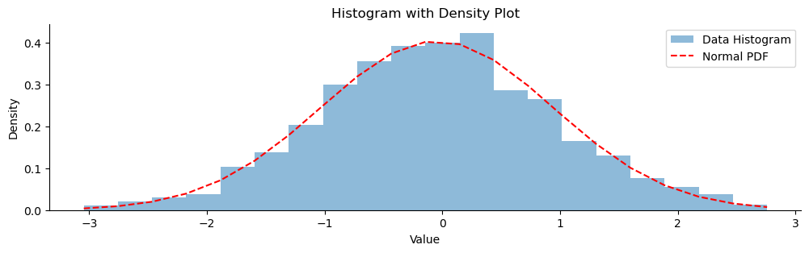
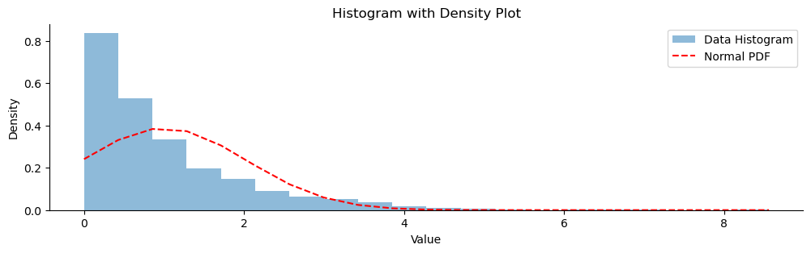
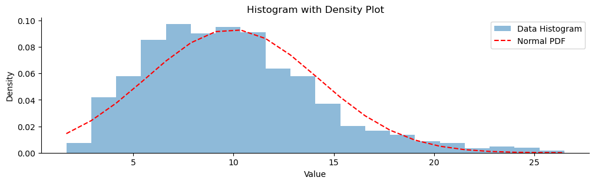
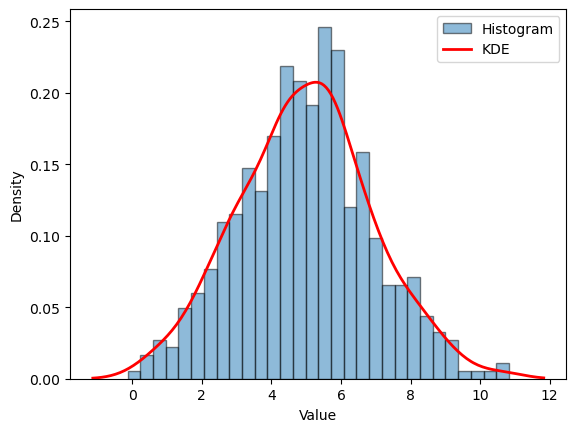

# 히스토그램과 밀도 그림

시각적 방법은 자료가 정규분포를 따르는지 평가하는 눈으로 보는 접근을 제공한다. 형식적 통계검정은 아니지만 자료의 분포를 이해하는 데 유용한 통찰을 준다.

## 개요

**히스토그램**은 자료의 분포를 그림으로 나타낸 것이다. 자료를 구간으로 나누고 각 구간에 자료점이 얼마나 자주 들어가는지 보여준다. 자료가 정규분포를 따르면 히스토그램이 익숙한 종 모양 곡선에 가까워야 한다. **밀도 그림**도 비슷하지만 분포를 나타내는 매끄러운 곡선을 제공한다.

## 정규 표본에 정규 확률밀도함수 겹치기

<div class="exbox" markdown>

**보기 1.** <span class="diff easy" title="쉬움"></span> 정규 표본에 정규 곡선 겹치기. $\mathcal{N}(0,1)$에서 $n = 1000$개를 뽑아 구간 20개의 히스토그램을 그리고, 표본평균과 표본표준편차로 맞춘 정규 확률밀도함수를 겹친다.

**(1)** 그려 보고 무엇이 읽히는지 말하시오. **히스토그램에서 가장 높은 막대가 표본평균 자리에 서는가**를 수로 확인하시오.

**(2)** **자료를 그대로 둔 채 구간 수만** 5, 10, 20, 40, 80, 160으로 바꾸어 히스토그램의 봉우리(국소최대) 개수를 세시오. 완전히 정규인 자료에서 봉우리가 몇 개까지 생기는가. 이로부터 "히스토그램에 봉우리가 여러 개 보인다"는 관찰을 어떻게 다루어야 하는가.

</div>

??? success "풀이"

    유도할 답이 있는 문제가 아니다. **그림이 무엇을 보여 주고 무엇을 만들어 내는가**가 전부다.

    **(1) 그림.**

    ```python
    import numpy as np
    import matplotlib.pyplot as plt
    from scipy import stats

    plt.rcParams["font.family"] = "Apple SD Gothic Neo"
    plt.rcParams["axes.unicode_minus"] = False

    def plot_histogram_with_density(data, figsize=(12, 3)):
        """히스토그램에 적합한 정규 확률밀도함수를 겹쳐 그린다.

        자료의 평균과 표준편차로 만든 곡선이므로 위치와 척도는 이미 맞아 있다.
        남는 차이는 오직 모양이다.

        매개변수
        --------
        data : 그릴 자료
        figsize : 그림 크기 (가로, 세로)
        """
        fig, ax = plt.subplots(figsize=figsize)

        # density=True 로 넓이의 합을 1 로 맞춰야 확률밀도함수와 겹칠 수 있다.
        _, bins, _ = ax.hist(data, bins=20, density=True, alpha=0.5, label="Data Histogram")

        mu = data.mean()
        sigma = data.std()
        pdf = stats.norm(loc=mu, scale=sigma).pdf(bins)

        ax.plot(bins, pdf, "--r", label="Normal PDF")

        ax.spines["top"].set_visible(False)
        ax.spines["right"].set_visible(False)

        ax.set_title('Histogram with Density Plot')
        ax.set_xlabel('Value')
        ax.set_ylabel('Density')
        ax.legend()

        plt.show()

    if __name__ == "__main__":
        # 정규자료: 곡선이 히스토그램에 잘 얹힌다.
        np.random.seed(0)
        sample_data = np.random.normal(loc=0, scale=1, size=1000)
        plot_histogram_with_density(sample_data)
    ```

    

    **(2) 구간 수를 흔들어 본다.**

    ```python
    import numpy as np
    from scipy import stats

    np.random.seed(0)
    x = np.random.normal(loc=0, scale=1, size=1000)

    # 쪽의 함수가 쓰는 것과 같은 설정: bins=20, density=True, sigma = std(ddof=0).
    mu, sigma = x.mean(), x.std()
    dens, bins = np.histogram(x, bins=20, density=True)
    cnt, _ = np.histogram(x, bins=20)
    k = int(dens.argmax())

    print(f"mu = {mu:.4f}   sigma(ddof=0) = {sigma:.4f}   sigma(ddof=1) = {x.std(ddof=1):.4f}")
    print(f"구간 폭 = {bins[1] - bins[0]:.4f}   구간 수 = 20")
    print(f"최고 막대 밀도 = {dens.max():.4f} @ 구간중심 {(bins[k] + bins[k + 1]) / 2:+.4f}")
    print(f"정규 pdf 최대  = {stats.norm(mu, sigma).pdf(mu):.4f} @ mu = {mu:+.4f}")
    print(f"양끝 구간 도수: {cnt[:3]} ... {cnt[-3:]}")


    def n_peaks(counts):
        """막대 높이에서 국소최대의 개수를 센다."""
        pad = np.r_[-1.0, counts.astype(float), -1.0]
        return int(np.sum((pad[1:-1] > pad[:-2]) & (pad[1:-1] >= pad[2:])))


    print("\n구간 수를 바꿔 가며 봉우리를 센다 (자료는 그대로다):")
    for m in (5, 10, 20, 40, 80, 160):
        c, b = np.histogram(x, bins=m)
        print(f"  구간 {m:3d}개  폭 {b[1] - b[0]:.4f}  봉우리 {n_peaks(c):2d}개"
              f"  최고 도수 {c.max():3d}  빈 구간 {int((c == 0).sum()):2d}개")

    n = len(x)
    q1, q3 = np.percentile(x, [25, 75])
    h_fd = 2 * (q3 - q1) * n ** (-1 / 3)
    h_sc = 3.49 * x.std(ddof=1) * n ** (-1 / 3)
    rng_ = x.max() - x.min()
    print(f"\nSturges  k = 1 + log2(n) = {1 + np.log2(n):.2f}")
    print(f"Scott    h = {h_sc:.4f}  ->  k = {rng_ / h_sc:.2f}")
    print(f"FD       h = {h_fd:.4f}  ->  k = {rng_ / h_fd:.2f}")
    ```

    출력:

    ```text
    mu = -0.0453   sigma(ddof=0) = 0.9870   sigma(ddof=1) = 0.9875
    구간 폭 = 0.2903   구간 수 = 20
    최고 막대 밀도 = 0.4237 @ 구간중심 +0.2920
    정규 pdf 최대  = 0.4042 @ mu = -0.0453
    양끝 구간 도수: [3 6 9] ... [16 11  4]

    구간 수를 바꿔 가며 봉우리를 센다 (자료는 그대로다):
      구간   5개  폭 1.1611  봉우리  1개  최고 도수 456  빈 구간  0개
      구간  10개  폭 0.5805  봉우리  1개  최고 도수 239  빈 구간  0개
      구간  20개  폭 0.2903  봉우리  1개  최고 도수 123  빈 구간  0개
      구간  40개  폭 0.1451  봉우리 10개  최고 도수  64  빈 구간  0개
      구간  80개  폭 0.0726  봉우리 27개  최고 도수  37  빈 구간  5개
      구간 160개  폭 0.0363  봉우리 53개  최고 도수  25  빈 구간 23개

    Sturges  k = 1 + log2(n) = 10.97
    Scott    h = 0.3446  ->  k = 16.84
    FD       h = 0.2611  ->  k = 22.24
    ```

    **(1) 읽기.** 곡선과 막대가 전체적으로 잘 겹친다. 겹치는 것이 당연한 까닭을 먼저 짚어 두어야 한다. 곡선의 모수를 자료에서 뽑아 썼으므로 **위치와 척도는 맞을 수밖에 없다.** 남는 비교 대상은 모양뿐이다. 높이로 재면 최고 막대가 밀도 $0.4237$, 정규곡선의 최대가 $0.4042$로 $4.8\%$ 차이이고, 양끝 구간의 도수가 좌 $3, 6, 9$ 대 우 $16, 11, 4$로 대략 맞물린다.

    그런데 **가장 높은 막대는 표본평균 자리에 서지 않는다.** 최고 막대의 중심이 $+0.2920$인데 표본평균은 $-0.0453$이다. 차이 $0.337$은 구간 폭 $0.2903$의 $1.16$배이니, 봉우리가 한 칸 넘게 비껴 있다. 자료가 **정확히** 정규인데도 그렇다. 구간별 도수는 이항변동을 가지므로 최고 막대의 위치는 잡음이 많은 추정량이고, **최빈 구간의 위치로 중심을 읽으려 해서는 안 된다.** 중심을 알고 싶으면 평균이나 중앙값을 계산해야 한다.

    두 가지를 더 적어 둔다. 함수가 쓰는 `data.std()`는 `ddof=0`이라 $\hat\sigma = 0.9870$이고 표본표준편차 $S = 0.9875$와 다르다. $n = 1000$에서는 차이가 $0.05\%$라 그림에서 보이지 않지만 작은 표본에서는 문제가 된다. 또 `pdf(bins)`는 확률밀도함수를 **구간 경계 21개에서만** 계산한다. 곧 빨간 "곡선"은 21점을 이은 꺾은선이다. 구간을 20개로 둔 지금은 매끄럽게 보이지만, 구간 수를 줄이면 꺾임이 눈에 드러난다.

    **(2) 봉우리 개수는 구간 수가 정한다.** 자료는 한 번도 바뀌지 않았다. 그런데도

    | 구간 수 | 5 | 10 | 20 | 40 | 80 | 160 |
    |---|---|---|---|---|---|---|
    | 봉우리 | 1 | 1 | 1 | **10** | **27** | **53** |
    | 빈 구간 | 0 | 0 | 0 | 0 | 5 | 23 |

    로 변한다. **완전히 정규인 자료에서 봉우리가 53개까지 보인다.** 구간 폭이 $0.0363$으로 좁아지면 구간마다 평균 6개쯤만 들어가고, 그 도수의 변동이 그대로 들쭉날쭉한 톱니가 되기 때문이다. 160개 구간에서는 비어 있는 구간도 23개나 생겨 자료에 빈틈이 있는 것처럼 보인다. 없는 빈틈이다.

    경계는 20개와 40개 사이에 있다. 그리고 세 가지 구간 규칙이 모두 그 아래쪽을 가리킨다. Sturges $k = 10.97$, Scott $k = 16.84$, Freedman–Diaconis $k = 22.24$다. 쪽에서 쓴 `bins=20`은 이 세 값의 범위 안에 있으니 적절한 선택이었다.

    따라서 **"히스토그램에 봉우리가 여러 개 보인다"는 관찰은 그 자체로는 아무 정보도 아니다.** 구간 수를 함께 보고해야 하고, 더 나은 방법은 구간 수를 몇 가지로 바꿔 그려 **어느 선택에서도 남는 봉우리만 실제 봉우리로 인정하는 것**이다. 위 표에서는 어떤 구간 수에서도 봉우리가 둘로 갈라지지 않으므로 이 자료는 단봉이라고 판단할 수 있다. 커널밀도추정도 같은 문제를 띠폭의 이름으로 겪는다.

!!! note "`density=True`가 핵심이다"
    `ax.hist(..., density=True)`가 히스토그램의 전체 넓이를 1로 만들어 준다. 이렇게 해야 확률밀도함수 곡선과 같은 척도가 되어 비교가 의미를 갖는다. 빈도(도수)를 그대로 그리면 두 곡선의 척도가 완전히 달라 겹쳐 그리는 것이 무의미해진다.

## 지수 표본에 정규 확률밀도함수 겹치기

<div class="exbox" markdown>

**보기 2.** <span class="diff easy" title="쉬움"></span> 지수 표본에 정규 곡선 겹치기. $\text{Exponential}(1)$에서 $n = 1000$개를 뽑아 보기 1과 똑같이 구간 20개의 히스토그램에 적합 정규곡선을 겹친다.

**(1)** 봉우리의 자리와 높이를 **수로** 비교하시오. 히스토그램의 최고 막대와 정규곡선의 최대가 어디에 서고 높이 비가 얼마인가.

**(2)** 겹쳐 그린 정규곡선은 **지수 자료가 있을 수 없는 구간**까지 뻗는다. 그 구간에 곡선이 놓는 확률질량이 얼마인지 구하시오. 이것이 왜 "모수를 자료에서 맞추었으므로 적어도 위치와 척도는 맞다"는 변명을 무너뜨리는가.

</div>

??? success "풀이"

    **(1)·(2) 그림과 수치.** 보기 1과 같은 함수에 자료만 바꾸어 넣는다.

    ```python
    import numpy as np
    import matplotlib.pyplot as plt
    from scipy import stats

    plt.rcParams["font.family"] = "Apple SD Gothic Neo"
    plt.rcParams["axes.unicode_minus"] = False

    def plot_histogram_with_density(data, figsize=(12, 3)):
        """히스토그램에 적합한 정규 확률밀도함수를 겹쳐 그린다.

        자료의 평균과 표준편차로 만든 곡선이므로, 위치와 척도는 이미 맞아
        있다. 남는 차이는 오직 모양이다.
        """
        fig, ax = plt.subplots(figsize=figsize)
        _, bins, _ = ax.hist(data, bins=20, density=True, alpha=0.5, label="Data Histogram")

        mu = data.mean()
        sigma = data.std()
        pdf = stats.norm(loc=mu, scale=sigma).pdf(bins)
        ax.plot(bins, pdf, "--r", label="Normal PDF")

        ax.spines["top"].set_visible(False)
        ax.spines["right"].set_visible(False)
        ax.set_title('Histogram with Density Plot')
        ax.set_xlabel('Value')
        ax.set_ylabel('Density')
        ax.legend()
        plt.show()

    if __name__ == "__main__":
        # 지수자료: 곡선이 왼쪽에서 음수 구간까지 뻗어 나가고 봉우리 자리도
        # 어긋난다. 정규로 볼 수 없다는 것이 한눈에 보인다.
        np.random.seed(0)
        sample_data = np.random.exponential(scale=1, size=1000)
        plot_histogram_with_density(sample_data)
    ```

    

    ```python
    import numpy as np
    from scipy import stats

    np.random.seed(0)
    x = np.random.exponential(scale=1, size=1000)

    mu, sigma = x.mean(), x.std()
    dens, bins = np.histogram(x, bins=20, density=True)
    cnt, _ = np.histogram(x, bins=20)
    fit = stats.norm(mu, sigma)
    k = int(dens.argmax())

    print(f"mu = {mu:.4f}   sigma = {sigma:.4f}   (Exp(1) 의 참값은 둘 다 1)")
    print(f"구간 폭 = {bins[1] - bins[0]:.4f}")
    print(f"최고 막대 밀도 = {dens.max():.4f} @ 구간중심 {(bins[k] + bins[k + 1]) / 2:.4f}")
    print(f"정규 pdf 최대  = {fit.pdf(mu):.4f} @ mu = {mu:.4f}   (높이 비 {dens.max() / fit.pdf(mu):.2f})")
    print(f"자료 최소 = {x.min():.4f},  Exp 의 참 최빈값 = 0")
    print(f"왼쪽 세 구간 도수 = {cnt[:3]},  오른쪽 세 구간 = {cnt[-3:]}")

    # 적합한 정규가 음수 구간에 얼마나 질량을 놓는가. 지수자료는 거기 있을 수 없다.
    print(f"P(적합 정규 < 0) = {fit.cdf(0):.6f} = {100 * fit.cdf(0):.2f}%")
    print(f"실제로 음수인 관측값 = {int((x < 0).sum())}개")
    print(f"g1 = {stats.skew(x):.4f}  (Exp 의 이론 왜도 = 2)")
    print(f"g2 = {stats.kurtosis(x):.4f}  (Exp 의 이론 초과첨도 = 6)")
    ```

    출력:

    ```text
    mu = 1.0035   sigma = 1.0291   (Exp(1) 의 참값은 둘 다 1)
    구간 폭 = 0.4280
    최고 막대 밀도 = 0.8387 @ 구간중심 0.2146
    정규 pdf 최대  = 0.3877 @ mu = 1.0035   (높이 비 2.16)
    자료 최소 = 0.0005,  Exp 의 참 최빈값 = 0
    왼쪽 세 구간 도수 = [359 226 143],  오른쪽 세 구간 = [0 0 1]
    P(적합 정규 < 0) = 0.164738 = 16.47%
    실제로 음수인 관측값 = 0개
    g1 = 2.0526  (Exp 의 이론 왜도 = 2)
    g2 = 6.4761  (Exp 의 이론 초과첨도 = 6)
    ```

    **(1) 봉우리가 두 가지로 어긋난다.** 자리가 어긋난다. 히스토그램의 최고 막대는 맨 왼쪽 구간(중심 $0.2146$)이고 정규곡선의 최대는 $\mu = 1.0035$에 있다. 구간 폭 $0.4280$으로 재면 **두 봉우리가 1.8칸 떨어져 있다.** 지수분포의 참 최빈값이 0이므로 이는 표본의 우연이 아니다. 높이도 어긋난다. 최고 막대가 밀도 $0.8387$, 정규곡선의 최대가 $0.3877$로 **히스토그램 쪽이 2.16배 높다.** 왼쪽 세 구간에 $359 + 226 + 143 = 728$개, 곧 자료의 $73\%$가 몰려 있는데 대칭곡선으로는 이런 집중을 흉내낼 수 없다.

    오른쪽도 보아야 한다. 오른쪽 세 구간의 도수가 $0, 0, 1$이다. 히스토그램에서는 이 막대들이 거의 보이지 않으므로 **꼬리가 얼마나 긴지를 이 그림에서 읽어 내기는 어렵다.** 두꺼운 꼬리의 진단은 Q-Q 그림의 몫이다. 표본 모양 통계량은 $g_1 = 2.053$, $g_2 = 6.476$으로 지수분포의 이론값 $2$와 $6$에 가깝다(`scipy.stats.skew`·`kurtosis`의 기본값 `bias=True`·`fisher=True`를 쓴 보정하지 않은 초과첨도 판본이다).

    **(2) 적합 정규는 음수 구간에 $16.47\%$를 놓는다.** 표본평균 $\mu = 1.0035$, 표본표준편차 $\sigma = 1.0291$로 맞춘 곡선에서

    $$
    P(\text{적합 정규} < 0) = \Phi\!\left(\frac{0 - 1.0035}{1.0291}\right) = \Phi(-0.9751) = 0.1647
    $$

    이다. 그런데 지수분포의 지지집합은 $[0, \infty)$이고 실제로 음수인 관측값은 **0개**다. 곧 **적합된 모형이 전체 확률의 6분의 1을 자료가 존재할 수 없는 곳에 버리고 있다.**

    이것이 "모수를 자료에서 맞추었으니 위치와 척도는 맞다"는 변명을 무너뜨리는 자리다. 그 말은 참이다. 평균과 분산은 정의상 맞아 있다. 그러나 **평균과 분산을 맞추는 것이 분포를 맞추는 것이 아니다.** 지지집합부터 틀렸고, 모양이 틀렸고, 그래서 이 모형으로 계산한 확률은 전부 틀린다. 보기 1에서 곡선과 막대가 잘 겹친 것은 모수를 맞췄기 때문이 아니라 자료가 실제로 정규였기 때문이다. **적합의 자유도 두 개로는 모양의 결함을 가릴 수 없다** — 이것이 겹쳐 그리기가 진단으로서 쓸모를 갖는 이유다.

## 카이제곱 표본에 정규 확률밀도함수 겹치기

<div class="exbox" markdown>

**보기 3.** <span class="diff easy" title="쉬움"></span> 카이제곱 표본에 정규 곡선 겹치기. $\chi^2_{10}$에서 $n = 1000$개를 뽑아 보기 1·2와 똑같이 겹쳐 그린다. 이 경우는 지수보다 훨씬 정규에 가깝다.

**(1)** 막대와 곡선의 차를 **구간마다** 재어 가장 크게 어긋난 자리를 찾으시오. 그 자리에서 어긋남이 곡선 높이의 몇 퍼센트인가.

**(2)** 이 그림을 보고 "대략 정규로 보아도 되겠다"고 판단했다면 무엇을 놓치는가. **오른쪽 끝 구간**의 막대와 곡선을 수로 비교하여 답하시오.

</div>

??? success "풀이"

    **(1)·(2) 그림과 수치.**

    ```python
    import numpy as np
    import matplotlib.pyplot as plt
    from scipy import stats

    plt.rcParams["font.family"] = "Apple SD Gothic Neo"
    plt.rcParams["axes.unicode_minus"] = False

    def plot_histogram_with_density(data, figsize=(12, 3)):
        """히스토그램에 적합한 정규 확률밀도함수를 겹쳐 그린다.

        자료의 평균과 표준편차로 만든 곡선이므로, 위치와 척도는 이미 맞아
        있다. 남는 차이는 오직 모양이다.
        """
        fig, ax = plt.subplots(figsize=figsize)
        _, bins, _ = ax.hist(data, bins=20, density=True, alpha=0.5, label="Data Histogram")

        mu = data.mean()
        sigma = data.std()
        pdf = stats.norm(loc=mu, scale=sigma).pdf(bins)
        ax.plot(bins, pdf, "--r", label="Normal PDF")

        ax.spines["top"].set_visible(False)
        ax.spines["right"].set_visible(False)
        ax.set_title('Histogram with Density Plot')
        ax.set_xlabel('Value')
        ax.set_ylabel('Density')
        ax.legend()
        plt.show()

    if __name__ == "__main__":
        # 카이제곱(자유도 10): 지수보다 훨씬 가깝지만 왼쪽 어깨가 조금 어긋난다.
        np.random.seed(0)
        sample_data = np.random.chisquare(df=10, size=1000)
        plot_histogram_with_density(sample_data)
    ```

    

    ```python
    import numpy as np
    from scipy import stats

    np.random.seed(0)
    x = np.random.chisquare(df=10, size=1000)

    mu, sigma = x.mean(), x.std()
    dens, bins = np.histogram(x, bins=20, density=True)
    fit = stats.norm(mu, sigma)
    k = int(dens.argmax())
    ctr = (bins[:-1] + bins[1:]) / 2

    print(f"mu = {mu:.4f}   sigma = {sigma:.4f}   (chi2_10 의 참값: 10 과 sqrt(20) = {np.sqrt(20):.4f})")
    print(f"구간 폭 = {bins[1] - bins[0]:.4f}")
    print(f"최고 막대 밀도 = {dens.max():.4f} @ 구간중심 {ctr[k]:.4f}")
    print(f"정규 pdf 최대  = {fit.pdf(mu):.4f} @ mu = {mu:.4f}")
    print(f"chi2_10 의 참 최빈값 = d - 2 = 8")
    print(f"P(적합 정규 < 0) = {fit.cdf(0):.6f} = {100 * fit.cdf(0):.2f}%")

    # 막대와 곡선의 차이를 구간마다 재서 가장 크게 어긋난 자리를 찾는다.
    diff = dens - fit.pdf(ctr)
    j = int(np.abs(diff).argmax())
    print(f"가장 크게 어긋난 구간: 중심 {ctr[j]:.3f}, 막대 {dens[j]:.4f} - 곡선 {fit.pdf(ctr[j]):.4f}"
          f" = {diff[j]:+.4f}  (곡선의 {100 * diff[j] / fit.pdf(ctr[j]):+.1f}%)")
    print("구간중심 / 막대 / 곡선 / 차:")
    for i in range(0, 20, 2):
        print(f"  {ctr[i]:6.2f}  {dens[i]:.4f}  {fit.pdf(ctr[i]):.4f}  {diff[i]:+.4f}")
    print(f"g1 = {stats.skew(x):.4f}  (이론 sqrt(8/10) = {np.sqrt(0.8):.4f})")
    print(f"g2 = {stats.kurtosis(x):.4f}  (이론 12/10 = 1.2)")
    ```

    출력:

    ```text
    mu = 9.9224   sigma = 4.2793   (chi2_10 의 참값: 10 과 sqrt(20) = 4.4721)
    구간 폭 = 1.2419
    최고 막대 밀도 = 0.0974 @ 구간중심 7.2509
    정규 pdf 최대  = 0.0932 @ mu = 9.9224
    chi2_10 의 참 최빈값 = d - 2 = 8
    P(적합 정규 < 0) = 0.010205 = 1.02%
    가장 크게 어긋난 구간: 중심 6.009, 막대 0.0854 - 곡선 0.0614 = +0.0240  (곡선의 +39.1%)
    구간중심 / 막대 / 곡선 / 차:
        2.28  0.0072  0.0189  -0.0117
        4.77  0.0580  0.0451  +0.0129
        7.25  0.0974  0.0767  +0.0207
        9.73  0.0950  0.0931  +0.0019
       12.22  0.0636  0.0807  -0.0171
       14.70  0.0370  0.0500  -0.0129
       17.19  0.0169  0.0221  -0.0052
       19.67  0.0089  0.0070  +0.0019
       22.15  0.0032  0.0016  +0.0017
       24.64  0.0040  0.0003  +0.0038
    g1 = 0.8519  (이론 sqrt(8/10) = 0.8944)
    g2 = 0.8951  (이론 12/10 = 1.2)
    ```

    **(1) 가장 크게 어긋난 자리는 왼쪽 어깨다.** 중심 $6.009$인 구간에서 막대가 $0.0854$, 곡선이 $0.0614$로 차가 $+0.0240$이다. **곡선 높이의 $39.1\%$** 이니 작은 어긋남이 아니다. 차의 부호를 왼쪽에서 오른쪽으로 훑으면 $-,\ +,\ +,\ +,\ -,\ -,\ -,\ +,\ +,\ +$로 **세 번 바뀐다.** 이것이 오른쪽 치우침의 서명이다. 봉우리 왼쪽 어깨가 곡선보다 높고($4.77$에서 $+0.0129$, $7.25$에서 $+0.0207$), 봉우리 오른쪽 어깨가 곡선보다 낮고($12.22$에서 $-0.0171$, $14.70$에서 $-0.0129$), 다시 오른쪽 꼬리가 곡선보다 높다. 곧 **질량이 왼쪽으로 몰리고 꼬리만 오른쪽으로 길게 새어 나간 꼴**이다.

    봉우리의 자리도 그 말을 한다. 히스토그램의 최고 막대는 중심 $7.25$에 서고 적합 정규의 최대는 $\mu = 9.92$에 선다. $\chi^2_d$의 참 최빈값은 $d - 2 = 8$이므로 **히스토그램 쪽이 참값에 가깝고 정규곡선은 봉우리를 오른쪽으로 2칸 가까이 밀어 놓았다.** 평균을 중심으로 삼는 대칭곡선은 최빈값과 평균이 다른 분포를 흉내낼 수 없다. 표본 모양 통계량은 $g_1 = 0.852$, $g_2 = 0.895$로 이론값 $\sqrt{8/10} = 0.894$와 $12/10 = 1.2$에 견줄 만하다(둘 다 `scipy` 기본값, 곧 보정하지 않은 판본이다).

    **(2) 놓치는 것은 오른쪽 꼬리다.** 보기 2의 지수 자료에서는 음수 구간의 질량이 $16.47\%$였는데 여기서는 $1.02\%$로 줄었다. 눈으로 보기에 "대략 맞는다"는 인상이 그래서 생긴다. 그러나 **가장 바깥 구간을 보면 이야기가 달라진다.**

    | 구간 중심 | 막대 밀도 | 곡선 밀도 | 비 |
    |---|---|---|---|
    | $24.64$ | $0.004026$ | $0.000252$ | $16.0$ |
    | $25.88$ | $0.001610$ | $0.000089$ | $18.1$ |

    **막대가 곡선의 16배에서 18배다.** 도수로 바꾸면 더 분명하다. 마지막 구간에 실제로 2개가 들어 있고, 참 $\chi^2_{10}$이 예측하는 기대도수는 $1.75$개인데 적합 정규가 예측하는 것은 $0.12$개다. 곧 **적합 정규는 그 구간을 15배 과소평가한다.**

    그런데도 그림에서는 이 결함이 보이지 않는다. 밀도가 $0.004$와 $0.00025$여서 **봉우리 높이 $0.097$의 4% 와 0.26% 에 지나지 않고, 두 막대 모두 축 바닥에 눌려 구별되지 않는다.** 선형 세로축의 히스토그램은 꼬리를 보여 주는 도구가 아니다.

    실무에서 이 차이가 닿는 곳은 분위수다. $\chi^2_{10}$의 $99.9\%$ 분위수는 $29.59$인데 적합 정규가 주는 값은 $9.92 + 3.09 \times 4.28 = 23.15$다. **상위 0.1% 를 6 이상 과소평가한다.** 가운데가 잘 맞는 그림을 근거로 정규근사를 받아들이면 정확히 이 오차를 안고 가게 된다. 그래서 **"대략 정규로 보인다"는 판단은 가운데에 대한 진술일 뿐**이며, 꼬리가 중요한 문제에서는 Q-Q 그림이나 형식적 검정으로 따로 확인해야 한다.

## 연습문제

<div class="drillbox" markdown>

**연습문제 1.** <span class="diff med" title="중간"></span>
구간 폭의 선택이 히스토그램의 모습에 어떤 영향을 주는지 설명하라. 구간이 너무 적으면 어떻게 되는가? 너무 많으면?

</div>

??? success "풀이"
    **구간이 너무 적으면(폭이 넓으면):** 히스토그램이 과도하게 평활된다. 이봉성, 치우침, 자료의 빈틈 같은 중요한 특징이 가려진다. 분포가 실제보다 단순해 보인다.

    **구간이 너무 많으면(폭이 좁으면):** 평활이 부족하다. 무작위 잡음이 들쭉날쭉한 톱니 모양을 만들어 바탕 모양을 가린다. 각 구간에 관측값이 적어 막대 높이를 믿을 수 없다.

    **구간 폭에 대한 지침:** 흔히 쓰는 규칙으로 Sturges 규칙($k = 1 + \log_2 n$), Freedman-Diaconis 규칙($h = 2 \times \text{IQR} \times n^{-1/3}$), Scott 규칙($h = 3.49s \times n^{-1/3}$)이 있다. Freedman-Diaconis 규칙이 이상점에 가장 로버스트하다.

<div class="drillbox" markdown>

**연습문제 2.** <span class="diff med" title="중간"></span>
히스토그램과 커널밀도추정(KDE)의 차이는 무엇인가? 각각의 장점을 하나씩 말하라.

</div>

??? success "풀이"
    **히스토그램**은 자료를 구간으로 나누고 구간마다 관측값을 센다. 불연속(계단함수)이며 구간 경계에 의존한다.

    **KDE**는 각 자료점에 매끄러운 핵(예: Gauss)을 놓고 더하여 밀도의 매끄러운 연속 추정을 만든다.

    **히스토그램의 장점:** 해석이 더 단순하고, 도수와 빈도를 직접 보여주며, 자료의 빈틈이 눈에 보인다.

    **KDE의 장점:** 매끄럽고 연속이며, 임의로 정한 구간 경계에 의존하지 않고, 참 밀도의 모양을 더 잘 나타낸다. 구간화가 만들어 내는 가짜 봉우리나 골짜기를 피한다.

<div class="drillbox" markdown>

**연습문제 3.** <span class="diff med" title="중간"></span>
정규성 평가를 위해 히스토그램에 정규 밀도 곡선을 겹칠 때 히스토그램의 $y$축에 대해 무엇을 확인해야 하는가?

</div>

??? success "풀이"
    히스토그램은 전체 넓이가 1이 되도록 **정규화**되어야 한다(밀도 척도). 이는 확률밀도함수의 성질과 일치한다. matplotlib에서는 보통 `density=True`로 설정하거나 적절한 구간 폭으로 상대도수를 쓴다.

    히스토그램이 원래의 도수(빈도)를 보여준다면, 적분값이 1인 정규 밀도 곡선은 완전히 다른 척도에 놓여 시각적 비교가 무의미해진다. 정규화한 뒤에는 각 막대의 높이가 추정된 밀도를 나타내므로 겹쳐 그린 정규 확률밀도함수와 직접 비교할 수 있다.

<div class="drillbox" markdown>

**연습문제 4.** <span class="diff med" title="중간"></span>
관측값 500개인 자료에 KDE를 겹친 히스토그램을 만드는 Python 코드를 작성하라.

</div>

??? success "풀이"
    ```python
    import numpy as np
    import matplotlib.pyplot as plt
    from scipy.stats import gaussian_kde

    rng = np.random.default_rng(42)
    data = rng.normal(5, 2, 500)

    fig, ax = plt.subplots()
    ax.hist(data, bins=30, density=True, alpha=0.5, edgecolor="black", label="Histogram")

    kde = gaussian_kde(data)
    x_grid = np.linspace(data.min() - 1, data.max() + 1, 200)
    ax.plot(x_grid, kde(x_grid), "r-", lw=2, label="KDE")

    ax.set_xlabel("Value")
    ax.set_ylabel("Density")
    ax.legend()
    plt.show()
    ```

    

---

## 정리하며

히스토그램과 밀도 그림은 **분포의 전체 모양**을 보여 준다.

- **정규 밀도를 겹쳐 그리는 것이 요령이다.** 표본 평균과 표준편차로 맞춘 곡선을 올리면 어디가 어긋나는지 비교할 수 있다.
- **구간 폭이 인상을 바꾼다.** 좁으면 울퉁불퉁하고 넓으면 구조가 뭉개지므로, **몇 가지로 바꿔 그려 보는 것이 정석**이다.
- **커널 밀도는 매끄럽지만 대역폭 선택에 좌우된다.** 히스토그램의 구간 폭 문제가 형태만 바뀐 것이다.
- **꼬리를 보기에는 부족하다.** 꼬리의 도수는 0 에 가까워 막대가 거의 보이지 않으므로, **두꺼운 꼬리를 진단하려면 Q-Q 그림이 필요하다.**
- **다봉성은 여기서 가장 잘 보인다.** Q-Q 그림이 놓치기 쉬운 특징이다.

다음 절 **Q-Q 그림**으로 넘어간다.
