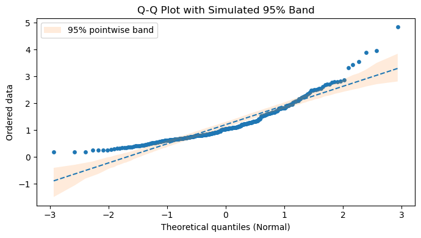
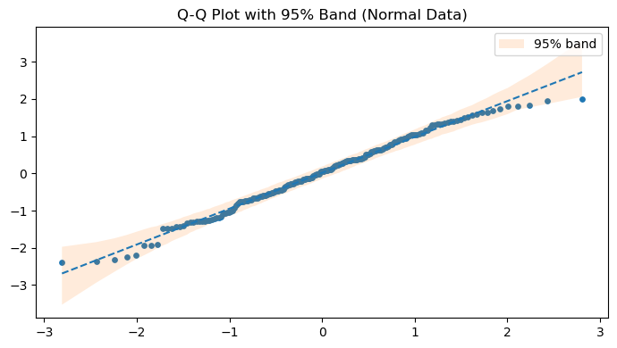
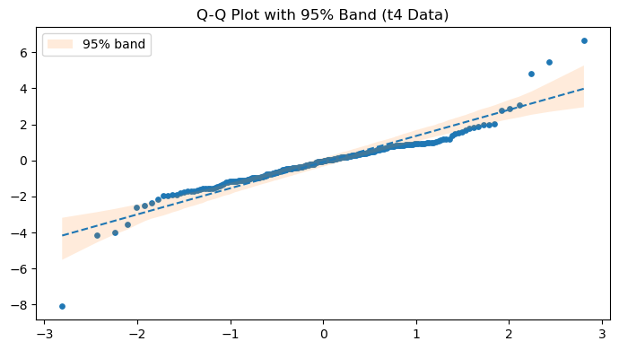
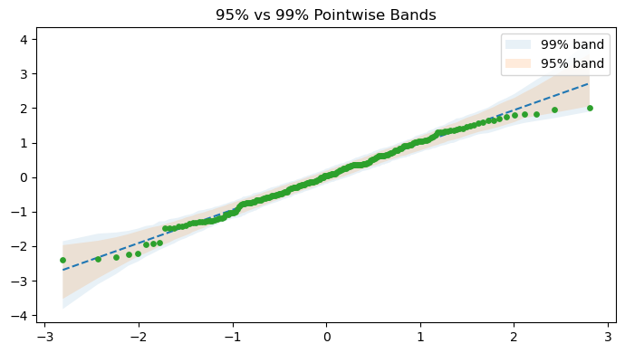

# Q-Q 그림 신뢰띠 모의실험

## 개요

맨 Q-Q 그림은 해석하기 어려울 수 있다. 완전한 정규성 아래에서도 표집변동 때문에 점들이 기준선 주위로 흩어지기 때문이다. 모의실험으로 만드는 점별 신뢰띠는 시각적 포락선을 제공한다. 띠 안의 점들은 정규성이라는 귀무가설과 일관되고, 띠 밖의 점들은 진짜 이탈을 시사한다. 이 페이지는 모의실험 기반 구성을 설명하고 치우친 자료에서 시연한다.

## 모수적 붓스트랩을 통한 구성

관측 표본 $x_1, \ldots, x_n$이 주어졌을 때 알고리즘은 다음과 같다.

1. **모수를 추정한다.** $\hat{\mu} = \bar{x}$와 $\hat{\sigma} = s$(Bessel 보정을 한 표본표준편차)를 계산한다.

2. **이론적 분위수를 계산한다.** $i = 1, \ldots, n$에 대해 플로팅 위치 $p_i = (i - 0.5)/n$을 써서

    $$
    q_i = \Phi^{-1}(p_i).
    $$

3. **관측 자료를 정렬한다.** 순서통계량을 $x_{(1)} \leq x_{(2)} \leq \cdots \leq x_{(n)}$이라 하자.

4. **귀무가설 아래에서 모의생성한다.** $b = 1, \ldots, B$에 대해
    - $x_1^{*(b)}, \ldots, x_n^{*(b)} \overset{\text{iid}}{\sim} \mathcal{N}(\hat{\mu}, \hat{\sigma}^2)$를 뽑는다.
    - 정렬하여 모의 순서통계량 $x_{(1)}^{*(b)} \leq \cdots \leq x_{(n)}^{*(b)}$를 얻는다.

5. **포락선을 계산한다.** 각 순위 $i$에 대해 $\{x_{(i)}^{*(1)}, \ldots, x_{(i)}^{*(B)}\}$의 2.5백분위수와 97.5백분위수를 취한다.

    $$
    L_i = Q_{0.025}\bigl(x_{(i)}^{*(1)}, \ldots, x_{(i)}^{*(B)}\bigr), \qquad U_i = Q_{0.975}\bigl(x_{(i)}^{*(1)}, \ldots, x_{(i)}^{*(B)}\bigr).
    $$

6. **그린다.** $(q_i, x_{(i)})$를 산점으로, 적합선 $y = \hat{\mu} + \hat{\sigma}\, q$를, 음영 영역 $[L_i, U_i]$를 표시한다.

<div class="codebox" markdown>

**예제 1.** Q-Q 그림에 95% 띠 얹기

```python
import numpy as np
import matplotlib.pyplot as plt
from scipy import stats

def qq_with_band(x, B=800, seed=42):
    """Q-Q 그림에 모의실험으로 만든 95% 띠를 얹는다.

    Q-Q 그림의 점들은 웬만큼 흔들리기 마련이라, 직선에서 조금 벗어난 것이
    문제인지 아닌지 눈으로는 알기 어렵다. 적합한 정규분포에서 같은 크기의
    표본을 B 번 뽑아 각 자리의 2.5·97.5 백분위점을 구하면, "정규라면 이
    정도까지는 흔들린다"는 범위를 그릴 수 있다.
    """
    x = np.asarray(x, dtype=float)
    n = x.size
    mu, sd = x.mean(), x.std(ddof=1)

    # 이론 분위수. 0.5 를 빼는 것은 i/n 이 마지막 점에서 1 이 되어
    # ppf 가 무한이 되는 것을 피하기 위한 흔한 보정이다.
    p = (np.arange(1, n + 1) - 0.5) / n
    q_theor = stats.norm.ppf(p)

    x_sorted = np.sort(x)

    # 적합된 정규분포에서 B 번 표본을 뽑아 각 순서통계량의 분포를 얻는다.
    rng = np.random.default_rng(seed)
    sims = np.sort(rng.normal(mu, sd, size=(B, n)), axis=1)
    lo = np.percentile(sims, 2.5, axis=0)
    hi = np.percentile(sims, 97.5, axis=0)

    fig, ax = plt.subplots(figsize=(7, 4))
    ax.scatter(q_theor, x_sorted, s=15)
    ax.plot(q_theor, mu + sd * q_theor, linestyle="--")
    ax.fill_between(q_theor, lo, hi, alpha=0.15,
                    label="95% pointwise band")
    ax.set_title("Q-Q Plot with Simulated 95% Band")
    ax.set_xlabel("Theoretical quantiles (Normal)")
    ax.set_ylabel("Ordered data")
    ax.legend()
    plt.tight_layout()
    plt.show()

rng = np.random.default_rng(123)
x = rng.lognormal(mean=0.0, sigma=0.6, size=300)
qq_with_band(x, B=600, seed=7)
```



</div>

## 점별 띠와 동시 띠

위에서 설명한 띠는 *점별*(pointwise)이다. 각 개별 순위 $i$에 대해 정규 순서통계량이 $[L_i, U_i]$ 안에 들어갈 확률이 95%라는 뜻이다. 그러나 $n$개 점이 *모두* 동시에 각자의 구간 안에 들어갈 확률은 95%보다 작다. *동시*(simultaneous) 띠(Bonferroni 보정에 해당)는 더 넓을 것이다. 그럼에도 점별 띠가 표준 관행인 이유는 지나치게 보수적이지 않으면서 유용한 시각적 안내를 주기 때문이다.

## 해석

위 대수정규 예에서는 위쪽 꼬리의 점들이 신뢰띠를 벗어나 음영 영역 위로 휘어 올라간다. 형식적 검정도 탐지했을 오른쪽 치우침을 시각적으로 확인해 준다. 진짜 정규분포에서 뽑은 자료라면 대부분의 점이 띠 안에 놓이고 가끔 우연히 벗어나는 정도이다.

!!! warning "\"5%씩 벗어난다\"는 계산은 성립하지 않는다"
    각 순위가 개별적으로 5% 확률로 띠를 벗어나므로 $n = 200$이면 약 10개가 밖에 있을 것이라고 생각하기 쉽다. **틀렸다.** 실제로는 평균 약 0.7개이고, 정규표본의 약 78%에서는 벗어나는 점이 **하나도 없다**. 이유는 연습문제 1에서 다룬다.

## 연습문제

<div class="drillbox" markdown>

**연습문제 1.** <span class="diff med" title="중간"></span> 표준정규 관측값 $n = 200$개를 생성하라. $B = 1000$번의 모의실험으로 95% 점별 띠를 갖는 Q-Q 그림을 만들어라. 거의 모든 점이 띠 안에 들어가는지 확인하라.

</div>

??? success "풀이"

    ```python
    import numpy as np
    from scipy import stats
    import matplotlib.pyplot as plt

    rng = np.random.default_rng(0)
    x = rng.normal(0, 1, size=200)

    n = x.size
    mu, sd = x.mean(), x.std(ddof=1)
    p = (np.arange(1, n + 1) - 0.5) / n
    q = stats.norm.ppf(p)
    x_sorted = np.sort(x)

    sims = np.sort(rng.normal(mu, sd, size=(1000, n)), axis=1)
    lo = np.percentile(sims, 2.5, axis=0)
    hi = np.percentile(sims, 97.5, axis=0)

    outside = np.sum((x_sorted < lo) | (x_sorted > hi))
    print(f"Points outside band: {outside} / {n}")

    fig, ax = plt.subplots(figsize=(7, 4))
    ax.scatter(q, x_sorted, s=15)
    ax.plot(q, mu + sd * q, linestyle="--")
    ax.fill_between(q, lo, hi, alpha=0.15, label="95% band")
    ax.legend()
    ax.set_title("Q-Q Plot with 95% Band (Normal Data)")
    plt.tight_layout()
    plt.show()
    ```

    출력:

    ```text
    Points outside band: 1 / 200
    ```

    

    **왜 10개가 아니라 1개인가?** 순진한 계산 $0.05 \times 200 = 10$은 200개 순위의 벗어남이 서로 독립이라고 가정한다. 두 가지 이유로 성립하지 않는다.

    1. **순서통계량은 강하게 양의 상관을 갖는다.** $x_{(i)}$가 크면 $x_{(i+1)}$도 클 수밖에 없다. 그래서 벗어남이 흩어지지 않고 연속된 구간(run)으로 몰려서 일어난다.

    2. **더 중요하게, 띠가 표본 자신의 $\hat{\mu}, \hat{\sigma}$를 중심으로 만들어진다.** 모수적 붓스트랩이 적합된 모수에 조건부로 작동하므로, 변동의 가장 큰 두 성분인 위치와 척도가 이미 제거되어 있다. 관측 순서통계량이 구성상 띠의 중심에 고정되는 것이다.

    실제로 정규표본 400개에 대해 반복하면 벗어나는 점의 개수는 평균 $0.67$, **중앙값 0**이고 표본의 $77.5\%$에서 하나도 벗어나지 않는다. 다만 분포의 꼬리가 두꺼워서 드물게 20개 이상이 한꺼번에 벗어나기도 한다. 상관된 벗어남이 몰려서 나타나기 때문이다.

    실무적 함의: 이 띠는 명목 95%보다 **훨씬 보수적**이다. 한 점이라도 벗어나면 주목할 만한 신호로 보아야 한다. $\square$

<div class="drillbox" markdown>

**연습문제 2.** <span class="diff med" title="중간"></span> 연습문제 1을 $t_4$ 분포에서 뽑은 관측값 $n = 200$개로 반복하라. Q-Q 그림의 어느 부분이 띠를 벗어나는지 찾고 그 이유를 설명하라.

</div>

??? success "풀이"

    ```python
    import numpy as np
    from scipy import stats
    import matplotlib.pyplot as plt

    rng = np.random.default_rng(1)
    x = rng.standard_t(df=4, size=200)

    n = x.size
    mu, sd = x.mean(), x.std(ddof=1)
    p = (np.arange(1, n + 1) - 0.5) / n
    q = stats.norm.ppf(p)
    x_sorted = np.sort(x)

    sims = np.sort(rng.normal(mu, sd, size=(1000, n)), axis=1)
    lo = np.percentile(sims, 2.5, axis=0)
    hi = np.percentile(sims, 97.5, axis=0)

    fig, ax = plt.subplots(figsize=(7, 4))
    ax.scatter(q, x_sorted, s=15)
    ax.plot(q, mu + sd * q, linestyle="--")
    ax.fill_between(q, lo, hi, alpha=0.15, label="95% band")
    ax.legend()
    ax.set_title("Q-Q Plot with 95% Band (t4 Data)")
    plt.tight_layout()
    plt.show()
    ```

    

    $t_4$ 분포는 정규분포보다 꼬리가 훨씬 두껍다. $t_\nu$의 초과첨도는 $\nu > 4$일 때 $6/(\nu - 4)$인데, $\nu = 4$에서는 이 값이 **발산**한다(네 번째 적률이 존재하지 않는다). 따라서 표본첨도가 표본마다 크게 요동하며 매우 큰 값이 자주 나온다.

    Q-Q 그림에서 가장 작은 순서통계량들은 띠의 아래 경계 밑으로 떨어지고(기대보다 더 음수) 가장 큰 순서통계량들은 위 경계 위로 올라간다(기대보다 더 양수). 포락선 밖으로 튀어나가는 특징적인 S자 모양이 나타난다.

    연습문제 1에서 본 대로 이 띠는 매우 보수적이므로, 양 끝에서 띠를 벗어난다는 것은 꼬리 이탈이 상당히 크다는 강한 증거이다. $\square$

<div class="drillbox" markdown>

**연습문제 3.** <span class="diff med" title="중간"></span> 신뢰띠가 중앙 근처보다 꼬리(극단 분위수)에서 더 넓은 이유를 수학적으로 설명하라.

</div>

??? success "풀이"

    $\mathcal{N}(\mu, \sigma^2)$에서 나온 $i$번째 순서통계량의 분산은 근사적으로

    $$
    \text{Var}(X_{(i)}) \approx \frac{p_i(1 - p_i)}{n\, [\phi(\Phi^{-1}(p_i))]^2}\, \sigma^2,
    $$

    여기서 $p_i = i/(n+1)$이고 $\phi$는 표준정규 밀도이다.

    중앙 근처($p_i \approx 0.5$)에서는 $\phi(\Phi^{-1}(0.5)) = \phi(0) = 1/\sqrt{2\pi} \approx 0.399$로 최대이므로 분모가 커서 분산이 작다. 꼬리($p_i$가 0이나 1에 가까울 때)에서는 $\phi(\Phi^{-1}(p_i))$가 매우 작아진다(정규 밀도가 빠르게 감쇠한다). 예컨대 $p_i = 0.01$이면 $\phi(-2.326) = 0.0267$로 중앙의 $1/15$에 불과하고, 제곱되어 분모에 들어가므로 분산이 크게 늘어난다.

    분자 $p_i(1-p_i)$는 꼬리에서 오히려 작아지지만($0.01 \times 0.99 = 0.0099$ 대 $0.25$), 분모의 감소가 훨씬 빠르다. $p_i = 0.01$에서 비율은 $\frac{0.0099}{0.0267^2} = 13.9$이고 $p_i = 0.5$에서는 $\frac{0.25}{0.399^2} = 1.57$이므로 분산이 약 9배 크다.

    결과적으로 모의 순서통계량의 산포가 꼬리에서 훨씬 커지고 신뢰띠가 나팔 모양으로 벌어진다. $\square$

<div class="drillbox" markdown>

**연습문제 4.** <span class="diff med" title="중간"></span> 99% 점별 띠를 만들도록 모의실험을 수정하라. 폭이 95% 띠와 비교해 어떠한가?

</div>

??? success "풀이"

    ```python
    import numpy as np
    from scipy import stats
    import matplotlib.pyplot as plt

    rng = np.random.default_rng(0)
    x = rng.normal(0, 1, size=200)

    n = x.size
    mu, sd = x.mean(), x.std(ddof=1)
    p = (np.arange(1, n + 1) - 0.5) / n
    q = stats.norm.ppf(p)
    x_sorted = np.sort(x)

    sims = np.sort(rng.normal(mu, sd, size=(1000, n)), axis=1)
    lo95 = np.percentile(sims, 2.5, axis=0)
    hi95 = np.percentile(sims, 97.5, axis=0)
    lo99 = np.percentile(sims, 0.5, axis=0)
    hi99 = np.percentile(sims, 99.5, axis=0)

    print(f"Median width ratio: {np.median((hi99 - lo99) / (hi95 - lo95)):.3f}")

    fig, ax = plt.subplots(figsize=(7, 4))
    ax.fill_between(q, lo99, hi99, alpha=0.10, label="99% band")
    ax.fill_between(q, lo95, hi95, alpha=0.15, label="95% band")
    ax.scatter(q, x_sorted, s=15, zorder=3)
    ax.plot(q, mu + sd * q, linestyle="--")
    ax.legend()
    ax.set_title("95% vs 99% Pointwise Bands")
    plt.tight_layout()
    plt.show()
    ```

    출력:

    ```text
    Median width ratio: 1.305
    ```

    

    99% 띠는 모의 순서통계량의 0.5백분위수와 99.5백분위수를 쓰므로 모든 순위에서 95% 띠보다 넓다. 순서통계량의 분포가 근사적으로 정규이므로 폭의 비율은 대략

    $$
    \frac{\Phi^{-1}(0.995)}{\Phi^{-1}(0.975)} = \frac{2.576}{1.960} \approx 1.31
    $$

    이다. 모의실험에서 얻은 중앙값 $1.305$가 이 예측과 잘 맞는다. 곧 99% 띠는 약 31% 더 넓다. $\square$

<div class="drillbox" markdown>

**연습문제 5.** <span class="diff med" title="중간"></span> Bonferroni 보정을 써서 점별 띠를 근사적 동시 띠로 바꾸는 방법을 기술하라. 명목 전체 수준이 95%이고 $n = 100$이면 각 개별 구간은 어떤 신뢰수준을 써야 하는가?

</div>

??? success "풀이"

    전체 수준 $1 - \alpha$의 동시 띠를 얻으려면 Bonferroni 보정에 따라 $n$개 점별 구간 각각이 수준 $1 - \alpha/n$을 가져야 한다. $\alpha = 0.05$, $n = 100$이면 각 구간이 확률 $1 - 0.05/100 = 0.9995$를 덮어야 한다.

    모의실험에서는 $2.5\%$와 $97.5\%$ 대신 모의 순서통계량의 $0.025\%$와 $99.975\%$ 백분위수를 쓴다. 훨씬 넓은 띠가 만들어진다. 정규분위수가 $z_{0.975} = 1.96$에서 $z_{0.99975} \approx 3.48$로 바뀌므로 폭이 약 1.8배가 된다.

    보수적이기는 하지만 귀무가설 아래에서 $n$개 점이 모두 동시에 띠 안에 있을 확률이 최소 95%임을 보장한다.

    다만 실무에서 Bonferroni 띠는 큰 $n$에 대해 지나치게 보수적이다. 순서통계량이 강하게 상관되어 있어 Bonferroni가 가정하는 최악의 경우(독립)와 거리가 멀기 때문이다. 더 정교한 동시 띠(예: Kolmogorov-Smirnov 분포에 기반한 것)가 선호된다. 또한 연습문제 1에서 보았듯 모수적 붓스트랩 점별 띠 자체가 이미 상당히 보수적이므로, 실용적으로는 Bonferroni 보정 없이 쓰는 편이 낫다. $\square$

---

## 정리하며

신뢰띠가 **Q-Q 그림 읽기의 기준선**을 준다.

- **문제는 맨 Q-Q 그림의 해석이 어렵다는 것이다.** 완전한 정규 자료에서도 점들이 흔들리며, 얼마나 벗어나야 "진짜"인지 눈으로는 알 수 없다.
- **모수적 부트스트랩으로 만든다.** 적합된 정규분포에서 같은 크기의 표본을 반복해 뽑고, 각 순서통계량의 분포에서 분위수를 취한다.
- **띠가 꼬리에서 넓다.** 극단 순서통계량의 변동이 크기 때문이며, **꼬리에서 조금 벗어난 것은 정상**임을 그림이 직접 알려 준다.
- **점별 띠와 동시 띠가 다르다.** 점별 띠는 각 점에 대해 $95\%$ 이므로, 여러 점 중 일부가 밖으로 나가는 것은 우연히도 흔하다. 9장의 다중검정 문제가 여기서도 나타난다.
- **치우친 자료에서 효과가 분명하다.** 점들이 띠를 체계적으로 벗어나는 모양이 보인다.

다음 절 **상자그림의 모양**으로 넘어간다.
