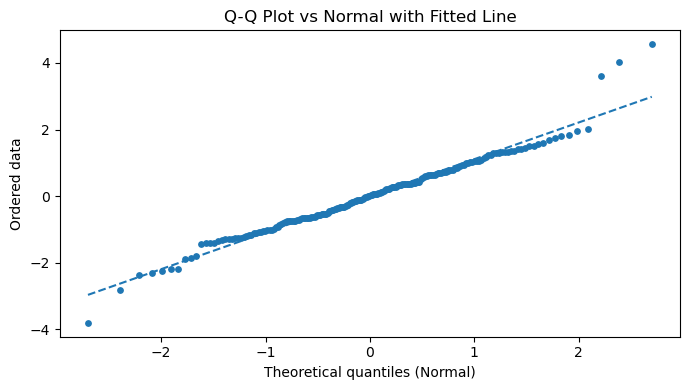
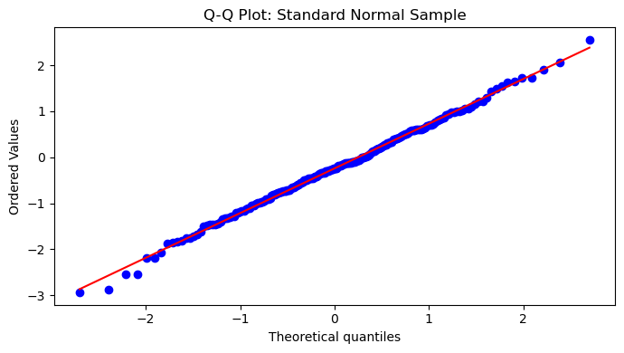
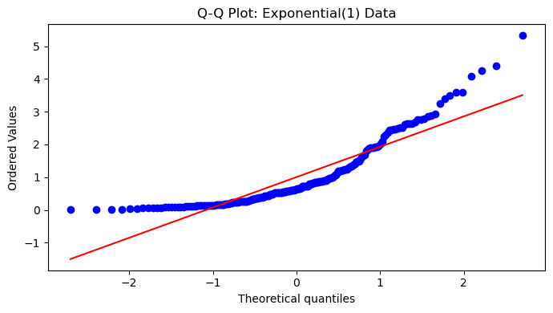

# Q-Q 그림과 정규성 검정

## 개요

분위수-분위수(Q-Q) 그림은 정규성 평가에 가장 널리 쓰이는 시각적 도구이다. 정렬된 표본값을 이론적 정규분위수에 대해 그림으로써 히스토그램이 놓칠 수 있는 이탈을 드러낸다. 이 페이지는 Q-Q 그림을 세 가지 형식적 정규성 검정(Shapiro-Wilk, D'Agostino $K^2$, Anderson-Darling)과 짝지어 시각적 진단과 수치적 진단이 어떻게 서로를 보완하는지 보인다.

## Q-Q 그림의 구성

정렬된 표본 $X_{(1)} \leq X_{(2)} \leq \cdots \leq X_{(n)}$이 주어지면, Q-Q 그림은 각 순서통계량을 대응하는 이론적 분위수

$$
q_i = \Phi^{-1}\!\Bigl(\frac{i - 0.5}{n}\Bigr), \qquad i = 1, \ldots, n,
$$

와 짝짓는다. 여기서 $\Phi^{-1}$은 표준정규 분위수함수이다. 그림은 점 $(q_i, X_{(i)})$를 표시한다.

정규성 아래에서 $X_{(i)} \approx \mu + \sigma\, q_i$이므로 점들이 다음 직선을 따라 놓여야 한다.

$$
y = \hat{\mu} + \hat{\sigma}\, x,
$$

여기서 $\hat{\mu} = \bar{X}$, $\hat{\sigma} = S$이다. 적합선은 보통 $X_{(i)}$를 $q_i$에 회귀시키는 최소제곱법으로 얻는다.

## 함께 쓰는 정규성 검정

| 검정 | 통계량 | 귀무분포 |
|---|---|---|
| Shapiro-Wilk | $W = \frac{(\sum a_i X_{(i)})^2}{\sum (X_i - \bar{X})^2}$ | 표로 정리 / 모의실험 |
| D'Agostino $K^2$ | $K^2 = Z_1^2 + Z_2^2$ (왜도 + 첨도) | $\chi^2_2$ (점근적) |
| Anderson-Darling | $A^2 = -n - \sum \frac{2i-1}{n}[\ln F_0(X_{(i)}) + \ln(1-F_0(X_{(n+1-i)}))]$ | 표로 정리된 임계값 |

<div class="codebox" markdown>

### 예제 1. Q-Q 그림과 검정을 함께 { .eg }

```python
import numpy as np
import matplotlib.pyplot as plt
from scipy import stats

# 정규 150개에 자유도 3 인 t 를 50개 섞었다. 가운데는 정규 같지만
# 꼬리만 두꺼운 자료다.
rng = np.random.default_rng(0)
x = np.concatenate([rng.normal(0, 1, size=150),
                    rng.standard_t(df=3, size=50)])

# fit=False 로 두면 probplot 이 그림을 그리지 않고 좌표만 돌려준다.
# 그 좌표로 직접 그려야 점과 직선의 모양을 마음대로 손볼 수 있다.
osm, osr = stats.probplot(x, dist="norm", sparams=(), fit=False)
b, a = np.polyfit(osm, osr, 1)

fig, ax = plt.subplots(figsize=(7, 4))
ax.scatter(osm, osr, s=15)
xx = np.linspace(osm.min(), osm.max(), 200)
ax.plot(xx, a + b * xx, linestyle="--")
ax.set_title("Q-Q Plot vs Normal with Fitted Line")
ax.set_xlabel("Theoretical quantiles (Normal)")
ax.set_ylabel("Ordered data")
plt.tight_layout()
plt.show()

# 그림에서 본 것을 검정으로 확인한다. 그림과 검정은 서로를 보완한다 —
# 검정은 "정규가 아니다"까지만 말하고, 어디가 어긋났는지는 그림이 말한다.
W, p_sw = stats.shapiro(x)
K2, p_k2 = stats.normaltest(x)
ad = stats.anderson(x, dist="norm")

print(f"Shapiro-Wilk:     W = {W:.4f}, p = {p_sw:.4g}")
print(f"D'Agostino K^2:   K2 = {K2:.4f}, p = {p_k2:.4g}")
print(f"Anderson-Darling: A^2 = {ad.statistic:.4f}")
for crit, sig in zip(ad.critical_values, ad.significance_level):
    print(f"  Critical {sig:.0f}%: {crit:.4f} -> reject if A^2 > crit")
```

출력:

```text
Shapiro-Wilk:     W = 0.9716, p = 0.0004476
D'Agostino K^2:   K2 = 17.1070, p = 0.0001929
Anderson-Darling: A^2 = 0.6894
  Critical 15%: 0.5650 -> reject if A^2 > crit
  Critical 10%: 0.6440 -> reject if A^2 > crit
  Critical 5%: 0.7720 -> reject if A^2 > crit
  Critical 2%: 0.9010 -> reject if A^2 > crit
  Critical 1%: 1.0710 -> reject if A^2 > crit
```



</div>

## 해석

위 예에서 자료는 정규 추출값과 $t_3$ 추출값의 혼합이라 꼬리가 더 두껍다(표본왜도 $0.349$, 초과첨도 $2.13$). Q-Q 그림은 S자 패턴을 보인다. 왼쪽 아래 극단점들이 적합선 아래로 떨어지고 오른쪽 위 극단점들이 선 위로 올라간다.

세 검정의 결론이 **일치하지 않는다**는 점에 주목하라.

| 검정 | 결과 | 5% 수준 판정 |
|---|---|---|
| Shapiro-Wilk | $p = 0.00045$ | 기각 |
| D'Agostino $K^2$ | $p = 0.00019$ | 기각 |
| Anderson-Darling | $A^2 = 0.689$ vs 임계값 $0.772$ | **기각 못 함** |

Shapiro-Wilk와 D'Agostino $K^2$는 강하게 기각하지만 Anderson-Darling은 5% 수준에서 기각하지 못한다($A^2 = 0.689 < 0.772$). 10%와 15% 수준에서만 기각한다. 왜 그럴까? Anderson-Darling은 CDF 전체에 걸친 이탈에 꼬리 가중을 준 측도인데, 이 혼합자료의 이탈은 소수의 극단 관측값에 몰려 있어 $A^2$를 임계값 근처까지만 밀어 올린다. 반면 $K^2$는 첨도를 직접 겨냥하므로 같은 신호를 훨씬 크게 증폭한다.

교훈은 **검정 하나의 판정에 기대지 말라**는 것이다. Q-Q 그림을 형식적 검정과 결합하는 핵심 장점이 여기 있다. 그림은 자료가 정규성에서 *어디서 어떻게* 벗어나는지(이 경우 꼬리에서) 보여주고, 검정은 증거의 강도를 수량화한다. 검정끼리 어긋날 때 그림이 심판 역할을 한다.

## 연습문제

<div class="drillbox" markdown>

**연습문제 1.** <span class="diff easy" title="쉬움"></span> 표준정규 관측값 $n = 200$개를 생성하라. Q-Q 그림을 만들고 세 검정을 모두 수행하라. 점들이 적합선 위에 놓이고 모든 $p$값이 0.05를 넘는지 확인하라.

</div>

??? success "풀이"

    ```python
    import numpy as np
    from scipy import stats
    import matplotlib.pyplot as plt

    rng = np.random.default_rng(10)
    x = rng.normal(0, 1, size=200)

    fig, ax = plt.subplots(figsize=(7, 4))
    stats.probplot(x, dist="norm", plot=ax)
    ax.set_title("Q-Q Plot: Standard Normal Sample")
    plt.tight_layout()
    plt.show()

    W, p_sw = stats.shapiro(x)
    K2, p_k2 = stats.normaltest(x)
    ad = stats.anderson(x, dist="norm")

    print(f"Shapiro-Wilk:     p = {p_sw:.4f}")
    print(f"D'Agostino:       p = {p_k2:.4f}")
    print(f"Anderson-Darling: A^2 = {ad.statistic:.4f}")
    ```

    출력:

    ```text
    Shapiro-Wilk:     p = 0.9898
    D'Agostino:       p = 0.8231
    Anderson-Darling: A^2 = 0.1342
    ```

    

    Q-Q 그림은 점들이 대각선에 바짝 붙어 있음을 보인다. 두 $p$값 모두 0.05를 크게 넘고, $A^2 = 0.134$는 가장 느슨한 15% 임계값 $0.565$보다도 훨씬 작다. 표준정규 자료가 모든 정규성 확인을 통과함을 확인해 준다. $\square$

<div class="drillbox" markdown>

**연습문제 2.** <span class="diff easy" title="쉬움"></span> 연습문제 1을 $\text{Exponential}(1)$에서 뽑은 관측값 $n = 200$개로 반복하라. Q-Q 그림의 모양을 기술하고 $p$값들을 비교하라.

</div>

??? success "풀이"

    ```python
    import numpy as np
    from scipy import stats
    import matplotlib.pyplot as plt

    rng = np.random.default_rng(20)
    x = rng.exponential(1.0, size=200)

    fig, ax = plt.subplots(figsize=(7, 4))
    stats.probplot(x, dist="norm", plot=ax)
    ax.set_title("Q-Q Plot: Exponential(1) Data")
    plt.tight_layout()
    plt.show()

    W, p_sw = stats.shapiro(x)
    K2, p_k2 = stats.normaltest(x)
    print(f"Shapiro-Wilk: p = {p_sw:.4g}")
    print(f"D'Agostino:   p = {p_k2:.4g}")
    ```

    출력:

    ```text
    Shapiro-Wilk: p = 4.113e-14
    D'Agostino:   p = 5.462e-14
    ```

    

    Q-Q 그림은 강한 **아래로 볼록한**(convex, 위로 휘는) 패턴을 보인다. 지수분포가 심하게 오른쪽으로 치우쳐 있기 때문이다(이론적 왜도 2). 왼쪽 꼬리는 0에서 잘려 짧고 오른쪽 꼬리는 길게 늘어지므로, 양 끝이 모두 적합선 위로 올라간다.

    두 $p$값 모두 사실상 0으로 정규성을 강하게 기각한다. 두 검정의 $p$값 크기가 거의 같다는 점도 눈에 띈다. 이탈이 압도적으로 크면 어느 검정을 쓰든 결론이 같다. $\square$

<div class="drillbox" markdown>

**연습문제 3.** <span class="diff med" title="중간"></span> Q-Q 그림 적합선의 기울기·절편과 정규분포의 모수 $\mu$, $\sigma$ 사이의 관계를 설명하라.

</div>

??? success "풀이"

    모형 $X \sim \mathcal{N}(\mu, \sigma^2)$ 아래에서 $i$번째 순서통계량은 $\mathbb{E}[X_{(i)}] \approx \mu + \sigma\, q_i$를 만족한다. 여기서 $q_i = \Phi^{-1}((i-0.5)/n)$이다. 따라서 $X_{(i)}$를 $q_i$에 회귀시켜 얻은 적합선 $\hat{y} = a + b\, q$는 절편 $a \approx \bar{X} \approx \mu$, 기울기 $b \approx S \approx \sigma$를 갖는다.

    곧 **절편이 평균을, 기울기가 표준편차를 추정한다**. 자료가 정말로 정규이면 이 추정값은 표본평균 및 표본표준편차와 일치한다. 실용적으로도 유용한 결과이다. Q-Q 그림의 기울기가 1보다 훨씬 크면 자료의 산포가 기준분포보다 크다는 뜻이다. $\square$

<div class="drillbox" markdown>

**연습문제 4.** <span class="diff med" title="중간"></span> SciPy의 Anderson-Darling 검정은 $p$값을 내놓지 않고 임계값을 반환한다. $H_0$이 기각되는 가장 작은 유의수준을 찾아내는 코드를 작성하라.

</div>

??? success "풀이"

    ```python
    import numpy as np
    from scipy import stats

    rng = np.random.default_rng(0)
    x = np.concatenate([rng.normal(0, 1, 150), rng.standard_t(3, 50)])

    ad = stats.anderson(x, dist="norm")
    rejected_levels = [sl for cv, sl in
                       zip(ad.critical_values, ad.significance_level)
                       if ad.statistic > cv]

    if rejected_levels:
        print(f"A^2 = {ad.statistic:.4f}")
        print(f"Reject at significance levels: {rejected_levels}")
        print(f"Smallest rejection level: {min(rejected_levels)}%")
    else:
        print("Fail to reject at all tabulated significance levels.")
    ```

    출력:

    ```text
    A^2 = 0.6894
    Reject at significance levels: [15.0, 10.0]
    Smallest rejection level: 10.0%
    ```

    코드는 (임계값, 유의수준) 쌍을 훑으며 $A^2$가 임계값을 넘는 수준을 모은다. 그중 가장 작은 수준이 우리가 할 수 있는 가장 강한 진술이다.

    이 두꺼운 꼬리 혼합자료에서는 $A^2 = 0.689$가 15%와 10% 임계값($0.565$, $0.644$)만 넘고 5% 임계값 $0.772$는 넘지 못한다. 곧 **Anderson-Darling으로는 10% 수준에서만 기각할 수 있다**. 같은 자료에서 Shapiro-Wilk가 $p = 0.00045$를 내는 것과 대비된다. 유의수준을 5%로 정해 두었다면 Anderson-Darling만으로는 이 비정규성을 놓쳤을 것이다. $\square$

<div class="drillbox" markdown>

**연습문제 5.** <span class="diff hard" title="어려움"></span> 자료가 정확히 표준정규일 때 $n \to \infty$에 따라 Q-Q 그림의 기울기가 1로, 절편이 0으로 수렴함을 보여라.

</div>

??? success "풀이"

    $X_1, \ldots, X_n \overset{\text{iid}}{\sim} \mathcal{N}(0, 1)$이라 하자. $i$번째 순서통계량은

    $$
    \mathbb{E}[X_{(i)}] = \Phi^{-1}\!\Bigl(\frac{i}{n+1}\Bigr) + O(n^{-1})
    $$

    를 만족한다. $n$이 크면 $\frac{i}{n+1} \approx \frac{i - 0.5}{n}$이므로 $\mathbb{E}[X_{(i)}] \approx q_i$이다.

    $X_{(i)}$를 $q_i$에 최소제곱 회귀시키면 대수의 법칙에 의해 기울기 $b \to \sigma = 1$, 절편 $a \to \mu = 0$이다. 더 형식적으로는 $\bar{X} \xrightarrow{p} 0$이고 $S \xrightarrow{p} 1$이며, OLS 계수가 $b = S + o_p(1)$, $a = \bar{X} + o_p(1)$을 만족하여 결과를 얻는다. $\square$

---

## 정리하며

Q-Q 그림과 형식적 검정을 **짝지어** 보았다.

- **구성 원리는 단순하다.** 정렬된 관측 $X_{(i)}$ 를 이론 분위수 $\Phi^{-1}\!\left(\frac{i-a}{n+1-2a}\right)$ 에 대해 그린다. 위치 보정 $a$ 는 관례에 따라 $0.5$ 나 $3/8$ 을 쓴다.
- **시각과 수치가 서로를 보완한다.** 샤피로–윌크·다고스티노 $K^2$·앤더슨–달링이 "얼마나 벗어났는가"를 하나의 수로 주고, 그림이 "어떻게 벗어났는가"를 보여 준다.
- **검정이 기각했는데 그림이 멀쩡해 보이면** 표본이 커서 사소한 이탈을 잡은 것이다.
- **반대로 그림이 이상한데 기각되지 않으면** 표본이 작아 검정력이 부족한 것이다.
- **둘이 어긋날 때 그림 쪽을 더 믿는 것이 실무적**이며, 이탈의 크기가 실질적으로 중요한지 판단해야 한다.

다음 절 **Q-Q 신뢰띠**로 넘어간다.
