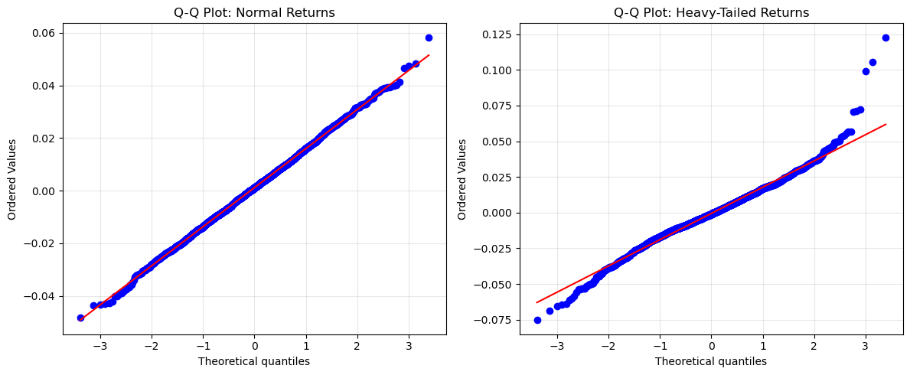

# 금융 수익률의 Q-Q 그림

## 개요

금융 자산 수익률은 정규성 가정이 무너지는 가장 중요한 실무 영역 가운데 하나이다. 이 페이지는 정규분포를 따르는 수익률과 Student $t$ 분포에서 생성한 두꺼운 꼬리 수익률을 비교하며, Q-Q 그림이 모의생성된 일별 수익률의 비정규성을 어떻게 진단하는지 보인다. 특징적인 S자 Q-Q 패턴은 실제 수익률의 꼬리가 정규분포의 예측보다 두껍다는 사실을 드러내며, 위험관리에 결정적인 함의를 갖는다.

## 금융 수익률 모의생성

일별 로그수익률은 흔히 다음과 같이 모형화한다.

$$
r_t = \mu + \sigma\, \varepsilon_t,
$$

여기서 $\mu$는 기대 일별 수익률, $\sigma$는 일별 변동성, $\varepsilon_t$는 표준화된 혁신항이다. 정규 모형에서는 $\varepsilon_t \sim \mathcal{N}(0,1)$이다. 두꺼운 꼬리 모형에서는 자유도 $\nu$인 $\varepsilon_t \sim t_\nu$이다. 주식 수익률에 대한 실증연구는 대체로 $\nu$를 3~8 범위에서 찾으며, 이는 정규분포보다 상당히 두꺼운 꼬리를 뜻한다.

<div class="codebox" markdown>

### 예제 1. 두 수익률의 요약통계 { .eg }

```python
import numpy as np
from scipy import stats

np.random.seed(42)
n = 2000

# 정규 수익률: 일평균 0.05%, 변동성 1.5%
normal_returns = np.random.normal(loc=0.0005, scale=0.015, size=n)

# 꼬리가 두꺼운 수익률: 자유도 6 인 t. 평균과 척도는 위와 같게 맞췄으므로
# 달라지는 것은 꼬리뿐이다. 요약통계에서 초과첨도만 크게 벌어진다.
heavy_returns = stats.t.rvs(df=6, loc=0.0005, scale=0.015, size=n)

for name, r in [("Normal", normal_returns), ("Heavy-tailed", heavy_returns)]:
    g1 = stats.skew(r)
    g2 = stats.kurtosis(r)
    _, p_jb = stats.jarque_bera(r)
    print(f"{name}: mean={r.mean():.6f}, std={r.std():.6f}, "
          f"skew={g1:.4f}, excess_kurt={g2:.4f}, JB p={p_jb:.4g}")
```

출력:

```text
Normal: mean=0.001176, std=0.014823, skew=0.0329, excess_kurt=0.0513, JB p=0.7486
Heavy-tailed: mean=-0.000555, std=0.018552, skew=0.2201, excess_kurt=2.4735, JB p=6.062e-115
```

</div>

!!! warning "`scale` 모수는 표준편차가 아니다"
    두 계열의 표준편차가 $0.0148$과 $0.0186$으로 25% 차이가 난다. 둘 다 `scale=0.015`로 생성했는데도 그렇다.

    이유는 `stats.t.rvs(df, scale=s)`의 `scale`이 표준편차가 아니라 **척도 모수**이기 때문이다. $t_\nu$ 척도족의 표준편차는

    $$
    \text{sd} = s \sqrt{\frac{\nu}{\nu - 2}}
    $$

    이며, $\nu = 6$, $s = 0.015$이면 $0.015 \times \sqrt{1.5} = 0.01837$이다(표본값 $0.01855$가 이에 부합한다).

    곧 위 비교에서 "두꺼운 꼬리" 계열은 꼬리만 두꺼운 것이 아니라 **변동성 자체가 22% 크다**. 순수한 꼬리 효과만 보려면 `scale=0.015/np.sqrt(1.5)`로 두어 표준편차를 맞춰야 한다. 이 구분은 뒤의 VaR 논의에서 결정적으로 중요해진다.

## Q-Q 그림 비교

두 수익률 계열을 비교하면 Q-Q 그림의 진단력이 분명해진다.

<div class="codebox" markdown>

### 예제 2. 두 수익률의 Q-Q 그림 { .eg }

```python
import numpy as np
import matplotlib.pyplot as plt
from scipy import stats

np.random.seed(42)
normal_returns = np.random.normal(0.0005, 0.015, 2000)
heavy_returns = stats.t.rvs(df=6, loc=0.0005, scale=0.015, size=2000)

# 왼쪽은 직선에 붙고, 오른쪽은 양끝이 S 자로 휘어 오른다.
# 이 휘어짐이 두꺼운 꼬리의 눈에 보이는 모습이다.
fig, axes = plt.subplots(1, 2, figsize=(12, 5))

stats.probplot(normal_returns, dist="norm", plot=axes[0])
axes[0].set_title("Q-Q Plot: Normal Returns")
axes[0].grid(True, alpha=0.3)

stats.probplot(heavy_returns, dist="norm", plot=axes[1])
axes[1].set_title("Q-Q Plot: Heavy-Tailed Returns")
axes[1].grid(True, alpha=0.3)

plt.tight_layout()
plt.show()
```



**정규 수익률:** 점들이 대각선을 따라 놓여 분포 가정을 확인해 준다.

**두꺼운 꼬리 수익률:** Q-Q 그림이 특징적인 S자를 보인다. 왼쪽 아래 점들이 선 아래로 휘고(정규가 예측하는 것보다 극단적인 손실) 오른쪽 위 점들이 선 위로 휜다(더 극단적인 이익). 이 S자 패턴이 고첨(두꺼운 꼬리) 분포의 특징이다.

Q-Q 그림은 **척도에 불변**이라는 점이 유용하다. 앞의 경고에서 지적한 변동성 차이는 적합선의 기울기에만 영향을 주고 S자 모양 자체는 순수하게 꼬리의 성질을 반영한다.

</div>

## 꼬리 위험의 함의

정규 모형과 두꺼운 꼬리 모형의 차이는 극단 분위수에서 결정적으로 커진다. 포트폴리오의 수준 $\alpha$ 위험가치(VaR)는

$$
\text{VaR}_\alpha = -\mu - \sigma\, q_\alpha,
$$

여기서 $q_\alpha$는 혁신항 분포의 $\alpha$ 분위수이다.

여기서 **$\sigma$와 $q_\alpha$를 어떻게 짝지을지**가 핵심이다. 두 가지 계산을 구분해야 한다.

**(1) 원분위수 비교(잘못된 방식).** $\Phi^{-1}(0.01) = -2.326$과 $t_6^{-1}(0.01) = -3.143$을 그대로 비교하면 35% 차이가 난다. 그러나 $t_6$는 표준편차가 $1.2247$이므로 이 둘은 같은 단위가 아니다. 사과와 오렌지를 비교하는 셈이다.

**(2) 표준화 분위수 비교(올바른 방식).** 실무에서는 변동성 $\sigma$를 과거 자료에서 추정하므로, 혁신항 분포는 반드시 **분산 1로 표준화**해야 한다. 표준화된 $t_6$의 1% 분위수는

$$
\frac{t_6^{-1}(0.01)}{\sqrt{6/4}} = \frac{-3.1427}{1.2247} = -2.566.
$$

정규의 $-2.326$보다 **10.3%** 클 뿐이다. 35%가 아니다.

$\alpha$에 따라 이 비율이 어떻게 달라지는지 보자(표준화 기준).

| $\alpha$ | $\Phi^{-1}(\alpha)$ | 표준화 $t_6^{-1}(\alpha)$ | 비율 | 표준화 $t_5^{-1}(\alpha)$ | 비율 |
|---|---|---|---|---|---|
| 0.05 | $-1.645$ | $-1.586$ | **0.96** | $-1.561$ | **0.95** |
| 0.01 | $-2.326$ | $-2.566$ | 1.10 | $-2.607$ | 1.12 |
| 0.001 | $-3.090$ | $-4.253$ | 1.38 | $-4.565$ | 1.48 |

두 가지가 드러난다.

- **$\alpha = 0.05$에서는 정규 모형이 오히려 VaR를 과대추정한다**(비율 $< 1$). 분산을 맞춘 $t$ 분포는 중앙에 질량이 더 몰려 있어 5% 분위수가 정규보다 **덜** 극단적이다. 꼬리가 두꺼운 대가로 어깨가 얇아지는 것이다.
- 두꺼운 꼬리의 대가는 **극단 분위수에서만** 나타난다. $\alpha = 0.001$(약 4년에 한 번)에서야 40~50% 차이가 된다.

실무적 결론: "정규 모형이 꼬리 위험을 과소평가한다"는 말은 옳지만, 그 크기는 어느 분위수를 보느냐에 크게 의존한다. 표준적인 1% VaR에서는 10% 남짓이고, Basel III가 요구하는 극단 수준에서 비로소 심각해진다.

## 해석

Q-Q 그림은 금융 수익률 자료에 대해 단연 가장 중요한 진단 도구라 할 만하다. S자 패턴은 주식, 외환, 상품, 채권 수익률에서 모두 문서화되어 있다. 실무자는 다음을 지켜야 한다.

- 정규 기반 위험 모형을 적용하기 전에 항상 Q-Q 그림으로 정규성을 확인한다.
- Jarque-Bera 검정을 형식적 보조 진단으로 함께 쓴다.
- Q-Q 그림이 대각선에서 벗어나면 두꺼운 꼬리 분포($t_\nu$, 일반화 쌍곡분포)나 비모수 방법을 쓴다.
- 두꺼운 꼬리 모형을 적합할 때 **척도 모수와 표준편차를 혼동하지 않는다**.

## 연습문제

<div class="drillbox" markdown>

**연습문제 1.** <span class="diff med" title="중간"></span> 정규 수익률 2,000개와 $t_6$ 수익률 2,000개를 모의생성하라. 각각에 대해 표본왜도, 초과첨도, Jarque-Bera $p$값을 계산하라. 결과를 해석하라.

</div>

??? success "풀이"

    ```python
    import numpy as np
    from scipy import stats

    np.random.seed(42)
    normal_r = np.random.normal(0.0005, 0.015, 2000)
    heavy_r = stats.t.rvs(df=6, loc=0.0005, scale=0.015, size=2000)

    for name, r in [("Normal", normal_r), ("t(6)", heavy_r)]:
        g1 = stats.skew(r, bias=False)
        g2 = stats.kurtosis(r, fisher=True, bias=False)
        _, p = stats.jarque_bera(r)
        print(f"{name}: skew={g1:.4f}, kurt={g2:.4f}, JB p={p:.4g}")
    ```

    출력:

    ```text
    Normal: skew=0.0329, kurt=0.0544, JB p=0.7486
    t(6): skew=0.2203, kurt=2.4827, JB p=6.062e-115
    ```

    정규 수익률은 $g_1 = 0.033$, $g_2 = 0.054$로 모두 0에 가깝고 JB $p = 0.749$로 유의하지 않다. 정규성 가정이 잘 성립한다.

    $t_6$ 수익률은 $g_2 = 2.48$로 크게 양수이고 JB $p = 6 \times 10^{-115}$로 사실상 0이다. 두꺼운 꼬리를 확인해 준다. 이론적 초과첨도는 $6/(6-4) = 3$이므로 표본값 $2.48$이 아래로 편향되어 있는데, 두꺼운 꼬리 분포에서 표본첨도가 체계적으로 과소추정되는 알려진 현상이다.

    $t_6$의 표본왜도가 $0.22$로 0이 아닌 점도 눈여겨보라. $t$ 분포는 대칭이므로 참 왜도는 0이다. 두꺼운 꼬리 때문에 표본왜도의 변동이 크다는 뜻이다($n = 2000$에서 정규자료라면 표준오차가 $\sqrt{6/2000} = 0.055$에 불과하다).

    JB 통계량이 이렇게 극단적으로 큰 것은 첨도 성분과 이 우연한 왜도 성분이 함께 기여한 결과이다. $\square$

<div class="drillbox" markdown>

**연습문제 2.** <span class="diff med" title="중간"></span> 두 수익률 계열의 경험적 1, 5, 95, 99 백분위수를 계산하라. 이론적 정규분위수 $\mu + \sigma\,\Phi^{-1}(p)$와 비교하라.

</div>

??? success "풀이"

    ```python
    import numpy as np
    from scipy import stats

    np.random.seed(42)
    normal_r = np.random.normal(0.0005, 0.015, 2000)
    heavy_r = stats.t.rvs(df=6, loc=0.0005, scale=0.015, size=2000)

    percentiles = [1, 5, 95, 99]
    mu, sigma = 0.0005, 0.015
    print(f"{'Pct':>4} {'Normal':>10} {'Heavy':>10} {'Theo Normal':>12}")
    for p in percentiles:
        n_q = np.percentile(normal_r, p)
        h_q = np.percentile(heavy_r, p)
        t_q = mu + sigma * stats.norm.ppf(p / 100)
        print(f"{p:>4} {n_q:>10.5f} {h_q:>10.5f} {t_q:>12.5f}")
    ```

    출력:

    ```text
     Pct     Normal      Heavy  Theo Normal
       1   -0.03248   -0.04930     -0.03440
       5   -0.02295   -0.03132     -0.02417
      95    0.02581    0.02910      0.02517
      99    0.03530    0.04532      0.03540
    ```

    1백분위수와 99백분위수에서 두꺼운 꼬리 수익률이 정규 수익률보다 훨씬 멀리 뻗는다. 1백분위수에서 $-0.0493$ 대 $-0.0325$로 **52% 더 극단적**이다.

    다만 **이 52%를 순수한 꼬리 효과로 읽어서는 안 된다.** 개요의 경고대로 두 계열의 표준편차가 다르기 때문이다($0.01855$ 대 $0.01482$, 25% 차이). 이를 보정하면

    $$
    \frac{-0.0493/0.01855}{-0.03248/0.01482} = \frac{-2.658}{-2.192} = 1.213
    $$

    로 약 21%가 된다. 나머지는 변동성 차이에서 온 것이다.

    5백분위수에서는 차이가 훨씬 작다($-0.0313$ 대 $-0.0230$, 표준화하면 $1.687$ 대 $1.549$로 9%). 앞서 본 대로 두꺼운 꼬리의 효과가 극단 분위수에 집중된다는 사실과 일치한다. $\square$

<div class="drillbox" markdown>

**연습문제 3.** <span class="diff med" title="중간"></span> 두꺼운 꼬리 자료에서 S자 Q-Q 패턴이 생기는 이유를 설명하라. $t$ 분포의 $F^{-1}(p)$와 정규의 $\Phi^{-1}(p)$ 사이의 관계로 모양을 설명하라.

</div>

??? success "풀이"

    Q-Q 그림의 $x$축은 $\Phi^{-1}(p_i)$(정규 이론분위수)를, $y$축은 $X_{(i)}$(정렬된 자료)를 보여준다. 자료가 꼬리가 더 두꺼운 $t_\nu$ 분포에서 온다면, 작은 $p$(왼쪽 꼬리)에 대해

    $$
    t_\nu^{-1}(p) < \Phi^{-1}(p) \quad \text{(더 음수)},
    $$

    이므로 자료 점들이 기준선 *아래*로 떨어진다. 큰 $p$(오른쪽 꼬리)에 대해서는

    $$
    t_\nu^{-1}(p) > \Phi^{-1}(p) \quad \text{(더 양수)},
    $$

    이므로 자료 점들이 선 *위*로 올라간다. 중앙 근처($p \approx 0.5$)에서는 두 분위수함수가 비슷하므로 점들이 선 위에 머문다. 이것이 S자를 만든다. 왼쪽 꼬리에서는 위로 볼록(concave), 오른쪽 꼬리에서는 아래로 볼록(convex)이다. $\nu$가 작아질수록(꼬리가 두꺼울수록) S자가 심해진다.

    **미묘한 점.** 위 부등식은 $t_\nu$를 **표준화하지 않았을 때** 모든 $p$에 대해 성립한다. 분산을 1로 표준화하면 부등식이 극단 꼬리에서만 성립한다. 앞의 표에서 보았듯 표준화된 $t_6$의 5% 분위수는 $-1.586$으로 정규의 $-1.645$보다 오히려 **덜** 극단적이다.

    실제 Q-Q 그림에서는 이 구분이 문제가 되지 않는다. `probplot`이 자료에 직선을 적합하므로 척도가 자동으로 흡수되기 때문이다. 그래도 S자의 "교차점"이 정확히 어디인지는 표준화 여부에 따라 달라진다. $\square$

<div class="drillbox" markdown>

**연습문제 4.** <span class="diff med" title="중간"></span> $\nu > 4$에 대해 $t_\nu$ 분포의 이론적 초과첨도를 $\nu$의 함수로 계산하라. 초과첨도가 1 아래로 떨어지는 $\nu$ 값은 얼마인가?

</div>

??? success "풀이"

    $t_\nu$ 분포의 초과첨도는($\nu > 4$에 대해)

    $$
    \gamma_2 = \frac{6}{\nu - 4}.
    $$

    $\gamma_2 < 1$로 두면

    $$
    \frac{6}{\nu - 4} < 1 \implies \nu - 4 > 6 \implies \nu > 10.
    $$

    따라서 $\nu > 10$에서 초과첨도가 1 아래이다. $\nu = 10$에서는 정확히 $\gamma_2 = 1$이다. $\nu \leq 4$에서는 네 번째 적률이 존재하지 않아 $\gamma_2 = \infty$이다.

    | $\nu$ | 5 | 6 | 8 | 10 | 20 | 30 |
    |---|---|---|---|---|---|---|
    | $\gamma_2$ | 6.00 | 3.00 | 1.50 | 1.00 | 0.375 | 0.231 |

    실무에서 금융 수익률은 대체로 $\gamma_2$가 1과 10 사이이며 이는 대략 $\nu \in [4, 10]$인 $t_\nu$에 해당한다.

    표에서 $\gamma_2$가 $\nu$에 대해 얼마나 급격히 감쇠하는지 주목하라. $\nu$가 5에서 10으로 두 배가 되면 $\gamma_2$는 6에서 1로 6분의 1이 된다. 자유도를 정밀하게 추정하기 어려운 이유이기도 하다. $\nu$의 작은 오차가 첨도의 큰 오차로 번역된다. $\square$

<div class="drillbox" markdown>

**연습문제 5.** <span class="diff hard" title="어려움"></span> 어떤 위험관리자가 정규분포로 1% 위험가치를 계산한다. 1% 수준에서 $t_\nu$ VaR와 정규 VaR의 비율이 $\nu \to \infty$일 때 1로 수렴함을 보이고, $\nu = 5$에 대해 그 비율을 계산하라.

</div>

??? success "풀이"

    수준 $\alpha$에서의 VaR 비율은

    $$
    R(\nu) = \frac{t_\nu^{-1}(\alpha)}{\Phi^{-1}(\alpha)}.
    $$

    $\nu \to \infty$일 때 $t_\nu \to \mathcal{N}(0,1)$이므로 $t_\nu^{-1}(\alpha) \to \Phi^{-1}(\alpha)$이고 $R(\nu) \to 1$이다.

    $\nu = 5$, $\alpha = 0.01$에 대해

    ```python
    import numpy as np
    from scipy import stats

    q_t5 = stats.t.ppf(0.01, df=5)
    q_norm = stats.norm.ppf(0.01)
    sd_t5 = np.sqrt(5 / 3)   # sd of t(5)

    print(f"t(5) quantile (raw):          {q_t5:.4f}")
    print(f"t(5) sd:                      {sd_t5:.4f}")
    print(f"t(5) quantile (standardised): {q_t5 / sd_t5:.4f}")
    print(f"Normal quantile:              {q_norm:.4f}")
    print(f"Raw ratio:                    {q_t5 / q_norm:.4f}")
    print(f"Standardised ratio:           {(q_t5 / sd_t5) / q_norm:.4f}")
    ```

    출력:

    ```text
    t(5) quantile (raw):          -3.3649
    t(5) sd:                      1.2910
    t(5) quantile (standardised): -2.6065
    Normal quantile:              -2.3263
    Raw ratio:                    1.4464
    Standardised ratio:           1.1204
    ```

    두 비율이 크게 다르다. **어느 쪽이 옳은지는 모형을 어떻게 보정했느냐에 달려 있다.**

    - **원비율 $1.447$:** $t_5$의 척도 모수를 정규의 $\sigma$와 같게 두었을 때의 값이다. 그러나 그렇게 두면 $t_5$ 모형의 변동성이 정규 모형보다 29% 크다. 곧 이 45%는 꼬리 효과와 변동성 효과가 뒤섞인 값이다.

    - **표준화 비율 $1.120$:** 두 모형의 **분산을 같게** 맞추었을 때의 값이다. 실무에서 $\sigma$를 과거 수익률에서 추정하면 자동으로 이쪽이 된다. **순수한 꼬리 효과는 12%이다.**

    "정규 모형이 참 손실을 절반 가까이 과소추정한다"는 서술은 따라서 과장이다. 1% VaR에서 실제 과소추정은 약 12%이다. 물론 12%도 결코 작지 않고 자본 규모에 실질적 영향을 준다.

    두꺼운 꼬리가 정말 중요해지는 것은 더 극단적인 수준에서다. $\alpha = 0.001$이면 표준화 비율이 $1.477$로 48%가 되고, $\alpha = 0.0001$이면 더 커진다. Basel III가 1% VaR가 아니라 97.5% 기대손실 같은 지표를 쓰는 이유이기도 하다. $\square$

---

## 정리하며

금융 수익률은 **정규성이 무너지는 대표적 현장**이다.

- **S 자 패턴이 특징이다.** 양 끝이 직선 위아래로 크게 벗어나며, 이는 **정규분포가 예측하는 것보다 극단이 훨씬 자주 일어난다**는 뜻이다.
- **정규와 $t$ 를 나란히 그리면 차이가 분명하다.** 같은 분산이라도 $t$ 쪽 꼬리가 두껍고, 그 모양이 실제 수익률과 닮아 있다.
- **위험관리에 직결된다.** 정규 가정의 VaR 은 극단 손실 확률을 크게 과소평가하며, 3장에서 재어 보았듯 $z=4$ 부근에서 오차가 자릿수 단위다.
- **5장의 금융위기 절과 이어진다.** 거기서는 **의존성**이 꼬리를 두껍게 만들었고, 여기서는 **주변분포 자체**가 두껍다. 실제로는 둘이 겹친다.
- **처방은 분포를 바꾸는 것이다.** $t$ 분포, 극단값 이론, 또는 역사적 시뮬레이션을 쓴다.

다음 절부터 **기술통계 기반 방법**으로 넘어간다.
