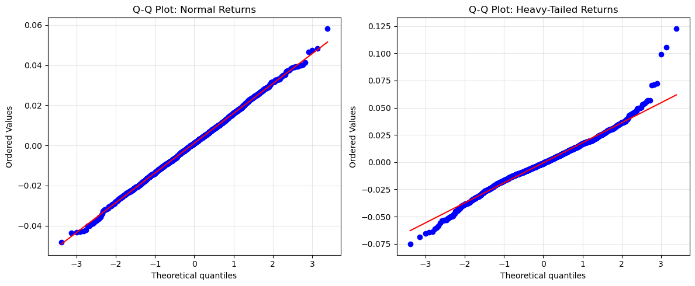

# 금융 수익률의 Q-Q 그림

## 개요

금융 자산 수익률은 정규성 가정이 무너지는 가장 중요한 실무 영역 가운데 하나이다. 이 페이지는 정규분포를 따르는 수익률과 스튜던트 $t$ 분포에서 생성한 두꺼운 꼬리 수익률을 비교하며, Q-Q 그림이 모의생성된 일별 수익률의 비정규성을 어떻게 진단하는지 보인다. 특징적인 S자 Q-Q 패턴은 실제 수익률의 꼬리가 정규분포의 예측보다 두껍다는 사실을 드러내며, 위험관리에 결정적인 함의를 갖는다.

## 금융 수익률 모의생성

일별 로그수익률은 흔히 다음과 같이 모형화한다.

$$
r_t = \mu + \sigma\, \varepsilon_t,
$$

여기서 $\mu$는 기대 일별 수익률, $\sigma$는 일별 변동성, $\varepsilon_t$는 표준화된 혁신항이다. 정규 모형에서는 $\varepsilon_t \sim \mathcal{N}(0,1)$이다. 두꺼운 꼬리 모형에서는 자유도 $\nu$인 $\varepsilon_t \sim t_\nu$이다. 주식 수익률에 대한 실증연구는 대체로 $\nu$를 3~8 범위에서 찾으며, 이는 정규분포보다 상당히 두꺼운 꼬리를 뜻한다.

<div class="exbox" markdown>

**보기 1.** <span class="diff easy" title="쉬움"></span> 요약통계 넷 가운데 믿을 수 있는 것은 몇 개인가. 일평균 $\mu = 0.0005$, 척도 $0.015$로 정규 계열과 $t_6$ 계열을 각각 $n = 2000$개 만들어 평균 · 표준편차 · 왜도 · 초과첨도를 재고 자르크–베라를 돌린다.

**(1)** 정규 계열의 표본평균이 $0.001176$으로 지정한 $\mu = 0.0005$의 두 배를 넘는다. 이것이 이상한 일인가. 표준오차로 판정하시오. 그리고 **$\mu$ 를 2 표준오차 안에서 집어내려면 며칠의 자료가 필요한가.**

**(2)** 두 계열의 표준편차가 $0.014823$과 $0.018552$로 다르다. 둘 다 `scale=0.015`로 만들었는데 왜 그런가. 이론값을 계산해 표본값과 견주시오.

**(3)** 꼬리 계열의 초과첨도 $2.4735$를 $t_6$의 이론값 $6/(6-4) = 3$과 견주시오. 작게 나온 것이 우연인가.

</div>

??? success "풀이"

    ```python
    import numpy as np
    from scipy import stats

    np.random.seed(42)
    n = 2000

    # 정규 수익률: 일평균 0.05%, 변동성 1.5%
    normal_returns = np.random.normal(loc=0.0005, scale=0.015, size=n)

    # 꼬리가 두꺼운 수익률: 자유도 6 인 t. 평균과 척도는 위와 같게 맞췄으므로
    # 달라지는 것은 꼬리뿐이다. 요약통계에서 초과첨도만 크게 벌어진다.
    heavy_returns = stats.t.rvs(df=6, loc=0.0005, scale=0.015, size=n)

    for name, r in [("Normal", normal_returns), ("Heavy-tailed", heavy_returns)]:
        g1 = stats.skew(r)
        g2 = stats.kurtosis(r)
        _, p_jb = stats.jarque_bera(r)
        print(f"{name}: mean={r.mean():.6f}, std={r.std():.6f}, "
              f"skew={g1:.4f}, excess_kurt={g2:.4f}, JB p={p_jb:.4g}")
    ```

    출력:

    ```text
    Normal: mean=0.001176, std=0.014823, skew=0.0329, excess_kurt=0.0513, JB p=0.7486
    Heavy-tailed: mean=-0.000555, std=0.018552, skew=0.2201, excess_kurt=2.4735, JB p=6.062e-115
    ```

    **(1) 이상한 일이 아니고, 오히려 평균은 애초에 추정할 수 없는 양이다.** 표본평균의 표준오차는

    $$
    \mathrm{SE}(\bar r) = \frac{\sigma}{\sqrt n} = \frac{0.015}{\sqrt{2000}} = 0.000335
    $$

    이다. 관측된 치우침 $0.001176 - 0.0005 = 0.000676$은 $2.02\,\mathrm{SE}$이니 흔한 흔들림이다.

    요점은 그 다음이다. **지정한 $\mu = 0.0005$ 자체가 $1.49\,\mathrm{SE}$에 지나지 않는다.** 곧 $n = 2000$일(약 8년)의 자료로도 "일평균 수익률이 0 인지 $0.05\%$인지"를 구별할 수 없다. $\mu$ 를 2 표준오차 안에서 집어내려면

    $$
    \frac{\mu}{\sigma/\sqrt n} \ge 2
    \quad\Longrightarrow\quad
    n \ge \Bigl(\frac{2\sigma}{\mu}\Bigr)^2 = \Bigl(\frac{2 \times 0.015}{0.0005}\Bigr)^2 = 3600
    $$

    일, 곧 거래일 252일로 치면 **14년 이상**이 필요하다. 그만한 기간이면 $\mu$ 자체가 일정하다고 볼 수 없다. **금융 수익률에서 1차 적률은 사실상 추정 불가능하고, 추정할 수 있는 것은 2차 적률 이상**이라는 것이 이 수치의 뜻이다.

    꼬리 계열도 같은 사정이다. 표본평균 $-0.000555$는 지정값과 부호마저 다른데, 이론 표준오차 $0.018371/\sqrt{2000} = 0.000411$로 재면 $-2.57\,\mathrm{SE}$다. 조금 큰 편이지만 계열 둘을 본 것이므로 놀랄 값은 아니다.

    **(2) `scale` 은 표준편차가 아니다.** `stats.t.rvs(df, scale=s)`의 모수화는 $X = \text{loc} + s\,T_\nu$이고 $T_\nu$ 자체의 분산이 1 이 아니다. $\nu > 2$에서 $\operatorname{Var}(T_\nu) = \nu/(\nu-2)$이므로

    $$
    \operatorname{sd}(X) = s\sqrt{\frac{\nu}{\nu-2}}
        = 0.015\sqrt{\frac{6}{4}} = 0.015 \times 1.2247 = 0.018371
    $$

    이다. 표본값 $0.018552$가 이 이론값에 $1.0\%$ 안에서 맞는다. 표본 비 $0.018552/0.014823 = 1.2515$도 이론 비 $\sqrt{1.5} = 1.2247$에 가깝다.

    그러므로 **"꼬리만 두꺼운 두 계열"이 아니다.** 꼬리 계열은 변동성 자체가 $22\%$ 크다. 순수한 꼬리 효과만 보려면 `scale=0.015/np.sqrt(1.5)`로 두어 표준편차를 맞춰야 한다. 이 혼동은 뒤의 VaR 계산에서 $35\%$ 대 $10\%$라는 자릿수 차이를 낳는다.

    **(3) 우연이 아니라 규칙이다.** $t_6$에서 $g_2$의 표본분포를 재 보면 된다.

    ```python
    print(f"g1: 정규 g1={stats.skew(normal_returns):.4f} G1="
          f"{stats.skew(normal_returns, bias=False):.4f}  |  "
          f"꼬리 g1={stats.skew(heavy_returns):.4f} G1="
          f"{stats.skew(heavy_returns, bias=False):.4f}")
    print(f"g2: 정규 g2={stats.kurtosis(normal_returns):.4f} G2="
          f"{stats.kurtosis(normal_returns, bias=False):.4f}  |  "
          f"꼬리 g2={stats.kurtosis(heavy_returns):.4f} G2="
          f"{stats.kurtosis(heavy_returns, bias=False):.4f}")
    print(f"정규 아래 SE: g1 sqrt(6/n)={np.sqrt(6 / n):.4f}, "
          f"g2 sqrt(24/n)={np.sqrt(24 / n):.4f}")

    # 참으로 t_6 인 자료에서 g2 의 표본분포.
    rng = np.random.default_rng(5)
    g2s = np.array([stats.kurtosis(stats.t.rvs(df=6, size=2000, random_state=rng))
                    for _ in range(2000)])
    print(f"\nt_6 에서 g2 (이론 3.0): 중앙값 {np.median(g2s):.2f}"
          f"  평균 {g2s.mean():.2f}  5~95% [{np.percentile(g2s, 5):.2f}, "
          f"{np.percentile(g2s, 95):.2f}]  최대 {g2s.max():.1f}")
    print(f"  P(g2 <= 2.4735) = {np.mean(g2s <= 2.4735):.3f}")
    ```

    출력:

    ```text
    g1: 정규 g1=0.0329 G1=0.0329  |  꼬리 g1=0.2201 G1=0.2203
    g2: 정규 g2=0.0513 G2=0.0544  |  꼬리 g2=2.4735 G2=2.4827
    정규 아래 SE: g1 sqrt(6/n)=0.0548, g2 sqrt(24/n)=0.1095

    t_6 에서 g2 (이론 3.0): 중앙값 2.17  평균 2.68  5~95% [1.22, 5.78]  최대 22.9
      P(g2 <= 2.4735) = 0.626
    ```

    참으로 $t_6$인 자료 2000벌에서 $g_2$의 **중앙값이 $2.17$로 참값 $3$보다 훨씬 작고**, 90% 구간은 $[1.22,\ 5.78]$로 벌어지며 최댓값은 $22.9$까지 올라갔다. 관측된 $2.4735$는 **63 백분위수**다. 곧 작게 나온 것이 아니라 **중앙값보다 오히려 큰** 값이다.

    왜 중앙값이 참값 아래로 쏠리는가. $g_2$의 점근분산이 8차 적률 $\mu_8$을 품는데 $t_\nu$는 $\nu$차 이상의 적률을 갖지 않으므로 $\nu = 6$이면 $\mu_8 = \infty$다. 중심극한정리가 적용되지 않고, 표본분포가 오른쪽으로 길게 늘어진 꼴이 된다. 그런 분포에서는 **평균이 참값에 맞아도 중앙값은 참값 아래**가 된다 — 실제로 평균 $2.68$이 중앙값 $2.17$보다 크다. 극단값이 몇 개 뽑히는 드문 표본이 평균을 떠받치고, 나머지 대다수 표본은 참값을 밑도는 구조다.

    **판본을 밝혀 두자.** 위 출력은 `scipy.stats.skew`·`kurtosis`의 기본값(`bias=True`, `fisher=True`)이므로 보정하지 않은 $g_1$, $g_2$이고 초과첨도다. 이 쪽의 연습문제 1 은 `bias=False`를 주어 $G_1 = 0.2203$, $G_2 = 2.4827$을 보고하는데, $n = 2000$에서 두 판본의 차이는 $0.4\%$ 미만이라 결론에 영향이 없다. 그러나 **자르크–베라에 넣을 때는 반드시 $g_1$, $g_2$를 써야 한다.** 그 통계량의 정의가 보정하지 않은 적률비 위에 세워져 있다.

    요약하면 **넷 가운데 믿을 만한 것은 표준편차 하나뿐이다.** 평균은 신호가 잡음에 묻혀 있고, 왜도는 $t_6$의 참값 0 에 대해 $0.22$가 나왔으며($\mu_6 = \infty$이므로 역시 불안정하다), 초과첨도는 참값의 $72\%$ 자리에 중앙값이 놓인다. 그런데도 자르크–베라는 $p = 6\times10^{-115}$로 비정규성을 확실하게 잡아낸다 — **방향은 맞히지만 크기는 못 믿는다**는 것이 적률 기반 진단의 성격이다.

!!! warning "`scale` 모수는 표준편차가 아니다"
    두 계열의 표준편차가 $0.0148$과 $0.0186$으로 25% 차이가 난다. 둘 다 `scale=0.015`로 생성했는데도 그렇다.

    이유는 `stats.t.rvs(df, scale=s)`의 `scale`이 표준편차가 아니라 **척도 모수**이기 때문이다. $t_\nu$ 척도족의 표준편차는

    $$
    \text{sd} = s \sqrt{\frac{\nu}{\nu - 2}}
    $$

    이며, $\nu = 6$, $s = 0.015$이면 $0.015 \times \sqrt{1.5} = 0.01837$이다(표본값 $0.01855$가 이에 부합한다).

    곧 위 비교에서 "두꺼운 꼬리" 계열은 꼬리만 두꺼운 것이 아니라 **변동성 자체가 22% 크다**. 순수한 꼬리 효과만 보려면 `scale=0.015/np.sqrt(1.5)`로 두어 표준편차를 맞춰야 한다. 이 구분은 뒤의 VaR 논의에서 결정적으로 중요해진다.

## Q-Q 그림 비교

두 수익률 계열을 비교하면 Q-Q 그림의 진단력이 분명해진다.

<div class="exbox" markdown>

**보기 2.** <span class="diff easy" title="쉬움"></span> 같은 눈금으로 두 칸을 나란히. 보기 1 의 두 계열을 정규 Q-Q 그림 두 칸에 나란히 그린다. 왼쪽이 정규 계열, 오른쪽이 $t_6$ 계열이다.

**(1)** 두 칸의 상관계수 $r$ 과 구간별 잔차를 재어, S자가 **꼬리에서만** 생기는 것임을 수로 보이시오. 왼쪽 칸(참으로 정규인 자료)도 양 끝에서는 직선을 벗어난다 — 그 폭은 오른쪽 칸의 몇 분의 몇인가.

**(2)** 본문은 Q-Q 그림이 **척도에 불변**이라고 한다. 두 칸의 적합선 기울기를 재어 그 말이 무슨 뜻인지 확인하시오.

**(3)** 두 계열에서 $\lvert z\rvert > 3$, $\lvert z\rvert > 4$인 관측값의 개수를 세어 정규분포의 기대와 견주시오.

</div>

??? success "풀이"

    유도할 식이 없는 읽기 문제다. **두 칸의 차이를 눈대중이 아니라 수로 잡아내는 것**이 이 보기의 몫이다.

    ```python
    import numpy as np
    import matplotlib.pyplot as plt
    from scipy import stats

    np.random.seed(42)
    normal_returns = np.random.normal(0.0005, 0.015, 2000)
    heavy_returns = stats.t.rvs(df=6, loc=0.0005, scale=0.015, size=2000)

    # 왼쪽은 직선에 붙고, 오른쪽은 양끝이 S 자로 휘어 오른다.
    # 이 휘어짐이 두꺼운 꼬리의 눈에 보이는 모습이다.
    fig, axes = plt.subplots(1, 2, figsize=(12, 5))

    stats.probplot(normal_returns, dist="norm", plot=axes[0])
    axes[0].set_title("Q-Q Plot: Normal Returns")
    axes[0].grid(True, alpha=0.3)

    stats.probplot(heavy_returns, dist="norm", plot=axes[1])
    axes[1].set_title("Q-Q Plot: Heavy-Tailed Returns")
    axes[1].grid(True, alpha=0.3)

    plt.tight_layout()
    plt.show()
    ```

    

    두 칸에서 읽을 수치를 따로 찍어 둔다.

    ```python
    for name, r in [("정규", normal_returns), ("꼬리", heavy_returns)]:
        (osm, osr), (slope, intercept, rho) = stats.probplot(r, dist="norm")
        resid = osr - (intercept + slope * osm)
        s = r.std(ddof=1)
        print(f"[{name}] 기울기 {slope:.6f}  표본표준편차 {s:.6f}  r {rho:.6f}")
        for lo, lab in [(1, "|q| < 1"), (2, "|q| > 2")]:
            m = np.abs(osm) < lo if lo == 1 else np.abs(osm) > lo
            mx = np.abs(resid[m]).max()
            print(f"    {lab}: {m.sum()}점  최대절대잔차 {mx:.5f}"
                  f"  (표준편차의 {mx / s:.3f}배)")
        print(f"    끝점 잔차 {resid[0]:+.5f}, {resid[-1]:+.5f}")
        print(f"    최댓값 {osr[-1]:.5f}  적합선 {intercept + slope * osm[-1]:.5f}")
        z = (r - r.mean()) / s
        print(f"    |z|>3 {np.sum(np.abs(z) > 3)}개 (정규 기대 "
              f"{2000 * 2 * stats.norm.sf(3):.2f}), "
              f"|z|>4 {np.sum(np.abs(z) > 4)}개 (기대 "
              f"{2000 * 2 * stats.norm.sf(4):.3f})")
        print(f"    샤피로-윌크 p = {stats.shapiro(r)[1]:.4g}")
    ```

    출력:

    ```text
    [정규] 기울기 0.014842  표본표준편차 0.014827  r 0.999734
        |q| < 1: 1366점  최대절대잔차 0.00050  (표준편차의 0.034배)
        |q| > 2: 90점  최대절대잔차 0.00677  (표준편차의 0.456배)
        끝점 잔차 +0.00105, +0.00677
        최댓값 0.05829  적합선 0.05152
        |z|>3 7개 (정규 기대 5.40), |z|>4 0개 (기대 0.127)
        샤피로-윌크 p = 0.9086
    [꼬리] 기울기 0.018386  표본표준편차 0.018556  r 0.989588
        |q| < 1: 1366점  최대절대잔차 0.00225  (표준편차의 0.121배)
        |q| > 2: 90점  최대절대잔차 0.06098  (표준편차의 3.286배)
        끝점 잔차 -0.01236, +0.06098
        최댓값 0.12280  적합선 0.06182
        |z|>3 17개 (정규 기대 5.40), |z|>4 4개 (기대 0.127)
        샤피로-윌크 p = 6.076e-16
    ```

    **(1) S자는 꼬리에서만 생긴다.** 구간별로 재면 한눈에 보인다.

    | 구간 | 정규 칸 | 꼬리 칸 | 비 |
    |---|---|---|---|
    | $\lvert q\rvert < 1$ (1366점) | $0.034\,s$ | $0.121\,s$ | $3.6$ |
    | $\lvert q\rvert > 2$ (90점) | $0.456\,s$ | $3.286\,s$ | $7.2$ |

    가운데 1366점에서는 두 칸의 잔차가 각각 표준편차의 $3.4\%$와 $12\%$다. **둘 다 작다.** $t_6$ 자료도 분포의 가운데에서는 정규와 거의 구별되지 않는다는 뜻이다. 그런데 꼬리의 90점으로 가면 정규 칸이 $0.456\,s$인데 꼬리 칸은 $3.286\,s$다. 표준편차의 **세 배를 넘게** 벗어난 점이 있다. 상관계수로 요약하면 $0.999734$ 대 $0.989588$이다.

    오른쪽 칸의 최댓값이 특히 극적이다. $0.12280$인데 적합선이 예측하는 자리는 $0.06182$니 **거의 두 배($1.99$배)**다. 일간 수익률로 읽으면 "정규 모형이 $6.2\%$를 예상한 자리에서 $12.3\%$가 일어났다"는 말이다.

    **왼쪽 칸도 양 끝에서는 벗어난다.** $0.456\,s$는 작은 값이 아니다. 이 자료가 참으로 $\mathcal{N}(0.0005, 0.015^2)$에서 나왔음은 틀릴 수 없는 사실이고, 샤피로–윌크도 $p = 0.909$로 조용하다. 꼬리 칸과의 비는 $3.286/0.456 = 7.2$배다. 곧 **"양 끝이 조금 벌어졌다"만으로는 아무것도 말할 수 없고, 7 배쯤 벌어져야 신호다.** 이 보기가 두 칸을 나란히 놓은 까닭이 여기 있다. 비교할 기준 칸이 없으면 $0.456\,s$를 보고도 비정규라고 오판한다.

    S자의 좌우가 고르지 않은 점도 적어 둘 만하다. 꼬리 칸의 아래쪽 끝 잔차가 $-0.01236$, 위쪽 끝이 $+0.06098$로 오른쪽이 $4.9$배 크다. $t_6$는 대칭분포이니 이것은 모집단의 성질이 아니라 **이 한 번의 추출 결과**다. 보기 1 에서 본 표본왜도 $g_1 = 0.22$가 같은 사실의 다른 표현이다.

    **(2) 척도 불변이란 기울기가 척도를 흡수한다는 뜻이다.** 두 칸의 기울기가 $0.014842$와 $0.018386$으로 다르고, 각각 자기 계열의 표본표준편차 $0.014827$ · $0.018556$과 $0.1\%$ · $0.9\%$ 안에서 맞는다. 보기 1 에서 본 대로 꼬리 계열의 변동성이 $22\%$ 크지만, **그 차이는 전부 기울기로 빨려 들어간다.**

    남는 것은 모양이다. 두 칸 모두 세로축이 자기 자료의 범위에 맞추어 그려지므로, 변동성이 큰 쪽이 "더 퍼져 보이는" 일은 일어나지 않는다. 오른쪽 칸에서 보이는 휘어짐은 변동성 차이가 아니라 **순수하게 꼬리 두께의 결과**다. 그래서 Q-Q 그림은 서로 단위가 다른 계열끼리도 모양을 비교할 수 있다 — 적률을 직접 견주는 방식이 할 수 없는 일이다.

    **(3) $4\sigma$ 밖의 개수가 결정적이다.**

    | 사건 | 정규 기대 | 정규 계열 | 꼬리 계열 |
    |---|---|---|---|
    | $\lvert z\rvert > 3$ | $5.40$개 | 7개 | 17개 |
    | $\lvert z\rvert > 4$ | $0.127$개 | 0개 | 4개 |

    $3\sigma$ 밖만 보면 두 계열이 7개 대 17개로 세 배 남짓이라 그럭저럭 흔한 차이처럼 보인다. 그런데 $4\sigma$ 밖으로 가면 정규 계열은 0개(기대 $0.127$개와 일치)인데 꼬리 계열은 **4개**다. 정규 세계에서 $n = 2000$ 표본에 4개가 나올 확률은 포아송 근사로 $e^{-0.127}\,0.127^4/4! \approx 9.5\times10^{-6}$, 곧 10만 번에 한 번이다.

    **위험 관리에서 중요한 것이 전부 이 구간에 있다.** 자료의 $0.2\%$에 해당하는 네 점이고 평균이나 표준편차를 거의 움직이지 않지만, VaR 와 기대손실은 바로 이 네 점이 결정한다. 그리고 이 네 점은 히스토그램에서 보이지 않는다 — Q-Q 그림이 금융 자료의 기본 진단 도구인 까닭이다.

## 꼬리 위험의 함의

정규 모형과 두꺼운 꼬리 모형의 차이는 극단 분위수에서 결정적으로 커진다. 포트폴리오의 수준 $\alpha$ 위험가치(VaR)는

$$
\text{VaR}_\alpha = -\mu - \sigma\, q_\alpha,
$$

여기서 $q_\alpha$는 혁신항 분포의 $\alpha$ 분위수이다.

여기서 **$\sigma$와 $q_\alpha$를 어떻게 짝지을지**가 핵심이다. 두 가지 계산을 구분해야 한다.

**(1) 원분위수 비교(잘못된 방식).** $\Phi^{-1}(0.01) = -2.326$과 $t_6^{-1}(0.01) = -3.143$을 그대로 비교하면 35% 차이가 난다. 그러나 $t_6$는 표준편차가 $1.2247$이므로 이 둘은 같은 단위가 아니다. 사과와 오렌지를 비교하는 셈이다.

**(2) 표준화 분위수 비교(올바른 방식).** 실무에서는 변동성 $\sigma$를 과거 자료에서 추정하므로, 혁신항 분포는 반드시 **분산 1로 표준화**해야 한다. 표준화된 $t_6$의 1% 분위수는

$$
\frac{t_6^{-1}(0.01)}{\sqrt{6/4}} = \frac{-3.1427}{1.2247} = -2.566.
$$

정규의 $-2.326$보다 **10.3%** 클 뿐이다. 35%가 아니다.

$\alpha$에 따라 이 비율이 어떻게 달라지는지 보자(표준화 기준).

| $\alpha$ | $\Phi^{-1}(\alpha)$ | 표준화 $t_6^{-1}(\alpha)$ | 비율 | 표준화 $t_5^{-1}(\alpha)$ | 비율 |
|---|---|---|---|---|---|
| 0.05 | $-1.645$ | $-1.586$ | **0.96** | $-1.561$ | **0.95** |
| 0.01 | $-2.326$ | $-2.566$ | 1.10 | $-2.607$ | 1.12 |
| 0.001 | $-3.090$ | $-4.253$ | 1.38 | $-4.565$ | 1.48 |

두 가지가 드러난다.

- **$\alpha = 0.05$에서는 정규 모형이 오히려 VaR를 과대추정한다**(비율 $< 1$). 분산을 맞춘 $t$ 분포는 중앙에 질량이 더 몰려 있어 5% 분위수가 정규보다 **덜** 극단적이다. 꼬리가 두꺼운 대가로 어깨가 얇아지는 것이다.
- 두꺼운 꼬리의 대가는 **극단 분위수에서만** 나타난다. $\alpha = 0.001$(약 4년에 한 번)에서야 40~50% 차이가 된다.

실무적 결론: "정규 모형이 꼬리 위험을 과소평가한다"는 말은 옳지만, 그 크기는 어느 분위수를 보느냐에 크게 의존한다. 표준적인 1% VaR에서는 10% 남짓이고, Basel III가 요구하는 극단 수준에서 비로소 심각해진다.

## 해석

Q-Q 그림은 금융 수익률 자료에 대해 단연 가장 중요한 진단 도구라 할 만하다. S자 패턴은 주식, 외환, 상품, 채권 수익률에서 모두 문서화되어 있다. 실무자는 다음을 지켜야 한다.

- 정규 기반 위험 모형을 적용하기 전에 항상 Q-Q 그림으로 정규성을 확인한다.
- Jarque-Bera 검정을 형식적 보조 진단으로 함께 쓴다.
- Q-Q 그림이 대각선에서 벗어나면 두꺼운 꼬리 분포($t_\nu$, 일반화 쌍곡분포)나 비모수 방법을 쓴다.
- 두꺼운 꼬리 모형을 적합할 때 **척도 모수와 표준편차를 혼동하지 않는다**.

## 연습문제

<div class="drillbox" markdown>

**연습문제 1.** <span class="diff med" title="중간"></span> 정규 수익률 2,000개와 $t_6$ 수익률 2,000개를 모의생성하라. 각각에 대해 표본왜도, 초과첨도, Jarque-Bera $p$값을 계산하라. 결과를 해석하라.

</div>

??? success "풀이"

    ```python
    import numpy as np
    from scipy import stats

    np.random.seed(42)
    normal_r = np.random.normal(0.0005, 0.015, 2000)
    heavy_r = stats.t.rvs(df=6, loc=0.0005, scale=0.015, size=2000)

    for name, r in [("Normal", normal_r), ("t(6)", heavy_r)]:
        g1 = stats.skew(r, bias=False)
        g2 = stats.kurtosis(r, fisher=True, bias=False)
        _, p = stats.jarque_bera(r)
        print(f"{name}: skew={g1:.4f}, kurt={g2:.4f}, JB p={p:.4g}")
    ```

    출력:

    ```text
    Normal: skew=0.0329, kurt=0.0544, JB p=0.7486
    t(6): skew=0.2203, kurt=2.4827, JB p=6.062e-115
    ```

    정규 수익률은 $g_1 = 0.033$, $g_2 = 0.054$로 모두 0에 가깝고 JB $p = 0.749$로 유의하지 않다. 정규성 가정이 잘 성립한다.

    $t_6$ 수익률은 $g_2 = 2.48$로 크게 양수이고 JB $p = 6 \times 10^{-115}$로 사실상 0이다. 두꺼운 꼬리를 확인해 준다. 이론적 초과첨도는 $6/(6-4) = 3$이므로 표본값 $2.48$이 아래로 편향되어 있는데, 두꺼운 꼬리 분포에서 표본첨도가 체계적으로 과소추정되는 알려진 현상이다.

    $t_6$의 표본왜도가 $0.22$로 0이 아닌 점도 눈여겨보라. $t$ 분포는 대칭이므로 참 왜도는 0이다. 두꺼운 꼬리 때문에 표본왜도의 변동이 크다는 뜻이다($n = 2000$에서 정규자료라면 표준오차가 $\sqrt{6/2000} = 0.055$에 불과하다).

    JB 통계량이 이렇게 극단적으로 큰 것은 첨도 성분과 이 우연한 왜도 성분이 함께 기여한 결과이다. $\square$

<div class="drillbox" markdown>

**연습문제 2.** <span class="diff med" title="중간"></span> 두 수익률 계열의 경험적 1, 5, 95, 99 백분위수를 계산하라. 이론적 정규분위수 $\mu + \sigma\,\Phi^{-1}(p)$와 비교하라.

</div>

??? success "풀이"

    ```python
    import numpy as np
    from scipy import stats

    np.random.seed(42)
    normal_r = np.random.normal(0.0005, 0.015, 2000)
    heavy_r = stats.t.rvs(df=6, loc=0.0005, scale=0.015, size=2000)

    percentiles = [1, 5, 95, 99]
    mu, sigma = 0.0005, 0.015
    print(f"{'Pct':>4} {'Normal':>10} {'Heavy':>10} {'Theo Normal':>12}")
    for p in percentiles:
        n_q = np.percentile(normal_r, p)
        h_q = np.percentile(heavy_r, p)
        t_q = mu + sigma * stats.norm.ppf(p / 100)
        print(f"{p:>4} {n_q:>10.5f} {h_q:>10.5f} {t_q:>12.5f}")
    ```

    출력:

    ```text
     Pct     Normal      Heavy  Theo Normal
       1   -0.03248   -0.04930     -0.03440
       5   -0.02295   -0.03132     -0.02417
      95    0.02581    0.02910      0.02517
      99    0.03530    0.04532      0.03540
    ```

    1백분위수와 99백분위수에서 두꺼운 꼬리 수익률이 정규 수익률보다 훨씬 멀리 뻗는다. 1백분위수에서 $-0.0493$ 대 $-0.0325$로 **52% 더 극단적**이다.

    다만 **이 52%를 순수한 꼬리 효과로 읽어서는 안 된다.** 개요의 경고대로 두 계열의 표준편차가 다르기 때문이다($0.01855$ 대 $0.01482$, 25% 차이). 이를 보정하면

    $$
    \frac{-0.0493/0.01855}{-0.03248/0.01482} = \frac{-2.658}{-2.192} = 1.213
    $$

    로 약 21%가 된다. 나머지는 변동성 차이에서 온 것이다.

    5백분위수에서는 차이가 훨씬 작다($-0.0313$ 대 $-0.0230$, 표준화하면 $1.687$ 대 $1.549$로 9%). 앞서 본 대로 두꺼운 꼬리의 효과가 극단 분위수에 집중된다는 사실과 일치한다. $\square$

<div class="drillbox" markdown>

**연습문제 3.** <span class="diff med" title="중간"></span> 두꺼운 꼬리 자료에서 S자 Q-Q 패턴이 생기는 이유를 설명하라. $t$ 분포의 $F^{-1}(p)$와 정규의 $\Phi^{-1}(p)$ 사이의 관계로 모양을 설명하라.

</div>

??? success "풀이"

    Q-Q 그림의 $x$축은 $\Phi^{-1}(p_i)$(정규 이론분위수)를, $y$축은 $X_{(i)}$(정렬된 자료)를 보여준다. 자료가 꼬리가 더 두꺼운 $t_\nu$ 분포에서 온다면, 작은 $p$(왼쪽 꼬리)에 대해

    $$
    t_\nu^{-1}(p) < \Phi^{-1}(p) \quad \text{(더 음수)},
    $$

    이므로 자료 점들이 기준선 *아래*로 떨어진다. 큰 $p$(오른쪽 꼬리)에 대해서는

    $$
    t_\nu^{-1}(p) > \Phi^{-1}(p) \quad \text{(더 양수)},
    $$

    이므로 자료 점들이 선 *위*로 올라간다. 중앙 근처($p \approx 0.5$)에서는 두 분위수함수가 비슷하므로 점들이 선 위에 머문다. 이것이 S자를 만든다. 왼쪽 꼬리에서는 위로 볼록(concave), 오른쪽 꼬리에서는 아래로 볼록(convex)이다. $\nu$가 작아질수록(꼬리가 두꺼울수록) S자가 심해진다.

    **미묘한 점.** 위 부등식은 $t_\nu$를 **표준화하지 않았을 때** 모든 $p$에 대해 성립한다. 분산을 1로 표준화하면 부등식이 극단 꼬리에서만 성립한다. 앞의 표에서 보았듯 표준화된 $t_6$의 5% 분위수는 $-1.586$으로 정규의 $-1.645$보다 오히려 **덜** 극단적이다.

    실제 Q-Q 그림에서는 이 구분이 문제가 되지 않는다. `probplot`이 자료에 직선을 적합하므로 척도가 자동으로 흡수되기 때문이다. 그래도 S자의 "교차점"이 정확히 어디인지는 표준화 여부에 따라 달라진다. $\square$

<div class="drillbox" markdown>

**연습문제 4.** <span class="diff med" title="중간"></span> $\nu > 4$에 대해 $t_\nu$ 분포의 이론적 초과첨도를 $\nu$의 함수로 계산하라. 초과첨도가 1 아래로 떨어지는 $\nu$ 값은 얼마인가?

</div>

??? success "풀이"

    $t_\nu$ 분포의 초과첨도는($\nu > 4$에 대해)

    $$
    \gamma_2 = \frac{6}{\nu - 4}.
    $$

    $\gamma_2 < 1$로 두면

    $$
    \frac{6}{\nu - 4} < 1 \implies \nu - 4 > 6 \implies \nu > 10.
    $$

    따라서 $\nu > 10$에서 초과첨도가 1 아래이다. $\nu = 10$에서는 정확히 $\gamma_2 = 1$이다. $\nu \leq 4$에서는 네 번째 적률이 존재하지 않아 $\gamma_2 = \infty$이다.

    | $\nu$ | 5 | 6 | 8 | 10 | 20 | 30 |
    |---|---|---|---|---|---|---|
    | $\gamma_2$ | 6.00 | 3.00 | 1.50 | 1.00 | 0.375 | 0.231 |

    실무에서 금융 수익률은 대체로 $\gamma_2$가 1과 10 사이이며 이는 대략 $\nu \in [4, 10]$인 $t_\nu$에 해당한다.

    표에서 $\gamma_2$가 $\nu$에 대해 얼마나 급격히 감쇠하는지 주목하라. $\nu$가 5에서 10으로 두 배가 되면 $\gamma_2$는 6에서 1로 6분의 1이 된다. 자유도를 정밀하게 추정하기 어려운 이유이기도 하다. $\nu$의 작은 오차가 첨도의 큰 오차로 번역된다. $\square$

<div class="drillbox" markdown>

**연습문제 5.** <span class="diff hard" title="어려움"></span> 어떤 위험관리자가 정규분포로 1% 위험가치를 계산한다. 1% 수준에서 $t_\nu$ VaR와 정규 VaR의 비율이 $\nu \to \infty$일 때 1로 수렴함을 보이고, $\nu = 5$에 대해 그 비율을 계산하라.

</div>

??? success "풀이"

    수준 $\alpha$에서의 VaR 비율은

    $$
    R(\nu) = \frac{t_\nu^{-1}(\alpha)}{\Phi^{-1}(\alpha)}.
    $$

    $\nu \to \infty$일 때 $t_\nu \to \mathcal{N}(0,1)$이므로 $t_\nu^{-1}(\alpha) \to \Phi^{-1}(\alpha)$이고 $R(\nu) \to 1$이다.

    $\nu = 5$, $\alpha = 0.01$에 대해

    ```python
    import numpy as np
    from scipy import stats

    q_t5 = stats.t.ppf(0.01, df=5)
    q_norm = stats.norm.ppf(0.01)
    sd_t5 = np.sqrt(5 / 3)   # sd of t(5)

    print(f"t(5) quantile (raw):          {q_t5:.4f}")
    print(f"t(5) sd:                      {sd_t5:.4f}")
    print(f"t(5) quantile (standardised): {q_t5 / sd_t5:.4f}")
    print(f"Normal quantile:              {q_norm:.4f}")
    print(f"Raw ratio:                    {q_t5 / q_norm:.4f}")
    print(f"Standardised ratio:           {(q_t5 / sd_t5) / q_norm:.4f}")
    ```

    출력:

    ```text
    t(5) quantile (raw):          -3.3649
    t(5) sd:                      1.2910
    t(5) quantile (standardised): -2.6065
    Normal quantile:              -2.3263
    Raw ratio:                    1.4464
    Standardised ratio:           1.1204
    ```

    두 비율이 크게 다르다. **어느 쪽이 옳은지는 모형을 어떻게 보정했느냐에 달려 있다.**

    - **원비율 $1.447$:** $t_5$의 척도 모수를 정규의 $\sigma$와 같게 두었을 때의 값이다. 그러나 그렇게 두면 $t_5$ 모형의 변동성이 정규 모형보다 29% 크다. 곧 이 45%는 꼬리 효과와 변동성 효과가 뒤섞인 값이다.

    - **표준화 비율 $1.120$:** 두 모형의 **분산을 같게** 맞추었을 때의 값이다. 실무에서 $\sigma$를 과거 수익률에서 추정하면 자동으로 이쪽이 된다. **순수한 꼬리 효과는 12%이다.**

    "정규 모형이 참 손실을 절반 가까이 과소추정한다"는 서술은 따라서 과장이다. 1% VaR에서 실제 과소추정은 약 12%이다. 물론 12%도 결코 작지 않고 자본 규모에 실질적 영향을 준다.

    두꺼운 꼬리가 정말 중요해지는 것은 더 극단적인 수준에서다. $\alpha = 0.001$이면 표준화 비율이 $1.477$로 48%가 되고, $\alpha = 0.0001$이면 더 커진다. Basel III가 1% VaR가 아니라 97.5% 기대손실 같은 지표를 쓰는 이유이기도 하다. $\square$

---

## 정리하며

금융 수익률은 **정규성이 무너지는 대표적 현장**이다.

- **S 자 패턴이 특징이다.** 양 끝이 직선 위아래로 크게 벗어나며, 이는 **정규분포가 예측하는 것보다 극단이 훨씬 자주 일어난다**는 뜻이다.
- **정규와 $t$ 를 나란히 그리면 차이가 분명하다.** 같은 분산이라도 $t$ 쪽 꼬리가 두껍고, 그 모양이 실제 수익률과 닮아 있다.
- **위험관리에 직결된다.** 정규 가정의 VaR 은 극단 손실 확률을 크게 과소평가하며, 3장에서 재어 보았듯 $z=4$ 부근에서 오차가 자릿수 단위다.
- **5장의 금융위기 절과 이어진다.** 거기서는 **의존성**이 꼬리를 두껍게 만들었고, 여기서는 **주변분포 자체**가 두껍다. 실제로는 둘이 겹친다.
- **처방은 분포를 바꾸는 것이다.** $t$ 분포, 극단값 이론, 또는 역사적 시뮬레이션을 쓴다.

다음 절부터 **기술통계 기반 방법**으로 넘어간다.
