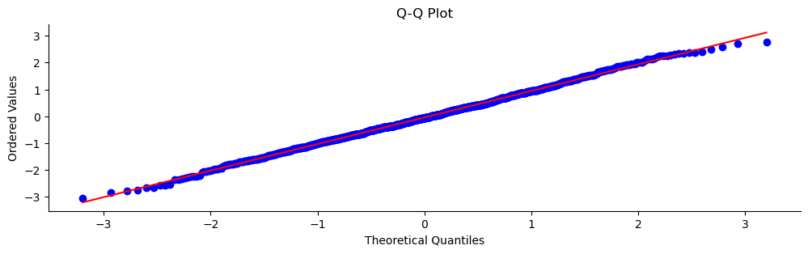
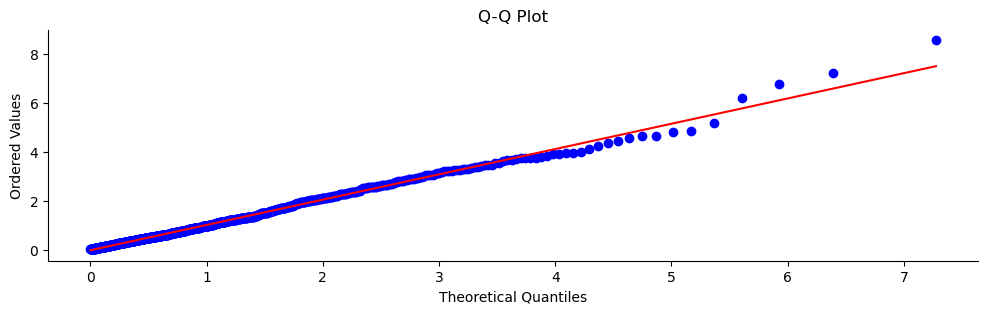
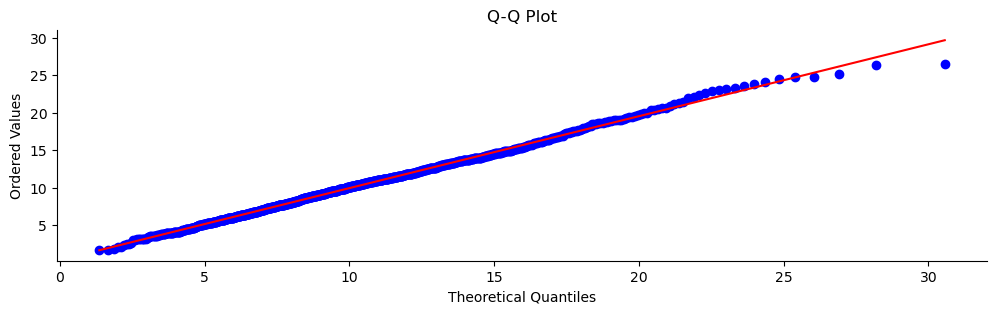

# Q-Q 그림 (분위수-분위수 그림)

## 개요

**Q-Q 그림**은 자료의 분위수를 이론적 정규분포의 분위수와 비교한다. 자료가 정규분포를 따르면 Q-Q 그림의 점들이 직선 대각선을 따라 놓여야 한다. 이 선에서 벗어나면 정규성에서 이탈했음을 나타낸다.

## 정규분포와의 Q-Q 그림

```python
import numpy as np
import matplotlib.pyplot as plt
import scipy.stats as stats

def plot_qq_with_custom_spines(data, dist="norm", sparams=(), figsize=(12, 3)):
    """
    Generates a Q-Q plot to assess if the data follows the specified distribution.
    Adjusts the spines for a cleaner visual appearance.

    Parameters:
    - data (array-like): The input dataset to plot.
    - dist (str): The theoretical distribution to compare against (default: "norm").
    - sparams (tuple): Shape parameters for the specified distribution.
    - figsize (tuple): The size of the plot (width, height).

    Returns:
    - None: Displays the Q-Q plot.
    """
    fig, ax = plt.subplots(figsize=figsize)
    stats.probplot(data, dist=dist, sparams=sparams, plot=ax)

    ax.spines[["top", "right"]].set_visible(False)
    ax.set_title('Q-Q Plot')
    ax.set_xlabel('Theoretical Quantiles')
    ax.set_ylabel('Ordered Values')
    plt.show()

if __name__ == "__main__":
    np.random.seed(0)
    sample_data = np.random.normal(loc=0, scale=1, size=1000)
    plot_qq_with_custom_spines(sample_data, dist="norm")
```



자료가 정규분포를 따를 때 점들이 대각 기준선에 가깝게 놓인다.

## 지수분포와의 Q-Q 그림

```python
import numpy as np
import matplotlib.pyplot as plt
import scipy.stats as stats

def plot_qq_with_custom_spines(data, dist="norm", sparams=(), figsize=(12, 3)):
    """
    Generates a Q-Q plot to assess if the data follows the specified distribution.
    """
    fig, ax = plt.subplots(figsize=figsize)
    stats.probplot(data, dist=dist, sparams=sparams, plot=ax)

    ax.spines[["top", "right"]].set_visible(False)
    ax.set_title('Q-Q Plot')
    ax.set_xlabel('Theoretical Quantiles')
    ax.set_ylabel('Ordered Values')
    plt.show()

if __name__ == "__main__":
    np.random.seed(0)
    sample_data = np.random.exponential(scale=1, size=1000)
    plot_qq_with_custom_spines(sample_data, dist="expon")
```



지수 자료를 자기 자신의 이론적 분포와 비교하면 점들이 잘 정렬된다. 그러나 같은 자료를 **정규분포**와 비교하면 강한 곡률이 나타나 정규성에서의 이탈이 드러난다. `dist="norm"`으로 바꿔 실행해 보면 그 차이를 바로 확인할 수 있다.

## 카이제곱분포와의 Q-Q 그림

```python
import numpy as np
import matplotlib.pyplot as plt
import scipy.stats as stats

def plot_qq_with_custom_spines(data, dist="norm", sparams=(), figsize=(12, 3)):
    """
    Generates a Q-Q plot to assess if the data follows the specified distribution.
    """
    fig, ax = plt.subplots(figsize=figsize)
    stats.probplot(data, dist=dist, sparams=sparams, plot=ax)

    ax.spines[["top", "right"]].set_visible(False)
    ax.set_title('Q-Q Plot')
    ax.set_xlabel('Theoretical Quantiles')
    ax.set_ylabel('Ordered Values')
    plt.show()

if __name__ == "__main__":
    np.random.seed(0)
    sample_data = np.random.chisquare(df=10, size=1000)
    plot_qq_with_custom_spines(sample_data, dist="chi2", sparams=(10,))
```



카이제곱 자료를 (자유도가 일치하는) 자기 자신의 이론적 분포와 비교하면 Q-Q 그림이 잘 맞는다. 정규 Q-Q 그림과 비교하면 꼬리에서 위로 휘는 모습으로 오른쪽 치우침이 드러난다.

## 연습문제

<div class="drillbox" markdown>

**연습문제 1.**
정규성 평가를 위한 Q-Q 그림의 구성을 기술하라. $x$축과 $y$축은 각각 무엇을 나타내는가?

</div>

??? success "풀이"
    정규 Q-Q 그림을 만드는 절차:

    1. 자료를 정렬한다: $x_{(1)} \leq x_{(2)} \leq \dots \leq x_{(n)}$.
    2. 이론적 분위수를 계산한다: $q_i = \Phi^{-1}((i - 0.5)/n)$. 여기서 $\Phi^{-1}$은 표준정규 분위수함수이다.
    3. 점 $(q_i, x_{(i)})$를 그린다.

    **$x$축**은 이론적 정규분위수(자료가 정규라면 어떤 모습이어야 하는지)를 보여준다. **$y$축**은 실제 정렬된 자료값을 보여준다. 자료가 정규이면 점들이 기울기 $\sigma$, 절편 $\mu$인 직선 위에 대략 놓인다.

<div class="drillbox" markdown>

**연습문제 2.**
Q-Q 그림에서 (a) 오른쪽으로 치우친 자료, (b) 꼬리가 두꺼운 자료, (c) 꼬리가 얇은 자료가 어떤 패턴을 보이는지 기술하라.

</div>

??? success "풀이"
    **(a) 오른쪽 치우침:** 양 끝이 모두 기준선 **위로** 올라간다. 오른쪽 꼬리에서는 표본분위수가 기대보다 크고(꼬리가 길다), 왼쪽 꼬리에서는 기대보다 덜 음수이다(꼬리가 짧다). 전체적으로 아래로 볼록한(convex) 모양이다.

    **(b) 두꺼운 꼬리(고첨):** 양쪽 꼬리가 모두 선에서 벗어난다. 왼쪽 꼬리는 선 아래로, 오른쪽 꼬리는 선 위로 휘어 S자 모양을 이룬다. 극단값이 정규분포의 예측보다 더 극단적이다.

    **(c) 얇은 꼬리(저첨):** 반대 방향의 S자 모양이다. 왼쪽 꼬리가 선 위로, 오른쪽 꼬리가 선 아래로 휜다. 극단값이 정규보다 덜 극단적이다.

<div class="drillbox" markdown>

**연습문제 3.**
어떤 Q-Q 그림에서 점들이 중앙에서는 거의 정확히 직선 위에 놓이는데 오른쪽 위에서 세 점이 선보다 훨씬 위에 있다. 이는 무엇을 시사하는가?

</div>

??? success "풀이"
    중앙의 선형성은 자료의 대부분이 근사적으로 정규임을 시사한다. 오른쪽 위에서 선보다 훨씬 위에 있는 세 점은 **이상점**이다. 정규분포가 예측하는 것보다 훨씬 큰 값들이다.

    이 패턴은 다른 과정에서 온 소수의 오염 관측값이 섞였을 때 흔하다(자료 입력 오류, 측정 이상, 또는 꼬리가 두꺼운 분포에서 나온 진짜로 드문 사건).

    조치: 자료 품질 문제가 있는지 이상점을 조사한다. 타당한 관측값이라면 로버스트 방법(절사평균, M 추정량)을 고려하거나, 정규 모형이 분포의 중심에는 맞지만 꼬리에는 맞지 않는다는 점을 인정한다.

<div class="drillbox" markdown>

**연습문제 4.**
Q-Q 그림과 P-P(확률-확률) 그림의 차이를 설명하라. 각각은 언제 선호되는가?

</div>

??? success "풀이"
    **Q-Q 그림**은 분위수를 비교한다. 정렬된 자료를 이론적 분위수에 대해 그린다. 축에서 꼬리 분위수가 멀리 벌어지므로 꼬리에서의 이탈에 민감하다.

    **P-P 그림**은 누적확률을 비교한다. $F_n(x_{(i)})$를 $F_0(x_{(i)})$에 대해 그린다. 점들이 (0,0)과 (1,1) 근처에 몰리며 분포 중앙에서 해상도가 가장 높다.

    추론에 꼬리 거동이 결정적이고 Q-Q 그림이 꼬리의 이탈을 확대해 보여 주므로, 정규성 평가에는 **Q-Q 그림이 선호된다**. 분포의 중앙이 더 중요하거나(예: 보정 평가) 꼬리 거동이 다른 분포들을 비교할 때는 **P-P 그림이 선호된다**.
