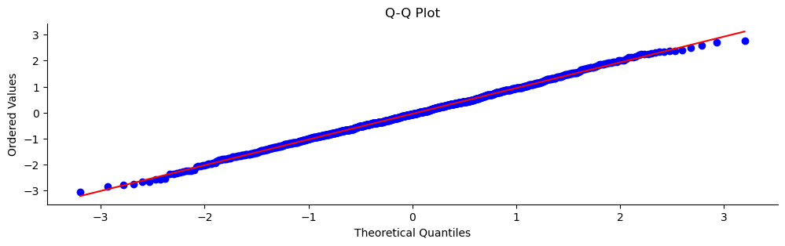
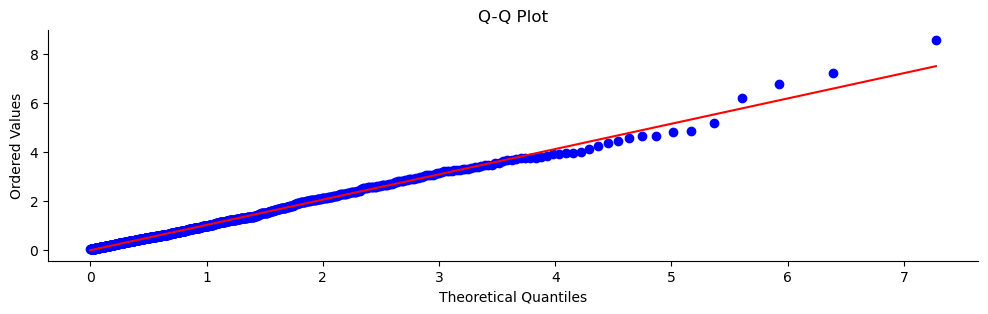
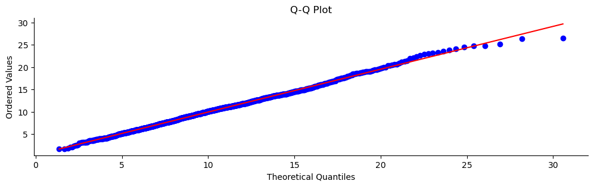

# Q-Q 그림 (분위수-분위수 그림)

## 개요

**Q-Q 그림**은 자료의 분위수를 이론적 정규분포의 분위수와 비교한다. 자료가 정규분포를 따르면 Q-Q 그림의 점들이 직선 대각선을 따라 놓여야 한다. 이 선에서 벗어나면 정규성에서 이탈했음을 나타낸다.

---

## 1. 정규분포와의 Q-Q 그림

<div class="exbox" markdown>

**보기 1.** <span class="diff easy" title="쉬움"></span> 맞는 분포끼리 견주면 얼마나 똑바른가. $\mathcal{N}(0,1)$에서 $n = 1000$개를 뽑아 정규 Q-Q 그림을 그린다.

**(1)** 적합선의 기울기와 절편이 각각 무엇을 추정하는지 수로 확인하시오.

**(2)** 자료가 **참으로 정규인데도** 양 끝 점들은 직선에서 벗어난다. 가운데($\lvert q\rvert < 1$)와 꼬리($\lvert q\rvert > 2$)의 최대 잔차를 재어 그 폭을 적으시오. 이 벗어남을 "정규성 위반"으로 읽으면 왜 안 되는가.

</div>

??? success "풀이"

    유도할 식이 없는 읽기 문제다. **참인 귀무가설 아래에서 Q-Q 그림이 어느 정도까지 흔들리는지**를 수로 재어 기준선을 세우는 것이 이 보기의 몫이다.

    ```python
    import numpy as np
    import matplotlib.pyplot as plt
    import scipy.stats as stats

    plt.rcParams["font.sans-serif"] = ["NanumGothic", "Apple SD Gothic Neo", "Malgun Gothic"]
    plt.rcParams["font.family"] = "sans-serif"
    plt.rcParams["axes.unicode_minus"] = False

    def plot_qq_with_custom_spines(data, dist="norm", sparams=(), figsize=(12, 3)):
        """Q-Q 그림을 그린다.

        자료의 분위수를 이론분포의 분위수와 짝지어 찍는다. 자료가 그 분포에서
        나왔다면 점들이 직선에 놓인다.

        매개변수
        --------
        data : 그릴 자료
        dist : 견줄 이론분포 이름 (기본값 "norm")
        sparams : 그 분포의 모양모수. 카이제곱의 자유도 같은 것이다.
        figsize : 그림 크기 (가로, 세로)
        """
        fig, ax = plt.subplots(figsize=figsize)
        stats.probplot(data, dist=dist, sparams=sparams, plot=ax)

        ax.spines[["top", "right"]].set_visible(False)
        ax.set_title('Q-Q Plot')
        ax.set_xlabel('Theoretical Quantiles')
        ax.set_ylabel('Ordered Values')
        plt.show()

    if __name__ == "__main__":
        # 자료와 이론분포가 맞으므로 점들이 직선에 놓인다.
        np.random.seed(0)
        sample_data = np.random.normal(loc=0, scale=1, size=1000)
        plot_qq_with_custom_spines(sample_data, dist="norm")
    ```

    

    그림에서 읽을 수치를 따로 찍어 둔다. `probplot`은 그림을 그리지 않을 때 `((osm, osr), (기울기, 절편, r))`을 돌려준다. 여기서 $r$ 은 두 축의 상관계수로, 점들이 얼마나 똑바른지를 하나의 수로 요약한다.

    ```python
    np.random.seed(0)
    x = np.random.normal(loc=0, scale=1, size=1000)
    (osm, osr), (slope, intercept, r) = stats.probplot(x, dist="norm")
    resid = osr - (intercept + slope * osm)

    print(f"기울기 {slope:.4f}   표본표준편차 {x.std(ddof=1):.4f}")
    print(f"절편   {intercept:.4f}   표본평균     {x.mean():.4f}")
    print(f"상관계수 r = {r:.6f}   r^2 = {r ** 2:.6f}")

    for lo, lab in [(1, "|q| < 1"), (2, "|q| > 2")]:
        m = np.abs(osm) < lo if lo == 1 else np.abs(osm) > lo
        print(f"{lab}: {m.sum()}점, 최대 절대잔차 {np.abs(resid[m]).max():.4f}")
    print(f"양 끝점의 잔차: {resid[0]:+.4f}, {resid[-1]:+.4f}")
    print(f"샤피로-윌크 p = {stats.shapiro(x)[1]:.4f}")
    print(f"g1 = {stats.skew(x):.4f}   g2 = {stats.kurtosis(x):.4f}")
    ```

    출력:

    ```text
    기울기 0.9893   표본표준편차 0.9875
    절편   -0.0453   표본평균     -0.0453
    상관계수 r = 0.999482   r^2 = 0.998965
    |q| < 1: 682점, 최대 절대잔차 0.0544
    |q| > 2: 46점, 최대 절대잔차 0.3587
    양 끝점의 잔차: +0.1624, -0.3587
    샤피로-윌크 p = 0.5912
    g1 = 0.0339   g2 = -0.0468
    ```

    **(1) 절편은 평균을, 기울기는 표준편차를 추정한다.** 절편 $-0.0453$은 표본평균과 소수 넷째 자리까지 같다. 최소제곱선이 $(\bar q, \bar x)$를 지나고 이론 분위수의 합이 대칭성 때문에 정확히 0 이므로, **절편이 표본평균과 일치하는 것은 우연이 아니다.** 기울기 $0.9893$은 표본표준편차 $0.9875$에 $0.2\%$ 안에서 맞고, 둘 다 참값 $\sigma = 1$보다 조금 작다. 기울기와 표준편차가 완전히 같지는 않다. 최소제곱 기울기는 $\sum q_i x_{(i)}/\sum q_i^2$인데 $\sum q_i^2/n$이 1 에 조금 못 미치기 때문이다.

    **(2) 참으로 정규인 자료도 꼬리에서 흔들린다.** 이것이 이 보기에서 가장 중요한 수치다.

    | 구간 | 점 개수 | 최대 절대잔차 | 표본표준편차 대비 |
    |---|---|---|---|
    | $\lvert q\rvert < 1$ | 682 | $0.0544$ | $5.5\%$ |
    | $\lvert q\rvert > 2$ | 46 | $0.3587$ | $36\%$ |

    가운데 682점은 직선에서 $0.054$ 이상 벗어나지 않는데, 꼬리의 46점은 최대 $0.359$까지 벗어난다. **6.6배**다. 양 끝점만 보면 왼쪽 끝이 선 위로 $0.162$, 오른쪽 끝이 선 아래로 $0.359$다.

    이것을 "정규성 위반"으로 읽으면 안 되는 까닭은 **자료가 참으로 $\mathcal{N}(0,1)$에서 나왔기 때문**이다. 틀릴 수 없는 사실이다. 샤피로–윌크가 $p = 0.5912$, 표본왜도 $g_1 = 0.034$, 초과첨도 $g_2 = -0.047$로 어느 쪽에서도 이상 신호가 없다.

    까닭은 순서통계량의 분산이 꼬리에서 크다는 데 있다. $i$번째 순서통계량의 분산은 대략

    $$
    \operatorname{Var}(X_{(i)}) \approx \frac{p_i(1-p_i)}{n\,\varphi(q_i)^2},
        \qquad p_i = \frac{i - 0.5}{n}
    $$

    인데, 분자 $p(1-p)$는 꼬리로 갈수록 작아지지만 분모의 밀도 $\varphi(q_i)^2$가 **훨씬 빠르게** 0 으로 간다. 그래서 꼬리 쪽 점의 표준오차가 가운데보다 몇 배 크다. 곧 **Q-Q 그림의 양 끝이 흔들리는 것은 정상이고, 신호가 아니라 잡음이다.**

    여기서 따라오는 실무 규칙이 두 가지다. 첫째, **꼬리 점 두세 개의 벗어남만으로 정규성을 의심하지 말라.** 이 보기가 보여 준 대로 참인 경우에도 표준편차의 36%까지 벌어진다. 둘째, **그러므로 눈대중이 아니라 신뢰띠가 필요하다.** 어느 정도의 벗어남이 "정상 범위"인지는 $n$과 $q$에 따라 달라지므로 그림 위에 그 범위를 그려 넣어야 한다 — 다음 절의 주제다.

    $r = 0.999482$라는 값도 기준선으로 기억할 만하다. 참으로 정규인 $n = 1000$ 표본에서 $r$ 이 $0.9995$ 정도 나온다. 뒤의 보기 2·3 에서 이 값과 견주게 된다.

---

## 2. 지수분포와의 Q-Q 그림

<div class="exbox" markdown>

**보기 2.** <span class="diff easy" title="쉬움"></span> 기준분포를 바꾸면 같은 자료가 어떻게 달리 보이는가. $\text{Exponential}(1)$에서 $n = 1000$개를 뽑아 **지수** Q-Q 그림을 그린다. Q-Q 그림이 정규 전용 도구가 아님을 보이는 대목이다.

**(1)** 같은 자료를 지수분포와 견준 그림, 정규분포와 견준 그림의 상관계수 $r$ 과 최대 잔차를 각각 재어 비교하시오.

**(2)** 정규분포와 견준 그림의 모양을 말하고, 표본왜도·초과첨도를 지수분포의 이론값과 견주시오. $\text{Exponential}(\lambda)$의 왜도와 초과첨도는 척도에 무관하게 각각 $2$, $6$ 이다.

</div>

??? success "풀이"

    **(2)** 의 이론값만 유도할 것이 있다. $X \sim \text{Exponential}(1)$이면 $E[X^k] = k!$이므로 $\mu = 1$, $\sigma^2 = 2! - 1 = 1$이고

    $$
    \mu_3 = E[(X-1)^3] = 6 - 3\cdot 2 + 2 = 2,
    \qquad \mu_4 = E[(X-1)^4] = 24 - 4\cdot 6 + 6\cdot 2 - 3 = 9
    $$

    이다. 따라서 왜도는 $\mu_3/\sigma^3 = 2$, 초과첨도는 $\mu_4/\sigma^4 - 3 = 9 - 3 = 6$이다. 척도를 바꾸어도 표준화된 적률이므로 변하지 않는다. **(1)** 은 읽기 문제다.

    ```python
    import numpy as np
    import matplotlib.pyplot as plt
    import scipy.stats as stats

    plt.rcParams["font.sans-serif"] = ["NanumGothic", "Apple SD Gothic Neo", "Malgun Gothic"]
    plt.rcParams["font.family"] = "sans-serif"
    plt.rcParams["axes.unicode_minus"] = False

    def plot_qq_with_custom_spines(data, dist="norm", sparams=(), figsize=(12, 3)):
        """Q-Q 그림을 그린다.

        자료의 분위수를 이론분포의 분위수와 짝지어 찍는다. 자료가 그 분포에서
        나왔다면 점들이 직선에 놓인다. 어느 자리에서 벗어나는지까지 보여 준다는
        점에서 히스토그램보다 낫다.
        """
        fig, ax = plt.subplots(figsize=figsize)
        stats.probplot(data, dist=dist, sparams=sparams, plot=ax)

        ax.spines[["top", "right"]].set_visible(False)
        ax.set_title('Q-Q Plot')
        ax.set_xlabel('Theoretical Quantiles')
        ax.set_ylabel('Ordered Values')
        plt.show()

    if __name__ == "__main__":
        # 이번에는 지수자료를 지수분포와 견준다. 맞는 분포끼리 견주면 역시
        # 직선이 된다. Q-Q 그림이 정규 전용이 아님을 보이는 대목이다.
        np.random.seed(0)
        sample_data = np.random.exponential(scale=1, size=1000)
        plot_qq_with_custom_spines(sample_data, dist="expon")
    ```

    

    같은 자료를 두 기준분포에 대고 수치를 견준다.

    ```python
    np.random.seed(0)
    x = np.random.exponential(scale=1, size=1000)

    for dist in ("expon", "norm"):
        (osm, osr), (slope, intercept, r) = stats.probplot(x, dist=dist)
        resid = osr - (intercept + slope * osm)
        print(f"{dist:6s}  기울기 {slope:.4f}  절편 {intercept:+.4f}"
              f"  r {r:.6f}  최대절대잔차 {np.abs(resid).max():.4f}")

    print(f"\n표본평균 {x.mean():.4f}   표본표준편차 {x.std(ddof=1):.4f}")
    print(f"g1 = {stats.skew(x):.4f}  (이론 2)")
    print(f"g2 = {stats.kurtosis(x):.4f}  (이론 6)")
    print(f"샤피로-윌크 p = {stats.shapiro(x)[1]:.4g}")
    ```

    출력:

    ```text
    expon   기울기 1.0349  절편 -0.0298  r 0.997717  최대절대잔차 1.0621
    norm    기울기 0.9252  절편 +1.0035  r 0.896539  최대절대잔차 4.5991

    표본평균 1.0035   표본표준편차 1.0296
    g1 = 2.0526  (이론 2)
    g2 = 6.4761  (이론 6)
    샤피로-윌크 p = 4.858e-33
    ```

    **(1) 기준분포를 바꾸는 것만으로 $r$ 이 $0.9977$에서 $0.8965$로 떨어진다.** 자료는 한 글자도 바뀌지 않았다.

    | 기준분포 | 기울기 | 절편 | $r$ | 최대 절대잔차 |
    |---|---|---|---|---|
    | 지수 | $1.0349$ | $-0.0298$ | $0.997717$ | $1.0621$ |
    | 정규 | $0.9252$ | $+1.0035$ | $0.896539$ | $4.5991$ |

    최대 잔차는 $1.06$에서 $4.60$으로 **4.3배** 커진다. 지수 쪽 기울기 $1.0349$와 절편 $-0.0298$은 참 척도 $1$ 과 참 위치 $0$ 에 가깝다.

    정규 쪽 계수는 한 가지를 더 알려 준다. 절편 $1.0035$는 표본평균과 정확히 같은데(앞서 본 대로 이론 분위수의 합이 0 이므로 늘 그렇다), **기울기 $0.9252$는 표본표준편차 $1.0296$에서 $10\%$ 어긋난다.** 보기 1 에서 둘이 $0.2\%$ 안에서 맞았던 것과 대비된다. 최소제곱 기울기는 $r \cdot s_x / s_q$이므로 $r$ 이 1 에서 멀어지는 만큼 기울기가 표준편차보다 작아진다. 곧 **"기울기가 표준편차를 추정한다"는 관계 자체가 자료가 기준분포에 맞을 때만 성립한다.**

    보기 1 에서 얻은 기준선과 견주면 더 분명하다. 참으로 맞는 분포끼리 견주었을 때 $r$ 은 $0.9995$(정규/정규)와 $0.9977$(지수/지수)이고, 틀린 분포와 견주면 $0.8965$다. **맞을 때는 $r$ 이 $0.997$ 위, 틀릴 때는 $0.90$ 아래**로 자릿수가 아니라 소수 둘째 자리에서 갈린다.

    지수/지수 쪽의 최대 잔차 $1.06$도 작지 않다는 점은 짚어 둘 만하다. 자료의 표준편차가 $1.03$이니 표준편차만큼 벗어난 점이 있다는 뜻이다. 보기 1 에서 본 그대로 **맞는 분포와 견주어도 꼬리의 한두 점은 크게 흔들린다.** 지수분포의 오른쪽 꼬리는 정규보다 훨씬 길어 그 흔들림이 더 크다.

    **(2) 정규와 견준 그림은 아래로 볼록하다(위로 휜다).** 양 끝이 모두 적합선 위로 올라간다. 왼쪽 꼬리는 0 에서 잘려 짧으므로 기대보다 **덜 음수**이고, 오른쪽 꼬리는 길게 늘어지므로 기대보다 **더 크다.** 둘이 합쳐 위로 휘는 곡선이 된다. 두꺼운 꼬리의 S자와는 다른 모양이며, **오른쪽 치우침의 서명**이다.

    표본의 모양 통계량이 그 치우침을 수로 확인한다. $g_1 = 2.0526$ 대 이론 $2$, $g_2 = 6.4761$ 대 이론 $6$으로 각각 $2.6\%$, $7.9\%$ 차이다(`scipy.stats.skew`·`kurtosis`의 기본값은 `bias=True`이므로 보정하지 않은 $g_1$, $g_2$이고, `fisher=True`이므로 초과첨도다). 네제곱 적률의 추정이 늘 더 불안정하므로 첨도 쪽 오차가 큰 것은 예상된 바다. 왜도 $2$는 작은 수가 아니다 — 참으로 정규인 보기 1 의 자료가 $g_1 = 0.034$였으니 **60배**다. 샤피로–윌크도 $p = 4.9\times10^{-33}$으로 압도적으로 기각한다.

    요점은 **Q-Q 그림이 "정규인가"를 묻는 도구가 아니라 "이 분포인가"를 묻는 도구**라는 것이다. `dist` 인수를 바꾸면 어떤 분포든 기준으로 삼을 수 있고, 지수 자료는 지수분포에 대고 보아야 똑바르다.

---

## 3. 카이제곱분포와의 Q-Q 그림

<div class="exbox" markdown>

**보기 3.** <span class="diff easy" title="쉬움"></span> 모양모수를 틀리게 주면 그림이 알려 주는가. $\chi^2_{10}$에서 $n = 1000$개를 뽑아 `sparams=(10,)`으로 카이제곱 Q-Q 그림을 그린다.

**(1)** `sparams` 를 **빠뜨리면** 어떻게 되는가. 실제로 돌려 확인하시오.

**(2)** 기준분포를 셋으로 바꾸어 — 참 자유도 $\chi^2_{10}$, 틀린 자유도 $\chi^2_{5}$, 정규 — 각각의 $r$ · 기울기 · 절편을 재시오. **$r$ 만 보고 모양모수가 틀렸음을 알아낼 수 있는가?**

</div>

??? success "풀이"

    읽기 문제다. $\chi^2_k$의 왜도 $\sqrt{8/k}$와 초과첨도 $12/k$만 이론값으로 쓴다. $k = 10$이면 각각 $0.8944$, $1.2$다.

    ```python
    import numpy as np
    import matplotlib.pyplot as plt
    import scipy.stats as stats

    plt.rcParams["font.sans-serif"] = ["NanumGothic", "Apple SD Gothic Neo", "Malgun Gothic"]
    plt.rcParams["font.family"] = "sans-serif"
    plt.rcParams["axes.unicode_minus"] = False

    def plot_qq_with_custom_spines(data, dist="norm", sparams=(), figsize=(12, 3)):
        """Q-Q 그림을 그린다.

        자료의 분위수를 이론분포의 분위수와 짝지어 찍는다. 자료가 그 분포에서
        나왔다면 점들이 직선에 놓인다. 어느 자리에서 벗어나는지까지 보여 준다는
        점에서 히스토그램보다 낫다.
        """
        fig, ax = plt.subplots(figsize=figsize)
        stats.probplot(data, dist=dist, sparams=sparams, plot=ax)

        ax.spines[["top", "right"]].set_visible(False)
        ax.set_title('Q-Q Plot')
        ax.set_xlabel('Theoretical Quantiles')
        ax.set_ylabel('Ordered Values')
        plt.show()

    if __name__ == "__main__":
        # 카이제곱은 모양모수가 있으므로 sparams 로 자유도를 넘겨 주어야 한다.
        # 이 값을 빠뜨리면 엉뚱한 분포와 견주게 된다.
        np.random.seed(0)
        sample_data = np.random.chisquare(df=10, size=1000)
        plot_qq_with_custom_spines(sample_data, dist="chi2", sparams=(10,))
    ```

    

    기준분포를 바꾸어 가며 수치를 견준다.

    ```python
    np.random.seed(0)
    x = np.random.chisquare(df=10, size=1000)

    # (1) sparams 를 빠뜨리면?
    try:
        stats.probplot(x, dist="chi2", sparams=())
    except TypeError as e:
        print(f"sparams 생략 -> TypeError: {e}")

    # (2) 세 기준분포를 견준다.
    for dist, sp, lab in [("chi2", (10,), "chi2(10) 참값   "),
                          ("chi2", (5,), "chi2(5)  틀린 값"),
                          ("norm", (), "정규            ")]:
        (osm, osr), (slope, intercept, r) = stats.probplot(x, dist=dist, sparams=sp)
        resid = osr - (intercept + slope * osm)
        print(f"{lab} | 기울기 {slope:7.4f} | 절편 {intercept:7.4f} | "
              f"r {r:.6f} | 최대잔차 {np.abs(resid).max():.4f}")

    print(f"\n표본평균 {x.mean():.4f} (이론 10)   표본분산 {x.var(ddof=1):.4f} (이론 20)")
    print(f"g1 = {stats.skew(x):.4f} (이론 {np.sqrt(8 / 10):.4f})   "
          f"g2 = {stats.kurtosis(x):.4f} (이론 {12 / 10:.1f})")
    ```

    출력:

    ```text
    sparams 생략 -> TypeError: _parse_args() missing 1 required positional argument: 'df'
    chi2(10) 참값    | 기울기  0.9598 | 절편  0.3281 | r 0.999076 | 최대잔차 3.1593
    chi2(5)  틀린 값 | 기울기  1.3537 | 절편  3.1583 | r 0.995366 | 최대잔차 5.5716
    정규             | 기울기  4.2003 | 절편  9.9224 | r 0.978827 | 최대잔차 5.1707

    표본평균 9.9224 (이론 10)   표본분산 18.3304 (이론 20)
    g1 = 0.8519 (이론 0.8944)   g2 = 0.8951 (이론 1.2)
    ```

    **(1) 빠뜨리면 그림이 나오지 않고 `TypeError` 가 난다.** `_parse_args() missing 1 required positional argument: 'df'`다. 카이제곱은 자유도 없이는 분포가 정의되지 않으므로 SciPy 가 조용히 기본값을 쓰지 않고 멈춘다. **이것은 다행한 쪽의 실패다.** 코드가 바로 멈추므로 잘못을 놓칠 수 없다.

    위험한 쪽은 **틀린 값을 주는 경우**다. 그때는 아무 오류도 나지 않고 그럴듯한 그림이 나온다.

    **(2) $r$ 만으로는 알아낼 수 없다.** 이것이 이 보기의 요점이다.

    | 기준분포 | 기울기 | 절편 | $r$ | 최대 잔차 |
    |---|---|---|---|---|
    | $\chi^2_{10}$ (참값) | $0.9598$ | $0.3281$ | $0.999076$ | $3.1593$ |
    | $\chi^2_{5}$ (틀린 값) | $1.3537$ | $3.1583$ | $0.995366$ | $5.5716$ |
    | 정규 | $4.2003$ | $9.9224$ | $0.978827$ | $5.1707$ |

    자유도를 반으로 틀리게 주어도 $r = 0.9954$다. 참값의 $0.9991$보다 낮기는 하지만 **셋째 자리에서야 갈린다.** 심지어 완전히 다른 족인 정규($r = 0.9788$)보다도 높다. $r$ 을 소수 둘째 자리에서 끊어 "$0.99$ 이상이면 합격"이라는 규칙을 쓴다면 **세 경우가 모두 합격한다.** $r$ 은 모양모수에 둔한 수다.

    틀렸다는 신호는 $r$ 이 아니라 **기울기와 절편**에 있다. 기준분포가 맞다면 $X_{(i)} \approx q_i$이므로 기울기가 $1$, 절편이 $0$ 이어야 한다. 참값에서는 $0.9598$과 $0.3281$로 그 근처인데, $\chi^2_5$에서는 $1.3537$과 $3.1583$으로 멀리 벗어난다. $\chi^2_5$의 분위수가 $\chi^2_{10}$보다 작으니 그것을 끌어올리느라 기울기와 절편이 함께 커진 것이다. 정규에서는 아예 $4.2003$과 $9.9224$인데, 절편은 표본평균이고 기울기는 표본표준편차($\sqrt{18.3304} = 4.28$) 근처다.

    까닭은 **Q-Q 그림이 위치·척도 변환에 눈을 감는 도구**라는 데 있다. 최소제곱선이 위치와 척도를 흡수해 버리므로 그림은 오직 **모양**만 본다. 모양모수를 틀리게 준 두 카이제곱은 모양이 다르므로($\chi^2_5$의 왜도 $\sqrt{8/5} = 1.265$ 대 $\chi^2_{10}$의 $0.894$) 원리적으로는 구별되어야 하지만, 그 차이가 $r$ 의 셋째 자리에만 나타난다.

    **실무 규칙.** 모양모수가 있는 분포로 Q-Q 그림을 그릴 때는 (ㄱ) 모수를 자료에서 추정했는지 밖에서 가져왔는지 반드시 기록하고, (ㄴ) $r$ 하나로 판정하지 말고 기울기가 $1$, 절편이 $0$ 에 가까운지 함께 보고, (ㄷ) 후보 모수를 여러 개 넣어 그려 비교한다.

    끝으로 표본의 모양 통계량도 견주어 둔다. $g_1 = 0.8519$ 대 이론 $\sqrt{8/10} = 0.8944$, $g_2 = 0.8951$ 대 이론 $12/10 = 1.2$다(`scipy`의 기본값이므로 보정하지 않은 판본이고 초과첨도다). 첨도 쪽이 $25\%$ 작게 나왔는데, 네제곱 적률의 추정이 늘 더 불안정한 탓이다. 표본평균 $9.9224$는 이론 $10$ 에, 표본분산 $18.3304$는 이론 $20$ 에 각각 $0.8\%$ · $8.3\%$ 안에서 맞는다.

---

## 연습문제

<div class="drillbox" markdown>

**연습문제 1.** <span class="diff med" title="중간"></span>
정규성 평가를 위한 Q-Q 그림의 구성을 기술하라. $x$축과 $y$축은 각각 무엇을 나타내는가?

</div>

??? success "풀이"
    정규 Q-Q 그림을 만드는 절차:

    1. 자료를 정렬한다: $x_{(1)} \leq x_{(2)} \leq \dots \leq x_{(n)}$.
    2. 이론적 분위수를 계산한다: $q_i = \Phi^{-1}((i - 0.5)/n)$. 여기서 $\Phi^{-1}$은 표준정규 분위수함수이다.
    3. 점 $(q_i, x_{(i)})$를 그린다.

    **$x$축**은 이론적 정규분위수(자료가 정규라면 어떤 모습이어야 하는지)를 보여준다. **$y$축**은 실제 정렬된 자료값을 보여준다. 자료가 정규이면 점들이 기울기 $\sigma$, 절편 $\mu$인 직선 위에 대략 놓인다.

<div class="drillbox" markdown>

**연습문제 2.** <span class="diff med" title="중간"></span>
Q-Q 그림에서 (a) 오른쪽으로 치우친 자료, (b) 꼬리가 두꺼운 자료, (c) 꼬리가 얇은 자료가 어떤 패턴을 보이는지 기술하라.

</div>

??? success "풀이"
    **(a) 오른쪽 치우침:** 양 끝이 모두 기준선 **위로** 올라간다. 오른쪽 꼬리에서는 표본분위수가 기대보다 크고(꼬리가 길다), 왼쪽 꼬리에서는 기대보다 덜 음수이다(꼬리가 짧다). 전체적으로 아래로 볼록한(convex) 모양이다.

    **(b) 두꺼운 꼬리(고첨):** 양쪽 꼬리가 모두 선에서 벗어난다. 왼쪽 꼬리는 선 아래로, 오른쪽 꼬리는 선 위로 휘어 S자 모양을 이룬다. 극단값이 정규분포의 예측보다 더 극단적이다.

    **(c) 얇은 꼬리(저첨):** 반대 방향의 S자 모양이다. 왼쪽 꼬리가 선 위로, 오른쪽 꼬리가 선 아래로 휜다. 극단값이 정규보다 덜 극단적이다.

<div class="drillbox" markdown>

**연습문제 3.** <span class="diff med" title="중간"></span>
어떤 Q-Q 그림에서 점들이 중앙에서는 거의 정확히 직선 위에 놓이는데 오른쪽 위에서 세 점이 선보다 훨씬 위에 있다. 이는 무엇을 시사하는가?

</div>

??? success "풀이"
    중앙의 선형성은 자료의 대부분이 근사적으로 정규임을 시사한다. 오른쪽 위에서 선보다 훨씬 위에 있는 세 점은 **이상점**이다. 정규분포가 예측하는 것보다 훨씬 큰 값들이다.

    이 패턴은 다른 과정에서 온 소수의 오염 관측값이 섞였을 때 흔하다(자료 입력 오류, 측정 이상, 또는 꼬리가 두꺼운 분포에서 나온 진짜로 드문 사건).

    조치: 자료 품질 문제가 있는지 이상점을 조사한다. 타당한 관측값이라면 로버스트 방법(절사평균, M 추정량)을 고려하거나, 정규 모형이 분포의 중심에는 맞지만 꼬리에는 맞지 않는다는 점을 인정한다.

<div class="drillbox" markdown>

**연습문제 4.** <span class="diff med" title="중간"></span>
Q-Q 그림과 P-P(확률-확률) 그림의 차이를 설명하라. 각각은 언제 선호되는가?

</div>

??? success "풀이"
    **Q-Q 그림**은 분위수를 비교한다. 정렬된 자료를 이론적 분위수에 대해 그린다. 축에서 꼬리 분위수가 멀리 벌어지므로 꼬리에서의 이탈에 민감하다.

    **P-P 그림**은 누적확률을 비교한다. $F_n(x_{(i)})$를 $F_0(x_{(i)})$에 대해 그린다. 점들이 (0,0)과 (1,1) 근처에 몰리며 분포 중앙에서 해상도가 가장 높다.

    추론에 꼬리 거동이 결정적이고 Q-Q 그림이 꼬리의 이탈을 확대해 보여 주므로, 정규성 평가에는 **Q-Q 그림이 선호된다**. 분포의 중앙이 더 중요하거나(예: 보정 평가) 꼬리 거동이 다른 분포들을 비교할 때는 **P-P 그림이 선호된다**.

---

## 정리하며

Q-Q 그림이 **정규성 진단의 주력**이다.

- **점들이 직선을 따르면 정규에 가깝다.** 표본 분위수를 이론 분위수에 대해 그린 것이며, 직선의 기울기와 절편이 $\sigma$ 와 $\mu$ 에 대응한다.
- **벗어나는 **모양**이 정보다.** S 자는 꼬리가 두껍거나 얇은 것, 한쪽 끝만 휘면 치우친 것, 계단은 이산성이다.
- **꼬리를 확대해 보여 준다.** 히스토그램에서 보이지 않는 극단의 차이가 여기서는 위치의 차이로 나타나며, 3장에서 확인한 그대로다.
- **양 끝이 흔들리는 것은 정상이다.** 순서통계량의 분산이 꼬리에서 크기 때문이며, 그래서 다음 절의 신뢰띠가 유용하다.
- **보고에 반드시 포함한다.** "정규성 검정을 했다"보다 Q-Q 그림 하나가 독자에게 더 많은 것을 전한다.

다음 절 **상자그림**으로 넘어간다.
