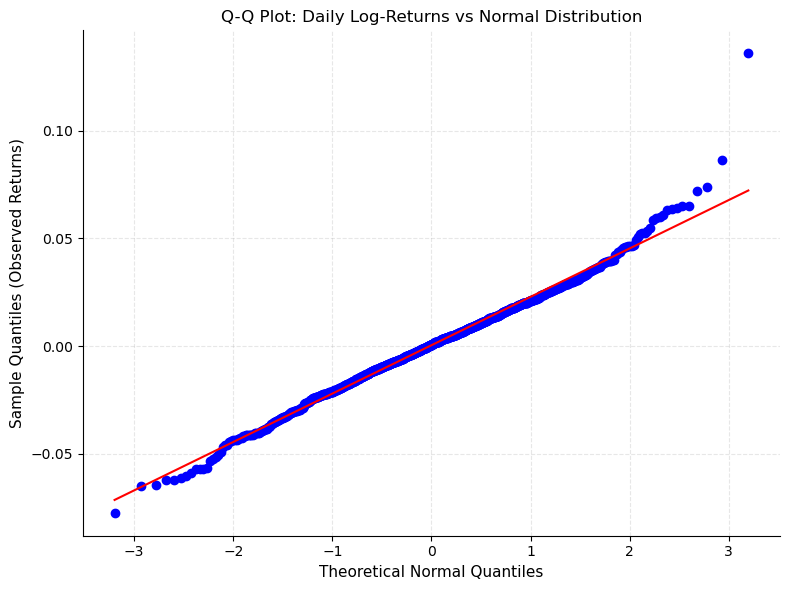
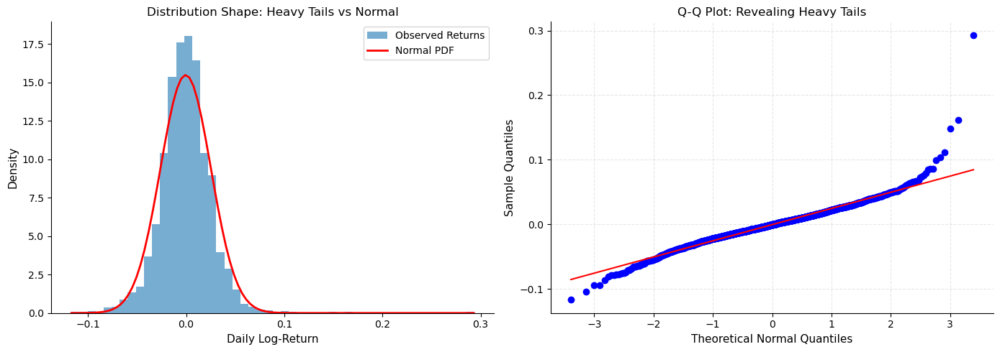
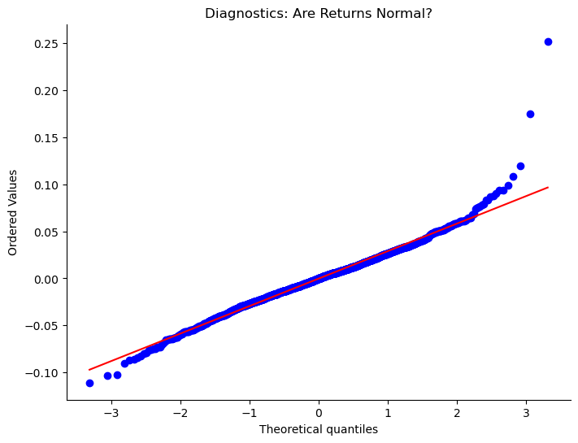

# 금융 자료의 Q-Q 그림: 자산 수익률의 비정규성 탐지

## 개요

Q-Q 그림은 자산 수익률이 정규성에서 벗어나는 정도를 진단하는 데 금융에서 특히 유용하다. 많은 금융 모형이 수익률이 정규분포를 따른다고 가정하지만, 실제 자료는 흔히 **두꺼운 꼬리**와 **치우침**을 보이며 이는 꼬리 위험의 심각한 과소평가로 이어진다. 이 절은 금융 자료의 이런 이탈을 Q-Q 그림으로 시각화하는 데 초점을 맞춘다.

## 금융에서 정규성이 중요한 이유

금융 모형은 분포 가정에 크게 기댄다.

- **옵션 가격결정**(Black-Scholes)은 자산 가격이 대수정규분포를 따른다고 가정하며, 이는 로그수익률이 정규분포를 따른다는 것과 동등하다
- **위험가치(VaR)**와 **기대손실(ES)**은 꼬리 거동에 대한 가정에 의존한다
- **포트폴리오 최적화**는 다변량 정규성을 가정하는 분산-공분산 접근을 쓴다

실제 수익률이 정규성에서 벗어나면 이 모형들은 큰 손실의 확률을 체계적으로 과소평가하며, 특히 시장이 스트레스를 받는 시기에 그렇다.

## 실제 예: Netflix(NFLX) 로그수익률

Netflix 주식은 정규가 아닌 금융 수익률의 훌륭한 사례이다. 다음 예제는 종가로 계산한 일간 로그수익률을 쓴다.

```python
import numpy as np
import pandas as pd
import matplotlib.pyplot as plt
from scipy import stats

# Simulate NFLX-like log-returns (or load real data)
np.random.seed(42)
# Use a distribution with slightly heavier tails than normal
# (Actual NFLX returns are even heavier-tailed)
returns = np.random.standard_t(df=8, size=1000) * 0.02

# Create Q-Q plot against normal distribution
fig, ax = plt.subplots(figsize=(8, 6))
stats.probplot(returns, dist="norm", plot=ax)

ax.set_title("Q-Q Plot: Daily Log-Returns vs Normal Distribution", fontsize=12)
ax.set_xlabel("Theoretical Normal Quantiles", fontsize=11)
ax.set_ylabel("Sample Quantiles (Observed Returns)", fontsize=11)

# Enhance aesthetics
ax.spines[["top", "right"]].set_visible(False)
ax.grid(True, alpha=0.3, linestyle='--')

plt.tight_layout()
plt.show()
```



## 금융 자료의 Q-Q 그림 해석

### 완전한 정규성

자료가 정확히 정규분포를 따르면 Q-Q 그림의 모든 점이 45도 기준선을 따라 촘촘히 모인다.

### 두꺼운 꼬리(금융의 현실)

실제 주식 수익률은 **두꺼운 꼬리**를 보인다. 왼쪽 꼬리(큰 음의 수익률, 곧 손실)와 오른쪽 꼬리(큰 양의 수익률, 곧 이익) 모두 정규분포가 예측하는 것보다 많은 관측값을 담는다.

**시각적 특징:** Q-Q 그림이 오른쪽 꼬리에서 "위로 휘고" 왼쪽 꼬리에서 "아래로 휜다". 그래서 S자 패턴이 만들어진다.

```python
# Simulate heavy-tailed returns (e.g., using Student's t distribution)
import numpy as np
import pandas as pd
import matplotlib.pyplot as plt
from scipy import stats

np.random.seed(42)
df = 5  # degrees of freedom; lower = heavier tails
heavy_tailed_returns = stats.t.rvs(df=df, scale=0.02, size=2000)

fig, (ax1, ax2) = plt.subplots(1, 2, figsize=(14, 5))

# Left: Histogram with normal overlay
ax1.hist(heavy_tailed_returns, bins=50, density=True, alpha=0.6, label='Observed Returns')
x = np.linspace(heavy_tailed_returns.min(), heavy_tailed_returns.max(), 100)
ax1.plot(x, stats.norm.pdf(x, loc=heavy_tailed_returns.mean(),
                            scale=heavy_tailed_returns.std()),
         'r-', lw=2, label='Normal PDF')
ax1.set_xlabel('Daily Log-Return', fontsize=11)
ax1.set_ylabel('Density', fontsize=11)
ax1.set_title('Distribution Shape: Heavy Tails vs Normal', fontsize=12)
ax1.legend()
ax1.spines[["top", "right"]].set_visible(False)

# Right: Q-Q plot
stats.probplot(heavy_tailed_returns, dist="norm", plot=ax2)
ax2.set_title("Q-Q Plot: Revealing Heavy Tails", fontsize=12)
ax2.set_xlabel('Theoretical Normal Quantiles', fontsize=11)
ax2.set_ylabel('Sample Quantiles', fontsize=11)
ax2.spines[["top", "right"]].set_visible(False)
ax2.grid(True, alpha=0.3, linestyle='--')

plt.tight_layout()
plt.show()
```



## 비정규성을 무시할 때의 결과

### 꼬리 위험의 과소평가

정규분포의 **첨도**는 3이다. 실제 금융 수익률의 **초과첨도는 대체로 1보다 크다**. 곧 꼬리가 정규보다 두껍다는 뜻이다.

**예:** 정규분포가 5% 손실의 확률을 0.1%로 예측하는데 실제 두꺼운 꼬리 수익률에서는 그 손실이 0.5% 확률로 일어난다면, 5배를 과소평가한 것이다.

### 위험 관리에 대한 함의

- 정규성에 기초한 **VaR 모형**은 99번째나 99.9번째 백분위수에서 손실을 과소평가한다
- 정규 가정에 기초한 **헤지 전략**은 포트폴리오를 꼬리 사건에 취약하게 남긴다
- 정규 가정 위에 세운 **자본 요건**(예: Basel III)은 불충분할 수 있다

## 실전 절차: 수익률 분포 진단하기

```python
import numpy as np
import pandas as pd
import matplotlib.pyplot as plt
from scipy import stats

# Step 1: Load or simulate returns
np.random.seed(42)
returns = np.random.standard_t(df=6, size=1500) * 0.025

# Step 2: Compute summary statistics
mean_ret = returns.mean()
std_ret = returns.std()
skewness = stats.skew(returns)
kurtosis = stats.kurtosis(returns)  # Excess kurtosis

print(f"Mean:     {mean_ret:.4f}")
print(f"Std Dev:  {std_ret:.4f}")
print(f"Skewness: {skewness:.4f}")
print(f"Ex. Kurtosis: {kurtosis:.4f}")

# Step 3: Normality tests
_, p_ks = stats.kstest(returns, 'norm', args=(mean_ret, std_ret))
_, p_jb = stats.jarque_bera(returns)

# anderson() returns (statistic, critical_values, significance_level) -- no p-value
ad_result = stats.anderson(returns, dist='norm')

print(f"\nKolmogorov-Smirnov test p-value: {p_ks:.4f}")
print(f"Jarque-Bera test p-value: {p_jb:.4g}")
print(f"Anderson-Darling statistic: {ad_result.statistic:.4f}")
print(f"  critical values (15/10/5/2.5/1%): {ad_result.critical_values}")

# Step 4: Q-Q plot
fig, ax = plt.subplots(figsize=(8, 6))
stats.probplot(returns, dist="norm", plot=ax)
ax.set_title("Diagnostics: Are Returns Normal?", fontsize=12)
ax.spines[["top", "right"]].set_visible(False)
plt.show()
```

출력:

```text
Mean:     -0.0002
Std Dev:  0.0297
Skewness: 0.5411
Ex. Kurtosis: 4.6396

Kolmogorov-Smirnov test p-value: 0.0710
Jarque-Bera test p-value: 9.067e-309
Anderson-Darling statistic: 3.6529
  critical values (15/10/5/2.5/1%): [0.574 0.654 0.785 0.916 1.089]
```



!!! warning "`stats.anderson`은 p값을 돌려주지 않는다"
    `stats.anderson`은 `(statistic, critical_values, significance_level)` 세 값을 담은 결과 객체를 돌려준다. `_, p_ad = stats.anderson(...)`처럼 두 값으로 풀면 `ValueError: too many values to unpack`이 난다. 검정통계량을 임계값과 직접 비교해야 한다.

!!! note "세 검정이 엇갈리는 이유"
    초과첨도 $4.64$로 자료가 명백히 두꺼운 꼬리를 갖는데도 K-S 검정의 $p$값은 $0.071$로 5% 수준에서 기각하지 못한다. 반면 Jarque-Bera는 $p \approx 10^{-309}$로 압도적으로 기각하고 Anderson-Darling 통계량 $3.65$도 1% 임계값 $1.089$를 크게 넘는다.

    이유는 K-S 검정이 자료에서 추정한 평균과 분산을 그대로 꽂아 넣었기 때문이다. 이렇게 하면 검정이 보수적이 되어 $p$값이 지나치게 커진다. 추정된 모수를 보정한 [Lilliefors 검정](../formal_tests/ks_lilliefors.md)을 써야 한다. 또한 K-S 검정은 꼬리보다 분포의 중앙에 민감한데, 여기서 문제가 되는 것은 정확히 꼬리이다.

## 비정규성에 대한 조정

### 1. 대안 분포

정규분포 대신 Student $t$ 분포나 일반화 쌍곡분포를 적합한다.

```python
from scipy.stats import t as student_t

# Fit Student's t distribution
df, loc, scale = student_t.fit(returns)
print(f"Fitted df: {df:.2f} (lower df → heavier tails)")
```

출력:

```
Fitted df: 6.68 (lower df → heavier tails)
```

위 자료에 적용하면 추정된 자유도가 $6.68$로, 자료를 생성한 참값 6에 가깝다.

### 2. 비모수 방법

붓스트랩과 분위수 기반 접근은 분포 가정을 두지 않는다.

### 3. 수정된 위험 측도

VaR 대신 기대손실(CVaR)을 쓴다. 정규가 아닌 분포에서 꼬리 거동을 더 잘 포착한다.

## 연습문제

<div class="drillbox" markdown>

**연습문제 1.**
일간 주식 수익률을 정규 Q-Q 그림에 그렸더니 중앙에서는 직선을 따르지만 양극단에서 급격히 벗어난다. 이 패턴을 해석하라.

</div>

??? success "풀이"
    금융 수익률 자료에서 **두꺼운 꼬리**(고첨)의 전형적인 특징이다. 중앙의 수익률은 근사적으로 정규분포를 따르지만, 극단적 수익률(큰 손실과 큰 이익 모두)이 정규분포의 예측보다 훨씬 극단적이다.

    왼쪽 꼬리가 선 아래로 휘는 것은 큰 음의 수익률이 기대보다 더 음수라는 뜻이고, 오른쪽 꼬리가 선 위로 휘는 것은 큰 양의 수익률이 기대보다 더 양수라는 뜻이다. 이 초과 꼬리 확률 때문에 정규 기반 위험 모형(VaR, 옵션 가격결정)이 극단적 사건의 가능성을 체계적으로 과소평가한다.

<div class="drillbox" markdown>

**연습문제 2.**
금융 수익률을 자유도 5인 $t$ 분포의 분위수에 대해 그렸더니 Q-Q 그림이 선형으로 보인다. 이는 수익률 분포에 대해 무엇을 시사하는가?

</div>

??? success "풀이"
    $t_5$ 분위수에 대한 Q-Q 그림이 선형이라는 것은 수익률이 자유도 약 5인 $t$ 분포로 잘 모형화된다는 뜻이다. 곧 정규보다 꼬리가 두껍지만 Cauchy 분포만큼 극단적이지는 않다.

    $t_5$ 분포의 초과첨도는 $6/(5-4) = 6$으로, 자료가 정규(초과첨도 0)보다 상당히 두꺼운 꼬리를 가짐을 뜻한다. 일간 주식 수익률에서 흔히 발견되는 결과이며, 추정된 자유도는 대체로 3에서 8 사이이다.

<div class="drillbox" markdown>

**연습문제 3.**
Q-Q 그림으로 위험 모형을 보정하는 방법을 설명하라. 꼬리 영역이 왜 가장 중요한가?

</div>

??? success "풀이"
    위험가치(VaR)나 기대손실 같은 위험 측도는 수익률 분포의 꼬리(1번째나 5번째 백분위수)에 의존한다. Q-Q 그림은 모형의 꼬리가 자료의 꼬리와 맞는지를 직접 보여준다.

    Q-Q 그림이 전체적으로 선형이면 모형이 잘 맞고 위험 추정을 믿을 수 있다. 꼬리가 벗어나면(금융 수익률에 정규 모형을 적용할 때 그렇듯이) 모형이 꼬리 위험을 과소평가한다.

    꼬리 영역이 가장 중요한 이유: (1) 위험 관리는 근본적으로 극단적 사건에 관한 것이다. (2) 중앙은 잘 맞지만 꼬리를 놓치는 모형은 잘못된 확신을 준다. (3) 규제 요건(Basel 협약)이 정확한 꼬리 모형화를 명시적으로 요구한다.

<div class="drillbox" markdown>

**연습문제 4.**
일간 수익률과 월간 수익률의 정규 Q-Q 그림을 비교하라. 어느 쪽이 선형에 가까울 가능성이 높으며 그 이유는 무엇인가?

</div>

??? success "풀이"
    **월간 수익률**이 근사적으로 선형에(정규에 가깝게) 보일 가능성이 높다. 이유는

    1. **집계 효과:** 월간 수익률은 약 21일치 일간 수익률의 합이다. CLT에 의해 독립동일분포 확률변수의 합은 개별 일간 수익률이 정규가 아니어도 정규로 수렴한다.
    2. **첨도의 감소:** 독립인 확률변수 $T$개를 더하면 합의 초과첨도가 개별 값의 $1/T$이 된다. 곧 21일을 합치면 초과첨도가 대략 $1/21$로 줄어든다.
    3. **변동성 군집의 완화:** 일간 수익률을 정규가 아니게 만드는 GARCH 효과가 한 달에 걸쳐 부분적으로 평균화된다.

    다만 월간 수익률도 완벽하게 정규는 아니다. 여전히 어느 정도의 두꺼운 꼬리와 치우침을 보이며, 다만 일간보다 덜 두드러질 뿐이다. 꼬리가 두꺼운 분포에서는 정규로의 수렴이 느리다.

---

## 정리하며

- **Q-Q 그림**은 표본분위수를 이론적 분위수와 시각적으로 비교하여 분포의 모양을 드러낸다
- **금융 수익률은 두꺼운 꼬리를 보이며** Q-Q 그림에서 S자 패턴으로 나타난다
- **비정규성을 무시하면** 꼬리 위험을 체계적으로 과소평가하게 된다
- **실용적 해법**: 대안 분포, 비모수 방법, 또는 관측된 꼬리 거동에 맞춘 로버스트 위험 측도를 쓴다
