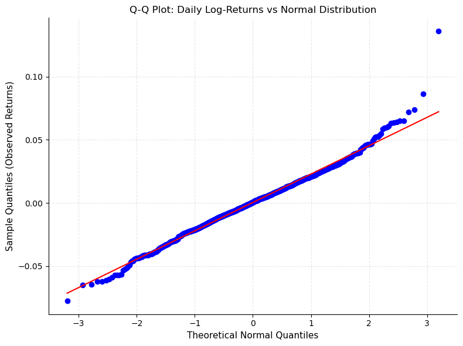
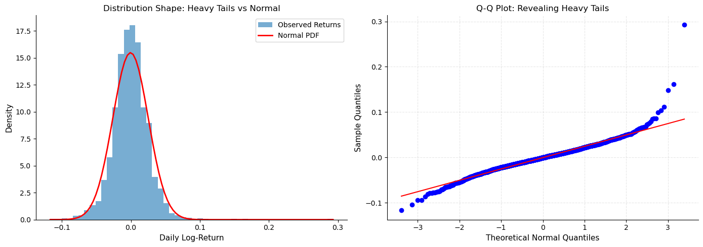
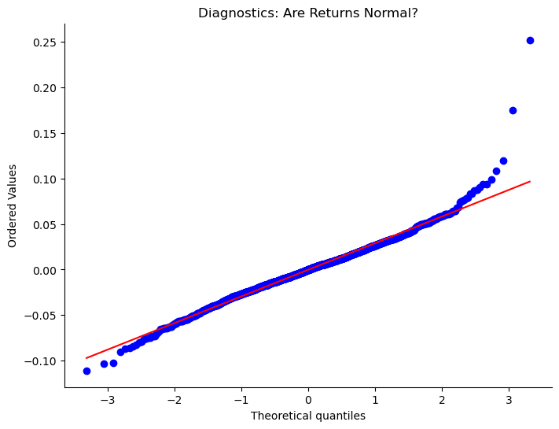

# 금융 자료의 Q-Q 그림: 자산 수익률의 비정규성 탐지

## 개요

Q-Q 그림은 자산 수익률이 정규성에서 벗어나는 정도를 진단하는 데 금융에서 특히 유용하다. 많은 금융 모형이 수익률이 정규분포를 따른다고 가정하지만, 실제 자료는 흔히 **두꺼운 꼬리**와 **치우침**을 보이며 이는 꼬리 위험의 심각한 과소평가로 이어진다. 이 절은 금융 자료의 이런 이탈을 Q-Q 그림으로 시각화하는 데 초점을 맞춘다.

---

## 1. 금융에서 정규성이 중요한 이유

금융 모형은 분포 가정에 크게 기댄다.

- **옵션 가격결정**(Black-Scholes)은 자산 가격이 대수정규분포를 따른다고 가정하며, 이는 로그수익률이 정규분포를 따른다는 것과 동등하다
- **위험가치(VaR)**와 **기대손실(ES)**은 꼬리 거동에 대한 가정에 의존한다
- **포트폴리오 최적화**는 다변량 정규성을 가정하는 분산-공분산 접근을 쓴다

실제 수익률이 정규성에서 벗어나면 이 모형들은 큰 손실의 확률을 체계적으로 과소평가하며, 특히 시장이 스트레스를 받는 시기에 그렇다.

---

## 2. 실제 예: Netflix(NFLX) 로그수익률

Netflix 주식은 정규가 아닌 금융 수익률의 훌륭한 사례이다. 다음 보기는 종가로 계산한 일간 로그수익률을 쓴다.

<div class="exbox" markdown>

**보기 1.** <span class="diff easy" title="쉬움"></span> 두꺼운 꼬리는 Q-Q 그림의 어디에 나타나는가. 넷플릭스 일간 로그수익률을 흉내 내어 $0.02 \cdot t_8$에서 $n = 1000$개를 뽑고 정규 Q-Q 그림을 그린다.

**(1)** 적합선의 기울기와 절편이 무엇을 추정하는지 수로 확인하시오.

**(2)** 가운데($\lvert q\rvert < 1$)와 꼬리($\lvert q\rvert > 2$)의 잔차를 재어 어디가 얼마나 벗어나는지 적으시오. 양쪽 꼬리의 벗어남은 **대칭인가**?

**(3)** 표본 초과첨도를 자료를 만든 분포 $t_8$의 이론값과 비교하시오.

</div>

??? success "풀이"

    **(1)** 과 **(2)** 는 유도할 식이 없는 읽기 문제다. **(3)** 만 이론값이 있다. $t_\nu$의 초과첨도는 $\nu > 4$에서

    $$
    \gamma_2 = \frac{6}{\nu - 4}
    $$

    이므로 $\nu = 8$이면 $\gamma_2 = 6/4 = 1.5$이다. 척도를 $0.02$배 해도 첨도는 변하지 않는다. 분산은 $\nu/(\nu-2) = 4/3$이므로 표준편차의 이론값은 $0.02\sqrt{4/3} = 0.023094$다.

    ```python
    import numpy as np
    import pandas as pd
    import matplotlib.pyplot as plt
    from scipy import stats

    # 넷플릭스 일별 로그수익률을 흉내 낸 자료다. 자유도 8 인 t 를 썼는데,
    # 실제 수익률은 이보다도 꼬리가 두껍다.
    np.random.seed(42)
    returns = np.random.standard_t(df=8, size=1000) * 0.02

    # 정규분포와 견주는 Q-Q 그림
    fig, ax = plt.subplots(figsize=(8, 6))
    stats.probplot(returns, dist="norm", plot=ax)

    ax.set_title("Q-Q Plot: Daily Log-Returns vs Normal Distribution", fontsize=12)
    ax.set_xlabel("Theoretical Normal Quantiles", fontsize=11)
    ax.set_ylabel("Sample Quantiles (Observed Returns)", fontsize=11)

    ax.spines[["top", "right"]].set_visible(False)
    ax.grid(True, alpha=0.3, linestyle='--')

    plt.tight_layout()
    plt.show()
    ```

    

    그림에서 읽을 수치를 따로 찍어 둔다.

    ```python
    osm, osr = stats.probplot(returns, dist="norm", fit=False)
    b, a = np.polyfit(osm, osr, 1)
    resid = osr - (a + b * osm)

    print(f"절편 a = {a:.6f}   표본평균 = {returns.mean():.6f}")
    print(f"기울기 b = {b:.6f}   표본표준편차 = {returns.std(ddof=1):.6f}")
    print(f"이론 표준편차 0.02*sqrt(4/3) = {0.02 * np.sqrt(4 / 3):.6f}")

    for lo, hi, lab in [(0, 1, "|q| < 1"), (2, 99, "|q| > 2")]:
        m = (np.abs(osm) > lo) & (np.abs(osm) < hi)
        print(f"{lab}: {m.sum()}점, 최대 절대잔차 {np.abs(resid[m]).max():.5f}")

    print(f"최솟값 {osr[0]:.4f}  적합선 {a + b * osm[0]:.4f}  잔차 {resid[0]:.4f}")
    print(f"최댓값 {osr[-1]:.4f}  적합선 {a + b * osm[-1]:.4f}  잔차 {resid[-1]:.4f}")
    print(f"g1 = {stats.skew(returns):.4f}   G1 = {stats.skew(returns, bias=False):.4f}")
    print(f"g2 = {stats.kurtosis(returns):.4f}   G2 = "
          f"{stats.kurtosis(returns, bias=False):.4f}   이론 = {6 / (8 - 4):.4f}")

    z = (returns - returns.mean()) / returns.std(ddof=1)
    for k in (3, 4):
        print(f"|z| > {k}: 관측 {np.sum(np.abs(z) > k)}개, "
              f"정규 기대 {1000 * 2 * stats.norm.sf(k):.3f}개")
    ```

    출력:

    ```text
    절편 a = 0.000376   표본평균 = 0.000376
    기울기 b = 0.022470   표본표준편차 = 0.022574
    이론 표준편차 0.02*sqrt(4/3) = 0.023094
    |q| < 1: 682점, 최대 절대잔차 0.00191
    |q| > 2: 46점, 최대 절대잔차 0.06371
    최솟값 -0.0774  적합선 -0.0715  잔차 -0.0060
    최댓값 0.1359  적합선 0.0722  잔차 0.0637
    g1 = 0.2257   G1 = 0.2261
    g2 = 1.6429   G2 = 1.6572   이론 = 1.5000
    |z| > 3: 관측 5개, 정규 기대 2.700개
    |z| > 4: 관측 1개, 정규 기대 0.063개
    ```

    **(1) 절편은 평균을, 기울기는 표준편차를 추정한다.** 절편 $a = 0.000376$은 표본평균과 소수 여섯째 자리까지 같다. 최소제곱선이 $(\bar q, \bar x) = (0, \bar x)$를 지나고 $\bar q = 0$이므로 **절편이 표본평균과 정확히 일치하는 것은 우연이 아니다.** 기울기 $b = 0.022470$은 표본표준편차 $0.022574$에 $0.5\%$ 안에서 맞고, 이론값 $0.023094$보다는 $2.7\%$ 작다. 기울기가 표준편차와 완전히 같지는 않다. 최소제곱 기울기는 $\sum q_i x_{(i)} / \sum q_i^2$인데 $\sum q_i^2 / n$이 1 에 조금 못 미치기 때문이다.

    **(2) 벗어나는 것은 꼬리뿐이고, 대칭이 아니다.** $\lvert q\rvert < 1$인 682점의 최대 절대잔차는 $0.00191$로 표본표준편차의 $8\%$에 지나지 않는다. **자료의 68%는 직선에 붙어 있다.** 반면 $\lvert q\rvert > 2$인 46점에서는 최대 $0.0637$까지 벌어진다.

    그런데 양쪽의 크기가 전혀 다르다.

    | 끝점 | 관측값 | 적합선 | 잔차 |
    |---|---|---|---|
    | 최솟값 | $-0.0774$ | $-0.0715$ | $-0.0060$ |
    | 최댓값 | $+0.1359$ | $+0.0722$ | $+0.0637$ |

    오른쪽 끝의 벗어남이 왼쪽 끝의 **10.7배**다. $t_8$은 대칭분포이므로 이것은 모집단의 성질이 아니라 **이 한 번의 추출에서 오른쪽 극단값이 유난히 크게 나온 결과**다. 표본왜도도 $g_1 = 0.226$으로 0 이 아니다. 그러므로 "두꺼운 꼬리는 Q-Q 그림에서 대칭적인 S자로 나타난다"는 말을 그림 한 장에서 확인하려 들면 안 된다. **대칭은 모집단의 성질이고, 그림은 표본 하나를 보여 준다.**

    **(3) 표본 초과첨도는 이론값보다 크다.** 보정판 $G_2 = 1.657$, 보정하지 않은 판본 $g_2 = 1.643$이고 이론값은 $1.5$다(`scipy.stats.kurtosis`는 기본이 `fisher=True`이므로 초과첨도를, `bias=True`이므로 $g_2$를 준다). $11\%$ 차이는 몬테카를로 오차 범위다. 네제곱 적률의 추정은 매우 불안정해서 $n = 1000$에서도 이 정도 흔들린다.

    꼬리의 초과를 개수로 보면 더 직관적이다. $\lvert z\rvert > 3$이 5개(정규 기대 2.7개), $\lvert z\rvert > 4$가 1개(정규 기대 $0.063$개)다. **정규 세계라면 $n = 1000$ 표본을 16개쯤 모아야 네 시그마 사건 하나를 볼 수 있는데, 여기서는 표본 하나에서 나왔다.** 이것이 꼬리 위험 과소평가의 정체다.

    **이 그림이 말해 주지 않는 것**은 "그 벗어남이 유의한가"다. $q = 3.2$ 자리의 점 하나가 선에서 $0.064$ 떨어져 있다는 사실만으로는 판정할 수 없다. 극단 순서통계량은 정규 자료에서도 변동이 크다. 그 판정에는 신뢰띠나 형식적 검정이 필요하다 — 이 자료에서는 샤피로–윌크가 $p = 2.4\times10^{-7}$, 자르크–베라가 $p = 5.4\times10^{-27}$로 둘 다 압도적으로 기각한다.

---

## 3. 금융 자료의 Q-Q 그림 해석

### 완전한 정규성

자료가 정확히 정규분포를 따르면 Q-Q 그림의 모든 점이 45도 기준선을 따라 촘촘히 모인다.

### 두꺼운 꼬리(금융의 현실)

실제 주식 수익률은 **두꺼운 꼬리**를 보인다. 왼쪽 꼬리(큰 음의 수익률, 곧 손실)와 오른쪽 꼬리(큰 양의 수익률, 곧 이익) 모두 정규분포가 예측하는 것보다 많은 관측값을 담는다.

**시각적 특징:** Q-Q 그림이 오른쪽 꼬리에서 "위로 휘고" 왼쪽 꼬리에서 "아래로 휜다". 그래서 S자 패턴이 만들어진다.

<div class="exbox" markdown>

**보기 2.** <span class="diff easy" title="쉬움"></span> 히스토그램이 감추고 Q-Q 그림이 드러내는 것. $0.02 \cdot t_5$에서 $n = 2000$개를 뽑아 히스토그램(50칸)과 정규 Q-Q 그림을 나란히 그린다.

**(1)** 왼쪽 히스토그램에서 **보이는 것**과 **보이지 않는 것**을 가려내시오. 봉우리 높이와 꼬리 칸의 높이를 수로 재어 왜 꼬리가 보이지 않는지 설명하시오.

**(2)** 오른쪽 Q-Q 그림이 그 보이지 않던 것을 어떻게 드러내는가. 가운데와 꼬리의 잔차를 수로 적으시오.

**(3)** 표본 초과첨도가 $10.42$로 나왔다. $t_5$의 이론값은 $6$이다. 이 차이를 어떻게 읽어야 하는가.

</div>

??? success "풀이"

    $t_\nu$의 이론값은 $\nu > 4$에서 초과첨도 $6/(\nu-4)$, $\nu > 3$에서 왜도 $0$, 분산 $\nu/(\nu-2)$다. $\nu = 5$이므로 초과첨도 $6$, 왜도 $0$, 표준편차 $0.02\sqrt{5/3} = 0.025820$이다. **(1)** 과 **(2)** 는 유도할 식이 없는 읽기 문제이고, **(3)** 만 이론값과 견주는 문제다.

    ```python
    import numpy as np
    import pandas as pd
    import matplotlib.pyplot as plt
    from scipy import stats

    # 히스토그램과 Q-Q 그림을 나란히 놓아, 같은 자료에서 둘이 무엇을 보여
    # 주는지 견준다. 히스토그램은 가운데를, Q-Q 그림은 꼬리를 말한다.
    np.random.seed(42)
    df = 5  # 자유도가 작을수록 꼬리가 두껍다
    heavy_tailed_returns = stats.t.rvs(df=df, scale=0.02, size=2000)

    fig, (ax1, ax2) = plt.subplots(1, 2, figsize=(14, 5))

    # 왼쪽: 히스토그램. 가운데가 정규보다 뾰족하지만, 꼬리의 차이는
    # 자료가 드물어 거의 보이지 않는다.
    ax1.hist(heavy_tailed_returns, bins=50, density=True, alpha=0.6, label='Observed Returns')
    x = np.linspace(heavy_tailed_returns.min(), heavy_tailed_returns.max(), 100)
    ax1.plot(x, stats.norm.pdf(x, loc=heavy_tailed_returns.mean(),
                                scale=heavy_tailed_returns.std()),
             'r-', lw=2, label='Normal PDF')
    ax1.set_xlabel('Daily Log-Return', fontsize=11)
    ax1.set_ylabel('Density', fontsize=11)
    ax1.set_title('Distribution Shape: Heavy Tails vs Normal', fontsize=12)
    ax1.legend()
    ax1.spines[["top", "right"]].set_visible(False)

    # 오른쪽: Q-Q 그림. 히스토그램이 감춘 꼬리의 차이가 양끝의 휘어짐으로
    # 또렷하게 드러난다.
    stats.probplot(heavy_tailed_returns, dist="norm", plot=ax2)
    ax2.set_title("Q-Q Plot: Revealing Heavy Tails", fontsize=12)
    ax2.set_xlabel('Theoretical Normal Quantiles', fontsize=11)
    ax2.set_ylabel('Sample Quantiles', fontsize=11)
    ax2.spines[["top", "right"]].set_visible(False)
    ax2.grid(True, alpha=0.3, linestyle='--')

    plt.tight_layout()
    plt.show()
    ```

    

    두 그림에서 읽을 수치를 따로 찍어 둔다.

    ```python
    r = heavy_tailed_returns
    s = r.std(ddof=1)

    # 왼쪽 그림: 히스토그램의 봉우리와 꼬리 칸을 수로 잰다.
    dens, edges = np.histogram(r, bins=50, density=True)
    print(f"칸 폭 {edges[1] - edges[0]:.5f}   자료 범위 [{r.min():.4f}, {r.max():.4f}]")
    print(f"가장 높은 칸의 밀도 {dens.max():.3f}  vs  정규 봉우리 "
          f"{stats.norm.pdf(r.mean(), r.mean(), r.std()):.3f}")
    print(f"양 끝 칸의 밀도: 왼쪽 {dens[0]:.3f}  오른쪽 {dens[-1]:.3f}"
          f"  (봉우리의 {dens[0] / dens.max():.4f}배)")
    for k in (3, 4):
        n_out = np.sum(np.abs(r - r.mean()) > k * s)
        print(f"|x - 평균| > {k}s: 관측 {n_out}개, 정규 기대 "
              f"{2000 * 2 * stats.norm.sf(k):.2f}개")

    # 오른쪽 그림: Q-Q 적합선에서의 잔차.
    osm, osr = stats.probplot(r, dist="norm", fit=False)
    b, a = np.polyfit(osm, osr, 1)
    resid = osr - (a + b * osm)
    print(f"\n적합선 절편 {a:.6f}  기울기 {b:.6f}  (표본표준편차 {s:.6f})")
    for lo, lab in [(1, "|q| < 1"), (2, "|q| > 2")]:
        m = np.abs(osm) < lo if lo == 1 else np.abs(osm) > lo
        print(f"{lab}: {m.sum()}점, 최대 절대잔차 {np.abs(resid[m]).max():.5f}")
    print(f"최솟값 {osr[0]:.4f}  적합선 {a + b * osm[0]:.4f}  잔차 {resid[0]:.4f}")
    print(f"최댓값 {osr[-1]:.4f}  적합선 {a + b * osm[-1]:.4f}  잔차 {resid[-1]:.4f}")

    print(f"\ng1 = {stats.skew(r):.4f}   G1 = {stats.skew(r, bias=False):.4f}   이론 = 0")
    print(f"g2 = {stats.kurtosis(r):.4f}   G2 = {stats.kurtosis(r, bias=False):.4f}"
          f"   이론 = {6 / (5 - 4):.1f}")
    ```

    출력:

    ```text
    칸 폭 0.00820   자료 범위 [-0.1170, 0.2932]
    가장 높은 칸의 밀도 18.043  vs  정규 봉우리 15.483
    양 끝 칸의 밀도: 왼쪽 0.061  오른쪽 0.061  (봉우리의 0.0034배)
    |x - 평균| > 3s: 관측 18개, 정규 기대 5.40개
    |x - 평균| > 4s: 관측 7개, 정규 기대 0.13개

    적합선 절편 -0.000550  기울기 0.025061  (표본표준편차 0.025772)
    |q| < 1: 1366점, 최대 절대잔차 0.00339
    |q| > 2: 90점, 최대 절대잔차 0.20869
    최솟값 -0.1170  적합선 -0.0856  잔차 -0.0314
    최댓값 0.2932  적합선 0.0845  잔차 0.2087

    g1 = 0.8632   G1 = 0.8639   이론 = 0
    g2 = 10.4205   G2 = 10.4497   이론 = 6.0
    ```

    **(1) 히스토그램이 보여 주는 것은 봉우리뿐이다.** 가장 높은 칸의 밀도가 $18.043$이고 같은 평균·표준편차의 정규 봉우리는 $15.483$이니, 가운데가 정규보다 $17\%$ 뾰족하다. 이것은 눈에 보인다.

    그런데 **꼬리 칸의 높이는 $0.061$이다.** 봉우리의 $0.0034$배, 곧 **1/296**이다. 그림의 세로축이 0 에서 18 까지인데 꼬리 칸을 그리면 300 분의 1 화소가 된다. 봉우리를 한 화면에 담는 순간 꼬리는 선 하나로 눌려 사라지고, **그 칸이 정확히 0 인지 한 개 있는지 분간할 길이 없다.** 그러나 그 보이지 않는 칸들에 실제로 무엇이 있는가 하면, $3s$ 밖에 18개(정규 기대 $5.4$개), $4s$ 밖에 7개(정규 기대 $0.13$개)다. **$4s$ 밖의 사건이 정규 예측의 54배인데 히스토그램에는 흔적이 없다.** 위험 관리에서 중요한 것이 전부 이 보이지 않는 구간에 있다.

    선형 세로축은 꼬리를 보여 주는 도구가 아니다. 보려면 로그 축을 쓰거나 구간을 좁혀야 한다.

    **(2) Q-Q 그림은 세로축을 꼬리에 내준다.** 적합선은 $\hat y = -0.000550 + 0.025061\,q$다. $\lvert q\rvert < 1$인 1366점의 최대 절대잔차는 $0.00339$로 표본표준편차의 $13\%$에 지나지 않는다. 그런데 $\lvert q\rvert > 2$인 90점에서는 최대 $0.2087$까지 간다. **가운데 대 꼬리의 잔차 비가 62배**다.

    끝점을 보면 더 분명하다. 최댓값 $0.2932$는 적합선이 예측하는 $0.0845$의 **3.47배**다. 히스토그램에서 밀도 $0.061$짜리 보이지 않는 칸이었던 그 한 점이, Q-Q 그림에서는 적합선 위로 $0.21$ 올라간 가장 눈에 띄는 점이 된다. 두 그림이 같은 자료를 그렸는데 한쪽이 감춘 것을 다른 쪽이 가장 크게 그린다. **Q-Q 그림의 가로축은 분위수라 꼬리 쪽이 늘어나고, 세로축은 관측값 그대로라 극단값이 눌리지 않는다.** 이것이 꼬리 진단에 Q-Q 그림을 쓰는 이유다.

    왼쪽 끝은 그만큼은 아니다. 최솟값 $-0.1170$의 잔차가 $-0.0314$로 오른쪽 끝의 $1/6.6$이다. $t_5$는 대칭분포이니 이 비대칭은 모집단의 성질이 아니라 **이 한 번의 추출에서 오른쪽 극단값이 유난히 크게 나온 결과**다. 표본왜도 $g_1 = 0.863$도 이론값 $0$에서 멀다.

    **(3) $10.42$와 $6$의 차이는 추정 오차이고, 그 오차가 매우 크다는 것이 요점이다.** 먼저 판본을 밝혀야 한다. `scipy.stats.kurtosis`는 기본이 `fisher=True`이므로 초과첨도를, `bias=True`이므로 보정하지 않은 $g_2$를 준다. 여기서는 $g_2 = 10.4205$, 보정판 $G_2 = 10.4497$이고 둘의 차이는 무의미하다.

    $73\%$나 되는 이 차이를 "자료가 $t_5$가 아니다"로 읽으면 안 된다. $g_2$의 표본분포가 $t_5$에서 어떤 모양인지 모의실험으로 보면 된다.

    ```python
    rng = np.random.default_rng(7)
    for nu in (5, 12):
        g2 = np.array([stats.kurtosis(stats.t.rvs(df=nu, size=2000, random_state=rng))
                       for _ in range(2000)])
        print(f"t_{nu}  이론 {6 / (nu - 4):.2f}  |  g2 중앙값 {np.median(g2):.2f}"
              f"  평균 {g2.mean():.2f}  5~95% [{np.percentile(g2, 5):.2f}, "
              f"{np.percentile(g2, 95):.2f}]  최대 {g2.max():.1f}")
    ```

    출력:

    ```text
    t_5  이론 6.00  |  g2 중앙값 3.24  평균 4.51  5~95% [1.75, 10.42]  최대 197.5
    t_12  이론 0.75  |  g2 중앙값 0.69  평균 0.74  5~95% [0.33, 1.29]  최대 5.0
    ```

    $t_5$에서 $g_2$의 **중앙값이 $3.24$로 참값 $6$의 절반밖에 안 되고**, 90% 구간이 $[1.75,\ 10.42]$로 벌어지며, 2000번 중 최댓값은 $197.5$까지 올라갔다. 관측된 $10.42$는 꼭 95 백분위수다. 곧 **이상한 값이 아니라 흔히 일어나는 값**이다.

    까닭은 $g_2$의 점근분산이 8차 적률 $\mu_8$을 품는데 $t_\nu$는 $\nu$차 이상의 적률을 갖지 않기 때문이다. $\nu = 5$면 $\mu_8 = \infty$이므로 $g_2$에 중심극한정리를 적용할 수 없고, 표본분포가 오른쪽으로 심하게 늘어진다. 대비를 위해 $\nu = 12$를 보면($\mu_8 < \infty$) 중앙값 $0.69$에 90% 구간 $[0.33, 1.29]$로 얌전하다. 같은 이유로 $g_1$의 점근분산은 $\mu_6$을 품으므로 $t_5$에서는 왜도 추정도 믿을 수 없다 — 표본 $g_1 = 0.863$이 이론값 0 에서 멀리 떨어진 것이 그 결과다.

    **꼬리가 두꺼운 자료에서는 꼬리를 재는 통계량 자체가 가장 불안정하다.** 보고된 첨도 하나를 소수점까지 믿지 말고 Q-Q 그림을 함께 보아야 하는 이유가 이것이다.

---

## 4. 비정규성을 무시할 때의 결과

### 꼬리 위험의 과소평가

정규분포의 **첨도**는 3이다. 실제 금융 수익률의 **초과첨도는 대체로 1보다 크다**. 곧 꼬리가 정규보다 두껍다는 뜻이다.

**예:** 정규분포가 5% 손실의 확률을 0.1%로 예측하는데 실제 두꺼운 꼬리 수익률에서는 그 손실이 0.5% 확률로 일어난다면, 5배를 과소평가한 것이다.

### 위험 관리에 대한 함의

- 정규성에 기초한 **VaR 모형**은 99번째나 99.9번째 백분위수에서 손실을 과소평가한다
- 정규 가정에 기초한 **헤지 전략**은 포트폴리오를 꼬리 사건에 취약하게 남긴다
- 정규 가정 위에 세운 **자본 요건**(예: Basel III)은 불충분할 수 있다

---

## 5. 실전 절차: 수익률 분포 진단하기

<div class="exbox" markdown>

**보기 3.** <span class="diff easy" title="쉬움"></span> 수익률 진단 네 단계와 엇갈리는 세 검정. $0.025 \cdot t_6$에서 $n = 1500$개를 뽑아 요약통계 · 검정 셋 · Q-Q 그림의 순서로 진단한다. 결과는 K-S 가 $p = 0.0710$으로 기각하지 못하는데 자르크–베라는 $p \approx 10^{-309}$, 앤더슨–달링은 $A^2 = 3.65$로 1% 임계값 $1.089$를 크게 넘는다.

**(1)** 자르크–베라 통계량의 닫힌 꼴

$$
\mathrm{JB} = \frac{n}{6}\Bigl(g_1^2 + \frac{g_2^2}{4}\Bigr)
$$

에 출력된 왜도·첨도를 넣어 손으로 계산하고, `scipy.stats.jarque_bera`가 준 값과 맞는지 확인하시오. 어느 판본의 왜도·첨도를 넣어야 하는가.

**(2)** K-S 가 기각하지 못하는 것은 **검정력이 약해서가 아니다.** 이 코드의 K-S 호출이 어떤 잘못을 저지르고 있는지 밝히고, 그 잘못이 검정의 **크기**를 얼마나 망가뜨리는지 모의실험으로 재시오.

</div>

??? success "풀이"

    ```python
    import numpy as np
    import pandas as pd
    import matplotlib.pyplot as plt
    from scipy import stats

    # 1단계: 자료를 읽거나 만든다.
    np.random.seed(42)
    returns = np.random.standard_t(df=6, size=1500) * 0.025

    # 2단계: 요약통계. 왜도와 초과첨도가 정규에서 얼마나 벗어났는지 먼저 본다.
    mean_ret = returns.mean()
    std_ret = returns.std()
    skewness = stats.skew(returns)
    kurtosis = stats.kurtosis(returns)  # Excess kurtosis

    print(f"Mean:     {mean_ret:.4f}")
    print(f"Std Dev:  {std_ret:.4f}")
    print(f"Skewness: {skewness:.4f}")
    print(f"Ex. Kurtosis: {kurtosis:.4f}")

    # 3단계: 검정 셋. KS 는 모수를 자료에서 추정해 넘겼으므로 p-값이
    # 실제보다 크게 나온다는 점을 감안해 읽어야 한다.
    _, p_ks = stats.kstest(returns, 'norm', args=(mean_ret, std_ret))
    _, p_jb = stats.jarque_bera(returns)

    # anderson() 은 (통계량, 기각값, 유의수준) 을 돌려준다. p-값은 주지 않는다
    ad_result = stats.anderson(returns, dist='norm')

    print(f"\nKolmogorov-Smirnov test p-value: {p_ks:.4f}")
    print(f"Jarque-Bera test p-value: {p_jb:.4g}")
    print(f"Anderson-Darling statistic: {ad_result.statistic:.4f}")
    print(f"  critical values (15/10/5/2.5/1%): {ad_result.critical_values}")

    # 4단계: 그림으로 마무리. 검정이 기각했다면 어디가 어긋났는지를 여기서 본다.
    fig, ax = plt.subplots(figsize=(8, 6))
    stats.probplot(returns, dist="norm", plot=ax)
    ax.set_title("Diagnostics: Are Returns Normal?", fontsize=12)
    ax.spines[["top", "right"]].set_visible(False)
    plt.show()
    ```

    출력:

    ```text
    Mean:     -0.0002
    Std Dev:  0.0297
    Skewness: 0.5411
    Ex. Kurtosis: 4.6396

    Kolmogorov-Smirnov test p-value: 0.0710
    Jarque-Bera test p-value: 9.067e-309
    Anderson-Darling statistic: 3.6529
      critical values (15/10/5/2.5/1%): [0.574 0.654 0.785 0.916 1.089]
    ```

    

    **(1) 넣어야 하는 것은 보정하지 않은 $g_1$, $g_2$다.** 자르크–베라의 원래 정의가 표본적률비

    $$
    g_1 = \frac{m_3}{m_2^{3/2}}, \qquad g_2 = \frac{m_4}{m_2^{2}} - 3,
        \qquad m_k = \frac{1}{n}\sum_{i=1}^n (x_i - \bar x)^k
    $$

    위에 세워져 있기 때문이다. 출력된 $0.5411$과 $4.6396$이 바로 그 판본이다 — `scipy.stats.skew`는 기본이 `bias=True`이고 `kurtosis`는 기본이 `bias=True`, `fisher=True`이므로 $g_1$과 초과첨도 $g_2$를 준다. 보정판 $G_1$, $G_2$를 넣으면 값이 어긋난다.

    손으로 계산하면

    $$
    \mathrm{JB} = \frac{1500}{6}\Bigl(0.541087^2 + \frac{4.639645^2}{4}\Bigr)
        = 250\,(0.292775 + 5.381576) = 250 \times 5.674352 = 1418.59
    $$

    이다. $\chi^2_2$의 생존함수는 $\exp(-x/2)$라는 닫힌 꼴이므로 $p = e^{-709.29} = 9.07\times10^{-309}$다. **이 값이 배정도 부동소수의 바닥($\approx 5\times10^{-324}$) 바로 위라는 점을 눈여겨볼 만하다.** $n$이나 첨도가 조금만 더 크면 $p$가 그냥 $0.0$으로 찍힌다.

    ```python
    n = len(returns)
    g1 = stats.skew(returns)          # bias=True 가 기본 -> g1
    g2 = stats.kurtosis(returns)      # bias=True, fisher=True 가 기본 -> g2
    JB = n / 6 * (g1 ** 2 + g2 ** 2 / 4)

    print(f"g1 = {g1:.6f}   g2 = {g2:.6f}")
    print(f"닫힌 꼴 JB      = {JB:.4f}")
    print(f"scipy jarque_bera = {stats.jarque_bera(returns)[0]:.4f}")
    print(f"chi2_2 꼬리확률  = {stats.chi2.sf(JB, 2):.4g}")

    # 보정판을 넣으면 어긋난다.
    G1 = stats.skew(returns, bias=False)
    G2 = stats.kurtosis(returns, bias=False)
    print(f"보정판으로 계산하면 JB = {n / 6 * (G1 ** 2 + G2 ** 2 / 4):.4f}  (어긋남)")
    ```

    출력:

    ```text
    g1 = 0.541087   g2 = 4.639645
    닫힌 꼴 JB      = 1418.5882
    scipy jarque_bera = 1418.5882
    chi2_2 꼬리확률  = 9.067e-309
    보정판으로 계산하면 JB = 1430.0756  (어긋남)
    ```

    **소수 넷째 자리까지 일치한다.** 보정판을 넣으면 $1430.08$로 $0.8\%$ 어긋난다. 여기서는 결론이 바뀌지 않지만, 경계 근처의 자료에서는 판본 하나가 판정을 뒤집는다.

    **(2) 잘못은 `args=(mean_ret, std_ret)`에 있다.** 콜모고로프–스미르노프 검정의 귀무분포는 **$F_0$가 자료와 무관하게 미리 정해져 있을 때** 유도된 것이다. 그런데 이 코드는 평균과 표준편차를 **같은 자료에서 추정해** 넣었다. 추정된 정규분포는 그 자료에 가장 잘 맞도록 맞춰진 것이므로 경험분포함수와의 최대 거리 $D_n$이 체계적으로 작아지고, 표준 임계값을 그대로 쓰면 검정이 **지나치게 보수적**이 된다.

    얼마나 보수적인가. 참으로 정규인 자료에 같은 호출을 되풀이해 $p < 0.05$가 되는 비율을 재면 그것이 실제 크기다.

    ```python
    rng = np.random.default_rng(3)
    n, B = 1500, 4000
    D = np.empty(B)
    p = np.empty(B)
    for i in range(B):
        x = rng.standard_normal(n)          # 귀무가설이 참인 자료
        D[i], p[i] = stats.kstest(x, 'norm', args=(x.mean(), x.std()))

    print(f"명목 0.05 인데 실제 기각률 = {np.mean(p < 0.05):.5f}"
          f"  ({np.sum(p < 0.05)}/{B})")
    print(f"명목 0.10 인데 실제 기각률 = {np.mean(p < 0.10):.5f}")
    print(f"D 의 참 95 백분위수   = {np.percentile(D, 95):.5f}")
    print(f"표준 KS 5% 임계값      = {1.358 / np.sqrt(n):.5f}")
    print(f"릴리에포르 임계 근사    = {0.886 / np.sqrt(n):.5f}")
    print(f"관측 D = 0.033246 의 백분위수 = {100 * np.mean(D < 0.033246):.3f}")
    ```

    출력:

    ```text
    명목 0.05 인데 실제 기각률 = 0.00025  (1/4000)
    명목 0.10 인데 실제 기각률 = 0.00100
    D 의 참 95 백분위수   = 0.02317
    표준 KS 5% 임계값      = 0.03506
    릴리에포르 임계 근사    = 0.02288
    관측 D = 0.033246 의 백분위수 = 99.925
    ```

    **명목 5% 검정의 실제 크기가 $0.00025$다.** 4000번 중 단 한 번만 기각했다(그러니 이 추정값 자체는 거칠다 — 표준오차가 $\sqrt{0.00025 \times 0.99975/4000} \approx 0.00025$로 추정값과 같은 크기다). 명목 10% 수준에서도 $0.001$로 100배 작다. 자릿수로 보아 **이 검정은 사실상 아무것도 기각하지 않는다.**

    임계값을 견주면 까닭이 한눈에 보인다. 모수를 추정했을 때 $D_n$의 참 95 백분위수는 $0.02317$인데 표준 임계값은 $0.03506$이다. **1.5배나 높은 문턱을 쓰고 있다.** 그리고 참 임계값 $0.02317$은 릴리에포르 근사 $0.886/\sqrt{n} = 0.02288$과 $1.3\%$ 안에서 맞는다 — 모의실험이 릴리에포르 임계값을 다시 유도해 낸 셈이다.

    관측된 $D = 0.033246$을 올바른 귀무분포에 대고 재면 **99.925 백분위수**, 곧 릴리에포르 $p \approx 0.0008$이다. **같은 통계량이 같은 자료에서 "기각 못 함($p = 0.071$)"에서 "강하게 기각($p \approx 0.0008$)"으로 뒤집힌다.** K-S 가 약한 검정이어서 놓친 것이 아니라 **임계값을 잘못 쓴 것**이다. 올바른 교정은 [릴리에포르 검정](../formal_tests/ks_lilliefors.md)이다.

    덧붙여, K-S 통계량은 상한 노름이라 경험분포함수가 가장 빽빽한 **분포의 가운데**에서 최댓값을 잡기 쉽다. 이 자료의 문제는 꼬리인데 K-S 는 그쪽을 거의 보지 않는다. 임계값을 바로잡아도 꼬리에는 앤더슨–달링이나 자르크–베라가 낫다는 뜻이다.

!!! warning "`stats.anderson`은 p값을 돌려주지 않는다"
    `stats.anderson`은 `(statistic, critical_values, significance_level)` 세 값을 담은 결과 객체를 돌려준다. `_, p_ad = stats.anderson(...)`처럼 두 값으로 풀면 `ValueError: too many values to unpack`이 난다. 검정통계량을 임계값과 직접 비교해야 한다.

!!! note "세 검정이 엇갈리는 이유"
    초과첨도 $4.64$로 자료가 명백히 두꺼운 꼬리를 갖는데도 K-S 검정의 $p$값은 $0.071$로 5% 수준에서 기각하지 못한다. 반면 Jarque-Bera는 $p \approx 10^{-309}$로 압도적으로 기각하고 Anderson-Darling 통계량 $3.65$도 1% 임계값 $1.089$를 크게 넘는다.

    이유는 K-S 검정이 자료에서 추정한 평균과 분산을 그대로 꽂아 넣었기 때문이다. 이렇게 하면 검정이 보수적이 되어 $p$값이 지나치게 커진다. 추정된 모수를 보정한 [Lilliefors 검정](../formal_tests/ks_lilliefors.md)을 써야 한다. 또한 K-S 검정은 꼬리보다 분포의 중앙에 민감한데, 여기서 문제가 되는 것은 정확히 꼬리이다.

---

## 6. 비정규성에 대한 조정

### 1. 대안 분포

정규분포 대신 스튜던트 $t$ 분포나 일반화 쌍곡분포를 적합한다.

<div class="exbox" markdown>

**보기 4.** <span class="diff easy" title="쉬움"></span> $t$ 를 적합해 꼬리 두께를 수로 바꾸기. 보기 3 의 `returns`(참값 $\nu = 6$, 척도 $0.025$)에 `scipy.stats.t.fit`을 걸면 $\hat\nu = 6.68$, $\hat{\text{loc}} = -0.000468$, $\hat{\text{scale}} = 0.024562$가 나온다.

**(1)** 적합된 척도 $0.024562$를 표본표준편차 $0.029671$과 바로 견주면 안 된다. 왜 그런가. 올바른 환산식을 적고 수로 확인하시오.

**(2)** $\hat\nu = 6.68$이 참값 $6$에서 $11\%$ 벗어났다. 이것이 걱정할 만한 차이인지 모의실험으로 판정하시오.

</div>

??? success "풀이"

    **(1) `scale` 은 표준편차가 아니다.** `scipy.stats.t`의 모수화는 $X = \text{loc} + \text{scale}\cdot T_\nu$이고 $T_\nu$ 자체의 분산이 1 이 아니다. $\nu > 2$에서

    $$
    \operatorname{Var}(T_\nu) = \frac{\nu}{\nu - 2}
    $$

    이므로

    $$
    \operatorname{sd}(X) = \text{scale}\cdot\sqrt{\frac{\nu}{\nu-2}}
    $$

    이다. 적합값을 넣으면 $0.024562\sqrt{6.6758/4.6758} = 0.029349$로, 표본표준편차 $0.029671$에 $1.1\%$ 안에서 맞는다. **환산을 잊고 $0.0246$과 $0.0297$을 바로 견주면 $17\%$ 어긋난 것처럼 보여 적합이 실패했다고 오판하게 된다.**

    자료를 만든 쪽에서도 같은 관계가 성립한다. 참 척도는 $0.025$이고 참 자유도는 6 이므로 참 표준편차는 $0.025\sqrt{6/4} = 0.030619$다.

    **(2) 걱정할 차이가 아니다.** $\hat\nu$의 표본분포를 모의실험으로 재면 된다.

    ```python
    from scipy.stats import t as student_t

    # 정규가 아니라면 대안 분포를 찾는 것이 다음 걸음이다. t 를 적합하면
    # 자유도가 꼬리 두께를 재는 값이 된다. 작을수록 두껍다.
    df, loc, scale = student_t.fit(returns)
    print(f"Fitted df: {df:.2f} (lower df → heavier tails)")
    ```

    출력:

    ```text
    Fitted df: 6.68 (lower df → heavier tails)
    ```

    ```python
    print(f"적합 df {df:.4f}  loc {loc:.6f}  scale {scale:.6f}")
    print(f"참값   df 6       loc 0        scale 0.025")
    print(f"환산한 표준편차 scale*sqrt(df/(df-2)) = "
          f"{scale * np.sqrt(df / (df - 2)):.6f}")
    print(f"표본표준편차                          = {returns.std(ddof=1):.6f}")
    print(f"참 표준편차 0.025*sqrt(6/4)            = {0.025 * np.sqrt(6 / 4):.6f}")

    # 참 nu = 6 인 자료를 되풀이 적합해 nu-hat 의 표본분포를 본다.
    rng = np.random.default_rng(11)
    fits = np.array([student_t.fit(student_t.rvs(df=6, scale=0.025, size=1500,
                                                 random_state=rng))[:3]
                     for _ in range(400)])
    nu_hat, sc_hat = fits[:, 0], fits[:, 2]
    print(f"\nnu-hat 표본분포 (nu=6, n=1500, 400회)")
    print(f"  중앙값 {np.median(nu_hat):.2f}  평균 {nu_hat.mean():.2f}"
          f"  5~95% [{np.percentile(nu_hat, 5):.2f}, "
          f"{np.percentile(nu_hat, 95):.2f}]  최대 {nu_hat.max():.2f}")
    print(f"  P(nu-hat >= 6.68) = {np.mean(nu_hat >= 6.68):.3f}")
    print(f"scale-hat 표본분포: 중앙값 {np.median(sc_hat):.5f}"
          f"  5~95% [{np.percentile(sc_hat, 5):.5f}, "
          f"{np.percentile(sc_hat, 95):.5f}]")

    # nu 를 5 로 보든 8 로 보든 99% 분위수가 얼마나 달라지는가.
    # 표준편차를 1 로 맞춰 견준다.
    for nu in (5, 8):
        print(f"t_{nu} 의 표준화 99% 분위수 = "
              f"{stats.t.ppf(0.99, nu) / np.sqrt(nu / (nu - 2)):.3f}")
    print(f"정규의 99% 분위수            = {stats.norm.ppf(0.99):.3f}")
    ```

    출력:

    ```text
    적합 df 6.6758  loc -0.000468  scale 0.024562
    참값   df 6       loc 0        scale 0.025
    환산한 표준편차 scale*sqrt(df/(df-2)) = 0.029349
    표본표준편차                          = 0.029671
    참 표준편차 0.025*sqrt(6/4)            = 0.030619

    nu-hat 표본분포 (nu=6, n=1500, 400회)
      중앙값 6.12  평균 6.26  5~95% [4.96, 8.10]  최대 11.68
      P(nu-hat >= 6.68) = 0.275
    scale-hat 표본분포: 중앙값 0.02500  5~95% [0.02395, 0.02653]
    t_5 의 표준화 99% 분위수 = 2.606
    t_8 의 표준화 99% 분위수 = 2.508
    정규의 99% 분위수            = 2.326
    ```

    $\nu = 6$인 자료를 400번 적합했을 때 $\hat\nu$의 중앙값은 $6.12$, 90% 구간은 $[4.96,\ 8.10]$이고, 최대는 $11.68$까지 올라갔다. **$\hat\nu \ge 6.68$이 되는 표본이 27.5%**다. 곧 $6.68$은 드문 값이 아니라 **네 번 중 한 번 넘게 일어나는 흔한 값**이다.

    까닭은 자유도가 **꼬리의 모양만** 지배하는 모수라는 데 있다. 정보가 극단 관측값 몇 개에 들어 있으므로, 표본의 대부분을 이루는 가운데 자료는 $\nu$에 대해 거의 말해 주지 않는다. 그래서 $\hat\nu$의 상대오차가 $\hat{\text{scale}}$보다 훨씬 크다.

    | 모수 | 참값 | 90% 구간 | 상대폭 |
    |---|---|---|---|
    | 척도 | $0.025$ | $[0.02395,\ 0.02653]$ | $-4.2\%$, $+6.1\%$ |
    | 자유도 | $6$ | $[4.96,\ 8.10]$ | $-17\%$, $+35\%$ |

    **실무에서의 함의는 분명하다.** "추정된 자유도가 $6.68$"을 소수점까지 보고하면 안 된다. 말할 수 있는 것은 "$\nu$가 대략 5 에서 8 사이, 곧 정규보다 확실히 두껍고 코시만큼은 아니다" 정도다.

    다행히 꼬리 위험 계산에 필요한 정밀도는 그 정도로 충분한 경우가 많다. 표준편차를 1 로 맞춰 견주면 $99\%$ 분위수가 $t_5$에서 $2.606$, $t_8$에서 $2.508$, 정규에서 $2.326$이다. **$\nu$를 5 로 보든 8 로 보든 차이는 $0.098$인데, 정규로 보는 것과의 차이는 $0.182$에서 $0.280$이다.** 자유도를 정밀하게 집어내지 못하는 것보다 정규를 쓰는 것이 더 큰 잘못이라는 뜻이다. 다만 이 비교는 $99\%$ 수준의 이야기다. 더 깊은 꼬리로 갈수록 $\nu$의 불확실성이 빠르게 커지므로, $99.9\%$ 이상을 다룰 때는 자유도의 구간을 그대로 끌고 가며 민감도를 보아야 한다.

### 2. 비모수 방법

붓스트랩과 분위수 기반 접근은 분포 가정을 두지 않는다.

### 3. 수정된 위험 측도

VaR 대신 기대손실(CVaR)을 쓴다. 정규가 아닌 분포에서 꼬리 거동을 더 잘 포착한다.

---

## 연습문제

<div class="drillbox" markdown>

**연습문제 1.** <span class="diff med" title="중간"></span>
일간 주식 수익률을 정규 Q-Q 그림에 그렸더니 중앙에서는 직선을 따르지만 양극단에서 급격히 벗어난다. 이 패턴을 해석하라.

</div>

??? success "풀이"
    금융 수익률 자료에서 **두꺼운 꼬리**(고첨)의 전형적인 특징이다. 중앙의 수익률은 근사적으로 정규분포를 따르지만, 극단적 수익률(큰 손실과 큰 이익 모두)이 정규분포의 예측보다 훨씬 극단적이다.

    왼쪽 꼬리가 선 아래로 휘는 것은 큰 음의 수익률이 기대보다 더 음수라는 뜻이고, 오른쪽 꼬리가 선 위로 휘는 것은 큰 양의 수익률이 기대보다 더 양수라는 뜻이다. 이 초과 꼬리 확률 때문에 정규 기반 위험 모형(VaR, 옵션 가격결정)이 극단적 사건의 가능성을 체계적으로 과소평가한다.

<div class="drillbox" markdown>

**연습문제 2.** <span class="diff med" title="중간"></span>
금융 수익률을 자유도 5인 $t$ 분포의 분위수에 대해 그렸더니 Q-Q 그림이 선형으로 보인다. 이는 수익률 분포에 대해 무엇을 시사하는가?

</div>

??? success "풀이"
    $t_5$ 분위수에 대한 Q-Q 그림이 선형이라는 것은 수익률이 자유도 약 5인 $t$ 분포로 잘 모형화된다는 뜻이다. 곧 정규보다 꼬리가 두껍지만 코시분포만큼 극단적이지는 않다.

    $t_5$ 분포의 초과첨도는 $6/(5-4) = 6$으로, 자료가 정규(초과첨도 0)보다 상당히 두꺼운 꼬리를 가짐을 뜻한다. 일간 주식 수익률에서 흔히 발견되는 결과이며, 추정된 자유도는 대체로 3에서 8 사이이다.

<div class="drillbox" markdown>

**연습문제 3.** <span class="diff med" title="중간"></span>
Q-Q 그림으로 위험 모형을 보정하는 방법을 설명하라. 꼬리 영역이 왜 가장 중요한가?

</div>

??? success "풀이"
    위험가치(VaR)나 기대손실 같은 위험 측도는 수익률 분포의 꼬리(1번째나 5번째 백분위수)에 의존한다. Q-Q 그림은 모형의 꼬리가 자료의 꼬리와 맞는지를 직접 보여준다.

    Q-Q 그림이 전체적으로 선형이면 모형이 잘 맞고 위험 추정을 믿을 수 있다. 꼬리가 벗어나면(금융 수익률에 정규 모형을 적용할 때 그렇듯이) 모형이 꼬리 위험을 과소평가한다.

    꼬리 영역이 가장 중요한 이유: (1) 위험 관리는 근본적으로 극단적 사건에 관한 것이다. (2) 중앙은 잘 맞지만 꼬리를 놓치는 모형은 잘못된 확신을 준다. (3) 규제 요건(Basel 협약)이 정확한 꼬리 모형화를 명시적으로 요구한다.

<div class="drillbox" markdown>

**연습문제 4.** <span class="diff med" title="중간"></span>
일간 수익률과 월간 수익률의 정규 Q-Q 그림을 비교하라. 어느 쪽이 선형에 가까울 가능성이 높으며 그 이유는 무엇인가?

</div>

??? success "풀이"
    **월간 수익률**이 근사적으로 선형에(정규에 가깝게) 보일 가능성이 높다. 이유는

    1. **집계 효과:** 월간 수익률은 약 21일치 일간 수익률의 합이다. CLT에 의해 독립동일분포 확률변수의 합은 개별 일간 수익률이 정규가 아니어도 정규로 수렴한다.
    2. **첨도의 감소:** 독립인 확률변수 $T$개를 더하면 합의 초과첨도가 개별 값의 $1/T$이 된다. 곧 21일을 합치면 초과첨도가 대략 $1/21$로 줄어든다.
    3. **변동성 군집의 완화:** 일간 수익률을 정규가 아니게 만드는 GARCH 효과가 한 달에 걸쳐 부분적으로 평균화된다.

    다만 월간 수익률도 완벽하게 정규는 아니다. 여전히 어느 정도의 두꺼운 꼬리와 치우침을 보이며, 다만 일간보다 덜 두드러질 뿐이다. 꼬리가 두꺼운 분포에서는 정규로의 수렴이 느리다.

---

## 정리하며

- **Q-Q 그림**은 표본분위수를 이론적 분위수와 시각적으로 비교하여 분포의 모양을 드러낸다
- **금융 수익률은 두꺼운 꼬리를 보이며** Q-Q 그림에서 S자 패턴으로 나타난다
- **비정규성을 무시하면** 꼬리 위험을 체계적으로 과소평가하게 된다
- **실용적 해법**: 대안 분포, 비모수 방법, 또는 관측된 꼬리 거동에 맞춘 로버스트 위험 측도를 쓴다
