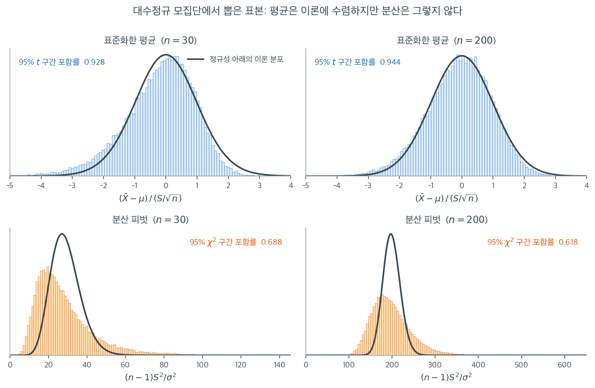

# 정규성 입문

## 정규성이란 무엇인가

자료가 **정규분포**라고 알려진 종 모양 곡선을 따를 때 그 자료가 **정규분포를 따른다**고 말한다. 정규분포는 다음 확률밀도함수로 정의되는 연속확률분포이다.

$$
f(x) = \frac{1}{\sigma \sqrt{2\pi}} \exp\!\left( -\frac{(x - \mu)^2}{2\sigma^2} \right)
$$

여기서

- $\mu$는 분포의 평균,
- $\sigma > 0$은 표준편차,
- $x \in \mathbb{R}$은 임의의 실수값을 취할 수 있는 변수이다.

정규분포는 평균 $\mu$를 중심으로 대칭이다. **경험 법칙**이 확률의 집중 정도를 요약해 준다.

| 구간 | 근사 확률 |
|----------|------------------------|
| $\mu \pm \sigma$ | 68.3% |
| $\mu \pm 2\sigma$ | 95.4% |
| $\mu \pm 3\sigma$ | 99.7% |

!!! tip "표준정규분포"
    $\mu = 0$, $\sigma = 1$이면 **표준정규분포** $Z \sim N(0,1)$을 얻는다. 임의의 정규변수 $X \sim N(\mu, \sigma^2)$는 $Z = (X - \mu)/\sigma$로 표준화할 수 있다.

## 통계적 추론에서 정규성의 중요성

많은 통계 방법이 바탕 자료가 정규분포를 따른다고 가정한다. $t$ 검정, 분산분석, 선형회귀 같은 흔한 기법이 타당한 결과를 위해 이 가정에 기댄다. 정규성 가정이 위배되면 이 방법들이 부정확한 결론을 낼 수 있다.

**중심극한정리(CLT)**는 표본크기가 충분히 크면 모집단 분포와 무관하게 표본평균의 표집분포가 정규에 가까워진다고 말한다. 구체적으로 $X_1, \ldots, X_n$이 평균 $\mu$, 분산 $\sigma^2$인 독립동일분포를 따르면

$$
\frac{\bar{X}_n - \mu}{\sigma / \sqrt{n}} \xrightarrow{d} N(0, 1) \quad (n \to \infty)
$$

이 점근적 정규성 때문에, 바탕 모집단이 정규가 아니어도 정규성이 추론통계에서 결정적인 역할을 한다.

## 중심극한정리가 구해 주는 것과 구해 주지 못하는 것

CLT 이야기를 들으면 "표본만 크면 정규성은 신경 쓸 필요가 없다"고 정리하기 쉽다. 절반만 맞는 말이다. CLT는 **표본평균**에 대한 정리이지 표본에서 계산하는 모든 양에 대한 정리가 아니다. 다음 그림은 그 경계선을 한눈에 보인다. 모집단은 왜도 $2.26$인 대수정규분포이고, 각 표본에서 두 가지를 계산해 40000번 되풀이했다. 위 두 칸은 $t$ 통계량 $(\bar{X}-\mu)/(S/\sqrt{n})$이고, 아래 두 칸은 분산의 피벗 $(n-1)S^2/\sigma^2$이다. 검은 곡선은 모집단이 정규였다면 성립했을 이론 분포($t_{n-1}$과 $\chi^2_{n-1}$)이다.

위 칸을 보라. $n = 30$에서도 히스토그램이 $t_{29}$ 곡선과 제법 겹치고, 왼쪽으로 약간 끌린 꼬리 때문에 95% 신뢰구간의 실제 포함률은 $0.928$에 그친다. $n$을 200으로 늘리면 $0.944$로 올라 약속한 $0.95$에 거의 닿는다. CLT가 약속한 대로 작동한 것이다. 표본을 늘리는 것이 곧 치료가 된다.

아래 칸은 사정이 전혀 다르다. $n = 30$에서 주황색 히스토그램은 $\chi^2_{29}$ 곡선보다 왼쪽으로 몰려 있고 오른쪽 꼬리는 훨씬 길다. 95% 구간의 포함률은 $0.688$에 불과하다. 더 놀라운 것은 $n = 200$으로 표본을 여섯 배 이상 늘렸을 때의 결과다. 포함률이 나아지기는커녕 $0.618$로 **더 나빠졌다**. 이유는 간단하다. $S^2$의 표집분포는 모집단의 4차적률에 의존하는데, 대수정규의 4차적률은 정규의 그것과 애초에 다르다. 표본을 늘리면 $S^2$의 표집분포는 자기 자신의 극한에 정확히 수렴하지만 그 극한은 $\chi^2_{n-1}$이 아니다. 틀린 곳으로 정확하게 수렴하는 셈이다.

그래서 "자료가 정규인가"라는 물음은 언제나 "무엇을 하려는가"와 함께 던져야 한다. 평균을 다루는 절차라면 비정규성은 표본을 늘려 줄일 수 있는 오차이고, 분산을 다루는 절차라면 표본을 늘려도 사라지지 않는 편향이다. 이 장에서 배울 정규성 진단 도구들은 후자의 경우에 특히 값지다.

## 정규성을 가정하는 상황

다음과 같은 상황에서 흔히 정규성을 가정한다.

- **신뢰구간**: 평균의 신뢰구간을 만들 때 바탕 자료 또는 표본평균이 정규분포를 따른다고 가정한다.
- **가설검정**: $t$ 검정을 비롯한 많은 가설검정이 $p$값을 정확히 계산하기 위해 모집단의 정규성을 가정한다.
- **선형모형**: 선형회귀에서 잔차가 정규분포를 따른다는 가정은 회귀계수의 가설검정과 신뢰구간이 타당하기 위해 결정적이다.

!!! warning "가정과 사실은 다르다"
    정규성은 가정이지 실제 자료가 보장하는 성질이 아니다. 정규성에 의존하는 방법을 쓰기 전에 반드시 확인하라. 확인 도구 — 시각적 방법(Q-Q 그림, 히스토그램)과 형식적 검정(Shapiro-Wilk, Anderson-Darling) — 은 이 장의 이어지는 절들에서 다룬다.

## 정규가 아닌 자료의 예

모든 자료가 정규분포를 따르는 것은 아니다. 정규가 아닌 자료의 흔한 예는 다음과 같다.

- **치우친 분포**: 소득 자료는 대체로 오른쪽으로 치우쳐 있으며, 고소득자의 긴 꼬리가 평균을 중앙값 위로 끌어올린다.
- **두꺼운 꼬리 분포**: 금융 수익률은 흔히 정규분포보다 두꺼운 꼬리를 보이며, 극단적 사건이 정규 모형의 예측보다 자주 일어난다는 뜻이다.
- **이봉 또는 다봉 분포**: 봉우리가 둘 이상인 자료 — 예를 들어 성인 남녀가 섞인 집단의 키 — 는 정규성에서 크게 벗어난다.
- **유계이거나 이산인 자료**: 비율, 계수, 리커트 척도 응답은 범위가 제한되거나 이산이라는 성질 때문에 본래 정규가 아니다.

자료가 언제 정규성에서 벗어나는지 이해하는 일은 분석에 적절한 통계 도구와 방법을 고르는 데 필수적이다.

## 연습문제

**연습문제 1.** 
정규분포 $N(\mu, \sigma^2)$의 확률밀도함수를 쓰고 두 모수의 역할을 밝혀라.

??? success "풀이"
    확률밀도함수는

    $$
    f(x) = \frac{1}{\sqrt{2\pi\sigma^2}} \exp\!\left(-\frac{(x-\mu)^2}{2\sigma^2}\right), \quad x \in \mathbb{R}
    $$

    - $\mu$(평균)는 분포의 중심이다. 봉우리의 위치와 대칭축을 결정한다.
    - $\sigma^2$(분산)는 산포를 조절한다. $\sigma^2$이 크면 넓고 평평한 종 모양이 되고, 작으면 높고 좁은 모양이 된다.
    - $\sigma$(표준편차)는 $x$와 같은 단위이므로 $\sigma^2$보다 해석하기 쉽다.

**연습문제 2.** 
정규분포의 68-95-99.7 법칙을 서술하고 표준정규 누적분포함수로 95% 값을 확인하라.

??? success "풀이"
    68-95-99.7 법칙은 $X \sim N(\mu, \sigma^2)$에 대해 다음을 말한다.

    - $P(\mu - \sigma < X < \mu + \sigma) \approx 0.683$
    - $P(\mu - 2\sigma < X < \mu + 2\sigma) \approx 0.954$
    - $P(\mu - 3\sigma < X < \mu + 3\sigma) \approx 0.997$

    $Z \sim N(0,1)$일 때 95% 값을 확인하면, 표준정규 누적분포함수를 $\Phi$라 할 때 $P(-2 < Z < 2) = \Phi(2) - \Phi(-2) = 0.9772 - 0.0228 = 0.9544 \approx 95.4\%$이다.

    정확히 95%가 되는 구간은 $z = 1.96$을 쓴다: $P(-1.96 < Z < 1.96) = 0.95$.

**연습문제 3.** 
$X \sim N(70, 100)$(평균 70, 분산 100)일 때 $P(X > 85)$를 구하라.

??? success "풀이"
    표준화한다: $Z = (X - \mu)/\sigma = (85 - 70)/10 = 1.5$.

    $$
    P(X > 85) = P(Z > 1.5) = 1 - \Phi(1.5) = 1 - 0.9332 = 0.0668
    $$

    85를 넘을 확률은 약 6.7%이다.

**연습문제 4.** 
정규분포가 실무에서 그토록 자주 나타나는 이유를 중심극한정리를 들어 설명하라.

??? success "풀이"
    중심극한정리(CLT)는 평균과 분산이 유한한 독립동일분포 확률변수 $n$개의 합(또는 평균)이 원래 분포와 무관하게 $n \to \infty$일 때 정규분포로 분포수렴한다고 말한다.

    현실의 많은 측정값은 수많은 작고 독립적인 요인이 합쳐진 결과이다. 키는 여러 유전자와 환경 요인의 영향을 받고, 측정오차는 작은 기기 오차들의 합이며, 금융 수익률은 (근사적으로) 여러 독립적인 정보 충격이 쌓인 것이다. 각 경우에 CLT가 합계를 정규 쪽으로 밀어붙인다.

    CLT는 또한 $n$이 클 때 정규가 아닌 자료에서도 정규 기반 방법(t 검정, 회귀)이 잘 작동하는 이유를 설명해 준다. 평균의 표집분포가 어쨌든 근사적으로 정규이기 때문이다.

---

## 정리하며

정규성은 **자료가 아니라 절차에 대한 요구**로 이해해야 한다.

- **정규분포는 두 모수로 정해진다.** $\mu$ 가 위치, $\sigma$ 가 퍼짐이며 대칭이고 봉우리가 하나다.
- **정규성이 필요한 곳은 생각보다 좁다.** $t$ 와 $F$ 의 **정확한** 분포, 분산의 카이제곱 구간, 예측구간이 그것이다. 계수의 불편성이나 큰수의 법칙에는 필요 없다.
- **중심극한정리가 많은 것을 덮어 준다.** 표본평균에 기반한 절차는 $n$ 이 크면 모집단이 정규가 아니어도 작동한다.
- **하지만 모두 그런 것은 아니다.** 분산 추론은 4차적률에 의존해 표본을 늘려도 나아지지 않으며, 이 책에서 여러 번 확인했다.
- **"자료가 정규인가"보다 "이 절차가 위반을 견디는가"가 옳은 물음이다.** 14장 전체가 그 판단을 돕는 도구들이다.

다음 절부터 **시각적 방법**으로 넘어간다.
