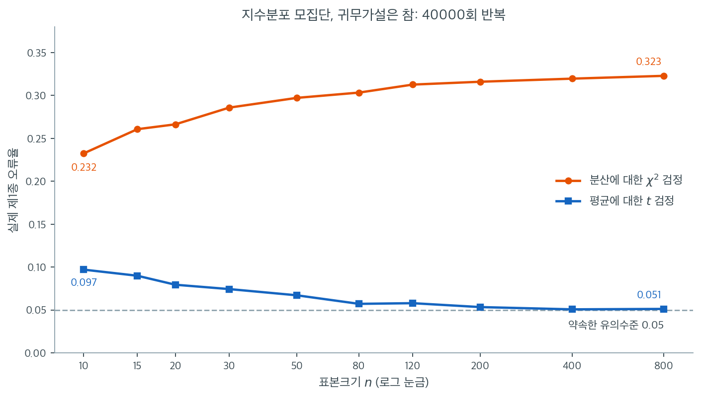

# 통계적 추론에서의 중심적 역할

## 1. 정규성이 중요한 이유

가장 널리 쓰이는 통계 절차 상당수가 자료 또는 자료의 어떤 함수가 정규분포를 따른다는 가정에 기댄다. 이 가정은 단순한 기술적 세부가 아니다. 그 방법들이 내놓는 $p$값, 신뢰구간, 검정통계량이 타당한지를 곧바로 결정한다. 정규성이 성립하면 고전적 추론을 떠받치는 이론적 표집분포가 정확하다. 정규성이 무너지면 그로부터 얻은 결론이 오도할 수 있다.

정규성 가정이 어디서 들어오며 각 절차가 위배에 얼마나 민감한지 이해하면, 정규성 검정이 언제 필요하고 언제 가정을 안전하게 완화할 수 있는지 판단할 수 있다.

---

## 2. 흔한 추론 절차에서의 정규성

### 일표본·이표본 t 검정

일표본 $t$ 검정은 모평균 $\mu$가 가설값 $\mu_0$과 같은지 평가한다. 검정통계량은

$$
t = \frac{\bar{X} - \mu_0}{S / \sqrt{n}}
$$

여기서 $\bar{X}$는 표본평균, $S$는 표본표준편차, $n$은 표본크기이다. $X_1, X_2, \ldots, X_n \overset{\text{iid}}{\sim} N(\mu, \sigma^2)$이라는 가정 아래에서 통계량 $t$는 표본크기 $n$과 무관하게 자유도 $n - 1$의 $t$ 분포를 **정확히** 따른다.

평균 $\mu_1$과 $\mu_2$를 비교하는 이표본 $t$ 검정도 마찬가지로 두 모집단의 정규성을 요구한다. 모집단 분포가 정규이고 분산이 같으면 합동 검정통계량

$$
t = \frac{\bar{X}_1 - \bar{X}_2}{S_p \sqrt{1/n_1 + 1/n_2}}
$$

가 자유도 $n_1 + n_2 - 2$의 $t$ 분포를 따른다. 여기서 $S_p$는 합동 표준편차이다.

### F 검정과 분산분석

일원배치 분산분석에서 $F$ 통계량은 집단 간 분산과 집단 내 분산을 비교한다.

$$
F = \frac{\text{MSB}}{\text{MSW}}
$$

여기서 MSB는 집단 간 평균제곱, MSW는 집단 내 평균제곱이다. 모든 집단 평균이 같다는 귀무가설 아래에서, 그리고 각 집단의 관측값이 분산이 같은 정규 모집단에서 독립적으로 뽑혔다는 가정 아래에서, 통계량 $F$는 자유도 $k - 1$과 $N - k$의 $F$ 분포를 따른다. $k$는 집단의 개수, $N$은 전체 표본크기이다.

### 신뢰구간

모분산을 모를 때 모평균에 대한 $100(1 - \alpha)\%$ 신뢰구간은 다음 형태이다.

$$
\bar{X} \pm t_{\alpha/2,\, n-1} \cdot \frac{S}{\sqrt{n}}
$$

(반복표집에서 그런 구간의 $100(1 - \alpha)\%$가 참 $\mu$를 포함한다는) 포함 보장은 $\bar{X}$의 표집분포가 정규이고 $S^2$이 $\bar{X}$와 독립이라는 데 달려 있다. 두 성질 모두 바탕 자료의 정규성에서 따라 나온다.

---

## 3. 정당화로서의 중심극한정리

**중심극한정리(CLT)**는 엄격한 정규성 요건을 중요한 방식으로 완화해 준다. 평균 $\mu$, 유한 분산 $\sigma^2$을 갖는 독립동일분포 확률변수 $X_1, X_2, \ldots, X_n$에 대해

$$
\frac{\bar{X} - \mu}{\sigma / \sqrt{n}} \xrightarrow{d} N(0, 1) \quad (n \to \infty)
$$

이 분포수렴은 $n$이 충분히 크면 모집단 분포의 모양과 무관하게 표준화한 표본평균의 표집분포가 근사적으로 정규임을 뜻한다. 실무에서는 이 사실이, 자료 자체가 정규가 아니더라도 $n$이 충분히 크다면 $z$ 검정과 근사적 $t$ 검정을 쓰는 것을 정당화한다.

다만 CLT에는 중요한 단서가 따른다.

- **"충분히 크다"는 모집단의 모양에 달려 있다.** 정규에 가까운 대칭분포라면 $n \geq 20$으로 충분할 수 있다. 심하게 치우쳤거나 꼬리가 두꺼운 분포라면 $n$이 수백 개 필요할 수 있다.
- **CLT는 표본평균에 적용되며 다른 통계량에는 적용되지 않는다.** 표본분산, 중앙값, 상관계수 같은 통계량은 각자의 점근분포를 가지며 정규성이나 다른 조건을 요구할 수 있다.
- **정확한 추론과 근사적 추론.** $n$이 작으면 CLT 근사를 믿을 수 없고, 정규성을 요구하는 정확한 분포 결과가 필수적이 된다.

---

## 4. 정규성이 무너지면 무엇이 깨지는가

정규성 가정이 위배되면 여러 문제가 생길 수 있다.

**제1종 오류율의 부풀림.** 참 표집분포의 꼬리가 가정한 $t$ 분포보다 두꺼우면 실제 유의수준이 명목 $\alpha$를 넘을 수 있다. 검정이 마땅한 것보다 자주 귀무가설을 기각한다는 뜻이다.

**떨어진 검정력.** 실제 분포가 치우쳐 있으면 $t$ 검정은 정규성을 가정하지 않는 대안 절차(비모수 검정 등)에 비해 검정력을 잃을 수 있다.

**타당하지 않은 신뢰구간.** 자료의 분포가 충분히 비정규이면 $t$ 기반 신뢰구간의 포함확률이 $1 - \alpha$ 아래로 떨어질 수 있으며, 특히 작은 표본에서 그렇다.

**분산 기반 절차의 민감성.** 분산의 동일성에 대한 $F$ 검정과 단일 분산에 대한 카이제곱 검정은 비정규성에 특히 민감하다. 중간 정도의 이탈만으로도 $p$값이 심각하게 왜곡될 수 있다.

??? warning "분산 검정은 평균 검정보다 민감하다"
    평균에 관한 검정($t$ 검정 등)은 CLT 덕분에 가벼운 비정규성에 비교적 로버스트하다. 분산에 관한 검정(두 분산을 비교하는 $F$ 검정이나 단일 분산의 카이제곱 검정)은 비정규성에 훨씬 민감하여 표본이 어느 정도 커도 오도하는 결과를 낼 수 있다.

### 표본을 늘리면 무엇이 낫고 무엇이 그대로인가

위 경고는 말로만 들으면 정도의 차이처럼 들린다. 실제로는 종류의 차이다. 아래 그림은 평균 $1$, 분산 $1$인 지수분포에서 표본을 뽑아 두 가지 검정을 각각 40000번 되풀이한 결과이다. 둘 다 귀무가설이 **참**인 상황이므로($\mu = 1$이고 $\sigma^2 = 1$이다) 기각률은 약속한 $0.05$여야 한다. 같은 자료에 평균에 대한 $t$ 검정과 분산에 대한 카이제곱 검정을 함께 걸었으므로, 두 곡선의 차이는 모집단 탓이 아니라 오로지 **검정이 자료의 무엇에 기대는가**의 차이다.



파란 곡선을 먼저 보라. $n = 10$에서 실제 오류율이 $0.097$로 약속한 값의 두 배 가까이 된다. 그러나 $n$이 커지면서 꾸준히 내려와 $n = 80$에서 $0.057$, $n = 400$에서 $0.051$에 이른다. 비정규성이 일으킨 왜곡이 표본을 늘리는 것만으로 사라졌다. 앞 절에서 본 $n = 15$의 $0.090$도 이 곡선 위의 한 점일 뿐이다. 이것이 CLT의 보호다.

주황 곡선에는 그런 보호가 없다. $n = 10$에서 $0.232$로 출발해 표본을 늘릴수록 **올라가서** $n = 800$에서 $0.323$이 된다. 5%라고 약속한 검정이 실제로는 세 번에 한 번씩 참인 귀무가설을 기각한다. 표본 800개면 어떤 기준으로도 큰 표본이지만 아무 도움이 되지 않았다. $(n-1)S^2/\sigma^2$이 $\chi^2_{n-1}$을 따른다는 결과는 근사가 아니라 정규성에서만 나오는 **정확한** 항등식이고, 정규성이 없으면 $n$을 아무리 키워도 그 항등식이 되살아나지 않기 때문이다.

실무적으로 이 그림은 정규성 검사의 우선순위를 정해 준다. 평균을 비교하는 것이 목적이고 $n$이 넉넉하다면 정규성 위배는 대체로 관리 가능한 위험이다. 분산이나 분산비를 검정하는 것이 목적이라면 표본크기는 변명이 되지 못하며, 정규성 진단은 선택이 아니라 필수다.

---

## 5. 실무 지침

다음 지침이 정규성 검정이 언제 가장 중요한지 판단하는 데 도움이 된다.

1. **작은 표본($n < 30$)**: CLT의 보호가 거의 없다. 모수적 절차를 적용하기 전에 시각적 방법(Q-Q 그림, 히스토그램)과 형식적 검정(Shapiro-Wilk)으로 정규성을 확인하라.
2. **중간 표본($30 \leq n \leq 100$)**: 평균 기반 추론에는 CLT가 어느 정도 보호를 제공하지만 분산 기반 추론에는 여전히 근사적 정규성이 필요하다. 시각적 진단으로 빠르게 확인하라.
3. **큰 표본($n > 100$)**: 평균 기반 추론은 대체로 로버스트하다. 다만 형식적 정규성 검정의 검정력이 매우 커져 사소한 이탈에도 정규성을 기각할 수 있다. 통계적 유의성보다 그 이탈이 실질적으로 의미 있는지에 집중하라.

<div class="exbox" markdown>

**보기 1.** <span class="diff easy" title="쉬움"></span> 부풀어 오른 $0.0900$ 은 어느 쪽 꼬리에서 왔는가. 평균을 0으로 맞춘 지수분포와 표준정규에서 각각 $n = 15$를 뽑아 일표본 $t$ 검정을 10000번 되풀이한다. 귀무가설이 참이므로 기각률은 $0.05$여야 하는데, 지수분포에서는 $0.0900$, 정규에서는 $0.0527$이 나온다.

**(1)** 명목 $0.05$에 대한 **몬테카를로 표준오차**를 구하시오. 정규자료의 $0.0527$은 실제 왜곡인가 모의실험의 잡음인가.

**(2)** 지수자료의 $0.0900$을 **양쪽 꼬리로 쪼개어** 각각 재시오. 명목값은 한쪽에 $0.025$씩이다. 두 쪽이 대칭인가?

**(3)** $n$을 키우면 두 단측 기각률이 어떻게 움직이는가. 한쪽 오차가 $n^{-1/2}$ 로 줄어든다는 것을 수로 보이고, 지수분포의 왜도 $\gamma_1 = 2$ 로 그 **계수까지** 맞추시오. 양쪽 합은 왜 더 빨리 줄어드는가.

</div>

??? success "풀이"

    **쪽의 코드를 먼저 그대로 돌린다.**

    ```python
    import numpy as np
    from scipy import stats

    # ===================================================================
    # 정규성이 깨지면 t 검정의 제1종 오류율이 어떻게 되는가
    #
    # 귀무가설이 참인 자료에서 검정을 되풀이해, 5%로 약속한 오류율이 실제로
    # 지켜지는지 센다. 모집단만 바꾸고 나머지는 모두 같게 두었다.
    # ===================================================================

    np.random.seed(42)
    n = 15
    alpha = 0.05
    n_simulations = 10_000

    # 정규모집단: 오류율이 0.05 에 붙어야 한다. 이것이 기준선이다.
    rejections_normal = 0
    for _ in range(n_simulations):
        sample = np.random.normal(loc=0, scale=1, size=n)
        _, p = stats.ttest_1samp(sample, popmean=0)
        if p < alpha:
            rejections_normal += 1

    # 지수모집단: 평균을 0 으로 맞췄으므로 귀무가설은 여전히 참이다.
    # 달라진 것은 모양뿐인데, n=15 로 작아 중심극한정리가 아직 듣지 않는다.
    # 그래서 오류율이 0.05 에서 벗어난다.
    rejections_exp = 0
    for _ in range(n_simulations):
        sample = np.random.exponential(scale=1, size=n) - 1  # mean = 0
        _, p = stats.ttest_1samp(sample, popmean=0)
        if p < alpha:
            rejections_exp += 1

    if __name__ == "__main__":
        print(f"Type I error rate (normal data):      "
              f"{rejections_normal / n_simulations:.4f}")
        print(f"Type I error rate (exponential data):  "
              f"{rejections_exp / n_simulations:.4f}")
        print(f"Nominal alpha:                         {alpha:.4f}")
    ```

    출력:

    ```text
    Type I error rate (normal data):      0.0527
    Type I error rate (exponential data):  0.0900
    Nominal alpha:                         0.0500
    ```

    **(1) 정규자료의 $0.0527$ 은 잡음이다.** 기각 여부가 성공확률 $\alpha$ 인 베르누이 시행이므로 $R = 10000$ 번의 기각률의 표준오차는

    $$
    \mathrm{SE} = \sqrt{\frac{\alpha(1-\alpha)}{R}} = \sqrt{\frac{0.05 \times 0.95}{10000}} = 0.00218 .
    $$

    두 결과를 이 자로 재면

    | 모집단 | 기각률 | 명목값과의 차 | 표준오차 단위 |
    |---|---|---|---|
    | 정규 | $0.0527$ | $+0.0027$ | $+1.24$ |
    | 지수 | $0.0900$ | $+0.0400$ | $+18.3$ |

    이다. 정규자료의 $+1.24$ 는 **두 표준오차 안**이므로 $t$ 검정이 정규자료에서 정확하다는 것과 완전히 일치한다. ($n = 15$ 에서 $t$ 검정은 근사가 아니라 정확하므로, 여기서 $0.05$ 가 아닌 값이 체계적으로 나왔다면 모의실험 자체가 틀린 것이다.) 지수자료의 $+18.3$ 은 우연일 수 없다. **하나는 잡음이고 하나는 왜곡이며, 그 둘을 가르는 것이 몬테카를로 표준오차다.**

    **(2) 전혀 대칭이 아니다. 거의 전부 아래쪽 꼬리에서 왔다.** 같은 설정을 $R = 200000$ 번으로 늘려 양쪽을 따로 세면 $n = 15$ 에서

    $$
    P(T < -t_{0.975,14}) = 0.0837, \qquad P(T > +t_{0.975,14}) = 0.0050
    $$

    이다. 명목값이 한쪽에 $0.025$ 씩인데 **아래쪽은 $3.3$ 배로 기각하고 위쪽은 $5$ 분의 1 로 기각한다.** 합이 $0.0887$ 로 쪽의 $0.0900$ 과 맞지만(모의실험 횟수가 달라 생긴 차이는 $0.46$ 표준오차), 그 $0.0887$ 은 두 개의 크게 틀린 수가 **부분적으로 상쇄되어** 남은 값이다.

    까닭은 $\bar X$ 와 $S$ 가 **양의 상관**을 갖는 데 있다. 오른쪽으로 치우친 모집단에서 큰 관측값 하나가 들어오면 $\bar X$ 가 올라가는 동시에 $S$ 도 함께 올라간다. $T = \bar X/(S/\sqrt n)$ 의 분자와 분모가 같은 방향으로 움직이니 $T$ 가 크게 양수가 되기 어렵다. 반대로 $\bar X$ 가 참값보다 낮게 나오는 흔한 경우에는 $S$ 도 작아져 $T$ 가 크게 음수가 된다. 그래서 **$T$ 의 분포가 왼쪽으로 치우친다.** 모집단이 오른쪽으로 치우쳤는데 통계량은 왼쪽으로 치우치는, 방향이 뒤집히는 현상이다.

    실무적 함의는 단측검정에서 심각하다. 양측검정을 하면 두 오차가 상쇄되어 $0.089$ 로 보이지만, **한쪽만 보면 $0.084$ 대 $0.005$, 곧 $17$ 배 차이**다. 치우친 자료에 단측 $t$ 검정을 걸면 방향에 따라 검정이 지나치게 느슨해지거나 지나치게 보수적이 된다.

    **(3) 한쪽 오차는 $n^{-1/2}$ 로 줄어들고 계수까지 맞는다.**

    $t$ 통계량의 에지워스 전개 1차 항은

    $$
    P(T \le x) = \Phi(x) + \frac{\gamma_1}{6\sqrt{n}}\,(2x^2 + 1)\,\varphi(x) + O(n^{-1})
    $$

    이다. $x = z_{0.975} = 1.95996$, $\varphi(z) = 0.05844$, $2z^2 + 1 = 8.6828$ 이고 지수분포의 왜도는 $\gamma_1 = 2$ 이므로 계수는

    $$
    \frac{\gamma_1}{6}(2z^2+1)\varphi(z) = \frac{2}{6}\times 8.6828 \times 0.05844 = 0.1692
    $$

    이다. 전개를 양쪽 꼬리에 각각 적용하면

    $$
    P(T < -z) - 0.025 \approx +\frac{0.1692}{\sqrt n},
    \qquad
    P(T > +z) - 0.025 \approx -\frac{0.1692}{\sqrt n}
    $$

    을 얻는다. **부호가 반대이고 크기가 같다.** 모의실험으로 확인하면

    | $n$ | 아래쪽 | 위쪽 | 합 | $\sqrt n\,(\text{아래}-0.025)$ | $\sqrt n\,(\text{위}-0.025)$ |
    |---|---|---|---|---|---|
    | 15 | $0.0837$ | $0.0050$ | $0.0887$ | $+0.227$ | $-0.077$ |
    | 30 | $0.0658$ | $0.0072$ | $0.0730$ | $+0.223$ | $-0.097$ |
    | 60 | $0.0519$ | $0.0104$ | $0.0624$ | $+0.209$ | $-0.113$ |
    | 120 | $0.0439$ | $0.0135$ | $0.0574$ | $+0.207$ | $-0.126$ |
    | 240 | $0.0380$ | $0.0159$ | $0.0538$ | $+0.201$ | $-0.142$ |
    | 480 | $0.0342$ | $0.0181$ | $0.0523$ | $+0.201$ | $-0.151$ |

    $\sqrt n$ 을 곱한 두 열이 $n$ 을 32배 늘리는 동안 **거의 변하지 않는다.** $n^{-1/2}$ 로 줄어든다는 뜻이고, 그 값이 예측한 $\pm 0.169$ 쪽으로 다가가고 있다. 수렴이 느린 것은 전개의 $O(n^{-1})$ 항이 남아 있기 때문이다. 더 키워 보면 $n = 4000$ 에서(같은 방식, $R = 200000$) 아래쪽 $+0.163$, 위쪽 $-0.190$ 이 나오는데, 이 규모에서 $\sqrt n$ 을 곱한 값의 몬테카를로 표준오차가 $0.022$ 이므로 둘 다 $\pm 0.169$ 와 구별되지 않는다. **유도한 계수와 수치가 맞는다.**

    **양쪽 합이 더 빨리 줄어드는 이유도 이 식에 있다.** 두 단측 오차가 $+0.1692/\sqrt n$ 과 $-0.1692/\sqrt n$ 이므로 더하면 $n^{-1/2}$ 항이 **정확히 소거되고** $O(n^{-1})$ 항만 남는다. 표에서 그대로 보인다. 아래쪽 오차는 $n = 15$ 의 $+0.0587$ 에서 $n = 480$ 의 $+0.0092$ 로 $6.4$ 배 줄었을 뿐인데($\sqrt{32} = 5.7$ 배에 해당), 합의 오차는 $+0.0387$ 에서 $+0.0023$ 으로 **$17$ 배** 줄었다.

    그러므로 "$n$ 을 키우면 $t$ 검정이 괜찮아진다"는 말은 **양측검정에 대해서만 빠르게 참**이다. 본문의 그림에서 파란 곡선이 $n = 400$ 에서 $0.051$ 로 내려앉은 것이 그 $O(n^{-1})$ 소거의 결과이고, 비슷한 규모인 $n = 480$ 에서도 단측 기각률은 여전히 $0.034$ 대 $0.018$ 로 어긋나 있다. **양측검정의 정확함이 단측검정의 정확함을 뜻하지 않는다.**

    ```python
    import numpy as np
    from scipy import stats

    R = 200_000
    z = stats.norm.ppf(0.975)
    coef = (2 / 6) * (2 * z**2 + 1) * stats.norm.pdf(z)   # gamma1 = 2 (지수분포)
    print(f"명목: 양쪽 0.050, 한쪽 0.025")
    print(f"MC SE: 양쪽 {np.sqrt(0.05*0.95/R):.5f},  한쪽 {np.sqrt(0.025*0.975/R):.5f}")
    print(f"에지워스 1차 예측 계수 = (gamma1/6)(2z^2+1)phi(z) = {coef:.4f}\n")

    print("   n   아래쪽    위쪽     합      sqrt(n)*(아래-0.025)  sqrt(n)*(위-0.025)")
    rng = np.random.default_rng(77)
    for n in [15, 30, 60, 120, 240, 480]:
        tc = stats.t.ppf(0.975, n - 1)
        lo = hi = done = 0
        while done < R:
            b = min(20_000, R - done)
            x = rng.exponential(1.0, size=(b, n)) - 1        # 평균 0, 귀무가설 참
            t = x.mean(1) / (x.std(1, ddof=1) / np.sqrt(n))
            lo += int((t < -tc).sum()); hi += int((t > tc).sum()); done += b
        lo, hi = lo / R, hi / R
        print(f"{n:4d}  {lo:.5f}  {hi:.5f}  {lo+hi:.5f}        "
              f"{np.sqrt(n)*(lo-0.025):+.4f}             {np.sqrt(n)*(hi-0.025):+.4f}")
    ```

    출력:

    ```text
    명목: 양쪽 0.050, 한쪽 0.025
    MC SE: 양쪽 0.00049,  한쪽 0.00035
    에지워스 1차 예측 계수 = (gamma1/6)(2z^2+1)phi(z) = 0.1692

       n   아래쪽    위쪽     합      sqrt(n)*(아래-0.025)  sqrt(n)*(위-0.025)
      15  0.08370  0.00504  0.08874        +0.2273             -0.0773
      30  0.06580  0.00721  0.07301        +0.2234             -0.0974
      60  0.05194  0.01043  0.06237        +0.2087             -0.1129
     120  0.04390  0.01346  0.05736        +0.2070             -0.1264
     240  0.03797  0.01586  0.05383        +0.2009             -0.1416
     480  0.03419  0.01812  0.05231        +0.2012             -0.1507
    ```

위 모의실험은 $n$이 작고 모집단이 치우쳐 있을 때 $t$ 검정의 실제 제1종 오류율이 명목 $\alpha = 0.05$에서 눈에 띄게 벗어날 수 있음을 보여준다. 지수분포 자료에서 실제 기각률은 $0.090$으로 명목값의 거의 두 배이다. 정규분포 자료에서는 기대대로 경험적 기각률이 $0.053$으로 0.05에 가깝다.

---

## 연습문제

<div class="drillbox" markdown>

**연습문제 1.** <span class="diff med" title="중간"></span>
정규분포에 의존하는 통계학의 기본 결과 세 가지를 들어라. 각각에 대해 정규성이 정확히 필요한지 근사적으로만 필요한지 서술하라.

</div>

??? success "풀이"

    1. **평균에 대한 t 검정:** 유한한 $n$에서 검정통계량이 $t$ 분포를 따르려면 정확한 정규성이 필요하다. 중간 정도의 $n$에서는 (CLT에 의해) 근사적으로 정규인 자료로 충분하다.

    2. **회귀계수의 신뢰구간:** 정확한 $t$ 기반 추론을 위해서는 OLS 추정이 정규분포 오차를 요구한다. $n$이 크면 추정량의 점근적 정규성으로 충분하다.

    3. **분산에 대한 카이제곱 검정:** 정확한 정규성이 필요하다($\sum(X_i - \bar{X})^2/\sigma^2 \sim \chi^2_{n-1}$은 $X_i$가 정규일 때에만 성립한다). CLT가 구해 주지 못한다. 분산 추정량의 카이제곱 분포는 점근적으로도 정규성에 의존한다.

<div class="drillbox" markdown>

**연습문제 2.** <span class="diff med" title="중간"></span>
중심극한정리가 추론을 위한 "근사적 정규성"을 어떻게 제공하며 그 한계는 무엇인지 설명하라.

</div>

??? success "풀이"
    CLT는 $\sqrt{n}(\bar{X}_n - \mu) \xrightarrow{d} N(0, \sigma^2)$이라고 말한다. 이 덕분에 자료가 정규가 아니어도 $n$이 "충분히 크면" 표본평균에 대해 정규 기반 추론(z 검정, 신뢰구간)을 쓸 수 있다.

    한계: (1) "충분히 크다"는 바탕 분포에 달려 있다. 대칭분포는 빠르게 수렴하지만($n \geq 20$) 심하게 치우쳤거나 꼬리가 두꺼운 분포는 $n > 100$이 필요할 수 있다. (2) CLT는 평균에 적용되며 분산, 분위수, 상관 같은 다른 통계량에는 적용되지 않고 그것들은 더 느리게 수렴할 수 있다. (3) 분산이 무한하면(예: 코시분포) CLT가 적용되지 않는다.

<div class="drillbox" markdown>

**연습문제 3.** <span class="diff med" title="중간"></span>
어떤 통계학자가 "CLT가 구해 줄 것"이므로 정규성 검정이 불필요하다고 주장한다. 이 주장은 어떤 조건에서 타당하고 언제 실패하는가?

</div>

??? success "풀이"
    주장이 타당한 경우: (1) 표본크기가 크다(가벼운 비정규 자료에서 $n \geq 30$–$50$). (2) 추론의 대상이 평균이나 자료의 선형결합이다. (3) 바탕 분포의 분산이 유한하다.

    주장이 실패하는 경우: (1) $n$이 작다(CLT 근사가 나쁘다). (2) 자료가 심하게 치우쳤거나 극단적 이상점이 있다. (3) 추론이 분산, 분위수, 그 밖의 비선형 통계량에 관한 것이다. (4) 분포의 분산이 무한하다. (5) 정확한 분포 결과가 필요하다(예: 평균이 아니라 오차 분포에 의존하는 예측구간).

<div class="drillbox" markdown>

**연습문제 4.** <span class="diff med" title="중간"></span>
예측구간이 평균의 신뢰구간보다 더 강한 정규성 가정을 요구하는 이유를 설명하라.

</div>

??? success "풀이"
    **평균의 신뢰구간**은 $\bar{X}$의 표집분포에 의존하며, 자료가 정규가 아니어도 CLT에 의해 근사적으로 정규이다.

    미래 관측값 $X_{n+1}$에 대한 **예측구간**은 평균이 아니라 $X_{n+1}$ 자체의 분포에 의존한다. 구간은 $\bar{X} \pm t_{\alpha/2} \cdot s\sqrt{1 + 1/n}$이며, 그 포함확률은 $X_{n+1}$이 실제로 정규분포를 따르는지에 달려 있다.

    $X_{n+1}$이 치우쳤거나 꼬리가 두꺼운 분포에서 나온다면 예측구간의 포함확률이 틀리게 된다. 꼬리가 두꺼우면 지나치게 좁아 극단값을 놓치고, 치우친 자료에서는 비대칭적으로 포함되어 한쪽은 좁고 다른 쪽은 넓어진다. 평균이 아니라 관측값 하나를 예측하는 것이므로 어떤 CLT도 이를 고쳐 주지 못한다.

---

## 정리하며

정규성 가정은 $t$ 검정, $F$ 검정, 신뢰구간의 바탕이 되는 정확한 분포 결과를 통해 통계적 추론에 들어온다. CLT는 큰 표본과 평균 기반 절차에 대해 이 요건을 완화해 주지만, 작은 표본의 추론, 분산 기반 검정, 표본평균을 넘어서는 절차에서는 여전히 정규성에 주의해야 한다. 따라서 정규성 검정은 추상적인 연습이 아니라 통계적 결론의 타당성을 지키는 실용적 안전장치이다.
