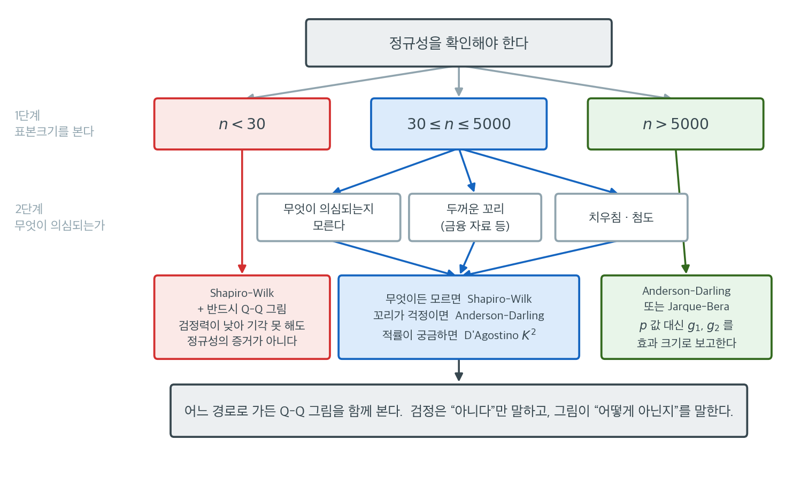

# 올바른 검정 고르기

## 검정 선택이 중요한 이유

정규성 검정에는 여러 가지가 있으며 각각 강점과 민감도가 다르다. Shapiro-Wilk 검정, Anderson-Darling 검정, Kolmogorov-Smirnov 검정, Jarque-Bera 검정은 모두 정규성을 평가하지만, 어떤 유형의 이탈을 가장 효과적으로 탐지하는지, 어떤 표본크기를 감당하는지, 표준 소프트웨어에서 어떻게 구현되어 있는지가 다르다. 올바른 검정의 선택은 표본크기, 의심되는 이탈의 유형, 추론의 맥락에 달려 있다.

## 흔한 정규성 검정 개관

### Shapiro-Wilk 검정

Shapiro-Wilk 검정은 정렬된 표본값이 정규분포의 기대 순서통계량과 얼마나 잘 맞는지를 재는 검정통계량 $W$를 계산하여 귀무가설 $H_0$: "자료가 정규분포에서 왔다"를 평가한다. 통계량은

$$
W = \frac{\left(\sum_{i=1}^{n} a_i X_{(i)}\right)^2}{\sum_{i=1}^{n} (X_i - \bar{X})^2}
$$

여기서 가중치 $a_i$는 정규 순서통계량의 공분산행렬에서 유도된다. $W$가 1에 가까우면 정규성을, 작으면 이탈을 나타낸다.

**강점:** 정규성 이탈을 탐지하는 데 대체로 가장 강력하며, 특히 작거나 중간 크기의 표본($n \leq 50$)에서 그렇다. 치우침과 두꺼운 꼬리 모두에 민감하다.

**한계:** 대부분의 구현이 $n$을 최대 5000으로 제한한다. 이탈의 유형(치우침 대 첨도)을 알려주지 않는다.

### Anderson-Darling 검정

Anderson-Darling 검정은 경험분포함수(EDF)에 기초한다. EDF $F_n(x)$와 가정한 정규 누적분포함수 $\Phi(x)$ 사이의 거리를 가중하여 잰다.

$$
A^2 = -n - \sum_{i=1}^{n} \frac{2i - 1}{n} \left[\ln \Phi(Z_{(i)}) + \ln\left(1 - \Phi(Z_{(n+1-i)})\right)\right]
$$

여기서 $Z_{(i)} = (X_{(i)} - \bar{X}) / S$는 표준화된 순서통계량이다. Anderson-Darling 통계량은 Kolmogorov-Smirnov 검정보다 분포의 꼬리에 더 큰 가중치를 준다.

**강점:** KS 검정보다 꼬리 이탈에 민감하다. 더 큰 표본크기에도 쓸 수 있다. 다양한 대립가설에서 좋은 성능을 낸다.

**한계:** 작은 표본에서는 Shapiro-Wilk보다 조금 덜 강력하다. 임계값이 모수를 추정했는지 알고 있는지에 따라 달라진다.

### Kolmogorov-Smirnov 검정

Kolmogorov-Smirnov(KS) 검정은 EDF와 가정한 누적분포함수 사이의 최대 절대거리를 잰다.

$$
D = \sup_x \left| F_n(x) - \Phi(x) \right|
$$

모수를 추정한 정규분포와 비교할 때는 반드시 Lilliefors 보정을 적용해야 한다. 표준 KS 임계값이 모수가 완전히 지정되었다고 가정하기 때문이다.

**강점:** 개념이 단순하다. 임의의 연속분포에 적용할 수 있다. 표본크기 제한이 없다.

**한계:** 정규성 위배 탐지에서 Shapiro-Wilk와 Anderson-Darling보다 대체로 검정력이 낮다. 분포 중앙의 이탈에 가장 민감하고 꼬리의 이탈에는 상대적으로 둔감하다.

### Jarque-Bera 검정

Jarque-Bera 검정은 표본왜도와 표본첨도에 기초한다. 검정통계량은

$$
JB = \frac{n}{6}\left(\hat\gamma_1^{\,2} + \frac{\hat\gamma_2^{\,2}}{4}\right)
$$

여기서 $\hat\gamma_1$은 표본왜도, $\hat\gamma_2 = \hat\beta_2 - 3$은 표본 **초과**첨도다. $H_0$ 아래에서 $n \to \infty$일 때 $JB \overset{d}{\to} \chi^2_2$이다.

**강점:** 정규성 이탈의 가장 흔한 두 유형인 치우침과 첨도를 직접 겨냥한다. 계산이 단순하다. 계량경제학과 금융에서 널리 쓰인다.

**한계:** 점근적 검정이므로 작은 표본($n < 30$)에서는 믿을 수 없다. 왜도와 첨도에 영향을 주지 않는 이탈(예: 대칭이고 중첨인 성분으로 이루어진 이봉분포)에는 둔감하다.

## 비교표

| 검정 | 적합한 표본크기 | 민감한 대상 | 꼬리 민감도 | 계산 비용 |
|---|---|---|---|---|
| Shapiro-Wilk | $n \leq 5000$ | 일반적 이탈 | 높음 | 중간 |
| Anderson-Darling | 제한 없음 | 꼬리 이탈 | 매우 높음 | 낮음 |
| Kolmogorov-Smirnov (Lilliefors) | 제한 없음 | 중앙의 이탈 | 낮음 | 낮음 |
| Jarque-Bera | $n \geq 30$ | 왜도와 첨도 | 중간 | 매우 낮음 |

## 판단의 틀

다음 지침이 적절한 검정을 고르는 데 도움이 된다.

**1단계: 표본크기를 고려한다.**

- $n < 30$이면 Shapiro-Wilk 검정을 쓴다. 작은 표본에서 검정력이 가장 좋다. Q-Q 그림으로 보완하라.
- $30 \leq n \leq 5000$이면 Shapiro-Wilk가 여전히 강력한 기본 선택이다. 꼬리 거동이 주된 관심사라면 Anderson-Darling 검정이 좋은 대안이다.
- $n > 5000$이면 (표본크기 제한이 없는) Anderson-Darling 검정을 쓴다. 왜도나 첨도가 관심사라면 Jarque-Bera 검정도 적절하다.

**2단계: 의심되는 이탈을 고려한다.**

- 두꺼운 꼬리가 의심되면(예: 금융 자료) Anderson-Darling이나 Jarque-Bera를 선호한다. KS 검정은 꼬리에서 너무 둔감하다.
- 치우침이 주된 관심사면 Jarque-Bera가 그것을 직접 검정한다.
- 이탈의 유형을 모르면 Shapiro-Wilk가 가장 폭넓게 강력한 선택이다.

**3단계: 추론의 맥락을 고려한다.**

- 후속 분석이 $t$ 검정이나 분산분석이면 범용 검정(Shapiro-Wilk)이 적절하다.
- 후속 분석이 분산이나 꼬리 위험과 관련되면 꼬리에 민감한 검정(Anderson-Darling)이 더 적합하다.

??? tip "언제나 시각적 방법으로 보완하라"
    어떤 정규성 검정도 시각적 평가를 대체하지 못한다. Q-Q 그림은 이탈의 유형과 위치(꼬리, 중앙, 치우침)를 드러내고 히스토그램은 전반적 모양을 보여준다. 형식적 검정과 Q-Q 그림의 조합이 가장 유익한 평가를 제공한다.

### 세 단계를 한 장으로

위의 세 단계를 실제로 따라가는 경로는 그림으로 그려 두면 기억하기 쉽다.



이 그림에서 눈여겨볼 곳은 세 갈래의 **성격이 다르다**는 점이다. 가운데 파란 경로만이 "검정을 골라 돌린다"는 보통의 의미를 갖는다. 양옆의 두 경로는 검정을 고르는 문제라기보다 **검정에 무엇을 기대하지 말아야 하는가**의 문제다.

왼쪽 $n < 30$ 경로에서는 Shapiro-Wilk가 여전히 최선의 선택이지만, 그 최선이 그리 좋지 않다. 검정력이 낮아 웬만한 이탈도 놓치므로 "기각하지 못했다"가 정규성의 증거가 되지 못한다. 이 구간에서 실제로 판단을 내리는 도구는 Q-Q 그림이고, 검정은 보조 자료다. 상자의 문구를 "Shapiro-Wilk를 쓰되 결과를 믿지 말라"로 읽어도 크게 틀리지 않는다.

오른쪽 $n > 5000$ 경로는 정반대 이유로 검정을 믿을 수 없다. 어떤 검정이든 거의 확실히 기각하므로 기각 자체에 정보가 없다. Anderson-Darling이나 Jarque-Bera를 쓰는 이유는 표본크기 제한이 없어서이지 결과가 더 유익해서가 아니다. 이 구간에서 보고해야 할 숫자는 $p$값이 아니라 $g_1$과 $g_2$, 곧 **이탈의 크기**다.

가운데 경로 안에서의 선택은 의심되는 이탈의 종류가 정한다. 짚이는 데가 없으면 폭넓게 강력한 Shapiro-Wilk, 금융 수익률처럼 꼬리가 걱정이면 Anderson-Darling, 치우침인지 첨도인지 진단까지 원하면 $Z_1$과 $Z_2$를 따로 돌려주는 D'Agostino $K^2$이다. Kolmogorov-Smirnov가 어느 갈래에도 없다는 점에 주목하라. 정규성만이 목적이라면 KS를 고를 이유가 거의 없다.

맨 아래 띠가 전체를 관통하는 규칙이다. 어느 경로로 가든 Q-Q 그림을 함께 본다. 검정은 "정규가 아니다"까지만 말해 주고, 어떻게 아닌지는 그림만이 보여준다.

<div class="exbox" markdown>

**보기 1.** <span class="diff easy" title="쉬움"></span> 같은 자료에 네 검정 돌려 보기. $t_5$에서 $n = 100$개를 뽑아 샤피로–윌크, 앤더슨–달링, 콜모고로프–스미르노프, 자르크–베라를 모두 돌린다.

**(1)** 자르크–베라의 닫힌 꼴 $JB = \frac{n}{6}\bigl(g_1^2 + \frac{g_2^2}{4}\bigr)$을 코드가 준 $JB = 5365.90$과 맞춰 보고, `scipy`가 **어느 판본**의 왜도·첨도를 쓰는지 밝히시오. $t_5$의 이론값($\gamma_1 = 0$, $\gamma_2 = 6$)을 넣으면 $JB$가 얼마인가. 관측값과의 차이는 어디서 오는가.

**(2)** KS 의 $p = 0.0030$은 나머지 셋과 **견줄 수 있는 수가 아니다.** 왜 그런가. 모수 추정을 반영한 올바른 귀무분포를 모의로 만들어 바른 $p$값과 5% 임계값을 구하고, 표준 KS 임계값을 그대로 썼을 때 검정의 **실제 크기**를 재시오.

</div>

??? success "풀이"

    ```python
    import numpy as np
    from scipy import stats

    # ===================================================================
    # 같은 자료에 네 검정을 모두 돌려 결론을 견준다
    #
    # 검정마다 무엇에 민감한지가 달라, 같은 자료에서도 p-값이 꽤 갈린다.
    # 하나만 골라 돌리고 끝낼 일이 아니라는 것이 요점이다.
    # ===================================================================

    np.random.seed(42)
    n = 100

    # 자유도 5 인 t. 대칭이지만 꼬리가 두꺼운 자료다.
    data = stats.t.rvs(df=5, size=n)

    if __name__ == "__main__":
        # Shapiro-Wilk — 두루 쓰기 좋고 작은 표본에서 검정력이 높다.
        sw_stat, sw_p = stats.shapiro(data)
        print(f"Shapiro-Wilk:      W = {sw_stat:.4f}, p = {sw_p:.4f}")

        # Anderson-Darling — 꼬리에 무게를 싣는다. 이 자료에 가장 민감할 것이다.
        ad_result = stats.anderson(data, dist="norm")
        print(f"Anderson-Darling:  A2 = {ad_result.statistic:.4f}, "
              f"critical (5%) = {ad_result.critical_values[2]:.4f}")

        # KS — 모수를 자료에서 추정해 넘겼으므로 p-값이 실제보다 크게 나온다.
        # 제대로 하려면 Lilliefors 기각값을 써야 한다.
        ks_stat, ks_p = stats.kstest(data, "norm", args=(np.mean(data), np.std(data)))
        print(f"KS (estimated):    D = {ks_stat:.4f}, p = {ks_p:.4f}")

        # Jarque-Bera — 왜도와 첨도만 본다. 큰 표본에서 쓸 만하다.
        jb_stat, jb_p = stats.jarque_bera(data)
        print(f"Jarque-Bera:       JB = {jb_stat:.4f}, p = {jb_p:.4f}")
    ```

    출력:

    ```text
    Shapiro-Wilk:      W = 0.6287, p = 0.0000
    Anderson-Darling:  A2 = 6.0914, critical (5%) = 0.7590
    KS (estimated):    D = 0.1783, p = 0.0030
    Jarque-Bera:       JB = 5365.9041, p = 0.0000
    ```

    표본의 모양 통계량은 $g_1 = 4.8256$, $g_2 = 34.5640$이다(보정판은 $G_1 = 4.8994$, $G_2 = 36.4190$). 네 검정이 모두 기각한다.

    ```python
    import numpy as np
    from scipy import stats

    np.random.seed(42)
    n = 100
    d = stats.t.rvs(df=5, size=n)

    print("t_5 의 이론값:  왜도 0,  초과첨도 6/(5-4) = 6")
    print(f"이 표본:  g1 = {stats.skew(d):.4f}   g2 = {stats.kurtosis(d):.4f}")
    print(f"  (보정판 G1 = {stats.skew(d, bias=False):.4f},"
          f" G2 = {stats.kurtosis(d, bias=False):.4f})")

    # 자르크-베라의 닫힌 꼴을 직접 확인한다.
    g1, g2 = stats.skew(d), stats.kurtosis(d)
    print(f"\nJB = n/6*(g1^2 + g2^2/4) = {n / 6 * (g1 ** 2 + g2 ** 2 / 4):.4f}"
          f"   scipy = {stats.jarque_bera(d).statistic:.4f}")
    print(f"t_5 의 이론값을 넣으면 JB = {n / 6 * (0 ** 2 + 6 ** 2 / 4):.1f}")

    # 이 표본의 극단값 하나가 모든 것을 끌고 간다.
    z = (d - d.mean()) / d.std(ddof=1)
    print(f"\n표준화 최대/최소:  {z.max():+.2f}  {z.min():+.2f}")
    drop = np.sort(d)[:-1]
    print("가장 큰 관측 하나를 빼면 (n = 99):")
    print(f"  g1 = {stats.skew(drop):+.4f}   g2 = {stats.kurtosis(drop):+.4f}")
    print(f"  W = {stats.shapiro(drop).statistic:.4f}  p = {stats.shapiro(drop).pvalue:.4f}")
    print(f"  A2 = {stats.anderson(drop, dist='norm').statistic:.4f}")
    print(f"  JB = {stats.jarque_bera(drop).statistic:.4f}"
          f"  p = {stats.jarque_bera(drop).pvalue:.4f}")

    # KS 를 추정 모수로 쓰면 p 값이 얼마나 과대평가되는가.
    D_obs = stats.kstest(d, "norm", args=(np.mean(d), np.std(d))).statistic


    def ks_est(x):
        return stats.kstest(x, "norm", args=(np.mean(x), np.std(x))).statistic


    rng = np.random.default_rng(404)
    R = 40000
    Dnull = np.array([ks_est(rng.normal(0, 1, n)) for _ in range(R)])
    p_lillie = np.mean(Dnull >= D_obs)
    print(f"\nKS:  D = {D_obs:.4f}")
    print(f"  표준 KS p값 (모수를 안다고 가정)        = "
          f"{stats.kstest(d, 'norm', args=(np.mean(d), np.std(d))).pvalue:.4f}")
    print(f"  릴리에포르 p값 (모수 추정을 반영, R={R}) = {p_lillie:.5f}")
    print(f"  5% 임계값:  표준 KS {stats.ksone.ppf(0.975, n):.4f}"
          f"   릴리에포르 {np.percentile(Dnull, 95):.4f}")

    # 그 임계값을 잘못 쓰면 검정의 실제 크기는 얼마가 되는가.
    crit_std = stats.ksone.ppf(0.975, n)
    print(f"\n표준 KS 임계값 {crit_std:.4f} 를 추정 모수에 그대로 쓰면")
    print(f"  명목 0.05 인 검정의 실제 크기 = {np.mean(Dnull > crit_std):.5f}")
    ```

    출력:

    ```text
    t_5 의 이론값:  왜도 0,  초과첨도 6/(5-4) = 6
    이 표본:  g1 = 4.8256   g2 = 34.5640
      (보정판 G1 = 4.8994, G2 = 36.4190)

    JB = n/6*(g1^2 + g2^2/4) = 5365.9041   scipy = 5365.9041
    t_5 의 이론값을 넣으면 JB = 150.0

    표준화 최대/최소:  +7.75  -1.45
    가장 큰 관측 하나를 빼면 (n = 99):
      g1 = +0.8195   g2 = +2.7637
      W = 0.9548  p = 0.0019
      A2 = 0.6086
      JB = 42.5870  p = 0.0000

    KS:  D = 0.1783
      표준 KS p값 (모수를 안다고 가정)        = 0.0030
      릴리에포르 p값 (모수 추정을 반영, R=40000) = 0.00000
      5% 임계값:  표준 KS 0.1340   릴리에포르 0.0892

    표준 KS 임계값 0.1340 를 추정 모수에 그대로 쓰면
      명목 0.05 인 검정의 실제 크기 = 0.00015
    ```

    **(1) 닫힌 꼴이 소수점 넷째 자리까지 맞는다.** $\frac{100}{6}\bigl(4.8256^2 + \frac{34.5640^2}{4}\bigr) = 5365.9041$이고 `scipy.stats.jarque_bera`가 준 값과 같다. 이 일치가 **판본을 결정해 준다.** 보정판 $G_1 = 4.8994$, $G_2 = 36.4190$을 넣으면 $\frac{100}{6}(24.00 + 331.59) = 5926$이 되어 전혀 다른 수가 나오므로, `scipy`의 자르크–베라는 보정하지 않은 $g_1$, $g_2$를 쓴다. 자르크–베라를 손으로 계산할 때 pandas 의 `.skew()`($G_1$)를 가져다 쓰면 값이 맞지 않는다.

    $t_5$의 이론값을 넣으면 $JB = \frac{100}{6}\bigl(0 + \frac{36}{4}\bigr) = 150$이다. 관측값 $5365.9$는 그 **36배**다. 이론이 예측하는 것보다 훨씬 큰 값이 나왔으니, 이 표본이 $t_5$를 대표하지 못한다는 뜻이다.

    차이의 출처는 **관측값 하나**다. 표준화한 최댓값이 $+7.75$인데 최솟값은 $-1.45$에 지나지 않는다. 그 한 점을 빼면 $g_1$이 $4.83 \to 0.82$로, $g_2$가 $34.56 \to 2.76$으로 떨어지고 $JB$는 $5366 \to 42.6$이 된다. $t_5$는 **대칭** 분포인데 이 표본의 왜도가 $4.83$이나 되는 것은 꼬리가 두꺼워서가 아니라 오른쪽 꼬리에서 하나가 유독 멀리 나왔기 때문이다. 코드의 주석이 "대칭이지만 꼬리가 두꺼운 자료"라 적은 것은 모집단의 성질이고, 이 표본은 그 성질을 왜도로는 보여 주지 못한다.

    **한 점이 판정을 뒤집기도 한다.** 앤더슨–달링은 $A^2 = 6.0914$로 5% 임계값 $0.759$의 여덟 배였지만, 같은 한 점을 빼면 $A^2 = 0.6086$으로 **임계값 아래로 내려가 기각하지 못한다.** 샤피로–윌크는 $W = 0.6287 \to 0.9548$($p = 0.0019$)로, 자르크–베라는 $p$값이 여전히 $10^{-9}$ 아래로 기각을 유지한다. 곧 이 자료에서 네 검정의 결론이 갈리는 정도는 "검정마다 민감도가 다르다"보다 **"극단점 하나에 얼마나 끌려가는가"** 가 더 크게 설명한다. $A^2$의 $1/\{F(1-F)\}$ 가중이 꼬리를 중시하는 만큼 꼬리의 한 점에 취약하기도 한 것이다.

    **(2) KS 의 $p = 0.0030$은 틀린 귀무분포에서 읽은 수다.** `stats.kstest`에 `args=(np.mean(data), np.std(data))`를 넘기는 것은 "평균과 표준편차를 **미리 알고 있었다**"고 주장하는 것이다. 실제로는 자료에서 추정했고, 추정된 모수는 정의상 경험분포에 **가장 잘 맞도록** 정해지므로 $D$가 체계적으로 작아진다. 그러므로 표준 KS 귀무분포에서 읽은 $p$값은 **실제보다 크다.**

    모의로 바른 귀무분포(릴리에포르 분포)를 만들면 그 차이가 드러난다. 5% 임계값이 표준 KS 의 $0.1340$에서 릴리에포르의 $0.0892$로 **1.5배 낮아진다.** 관측 $D = 0.1783$은 40,000번의 귀무 모의에서 한 번도 넘어서지 못했으므로 바른 $p$값은 $1/40000 = 2.5\times 10^{-5}$보다 작다. 곧 **올바르게 교정한 KS 는 $p = 0.003$이 아니라 $p < 2.5\times 10^{-5}$로 압도적으로 기각한다.**

    반대 방향의 피해가 더 크다. 표준 KS 임계값 $0.1340$을 추정 모수에 그대로 쓰면 명목 5% 검정의 실제 크기가 $0.00015$(40,000번 중 6번)로 **333분의 1**로 쪼그라든다. 검정이 지나치게 **보수적**이 되어, 참으로 비정규인 자료도 거의 기각하지 못한다. 이것이 모수를 추정했을 때 릴리에포르 보정이 선택이 아니라 필수인 까닭이다.

## 연습문제

<div class="drillbox" markdown>

**연습문제 1.** <span class="diff med" title="중간"></span>
어떤 연구자가 $n = 25$인 표본의 정규성을 검정해야 한다. 검정을 추천하고 이유를 설명하라.

</div>

??? success "풀이"
    $n = 25$에서는 **Shapiro-Wilk 검정**을 권장한다. 작거나 중간 크기의 표본에서 정규성 검정 가운데 검정력이 가장 높고 폭넓은 이탈(치우침, 두꺼운 꼬리, 다봉성)을 탐지한다.

    꼬리 이탈이 주된 관심사라면 Anderson-Darling 검정이 합리적인 대안이다. 적률 기반 검정(D'Agostino, Jarque-Bera)은 $n = 25$에서 검정력이 부족하므로 피해야 한다. KS/Lilliefors 검정은 Shapiro-Wilk와 Anderson-Darling 둘 다보다 검정력이 낮다.

    형식적 검정은 언제나 Q-Q 그림으로 보완하여 시각적으로 평가하라.

<div class="drillbox" markdown>

**연습문제 2.** <span class="diff med" title="중간"></span>
큰 자료($n = 10{,}000$)에서 형식적 정규성 검정이 도움이 되지 않을 수 있는 이유와 더 나은 접근을 설명하라.

</div>

??? success "풀이"
    $n = 10{,}000$이면 모든 정규성 검정의 검정력이 극도로 높아, 추론에 실질적 영향이 없는 사소한 이탈에도 정규성을 기각한다. 기각은 자료가 *정확히* 정규는 아니라는 사실(실제 자료에서는 언제나 참이다)을 알려줄 뿐 그 이탈이 문제가 되는지는 알려주지 않는다.

    더 나은 접근: (1) Q-Q 그림으로 비정규성의 정도를 시각적으로 평가한다. (2) 왜도와 첨도를 계산해 이탈을 수량화한다. (3) 그 이탈이 의도한 분석에 실질적으로 관련 있는지 평가한다(예: 신뢰구간의 포함확률이나 검정의 크기에 영향을 주는가?). (4) 민감도 확인으로 정규론 방법의 결과를 로버스트한 대안의 결과와 비교한다.

<div class="drillbox" markdown>

**연습문제 3.** <span class="diff med" title="중간"></span>
표본크기와 의심되는 이탈 유형에 따라 정규성 검정을 고르는 판단 흐름도를 만들어라.

</div>

??? success "풀이"

    1. **언제나 Q-Q 그림으로 시작한다**(모든 $n$).
    2. $n < 50$이면 **Shapiro-Wilk**를 쓴다(전반적 검정력이 가장 좋다).
    3. $50 \leq n \leq 5000$이면 **Shapiro-Wilk**나 **Anderson-Darling**을 쓴다(꼬리 특유의 이탈에는 AD가 낫다).
    4. $n > 5000$이면 형식적 검정이 지나치게 강력하므로 **Q-Q 그림**, **왜도/첨도** 값, 실질적 유의성 평가에 의존한다.
    5. **치우침이 구체적으로** 의심되면 `skewtest`로 보완한다.
    6. **두꺼운 꼬리가 구체적으로** 의심되면 `kurtosistest`나 (꼬리에 가중치를 주는) Anderson-Darling으로 보완한다.
    7. **특정 대립가설**(예: $t$ 분포)을 검정한다면 그 분포에 대한 Q-Q 그림을 쓴다.

<div class="drillbox" markdown>

**연습문제 4.** <span class="diff med" title="중간"></span>
두 검정이 엇갈린다. Shapiro-Wilk는 정규성을 기각하고($p = 0.03$) Anderson-Darling은 기각하지 않는다($p = 0.08$). 어떻게 진행해야 하는가?

</div>

??? success "풀이"
    검정마다 민감도가 다르므로 결과가 엇갈리는 일은 드물지 않다. Shapiro-Wilk는 전반적으로 더 강력하고 Anderson-Darling은 꼬리 이탈에 더 민감하다. 이 엇갈림은 비정규성이 가볍고 꼬리보다는 중앙에 몰려 있을 가능성을 시사한다.

    진행 방법: (1) Q-Q 그림을 살펴 이탈의 성격과 정도를 확인한다. (2) 이탈이 가벼우면(Q-Q 그림이 거의 선형이면) 정규론 방법으로 진행한다. (3) 비모수 대안으로 민감도 분석을 수행한다. (4) 투명성을 위해 두 검정 결과와 시각적 평가를 모두 보고한다.

---

## 정리하며

보편적으로 최적인 정규성 검정은 없다. Shapiro-Wilk 검정은 폭넓은 검정력 덕분에 작거나 중간 크기의 표본에서 가장 나은 기본 선택이다. Anderson-Darling 검정은 꼬리 이탈 탐지에 뛰어나고 표본크기 제한이 없다. Jarque-Bera 검정은 왜도나 첨도가 의심될 때 효율적이지만 최소한 중간 크기의 표본이 필요하다. Kolmogorov-Smirnov 검정은 널리 알려져 있지만 정규성 검정으로는 대체로 검정력이 가장 낮다. 어떤 경우에도 형식적 검정에는 시각적 진단이 따라야 한다.
