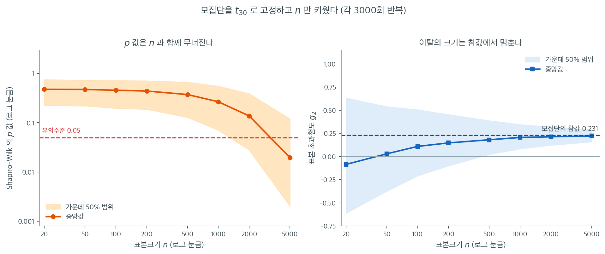

# 정규성 검정의 한계와 함정

형식적 정규성 검정은 값진 통찰을 주지만 한계가 있다. 실무에서 이 검정들은 표본크기, 검정력, 실제 자료의 분포 같은 요인에 영향을 받는다. 정규성 검정이 적절한지 판단하려면 이 함정들을 이해하는 것이 결정적이다.

---

## 1. 표본크기에 대한 민감성

정규성 검정은 표본크기에 매우 민감하다. 작은 표본에서는 정규성 이탈을 탐지할 검정력이 부족하여 **제2종 오류**(귀무가설이 거짓인데 기각하지 못함)로 이어질 수 있다. 반대로 아주 큰 표본에서는 사소한 이탈만으로도 귀무가설을 기각하게 되어, 실질적으로 의미 없는 차이에 반응하게 된다.

- **작은 표본**: 실제 정규성 이탈을 탐지하지 못할 수 있다.
- **큰 표본**: 실질적으로 유의하지 않은 사소한 이탈까지 탐지할 수 있다.

<div class="exbox" markdown>

**보기 1.** <span class="diff easy" title="쉬움"></span> 같은 $p$값, 다른 뜻. 표준정규에서 $n = 20$과 $n = 10{,}000$ 짜리 표본을 각각 뽑아 샤피로–윌크 검정을 걸면 두 $p$값이 $0.71$과 $0.75$로 거의 같게 나온다.

**(1)** 두 $p$값이 거의 같은 것이 "두 표본의 정규성 정도가 비슷하다"는 뜻인가. 귀무가설 아래 $p$값의 분포로 설명하고, 통계량 $W$와 그 임계값을 두 $n$에서 비교하시오.

**(2)** 이 보기만으로는 "큰 표본이 사소한 이탈도 기각한다"가 **드러나지 않는다.** 왜 드러나지 않는가. 드러내려면 무엇을 바꾸어야 하는지 말하고, $t_{30}$ 자료로 표본크기별 검정력을 재어 확인하시오.

</div>

??? success "풀이"

    ```python
    import numpy as np
    from scipy.stats import shapiro

    np.random.seed(0)

    # 두 자료 모두 참으로 정규다. 그런데 표본크기만 다르게 두면 검정의
    # 성질이 달라진다. 작은 표본에서는 웬만한 이탈도 잡아내지 못하고,
    # 큰 표본에서는 무시할 만한 이탈에도 기각한다.
    small_sample = np.random.normal(0, 1, 20)
    stat_small, p_value_small = shapiro(small_sample)
    print(f"Shapiro-Wilk Test (small sample): p-value={p_value_small}")

    # 표본이 커지면 검정력이 올라가는데, 그것이 늘 좋은 일은 아니다.
    large_sample = np.random.normal(0, 1, 10000)
    stat_large, p_value_large = shapiro(large_sample)
    print(f"Shapiro-Wilk Test (large sample): p-value={p_value_large}")
    ```

    출력:

    ```text
    Shapiro-Wilk Test (small sample): p-value=0.7136380887419513
    Shapiro-Wilk Test (large sample): p-value=0.7506816458200554
    ```

    **(1) 아니다. 두 $p$값이 비슷한 것에는 아무 뜻이 없다.** 이론이 먼저 답을 준다. 귀무가설이 참일 때 $p$값은 **표본크기와 무관하게** $\text{Uniform}(0,1)$을 따른다. 그러므로 중앙값은 $0.5$, 기각률은 명목수준 $\alpha = 0.05$이며, $n$을 20에서 10,000으로 키워도 이 둘은 꿈쩍하지 않는다. 두 표본은 모두 **정확히** $\mathcal{N}(0,1)$에서 나왔으니 $0.7136$과 $0.7507$은 그저 균등분포에서 뽑은 두 수다. 비슷하게 나온 것은 우연이고, 다르게 나와도 똑같이 의미가 없었다.

    반면 **통계량은 전혀 다르다.** $W = 0.968067$ 대 $W = 0.999844$이고, 표본의 모양 통계량도 $(g_1, g_2) = (+0.183,\, -0.624)$ 대 $(+0.027,\, -0.031)$로 자릿수가 다르다($g_1$, $g_2$는 보정하지 않은 판본, 곧 `scipy.stats.skew`·`kurtosis`의 기본값 `bias=True`·`fisher=True`가 주는 값이다). 작은 표본은 초과첨도가 $-0.62$나 되는데도 통과하고, 큰 표본은 $-0.03$밖에 안 되는데도 같은 $p$값을 받는다.

    임계값을 재어 보면 왜 그런지 분명해진다. 5% 임계값이 $n = 20$에서 $W < 0.9035$, $n = 10{,}000$에서 $W < 0.999656$이다. 부적합의 크기를 $1 - W$로 재면 허용폭이 $0.0965$에서 $0.000344$로 **280배 좁아진다.** 같은 $p = 0.7$이 작은 표본에서는 "10% 가까이 어긋나도 괜찮다", 큰 표본에서는 "0.03% 넘게 어긋나면 안 된다"를 뜻한다. **$p$값은 적합도의 척도가 아니다.**

    **(2) 두 표본이 모두 참으로 정규이기 때문에 드러나지 않는다.** 귀무가설이 참이면 큰 표본이 기각하는 일은 $\alpha$의 비율로만 일어나야 하고, 실제로 그렇다. 과잉 검정력을 보려면 자료가 정규에서 **조금이라도** 벗어나 있어야 한다. 그래서 초과첨도가 $6/(30-4) = 0.2308$인 $t_{30}$으로 바꾸어 검정력을 잰다.

    ```python
    import warnings

    import numpy as np
    from scipy import stats

    warnings.filterwarnings("ignore")   # n > 5000 에서 shapiro 가 내는 경고

    # (1) 보기의 두 표본을 다시 뽑아 p 값만이 아니라 통계량까지 함께 본다.
    np.random.seed(0)
    small = np.random.normal(0, 1, 20)
    large = np.random.normal(0, 1, 10000)
    for name, x in [("n=20   ", small), ("n=10000", large)]:
        W, p = stats.shapiro(x)
        print(f"{name}  W = {W:.6f}  p = {p:.4f}"
              f"  g1 = {stats.skew(x):+.4f}  g2 = {stats.kurtosis(x):+.4f}")


    def pvals(draw, n, R, seed):
        """같은 분포에서 n 개짜리 표본을 R 번 뽑아 샤피로 p 값을 모은다."""
        rng = np.random.default_rng(seed)
        return np.array([stats.shapiro(draw(rng, n)).pvalue for _ in range(R)])


    # 귀무가설이 참이면 p 값은 n 과 무관하게 균등분포이고 기각률은 알파와 같다.
    normal = lambda rng, n: rng.normal(0, 1, n)
    print("\n귀무(정규) 아래 기각률 — n 과 무관하게 0.05 여야 한다")
    for n, R, seed in [(20, 4000, 7), (200, 4000, 8), (1000, 2000, 9), (10000, 1500, 23)]:
        p = pvals(normal, n, R, seed)
        print(f"  n = {n:5d}  기각률 {np.mean(p < 0.05):.4f}"
              f"  (MC SE {np.sqrt(0.05 * 0.95 / R):.4f})  p 중앙값 {np.median(p):.3f}")

    # 5% 임계값. 같은 p 값이 n 에 따라 얼마나 다른 적합도를 뜻하는지 본다.
    print("\nW 의 5% 임계값")
    for n, R, seed in [(20, 20000, 120), (10000, 1500, 10100)]:
        rng = np.random.default_rng(seed)
        W = np.array([stats.shapiro(rng.normal(0, 1, n)).statistic for _ in range(R)])
        print(f"  n = {n:5d}  W 5% 분위수 {np.percentile(W, 5):.6f}"
              f"  -> 1-W 의 허용폭 {1 - np.percentile(W, 5):.6f}")

    # (2) 자료를 정규에서 살짝 떼어 놓으면 비로소 n 의 효과가 보인다.
    t30 = lambda rng, n: rng.standard_t(30, n)
    print(f"\nt_30 의 참 초과첨도 = 6/(30-4) = {6 / 26:.4f}  (n 과 무관하다)")
    print("t_30 자료에 대한 검정력")
    for n, R, seed in [(30, 3000, 11), (200, 3000, 12), (1000, 1500, 13), (5000, 400, 14)]:
        p = pvals(t30, n, R, seed)
        print(f"  n = {n:5d}  검정력 {np.mean(p < 0.05):.3f}  p 중앙값 {np.median(p):.4f}")
    ```

    출력:

    ```text
    n=20     W = 0.968067  p = 0.7136  g1 = +0.1826  g2 = -0.6244
    n=10000  W = 0.999844  p = 0.7507  g1 = +0.0274  g2 = -0.0312

    귀무(정규) 아래 기각률 — n 과 무관하게 0.05 여야 한다
      n =    20  기각률 0.0437  (MC SE 0.0034)  p 중앙값 0.500
      n =   200  기각률 0.0450  (MC SE 0.0034)  p 중앙값 0.507
      n =  1000  기각률 0.0525  (MC SE 0.0049)  p 중앙값 0.509
      n = 10000  기각률 0.0360  (MC SE 0.0056)  p 중앙값 0.552

    W 의 5% 임계값
      n =    20  W 5% 분위수 0.903472  -> 1-W 의 허용폭 0.096528
      n = 10000  W 5% 분위수 0.999656  -> 1-W 의 허용폭 0.000344

    t_30 의 참 초과첨도 = 6/(30-4) = 0.2308  (n 과 무관하다)
    t_30 자료에 대한 검정력
      n =    30  검정력 0.072  p 중앙값 0.4752
      n =   200  검정력 0.101  p 중앙값 0.4506
      n =  1000  검정력 0.219  p 중앙값 0.2564
      n =  5000  검정력 0.615  p 중앙값 0.0175
    ```

    **이론값이 재현된다.** 귀무 아래 기각률이 $n = 20, 200, 1000$에서 $0.0437$, $0.0450$, $0.0525$로 모두 명목 $0.05$에서 몬테카를로 표준오차 두 배 안에 있고, $p$값 중앙값도 $0.500$, $0.507$, $0.509$로 균등분포의 $0.5$와 맞는다. **표본크기는 귀무가설 아래에서 아무것도 바꾸지 않는다.**

    $t_{30}$으로 바꾸면 그림이 완전히 달라진다. 검정력이 $n = 30$의 $0.072$에서 $n = 5000$의 $0.615$로 올라간다. 그동안 **모집단의 이탈은 한 치도 변하지 않았다** — 초과첨도는 언제나 $0.2308$이다. $n = 30$에서는 기각률이 명목수준 $0.05$보다 겨우 높아 사실상 아무것도 탐지하지 못하고, $n = 5000$에서는 세 번에 두 번 기각한다. $t_{30}$과 정규를 실무에서 구별할 이유가 거의 없다는 사실을 생각하면, 뒤쪽의 기각은 **발견이 아니라 소음**이다.

    **어긋난 것 하나.** $n = 10{,}000$의 귀무 기각률만 $0.0360$으로 명목 $0.05$보다 2.5 표준오차 낮고, $p$값 중앙값도 $0.552$로 $0.5$에서 벗어난다. 씨앗을 바꾸어도 $0.033$, $0.043$으로 되풀이되므로 몬테카를로 오차가 아니다. `scipy.stats.shapiro`가 $N > 5000$에서 내는 "계산된 $p$값이 정확하지 않을 수 있다"는 경고가 바로 이것이고, 그 부정확의 방향은 **보수적**이다. 큰 표본에서 이 검정의 실제 크기는 명목보다 작다. 아래 경고 상자의 표에서 $n = 5000$의 $p$값을 읽을 때도 이 점을 염두에 두어야 한다.

!!! warning "이 보기만으로는 '큰 표본이 기각한다'가 드러나지 않는다"
    두 표본 모두 **정확히 정규분포**에서 생성했으므로 $n = 10{,}000$이어도 기각하지 않는 것이 옳다($p = 0.75$). 큰 표본의 과잉 검정력을 보이려면 자료가 정규에서 **조금이라도** 벗어나 있어야 한다. 예를 들어 $t_{30}$ 분포(초과첨도 0.23)에서 뽑으면

    | $n$ | 30 | 200 | 1000 | 5000 |
    |---|---|---|---|---|
    | Shapiro-Wilk $p$값 | 0.49 | 0.29 | 0.92 | **0.0013** |

    $n = 5000$에서 비로소 기각된다. 실용적으로는 $t_{30}$과 정규를 구별할 이유가 거의 없는데도 그렇다.

    또한 `scipy.stats.shapiro`는 $N > 5000$이면 "계산된 p값이 정확하지 않을 수 있다"는 경고를 낸다는 점에 유의하라.

### n 이 바꾸는 것과 바꾸지 않는 것

위 경고 상자의 표는 $t_{30}$ 표본 하나씩을 뽑아 본 결과라 운이 섞여 있다. 같은 실험을 표본크기마다 3000번씩 되풀이하면 그 밑에 깔린 규칙이 드러난다.



왼쪽 칸은 Shapiro-Wilk $p$값이다. 세로축이 로그 눈금임에 유의하라. 중앙값이 $n = 20$에서 $0.478$로 출발해 $n = 1000$에서 $0.267$, $n = 2000$에서 $0.138$, $n = 5000$에서 $0.0197$까지 내려간다. 그리고 여기서 멈추지 않는다. 자료가 $t_{30}$인 한 $n$을 계속 키우면 $p$값은 계속 0으로 간다. **$p$값은 모집단의 성질이 아니라 표본크기의 함수다.**

오른쪽 칸은 같은 표본들에서 잰 표본 초과첨도 $g_2$다. 중앙값은 $n = 20$에서 $-0.085$였다가 표본이 커지면서 올라와 $n = 1000$에서 $0.206$, $n = 5000$에서 $0.222$가 된다. 모집단의 참값 $6/(30-4) = 0.231$에 다가가 거기서 **멈춘다**. 가운데 50% 범위도 $n = 20$의 $[-0.61, +0.63]$에서 $n = 5000$의 $[0.16, 0.29]$로 좁아진다. 추정이 정확해질 뿐 값 자체는 움직이지 않는다.

두 칸의 대비가 이 쪽 전체의 요지다. 표본을 키우면 $p$값은 바뀌지만 **자료가 정규에서 얼마나 벗어났는지는 바뀌지 않는다.** $t_{30}$은 $n = 20$에서나 $n = 5000$에서나 똑같이 정규에서 초과첨도 $0.23$만큼 떨어져 있는 분포다. 그 $0.23$이 $t$ 검정을 망가뜨릴 만한 크기인지는 $n$과 무관하게 답할 수 있는 물음이고, 답은 "아니다"이다.

그러므로 보고서에 "Shapiro-Wilk $p = 0.0013$이므로 정규성이 기각되었다"라고만 적는 것은 독자에게 $n$을 알려준 것이나 다름없다. 함께 적어야 할 것은 $g_1$과 $g_2$, 그리고 Q-Q 그림이다. 그것들이 있어야 독자가 "그래서 문제가 되는가"를 스스로 판단할 수 있다.

---

## 2. 검정의 검정력

정규성 검정의 **검정력**은 자료가 정규분포를 따르지 않을 때 귀무가설을 올바르게 기각하는 능력이다. **Shapiro-Wilk 검정** 같은 일부 검정은 다른 것들보다 강력하다. 그러나 완벽한 검정은 없으며, 검정력은 표본크기와 정규성 이탈의 정도 양쪽에 의존한다.

자료가 조금 치우쳤거나 첨도가 어긋나 있어도, 특히 표본이 작으면 검정이 그 이탈을 탐지할 검정력을 갖지 못하는 경우가 있다.

<div class="exbox" markdown>

**보기 2.** <span class="diff easy" title="쉬움"></span> 치우침을 숫자로 재기. $\text{Gamma}(2, 2)$에서 $n = 1000$개를 뽑아 표본왜도와 표본초과첨도를 재고 샤피로–윌크 검정을 함께 걸면, 왜도 $1.3583$, 초과첨도 $2.4079$, $p = 7.09 \times 10^{-25}$가 나온다.

**(1)** $\text{Gamma}(k, \theta)$의 왜도와 초과첨도를 $k$로 나타내고 $k = 2$에서의 값을 구하시오. `scipy.stats.skew`와 `kurtosis`가 **어느 판본**을 돌려주는지 밝히고, 표본값을 이론값과 비교하시오.

**(2)** 표본값이 이론값에서 벗어난 폭이 우연으로 설명되는지 재려면 표집 표준편차가 필요하다. 교과서의 정규 가정 표준오차 $\sqrt{6/n}$, $\sqrt{24/n}$을 그대로 쓰면 무슨 일이 일어나는가. 실제 표집분포를 만들어 확인하시오.

</div>

??? success "풀이"

    ```python
    import numpy as np
    from scipy.stats import skew, kurtosis, shapiro

    np.random.seed(0)

    # 감마분포는 오른쪽으로 치우쳐 있다. n=1000 이면 검정력이 충분해
    # 이 정도 치우침도 확실하게 기각한다.
    skewed_data = np.random.gamma(2, 2, 1000)

    # 검정이 기각했을 때 "얼마나" 벗어났는지는 이 값들이 말해 준다.
    # 실무에서는 p-값보다 이쪽이 더 쓸모 있다.
    print(f"Skewness: {skew(skewed_data)}, Kurtosis: {kurtosis(skewed_data)}")

    # Shapiro-Wilk 검정
    stat, p_value = shapiro(skewed_data)
    print(f"Shapiro-Wilk Test: p-value={p_value}")
    ```

    출력:

    ```text
    Skewness: 1.358332294792333, Kurtosis: 2.4079180806130145
    Shapiro-Wilk Test: p-value=7.094914686692259e-25
    ```

    **(1) 해석적으로.** $X \sim \text{Gamma}(k, \theta)$의 중심적률은

    $$
    \mu_2 = k\theta^2, \qquad \mu_3 = 2k\theta^3, \qquad \mu_4 = 3k(k+2)\theta^4
    $$

    이다. 척도 $\theta$는 표준화하면 약분되므로

    $$
    \gamma_1 = \frac{\mu_3}{\mu_2^{3/2}} = \frac{2k\theta^3}{(k\theta^2)^{3/2}} = \frac{2}{\sqrt{k}},
    \qquad
    \gamma_2 = \frac{\mu_4}{\mu_2^2} - 3 = \frac{3k(k+2)}{k^2} - 3 = \frac{6}{k}
    $$

    를 얻는다. **모양만이 왜도와 첨도를 정하고 척도는 아무 몫도 하지 않는다.** $k = 2$에서 $\gamma_1 = 2/\sqrt{2} = \sqrt{2} = 1.4142$, $\gamma_2 = 3$이다.

    **판본을 밝혀야 한다.** `scipy.stats.skew`의 기본값은 `bias=True`이므로 보정하지 않은 $g_1$을, `kurtosis`의 기본값은 `bias=True`·`fisher=True`이므로 보정하지 않은 **초과**첨도 $g_2$를 준다. 곧 위 출력의 두 수는 $g_1 = 1.3583$, $g_2 = 2.4079$이다. 보정판은 $G_1 = 1.3604$, $G_2 = 2.4260$으로 $n = 1000$에서는 차이가 0.2% 안쪽이다. 그러나 pandas의 `.skew()`는 $G_1$을 돌려주므로, 작은 표본에서 두 도구의 값을 맞춰 보려면 **어느 판본인지 반드시 적어야 한다.**

    비교하면 왜도는 $1.3583$ 대 이론 $1.4142$로 $-0.056$, 초과첨도는 $2.4079$ 대 이론 $3$으로 $-0.592$ 벗어났다. 왜도는 4% 오차지만 첨도는 20% 오차다.

    **(2) 정규 가정의 표준오차를 쓰면 틀린 판정을 내린다.**

    ```python
    import warnings

    import numpy as np
    from scipy import stats

    warnings.filterwarnings("ignore")

    k, theta, n = 2, 2, 1000
    print(f"Gamma({k}, {theta}) 이론값:  왜도 {2 / np.sqrt(k):.4f}   초과첨도 {6 / k:.1f}")

    np.random.seed(0)
    x = np.random.gamma(k, theta, n)
    print(f"표본 왜도      g1 = {stats.skew(x):.4f}   G1 = {stats.skew(x, bias=False):.4f}")
    print(f"표본 초과첨도  g2 = {stats.kurtosis(x):.4f}   G2 = {stats.kurtosis(x, bias=False):.4f}")

    # 벗어난 폭이 우연인가. 정규 가정의 SE 를 적어 보고, 같은 감마분포에서
    # 표집분포를 직접 만들어 그 SE 를 쓸 수 있는지 본다.
    print(f"\n정규 가정 SE:  왜도 sqrt(6/n) = {np.sqrt(6 / n):.4f}"
          f"   초과첨도 sqrt(24/n) = {np.sqrt(24 / n):.4f}")

    rng = np.random.default_rng(31)
    R = 20000
    Y = rng.gamma(k, theta, size=(R, n))
    g1s, g2s = stats.skew(Y, axis=1), stats.kurtosis(Y, axis=1)
    print(f"Gamma(2,2) 실제 표집분포 (R = {R}):")
    print(f"  g1  평균 {g1s.mean():.4f}  SD {g1s.std():.4f}"
          f"  95% 범위 [{np.percentile(g1s, 2.5):.3f}, {np.percentile(g1s, 97.5):.3f}]")
    print(f"  g2  평균 {g2s.mean():.4f}  SD {g2s.std():.4f}"
          f"  95% 범위 [{np.percentile(g2s, 2.5):.3f}, {np.percentile(g2s, 97.5):.3f}]")
    print(f"  관측 g1 은 평균에서 {(stats.skew(x) - g1s.mean()) / g1s.std():+.2f} SD")
    print(f"  관측 g2 는 평균에서 {(stats.kurtosis(x) - g2s.mean()) / g2s.std():+.2f} SD")

    # 교과서의 왜도 표준오차 공식은 어느 판본의 것인가. 정규 자료에서 확인한다.
    se_G1 = lambda m: np.sqrt(6 * m * (m - 1) / ((m - 2) * (m + 1) * (m + 3)))
    print("\n왜도 표준오차 공식 sqrt(6n(n-1)/((n-2)(n+1)(n+3))) 은 누구의 것인가"
          "  (정규 자료, R = 60000)")
    for m in (20, 100, 1000):
        rng = np.random.default_rng(900 + m)
        Z = rng.normal(0, 1, size=(60000, m))
        print(f"  n = {m:5d}  공식 {se_G1(m):.5f}"
              f"   SD(G1) {stats.skew(Z, axis=1, bias=False).std():.5f}"
              f"   SD(g1) {stats.skew(Z, axis=1).std():.5f}")
    ```

    출력:

    ```text
    Gamma(2, 2) 이론값:  왜도 1.4142   초과첨도 3.0
    표본 왜도      g1 = 1.3583   G1 = 1.3604
    표본 초과첨도  g2 = 2.4079   G2 = 2.4260

    정규 가정 SE:  왜도 sqrt(6/n) = 0.0775   초과첨도 sqrt(24/n) = 0.1549
    Gamma(2,2) 실제 표집분포 (R = 20000):
      g1  평균 1.4010  SD 0.1706  95% 범위 [1.124, 1.784]
      g2  평균 2.8993  SD 1.2936  95% 범위 [1.289, 5.971]
      관측 g1 은 평균에서 -0.25 SD
      관측 g2 는 평균에서 -0.38 SD

    왜도 표준오차 공식 sqrt(6n(n-1)/((n-2)(n+1)(n+3))) 은 누구의 것인가  (정규 자료, R = 60000)
      n =    20  공식 0.51210   SD(G1) 0.51384   SD(g1) 0.47447
      n =   100  공식 0.24138   SD(G1) 0.24151   SD(g1) 0.23788
      n =  1000  공식 0.07734   SD(G1) 0.07785   SD(g1) 0.07774
    ```

    **정규 가정 SE 를 쓰면 두 벗어남이 모두 "유의"해진다.** $-0.056/0.0775 = -0.72$는 괜찮지만 $-0.592/0.1549 = -3.82$는 네 배 가까운 표준오차이니, 그 공식을 믿으면 "표본의 첨도가 감마분포의 이론값과 유의하게 다르다"는 터무니없는 결론에 이른다. 자료는 정확히 $\text{Gamma}(2,2)$에서 나왔는데도 그렇다.

    **틀린 것은 자료가 아니라 표준오차다.** $\sqrt{6/n}$과 $\sqrt{24/n}$은 **정규 자료에서만** 성립한다. 같은 감마분포에서 20,000번 다시 뽑아 실제 표집분포를 만들면 표준편차가 $g_1$에서 $0.1706$, $g_2$에서 $1.2936$으로 각각 $2.2$배와 $8.4$배 크다. 그 척도로 재면 관측값은 평균에서 $-0.25\,\mathrm{SD}$와 $-0.38\,\mathrm{SD}$에 지나지 않는다. **아무 이상도 없다.** $g_2$의 95% 범위가 $[1.29,\ 5.97]$로 네 단위를 넘게 벌어져 있다는 사실이 핵심이다. 치우친 자료에서 $n = 1000$이어도 초과첨도는 사실상 한 자리 수조차 믿을 수 없는 추정이다.

    표집분포는 **치우쳐 있고 아래로 편향되어** 있다. 모의 평균이 $g_1$에서 $1.4010$, $g_2$에서 $2.8993$으로 참값 $1.4142$, $3$보다 낮다. 유한표본에서 적률추정량이 모양을 과소평가하는 쪽으로 기울기 때문이고, 그래서 "관측값이 이론값보다 작게 나왔다"는 것 자체는 놀랄 일이 아니다.

    **공식의 주인도 확인해 둘 만하다.** 흔히 쓰는 왜도 표준오차 $\sqrt{6n(n-1)/\{(n-2)(n+1)(n+3)\}}$는 정규 자료에서 $G_1$의 표준편차다. $n = 20$에서 공식값 $0.51210$이 모의 $\mathrm{SD}(G_1) = 0.51384$와 0.3% 안에서 맞고, $\mathrm{SD}(g_1) = 0.47447$보다는 8% 크다. 곧 **이 공식을 `scipy` 의 기본 출력 $g_1$에 걸면 작은 표본에서 분모가 과대해져 검정이 보수적이 된다.** $n = 1000$에서는 두 판본이 $0.0777$ 대 $0.0778$로 구별되지 않지만, $n$이 작을 때는 판본을 맞춰야 한다.

    요약하면, 이 보기의 $p = 7 \times 10^{-25}$는 올바른 기각이다. 자료는 참으로 왜도 $1.41$, 초과첨도 $3$인 분포에서 나왔으니 $n = 1000$에서 기각되어야 마땅하다. 그러나 **기각 여부가 아니라 $g_1$, $g_2$를 보고하는 쪽이 실무에 쓸모 있고**, 그때 그 값에 붙일 오차는 정규 가정 공식이 아니라 자료에 맞는 것이어야 한다.

---

## 3. 치우친 분포 다루기

현실의 많은 자료는 정규분포를 따르지 않고 치우침을 보인다. 그런 경우 정규성 검정은 귀무가설을 기각하지만, $t$ 검정이나 분산분석 같은 여러 모수적 검정은 중간 정도의 정규성 이탈에 로버스트하므로 여전히 적용할 수 있다.

금융 자료, 생물학적 측정값, 소득 분포는 흔히 긴 꼬리나 치우침을 보여 정규성 가정을 엄밀히 따르지 않지만, 많은 모수적 기법을 합리적인 신뢰 아래 여전히 적용할 수 있다.

<div class="exbox" markdown>

**보기 3.** <span class="diff easy" title="쉬움"></span> 검정을 돌리기 전에 이미 아는 경우. 평균 5만의 지수분포에서 소득 자료 $n = 1000$개를 만들어 샤피로–윌크 검정을 걸면 $p = 4.86 \times 10^{-33}$이 나온다.

**(1)** 자료의 **단위**를 원에서 만원으로 바꾸면 $p$값이 어떻게 변하는가. 통계량 $W$의 꼴에서 답을 먼저 유도하고 코드로 확인하시오.

**(2)** $\text{Exponential}$의 왜도와 초과첨도는 얼마인가. 이 자료에서 검정의 결과가 **돌리기 전에 정해져 있다**는 것을 검정력으로 보이고, $n$이 얼마부터 그러한지 말하시오.

</div>

??? success "풀이"

    ```python
    import numpy as np
    from scipy.stats import shapiro

    np.random.seed(0)

    # 소득처럼 오른쪽으로 크게 치우친 자료는 정규성 검정이 언제나 기각한다.
    # 검정을 돌리기 전에 이미 알 수 있는 일이므로, 이럴 때는 검정이 아니라
    # 변환이나 비모수 방법으로 바로 넘어가는 편이 낫다.
    income_data = np.random.exponential(scale=50000, size=1000)

    # Shapiro-Wilk 검정
    stat, p_value = shapiro(income_data)
    print(f"Shapiro-Wilk Test on Skewed Data: p-value={p_value}")
    ```

    출력:

    ```text
    Shapiro-Wilk Test on Skewed Data: p-value=4.8578866080562626e-33
    ```

    **(1) 해석적으로. $p$값은 전혀 변하지 않는다.** 샤피로–윌크 통계량은

    $$
    W = \frac{\bigl(\sum_i a_i X_{(i)}\bigr)^2}{\sum_i (X_i - \bar{X})^2}
    $$

    이고, 계수 $a = (a_1, \ldots, a_n)$는 기대 정규순서통계량에서 정해지는 상수벡터다. 기대 정규순서통계량은 $0$을 중심으로 **반대칭**이므로 $a_{n+1-i} = -a_i$, 따라서

    $$
    \sum_i a_i = 0
    $$

    이다. 이제 $Y_i = cX_i + d$($c > 0$)로 바꾸면 순서가 보존되어 $Y_{(i)} = cX_{(i)} + d$이므로 분자는

    $$
    \Bigl(\sum_i a_i (cX_{(i)} + d)\Bigr)^2 = \Bigl(c\sum_i a_i X_{(i)} + d\underbrace{\sum_i a_i}_{=\,0}\Bigr)^2 = c^2 \Bigl(\sum_i a_i X_{(i)}\Bigr)^2
    $$

    가 되고, 분모도 $\sum (Y_i - \bar{Y})^2 = c^2 \sum (X_i - \bar{X})^2$이다. $c^2$이 약분되어

    $$
    W(cX + d) = W(X)
    $$

    를 얻는다. 곧 **$W$는 위치·척도 변환에 불변**이고, 귀무분포도 $\mu$, $\sigma$에 의존하지 않으므로 $p$값 역시 그대로다. 소득을 원으로 적든 만원으로 적든, 평균을 빼고 표준편차로 나누든 결과는 같은 수다. 척도 $50000$은 **장식일 뿐 아무 몫도 하지 않는다.**

    **(2)** $X \sim \text{Exponential}$의 표준화된 적률은 척도와 무관하게 $\gamma_1 = 2$, $\gamma_2 = 6$이다. 앞 보기에서 구한 $\text{Gamma}(k,\theta)$ 공식에 $k = 1$을 넣으면 바로 나온다. 이것은 **매우 큰** 이탈이다. 보기 2의 $\text{Gamma}(2,2)$가 $(1.41,\ 3)$이었고 $t_{30}$이 $(0,\ 0.23)$이었던 것과 견주어 보라.

    ```python
    import numpy as np
    from scipy import stats

    # 1) 자료의 단위는 아무 몫도 하지 않는다. W 가 양의 아핀변환에 불변이기 때문이다.
    np.random.seed(0)
    income = np.random.exponential(scale=50000, size=1000)
    for name, y in [("원 단위 (scale=50000)", income),
                    ("만원 단위 (/10000)", income / 10000),
                    ("표준화 (-mean)/sd", (income - income.mean()) / income.std())]:
        W, p = stats.shapiro(y)
        print(f"{name:24s}  W = {W:.10f}  p = {p:.6e}")

    x = np.arange(1.0, 11.0)
    print(f"\n자료에 3 을 곱하고 7 을 더해도 W 가 그대로인가: "
          f"{stats.shapiro(x).statistic:.10f} vs {stats.shapiro(3 * x + 7).statistic:.10f}")

    # 2) 치우침의 크기는 척도와 무관하게 정해져 있다.
    print("\nExponential 이론값: 왜도 2, 초과첨도 6")
    print(f"표본 g1 = {stats.skew(income):.4f}   g2 = {stats.kurtosis(income):.4f}")

    # 3) 그러므로 결과는 검정을 돌리기 전에 이미 정해져 있다. n 이 얼마부터 그런가.
    print("\nExponential 자료에 대한 샤피로 검정력 (alpha = 0.05, R = 20000)")
    R = 20000
    for n in (5, 10, 20, 30, 50, 100):
        rng = np.random.default_rng(500 + n)
        p = np.array([stats.shapiro(rng.exponential(1.0, n)).pvalue for _ in range(R)])
        print(f"  n = {n:4d}  검정력 {np.mean(p < 0.05):.4f}   놓친 횟수 {np.sum(p >= 0.05):5d}")
    ```

    출력:

    ```text
    원 단위 (scale=50000)        W = 0.8050169741  p = 4.857887e-33
    만원 단위 (/10000)            W = 0.8050169741  p = 4.857887e-33
    표준화 (-mean)/sd            W = 0.8050169741  p = 4.857887e-33

    자료에 3 을 곱하고 7 을 더해도 W 가 그대로인가: 0.9701646111 vs 0.9701646111

    Exponential 이론값: 왜도 2, 초과첨도 6
    표본 g1 = 2.0526   g2 = 6.4761

    Exponential 자료에 대한 샤피로 검정력 (alpha = 0.05, R = 20000)
      n =    5  검정력 0.1601   놓친 횟수 16798
      n =   10  검정력 0.4373   놓친 횟수 11254
      n =   20  검정력 0.8383   놓친 횟수  3235
      n =   30  검정력 0.9677   놓친 횟수   645
      n =   50  검정력 0.9995   놓친 횟수    10
      n =  100  검정력 1.0000   놓친 횟수     0
    ```

    **유도한 불변성이 소수점 열째 자리까지 확인된다.** 세 척도에서 $W = 0.8050169741$이 똑같고 $p$도 $4.857887 \times 10^{-33}$로 같다. 선형 자료에 $3$을 곱하고 $7$을 더한 경우도 $0.9701646111$로 일치한다. 표본 모양 통계량은 $g_1 = 2.0526$, $g_2 = 6.4761$로 이론값 $2$와 $6$에 가깝다.

    **검정력은 $n = 50$에서 이미 $0.9995$다.** 20,000번 가운데 놓친 것이 열 번뿐이고 $n = 100$에서는 한 번도 놓치지 않는다. 뒤집어 말하면 소득처럼 지수분포에 가까운 자료에서 $n \ge 50$이면 **검정의 결과는 자료를 보기 전에 이미 알려져 있다.** 알려진 답을 다시 확인하는 데 유의수준을 쓰는 것은 정보를 얻는 일이 아니다. 이럴 때 물어야 할 것은 "정규인가"가 아니라 "$\gamma_1 = 2$만큼 치우친 자료에 이 절차를 써도 되는가"이고, 그 답은 검정이 아니라 절차의 강건성이 정한다.

    한편 $n = 10$에서는 검정력이 $0.4373$에 지나지 않는다. **왜도가 $2$나 되는 극단적으로 치우친 자료조차 열 개 표본에서는 절반 넘게 놓친다.** 작은 표본에서 "정규성 검정을 통과했다"는 말이 얼마나 공허한지 보여 주는 수치다.

    자료가 치우쳐 있어도 많은 통계검정은 여전히 로버스트하고 믿을 만하다. 정규성 검정에만 기대면 불필요한 자료 변환이나 타당한 방법의 배제로 이어질 수 있다.

---

## 4. 실제 자료에서의 실용적 고려

실무에서 현실 자료가 완벽한 정규분포를 따르는 일은 거의 없다. 형식적 검정은 지나치게 엄격할 수 있으며, 정규성에서의 작은 이탈이 언제나 모수적 방법의 사용을 무효화하지는 않는다. **중심극한정리(CLT)** 같은 통계적 결과는 자료 자체가 정규가 아니어도 큰 표본에서 평균의 표집분포가 근사적으로 정규임을 보장하여 정규성에 대한 우려를 덜어 준다.

<div class="exbox" markdown>

**보기 4.** <span class="diff easy" title="쉬움"></span> 중심극한정리가 지켜 주는 것. 보기 2에서 본 $\text{Gamma}(2, 2)$는 왜도 $1.4142$, 초과첨도 $3$으로 결코 정규가 아니다. 그 분포에서 $n = 100$개를 뽑아 표본평균과 표준오차를 계산한다.

**(1)** $\text{Gamma}(2,2)$의 $\mu$와 $\sigma$를 구하고 표본평균의 표준오차 이론값을 적으시오. 코드의 `np.std`는 기본값이 `ddof=0`인데 이것이 어떤 차이를 만드는가.

**(2)** 자료의 왜도는 $1.4142$, 초과첨도는 $3$이다. **표본평균의 표집분포**의 왜도와 초과첨도를 $n$으로 나타내고 $n = 100$에서의 값을 구하시오. 그 값으로 "자료의 정규성이 기각되었는데 $t$ 검정을 써도 되는가"에 답하고, $t$ 구간의 포함률로 확인하시오.

</div>

??? success "풀이"

    ```python
    import numpy as np

    np.random.seed(0)

    # 자료 자체는 크게 치우쳐 있다.
    skewed_data = np.random.gamma(2, 2, 100)

    mean_sample = np.mean(skewed_data)
    std_error = np.std(skewed_data) / np.sqrt(len(skewed_data))

    # 그런데 t 검정이 정규성을 요구하는 대상은 자료가 아니라 표본평균의
    # 표집분포다. 중심극한정리 덕분에 n=100 이면 그쪽은 이미 정규에 가깝다.
    # 자료의 정규성 검정이 기각되었다고 t 검정을 못 쓰는 것이 아닌 까닭이다.
    print(f"Sample mean: {mean_sample}, Standard error: {std_error}")
    ```

    출력:

    ```text
    Sample mean: 4.097224928182177, Standard error: 0.2886128975105421
    ```

    **(1) 해석적으로.** $\text{Gamma}(k, \theta)$의 평균과 분산은 $\mu = k\theta$, $\sigma^2 = k\theta^2$이므로 $k = \theta = 2$에서

    $$
    \mu = 4, \qquad \sigma^2 = 8, \qquad \sigma = 2\sqrt{2} = 2.8284
    $$

    이고 표준오차의 이론값은

    $$
    \mathrm{SE}(\bar{X}) = \frac{\sigma}{\sqrt{n}} = \frac{2\sqrt{2}}{10} = 0.28284
    $$

    이다. 코드가 낸 $0.28861$은 이 값을 $S$로 추정한 것이고 2.0% 높다. 표본에서 잰 $S$가 참 $\sigma$보다 조금 컸을 뿐이다.

    `ddof=0`은 별개의 문제다. `np.std`의 기본값은 $\sqrt{\frac1n\sum(X_i-\bar X)^2}$로 **$\sigma^2$을 과소추정**하는 쪽이고, 표준오차에 써야 하는 것은 불편추정량 $S$(`ddof=1`)다. 차이는 $\sqrt{(n-1)/n}$ 배이므로 $n = 100$에서 $0.28861$ 대 $0.29006$으로 0.5%에 지나지 않는다. 그러나 $n = 5$라면 $\sqrt{4/5} = 0.894$로 11% 차이가 나므로 작은 표본에서는 반드시 `ddof=1`을 써야 한다.

    **(2) 해석적으로.** 독립합에 대해 누적률(cumulant)이 더해진다는 사실을 쓴다. $\kappa_r$을 $X_i$의 $r$차 누적률이라 하면 $\kappa_r(\sum_i X_i) = n\kappa_r$이고, $\bar X = \frac1n\sum X_i$에 척도 성질 $\kappa_r(cY) = c^r\kappa_r(Y)$를 적용하면

    $$
    \kappa_r(\bar X) = \frac{n\kappa_r}{n^r}
    $$

    이다. $\kappa_2(\bar X) = \sigma^2/n$이므로

    $$
    \gamma_1(\bar X) = \frac{\kappa_3(\bar X)}{\kappa_2(\bar X)^{3/2}} = \frac{\kappa_3/n^2}{(\sigma^2/n)^{3/2}} = \frac{\kappa_3}{\sigma^3\sqrt{n}} = \frac{\gamma_1}{\sqrt{n}},
    $$

    $$
    \gamma_2(\bar X) = \frac{\kappa_4(\bar X)}{\kappa_2(\bar X)^2} = \frac{\kappa_4/n^3}{\sigma^4/n^2} = \frac{\kappa_4}{n\,\sigma^4} = \frac{\gamma_2}{n}
    $$

    를 얻는다. **왜도는 $\sqrt{n}$으로, 초과첨도는 $n$으로 줄어든다.** 이것이 중심극한정리를 적률로 본 모습이다. $n = 100$에서

    $$
    \gamma_1(\bar X) = \frac{1.4142}{10} = 0.1414, \qquad \gamma_2(\bar X) = \frac{3}{100} = 0.0300
    $$

    이다. 자료는 왜도 $1.41$로 심하게 치우쳐 있지만 **표본평균은 왜도 $0.14$로 거의 대칭**이고 초과첨도는 $0.03$으로 사실상 0이다. 보기 1의 $t_{30}$이 초과첨도 $0.23$이었던 것을 떠올리면, 이 표집분포는 그보다도 정규에 가깝다.

    ```python
    import numpy as np
    from scipy import stats

    k, theta, n = 2, 2, 100
    mu, sigma = k * theta, np.sqrt(k) * theta
    g1_pop, g2_pop = 2 / np.sqrt(k), 6 / k
    print(f"Gamma({k},{theta}) 모집단:  mu = {mu}  sigma = {sigma:.4f}"
          f"  왜도 {g1_pop:.4f}  초과첨도 {g2_pop:.1f}")
    print(f"표본평균의 이론값:  SE = sigma/sqrt(n) = {sigma / np.sqrt(n):.4f}"
          f"  왜도 = {g1_pop / np.sqrt(n):.4f}  초과첨도 = {g2_pop / n:.4f}")

    np.random.seed(0)
    x = np.random.gamma(k, theta, n)
    print(f"\n보기의 표본:  평균 {x.mean():.4f}"
          f"  SE(ddof=0) {x.std() / np.sqrt(n):.4f}"
          f"  SE(ddof=1) {x.std(ddof=1) / np.sqrt(n):.4f}")

    # 표본평균의 표집분포를 직접 만들어 세 이론값을 확인한다.
    rng = np.random.default_rng(77)
    R = 200000
    xbar = rng.gamma(k, theta, size=(R, n)).mean(axis=1)
    print(f"\n표집분포 모의 (R = {R}):  SD {xbar.std():.4f}"
          f"  왜도 {stats.skew(xbar):.4f}  초과첨도 {stats.kurtosis(xbar):.4f}")

    # t 구간의 포함률. t 검정이 요구하는 것은 자료가 아니라 xbar 의 정규성이다.
    print("\nmu 에 대한 95% t 구간의 포함률 (명목 0.95, R = 40000)")
    R2 = 40000
    for m in (5, 10, 30, 100):
        rng = np.random.default_rng(1000 + m)
        Y = rng.gamma(k, theta, size=(R2, m))
        half = stats.t.ppf(0.975, m - 1) * Y.std(axis=1, ddof=1) / np.sqrt(m)
        cov = np.mean(np.abs(Y.mean(axis=1) - mu) <= half)
        print(f"  n = {m:4d}  포함률 {cov:.4f}  (MC SE {np.sqrt(cov * (1 - cov) / R2):.4f})"
              f"   xbar 의 이론 왜도 {g1_pop / np.sqrt(m):.3f}")
    ```

    출력:

    ```text
    Gamma(2,2) 모집단:  mu = 4  sigma = 2.8284  왜도 1.4142  초과첨도 3.0
    표본평균의 이론값:  SE = sigma/sqrt(n) = 0.2828  왜도 = 0.1414  초과첨도 = 0.0300

    보기의 표본:  평균 4.0972  SE(ddof=0) 0.2886  SE(ddof=1) 0.2901

    표집분포 모의 (R = 200000):  SD 0.2826  왜도 0.1354  초과첨도 0.0210

    mu 에 대한 95% t 구간의 포함률 (명목 0.95, R = 40000)
      n =    5  포함률 0.9136  (MC SE 0.0014)   xbar 의 이론 왜도 0.632
      n =   10  포함률 0.9234  (MC SE 0.0013)   xbar 의 이론 왜도 0.447
      n =   30  포함률 0.9386  (MC SE 0.0012)   xbar 의 이론 왜도 0.258
      n =  100  포함률 0.9472  (MC SE 0.0011)   xbar 의 이론 왜도 0.141
    ```

    **세 이론값이 모두 재현된다.** 표집분포의 표준편차가 모의 $0.2826$ 대 이론 $0.28284$로 맞고, 왜도가 $0.1354$ 대 $0.1414$, 초과첨도가 $0.0210$ 대 $0.0300$이다. 뒤의 두 값은 $R = 200{,}000$에서 각각 몬테카를로 표준오차 $\sqrt{6/R} = 0.0055$와 $\sqrt{24/R} = 0.011$를 가지므로 $-1.1$과 $-0.8$ 표준오차, 곧 일치한다.

    **그러므로 답은 "써도 된다"이다.** 자료의 정규성 검정이 $p = 10^{-25}$로 기각되는 것은 사실이고 그 기각은 옳다. 그러나 $t$ 검정이 정규성을 요구하는 대상은 자료가 아니라 $\bar X$이며, $n = 100$에서 $\bar X$는 왜도 $0.14$로 거의 정규다. 포함률이 $0.9472$로 명목 $0.95$에서 $0.3$퍼센트포인트밖에 떨어져 있지 않은 것이 그 결과다.

    **다만 지켜 주는 데에는 $n$이 든다.** 같은 분포에서 $n = 5$이면 포함률이 $0.9136$으로 명목보다 $3.6$퍼센트포인트 낮다. $\bar X$의 왜도가 $0.63$이나 되기 때문이다. $n$을 $10 \to 30 \to 100$으로 키우면 $0.9234 \to 0.9386 \to 0.9472$로 올라가는데, 이 증가가 $\bar X$의 왜도 $0.45 \to 0.26 \to 0.14$가 줄어드는 것과 나란히 간다. **"CLT 가 있으니 괜찮다"는 $n$을 말하지 않으면 공허한 문장이다.**

    엄밀히 말하면 $n = 100$의 $0.9472$도 명목값에서 몬테카를로 표준오차 2.5배만큼 낮다. 치우친 자료에서 $t$ 구간은 $n = 100$에서도 아주 조금 과소포함 쪽으로 기운다. 실무에서 무시할 만한 크기이지만, **중심극한정리가 주는 것은 수렴이고 등식이 아니라는 것**을 기억해 둘 만하다.

    CLT는 자료 자체가 정규가 아니어도 큰 표본에서 정규 기반 방법을 쓰는 것을 정당화한다. 따라서 정규성 검정에 엄격히 기대기 전에 맥락과 분석의 목적을 고려하는 것이 중요하다.

---

## 5. 결론

정규성 검정은 자료가 근사적으로 정규인지 평가하는 유용한 도구이지만 맹목적으로 적용해서는 안 된다. 표본크기, 검정력, 분석에서 정규성이 갖는 실질적 중요성이 결정적인 고려 사항이다. 특히 표본이 크거나 자료가 중간 정도로 치우친 경우에는 정규성이 엄밀하게 충족되지 않아도 모수적 방법이 여전히 로버스트하다.

---

## 연습문제

<div class="drillbox" markdown>

**연습문제 1.** <span class="diff med" title="중간"></span>
"모든 모형은 틀렸지만 어떤 것은 쓸모 있다"라는 말을 정규성 검정의 맥락에서 설명하라.

</div>

??? success "풀이"
    현실의 어떤 자료도 정확히 정규분포를 따르지 않는다. 정규성은 이상화된 수학적 모형이며, 자료가 충분하면 정규성 검정은 언제나 기각한다. 관련 있는 질문은 "자료가 정확히 정규인가?"(답: 결코 아니다)가 아니라 "정규 기반 방법이 믿을 만한 결과를 줄 만큼 자료가 정규에 충분히 가까운가?"이다.

    이 관점은 정규성 검정을 이분법적 판정(정규 대 비정규)에서 근사 품질에 대한 실용적 평가로 다시 틀 짓는다. $n = 50{,}000$에서 형식적 검정이 기각했더라도 Q-Q 그림이 거의 선형이라면 정규론 방법을 쓰지 못할 이유가 없다. 모형은 "틀렸지만" 당면한 분석에는 여전히 "쓸모 있을" 수 있다.

<div class="drillbox" markdown>

**연습문제 2.** <span class="diff med" title="중간"></span>
시각적 점검 없이 형식적 정규성 검정에만 의존할 때의 함정을 세 가지 들어라.

</div>

??? success "풀이"

    1. **과잉 검정력:** 큰 표본은 사소한 이탈에도 정규성을 기각하여, 정규 기반 방법으로 충분한데도 불필요하게 복잡한 대안을 쓰게 만든다.
    2. **부족한 검정력:** 작은 표본은 심하게 비정규인 자료에도 기각하지 못해 잘못된 안심을 준다.
    3. **이탈 유형이 감춰짐:** p값은 *어떤 종류의* 비정규성인지(치우침? 이상점? 이봉성?) 아무것도 말해 주지 않는다. Q-Q 그림이나 히스토그램 없이는 적절한 대책을 고를 수 없다.

<div class="drillbox" markdown>

**연습문제 3.** <span class="diff med" title="중간"></span>
한 연구자가 회귀모형 잔차의 정규성을 검정하여 $p = 0.48$을 얻고 "잔차가 정규분포를 따른다"라고 썼다. 이 서술을 비판하라.

</div>

??? success "풀이"
    이 서술은 논리적 오류를 범한다. $H_0$을 기각하지 못한 것이 $H_0$이 참임을 증명하지 않는다. 올바른 서술은 "잔차의 정규성에 반하는 유의한 증거가 없다($p = 0.48$)"이다.

    $n$이 중간 정도이면 정규가 아닌 많은 분포도 $p > 0.05$를 낸다. 검정이 참된 이탈을 탐지할 검정력이 부족했을 뿐일 수 있다. 게다가 p값은 표본크기에 의존한다. 같은 정도의 비정규성이 $n = 30$에서는 $p = 0.48$을, $n = 3000$에서는 $p = 0.001$을 낼 수 있다.

<div class="drillbox" markdown>

**연습문제 4.** <span class="diff med" title="중간"></span>
서로 다른 회귀모형 20개의 잔차에 대해 동시에 정규성을 검정할 때의 다중검정 문제를 논하라.

</div>

??? success "풀이"
    검정마다 $\alpha = 0.05$로 모형 20개를 검정하면 집단별 오류율이 $1 - 0.95^{20} \approx 0.64$이다. 20개 모형의 잔차가 모두 진짜 정규여도 적어도 하나를 잘못 기각할 확률이 64%이다.

    연구자가 정규성을 기각한 모형에만 "보정"(변환, 비모수 방법)을 적용한다면 특히 문제가 된다. 결정이 자료에 의존하게 되어 오류율이 더욱 부풀려진다.

    해법: (1) Bonferroni 보정을 적용한다($\alpha/20 = 0.0025$), (2) 이분법적 검정 결과보다 Q-Q 그림의 시각적 평가에 집중한다, (3) 개별 정규성 검정 결과와 무관하게 모든 모형에 같은 분석 방식(예: 로버스트 표준오차)을 쓴다.

---

## 정리하며

정규성 검정의 **근본적 한계**를 정리한다.

- **표본크기가 결과를 지배한다.** 작으면 큰 이탈도 못 잡고(제2종 오류), 크면 무의미한 이탈도 기각한다. **같은 자료의 절반만 써도 결론이 달라질 수 있다.**
- **$H_0$ 의 방향이 불편하다.** "정규다"가 귀무가설이므로 **기각하지 못한 것이 정규성의 증거가 아니다.** 우리가 원하는 결론을 증명할 수 없는 구조다.
- **정확한 정규성은 어차피 성립하지 않는다.** 실제 자료는 유한하고 이산이며 유계다. **$n$ 이 충분히 크면 모든 정규성 검정은 결국 기각한다.**
- **옳은 물음은 다르다.** "정규인가"가 아니라 **"이 절차가 이 정도 이탈을 견디는가"** 이며, 그 답은 검정이 아니라 절차의 강건성이 정한다.
- **실무 지침.** 그림으로 이탈의 모양과 크기를 보고, 절차의 강건성을 고려해 판단하며, 의심스러우면 비모수나 부트스트랩으로 옮긴다.

다음 절 **Shapiro 검정력 모의실험**에서 표본크기 의존성을 수치로 확인한다.
