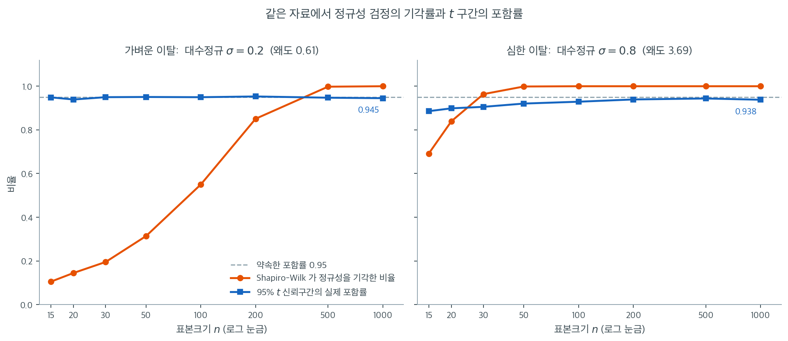

# 민감도와 실질적 유의성

## 1. 구분

정규성 검정이 귀무가설을 기각해도 분석은 완벽하게 타당할 수 있다. 핵심은 **비정규성의 통계적 유의성**과 **비정규성의 실질적 유의성**이 서로 다른 것이라는 점이다. 통계적으로 유의한 이탈은 자료가 정규분포에서 탐지 가능하게 벗어났다는 뜻이다. 실질적으로 유의한 이탈은 그 벗어남이 $t$ 검정, 분산분석, 신뢰구간 같은 후속 추론 절차의 타당성에 의미 있게 영향을 줄 만큼 크다는 뜻이다.

이 구분은 가설검정에서 통계적 유의성과 실질적 유의성을 구분하는 더 넓은 논의를 그대로 반영하지만, 정규성 확인 자체가 예비 단계라는 점에서 정규성 검정의 맥락에서는 특별한 무게를 갖는다.

---

## 2. 모수적 절차의 로버스트성

어떤 통계 절차가 가정이 위배되어도 성능(제1종 오류율, 포함확률, 검정력)이 명목값에 가깝게 유지되면 그 절차가 그 가정 위배에 **로버스트**하다고 한다. 절차마다 비정규성에 대한 로버스트성의 정도가 크게 다르다.

### 평균에 대한 검정

일표본 $t$ 검정은 비정규성에 놀랄 만큼 로버스트하며, 특히 대칭분포에서 그렇다. 모의실험 연구에 따르면 $n = 15$처럼 작은 표본에서도 바탕 분포가 중간 정도의 꼬리를 갖는 대칭분포라면 $t$ 검정의 실제 제1종 오류율이 $\alpha = 0.05$에 가깝게 유지된다. $\bar{X}$의 표집분포가 중심극한정리를 통해 정규로 수렴하고 $t$ 통계량이 이 로버스트성을 물려받기 때문이다.

치우친 분포에서는 $t$ 검정이 덜 로버스트하다. 모집단이 강하게 치우쳐 있으면 작은 $n$에서 실제 제1종 오류율이 $\alpha$를 넘을 수 있다. 다만 이 경우에도 왜곡이 대체로 크지 않고(예: 명목 $\alpha$가 0.05일 때 실제 0.07) $n$이 커지면 줄어든다.

### 분산에 대한 검정

분산에 관한 검정은 비정규성에 훨씬 민감하다. 단일 분산의 카이제곱 검정과 두 분산을 비교하는 $F$ 검정은 모두 다음 가정에 기댄다.

$$
\frac{(n-1)S^2}{\sigma^2} \sim \chi^2_{n-1}
$$

이 분포 결과는 정규성 아래에서만 정확히 성립한다. 모집단의 꼬리가 두꺼우면 $(n-1)S^2/\sigma^2$의 실제 분포가 카이제곱보다 두꺼운 꼬리를 갖게 되어 제1종 오류율이 크게 부풀려진다. $t$ 검정에는 거의 영향을 주지 않는 비정규성이 $F$ 검정은 심각하게 왜곡할 수 있다.

??? warning "분산의 F 검정은 로버스트하지 않다"
    두 모분산을 비교하는 $F$ 검정은 고전적 절차 가운데 가장 로버스트하지 않은 축에 든다. 가벼운 비정규성만으로도 실제 제1종 오류율이 명목 $\alpha$의 두세 배가 될 수 있다. 그래서 실무에서는 Levene 검정이나 Brown-Forsythe 검정이 선호된다.

### 분산분석

일원배치 분산분석은 집단 크기가 같고 분포의 모양이 비슷하면 비정규성에 중간 정도로 로버스트하다. $F$ 통계량은 평균제곱의 비에 기초하며, $n$이 너무 작지 않으면 중심극한정리가 분자와 분모를 안정시킨다. 집단 크기가 다르고 비정규성과 이분산이 겹치는 상황이 가장 문제가 된다.

---

## 3. 이탈은 언제 문제가 되는가

비정규성의 실질적 영향은 세 요인의 조합에 달려 있다.

1. **이탈의 유형.** 평균 기반 검정에서는 대칭인 두꺼운 꼬리보다 치우침이 더 문제가 된다. 치우침이 표집분포의 중심을 이동시키기 때문이다. 두꺼운 꼬리는 주로 분산 기반 절차에 영향을 준다.

2. **표본크기.** $n$이 커질수록 중심극한정리의 보호가 커지지만, 수렴 속도는 이탈의 심각도에 달려 있다. $t$ 검정에서는 대칭인 두꺼운 꼬리 분포라면 $n \geq 30$으로 충분한 경우가 많지만, 치우친 분포는 $n \geq 100$이 필요할 수 있다.

3. **쓰는 절차.** 민감도의 위계는 낮은 쪽에서 높은 쪽으로 대략 다음과 같다.

    - 평균에 대한 검정과 신뢰구간(가장 로버스트)
    - 분산분석의 $F$ 검정(균형 설계에서 중간 정도로 로버스트)
    - 회귀계수 검정(중간 정도로 로버스트)
    - 분산에 대한 검정(가장 로버스트하지 않음)

---

## 4. 판단의 틀

다음 틀이 탐지된 정규성 이탈이 실질적으로 의미 있는지 판단하는 데 도움이 된다.

**1단계: 추론의 목표를 확인한다.** 평균을 검정하는가, 평균을 비교하는가, 분산을 검정하는가, 회귀를 수행하는가? 이 답이 절차가 비정규성에 얼마나 민감한지를 결정한다.

**2단계: 표본크기를 평가한다.** $n$이 크면 검정 결과와 무관하게 평균 기반 추론은 중심극한정리의 보호를 받는다.

**3단계: 이탈의 성격을 파악한다.** 치우침인가, 두꺼운 꼬리인가, 이상점인가, 다봉성인가? 각각 함의가 다르다.

**4단계: 크기를 평가한다.** 초과첨도가 1 미만이고 왜도의 절댓값이 0.5 미만이면 대체로 가벼운 것으로 본다. 초과첨도가 3을 넘거나 왜도의 절댓값이 1을 넘으면 더 살펴볼 필요가 있다.

---

## 5. 기각률과 포함률을 나란히 놓아 보면

이 틀이 말이 아니라 사실임을 확인하는 가장 직접적인 방법이 있다. 같은 자료에서 **정규성 검정이 기각하는 비율**과 **그 자료로 만든 95% $t$ 신뢰구간이 참값을 덮는 비율**을 동시에 재는 것이다. 앞쪽이 통계적 유의성, 뒤쪽이 실질적 유의성이다.



왼쪽은 대수정규 $\sigma = 0.2$, 왜도 $0.61$인 가벼운 이탈이다. 주황 곡선(기각률)은 $n = 100$에서 $0.55$, $n = 200$에서 $0.85$, $n = 500$부터는 사실상 $1.0$이다. 그런데 파란 곡선(포함률)은 어떤가. $n = 15$에서 $0.949$, $n = 200$에서 $0.953$, $n = 1000$에서 $0.945$로 내내 $0.95$ 위아래에 붙어 있다. **$n = 500$ 이후로는 정규성 검정이 100% 기각하는데 신뢰구간은 약속한 성능을 정확히 내고 있다.** 여기서 "정규성이 기각되었으니 $t$ 구간을 버리고 붓스트랩으로 가자"고 결정한다면 아무 문제도 없는 절차를 버리는 것이다. 이것이 실질적으로 무의미한 통계적 유의성이다.

오른쪽은 대수정규 $\sigma = 0.8$, 왜도 $3.69$인 심한 이탈이다. 이번에는 기각률이 $n = 15$에서 벌써 $0.69$이고 $n = 30$에서 $0.96$이다. 포함률도 함께 망가진다. $n = 15$에서 $0.886$, $n = 30$에서 $0.906$으로 약속한 $0.95$에서 뚜렷하게 모자란다. 95%라고 말하면서 실제로는 89%만 덮는 구간을 쓰고 있는 것이다. $n = 200$쯤 되어야 $0.940$까지 회복된다. 여기서는 검정의 기각이 진짜 경고다.

두 칸의 차이를 만든 것은 검정이 아니라 **이탈의 크기**다. 두 경우 모두 $n$이 충분히 크면 정규성 검정은 100% 기각한다. 그 기각만 보고는 왼쪽인지 오른쪽인지 구별할 수 없다. 구별해 주는 것은 왜도 $0.61$과 $3.69$라는 효과 크기다. 앞의 4단계 틀이 $p$값이 아니라 $g_1$과 $g_2$의 크기를 묻는 이유가 여기에 있다. **검정은 "다르다"까지만 말하고, "얼마나 다른가"는 효과 크기가 말한다. 결정을 내리는 데 필요한 것은 후자다.**

<div class="exbox" markdown>

**보기 1.** <span class="diff easy" title="쉬움"></span> 평균 검정과 분산 검정의 견딤새. 꼬리가 두꺼운 $t_5$ 자료 $n = 30$개에 평균에 대한 $t$ 검정과 분산에 대한 카이제곱 검정을 **둘 다 귀무가설이 참인 상태로** 걸어, 제1종 오류율을 반복 10,000회로 잰다. $t$ 검정은 $0.0487$, 카이제곱 검정은 $0.1713$이 나온다.

**(1)** 카이제곱 검정이 **가정하는** $\operatorname{Var}(S^2)$와 $t_5$ 자료에서의 **실제** $\operatorname{Var}(S^2)$를 각각 닫힌 꼴로 구해 비를 내시오. ($t_\nu$에서 $\sigma^2 = \frac{\nu}{\nu-2}$, $\mu_4 = \frac{3\nu^2}{(\nu-2)(\nu-4)}$를 쓰라.)

**(2)** (1)의 비로 기각률을 정규근사해 예측하면 얼마인가. 모의값 $0.1713$과 맞는가. **맞지 않으면 왜 맞지 않는지** 밝히시오.

</div>

??? success "풀이"

    ```python
    import numpy as np
    from scipy import stats

    # ===================================================================
    # 정규성이 깨졌을 때 두 검정이 얼마나 다르게 버티는가
    #
    # 같은 자료에 평균에 대한 t 검정과 분산에 대한 카이제곱 검정을 함께
    # 돌린다. 둘 다 귀무가설이 참인데, t 검정의 오류율은 0.05 근처에
    # 머물고 분산 검정의 오류율은 크게 벗어난다.
    #
    # 평균은 중심극한정리의 보호를 받지만 분산은 그렇지 않기 때문이다.
    # "정규성이 필요하다"는 말의 무게가 검정마다 다르다는 뜻이다.
    # ===================================================================

    np.random.seed(42)
    n = 30
    alpha = 0.05
    n_simulations = 10_000
    df_true = 5  # 꼬리가 두꺼운 t 분포

    rejections_t = 0
    rejections_chi2 = 0

    for _ in range(n_simulations):
        sample = stats.t.rvs(df=df_true, size=n)

        # 평균이 0 인지 검정한다. t 분포의 평균은 참으로 0 이므로 귀무가설이 참이다.
        _, p_t = stats.ttest_1samp(sample, popmean=0)
        if p_t < alpha:
            rejections_t += 1

        # 분산이 df/(df-2) 인지 검정한다. 이것이 t 분포의 참 분산이므로
        # 이쪽도 귀무가설이 참이다. 조건을 똑같이 맞춘 것이다.
        true_var = df_true / (df_true - 2)
        chi2_stat = (n - 1) * np.var(sample, ddof=1) / true_var
        p_chi2 = 2 * min(
            stats.chi2.cdf(chi2_stat, df=n - 1),
            1 - stats.chi2.cdf(chi2_stat, df=n - 1)
        )
        if p_chi2 < alpha:
            rejections_chi2 += 1

    if __name__ == "__main__":
        print(f"Data: t-distribution with df = {df_true}, n = {n}")
        print(f"Nominal alpha: {alpha}")
        print(f"Actual Type I error (t-test):          "
              f"{rejections_t / n_simulations:.4f}")
        print(f"Actual Type I error (chi-squared test): "
              f"{rejections_chi2 / n_simulations:.4f}")
    ```

    출력:

    ```text
    Data: t-distribution with df = 5, n = 30
    Nominal alpha: 0.05
    Actual Type I error (t-test):          0.0487
    Actual Type I error (chi-squared test): 0.1713
    ```

    $t$ 검정의 $0.0487$은 명목 $0.05$에서 몬테카를로 표준오차 $\sqrt{0.05 \times 0.95/10000} = 0.00218$의 $0.6$배밖에 떨어져 있지 않다. **일치한다.** 반면 카이제곱 검정의 $0.1713$은 명목값의 $3.4$배이고 표준오차 60배 바깥이다.

    **(1) 해석적으로.** 카이제곱 검정은 $(n-1)S^2/\sigma^2 \sim \chi^2_{n-1}$을 가정하므로 $\operatorname{Var}\bigl((n-1)S^2/\sigma^2\bigr) = 2(n-1)$, 곧

    $$
    \operatorname{Var}(S^2) \;\overset{\text{가정}}{=}\; \frac{2\sigma^4}{n-1}
    $$

    을 믿는다. 그런데 독립표본에서 참값은 4차 적률이 결정한다.

    $$
    \operatorname{Var}(S^2) = \frac{1}{n}\Bigl(\mu_4 - \frac{n-3}{n-1}\sigma^4\Bigr)
    = \frac{\mu_4}{n} - \frac{(n-3)\sigma^4}{n(n-1)}
    $$

    정규분포라면 $\mu_4 = 3\sigma^4$이므로 이 식이 $\frac{\sigma^4}{n}\cdot\frac{3(n-1)-(n-3)}{n-1} = \frac{2\sigma^4}{n-1}$로 줄어들어 가정과 **정확히** 맞는다. 곧 카이제곱의 눈금은 $\mu_4 = 3\sigma^4$이라는 정규성의 한 귀결에만 기대고 있다.

    $t_5$에서는 $\sigma^2 = \frac{5}{3}$, $\mu_4 = \frac{3 \cdot 25}{3 \cdot 1} = 25$이므로 $g_2 = \frac{25}{(5/3)^2} - 3 = 6$이고

    $$
    \operatorname{Var}(S^2) = \frac{25}{30} - \frac{27 \cdot (25/9)}{30 \cdot 29} = 0.747126,
    \qquad
    \frac{2\sigma^4}{n-1} = \frac{2 \cdot 25/9}{29} = 0.191571
    $$

    이다. 비는 $3.900$배, 표준편차로는 $\sqrt{3.900} = 1.975$배다. 일반적으로 $n$이 크면 비가 $\frac{g_2 + 2}{2}$로 가는데 $g_2 = 6$에서 정확히 $4$이고, $n = 30$에서 $3.900$인 것은 그 극한에 거의 닿은 값이다. **카이제곱은 $S^2$의 흔들림을 실제의 절반으로 어림한다.** 그러니 그 눈금으로 재면 기각이 잦아지는 것이 당연하다.

    **(2)** $S^2$가 근사적으로 정규라고 보고 예측해 보자. 기각역이 $\pm z_{0.975}$ 곱하기 *가정된* 표준편차인데 실제 표준편차가 $1.975$배이므로

    $$
    2\,\Phi\!\left(-z_{0.975}\sqrt{\frac{0.191571}{0.747126}}\right) = 2\,\Phi(-1.96 \times 0.5064) = 0.3210
    $$

    이다. **이 예측은 모의값과 맞지 않는다.** $0.3210$ 대 $0.1713$으로 거의 두 배 과대예측이다.

    ```python
    import numpy as np
    from scipy import stats

    nu, n, alpha = 5, 30, 0.05
    sigma2 = nu / (nu - 2)                        # t_5 의 참 분산
    mu4 = 3 * nu ** 2 / ((nu - 2) * (nu - 4))     # 4차 적률 (nu > 4 에서만 유한)
    g2 = mu4 / sigma2 ** 2 - 3
    print(f"t_{nu}:  sigma^2 = {sigma2:.4f}   mu4 = {mu4:.4f}   초과첨도 = {g2:.1f}")

    # S^2 의 분산. 카이제곱이 가정하는 값과 실제 값을 나란히 적는다.
    var_chi2 = 2 * sigma2 ** 2 / (n - 1)
    var_true = mu4 / n - sigma2 ** 2 * (n - 3) / (n * (n - 1))
    print("\nVar(S^2):")
    print(f"  카이제곱이 가정하는 값  2 sigma^4/(n-1)   = {var_chi2:.6f}")
    print(f"  실제값  mu4/n - sigma^4 (n-3)/(n(n-1))    = {var_true:.6f}")
    print(f"  근사식  sigma^4 (g2 + 2)/n                = "
          f"{sigma2 ** 2 * (g2 + 2) / n:.6f}")
    print(f"  비  {var_true / var_chi2:.3f} 배   (표준편차로는 "
          f"{np.sqrt(var_true / var_chi2):.3f} 배)")

    # 그 비로 기각률을 정규근사해 보고, 모의값과 맞는지 본다.
    pred = 2 * stats.norm.cdf(-stats.norm.ppf(1 - alpha / 2)
                              * np.sqrt(var_chi2 / var_true))
    print(f"\n정규근사 예측 기각률 = {pred:.4f}")

    rng = np.random.default_rng(55)
    R = 400000
    S2 = rng.standard_t(nu, size=(R, n)).var(axis=1, ddof=1)
    lo = stats.chi2.ppf(alpha / 2, n - 1) * sigma2 / (n - 1)
    hi = stats.chi2.ppf(1 - alpha / 2, n - 1) * sigma2 / (n - 1)
    print(f"카이제곱 기각역: S^2 < {lo:.4f} 또는 S^2 > {hi:.4f}")
    print(f"  모의 (R = {R}):  아래쪽 {np.mean(S2 < lo):.4f}"
          f"   위쪽 {np.mean(S2 > hi):.4f}   합 {np.mean((S2 < lo) | (S2 > hi)):.4f}")
    print(f"  정규 자료라면 각각 {alpha / 2}, {alpha / 2}, 합 {alpha}")

    # 예측이 어긋난 까닭: S^2 의 분포가 정규와 거리가 멀다.
    # t_5 는 6차 적률이 없으므로 S^2 의 왜도가 유한하지 않고, 모의 왜도는
    # 씨앗마다 들쭉날쭉하다. Var(S^2) 의 모의 추정값도 함께 흔들린다.
    print("\n씨앗을 바꾸어 본다 (각 R = 400000)")
    for seed in (55, 56, 57, 58, 59):
        rng = np.random.default_rng(seed)
        s2 = rng.standard_t(nu, size=(R, n)).var(axis=1, ddof=1)
        print(f"  seed {seed}:  E[S^2] {s2.mean():.4f}"
              f"   모의 Var(S^2) {s2.var():.4f}"
              f"   모의 왜도 {stats.skew(s2):5.1f}   최대 S^2 {s2.max():4.0f}")
    print(f"  이론:      E[S^2] {sigma2:.4f}   Var(S^2) {var_true:.4f}   왜도 유한하지 않다")
    ```

    출력:

    ```text
    t_5:  sigma^2 = 1.6667   mu4 = 25.0000   초과첨도 = 6.0

    Var(S^2):
      카이제곱이 가정하는 값  2 sigma^4/(n-1)   = 0.191571
      실제값  mu4/n - sigma^4 (n-3)/(n(n-1))    = 0.747126
      근사식  sigma^4 (g2 + 2)/n                = 0.740741
      비  3.900 배   (표준편차로는 1.975 배)

    정규근사 예측 기각률 = 0.3210
    카이제곱 기각역: S^2 < 0.9222 또는 S^2 > 2.6277
      모의 (R = 400000):  아래쪽 0.0907   위쪽 0.0825   합 0.1732
      정규 자료라면 각각 0.025, 0.025, 합 0.05

    씨앗을 바꾸어 본다 (각 R = 400000)
      seed 55:  E[S^2] 1.6647   모의 Var(S^2) 0.7191   모의 왜도  17.7   최대 S^2  145
      seed 56:  E[S^2] 1.6641   모의 Var(S^2) 0.6853   모의 왜도   9.5   최대 S^2   80
      seed 57:  E[S^2] 1.6671   모의 Var(S^2) 0.7156   모의 왜도  11.8   최대 S^2   92
      seed 58:  E[S^2] 1.6689   모의 Var(S^2) 0.7878   모의 왜도  24.1   최대 S^2  160
      seed 59:  E[S^2] 1.6667   모의 Var(S^2) 0.6765   모의 왜도   6.9   최대 S^2   55
      이론:      E[S^2] 1.6667   Var(S^2) 0.7471   왜도 유한하지 않다
    ```

    **(1)의 유도는 맞는다.** 분산의 비 $3.900$과 근사식 $\sigma^4(g_2+2)/n = 0.7407$이 정확식 $0.7471$과 1% 안에서 일치하고, $E[S^2]$의 모의값이 다섯 씨앗에서 $1.6641$–$1.6689$로 이론값 $5/3 = 1.6667$을 감싼다.

    **어긋난 것은 (2)의 정규근사다.** 모의 기각률은 $0.1732$이고($R = 400{,}000$이므로 표준오차 $0.0006$), 보기의 $0.1713$과도 맞는다. 예측 $0.3210$이 틀린 까닭은 **$S^2$의 분포가 정규와 전혀 다르기 때문**이다. 표에서 보듯 $S^2$의 모의 왜도가 씨앗에 따라 $6.9$에서 $24.1$까지 요동하고, 최댓값이 $55$에서 $160$까지 간다. 참값 $1.667$ 주위에 모여 있어야 할 양이 그런 값을 내는 것은 분포가 극단적으로 오른쪽으로 끌려 있다는 뜻이다.

    이것은 모의실험의 흠이 아니라 $t_5$의 성질이다. $S^2$의 왜도는 모집단의 6차 적률 $\mu_6$에 달려 있는데, $t_\nu$는 $k < \nu$인 적률만 가지므로 $\nu = 5$에서 $\mu_6$이 **존재하지 않는다.** 그래서 표본왜도가 수렴할 대상이 없고 씨앗마다 다른 값이 나온다. 같은 이유로 $\operatorname{Var}(S^2)$의 모의 추정값도 $0.6765$–$0.7878$로 흔들린다($S^2$의 표본분산이 유한한 분산을 가지려면 $\mu_8$이 필요하다). **닫힌 꼴 $0.747126$이 정확하고, 모의 추정은 모의만큼만 정확하다.**

    분포가 오른쪽으로 끌려 있으면 정규근사의 두쪽 계산이 성립하지 않는다. 실제 기각은 아래쪽 $0.0907$, 위쪽 $0.0825$로 **양쪽 모두 명목 $0.025$의 세 배 넘게** 부풀어 있지만, 합이 정규근사가 말하는 $0.32$까지 가지는 않는다. 한쪽으로 긴 꼬리가 확률질량을 아주 먼 곳에 몰아 두기 때문에, 임계값 바로 바깥 구간에 들어오는 빈도는 정규 모양에서 기대할 만큼 높지 않다.

    요점은 숫자의 크기가 아니라 방향이다. **$t$ 검정은 $0.0487$로 멀쩡하고 카이제곱 검정은 $0.17$로 망가진다.** 이유는 한 문장으로 적힌다. $t$ 검정이 기대는 양은 $\bar X$이고 그 표집분포는 중심극한정리가 돌봐 주지만, 카이제곱 검정이 기대는 양은 $S^2$이고 그 눈금은 $\mu_4 = 3\sigma^4$을 직접 요구한다. **같은 자료, 같은 비정규성인데 한 절차는 멀쩡하고 다른 절차는 완전히 망가진다.**

---

## 연습문제

<div class="drillbox" markdown>

**연습문제 1.** <span class="diff med" title="중간"></span>
어떤 자료에 정규성 검정을 수행했더니 이상점 하나가 발견되었다. 이상점을 포함하면 $p$값이 0.01이지만 이상점을 제거하면 $p$값이 0.20으로 올라간다. 이를 어떻게 해석하고 처리해야 하는가?

</div>

??? success "풀이"

    - 이상점을 제외한 나머지 자료는 정규분포를 따르는 것으로 판단된다.
    - 이상점을 포함하면 자료가 정규분포를 따르지 않는다고 나오므로 그 이상점을 자세히 조사해야 한다.
    - 이상점이 오염되었거나 잘못 기록된 것으로 밝혀지면 오류를 고치거나 그 자료점을 제거한 뒤 분석을 진행한다.
    - 이상점이 오염된 것도 잘못 기록된 것도 아니라면, 필요에 따라 이상점을 포함한 결과와 제외한 결과를 모두 보고한다.

---

## 정리하며

정규성에서의 모든 이탈이 똑같은 무게를 갖지는 않는다. 비정규성의 실질적 유의성은 어떤 통계 절차를 쓰는지, 표본이 얼마나 큰지, 어떤 유형의 이탈인지에 달려 있다. 평균 기반 검정은 폭넓은 비정규 분포에 로버스트하지만 분산 기반 검정은 취약하다. 정규성 검정이 기각했을 때의 적절한 대응은 자동으로 모수적 방법을 버리는 것이 아니라, 그 구체적인 이탈이 당면한 구체적인 분석에 문제가 되는지 평가하는 것이다.
