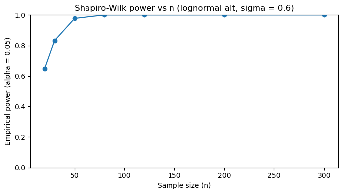
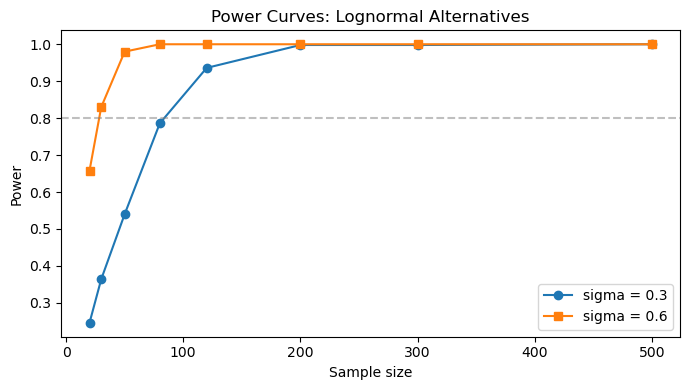
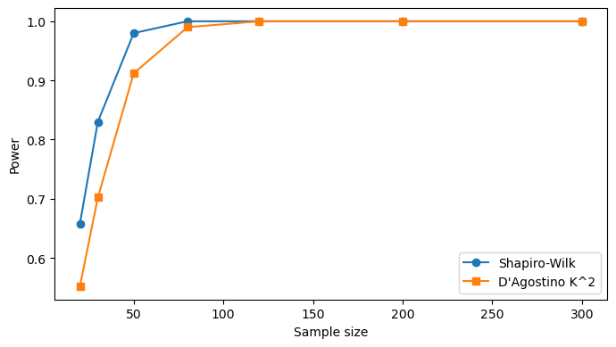
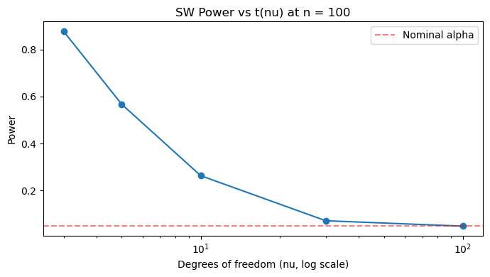

# Shapiro-Wilk 검정력 모의실험

## 개요

정규성 검정의 검정력은 자료가 실제로 비정규 분포에서 왔을 때 귀무가설을 올바르게 기각할 확률이다. 이 페이지는 대수정규 대립가설을 써서 여러 표본크기에 걸친 Shapiro-Wilk 검정의 경험적 검정력을 몬테카를로 모의실험으로 추정한다. 그 결과인 검정력 곡선은 표본이 커질수록 비정규성 탐지가 얼마나 극적으로 개선되는지 보여준다.

## 검정의 검정력

유의수준 $\alpha$의 정규성 검정에 대해 특정 대립분포 $F_1$에 대한 검정력은

$$
\text{Power}(n, \alpha, F_1) = P\bigl(H_0 \text{ 기각} \mid X_1, \ldots, X_n \sim F_1\bigr).
$$

검정력은 세 요인에 의존한다.

1. **표본크기 $n$:** 표본이 클수록 정보가 많다.
2. **유의수준 $\alpha$:** $\alpha$가 크면 검정력이 커지지만 제1종 오류도 커진다.
3. **비정규성의 정도:** 정규에서 멀수록 탐지하기 쉽다.

## 모의실험 절차

각 표본크기 $n$에 대해

1. $M$번 반복한다.
    - $X_1, \ldots, X_n \overset{\text{iid}}{\sim} \text{Lognormal}(0, \sigma)$를 뽑는다.
    - 수준 $\alpha$에서 Shapiro-Wilk 검정을 수행한다.
    - $H_0$이 기각되었는지 기록한다.
2. 기각 비율로 검정력을 추정한다.

$$
\widehat{\text{Power}}(n) = \frac{\text{기각 횟수}}{M}.
$$

<div class="exbox" markdown>

**보기 1.** <span class="diff easy" title="쉬움"></span> Shapiro-Wilk 검정력 곡선. 대립가설 쪽 모집단을 $\text{Lognormal}(0,\, 0.6)$으로 **고정**하고 $n$만 $20$에서 $300$까지 키워, 각 $n$에서 반복 400회로 검정력을 잰다.

**(1)** $\text{Lognormal}(0, \sigma)$의 왜도와 초과첨도를 $m = e^{\sigma^2}$으로 나타내고 $\sigma = 0.6$에서의 값을 구하시오. 본문이 말하는 왜도 $2.26$과 맞는가.

**(2)** 반복 400회가 주는 몬테카를로 표준오차를 구하고, 표의 **"검정력 = 1.000"을 어떻게 읽어야 하는지** 말하시오. 검정력이 $0.8$을 넘는 $n$도 더 촘촘히 좁혀 구하시오.

</div>

??? success "풀이"

    ```python
    import numpy as np
    import matplotlib.pyplot as plt
    from scipy import stats

    plt.rcParams["font.sans-serif"] = ["NanumGothic", "Apple SD Gothic Neo", "Malgun Gothic"]
    plt.rcParams["font.family"] = "sans-serif"
    plt.rcParams["axes.unicode_minus"] = False

    def power_for_n(n, sims=500, sigma_ln=0.6, alpha=0.05, seed=0):
        """주어진 표본크기에서 Shapiro-Wilk 검정의 검정력을 모의실험으로 잰다.

        대립가설 쪽 모집단은 로그정규로 고정한다. 정규에서 벗어난 정도는
        내내 같으므로, 검정력의 변화는 오직 표본크기 때문이다.
        """
        rng = np.random.default_rng(seed)
        rejections = 0
        for _ in range(sims):
            x = rng.lognormal(mean=0.0, sigma=sigma_ln, size=n)
            W, p = stats.shapiro(x)
            if p < alpha:
                rejections += 1
        return rejections / sims

    # n 을 키워 가며 검정력 곡선을 그린다. 같은 이탈인데도 n=20 에서는
    # 절반도 잡아내지 못하고 n=300 에서는 거의 놓치지 않는다.
    ns = [20, 30, 50, 80, 120, 200, 300]
    powers = [power_for_n(n, sims=400, sigma_ln=0.6, alpha=0.05,
                          seed=42 + n) for n in ns]

    fig, ax = plt.subplots(figsize=(7, 4))
    ax.plot(ns, powers, marker="o")
    ax.set_ylim(0, 1)
    ax.set_xlabel("Sample size (n)")
    ax.set_ylabel("Empirical power (alpha = 0.05)")
    ax.set_title("Shapiro-Wilk power vs n (lognormal alt, sigma = 0.6)")
    plt.tight_layout()
    plt.show()

    for n, pw in zip(ns, powers):
        print(f"n = {n:>3}: power = {pw:.3f}")
    ```

    출력:

    ```text
    n =  20: power = 0.647
    n =  30: power = 0.833
    n =  50: power = 0.978
    n =  80: power = 1.000
    n = 120: power = 1.000
    n = 200: power = 1.000
    n = 300: power = 1.000
    ```

    

    **(1) 해석적으로.** $X = e^{Z}$, $Z \sim \mathcal{N}(0, \sigma^2)$이면 $E[X^k] = e^{k^2\sigma^2/2}$이다. $m = e^{\sigma^2}$으로 두고 표준화된 적률을 정리하면

    $$
    \gamma_1 = (m + 2)\sqrt{m - 1}, \qquad \gamma_2 = m^4 + 2m^3 + 3m^2 - 6
    $$

    이다. **$\sigma$만이 모양을 정하고 위치 모수 $\mu$는 척도로만 작용하므로 아무 몫도 하지 않는다.** $\sigma = 0.6$에서 $m = e^{0.36} = 1.43333$이므로

    $$
    \gamma_1 = 3.43333 \times \sqrt{0.43333} = 2.2601,
    \qquad
    \gamma_2 = 10.2734
    $$

    를 얻는다. 본문이 말하는 왜도 $2.26$과 **맞는다.** 초과첨도 $10.27$도 함께 적어 두는 것이 좋다. 왜도만 보면 $t_5$($\gamma_1 = 0$, $\gamma_2 = 6$)와 견줄 데가 없어 보이지만, 첨도까지 보면 이 대립가설은 $t_5$보다도 정규에서 멀다. $n = 20$에서 이미 검정력이 $0.65$나 되는 까닭이 이것이고, 앞 절의 $t_{30}$($\gamma_2 = 0.23$)과 대비하면 차이가 분명하다.

    **(2)** 반복 $M$회 모의의 추정 검정력은 성공확률 $\pi$인 이항비율이므로 표준오차는 $\sqrt{\hat\pi(1-\hat\pi)/M}$이다. $M = 400$에서 가장 커지는 $\hat\pi \approx 0.5$ 근처라면 $0.025$이니, **이 표의 수는 둘째 자리까지만 의미가 있다.**

    ```python
    import numpy as np
    from scipy import stats

    sigma_ln, alpha = 0.6, 0.05

    # 1) 대립가설의 이탈 크기는 닫힌 꼴로 정해져 있다.
    m = np.exp(sigma_ln ** 2)
    g1 = (m + 2) * np.sqrt(m - 1)
    g2 = m ** 4 + 2 * m ** 3 + 3 * m ** 2 - 6
    print(f"Lognormal(0, {sigma_ln}):  m = exp(sigma^2) = {m:.5f}")
    print(f"  왜도      (m+2) sqrt(m-1)        = {g1:.4f}")
    print(f"  초과첨도  m^4 + 2m^3 + 3m^2 - 6  = {g2:.4f}")
    lg = stats.lognorm(s=sigma_ln)
    print(f"  scipy 확인:  왜도 {lg.stats('s'):.4f}   초과첨도 {lg.stats('k'):.4f}")

    # 2) 반복 400 회가 주는 정밀도. 기각 횟수까지 함께 본다.
    print(f"\n보기의 표를 기각 횟수와 몬테카를로 오차까지 적으면 (sims = 400)")
    sims = 400
    for n in (20, 30, 50, 80, 120, 200, 300):
        rng = np.random.default_rng(42 + n)
        rej = sum(1 for _ in range(sims)
                  if stats.shapiro(rng.lognormal(0.0, sigma_ln, n)).pvalue < alpha)
        ph = rej / sims
        se = np.sqrt(ph * (1 - ph) / sims)
        if rej == sims:
            lower = alpha ** (1 / sims)       # 클로퍼-피어슨 95% 하한
            note = f"-> 95% 하한 {lower:.4f}"
        else:
            note = f"+- {1.96 * se:.4f}  (MC SE {se:.4f})"
        print(f"  n = {n:4d}  기각 {rej:3d}/{sims}  검정력 {ph:.4f}  {note}")

    # 3) 0.8 선을 더 촘촘히, 반복을 늘려 좁힌다.
    print("\n0.8 선 좁히기 (sims = 20000)")
    for n in (22, 24, 26, 28, 30):
        rng = np.random.default_rng(7000 + n)
        rej = sum(1 for _ in range(20000)
                  if stats.shapiro(rng.lognormal(0.0, sigma_ln, n)).pvalue < alpha)
        print(f"  n = {n:4d}  검정력 {rej / 20000:.4f}  (MC SE "
              f"{np.sqrt(rej / 20000 * (1 - rej / 20000) / 20000):.4f})")
    ```

    출력:

    ```text
    Lognormal(0, 0.6):  m = exp(sigma^2) = 1.43333
      왜도      (m+2) sqrt(m-1)        = 2.2601
      초과첨도  m^4 + 2m^3 + 3m^2 - 6  = 10.2734
      scipy 확인:  왜도 2.2601   초과첨도 10.2734

    보기의 표를 기각 횟수와 몬테카를로 오차까지 적으면 (sims = 400)
      n =   20  기각 259/400  검정력 0.6475  +- 0.0468  (MC SE 0.0239)
      n =   30  기각 333/400  검정력 0.8325  +- 0.0366  (MC SE 0.0187)
      n =   50  기각 391/400  검정력 0.9775  +- 0.0145  (MC SE 0.0074)
      n =   80  기각 400/400  검정력 1.0000  -> 95% 하한 0.9925
      n =  120  기각 400/400  검정력 1.0000  -> 95% 하한 0.9925
      n =  200  기각 400/400  검정력 1.0000  -> 95% 하한 0.9925
      n =  300  기각 400/400  검정력 1.0000  -> 95% 하한 0.9925

    0.8 선 좁히기 (sims = 20000)
      n =   22  검정력 0.6968  (MC SE 0.0033)
      n =   24  검정력 0.7439  (MC SE 0.0031)
      n =   26  검정력 0.7819  (MC SE 0.0029)
      n =   28  검정력 0.8154  (MC SE 0.0027)
      n =   30  검정력 0.8436  (MC SE 0.0026)
    ```

    **닫힌 꼴이 `scipy`와 소수점 넷째 자리까지 맞는다.** 손으로 유도한 $\gamma_1 = 2.2601$, $\gamma_2 = 10.2734$가 `stats.lognorm(s=0.6).stats('sk')`가 주는 값과 같다.

    **"검정력 = 1.000"은 1이 아니다.** 그것은 400번 가운데 400번 기각했다는 뜻일 뿐이며, 참 검정력이 $0.99$라면 400번 모두 기각할 확률이 $0.99^{400} = 0.018$로 결코 무시할 만하지 않다. 정규근사 표준오차는 $\hat\pi = 1$에서 $0$을 주어 쓸 수 없으므로 클로퍼–피어슨 하한을 쓴다. $400$번 모두 성공했을 때 95% 하한은 $0.05^{1/400} = 0.9925$이므로, **표의 $1.000$은 "검정력 $\ge 0.993$"으로 읽어야 한다.** 연습문제 5가 같은 계산을 한다.

    다른 행도 눈금을 붙여 읽어야 한다. $n = 20$은 $259/400 = 0.6475$이고 95% 오차한계가 $\pm 0.047$이므로 참 검정력은 대략 $[0.60,\, 0.69]$ 안에 있다. (본문은 같은 수를 $0.648$로, 코드 출력은 $0.647$로 적는데 둘 다 $0.6475$를 셋째 자리에서 끊은 것이다.) $n = 30$은 $333/400 = 0.8325 \pm 0.037$이니 관례적 기준 $0.8$을 넘었다는 판정 자체는 오차 안에서 간신히 유지된다.

    **$0.8$ 선은 $n \approx 27$이다.** 반복을 20,000회로 올려 촘촘히 재면 $n = 26$에서 $0.7819$, $n = 28$에서 $0.8154$이므로 선형보간으로 $n = 27.1$을 얻는다. 표준오차가 $0.003$으로 줄어 이제 셋째 자리까지 믿을 수 있다. 연습문제 1이 400–500회의 거친 격자에서 보간해 얻은 $n \approx 28$과 한 칸 차이인데, 그 격자의 분해능($n = 20$과 $30$ 사이를 직선으로 이은 것) 안이다.

    요점은 두 가지다. 첫째, **이탈이 크면 작은 표본으로도 잡힌다.** 왜도 $2.26$에 초과첨도 $10.27$인 이 대립가설은 $n = 27$이면 다섯 번에 네 번 잡힌다. 둘째, **모의실험으로 얻은 검정력에는 반드시 오차를 붙여야 한다.** $0.647$과 $1.000$을 같은 자리까지 적어 늘어놓으면 앞의 수가 뒤의 수만큼 정밀해 보이지만, 실제 오차한계는 $\pm 0.047$ 대 $[0.993,\, 1]$로 전혀 다르다.

## 검정력 곡선 읽기

검정력 곡선은 작은 $n$에서 시작해 $n$이 커지면서 1.0으로 올라간다. 핵심은 다음과 같다.

- $n = 20$에서 이미 검정력이 $0.648$이다. 그래도 대수정규 표본의 **35%를 놓친다**.
- $n = 30$에서 $0.833$으로 관례적 기준 0.8을 넘고, $n = 50$에서 $0.978$, $n = 80$에서는 400회 반복 중 한 번도 놓치지 않았다.
- 곡선의 가파름은 $\sigma$(대수정규의 모양 모수)에 의존한다. $\sigma$가 크면 정규에서 더 멀어져 곡선이 가팔라진다.

$\sigma = 0.6$인 대수정규는 왜도가 $2.26$으로 상당히 극단적인 대립가설이라는 점을 기억하라. 그래서 이렇게 작은 표본에서도 검정력이 높다. 연습문제 1에서 더 미묘한 대립가설을 다룬다.

## 해석

이 모의실험은 Shapiro-Wilk 검정의 효력이 표본크기에 결정적으로 의존함을 보여준다. 작은 표본에서 정규성을 기각하지 못한 것을 정규성의 강한 증거로 해석해서는 안 된다. 단지 검정력이 부족했을 수 있다. 반대로 아주 큰 표본에서는 실용적으로 "충분히 정규에 가까운" 분포에 대해서도 기각한다.

## 연습문제

<div class="drillbox" markdown>

**연습문제 1.** <span class="diff med" title="중간"></span> $\sigma = 0.3$(정규에 더 가까운 대수정규)에 대해 검정력 모의실험을 수행하고 $\sigma = 0.6$ 곡선과 비교하라. 각 경우 검정력이 0.8에 도달하는 표본크기는 얼마인가?

</div>

??? success "풀이"

    ```python
    import numpy as np
    from scipy import stats
    import matplotlib.pyplot as plt

    def power_curve(sigma, ns, sims=500, alpha=0.05):
        powers = []
        for n in ns:
            rng = np.random.default_rng(42 + n)
            rej = sum(1 for _ in range(sims)
                      if stats.shapiro(rng.lognormal(0, sigma, n))[1] < alpha)
            powers.append(rej / sims)
        return powers

    ns = [20, 30, 50, 80, 120, 200, 300, 500]
    p03 = power_curve(0.3, ns)
    p06 = power_curve(0.6, ns)

    for n, a, b in zip(ns, p03, p06):
        print(f"n = {n:>3}: sigma=0.3 -> {a:.3f}, sigma=0.6 -> {b:.3f}")

    fig, ax = plt.subplots(figsize=(7, 4))
    ax.plot(ns, p03, marker="o", label="sigma = 0.3")
    ax.plot(ns, p06, marker="s", label="sigma = 0.6")
    ax.axhline(0.8, color="gray", linestyle="--", alpha=0.5)
    ax.set_xlabel("Sample size")
    ax.set_ylabel("Power")
    ax.set_title("Power Curves: Lognormal Alternatives")
    ax.legend()
    plt.tight_layout()
    plt.show()
    ```

    출력:

    ```text
    n =  20: sigma=0.3 -> 0.246, sigma=0.6 -> 0.658
    n =  30: sigma=0.3 -> 0.364, sigma=0.6 -> 0.830
    n =  50: sigma=0.3 -> 0.540, sigma=0.6 -> 0.980
    n =  80: sigma=0.3 -> 0.786, sigma=0.6 -> 1.000
    n = 120: sigma=0.3 -> 0.936, sigma=0.6 -> 1.000
    n = 200: sigma=0.3 -> 0.998, sigma=0.6 -> 1.000
    n = 300: sigma=0.3 -> 0.998, sigma=0.6 -> 1.000
    n = 500: sigma=0.3 -> 1.000, sigma=0.6 -> 1.000
    ```

    

    | 대립가설 | 왜도 $\gamma_1$ | 검정력 0.8 도달 |
    |---|---|---|
    | $\sigma = 0.6$ | 2.260 | $n \approx 28$ |
    | $\sigma = 0.3$ | 0.950 | $n \approx 84$ |

    ($\sigma = 0.6$은 $n = 30$에서 $0.830$, $\sigma = 0.3$은 $n = 80$에서 $0.786$, $n = 120$에서 $0.936$이므로 선형보간한 값이다.)

    $\sigma = 0.3$인 대수정규는 왜도가 $0.95$로 정규에 훨씬 가까우므로 같은 검정력을 얻는 데 약 **3배** 큰 표본이 필요하다. 미묘한 이탈일수록 큰 표본이 필요하다는 근본적 절충을 보여준다.

    대략적인 어림셈으로는 검정력이 왜도의 제곱과 $n$의 곱, 곧 $n\gamma_1^2$에 의존한다고 볼 수 있다. $(2.260/0.950)^2 = 5.7$이라면 표본크기 비율도 5.7배여야 할 것 같지만 실제로는 3배다. Shapiro-Wilk가 왜도만이 아니라 순서통계량 전체의 정렬을 쓰기 때문이다. $\square$

<div class="drillbox" markdown>

**연습문제 2.** <span class="diff med" title="중간"></span> 대수정규 대립가설에 대해 Shapiro-Wilk 검정과 D'Agostino $K^2$ 검정의 검정력을 비교하도록 모의실험을 수정하라. 두 검정력 곡선을 같은 축에 그려라.

</div>

??? success "풀이"

    ```python
    import numpy as np
    from scipy import stats
    import matplotlib.pyplot as plt

    ns = [20, 30, 50, 80, 120, 200, 300]
    sims, alpha, sigma = 500, 0.05, 0.6
    pw_sw, pw_k2 = [], []

    for n in ns:
        rng = np.random.default_rng(42 + n)
        r_sw = r_k2 = 0
        for _ in range(sims):
            x = rng.lognormal(0, sigma, n)
            if stats.shapiro(x)[1] < alpha:
                r_sw += 1
            if stats.normaltest(x)[1] < alpha:
                r_k2 += 1
        pw_sw.append(r_sw / sims)
        pw_k2.append(r_k2 / sims)
        print(f"n = {n:>3}: SW = {r_sw/sims:.3f}, K2 = {r_k2/sims:.3f}")

    fig, ax = plt.subplots(figsize=(7, 4))
    ax.plot(ns, pw_sw, marker="o", label="Shapiro-Wilk")
    ax.plot(ns, pw_k2, marker="s", label="D'Agostino K^2")
    ax.set_xlabel("Sample size")
    ax.set_ylabel("Power")
    ax.legend()
    plt.tight_layout()
    plt.show()
    ```

    출력:

    ```text
    n =  20: SW = 0.658, K2 = 0.552
    n =  30: SW = 0.830, K2 = 0.702
    n =  50: SW = 0.980, K2 = 0.912
    n =  80: SW = 1.000, K2 = 0.990
    n = 120: SW = 1.000, K2 = 1.000
    n = 200: SW = 1.000, K2 = 1.000
    n = 300: SW = 1.000, K2 = 1.000
    ```

    

    $n \geq 120$에서는 두 검정 모두 검정력이 1이다. 더 작은 $n$(20~80)에서는 Shapiro-Wilk가 일관되게 높다. $n = 20$에서 $0.658$ 대 $0.552$, $n = 30$에서 $0.830$ 대 $0.702$로 격차가 10~13퍼센트포인트에 이른다.

    작은 표본에서 Shapiro-Wilk가 선호되는 이유를 정량적으로 확인해 준다. $K^2$은 두 적률로 정보를 압축하지만, Shapiro-Wilk는 순서통계량 전체의 배열을 활용하므로 표본이 작아 적률 추정이 불안정할 때 유리하다.

    (앞서 정규성 검정 모음 페이지의 연습문제 2에서 본 것과 대조된다. 거기서는 $n = 200$의 대수정규에 대해 Jarque-Bera와 $K^2$이 Shapiro-Wilk보다 훨씬 작은 $p$값을 냈다. 작은 $p$값이 곧 큰 검정력을 뜻하지는 않는다. 두 검정 모두 검정력이 1인 영역에서는 $p$값의 크기가 검정력에 관해 아무것도 말해 주지 않는다.) $\square$

<div class="drillbox" markdown>

**연습문제 3.** <span class="diff hard" title="어려움"></span> 고정된 대립가설 $F_1 \neq \mathcal{N}$에 대해 일치성을 갖는 검정의 검정력이 $n \to \infty$일 때 1로 수렴하는 이유를 수학적으로 설명하라.

</div>

??? success "풀이"

    Shapiro-Wilk 통계량은 정렬된 자료와 기대 정규 순서통계량 사이의 (제곱) 상관으로 해석할 수 있다. 자료가 $F_1$에서 오면 대수의 법칙에 의해

    $$
    W_n \xrightarrow{p} c(F_1) < 1
    $$

    이며, 여기서 $c(F_1)$은 $F_1$의 분위수함수와 정규 분위수함수 사이의 상관으로 결정되는 상수이다. $F_1 = \mathcal{N}$일 때만 $c = 1$이다.

    한편 귀무가설 아래에서는 $W_n \xrightarrow{p} 1$이고, 수준 $\alpha$의 임계값 $w_\alpha(n)$도 $n \to \infty$일 때 $1$로 수렴한다.

    $c(F_1) < 1$이므로 $\epsilon = (1 - c)/3 > 0$을 잡으면 충분히 큰 $n$에 대해 $w_\alpha(n) > 1 - \epsilon > c + \epsilon$이다. 그러면

    $$
    \text{Power}(n) = P(W_n < w_\alpha(n) \mid F_1) \geq P(W_n < c + \epsilon \mid F_1) \to 1,
    $$

    마지막 수렴은 $W_n \xrightarrow{p} c$에서 따라 나온다.

    같은 논증이 일치성을 갖는 모든 검정에 적용된다. 대립가설 아래에서 통계량이 기각역 안의 값으로 수렴하므로 기각확률이 1로 간다.

    **실무적 유보.** 이 결과는 $F_1$이 고정되어 있을 때만 성립한다. 실제 자료 분석에서는 $n$이 커지면서 "실질적으로 무시할 만한" 이탈까지 기각하게 되는데, 이것이 정확히 이 정리가 말하는 바이다. 일치성은 축복이자 저주이다. $\square$

<div class="drillbox" markdown>

**연습문제 4.** <span class="diff med" title="중간"></span> $\nu \in \{3, 5, 10, 30, 100\}$인 $t_\nu$ 대립가설에 대해 $n = 100$에서 Shapiro-Wilk 검정의 검정력을 추정하라. 검정력 대 $\nu$를 그림으로 그려라.

</div>

??? success "풀이"

    ```python
    import numpy as np
    from scipy import stats
    import matplotlib.pyplot as plt

    rng = np.random.default_rng(0)
    n, sims, alpha = 100, 1000, 0.05
    dfs = [3, 5, 10, 30, 100]
    powers = []

    for df in dfs:
        rej = sum(1 for _ in range(sims)
                  if stats.shapiro(rng.standard_t(df, n))[1] < alpha)
        powers.append(rej / sims)
        print(f"df = {df:>3}: power = {rej/sims:.3f}")

    fig, ax = plt.subplots(figsize=(7, 4))
    ax.plot(dfs, powers, marker="o")
    ax.set_xscale("log")
    ax.axhline(0.05, color="red", linestyle="--", alpha=0.5,
               label="Nominal alpha")
    ax.set_xlabel("Degrees of freedom (nu, log scale)")
    ax.set_ylabel("Power")
    ax.set_title("SW Power vs t(nu) at n = 100")
    ax.legend()
    plt.tight_layout()
    plt.show()
    ```

    출력:

    ```text
    df =   3: power = 0.878
    df =   5: power = 0.567
    df =  10: power = 0.263
    df =  30: power = 0.071
    df = 100: power = 0.048
    ```

    

    | $\nu$ | 초과첨도 $\gamma_2$ | 검정력 |
    |---|---|---|
    | 3 | $\infty$ | 0.878 |
    | 5 | 6.00 | 0.567 |
    | 10 | 1.00 | 0.263 |
    | 30 | 0.231 | 0.071 |
    | 100 | 0.0625 | 0.048 |

    $t_\nu \to \mathcal{N}(0,1)$이므로 $\nu$가 커질수록 검정력이 떨어진다. $\nu = 3$(첨도가 무한)에서는 $0.878$로 높고, $\nu = 100$에서는 $t$ 분포가 정규와 거의 구별되지 않아 검정력이 $\alpha = 0.05$에 가까운 $0.048$이다.

    가운데 구간을 눈여겨보라. $\nu = 5$는 초과첨도가 $6$으로 결코 작지 않은데도 검정력이 $0.567$에 그친다. $n = 100$인 $t_5$ 표본의 **43%를 놓친다**는 뜻이다. $\nu = 10$에서는 74%를 놓친다.

    이는 앞서 첨도 검정 페이지에서 본 현상과 같은 뿌리를 갖는다. 두꺼운 꼬리에 대한 정보는 소수의 극단 관측값에만 담겨 있어서, 그 관측값들이 표본에 우연히 들어오는지에 결과가 좌우된다. 금융 수익률처럼 두꺼운 꼬리가 문제인 영역에서 정규성 검정만 믿어서는 안 되는 이유이다. $\square$

<div class="drillbox" markdown>

**연습문제 5.** <span class="diff hard" title="어려움"></span> 추정된 검정력의 몬테카를로 표준오차 공식을 유도하고, $M = 400$회 모의실험에서 $\widehat{\text{Power}} = 0.72$일 때 검정력의 95% 신뢰구간을 계산하라.

</div>

??? success "풀이"

    각 모의실험은 성공확률 $\pi = \text{Power}$인 베르누이 시행이다. 추정량 $\hat{\pi} = \widehat{\text{Power}}$의 분산은 $\pi(1-\pi)/M$이므로 표준오차는

    $$
    \text{SE}(\hat{\pi}) = \sqrt{\frac{\hat{\pi}(1 - \hat{\pi})}{M}}.
    $$

    $\hat{\pi} = 0.72$, $M = 400$이면

    $$
    \text{SE} = \sqrt{\frac{0.72 \times 0.28}{400}} = \sqrt{\frac{0.2016}{400}} = \sqrt{0.000504} \approx 0.0225.
    $$

    95% 신뢰구간은 $\hat{\pi} \pm 1.96 \times \text{SE} = 0.72 \pm 0.044 = (0.676, 0.764)$이다.

    표준오차를 절반으로 줄이려면 $M = 1600$회가 필요하다. $\text{SE} \propto 1/\sqrt{M}$이므로 정밀도를 두 배로 높이는 데 계산량이 네 배 든다.

    **경계 근처의 주의사항.** $\hat{\pi}$가 0이나 1에 가까우면 이 정규근사가 무너진다. 예컨대 400회 중 400회 모두 기각하여 $\hat{\pi} = 1$이면 위 공식은 $\text{SE} = 0$을 준다. 참 검정력이 1이라는 뜻이 아니다. 이 경우에는 Wilson 구간이나 Clopper-Pearson 구간을 써야 한다. 400회 중 400회 성공의 Clopper-Pearson 95% 하한은 $0.05^{1/400} = 0.9925$이므로, 본문의 "검정력 $= 1.000$"은 정확히는 "검정력 $\geq 0.993$"으로 읽어야 한다. $\square$

---

## 정리하며

검정력을 **직접 재어** 표본크기 의존성을 확인했다.

- **같은 대립분포인데 $n$ 에 따라 검정력이 극적으로 달라진다.** 로그정규를 대립가설로 두면 $n=20$ 에서는 절반도 못 잡고, $n=200$ 이면 거의 언제나 잡는다.
- **이것이 앞 절 한계의 정량적 근거다.** "검정이 기각하지 못했다"는 말은 **$n$ 을 밝히지 않으면 아무 정보도 아니다.**
- **대립분포에 따라서도 다르다.** 치우친 분포는 비교적 쉽게 잡히고, 대칭이면서 꼬리만 두꺼운 분포는 더 큰 표본이 필요하다.
- **모의실험 절차 자체가 재사용 가능하다.** 자신의 상황에 맞는 $n$ 과 대립분포로 바꿔 돌리면 **"내 표본으로 이 정도 이탈을 잡을 수 있는가"** 에 답할 수 있다.
- **9장의 검정력 분석이 그대로 적용된다.** 검정력은 설계 단계에서 따질 일이다.

다음 절부터 **정규가 아닐 때의 대처**로 넘어간다.
