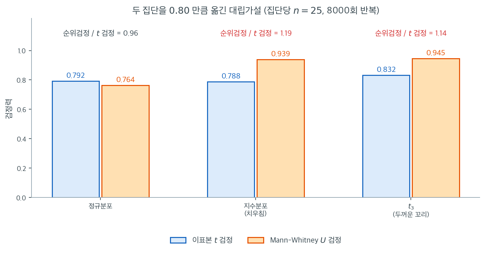

# 비모수 방법

정규가 아닌 자료를 다루는 또 하나의 전략은 **비모수 방법**을 쓰는 것이다. 이 방법들은 자료에 특정 분포를 가정하지 않으며, 자료가 순서형이거나 정규성 가정이 위배될 때 흔히 쓰인다.

---

## 1. 흔한 비모수 검정

- **Mann-Whitney U 검정**: 독립인 두 집단을 비교하는 $t$ 검정의 비모수 대안.
- **Kruskal-Wallis 검정**: 셋 이상의 집단을 비교하는 분산분석의 비모수 대안.
- **Wilcoxon 부호순위 검정**: 대응하는 두 표본을 비교하는 비모수 검정.

<div class="exbox" markdown>

**보기 1.** <span class="diff easy" title="쉬움"></span> Mann-Whitney U 검정. 척도 $2$와 $3$인 두 지수분포에서 각각 $n = 100$을 뽑아 만–휘트니 $U$ 검정을 걸면 $U = 3411$, $p = 0.000104$가 나온다.

**(1)** 만–휘트니 검정이 재는 모수는 평균의 차가 아니라 $\theta = P(X_1 > X_2)$이다. 척도가 $s_1$, $s_2$인 두 지수분포에서 $\theta$를 **닫힌 꼴로 유도**하고, 그로부터 $\mathbb{E}[U]$를 구하시오.

**(2)** 관측된 $U = 3411$과 $p = 0.000104$를 (1)의 결과와 정규근사로 **재현**하시오. 또 이 자료의 효과 크기를 "두 평균이 $2$ 대 $3$으로 50% 차이난다"로 말하는 것과 "$\theta$가 $0.5$에서 $0.4$로 벗어났다"로 말하는 것 가운데, 검정이 실제로 보는 것은 어느 쪽인가.

</div>

??? success "풀이"

    **(1) 해석적으로.** 지수분포의 척도 $s$는 비율 $\lambda = 1/s$에 대응한다. $X \sim \text{Exp}(\lambda_1)$, $Y \sim \text{Exp}(\lambda_2)$가 독립이라 하고 $Y$로 조건을 걸어 적분한다. 지수분포의 생존함수가 $P(X > y) = e^{-\lambda_1 y}$이므로

    $$
    \theta = P(X > Y) = \int_0^\infty P(X > y)\, \lambda_2 e^{-\lambda_2 y}\, dy
    = \lambda_2 \int_0^\infty e^{-(\lambda_1 + \lambda_2) y}\, dy
    = \frac{\lambda_2}{\lambda_1 + \lambda_2}
    $$

    이다. 척도로 바꿔 쓰면 분자·분모에 $s_1 s_2$를 곱해

    $$
    \theta = \frac{1/s_2}{1/s_1 + 1/s_2} = \frac{s_1}{s_1 + s_2}
    $$

    을 얻는다. 기억하기 좋은 꼴이다. $s_1 = 2$, $s_2 = 3$이면

    $$
    \theta = \frac{2}{2+3} = \frac{2}{5} = 0.4
    $$

    이다. 이제 $U$로 넘어간다. 만–휘트니 통계량은 묶임이 없을 때 **큰 쪽 쌍의 개수**다.

    $$
    U_1 = \sum_{i=1}^{n_1}\sum_{j=1}^{n_2} \mathbf{1}\{X_i > Y_j\}
    $$

    기댓값은 선형성만으로 바로 나온다. 지시함수 $n_1 n_2$개가 각각 평균 $\theta$를 가지므로

    $$
    \mathbb{E}[U_1] = n_1 n_2\, \theta = 100 \times 100 \times 0.4 = 4000
    $$

    이다. **근사가 아니라 정확한 등식이다.** 지시함수들이 서로 독립이 아니지만(같은 $X_i$를 공유한다) 기댓값에는 영향이 없다. 분산을 구할 때라야 그 종속이 문제가 된다.

    귀무가설 $H_0 : \theta = 1/2$ 아래에서는 $\mathbb{E}[U_1] = n_1 n_2 / 2 = 5000$이고, 알려진 분산식으로

    $$
    \operatorname{SD}(U_1) = \sqrt{\frac{n_1 n_2 (n_1 + n_2 + 1)}{12}} = \sqrt{\frac{100 \times 100 \times 201}{12}} = \sqrt{167\,500} = 409.27
    $$

    이다.

    **(2) 수치적으로.** 먼저 쪽의 코드를 그대로 돌린다.

    ```python
    import numpy as np
    from scipy.stats import mannwhitneyu

    np.random.seed(0)

    # 두 지수분포. 정규와는 거리가 멀다.
    group1 = np.random.exponential(scale=2, size=100)
    group2 = np.random.exponential(scale=3, size=100)

    # Mann-Whitney U 는 t 검정의 비모수 대응이다. 값 대신 순위만 쓰므로
    # 정규성을 요구하지 않는다. 다만 귀무가설이 "두 평균이 같다"가 아니라
    # "두 분포의 위치가 같다"이므로, 결론을 말할 때 표현에 주의해야 한다.
    stat, p_value = mannwhitneyu(group1, group2)
    print(f"Mann-Whitney U Test: Statistic={stat}, p-value={p_value}")

    # 결과 해석
    alpha = 0.05
    if p_value > alpha:
        print("Fail to reject H_0: No significant difference between the groups.")
    else:
        print("Reject H_0: Significant difference between the groups.")
    ```

    출력:

    ```text
    Mann-Whitney U Test: Statistic=3411.0, p-value=0.00010388964489703351
    Reject H_0: Significant difference between the groups.
    ```

    이제 (1)의 값과 맞춰 본다.

    ```python
    import numpy as np
    from scipy import stats
    from scipy.stats import mannwhitneyu

    np.random.seed(0)
    group1 = np.random.exponential(scale=2, size=100)
    group2 = np.random.exponential(scale=3, size=100)
    n1 = n2 = 100
    U, p = mannwhitneyu(group1, group2)

    # theta = P(X1 > X2) 의 닫힌 꼴. 척도 s1, s2 이면 s1/(s1+s2) 다.
    theta = 2 / (2 + 3)
    print(f"이론  theta = s1/(s1+s2) = {theta:.4f}")
    print(f"이론  E[U] = n1 n2 theta = {n1 * n2 * theta:.1f}")

    # U 가 정말로 쌍의 개수인지 직접 세어 확인한다.
    pairs = (group1[:, None] > group2[None, :]).sum()
    print(f"직접 센 #(x > y) = {pairs}   scipy 의 U = {U:.1f}")
    print(f"표본비율 = {pairs / (n1 * n2):.4f}")

    # H0: theta = 1/2 아래의 정규근사. 연속성 보정을 넣는다.
    mu0 = n1 * n2 / 2
    sd0 = np.sqrt(n1 * n2 * (n1 + n2 + 1) / 12)
    z = (U - mu0 + 0.5) / sd0
    print(f"H0 아래  E[U] = {mu0:.1f},  SD = {sd0:.4f}")
    print(f"z = ({U:.1f} - {mu0:.1f} + 0.5) / {sd0:.4f} = {z:.4f}")
    print(f"양쪽 p = {2 * stats.norm.cdf(z):.8f}")
    print(f"scipy 의 p = {p:.8f}")

    print(f"표본중앙값 {np.median(group1):.4f}, {np.median(group2):.4f}  "
          f"(이론 {2*np.log(2):.4f}, {3*np.log(2):.4f})")
    print(f"표본평균   {group1.mean():.4f}, {group2.mean():.4f}  (이론 2, 3)")
    ```

    출력:

    ```text
    이론  theta = s1/(s1+s2) = 0.4000
    이론  E[U] = n1 n2 theta = 4000.0
    직접 센 #(x > y) = 3411   scipy 의 U = 3411.0
    표본비율 = 0.3411
    H0 아래  E[U] = 5000.0,  SD = 409.2676
    z = (3411.0 - 5000.0 + 0.5) / 409.2676 = -3.8813
    양쪽 p = 0.00010389
    scipy 의 p = 0.00010389
    표본중앙값 1.2603, 2.5687  (이론 1.3863, 2.0794)
    표본평균   1.8373, 3.1543  (이론 2, 3)
    ```

    **세 군데가 맞는다.**

    첫째, $U$가 쌍의 개수라는 해석이 **정확히** 맞는다. $X_i > Y_j$인 쌍을 직접 세면 $3411$개이고 SciPy의 $U$도 $3411.0$이다. 소수점이 없는 것은 묶임이 하나도 없다는 뜻이다(연속분포에서 뽑았으니 당연하다).

    둘째, 유도한 $\mathbb{E}[U] = 4000$에 대해 관측값은 $3411$이다. 표본비율로 보면 이론 $\theta = 0.4000$에 대해 $0.3411$이다. 차이가 작지 않은데, $U$의 대립가설 아래 표준편차가 $400$ 남짓이므로 $3411$은 $4000$에서 약 $1.5$ 표준편차 떨어진 자리다. 씨앗 0의 표본이 참값보다 조금 더 극단적으로 나온 것이고, 우연의 범위 안이다.

    셋째, $p$값이 **소수점 여덟째 자리까지 재현된다.** $z = (3411 - 5000 + 0.5)/409.2676 = -3.8813$에서 $2\Phi(-3.8813) = 0.00010389$이고 SciPy가 준 값도 $0.00010389$다. $+0.5$를 빼놓으면 $0.00010337$이 되어 다섯째 자리부터 어긋나므로, SciPy가 **연속성 보정을 넣은 정규근사**를 쓴다는 것까지 확인된다.

    **검정이 보는 것은 $\theta$ 쪽이다.** 두 말이 같은 자료를 가리키지만 검정이 재는 척도는 하나뿐이다.

    | 척도 | 귀무값 | 참값 | 벗어난 정도 |
    |---|---|---|---|
    | 평균의 비 | $1$ | $3/2 = 1.5$ | 50% |
    | $\theta = P(X_1 > X_2)$ | $0.5$ | $0.4$ | $0.1$ |

    만–휘트니는 값을 순위로 바꿔 버리므로 **"평균이 50% 크다"는 정보를 아예 보지 않는다.** 그것이 보는 것은 "무작위로 고른 $X_1$이 무작위로 고른 $X_2$보다 클 확률이 $0.4$"라는 사실뿐이다. 그래서 이 검정의 결론을 "두 평균이 다르다"로 옮겨 적으면 안 된다. 쪽의 주석이 경계하는 바가 이것이고, $\theta$가 모평균과 **단조로 이어지지 않는** 분포들을 만들 수 있기 때문에 단순한 번역이 통하지 않는다.

    실무적으로는 $\theta$가 오히려 보고하기 좋은 효과 크기다. 단위가 없고 "둘을 맞붙이면 어느 쪽이 이길 확률"이라는 뜻이 분명하다. 표본에서 $\hat\theta = U/(n_1 n_2) = 3411/10000 = 0.3411$로 바로 읽힌다. 평균의 차를 보고해야 하는 상황이라면 순위검정이 아니라 붓스트랩으로 가야 한다.

비모수 검정은 정규성 가정이 위배되거나 순서형 자료를 다룰 때 로버스트한 대안을 제공한다. 자료의 분포를 모르거나 정규가 아닌 상황에서 널리 쓰인다.

---

## 2. 순위검정은 무엇을 잃고 무엇을 얻는가

비모수 검정을 꺼리는 흔한 이유는 "값 대신 순위만 쓰니 정보를 버리는 것 아닌가"이다. 정보를 버리는 것은 맞다. 문제는 **얼마나** 버리는가이며, 그 답이 의외로 작다.

아래 그림은 세 가지 모집단에서 두 집단을 $0.80$만큼 옮긴 대립가설을 두고, 집단당 $n = 25$로 이표본 $t$ 검정과 Mann-Whitney $U$ 검정의 검정력을 8000번씩 재어 견준 것이다. 세 경우 모두 두 검정의 실제 유의수준은 $0.043$–$0.054$로 약속한 $0.05$ 근처에 있었으므로 공정한 비교다.



왼쪽 칸이 $t$ 검정에게 가장 유리한 상황이다. 모집단이 정확히 정규이므로 $t$ 검정이 최적이다. 그런데도 검정력 차이는 $0.792$ 대 $0.764$, 비로 따지면 $0.96$에 불과하다. 이론적으로 알려진 두 검정의 **점근 상대효율**이 $3/\pi = 0.955$인데, $n = 25$라는 작은 표본에서 이미 그 값에 거의 도달했다. 실무적으로 이 손실은 표본을 4% 남짓 늘리면 메워진다. 가장 불리한 판에서도 잃는 것이 그 정도다.

가운데와 오른쪽 칸에서 관계가 뒤집힌다. 지수분포에서는 $0.788$ 대 $0.939$로 순위검정이 $1.19$배 강하고, $t_3$에서는 $0.832$ 대 $0.945$로 $1.14$배 강하다. 이유는 다르다. 치우친 자료에서는 긴 꼬리가 $\bar{X}$를 끌고 다녀 신호 대비 잡음이 나빠지는데, 순위는 극단값을 그 순서만 인정하고 크기는 무시하므로 영향을 덜 받는다. 두꺼운 꼬리에서도 같은 이치로 $S$가 부풀어 $t$ 통계량이 눌리는 반면 순위는 그대로다.

이 비대칭한 손익 구조가 순위검정을 쓸 만하게 만든다. **정규성이 성립하면 4%쯤 잃고, 깨지면 15–20% 얻는다.** 물론 대가가 없지는 않다. 위 보기의 주석이 지적하듯 Mann-Whitney의 귀무가설은 "두 평균이 같다"가 아니라 "한 집단의 값이 다른 집단의 값보다 클 확률이 $1/2$이다"이므로, 모평균의 차이를 추정하거나 그에 대한 신뢰구간을 보고해야 하는 상황에는 그대로 쓸 수 없다. 검정만 필요한가, 아니면 모수의 추정값이 필요한가 — 이 물음이 순위검정과 붓스트랩 사이의 갈림길이다.

---

## 3. 요약: 정규가 아닌 자료 다루기

정규가 아닌 자료를 만났을 때 쓸 수 있는 전략은 여러 가지이다.

- **변수변환**은 자료를 정규에 더 가깝게 만들어 준다.
- **붓스트랩**은 모수적 가정에 기대지 않는 대안적 접근을 제공한다.
- **비모수 방법**은 가정이 위배될 때 전통적 모수 검정을 대신할 강력한 대안이다.

방법의 선택은 비정규성의 정도, 표본크기, 다루는 구체적인 연구 질문에 달려 있다. 실무에서는 이 접근들을 시각적·형식적 정규성 평가와 결합할 때 더 신뢰할 만한 통계 분석에 이를 수 있다.

---

## 연습문제

<div class="drillbox" markdown>

**연습문제 1.** <span class="diff med" title="중간"></span>
비모수 검정 세 가지를 들고 각각이 대체하는 모수적 검정을 서술하라. 어떤 가정이 완화되는가?

</div>

??? success "풀이"
    | 비모수 검정 | 대체 대상 | 완화되는 가정 |
    |---|---|---|
    | Wilcoxon 부호순위 검정 | 일표본 t 검정 | 자료의 정규성 |
    | Mann-Whitney U 검정 | 이표본 t 검정 | 두 집단 자료의 정규성 |
    | Kruskal-Wallis 검정 | 일원배치 분산분석 | 집단 내 정규성 |

    각 경우에 비모수 검정은 자료가 특정 분포를 따를 것을 요구하지 않는다. 실제 값 대신 자료의 순위를 쓰므로 이상점과 비정규성에 로버스트하다.

<div class="drillbox" markdown>

**연습문제 2.** <span class="diff med" title="중간"></span>
점근적 상대효율(ARE)의 개념을 설명하라. 정규성 아래에서 Wilcoxon 검정의 t 검정 대비 ARE가 $3/\pi \approx 0.955$라면 이는 무엇을 뜻하는가?

</div>

??? success "풀이"
    ARE는 같은 검정력을 얻는 데 두 검정이 필요로 하는 표본크기를 비교한다. ARE가 0.955라는 것은 정규성 아래에서 Wilcoxon 검정이 t 검정의 검정력을 따라잡으려면 대략 $n/0.955 \approx 1.047n$개의 관측값이 필요하다는 뜻이다.

    곧 자료가 진짜 정규일 때 Wilcoxon 검정은 t 검정에 비해 효율을 약 5%만 잃는다. 얻는 로버스트성에 비하면 작은 대가이다. 자료가 정규가 아니면(꼬리가 두껍거나 치우쳐 있으면) Wilcoxon 검정이 t 검정보다 훨씬 강력할 수 있다. 어떤 분포에서는 Wilcoxon의 t 검정 대비 ARE가 1을 넘는다(Wilcoxon이 더 효율적이다).

<div class="drillbox" markdown>

**연습문제 3.** <span class="diff med" title="중간"></span>
자료가 $\{1, 2, 3, 100\}$이다. 순위에 기초한 비모수 검정이 t 검정보다 적절한 이유를 설명하라.

</div>

??? success "풀이"
    값 100은 나머지 값들에 비해 심각한 이상점이다. t 검정통계량은 (100에 크게 영향받는) 평균과 (100 때문에 부풀려진) 표준편차를 쓰므로 둘 다 이 관측값 하나에 왜곡된다. 그렇게 나온 t 통계량과 p값은 믿을 수 없다.

    순위 기반 검정은 자료를 순위 $\{1, 2, 3, 4\}$로 바꾸므로 이상점은 그저 순위 4인 가장 큰 관측값일 뿐이다. 100이라는 극단적 크기는 무관해진다. 그래서 검정이 로버스트하다. 100을 10이나 10,000으로 바꿔도 순위와 검정 결과가 달라지지 않는다.

<div class="drillbox" markdown>

**연습문제 4.** <span class="diff med" title="중간"></span>
정규성이 의심스러워도 비모수 검정이 권장되지 않는 경우는 언제인가?

</div>

??? success "풀이"
    비모수 검정이 언제나 선호되는 것은 아니다.

    1. **표본이 클 때:** $n$이 크면 중심극한정리가 모수적 검정을 근사적으로 타당하게 만들고, 모수적 검정이 (순위가 아니라 실제 값을 쓰므로) 더 강력하다. 순위로 인한 효율 손실을 감수할 이유가 없다.
    2. **특별히 평균에 대한 추론일 때:** 비모수 검정(예: Mann-Whitney)은 평균 차이가 아니라 확률적 우위나 중앙값 차이를 검정한다. 연구 질문이 구체적으로 평균에 관한 것이라면 (필요하면 붓스트랩을 곁들인) t 검정이 더 적절하다.
    3. **복잡한 설계일 때:** 요인 분산분석, 회귀, 혼합모형에서는 비모수 대안이 제한적이거나 덜 발달해 있다. 로버스트한 모수적 방법(Welch 분산분석, 샌드위치 표준오차)이 대개 더 낫다.
    4. **동점이 많을 때:** 순위 기반 검정은 동점이 많으면(예: 범주가 적은 리커트 척도 자료) 검정력을 잃는다.

---

## 정리하며

비모수 방법은 **분포를 가정하지 않는** 세 번째 길이다.

| 모수적 | 비모수 대안 |
|---|---|
| 이표본 $t$ | 만–휘트니 $U$ |
| 분산분석 | 크루스칼–월리스 |
| 대응 $t$ | 윌콕슨 부호순위 |
| 피어슨 $r$ | 스피어만 $\rho$ |

- **순위로 바꾸는 것이 공통 수법이다.** 값 대신 순서만 쓰므로 이상치와 분포 모양에 강건하다.
- **가정이 없는 것은 아니다.** 만–휘트니는 두 분포의 **모양이 같다**고 가정하며, 그래야 결과를 "중앙값의 차이"로 읽을 수 있다.
- **검정력의 대가는 작다.** 정규 자료에서도 $t$ 검정 대비 점근효율이 $3/\pi\approx0.955$ 로, 손해가 $5\%$ 에 못 미친다. **비정규 자료에서는 오히려 앞선다.**
- **순서형 자료에는 이쪽이 옳다.** 2장에서 본 대로 순서형에 평균을 쓰면 부호화가 답을 바꾼다.
- **16장에서 자세히 다룬다.**

다음 절 **변환 (코드)** 로 넘어간다.
