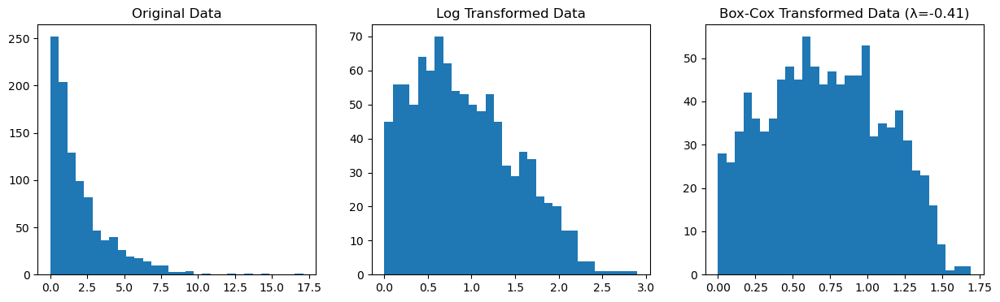

# 정규성을 얻기 위한 변수변환

자료가 정규성에서 크게 벗어나면 정규성 가정에 기대는 통계 방법이 더 이상 적절하지 않을 수 있다. 흔한 대응 가운데 하나는 변환을 적용해 자료를 더 정규에 가깝게 만드는 것이다.

## 흔한 변환

널리 쓰이는 변환은 다음과 같다.

**로그 변환**: 오른쪽으로 치우친 자료에 적합하다.

$$
X' = \log(X)
$$

**제곱근 변환**: 역시 오른쪽으로 치우친 자료에 쓰며, 특히 작은 값이 있을 때 유용하다.

$$
X' = \sqrt{X}
$$

**Box-Cox 변환**: 최적의 거듭제곱 모수 $\lambda$를 찾아 자료를 변환하는 더 유연한 변환이다.

$$
X' = \frac{X^\lambda - 1}{\lambda}, \quad \lambda \neq 0
$$

<div class="codebox" markdown>

**예제 1.** 로그 변환과 Box-Cox 변환

```python
import numpy as np
import matplotlib.pyplot as plt
from scipy.stats import boxcox

np.random.seed(0)

# 오른쪽으로 치우친 자료
skewed_data = np.random.exponential(scale=2, size=1000)

# 로그 변환. 1 을 더하는 것은 0 에 가까운 값에서 로그가 발산하는 것을
# 막기 위해서다. 이 자료는 양수이지만 0 에 아주 가까운 값이 섞여 있다.
log_transformed_data = np.log(skewed_data + 1)

# Box-Cox 는 로그를 포함하는 변환들의 한 묶음이고, 그중 자료를 가장
# 정규에 가깝게 만드는 lambda 를 스스로 고른다. lambda=0 이 곧 로그다.
boxcox_transformed_data, best_lambda = boxcox(skewed_data + 1)

# 셋을 나란히 놓고 어느 쪽이 더 대칭에 가까운지 본다.
fig, axs = plt.subplots(1, 3, figsize=(15, 4))
axs[0].hist(skewed_data, bins=30)
axs[0].set_title('Original Data')

axs[1].hist(log_transformed_data, bins=30)
axs[1].set_title('Log Transformed Data')

axs[2].hist(boxcox_transformed_data, bins=30)
axs[2].set_title(f'Box-Cox Transformed Data (λ={best_lambda:.2f})')

plt.show()
```

</div>



로그 변환과 Box-Cox 변환을 모두 치우친 자료에 적용했다. 변환의 효과를 왜도로 확인하면

| 자료 | 왜도 |
|---|---|
| 원자료(지수분포) | 2.0526 |
| 로그 변환 | 0.4914 |
| Box-Cox 변환 ($\hat\lambda = -0.41$) | **0.0747** |

원자료의 왜도 2.05가 로그 변환으로 0.49까지, 최대가능도로 $\lambda$를 고르는 Box-Cox 변환으로는 0.07까지 줄어든다. 이런 변환은 자료를 더 대칭적이고 정규에 가깝게 만들어 모수적 검정에 적합하게 해 준다.

## 연습문제

<div class="drillbox" markdown>

**연습문제 1.** <span class="diff med" title="중간"></span>
변수 $Y$가 모두 양수이고 오른쪽으로 치우친 분포를 갖는다. 로그 변환 $Y' = \log(Y)$를 적용하고 이것이 왜 치우침을 줄이는 경우가 많은지 설명하라.

</div>

??? success "풀이"
    로그함수는 오목하다. 큰 값을 작은 값보다 더 많이 압축한다. 오른쪽으로 치우친 자료에서는 긴 오른쪽 꼬리(큰 값)가 크게 압축되고 왼쪽(0 근처의 작은 값)은 늘어난다. 이것이 오른쪽 꼬리를 중심 쪽으로 끌어당겨 비대칭을 줄인다.

    형식적으로 $Y$가 대수정규분포를 따르면($\log Y \sim N(\mu, \sigma^2)$) 로그 변환이 완벽하게 정규인 자료를 만든다. 근사적으로 대수정규인 자료(소득, 주가, 생물학적 측정값에서 흔하다)에서도 로그 변환이 정규성을 크게 개선한다.

    주의: 로그 변환은 $Y \leq 0$에서 정의되지 않는다. 0이 있는 자료에는 작은 상수 $c$를 써서 $\log(Y + c)$를 쓴다.

<div class="drillbox" markdown>

**연습문제 2.** <span class="diff med" title="중간"></span>
Box-Cox 변환족은 $\lambda \neq 0$일 때 $Y^{(\lambda)} = (Y^\lambda - 1)/\lambda$, $\lambda = 0$일 때 $\log(Y)$이다. $\lambda = 1$, $\lambda = 0.5$, $\lambda = -1$은 각각 어떤 변환에 해당하는가?

</div>

??? success "풀이"

    - $\lambda = 1$: $Y^{(1)} = (Y - 1)/1 = Y - 1$ (선형 이동, 사실상 변환 없음).
    - $\lambda = 0.5$: $Y^{(0.5)} = (\sqrt{Y} - 1)/0.5 = 2(\sqrt{Y} - 1)$ (선형 재척도화를 제외하면 제곱근 변환).
    - $\lambda = 0$: $Y^{(0)} = \log(Y)$ (로그 변환).
    - $\lambda = -1$: $Y^{(-1)} = (1/Y - 1)/(-1) = 1 - 1/Y$ (선형 재척도화를 제외하면 역수 변환).

    최적 $\lambda$는 최대가능도로 고른다. 변환된 자료가 가장 정규에 가까워지는 $\lambda$를 찾는 것이다. Python에서는 보통 `scipy.stats.boxcox`로 수행한다.

<div class="drillbox" markdown>

**연습문제 3.** <span class="diff med" title="중간"></span>
오른쪽으로 치우친 자료에 로그 변환을 적용하면 회귀계수의 해석이 달라진다. 모형 $\log(Y) = \beta_0 + \beta_1 X + \varepsilon$에서 $\hat{\beta}_1$을 어떻게 해석하는지 설명하라.

</div>

??? success "풀이"
    로그-선형 모형에서 지수를 취하면 $Y = e^{\beta_0 + \beta_1 X + \varepsilon}$이다. $X$가 한 단위 늘면 $Y$의 기댓값에 $e^{\beta_1}$이 곱해진다.

    $$
    \frac{E[Y \mid X+1]}{E[Y \mid X]} \approx e^{\beta_1} \approx 1 + \beta_1 \quad (\beta_1\text{이 작을 때})
    $$

    따라서 $\beta_1$은 $X$가 한 단위 변할 때 $Y$의 비례적(백분율) 변화에 가깝다. 예를 들어 $\beta_1 = 0.05$이면 $X$가 1 늘 때 $Y$가 약 5% 늘어남과 연관된다.

    이 곱셈적 해석은 소득, 가격, 생물학적 성장 같은 여러 응용에서 자연스럽다.

<div class="drillbox" markdown>

**연습문제 4.** <span class="diff med" title="중간"></span>
정규성이 위배되어도 자료 변환이 권장되지 않는 상황을 두 가지 들어라.

</div>

??? success "풀이"

    1. **원래 척도가 과학적으로 의미 있을 때:** 연구 질문이 원래 단위의 차이에 관한 것이라면(예: "이 처치가 혈압을 최소 10 mmHg 낮추는가?") 자료를 변환하면 해석이 달라진다. 로그 척도의 10 차이는 10 mmHg가 아니다. 이럴 때는 원래 척도에서 타당한 방법(붓스트랩, 로버스트 방법)을 써야 한다.

    2. **변환이 해석을 어렵게 만들 때:** 0이 많은 변수(예: 의료비, 보험 청구)를 로그 변환하려면 임시방편적 조정($\log(Y+1)$)이 필요하고, 역변환한 추정값이 편향된다($\log Y$의 평균은 $Y$의 평균의 로그가 아니다). 이런 경우에는 일반화선형모형(감마 GLM, Tweedie 회귀)이 대개 더 낫다.

---

## 정리하며

변환은 **자료를 정규에 가깝게 만드는** 가장 직접적인 대처다.

- **로그는 오른쪽 치우침에 쓴다.** 곱셈적 구조를 덧셈적으로 바꾸므로 소득·가격·시간 자료에 잘 맞으며, 분산도 함께 안정된다.
- **제곱근은 계수 자료에 맞는다.** 포아송류에서 분산이 평균에 비례하므로 제곱근이 분산을 안정시킨다.
- **역수는 매우 강한 변환이다.** 극단적인 치우침에만 쓰며 순서가 뒤집힌다.
- **박스–콕스가 이들을 하나로 묶는다.** $\lambda$ 를 자료에서 추정하며 $\lambda=0$ 이 로그, $0.5$ 가 제곱근, $1$ 이 변환 없음이다. **양수 자료에만 쓸 수 있고**, 0 이나 음수가 있으면 여-존슨 변환으로 간다.
- **대가는 해석이다.** 로그 척도의 평균을 되돌리면 평균이 아니라 **중앙값**이 되며(4장), 계수의 뜻도 "배수 변화"로 바뀐다. **무엇을 얻고 무엇을 잃는지 따져야 한다.**

다음 절 **붓스트랩**으로 넘어간다.
