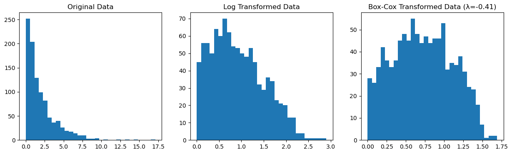

# 정규성을 얻기 위한 변수변환

자료가 정규성에서 크게 벗어나면 정규성 가정에 기대는 통계 방법이 더 이상 적절하지 않을 수 있다. 흔한 대응 가운데 하나는 변환을 적용해 자료를 더 정규에 가깝게 만드는 것이다.

## 흔한 변환

널리 쓰이는 변환은 다음과 같다.

**로그 변환**: 오른쪽으로 치우친 자료에 적합하다.

$$
X' = \log(X)
$$

**제곱근 변환**: 역시 오른쪽으로 치우친 자료에 쓰며, 특히 작은 값이 있을 때 유용하다.

$$
X' = \sqrt{X}
$$

**Box-Cox 변환**: 최적의 거듭제곱 모수 $\lambda$를 찾아 자료를 변환하는 더 유연한 변환이다.

$$
X' = \frac{X^\lambda - 1}{\lambda}, \quad \lambda \neq 0
$$

<div class="exbox" markdown>

**보기 1.** <span class="diff easy" title="쉬움"></span> 로그 변환과 Box-Cox 변환. 척도 $2$인 지수분포에서 $n = 1000$개를 뽑아 $\log(X+1)$과 $\text{Box-Cox}(X+1)$을 나란히 그린다.

**(1)** 지수분포의 왜도가 **척도와 무관하게 정확히 2**임을 보이시오. 이동 없이 $\log X$를 쓰면 왜도가 얼마가 되는지 닫힌 꼴로 구하시오.

**(2)** 코드는 로그와 Box-Cox 둘 다에 `+1`을 더한다. 이 이동 상수가 답을 얼마나 흔드는지 수로 보이시오.

**(3)** Box-Cox가 왜도를 $0.07$까지 떨어뜨렸다. 이 자료는 이제 정규라고 말할 수 있는가.

</div>

??? success "풀이"

    **(1) 해석적으로.** 왜도는 위치와 척도에 불변이므로 $X = sE$($E \sim \text{Exp}(1)$)라 쓰면 척도 $s$가 떨어져 나간다. $\text{Exp}(1)$의 적률은 $\mathbb{E}[E^k] = k!$이므로

    $$
    \mathbb{E}[E] = 1, \qquad \operatorname{Var}(E) = 2! - 1^2 = 1
    $$

    이고 3차 중심적률은

    $$
    \mathbb{E}[(E-1)^3] = \mathbb{E}[E^3] - 3\,\mathbb{E}[E]\,\mathbb{E}[E^2] + 2(\mathbb{E}[E])^3
    = 6 - 3 \times 1 \times 2 + 2 = 2
    $$

    이다. 따라서

    $$
    \gamma_1 = \frac{2}{1^{3/2}} = 2
    $$

    로 **정확히 2**이며, $s$가 들어오지 않는다.

    이동 없이 로그를 씌우면 어떻게 되는가. $\log X = \log s + \log E$이고 더해진 상수는 왜도를 바꾸지 않으므로 $\log E$만 보면 된다. 그 분포를 알아내기 위해 누적분포함수를 계산한다.

    $$
    P(-\log E \le t) = P(E \ge e^{-t}) = e^{-e^{-t}}
    $$

    오른쪽이 **표준 검벨분포**의 누적분포함수다. 곧 $-\log E$가 표준 검벨을 따르므로 $\log E$는 그것을 뒤집은 분포이고, 왜도의 부호도 뒤집힌다. 표준 검벨의 왜도가 $12\sqrt{6}\,\zeta(3)/\pi^3$이므로

    $$
    \gamma_1(\log X) = -\frac{12\sqrt{6}\,\zeta(3)}{\pi^3} = -1.1395
    $$

    이다. **이동 없는 로그는 과교정이다.** 왜도를 $+2$에서 0 으로 끌어내리는 것이 아니라 $-1.14$까지 밀어 보낸다. 절댓값이 절반 가까이 줄기는 하지만 부호가 뒤집힌다.

    **(2)–(3) 수치적으로.** 먼저 쪽의 코드를 그대로 돌린다.

    ```python
    import numpy as np
    import matplotlib.pyplot as plt
    from scipy.stats import boxcox

    np.random.seed(0)

    # 오른쪽으로 치우친 자료
    skewed_data = np.random.exponential(scale=2, size=1000)

    # 로그 변환. 1 을 더하는 것은 0 에 가까운 값에서 로그가 발산하는 것을
    # 막기 위해서다. 이 자료는 양수이지만 0 에 아주 가까운 값이 섞여 있다.
    log_transformed_data = np.log(skewed_data + 1)

    # Box-Cox 는 로그를 포함하는 변환들의 한 묶음이고, 그중 자료를 가장
    # 정규에 가깝게 만드는 lambda 를 스스로 고른다. lambda=0 이 곧 로그다.
    boxcox_transformed_data, best_lambda = boxcox(skewed_data + 1)

    # 셋을 나란히 놓고 어느 쪽이 더 대칭에 가까운지 본다.
    fig, axs = plt.subplots(1, 3, figsize=(15, 4))
    axs[0].hist(skewed_data, bins=30)
    axs[0].set_title('Original Data')

    axs[1].hist(log_transformed_data, bins=30)
    axs[1].set_title('Log Transformed Data')

    axs[2].hist(boxcox_transformed_data, bins=30)
    axs[2].set_title(f'Box-Cox Transformed Data (λ={best_lambda:.2f})')

    plt.show()
    ```

    

    그림은 치우침이 줄어드는 것을 보여 주지만 왜도도 첨도도 눈으로는 읽히지 않는다. 수로 재어야 한다.

    ```python
    import numpy as np
    from scipy import stats
    from scipy.optimize import brentq
    from scipy.special import zeta
    from scipy.stats import boxcox

    np.random.seed(0)
    x = np.random.exponential(scale=2, size=1000)
    n = len(x)

    print(f"이론 왜도(지수) = 2  (척도와 무관)")
    print(f"이론 왜도(log X) = -12 sqrt(6) zeta(3) / pi^3 = "
          f"{-12 * np.sqrt(6) * zeta(3) / np.pi ** 3:.4f}")

    # 쪽의 표는 scipy 기본값 bias=True, 곧 g1 이다. G1 도 함께 찍는다.
    y = np.log(x + 1)
    b, lam = boxcox(x + 1)
    print(f"Box-Cox lambda_hat = {lam:.4f}")
    print("                g1        G1      g2(초과)   shapiro p")
    for name, v in [("원자료", x), ("log(X+1)", y), ("BoxCox", b), ("log(X)", np.log(x))]:
        print(f"  {name:9s} {stats.skew(v):+8.4f}  {stats.skew(v, bias=False):+8.4f}  "
              f"{stats.kurtosis(v):+8.4f}   {stats.shapiro(v)[1]:.3g}")

    # 이동 상수 c 가 답을 얼마나 흔드는가.
    print("  이동 c    G1(log(X+c))")
    for c in [0.0, 0.25, 0.5, 1.0, 5.0, 20.0]:
        t = np.log(x + c) if c > 0 else np.log(x)
        print(f"  {c:6.2f}    {stats.skew(t, bias=False):+8.4f}")
    c0 = brentq(lambda c: stats.skew(np.log(x + c), bias=False), 0.01, 1.0)
    print(f"표본왜도를 0 으로 만드는 c = {c0:.4f}")

    SE = np.sqrt(6 * n * (n - 1) / ((n - 2) * (n + 1) * (n + 3)))
    print(f"정규 아래 SE(G1) = {SE:.4f}")
    print(f"  log(X+1): G1/SE = {stats.skew(y, bias=False) / SE:.3f}")
    print(f"  BoxCox  : G1/SE = {stats.skew(b, bias=False) / SE:.3f}")
    ```

    출력:

    ```text
    이론 왜도(지수) = 2  (척도와 무관)
    이론 왜도(log X) = -12 sqrt(6) zeta(3) / pi^3 = -1.1395
    Box-Cox lambda_hat = -0.4127
                    g1        G1      g2(초과)   shapiro p
      원자료        +2.0526   +2.0557   +6.4761   4.86e-33
      log(X+1)   +0.4914   +0.4921   -0.4931   8.47e-15
      BoxCox     +0.0747   +0.0748   -0.9237   3.33e-11
      log(X)     -1.0167   -1.0182   +1.9213   6.46e-18
      이동 c    G1(log(X+c))
        0.00     -1.0182
        0.25     -0.0049
        0.50     +0.2328
        1.00     +0.4921
        5.00     +1.1357
       20.00     +1.6261
    표본왜도를 0 으로 만드는 c = 0.2538
    정규 아래 SE(G1) = 0.0773
      log(X+1): G1/SE = 6.363
      BoxCox  : G1/SE = 0.967
    ```

    **(1)의 확인.** 원자료의 표본왜도는 $g_1 = 2.0526$으로 이론값 $2$를 잘 맞힌다. 이동 없는 $\log X$는 $G_1 = -1.0182$가 나왔는데 이론값은 $-1.1395$다. 차이 $0.12$가 커 보이지만, $n = 1000$에서 이 분포의 $G_1$은 표준편차가 $0.18$쯤이고 작은 표본에서 크기가 줄어드는 쪽으로 편향되므로 어긋남이 아니다. $n$을 $10^7$으로 키우면 $-1.1357$이 되어 이론값에 붙는다.

    !!! warning "어느 판본의 왜도인가"

        쪽의 표에 적힌 $2.0526$, $0.4914$, $0.0747$은 `scipy.stats.skew`의 **기본값 `bias=True`**가 주는 $g_1$이다. 보정판 $G_1$은 $2.0557$, $0.4921$, $0.0748$으로 셋째 자리에서 갈린다. 아래에서 $\mathrm{SE}$와 견줄 때는 그 $\mathrm{SE}$ 식이 **$G_1$의 것**이므로 $G_1$을 쓴다.

    **(2) 이동 상수가 답을 지배한다.** `+1` 은 코드 주석이 말하듯 0 에 가까운 값을 막으려는 장치이지만, 실제로는 **결과를 정하는 모수**로 작동한다.

    | $c$ | $G_1(\log(X+c))$ |
    |---|---|
    | $0$ | $-1.0182$ |
    | $0.25$ | $-0.0049$ |
    | $0.5$ | $+0.2328$ |
    | $1$ | $+0.4921$ |
    | $5$ | $+1.1357$ |
    | $20$ | $+1.6261$ |

    $c$를 $0$에서 $20$으로 옮기는 동안 왜도가 $-1.02$에서 $+1.63$까지 **연속으로 쓸고 지나간다.** $c$가 커지면 $\log(X+c) \approx \log c + X/c$로 거의 선형이 되어 원자료의 왜도 $2$로 돌아가므로 당연한 일이다. 곧 $c$는 "교정을 얼마나 할지"를 정하는 손잡이다.

    이 표본에서 왜도를 정확히 0 으로 만드는 값은 $c = 0.2538$이고, 코드가 고른 $c = 1$은 거기서 네 배 멀다. 그래서 $\log(X+1)$의 왜도 $0.4921$은 **$c$를 1 로 고른 결과**이지 로그변환의 성능이 아니다. 더 나쁜 것은 이 손잡이가 보고되지 않는다는 점이다. "로그변환을 했다"는 문장만 읽으면 $c$가 몇이었는지 알 수 없고, 다른 $c$로는 숫자가 재현되지 않는다. **이동 상수를 쓰면 반드시 그 값을 밝혀야 한다.**

    **(3) 아니다. 왜도가 0 에 가까워졌을 뿐 정규는 아니다.**

    왜도만 보면 Box-Cox가 훌륭하다. $2.05$에서 $0.075$로 27배 줄었고, $G_1/\mathrm{SE} = 0.967$이니 대칭성 자체는 나무랄 데가 없다($\log(X+1)$은 $6.363$으로 압도적으로 기각된다). 그런데 샤피로–윌크는

    $$
    p = 3.33 \times 10^{-11}
    $$

    으로 **정규성을 단호히 기각한다.** 원자료의 $4.86\times10^{-33}$보다는 나아졌지만 기각은 기각이다.

    까닭은 **첨도**다. 초과첨도 $g_2$를 보면 원자료 $+6.48$이 Box-Cox 뒤에 $-0.92$가 되었다. 부호를 건너 반대쪽으로 지나쳐 버린 것이고, 절댓값 $0.92$는 $n = 1000$에서 쉽게 잡히는 크기다. Box-Cox는 거듭제곱 하나로 꼬리를 누르는데, 지수분포의 오른쪽 꼬리를 정규만큼 눌러 놓으면 **왼쪽이 0 에서 잘려 평평해진다.** 변환된 자료는 종 모양이 아니라 어깨가 넓은 모양이다.

    더 근본적으로, **지수분포를 정규로 보내는 거듭제곱변환은 존재하지 않는다.** 로그정규는 로그 하나로 정확히 정규가 되지만(이 절의 「변환 시연」 쪽 보기 1) 지수분포에는 그런 짝이 없다. Box-Cox는 주어진 계열 안에서 **가장 덜 나쁜** $\lambda$를 고르는 것뿐이고, 가장 덜 나쁜 것이 좋다는 보장은 없다.

    그러므로 "이런 변환은 자료를 모수적 검정에 적합하게 해 준다"는 결론은 이 자료에서는 **성립하지 않는다.** 교훈은 **왜도 하나로 변환의 성공을 판정하지 말라**는 것이다. 왜도·첨도·정규성 검정을 함께 보아야 하고, 셋이 갈리면 그 자료는 변환으로 구제되지 않는 자료다. 이어지는 두 쪽의 붓스트랩과 비모수 방법이 그런 자료를 위해 있다.

## 연습문제

<div class="drillbox" markdown>

**연습문제 1.** <span class="diff med" title="중간"></span>
변수 $Y$가 모두 양수이고 오른쪽으로 치우친 분포를 갖는다. 로그 변환 $Y' = \log(Y)$를 적용하고 이것이 왜 치우침을 줄이는 경우가 많은지 설명하라.

</div>

??? success "풀이"
    로그함수는 오목하다. 큰 값을 작은 값보다 더 많이 압축한다. 오른쪽으로 치우친 자료에서는 긴 오른쪽 꼬리(큰 값)가 크게 압축되고 왼쪽(0 근처의 작은 값)은 늘어난다. 이것이 오른쪽 꼬리를 중심 쪽으로 끌어당겨 비대칭을 줄인다.

    형식적으로 $Y$가 대수정규분포를 따르면($\log Y \sim N(\mu, \sigma^2)$) 로그 변환이 완벽하게 정규인 자료를 만든다. 근사적으로 대수정규인 자료(소득, 주가, 생물학적 측정값에서 흔하다)에서도 로그 변환이 정규성을 크게 개선한다.

    주의: 로그 변환은 $Y \leq 0$에서 정의되지 않는다. 0이 있는 자료에는 작은 상수 $c$를 써서 $\log(Y + c)$를 쓴다.

<div class="drillbox" markdown>

**연습문제 2.** <span class="diff med" title="중간"></span>
Box-Cox 변환족은 $\lambda \neq 0$일 때 $Y^{(\lambda)} = (Y^\lambda - 1)/\lambda$, $\lambda = 0$일 때 $\log(Y)$이다. $\lambda = 1$, $\lambda = 0.5$, $\lambda = -1$은 각각 어떤 변환에 해당하는가?

</div>

??? success "풀이"

    - $\lambda = 1$: $Y^{(1)} = (Y - 1)/1 = Y - 1$ (선형 이동, 사실상 변환 없음).
    - $\lambda = 0.5$: $Y^{(0.5)} = (\sqrt{Y} - 1)/0.5 = 2(\sqrt{Y} - 1)$ (선형 재척도화를 제외하면 제곱근 변환).
    - $\lambda = 0$: $Y^{(0)} = \log(Y)$ (로그 변환).
    - $\lambda = -1$: $Y^{(-1)} = (1/Y - 1)/(-1) = 1 - 1/Y$ (선형 재척도화를 제외하면 역수 변환).

    최적 $\lambda$는 최대가능도로 고른다. 변환된 자료가 가장 정규에 가까워지는 $\lambda$를 찾는 것이다. Python에서는 보통 `scipy.stats.boxcox`로 수행한다.

<div class="drillbox" markdown>

**연습문제 3.** <span class="diff med" title="중간"></span>
오른쪽으로 치우친 자료에 로그 변환을 적용하면 회귀계수의 해석이 달라진다. 모형 $\log(Y) = \beta_0 + \beta_1 X + \varepsilon$에서 $\hat{\beta}_1$을 어떻게 해석하는지 설명하라.

</div>

??? success "풀이"
    로그-선형 모형에서 지수를 취하면 $Y = e^{\beta_0 + \beta_1 X + \varepsilon}$이다. $X$가 한 단위 늘면 $Y$의 기댓값에 $e^{\beta_1}$이 곱해진다.

    $$
    \frac{E[Y \mid X+1]}{E[Y \mid X]} \approx e^{\beta_1} \approx 1 + \beta_1 \quad (\beta_1\text{이 작을 때})
    $$

    따라서 $\beta_1$은 $X$가 한 단위 변할 때 $Y$의 비례적(백분율) 변화에 가깝다. 예를 들어 $\beta_1 = 0.05$이면 $X$가 1 늘 때 $Y$가 약 5% 늘어남과 연관된다.

    이 곱셈적 해석은 소득, 가격, 생물학적 성장 같은 여러 응용에서 자연스럽다.

<div class="drillbox" markdown>

**연습문제 4.** <span class="diff med" title="중간"></span>
정규성이 위배되어도 자료 변환이 권장되지 않는 상황을 두 가지 들어라.

</div>

??? success "풀이"

    1. **원래 척도가 과학적으로 의미 있을 때:** 연구 질문이 원래 단위의 차이에 관한 것이라면(예: "이 처치가 혈압을 최소 10 mmHg 낮추는가?") 자료를 변환하면 해석이 달라진다. 로그 척도의 10 차이는 10 mmHg가 아니다. 이럴 때는 원래 척도에서 타당한 방법(붓스트랩, 로버스트 방법)을 써야 한다.

    2. **변환이 해석을 어렵게 만들 때:** 0이 많은 변수(예: 의료비, 보험 청구)를 로그 변환하려면 임시방편적 조정($\log(Y+1)$)이 필요하고, 역변환한 추정값이 편향된다($\log Y$의 평균은 $Y$의 평균의 로그가 아니다). 이런 경우에는 일반화선형모형(감마 GLM, Tweedie 회귀)이 대개 더 낫다.

---

## 정리하며

변환은 **자료를 정규에 가깝게 만드는** 가장 직접적인 대처다.

- **로그는 오른쪽 치우침에 쓴다.** 곱셈적 구조를 덧셈적으로 바꾸므로 소득·가격·시간 자료에 잘 맞으며, 분산도 함께 안정된다.
- **제곱근은 계수 자료에 맞는다.** 포아송류에서 분산이 평균에 비례하므로 제곱근이 분산을 안정시킨다.
- **역수는 매우 강한 변환이다.** 극단적인 치우침에만 쓰며 순서가 뒤집힌다.
- **박스–콕스가 이들을 하나로 묶는다.** $\lambda$ 를 자료에서 추정하며 $\lambda=0$ 이 로그, $0.5$ 가 제곱근, $1$ 이 변환 없음이다. **양수 자료에만 쓸 수 있고**, 0 이나 음수가 있으면 여-존슨 변환으로 간다.
- **대가는 해석이다.** 로그 척도의 평균을 되돌리면 평균이 아니라 **중앙값**이 되며(4장), 계수의 뜻도 "배수 변화"로 바뀐다. **무엇을 얻고 무엇을 잃는지 따져야 한다.**

다음 절 **붓스트랩**으로 넘어간다.
