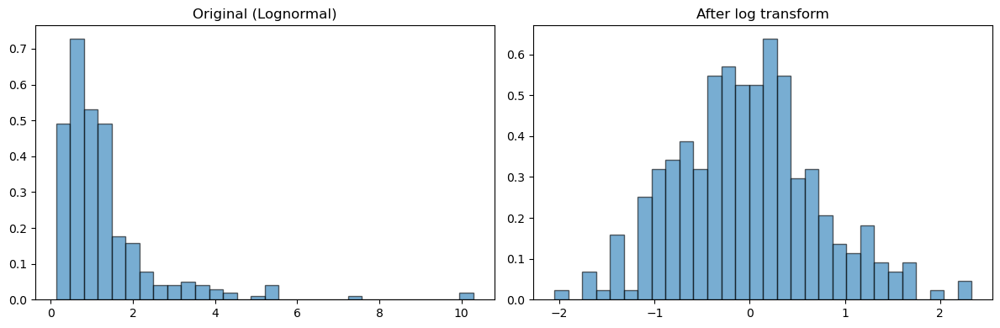
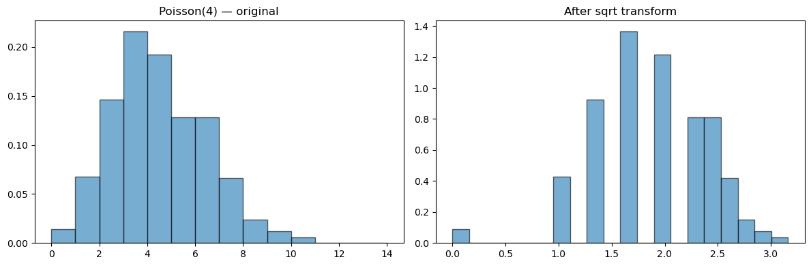

# 변환 시연

## 개요

자료가 정규분포를 따르지 않을 때 수학적 변환을 적용하면 정규성에 더 가까운 분포를 얻어 표준적인 모수적 절차를 쓸 수 있는 경우가 많다. 이 페이지는 흔히 쓰는 세 변환 계열(로그, 제곱근, Box-Cox)을 시연하고, 각각이 언제 적절한지 설명하며, 시각적·형식적 확인으로 개선 정도를 평가하는 방법을 보인다.

## 왜 변환하는가

많은 통계 방법($t$ 검정, 분산분석, 선형회귀 등)이 오차의 정규성을 가정한다. 자료가 오른쪽으로 치우쳐 있거나 분산이 일정하지 않을 때 적절한 변환은

1. 분포를 대칭으로 만들고,
2. 분산을 안정시키며,
3. 정규분포로의 근사를 개선한다.

## 로그 변환

양수이면서 오른쪽으로 치우친 자료에는 로그 변환이 가장 먼저 시도할 도구이다. $X > 0$일 때

$$
Y = \ln X.
$$

$X \sim \text{Lognormal}(\mu, \sigma^2)$이면 $Y \sim \mathcal{N}(\mu, \sigma^2)$가 정확히 성립한다. 분포가 정확히 대수정규가 아니더라도 로그 변환은 왜도를 크게 줄이는 경우가 많다.

<div class="codebox" markdown>

**예제 1.** 로그 변환 전후의 왜도

```python
import numpy as np
from scipy import stats
import matplotlib.pyplot as plt

# 로그정규는 로그를 씌우면 정확히 정규가 되는 분포다. 변환이 왜 듣는지를
# 보이기에 가장 깨끗한 예다.
rng = np.random.default_rng(42)
x = rng.lognormal(mean=0.0, sigma=0.8, size=300)
y = np.log(x)

fig, axes = plt.subplots(1, 2, figsize=(12, 4))
axes[0].hist(x, bins=30, density=True, alpha=0.6, edgecolor="black")
axes[0].set_title("Original (Lognormal)")
axes[1].hist(y, bins=30, density=True, alpha=0.6, edgecolor="black")
axes[1].set_title("After log transform")
plt.tight_layout()
plt.show()

print(f"Before: skewness = {stats.skew(x, bias=False):.4f}")
print(f"After:  skewness = {stats.skew(y, bias=False):.4f}")
```

출력:

```text
Before: skewness = 3.5432
After:  skewness = 0.2933
```



왜도가 $3.54$에서 $0.29$로 떨어졌다. 사실상 대칭이 되었다.

</div>

## 제곱근 변환

계수 자료나 아래로 0에 의해 유계인 자료에는 제곱근 변환

$$
Y = \sqrt{X}
$$

가 로그보다 온건한 교정이다. 분산이 평균과 같은 Poisson 계수 자료에 자주 쓰이며, 제곱근이 분산을 근사적으로 안정시킨다.

!!! warning "제곱근 변환은 과교정할 수 있다"
    Poisson 자료에서 제곱근 변환은 평균 $\lambda$가 작으면 왜도를 **음수 쪽으로 지나치게** 밀어붙인다. $\lambda = 4$일 때 원자료의 왜도는 $1/\sqrt{4} = 0.5$이지만 $\sqrt{X}$의 왜도는 $-0.636$으로 절댓값이 오히려 커진다. 연습문제 5에서 자세히 다룬다.

## Box-Cox 변환

Box-Cox 계열은 로그 변환과 거듭제곱 변환을 모수 $\lambda$ 하나로 일반화한다.

$$
Y^{(\lambda)} =
\begin{cases}
\dfrac{X^\lambda - 1}{\lambda}, & \lambda \neq 0, \\[6pt]
\ln X, & \lambda = 0.
\end{cases}
$$

최적 $\lambda$는 최대가능도로 고른다. SciPy의 `stats.boxcox`는 변환된 자료와 적합된 $\lambda$를 반환한다.

<div class="codebox" markdown>

**예제 2.** Box-Cox가 고르는 lambda

```python
import numpy as np
from scipy import stats

rng = np.random.default_rng(42)
x = rng.lognormal(mean=0.0, sigma=0.8, size=300)

# Box-Cox 가 고른 lambda 가 0 근처로 나오면 "로그를 씌우라"는 뜻이다.
# 자료가 로그정규이므로 실제로 그렇게 나온다.
y_bc, lam = stats.boxcox(x)
print(f"Optimal lambda: {lam:.4f}")

# 변환 전후의 왜도를 견준다.
print(f"Before Box-Cox: skewness = {stats.skew(x, bias=False):.4f}")
print(f"After  Box-Cox: skewness = {stats.skew(y_bc, bias=False):.4f}")
```

출력:

```text
Optimal lambda: -0.1258
Before Box-Cox: skewness = 3.5432
After  Box-Cox: skewness = -0.0018
```

자료가 대수정규이므로 참 최적값은 $\lambda = 0$(로그 변환)이고, 최대가능도 추정값 $-0.126$은 표집변동 범위 안에서 이를 잘 회복한다. $\hat{\lambda} \approx 0$이면 Box-Cox는 로그로, $\hat{\lambda} \approx 0.5$이면 제곱근으로 환원된다.

</div>

## 해석

변환한 뒤에는 반드시 시각적 방법(히스토그램, Q-Q 그림)과 형식적 검정(Shapiro-Wilk, Anderson-Darling)을 모두 써서 정규성을 다시 확인하라. 예컨대 치우침은 없앴지만 이봉성을 만들어 낸 변환은 상황을 개선한 것이 아니다. 또한 변환된 척도에서 수행한 추론은 원래 척도로 해석하려면 역변환해야 한다는 점을 기억하라.

## 연습문제

<div class="drillbox" markdown>

**연습문제 1.** <span class="diff easy" title="쉬움"></span> $\text{Lognormal}(0, 0.6)$ 분포에서 관측값 $n = 400$개를 생성하라. 로그 변환을 적용하고 원자료와 변환 자료 모두에 Shapiro-Wilk 검정을 수행하라. $p$값을 비교하라.

</div>

??? success "풀이"

    ```python
    import numpy as np
    from scipy import stats

    rng = np.random.default_rng(0)
    x = rng.lognormal(0, 0.6, size=400)

    _, p_orig = stats.shapiro(x)
    _, p_log = stats.shapiro(np.log(x))

    print(f"Original:        p = {p_orig:.4g}")
    print(f"Log-transformed: p = {p_log:.4g}")
    ```

    출력:

    ```text
    Original:        p = 2.989e-20
    Log-transformed: p = 0.3173
    ```

    원자료는 $p \approx 3 \times 10^{-20}$으로 압도적으로 기각된다. 로그 변환 후에는 $p = 0.317$로 정규성에 반하는 증거가 없다. $\ln X \sim \mathcal{N}(0, 0.36)$이 정확히 성립하므로 당연한 결과이다.

    다만 $p = 0.317$은 "정규성에 반하는 증거가 없다"는 뜻이지 "1에 가까우니 완벽히 정규"라는 뜻이 아니다. $H_0$이 참이면 $p$값은 $\text{Uniform}(0,1)$을 따르므로 0.317은 전형적인 값이다. $\square$

<div class="drillbox" markdown>

**연습문제 2.** <span class="diff easy" title="쉬움"></span> $\text{Gamma}(2, 1)$ 분포에서 뽑은 관측값 $n = 300$개에 Box-Cox 변환을 적용하라. 최적 $\hat{\lambda}$와 변환 자료의 Shapiro-Wilk $p$값을 보고하라.

</div>

??? success "풀이"

    ```python
    import numpy as np
    from scipy import stats

    rng = np.random.default_rng(1)
    x = rng.gamma(shape=2.0, scale=1.0, size=300)

    y_bc, lam = stats.boxcox(x)
    _, p_bc = stats.shapiro(y_bc)

    print(f"Optimal lambda: {lam:.4f}")
    print(f"Shapiro-Wilk p-value after Box-Cox: {p_bc:.4f}")
    ```

    출력:

    ```text
    Optimal lambda: 0.3637
    Shapiro-Wilk p-value after Box-Cox: 0.7376
    ```

    Gamma(2,1)은 중간 정도로 오른쪽으로 치우쳐 있다(이론적 왜도 $2/\sqrt{2} = 1.414$). 최적 $\hat{\lambda} = 0.364$는 세제곱근($1/3$)과 제곱근($1/2$) 사이에 있고, 변환 후 Shapiro-Wilk $p$값은 $0.74$로 0.05를 크게 넘는다. Box-Cox가 자료를 성공적으로 정규화했음을 뜻한다. $\square$

<div class="drillbox" markdown>

**연습문제 3.** <span class="diff med" title="중간"></span> Box-Cox 변환이 $X > 0$을 요구하는 이유를 설명하라. 자료에 0이나 음수가 포함될 때 어떤 수정을 쓸 수 있는가?

</div>

??? success "풀이"

    Box-Cox 공식 $Y^{(\lambda)} = (X^\lambda - 1)/\lambda$는 $X$를 임의의 실수 거듭제곱 $\lambda$로 올린다. $X \leq 0$이면 (정수가 아닌 $\lambda$에 대해) $X^\lambda$가 정의되지 않거나 복소수가 된다.

    자료에 0이나 음수가 있을 때 흔한 수정은 **이동된** Box-Cox 변환이다. 모든 관측값에 대해 $X + c > 0$이 되도록 상수 $c > 0$을 골라 $X + c$에 Box-Cox를 적용한다. 대안으로 **Yeo-Johnson** 변환은 $X \geq 0$과 $X < 0$에 서로 다른 공식을 써서 음수 자료를 직접 다룰 수 있도록 Box-Cox를 확장한다. SciPy에서는 `stats.yeojohnson`으로 쓸 수 있다. $\square$

<div class="drillbox" markdown>

**연습문제 4.** <span class="diff hard" title="어려움"></span> $\lambda \to 0$인 극한을 취하여 $\lambda = 0$인 Box-Cox 변환이 $Y = \ln X$로 환원됨을 증명하라.

</div>

??? success "풀이"

    $\lambda \neq 0$에 대해

    $$
    Y^{(\lambda)} = \frac{X^\lambda - 1}{\lambda} = \frac{e^{\lambda \ln X} - 1}{\lambda}.
    $$

    L'Hôpital 규칙을 적용한다(또는 $e^{\lambda \ln X} = 1 + \lambda \ln X + O(\lambda^2)$로 전개한다).

    $$
    \lim_{\lambda \to 0} \frac{e^{\lambda \ln X} - 1}{\lambda} = \lim_{\lambda \to 0} \frac{(\ln X)\, e^{\lambda \ln X}}{1} = \ln X.
    $$

    따라서 $Y^{(0)} = \ln X$이다. 이 연속성 덕분에 Box-Cox 계열이 $\lambda = 0$에서 매끄럽게 이어지고, 최대가능도로 $\lambda$를 최적화할 때 로그 변환이 자연스러운 극한으로 포함된다. $\square$

<div class="drillbox" markdown>

**연습문제 5.** <span class="diff easy" title="쉬움"></span> Poisson($\lambda = 4$) 관측값 $n = 500$개를 생성하라. 제곱근 변환을 적용하고 변환 전후의 표본왜도를 비교하라. 히스토그램을 나란히 그려라.

</div>

??? success "풀이"

    ```python
    import numpy as np
    from scipy import stats
    import matplotlib.pyplot as plt

    rng = np.random.default_rng(2)
    x = rng.poisson(lam=4, size=500)
    y = np.sqrt(x)

    print(f"Original skewness: {stats.skew(x, bias=False):.4f}")
    print(f"Sqrt skewness:     {stats.skew(y, bias=False):.4f}")
    print(f"Var(sqrt(X)):      {y.var(ddof=1):.4f}")

    fig, axes = plt.subplots(1, 2, figsize=(12, 4))
    axes[0].hist(x, bins=range(15), density=True, alpha=0.6, edgecolor="black")
    axes[0].set_title("Poisson(4) — original")
    axes[1].hist(y, bins=20, density=True, alpha=0.6, edgecolor="black")
    axes[1].set_title("After sqrt transform")
    plt.tight_layout()
    plt.show()
    ```

    출력:

    ```text
    Original skewness: 0.4223
    Sqrt skewness:     -0.5880
    Var(sqrt(X)):      0.2823
    ```

    

    **여기서 제곱근 변환은 실패한다.** 원자료의 왜도 $+0.42$(이론값 $1/\sqrt{4} = 0.5$)가 변환 후 $-0.59$가 되었다. 부호가 뒤집혔을 뿐 아니라 절댓값도 커졌다. 제곱근이 왼쪽 꼬리를 지나치게 압축한 **과교정**이다.

    이유는 $\lambda = 4$가 작아서 $X = 0, 1$ 근처에 무시할 수 없는 확률질량이 있고, 그 구간에서 $\sqrt{\cdot}$의 기울기가 급격히 변하기 때문이다. $\lambda$가 커지면 문제가 사라진다.

    | $\lambda$ | 원자료 왜도 $1/\sqrt{\lambda}$ | $\sqrt{X}$의 왜도 | $\operatorname{Var}(\sqrt{X})$ |
    |---|---|---|---|
    | 4 | 0.500 | $-0.636$ | 0.306 |
    | 9 | 0.333 | $-0.218$ | 0.263 |
    | 25 | 0.200 | $-0.107$ | 0.254 |
    | 100 | 0.100 | $-0.051$ | 0.251 |

    분산 안정화 성질 $\operatorname{Var}(\sqrt{X}) \approx 1/4$는 $\lambda$와 무관하게 잘 성립한다($\lambda = 4$에서 0.306, $\lambda = 100$에서 0.251). 곧 제곱근 변환은 **분산 안정화에는 성공하지만 작은 $\lambda$에서 대칭화에는 실패한다**. 두 목적을 혼동하지 말아야 한다.

    작은 $\lambda$에서 대칭성이 필요하다면 Anscombe 변환 $2\sqrt{X + 3/8}$($\lambda = 4$에서 왜도 $-0.251$)이나 Wilson-Hilferty 계열의 $X^{2/3}$(왜도 $-0.117$)이 더 낫다. $\square$

---

## 정리하며

변환을 **적용하고 그 효과를 확인**하는 절차를 밟았다.

- **변환 전후를 반드시 비교한다.** 히스토그램·Q-Q 그림과 왜도·첨도 값, 그리고 정규성 검정을 나란히 놓아 개선 여부를 판단한다.
- **박스–콕스의 $\lambda$ 는 최대가능도로 추정된다.** `scipy.stats.boxcox` 가 최적 $\lambda$ 와 변환된 자료를 함께 돌려주며, **추정된 $\lambda$ 가 0 이나 0.5 근처면 해석하기 쉬운 로그·제곱근으로 반올림**하는 것이 관례다.
- **양수 제약을 확인한다.** 0 이나 음수가 있으면 상수를 더하거나 여–존슨으로 가야 하며, **상수를 더하는 선택이 결과를 바꾼다**는 점에 유의한다.
- **변환이 항상 통하지는 않는다.** 이봉분포나 이산성이 강한 자료는 어떤 변환으로도 정규가 되지 않으며, 그때는 부트스트랩이나 비모수로 옮긴다.
- **되돌릴 때를 대비한다.** 예측값과 구간을 원래 척도로 보고하려면 역변환이 필요하고, 그 과정에서 평균이 중앙값이 된다는 점을 밝혀야 한다.

다음 절 **응용 개관**으로 14장을 마무리한다.
