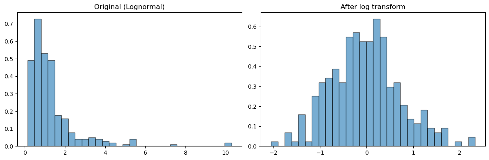
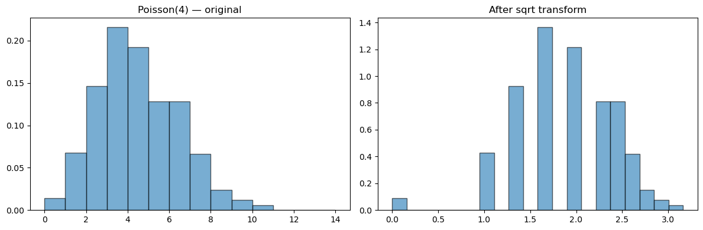

# 변환 시연

## 개요

자료가 정규분포를 따르지 않을 때 수학적 변환을 적용하면 정규성에 더 가까운 분포를 얻어 표준적인 모수적 절차를 쓸 수 있는 경우가 많다. 이 페이지는 흔히 쓰는 세 변환 계열(로그, 제곱근, Box-Cox)을 시연하고, 각각이 언제 적절한지 설명하며, 시각적·형식적 확인으로 개선 정도를 평가하는 방법을 보인다.

---

## 1. 왜 변환하는가

많은 통계 방법($t$ 검정, 분산분석, 선형회귀 등)이 오차의 정규성을 가정한다. 자료가 오른쪽으로 치우쳐 있거나 분산이 일정하지 않을 때 적절한 변환은

1. 분포를 대칭으로 만들고,
2. 분산을 안정시키며,
3. 정규분포로의 근사를 개선한다.

---

## 2. 로그 변환

양수이면서 오른쪽으로 치우친 자료에는 로그 변환이 가장 먼저 시도할 도구이다. $X > 0$일 때

$$
Y = \ln X.
$$

$X \sim \text{Lognormal}(\mu, \sigma^2)$이면 $Y \sim \mathcal{N}(\mu, \sigma^2)$가 정확히 성립한다. 분포가 정확히 대수정규가 아니더라도 로그 변환은 왜도를 크게 줄이는 경우가 많다.

<div class="exbox" markdown>

**보기 1.** <span class="diff easy" title="쉬움"></span> 로그 변환 전후의 왜도. $X \sim \text{Lognormal}(0,\ 0.8^2)$에서 $n = 300$개를 뽑아 $Y = \ln X$를 만든다.

**(1)** $\text{Lognormal}(\mu, \sigma^2)$의 왜도를 **닫힌 꼴로 유도**하고 $\sigma = 0.8$에서의 값을 구하시오. 답이 $\mu$에 의존하는가. 로그를 씌운 뒤의 이론 왜도는 얼마인가.

**(2)** 변환 뒤의 표본왜도가 $G_1 = 0.2933$으로 나왔다. 이론값이 **정확히 0**인데도 이만큼 남았다. 정규성 아래의 $\mathrm{SE}(G_1)$을 구해 이 잔차가 우연으로 설명되는 크기인지 판정하시오. 같은 자료에 샤피로–윌크를 걸면 결론이 같은가.

</div>

??? success "풀이"

    **(1) 해석적으로.** $X = e^{\mu + \sigma Z}$, $Z \sim \mathcal{N}(0,1)$로 쓴다. 왜도는 위치와 척도에 불변이므로 $\mu$는 $e^\mu$라는 **곱하는 상수**로만 들어가고 답에서 떨어져 나간다. 따라서 $W = e^{\sigma Z}$만 보면 된다.

    적률생성함수를 쓰면 $\mathbb{E}[W^k] = \mathbb{E}[e^{k\sigma Z}] = e^{k^2\sigma^2/2}$이다. $w = e^{\sigma^2}$으로 줄여 쓰면

    $$
    \mathbb{E}[W] = w^{1/2}, \qquad \mathbb{E}[W^2] = w^{2}, \qquad \mathbb{E}[W^3] = w^{9/2}
    $$

    이다. 분산은

    $$
    \operatorname{Var}(W) = w^2 - w = w(w-1)
    $$

    이고, 3차 중심적률은

    $$
    \mathbb{E}[(W - \mathbb{E}W)^3] = \mathbb{E}[W^3] - 3\,\mathbb{E}[W]\,\mathbb{E}[W^2] + 2(\mathbb{E}W)^3
    = w^{9/2} - 3w^{5/2} + 2w^{3/2}
    = w^{3/2}\bigl(w^3 - 3w + 2\bigr)
    $$

    이다. 괄호를 인수분해하면 $w^3 - 3w + 2 = (w-1)(w^2 + w - 2) = (w-1)^2(w+2)$이므로

    $$
    \gamma_1 = \frac{w^{3/2}(w-1)^2(w+2)}{\bigl[w(w-1)\bigr]^{3/2}}
    = \frac{w^{3/2}(w-1)^2(w+2)}{w^{3/2}(w-1)^{3/2}}
    = (w+2)\sqrt{w-1}
    $$

    을 얻는다. **$\mu$는 들어오지 않는다.** $\sigma$ 하나가 로그정규의 모양을 다 정한다.

    $\sigma = 0.8$이면 $w = e^{0.64} = 1.896481$이므로

    $$
    \gamma_1 = (1.896481 + 2)\sqrt{0.896481} = 3.896481 \times 0.946826 = 3.6893
    $$

    이다. **로그를 씌운 뒤의 이론 왜도는 정확히 0이다.** 근사가 아니다. $\ln X = \mu + \sigma Z$가 그 자체로 $\mathcal{N}(\mu, \sigma^2)$이고, 정규분포의 왜도는 0이기 때문이다. 이것이 로그정규가 변환의 교과서적 예인 까닭이다. 변환이 "왜도를 줄인다"가 아니라 **없앤다.**

    **(2) 수치적으로.** 먼저 쪽의 코드를 그대로 돌린다.

    ```python
    import numpy as np
    from scipy import stats
    import matplotlib.pyplot as plt

    # 로그정규는 로그를 씌우면 정확히 정규가 되는 분포다. 변환이 왜 듣는지를
    # 보이기에 가장 깨끗한 예다.
    rng = np.random.default_rng(42)
    x = rng.lognormal(mean=0.0, sigma=0.8, size=300)
    y = np.log(x)

    fig, axes = plt.subplots(1, 2, figsize=(12, 4))
    axes[0].hist(x, bins=30, density=True, alpha=0.6, edgecolor="black")
    axes[0].set_title("Original (Lognormal)")
    axes[1].hist(y, bins=30, density=True, alpha=0.6, edgecolor="black")
    axes[1].set_title("After log transform")
    plt.tight_layout()
    plt.show()

    print(f"Before: skewness = {stats.skew(x, bias=False):.4f}")
    print(f"After:  skewness = {stats.skew(y, bias=False):.4f}")
    ```

    출력:

    ```text
    Before: skewness = 3.5432
    After:  skewness = 0.2933
    ```

    

    이제 남은 $0.2933$을 재어 본다.

    ```python
    import numpy as np
    from scipy import stats

    sigma = 0.8
    w = np.exp(sigma ** 2)
    print(f"w = exp(sigma^2) = {w:.6f}")
    print(f"이론 왜도 (w+2)sqrt(w-1) = {(w + 2) * np.sqrt(w - 1):.4f}")

    rng = np.random.default_rng(42)
    x = rng.lognormal(mean=0.0, sigma=sigma, size=300)
    y = np.log(x)
    n = len(x)

    # bias=False 가 G1, bias=True(기본값) 가 g1 이다. 아래 SE 는 G1 의 것이다.
    G1 = stats.skew(y, bias=False)
    g1 = stats.skew(y)
    SE = np.sqrt(6 * n * (n - 1) / ((n - 2) * (n + 1) * (n + 3)))
    print(f"변환 뒤  G1 = {G1:.4f}   g1 = {g1:.4f}")
    print(f"정규 아래 SE(G1) = {SE:.4f}   G1/SE = {G1 / SE:.4f}")
    print(f"skewtest:  z = {stats.skewtest(y)[0]:.4f}  p = {stats.skewtest(y)[1]:.4f}")
    print(f"shapiro :  W = {stats.shapiro(y)[0]:.4f}  p = {stats.shapiro(y)[1]:.4f}")
    print(f"변환 뒤 표본평균 {y.mean():.4f}, 표본표준편차 {y.std(ddof=1):.4f}  (이론 0, {sigma})")
    ```

    출력:

    ```text
    w = exp(sigma^2) = 1.896481
    이론 왜도 (w+2)sqrt(w-1) = 3.6893
    변환 뒤  G1 = 0.2933   g1 = 0.2918
    정규 아래 SE(G1) = 0.1407   G1/SE = 2.0842
    skewtest:  z = 2.0725  p = 0.0382
    shapiro :  W = 0.9927  p = 0.1515
    변환 뒤 표본평균 -0.0329, 표본표준편차 0.7442  (이론 0, 0.8)
    ```

    **(1)의 확인.** 유도한 이론 왜도 $3.6893$에 대해 표본값은 $G_1 = 3.5432$다. 차이 $0.146$은 $4\%$ 아래이고, 왜도가 큰 분포에서 $G_1$의 변동이 크다는 점을 생각하면 잘 맞는 편이다. 변환 뒤 표본평균 $-0.0329$와 표본표준편차 $0.7442$도 이론값 $0$과 $0.8$을 둘러싸고 있다.

    **(2) 우연으로 설명되는 크기이지만, 5% 수준에서는 기각된다.** $n = 300$에서

    $$
    \mathrm{SE}(G_1) = \sqrt{\frac{6n(n-1)}{(n-2)(n+1)(n+3)}}
    = \sqrt{\frac{6 \times 300 \times 299}{298 \times 301 \times 303}}
    = \sqrt{\frac{538200}{27\,178\,494}} = 0.1407
    $$

    이므로 $G_1/\mathrm{SE} = 0.2933/0.1407 = 2.084$다. `scipy.stats.skewtest`는 여기에 다고스티노 변환을 한 번 더 거쳐 $z = 2.0725$, $p = 0.0382$를 준다(둘이 조금 다른 것은 단순 $z$ 대신 변환된 통계량을 쓰기 때문이다). **$p = 0.038 < 0.05$이니 대칭성이 기각된다.**

    !!! warning "어느 판본의 왜도인가"

        위 $\mathrm{SE}$ 식은 **보정판 $G_1$의 것**이다. 쪽의 코드가 `bias=False`를 주었으므로 $G_1 = 0.2933$과 짝이 맞는다. `scipy.stats.skew`의 **기본값은 `bias=True`**여서 $g_1 = 0.2918$을 주는데, 이 값에 위 $\mathrm{SE}$를 그대로 쓰면 안 된다. 어느 판본인지 밝히지 않으면 수가 맞지 않는다.

    여기서 멈추면 이상한 결론에 이른다. **변환은 정확히 옳았다.** (1)에서 보았듯 $\ln X$는 근사적으로가 아니라 **정확히** 정규다. 그런데도 그 정규 자료의 왜도 검정이 5% 수준에서 기각한다. 이것은 변환의 결함이 아니라 **$H_0$이 참일 때 20번에 한 번 일어나는 일**이고, 씨앗 42가 그 한 번에 걸린 것이다.

    같은 자료에 샤피로–윌크를 걸면 $W = 0.9927$, $p = 0.1515$로 **기각하지 못한다.** 두 검정의 결론이 갈린다. 샤피로–윌크는 분포 전체의 모양을 보므로 왜도 하나에 몰린 신호를 희석하고, 왜도검정은 그 하나만 겨냥하므로 증폭한다. 어느 쪽이 "맞는"가를 묻는 것은 잘못된 질문이다. 참인 답을 아는 이 인공 상황에서는 **둘 다 틀렸다.** 샤피로–윌크가 우연히 옳은 결론에 닿았을 뿐이다.

    그러므로 $3.54 \to 0.29$를 "사실상 대칭이 되었다"고 읽는 것은 **크기에 대해서는 옳다.** 왜도가 12배 줄었고 남은 $0.29$는 이론값 0에서 두 표준오차 거리에 있는 표집잡음이다. 그러나 "그러므로 검정을 통과한다"로 이어서는 안 된다. **옳은 변환도 그 표본의 검정을 통과하지 못할 수 있다.**

---

## 3. 제곱근 변환

계수 자료나 아래로 0에 의해 유계인 자료에는 제곱근 변환

$$
Y = \sqrt{X}
$$

가 로그보다 온건한 교정이다. 분산이 평균과 같은 포아송 계수 자료에 자주 쓰이며, 제곱근이 분산을 근사적으로 안정시킨다.

!!! warning "제곱근 변환은 과교정할 수 있다"
    포아송 자료에서 제곱근 변환은 평균 $\lambda$가 작으면 왜도를 **음수 쪽으로 지나치게** 밀어붙인다. $\lambda = 4$일 때 원자료의 왜도는 $1/\sqrt{4} = 0.5$이지만 $\sqrt{X}$의 왜도는 $-0.636$으로 절댓값이 오히려 커진다. 연습문제 3에서 자세히 다룬다.

---

## 4. Box-Cox 변환

Box-Cox 계열은 로그 변환과 거듭제곱 변환을 모수 $\lambda$ 하나로 일반화한다.

$$
Y^{(\lambda)} =
\begin{cases}
\dfrac{X^\lambda - 1}{\lambda}, & \lambda \neq 0, \\[6pt]
\ln X, & \lambda = 0.
\end{cases}
$$

최적 $\lambda$는 최대가능도로 고른다. SciPy의 `stats.boxcox`는 변환된 자료와 적합된 $\lambda$를 반환한다.

<div class="exbox" markdown>

**보기 2.** <span class="diff easy" title="쉬움"></span> Box-Cox가 고르는 lambda. 보기 1과 **같은 표본**($\text{Lognormal}(0,\ 0.8^2)$에서 $n = 300$, 씨앗 42)에 `stats.boxcox`를 걸면 $\hat\lambda = -0.1258$이 나온다. 참값은 $\lambda = 0$이다.

**(1)** $\hat\lambda = -0.1258$이 참값 $0$을 "잘 회복했다"고 말할 수 있는지 **가능도비 신뢰구간으로 판정**하시오. $\lambda = 0$을 가능도비검정으로 직접 검정하면 어떻게 되는가.

**(2)** 변환 뒤 표본왜도가 $-0.0018$로, 참값 $\lambda = 0$을 썼을 때의 $0.2933$(보기 1)보다 **0에 가깝다.** 참값보다 추정값이 더 좋아 보이는 까닭을 설명하시오.

</div>

??? success "풀이"

    **(1) 회복했다고 말하기 어렵다. 95% 구간이 0을 간신히 놓친다.**

    박스–콕스의 $\lambda$에는 닫힌 꼴 표준오차가 없으므로 **가능도비**로 구간을 만든다. 프로파일 로그가능도 $\ell(\lambda)$에 대해

    $$
    \bigl\{\lambda : 2\bigl[\ell(\hat\lambda) - \ell(\lambda)\bigr] \le \chi^2_{1,\,0.95}\bigr\}
    = \bigl\{\lambda : 2\bigl[\ell(\hat\lambda) - \ell(\lambda)\bigr] \le 3.8415\bigr\}
    $$

    가 95% 구간이다. `stats.boxcox`에 `alpha=0.05`를 주면 이 구간을 바로 돌려준다.

    ```python
    import numpy as np
    from scipy import stats

    rng = np.random.default_rng(42)
    x = rng.lognormal(mean=0.0, sigma=0.8, size=300)

    # alpha 를 주면 lambda 의 가능도비 신뢰구간을 함께 돌려준다.
    y_bc, lam, ci = stats.boxcox(x, alpha=0.05)
    print(f"lambda_hat = {lam:.4f}")
    print(f"95% 가능도비 신뢰구간 = [{ci[0]:.4f}, {ci[1]:.4f}]")
    print(f"0 이 구간 안에 있는가: {ci[0] < 0 < ci[1]}")

    # 가능도비 검정으로 lambda = 0 을 직접 검정한다.
    ll_hat = stats.boxcox_llf(lam, x)
    ll_0 = stats.boxcox_llf(0.0, x)
    LR = 2 * (ll_hat - ll_0)
    print(f"loglik(lambda_hat) = {ll_hat:.4f},  loglik(0) = {ll_0:.4f}")
    print(f"LR = {LR:.4f}   임계값 chi2(1, 0.95) = {stats.chi2.ppf(0.95, 1):.4f}")

    # lambda 를 바꿔 가며 왜도와 샤피로 p 를 본다.
    print("  lambda      G1     shapiro p   로그가능도")
    for L in [-0.2, -0.1258, -0.1, 0.0, 0.1]:
        t = stats.boxcox(x, lmbda=L)
        print(f"  {L:+7.4f}  {stats.skew(t, bias=False):+7.4f}   "
              f"{stats.shapiro(t)[1]:8.4f}   {stats.boxcox_llf(L, x):9.4f}")

    # 표본왜도를 정확히 0 으로 만드는 lambda 를 따로 찾는다.
    from scipy.optimize import brentq
    lam_sym = brentq(lambda L: stats.skew(stats.boxcox(x, lmbda=L), bias=False),
                     -0.5, 0.3)
    print(f"표본왜도를 0 으로 만드는 lambda = {lam_sym:.4f}")
    ```

    출력:

    ```text
    lambda_hat = -0.1258
    95% 가능도비 신뢰구간 = [-0.2496, -0.0035]
    0 이 구간 안에 있는가: False
    loglik(lambda_hat) = 101.0194,  loglik(0) = 98.9864
    LR = 4.0661   임계값 chi2(1, 0.95) = 3.8415
      lambda      G1     shapiro p   로그가능도
      -0.2000  -0.1713     0.6482    100.3258
      -0.1258  -0.0019     0.9284    101.0194
      -0.1000  +0.0577     0.8974    100.9348
      +0.0000  +0.2933     0.1515     98.9864
      +0.1000  +0.5384     0.0009     94.4061
    표본왜도를 0 으로 만드는 lambda = -0.1250
    ```

    95% 구간은 $[-0.2496,\ -0.0035]$이고 **$0$은 그 안에 없다.** 위쪽 끝이 $-0.0035$이니 $0.0035$ 차이로 벗어난 것이다. 가능도비검정도 같은 말을 한다. $2[\ell(\hat\lambda) - \ell(0)] = 2(101.0194 - 98.9864) = 4.0661$이 임계값 $3.8415$를 넘으므로 **$\lambda = 0$이 5% 수준에서 기각된다.**

    참값이 정확히 0인데 기각되었다. 보기 1에서 본 것과 **똑같은 일**이며, 우연이 아니라 같은 원인이다. 그 표본의 로그변환 자료에 오른쪽 치우침 $G_1 = 0.2933$이 표집잡음으로 남아 있었고, 약간 음수인 $\lambda$가 오른쪽 꼬리를 한 번 더 눌러 그 잡음을 지운다. 두 보기는 같은 흔들림을 서로 다른 창으로 본 것이다. $H_0$이 참일 때 20번에 한 번 일어나는 일이고 씨앗 42가 그 한 번이다.

    그래서 "$-0.126$이 0을 잘 회복했다"는 말은 **크기에 대해서만 옳다.** $0$과 $-0.126$의 차이는 실무적으로 무의미하고, 쪽 끝의 관례대로 $\hat\lambda$를 0으로 반올림해 해석 가능한 로그변환을 쓰는 것이 옳은 선택이다. 그러나 **"95% 구간이 0을 담는다"는 뜻으로 읽으면 틀린다.** 담지 않는다.

    **(2) 추정값이 참값보다 좋아 보이는 것은 과적합이다.** $\hat\lambda$는 바로 **이 표본의** 정규가능도를 최대로 만드는 값이다. 참값 $\lambda = 0$은 *모집단*에 대해 옳지만, 손에 든 표본 하나에 대해 가장 잘 맞는 값은 아니다. 표를 보면 차이가 분명하다.

    | $\lambda$ | $G_1$ | 샤피로 $p$ | 로그가능도 |
    |---|---|---|---|
    | $-0.1258 = \hat\lambda$ | $-0.0019$ | $0.9284$ | $101.0194$ |
    | $0$ (참값) | $+0.2933$ | $0.1515$ | $98.9864$ |

    $\hat\lambda$ 쪽이 왜도는 0에 $150$배 가깝고 샤피로 $p$는 6배 크다. **모든 지표에서 참값을 이긴다.** 그러나 이긴 상대는 모집단이 아니라 표본이다. 새 표본 300개를 뽑아 이 $\hat\lambda = -0.1258$을 그대로 쓰면 평균적으로 $\lambda = 0$보다 나쁠 것인데, $-0.1258$은 지난 표본의 잡음에 맞춰진 값이기 때문이다.

    표가 하나 더 보여 주는 것이 있다. 왜도를 정확히 0으로 만드는 $\lambda$는 $-0.1250$으로 $\hat\lambda = -0.1258$과 거의 같다. 이 표본에서는 **최대가능도가 고른 $\lambda$와 표본왜도를 지우는 $\lambda$가 사실상 일치한다.** 다만 이것은 이 표본에서 관측된 일치일 뿐 일반 법칙이 아니다. 박스–콕스는 왜도만 보는 것이 아니라 분포 전체의 정규가능도를 보기 때문이다.

    **교훈.** $\hat\lambda$를 고르고 나서 같은 자료에 정규성 검정을 걸면 $p$값이 낙관적으로 나온다. $\lambda$를 추정하는 데 자료를 이미 썼으므로 그 검정은 더 이상 명목 크기를 지키지 않는다. 14.4절 릴리에포르 검정이 다루는 문제와 같은 구조다. **모수를 추정하고 나면 검정의 귀무분포가 달라진다.**

자료가 대수정규이므로 참 최적값은 $\lambda = 0$(로그 변환)이고, 최대가능도 추정값 $-0.126$은 표집변동 범위 안에서 이를 잘 회복한다. $\hat{\lambda} \approx 0$이면 Box-Cox는 로그로, $\hat{\lambda} \approx 0.5$이면 제곱근으로 환원된다.

---

## 5. 해석

변환한 뒤에는 반드시 시각적 방법(히스토그램, Q-Q 그림)과 형식적 검정(Shapiro-Wilk, Anderson-Darling)을 모두 써서 정규성을 다시 확인하라. 예컨대 치우침은 없앴지만 이봉성을 만들어 낸 변환은 상황을 개선한 것이 아니다. 또한 변환된 척도에서 수행한 추론은 원래 척도로 해석하려면 역변환해야 한다는 점을 기억하라.

---

## 연습문제

<div class="drillbox" markdown>

**연습문제 1.** <span class="diff easy" title="쉬움"></span> $\text{Lognormal}(0, 0.6)$ 분포에서 관측값 $n = 400$개를 생성하라. 로그 변환을 적용하고 원자료와 변환 자료 모두에 Shapiro-Wilk 검정을 수행하라. $p$값을 비교하라.

</div>

??? success "풀이"

    ```python
    import numpy as np
    from scipy import stats

    rng = np.random.default_rng(0)
    x = rng.lognormal(0, 0.6, size=400)

    _, p_orig = stats.shapiro(x)
    _, p_log = stats.shapiro(np.log(x))

    print(f"Original:        p = {p_orig:.4g}")
    print(f"Log-transformed: p = {p_log:.4g}")
    ```

    출력:

    ```text
    Original:        p = 2.989e-20
    Log-transformed: p = 0.3173
    ```

    원자료는 $p \approx 3 \times 10^{-20}$으로 압도적으로 기각된다. 로그 변환 후에는 $p = 0.317$로 정규성에 반하는 증거가 없다. $\ln X \sim \mathcal{N}(0, 0.36)$이 정확히 성립하므로 당연한 결과이다.

    다만 $p = 0.317$은 "정규성에 반하는 증거가 없다"는 뜻이지 "1에 가까우니 완벽히 정규"라는 뜻이 아니다. $H_0$이 참이면 $p$값은 $\text{Uniform}(0,1)$을 따르므로 0.317은 전형적인 값이다. $\square$

---

<div class="drillbox" markdown>

**연습문제 2.** <span class="diff easy" title="쉬움"></span> $\text{Gamma}(2, 1)$ 분포에서 뽑은 관측값 $n = 300$개에 Box-Cox 변환을 적용하라. 최적 $\hat{\lambda}$와 변환 자료의 Shapiro-Wilk $p$값을 보고하라.

</div>

??? success "풀이"

    ```python
    import numpy as np
    from scipy import stats

    rng = np.random.default_rng(1)
    x = rng.gamma(shape=2.0, scale=1.0, size=300)

    y_bc, lam = stats.boxcox(x)
    _, p_bc = stats.shapiro(y_bc)

    print(f"Optimal lambda: {lam:.4f}")
    print(f"Shapiro-Wilk p-value after Box-Cox: {p_bc:.4f}")
    ```

    출력:

    ```text
    Optimal lambda: 0.3637
    Shapiro-Wilk p-value after Box-Cox: 0.7376
    ```

    Gamma(2,1)은 중간 정도로 오른쪽으로 치우쳐 있다(이론적 왜도 $2/\sqrt{2} = 1.414$). 최적 $\hat{\lambda} = 0.364$는 세제곱근($1/3$)과 제곱근($1/2$) 사이에 있고, 변환 후 Shapiro-Wilk $p$값은 $0.74$로 0.05를 크게 넘는다. Box-Cox가 자료를 성공적으로 정규화했음을 뜻한다. $\square$

---

<div class="drillbox" markdown>

**연습문제 3.** <span class="diff easy" title="쉬움"></span> Poisson($\lambda = 4$) 관측값 $n = 500$개를 생성하라. 제곱근 변환을 적용하고 변환 전후의 표본왜도를 비교하라. 히스토그램을 나란히 그려라.

</div>

??? success "풀이"

    ```python
    import numpy as np
    from scipy import stats
    import matplotlib.pyplot as plt

    rng = np.random.default_rng(2)
    x = rng.poisson(lam=4, size=500)
    y = np.sqrt(x)

    print(f"Original skewness: {stats.skew(x, bias=False):.4f}")
    print(f"Sqrt skewness:     {stats.skew(y, bias=False):.4f}")
    print(f"Var(sqrt(X)):      {y.var(ddof=1):.4f}")

    fig, axes = plt.subplots(1, 2, figsize=(12, 4))
    axes[0].hist(x, bins=range(15), density=True, alpha=0.6, edgecolor="black")
    axes[0].set_title("Poisson(4) — original")
    axes[1].hist(y, bins=20, density=True, alpha=0.6, edgecolor="black")
    axes[1].set_title("After sqrt transform")
    plt.tight_layout()
    plt.show()
    ```

    출력:

    ```text
    Original skewness: 0.4223
    Sqrt skewness:     -0.5880
    Var(sqrt(X)):      0.2823
    ```

    

    **여기서 제곱근 변환은 실패한다.** 원자료의 왜도 $+0.42$(이론값 $1/\sqrt{4} = 0.5$)가 변환 후 $-0.59$가 되었다. 부호가 뒤집혔을 뿐 아니라 절댓값도 커졌다. 제곱근이 왼쪽 꼬리를 지나치게 압축한 **과교정**이다.

    이유는 $\lambda = 4$가 작아서 $X = 0, 1$ 근처에 무시할 수 없는 확률질량이 있고, 그 구간에서 $\sqrt{\cdot}$의 기울기가 급격히 변하기 때문이다. $\lambda$가 커지면 문제가 사라진다.

    | $\lambda$ | 원자료 왜도 $1/\sqrt{\lambda}$ | $\sqrt{X}$의 왜도 | $\operatorname{Var}(\sqrt{X})$ |
    |---|---|---|---|
    | 4 | 0.500 | $-0.636$ | 0.306 |
    | 9 | 0.333 | $-0.218$ | 0.263 |
    | 25 | 0.200 | $-0.107$ | 0.254 |
    | 100 | 0.100 | $-0.051$ | 0.251 |

    분산 안정화 성질 $\operatorname{Var}(\sqrt{X}) \approx 1/4$는 $\lambda$와 무관하게 잘 성립한다($\lambda = 4$에서 0.306, $\lambda = 100$에서 0.251). 곧 제곱근 변환은 **분산 안정화에는 성공하지만 작은 $\lambda$에서 대칭화에는 실패한다**. 두 목적을 혼동하지 말아야 한다.

    작은 $\lambda$에서 대칭성이 필요하다면 Anscombe 변환 $2\sqrt{X + 3/8}$($\lambda = 4$에서 왜도 $-0.251$)이나 Wilson-Hilferty 계열의 $X^{2/3}$(왜도 $-0.117$)이 더 낫다. $\square$

---

<div class="drillbox" markdown>

**연습문제 4.** <span class="diff med" title="중간"></span> Box-Cox 변환이 $X > 0$을 요구하는 이유를 설명하라. 자료에 0이나 음수가 포함될 때 어떤 수정을 쓸 수 있는가?

</div>

??? success "풀이"

    Box-Cox 공식 $Y^{(\lambda)} = (X^\lambda - 1)/\lambda$는 $X$를 임의의 실수 거듭제곱 $\lambda$로 올린다. $X \leq 0$이면 (정수가 아닌 $\lambda$에 대해) $X^\lambda$가 정의되지 않거나 복소수가 된다.

    자료에 0이나 음수가 있을 때 흔한 수정은 **이동된** Box-Cox 변환이다. 모든 관측값에 대해 $X + c > 0$이 되도록 상수 $c > 0$을 골라 $X + c$에 Box-Cox를 적용한다. 대안으로 **Yeo-Johnson** 변환은 $X \geq 0$과 $X < 0$에 서로 다른 공식을 써서 음수 자료를 직접 다룰 수 있도록 Box-Cox를 확장한다. SciPy에서는 `stats.yeojohnson`으로 쓸 수 있다. $\square$

---

<div class="drillbox" markdown>

**연습문제 5.** <span class="diff hard" title="어려움"></span> $\lambda \to 0$인 극한을 취하여 $\lambda = 0$인 Box-Cox 변환이 $Y = \ln X$로 환원됨을 증명하라.

</div>

??? success "풀이"

    $\lambda \neq 0$에 대해

    $$
    Y^{(\lambda)} = \frac{X^\lambda - 1}{\lambda} = \frac{e^{\lambda \ln X} - 1}{\lambda}.
    $$

    L'Hôpital 규칙을 적용한다(또는 $e^{\lambda \ln X} = 1 + \lambda \ln X + O(\lambda^2)$로 전개한다).

    $$
    \lim_{\lambda \to 0} \frac{e^{\lambda \ln X} - 1}{\lambda} = \lim_{\lambda \to 0} \frac{(\ln X)\, e^{\lambda \ln X}}{1} = \ln X.
    $$

    따라서 $Y^{(0)} = \ln X$이다. 이 연속성 덕분에 Box-Cox 계열이 $\lambda = 0$에서 매끄럽게 이어지고, 최대가능도로 $\lambda$를 최적화할 때 로그 변환이 자연스러운 극한으로 포함된다. $\square$

---

## 정리하며

변환을 **적용하고 그 효과를 확인**하는 절차를 밟았다.

- **변환 전후를 반드시 비교한다.** 히스토그램·Q-Q 그림과 왜도·첨도 값, 그리고 정규성 검정을 나란히 놓아 개선 여부를 판단한다.
- **박스–콕스의 $\lambda$ 는 최대가능도로 추정된다.** `scipy.stats.boxcox` 가 최적 $\lambda$ 와 변환된 자료를 함께 돌려주며, **추정된 $\lambda$ 가 0 이나 0.5 근처면 해석하기 쉬운 로그·제곱근으로 반올림**하는 것이 관례다.
- **양수 제약을 확인한다.** 0 이나 음수가 있으면 상수를 더하거나 여–존슨으로 가야 하며, **상수를 더하는 선택이 결과를 바꾼다**는 점에 유의한다.
- **변환이 항상 통하지는 않는다.** 이봉분포나 이산성이 강한 자료는 어떤 변환으로도 정규가 되지 않으며, 그때는 부트스트랩이나 비모수로 옮긴다.
- **되돌릴 때를 대비한다.** 예측값과 구간을 원래 척도로 보고하려면 역변환이 필요하고, 그 과정에서 평균이 중앙값이 된다는 점을 밝혀야 한다.

다음 절 **응용 개관**으로 14장을 마무리한다.
