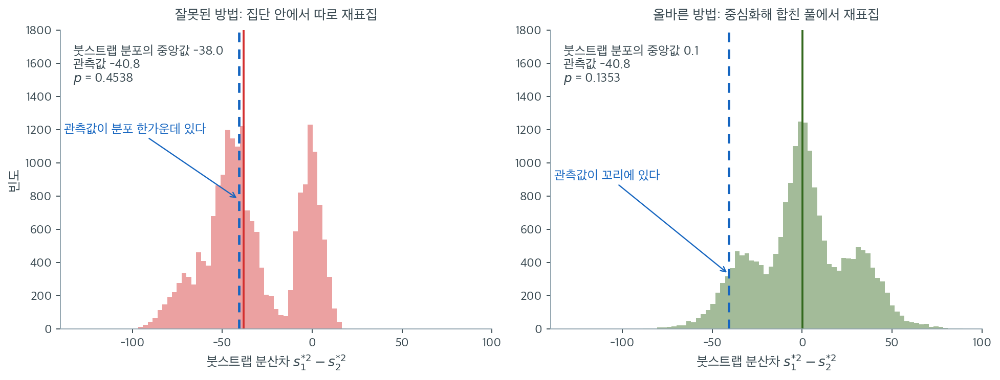

# 분산 검정의 고급 방법


현대 통계학에서, 특히 가정 위반이나 제한된 표본크기 때문에 전통적인 모수적 검정이 실패할 때, 분산 검정의 고급 방법들이 더 큰 유연성과 로버스트성을 제공한다. 이런 방법들은 정규성과 등분산성 가정이 위배될 때 추론하기 위해 붓스트랩 같은 계산 기법이나 Bayes 접근을 활용한다.

---

## 1. 붓스트랩을 이용한 분산 검정

**붓스트랩**은 원자료에서 복원추출로 모의 표본을 다수 생성하는 재표집 기법이다. 정규성을 가정하고 싶지 않거나 작은 표본을 다룰 때 특히 유용하다. 붓스트랩은 이론적 분포에 기대지 않고 분산 같은 통계량의 표집분포를 추정하는 방법을 제공한다.

### 붓스트랩 분산 검정의 단계

1. **재표집:** 원자료에서 복원추출로 새 자료집합을 다수 생성한다. 각 붓스트랩 표본의 크기는 원자료와 같아야 한다.
2. **분산 계산:** 각 붓스트랩 표본에서 표본분산 $s_i^2$을 계산한다.
3. **표집분포 구성:** 붓스트랩 표본들의 분산이 분산의 표집분포를 근사한다. 이를 신뢰구간 추정이나 가설검정에 쓸 수 있다.
4. **가설검정:** 붓스트랩 분산들의 분포를 귀무가설(집단 간 등분산 등)과 비교한다.

!!! danger "귀무가설 아래에서 재표집해야 한다"
    4단계에서 가장 흔한 실수는 **각 집단 안에서 따로 재표집한 뒤 그 결과를 관측값과 비교**하는 것이다. 이렇게 하면 붓스트랩 분포가 귀무가설이 아니라 **관측된 값을 중심으로** 만들어지므로 검정이 성립하지 않는다.

    예컨대 두 집단의 분산차 $s_1^2 - s_2^2$을 검정한다고 하자. 각 집단 안에서 재표집하면 붓스트랩 차이의 평균이 관측된 차이 근처가 된다. 그런데 $p = \frac{1}{B}\sum \mathbf{1}(|d_b^*| \geq |d_{\text{obs}}|)$로 계산하면, 관측값이 붓스트랩 분포의 한가운데 있으므로 $p \approx 0.5$가 나온다. 관측된 차이가 아무리 커도 마찬가지이다.

    올바른 절차는 (1) 각 집단을 중심화하고, (2) 중심화된 잔차를 **합쳐서** 하나의 풀을 만들고, (3) 그 풀에서 두 붓스트랩 표본을 뽑는 것이다. 자세한 내용은 [붓스트랩 분산 검정](bootstrap_variance.md) 페이지를 보라.

아래 보기의 자료로 두 방식을 나란히 돌려 보면 차이가 분명하다. 표본분산이 $10.00$과 $50.80$이므로 관측된 분산차는 $-40.8$이다.



왼쪽이 잘못된 방식이다. 각 집단 안에서만 재표집하면 붓스트랩 표본들이 **원래의 분산 차이를 그대로 물려받는다.** 그래서 분포의 중앙값이 $-38.0$, 곧 관측값 $-40.8$의 바로 옆에 자리 잡는다. 관측값이 자기 분포의 한가운데에 있으니 "이만큼 극단적인" 붓스트랩 값의 비율이 절반 가까이 나오고, $p = 0.454$가 된다. **자료를 어떻게 바꾸어도 이 $p$값은 0.5 근처를 벗어나지 않는다.** 분포 자체가 관측값을 따라 움직이기 때문이다.

오른쪽이 올바른 방식이다. 두 집단을 각각 중심화해 하나의 풀로 합치면, 그 풀에서 뽑은 두 표본은 **정의상 같은 분포**에서 나온 것이다. 귀무가설을 재표집 체계 안에 강제로 집어넣은 셈이고, 그 결과 붓스트랩 분포의 중앙값이 $0.1$로 귀무값 0에 놓인다. 이제 관측값 $-40.8$이 왼쪽 꼬리에 떨어지고 $p = 0.135$가 나온다.

**가설검정의 모든 $p$값은 "귀무가설이 참이라면 이런 값이 얼마나 자주 나오는가"에 답한다.** 그러려면 비교 대상 분포가 반드시 귀무가설 아래에서 만들어져야 한다. 붓스트랩은 이 분포를 이론 대신 자료로 만들 뿐, 그 요구조건까지 면제해 주지는 않는다. 재표집 코드를 짤 때 가장 먼저 물어야 할 것은 "이 재표집이 $H_0$를 흉내 내는가"이다.

(덧붙이면 $p = 0.135$로도 기각하지 못한다. 표본분산이 5배 차이인데도 그렇다. 집단당 $n = 5$에서는 어떤 검정도 검정력이 없다.)

### 가설

**귀무가설 ($H_0$):** 집단들의 분산이 모두 같다.

$$
H_0: \sigma_1^2 = \sigma_2^2 = \dots = \sigma_k^2
$$

**대립가설 ($H_1$):** 적어도 한 집단의 분산이 다른 집단과 다르다.

$$
H_1: \sigma_i^2 \neq \sigma_j^2 \quad \text{(적어도 한 쌍의)} \quad i \neq j
$$

<div class="exbox" markdown>

**보기 1.** <span class="diff easy" title="쉬움"></span> 붓스트랩으로 분산 비교하기. 집단당 $n = 5$ 인 두 표본을 각각 중심화해 하나의 풀로 합치고, 그 풀에서 크기 5 인 두 표본을 복원추출해 분산차 $d^* = S_1^{*2} - S_2^{*2}$ 의 귀무분포를 만든다.

**(1)** $n_1 = n_2$ 이면 $d^*$ 의 붓스트랩 분포가 **0 에 대하여 정확히 대칭**임을 보이시오. 또 $E[d^*]$ 와 $\operatorname{Var}(d^*)$ 를 풀의 적률로 적으시오.

**(2)** (1)의 값을 수로 계산하고 모의실험이 그것을 재현하는지 확인하시오. 분산의 붓스트랩이 풀의 **4차 적률**에 의존한다는 사실은 어디에 드러나는가.

</div>

??? success "풀이"

    **(1) 대칭성은 교환가능성에서 곧바로 나온다.** 중심화한 잔차를 합쳐 만든 풀의 경험분포를 $\hat F$ 라 쓰자. 붓스트랩 표본 $r_1$ 과 $r_2$ 는 **같은** $\hat F$ 에서 복원추출한 것이고 서로 독립이며, $n_1 = n_2 = n$ 이므로 크기까지 같다. 그러므로 두 쌍

    $$
    (r_1, r_2) \quad\text{와}\quad (r_2, r_1)
    $$

    의 결합분포가 같다. 표본분산을 $S^2(\cdot)$ 로 쓰면 $d^* = S^2(r_1) - S^2(r_2)$ 이고 쌍을 맞바꾼 것이 $-d^*$ 이므로

    $$
    d^* \;\overset{d}{=}\; -d^*
    $$

    이다. 곧 $d^*$ 의 분포는 **0 에 대하여 정확히 대칭**이다. 유한한 풀에서 뽑으므로 적률이 모두 존재하고, 따라서 $E[d^*] = 0$ 이며 중앙값도 $0$ 이다. **귀무가설이 재표집 체계 안에 들어가 있다**는 말의 정확한 내용이 이것이다. 반대로 집단 안에서만 재표집하면 $r_1$ 과 $r_2$ 가 서로 다른 분포에서 나오므로 이 대칭성이 깨지고, 분포의 중심이 관측값 쪽으로 끌려간다(앞의 왼쪽 그림).

    **분산은 풀의 4차 적률을 부른다.** $\hat F$ 의 분산을 $v_p$, 4차 중심적률을 $\mu_4$ 라 하자. 크기 $n$ 의 iid 표본에서 $S^2$ 은 불편추정량이므로

    $$
    E[S^{*2}] = v_p
    $$

    이고, iid 표본분산의 정확한 분산 공식

    $$
    \operatorname{Var}(S^{*2}) = \frac{1}{n}\left(\mu_4 - \frac{n-3}{n-1}\,v_p^2\right)
    $$

    에 $r_1 \perp r_2$ 를 더하면

    $$
    \operatorname{Var}(d^*) = 2\operatorname{Var}(S^{*2}) = \frac{2}{n}\left(\mu_4 - \frac{n-3}{n-1}\,v_p^2\right)
    $$

    이 된다. **$\mu_4$ 가 식에 들어 있다는 것이 요점이다.** 평균의 붓스트랩은 2차 적률만 있으면 되지만 분산의 붓스트랩은 4차 적률을 쓴다. 정규모집단이면 $\mu_4 = 3v_p^2$ 이어서 위 식이 $2 \cdot 2v_p^2/(n-1)$ 로 줄지만, 꼬리가 무거우면 $\mu_4$ 가 폭발하고 그만큼 귀무분포가 넓어진다. **붓스트랩이 "분포무관"이라는 말은 이 의존성을 없애 준다는 뜻이 아니다.** 15.6절의 모의실험이 그 대가를 수치로 보인다.

    여기서는 $n = 5$ 라 $(n-3)/(n-1) = 1/2$ 이고, 풀은 중심화된 잔차 10 개뿐이다.

    **(2) 수치적으로.** 풀이 10 점뿐이므로 크기 5 인 추출이 $10^5$ 가지밖에 안 된다. **전수조사로 공식을 정확히 검산할 수 있다.**

    ```python
    import itertools

    import numpy as np

    rng = np.random.default_rng(0)

    # 두 집단의 원자료
    sample1 = np.array([10, 12, 14, 16, 18])
    sample2 = np.array([22, 24, 26, 30, 40])

    # 관측된 분산의 차이
    observed_diff = np.var(sample1, ddof=1) - np.var(sample2, ddof=1)

    # 귀무가설은 "두 분산이 같다"이다. 그 상태를 흉내 내려면 집단마다 평균을
    # 빼 중심을 맞춘 뒤 하나로 합친다. 이 웅덩이에서 다시 뽑으면 두 집단이
    # 같은 분포에서 나온 셈이 된다.
    pool = np.concatenate([sample1 - sample1.mean(),
                           sample2 - sample2.mean()])

    # 귀무가설 아래에서의 통계량 분포를 붓스트랩으로 얻는다.
    B = 10000
    boot_diffs = np.empty(B)
    for b in range(B):
        r1 = rng.choice(pool, size=len(sample1), replace=True)
        r2 = rng.choice(pool, size=len(sample2), replace=True)
        boot_diffs[b] = np.var(r1, ddof=1) - np.var(r2, ddof=1)

    p_value = np.mean(np.abs(boot_diffs) >= np.abs(observed_diff))

    print(f"Sample variances: {np.var(sample1, ddof=1):.2f}, "
          f"{np.var(sample2, ddof=1):.2f}")
    print(f"Observed difference in variances: {observed_diff:.2f}")
    print(f"Bootstrap p-value: {p_value:.4f}")

    # === (1) 의 적률을 풀의 경험분포에서 직접 계산한다 ===
    n = len(sample1)
    v_p = pool.var(ddof=0)                      # 풀의 분산 = 경험분포의 분산
    mu4 = ((pool - pool.mean()) ** 4).mean()    # 풀의 4차 중심적률
    var_S = (mu4 - (n - 3) / (n - 1) * v_p**2) / n
    sd_d = np.sqrt(2 * var_S)

    print(f"\n풀 (10 개): {np.sort(pool)}")
    print(f"v_p = {v_p:.4f},  mu4 = {mu4:.4f},  풀의 첨도 beta2 = {mu4 / v_p**2:.4f}")
    print(f"이론  E[S*^2] = v_p = {v_p:.4f}")
    print(f"이론  E[d*]   = 0")
    print(f"이론  SD(d*)  = sqrt(2 x {var_S:.5f}) = {sd_d:.4f}")

    # === 풀이 10 점뿐이므로 10^5 가지를 모두 세어 공식을 정확히 검산할 수 있다 ===
    allS2 = np.array(list(itertools.product(pool, repeat=n))).var(axis=1, ddof=1)
    print(f"\n전수조사(10^5 가지)")
    print(f"  E[S*^2]   = {allS2.mean():.5f}   (공식 {v_p:.5f})")
    print(f"  Var(S*^2) = {allS2.var():.5f}   (공식 {var_S:.5f})")
    print(f"  SD(d*)    = {np.sqrt(2 * allS2.var()):.5f}   (공식 {sd_d:.5f})")

    # === 모의실험이 그 값을 재현하는가 ===
    kap = ((boot_diffs - boot_diffs.mean()) ** 4).mean() / boot_diffs.var() ** 2
    se_mean = boot_diffs.std(ddof=1) / np.sqrt(B)
    se_sd = boot_diffs.std(ddof=1) * np.sqrt((kap - 1) / (4 * B))
    print(f"\n모의실험 (B = {B})")
    print(f"  mean(d*) = {boot_diffs.mean():+.4f}   (몬테카를로 오차 +-{se_mean:.4f})")
    print(f"  median   = {np.median(boot_diffs):+.4f}")
    print(f"  SD(d*)   = {boot_diffs.std(ddof=1):.4f}   (몬테카를로 오차 +-{se_sd:.4f})")

    # === 대칭성: d* 와 -d* 의 분위수를 맞춰 본다 ===
    print("\n백분위수   d*        -d*     (대칭이면 같아야 한다)")
    for q in (1, 5, 25, 50, 75, 95, 99):
        a = np.percentile(boot_diffs, q)
        b_ = -np.percentile(boot_diffs, 100 - q)
        print(f"  {q:>3}%   {a:+9.3f}  {b_:+9.3f}")

    pct = np.mean(boot_diffs <= observed_diff) * 100
    z = observed_diff / sd_d
    print(f"\n관측값 {observed_diff:.1f} 은 귀무분포의 {pct:.2f} 백분위,  z = {z:.4f}")
    ```

    출력:

    ```text
    Sample variances: 10.00, 50.80
    Observed difference in variances: -40.80
    Bootstrap p-value: 0.1339

    풀 (10 개): [-6.4 -4.4 -4.  -2.4 -2.   0.   1.6  2.   4.  11.6]
    v_p = 24.3200,  mu4 = 2074.2656,  풀의 첨도 beta2 = 3.5070
    이론  E[S*^2] = v_p = 24.3200
    이론  E[d*]   = 0
    이론  SD(d*)  = sqrt(2 x 355.70688) = 26.6723

    전수조사(10^5 가지)
      E[S*^2]   = 24.32000   (공식 24.32000)
      Var(S*^2) = 355.70688   (공식 355.70688)
      SD(d*)    = 26.67234   (공식 26.67234)

    모의실험 (B = 10000)
      mean(d*) = +0.2505   (몬테카를로 오차 +-0.2648)
      median   = -0.0080
      SD(d*)   = 26.4828   (몬테카를로 오차 +-0.1743)

    백분위수   d*        -d*     (대칭이면 같아야 한다)
        1%     -57.028    -58.385
        5%     -43.441    -43.668
       25%     -16.080    -17.344
       50%      -0.008     +0.008
       75%     +17.344    +16.080
       95%     +43.668    +43.441
       99%     +58.385    +57.028

    관측값 -40.8 은 귀무분포의 6.56 백분위,  z = -1.5297
    ```

    **공식이 전수조사와 소수점 다섯째 자리까지 맞는다.** $E[S^{*2}] = 24.32000$ 이 풀의 분산 $v_p = 24.32000$ 과 같고, $\operatorname{Var}(S^{*2}) = 355.70688$ 이 공식값과 같다. $10^5$ 가지를 다 세었으므로 이것은 근사가 아니라 **정확한 검산**이다. 따라서 $\operatorname{SD}(d^*) = 26.67234$ 가 참값이다.

    **모의실험도 그 값을 재현한다.** $B = 10000$ 에서 $\operatorname{mean}(d^*) = +0.2505$ 가 이론값 $0$ 에서 몬테카를로 오차 $\pm 0.2648$ 안에 있고, 중앙값 $-0.0080$ 은 거의 정확히 $0$ 이다. $\operatorname{SD}(d^*) = 26.4828$ 은 참값 $26.67234$ 보다 $0.19$ 작은데 이 추정의 몬테카를로 오차가 $\pm 0.1743$ 이니 $1.1$ 표준오차 차이, 곧 우연으로 설명된다.

    **대칭성도 분위수에서 확인된다.** $d^*$ 의 $5\%$ 분위수 $-43.441$ 과 $-d^*$ 의 $5\%$ 분위수 $-43.668$ 이 둘째 자리까지 맞고, $25\%$ 와 $75\%$ 는 $\mp16.080 / \mp17.344$ 로 자리를 맞바꾼 쌍이다. 두 분포가 완전히 겹치지 않는 것은 같은 $B = 10000$ 개의 표본을 양쪽에서 쓴 탓이며, 분포 자체는 (1)에서 보았듯 정확히 대칭이다.

    **4차 적률의 자리.** 풀의 첨도가 $\beta_2 = 3.5070$ 으로 정규의 $3$ 보다 크다. 집단 2 의 잔차 $11.6$ 하나가 $\mu_4$ 를 끌어올린 결과다. $\mu_4 = 3v_p^2$ 로 두면 $\operatorname{SD}(d^*)$ 가 $\sqrt{2 \cdot (3 - 0.5) \cdot 24.32^2/5} = 24.32\sqrt{1} = 24.32$ 로 나와 참값 $26.67$ 보다 $9\%$ 작다. **공식에서 $\mu_4$ 를 정규값으로 갈아 끼우면 귀무분포를 그만큼 좁게 보고, 그것이 곧 $p$ 값을 작게 주는 일이 된다.** 꼬리가 더 무거운 자료에서는 이 어긋남이 자릿수로 커진다.

    **판정.** 관측값 $-40.8$ 이 귀무분포의 $6.56$ 백분위에 있어 양측 $p = 0.1339$ 이고 $\alpha = 0.05$ 에서 기각하지 못한다. 정규근사로 보면 $z = -1.53$ 으로 양측 $p \approx 0.126$ 이니 붓스트랩 값과 비슷하다. 표본분산이 $10.00$ 대 $50.80$ 으로 다섯 배 차이인데도 그렇다. **집단당 $n = 5$ 에서는 어떤 분산 검정도 검정력이 없다.**

원래의 보기 자료 `sample1 = [10,12,14,16,18]`, `sample2 = [22,24,26,28,30]`은 두 집단의 표본분산이 **정확히 10으로 같아서** 검정을 시연할 수 없다. 위 코드에서는 집단 2를 `[22,24,26,30,40]`으로 바꾸어 분산 차이를 만들었다.

### 해석

붓스트랩 분산차의 분포로 $p$값을 계산할 수 있다. $p$값이 선택한 문턱(예: $\alpha = 0.05$)보다 작으면 귀무가설을 기각하고 두 집단의 분산이 다르다고 결론짓는다.

여기서는 $p = 0.134$로 기각하지 못한다. 표본분산이 $10$ 대 $50.8$로 5배 차이인데도 그렇다. 각 집단 $n = 5$로는 검정력이 사실상 없기 때문이며, 15.3절 연습문제 3에서 본 결론과 일치한다($n = 5$에서 F 검정이 탐지하려면 분산비가 9.6배는 되어야 한다).

### 붓스트랩의 장점

- **분포무관:** 붓스트랩은 정규성 가정에 기대지 않으므로 정규성에서 벗어난 자료에 적합하다.
- **작은 표본:** 모수적 검정의 검정력이 부족한 작은 자료집합에도 적용할 수 있다.
- **유연성:** 분산을 포함한 어떤 통계량에도 적용할 수 있어 활용도가 높다.

다만 15.6절 [붓스트랩 분산 검정](bootstrap_variance.md)의 모의실험에서 보듯, 강하게 치우친 자료에서는 붓스트랩의 크기도 다소 부풀려진다. "분포무관"이 "모든 상황에서 정확"을 뜻하지는 않는다.

---

## 2. Bayes 방법을 이용한 분산 검정

**Bayes 방법**은 분산에 대한 사전정보를 반영하고 관측 자료로 그 믿음을 갱신하는 확률적 접근을 제공한다. 고전 통계학처럼 관측 표본에만 의존하는 대신, 자료와 사전분포를 결합하여 분산의 **사후분포**를 얻는다.

### Bayes 분산 검정의 틀

Bayes 분산 검정에서는 사전 믿음과 자료의 가능도를 써서 분산의 사후분포를 추정한다. 그 결과 각 분산에 대한 사후확률분포를 얻고, 이를 가설검정이나 분산의 신용구간에 쓸 수 있다.

### 가설

**귀무가설 ($H_0$):** 집단들의 분산이 모두 같다.

$$
H_0: \sigma_1^2 = \sigma_2^2 = \dots = \sigma_k^2
$$

**대립가설 ($H_1$):** 적어도 한 집단의 분산이 다르다.

$$
H_1: \sigma_i^2 \neq \sigma_j^2 \quad \text{(적어도 한 쌍의)} \quad i \neq j
$$

### Bayes 추론 과정

**1. 사전분포:** 분산 모수 $\sigma_i^2$의 사전분포를 고른다. 흔한 선택은 역감마분포이다.

$$
\sigma_i^2 \sim \text{InverseGamma}(\alpha, \beta)
$$

**2. 가능도:** 분산이 주어졌을 때 자료의 가능도를 모형화한다. 정규분포 자료에 대해

$$
X_{ij} \sim \mathcal{N}(\mu_i, \sigma_i^2)
$$

**3. 사후분포:** Bayes 정리로 사전분포와 가능도를 결합하여 분산의 사후분포를 얻는다.

$$
P(\sigma_i^2 \mid \text{자료}) \propto P(\text{자료} \mid \sigma_i^2) \, P(\sigma_i^2)
$$

**4. Bayes 인자:** 등분산을 검정하려면 귀무가설과 대립가설에 대한 증거의 강도를 수량화하는 Bayes 인자를 계산한다.

$$
BF = \frac{P(\text{자료} \mid H_0)}{P(\text{자료} \mid H_1)}
$$

Bayes 인자가 1보다 크면 귀무가설을, 1보다 작으면 대립가설을 지지한다.

Bayes 추론에는 `pymc` 패키지를 쓴다(과거의 `pymc3`는 더 이상 유지보수되지 않으며 `pymc` 4.x 이상으로 대체되었다).

<div class="exbox" markdown>

**보기 2.** <span class="diff easy" title="쉬움"></span> PyMC로 베이즈 분산 비교. 보기 1 과 같은 자료에 $\mu_i \sim N(0, 100^2)$, $\sigma_i^2 \sim \text{InvGamma}(2, 1)$ 을 주고 분산비 $\rho = \sigma_1^2/\sigma_2^2$ 의 사후분포를 구한다.

**(1)** $\mu_i$ 에 평평한 사전분포를 주면 사후분포가 닫힌 꼴로 적힌다. $\sigma_i^2 \mid \mathbf{x}$ 의 사후분포를 구하고, **$\rho$ 의 사후분포가 F 분포의 척도변환**임을 보이시오. 그것으로 사후중앙값, $95\%$ 신용구간, $P(\rho > 1)$ 을 적으시오.

**(2)** 그 값을 수로 계산하고, 사전분포를 제프리스 $\pi(\mu, \sigma^2) \propto 1/\sigma^2$ 로 바꾸면 결론이 어떻게 달라지는지 보이시오. **MCMC 를 돌리기 전에 이미 알 수 있는 것**은 무엇인가.

</div>

??? success "풀이"

    **(1) 평평한 $\mu$ 를 적분해 내면 켤레성이 그대로 남는다.** $\mu_i$ 의 사전분포를 $\mathbb R$ 에서 평평하게 두고 적분하면 정규 가능도의 $\sigma^2$ 부분만 남는다. $SS = \sum_j (x_{ij} - \bar x_i)^2$ 이라 쓰면

    $$
    p(\mathbf{x} \mid \sigma^2) \propto (\sigma^2)^{-(n-1)/2} \exp\!\left(-\frac{SS}{2\sigma^2}\right)
    $$

    이다. **지수가 $-n/2$ 가 아니라 $-(n-1)/2$ 인 것**이 핵심이다. $\mu$ 를 적분해 내느라 자유도 하나를 썼기 때문이고, 그래서 $\sum (x_j - \mu)^2$ 이 아니라 $SS = \sum (x_j - \bar x)^2$ 이 들어간다. 여기에 사전분포 $\text{InvGamma}(a_0, b_0) \propto (\sigma^2)^{-a_0-1} e^{-b_0/\sigma^2}$ 를 곱하면

    $$
    p(\sigma^2 \mid \mathbf{x}) \propto (\sigma^2)^{-\left(a_0 + \frac{n-1}{2}\right)-1}
    \exp\!\left(-\frac{b_0 + SS/2}{\sigma^2}\right)
    $$

    이므로 사후분포가 다시 역감마다.

    $$
    \sigma_i^2 \mid \mathbf{x} \;\sim\; \text{InvGamma}\!\left(a_0 + \frac{n-1}{2},\; b_0 + \frac{SS_i}{2}\right)
    $$

    **비의 사후분포는 F 분포다.** $V \sim \text{InvGamma}(a, b)$ 이면 $1/V \sim \text{Gamma}(a, \text{rate } b)$ 이고, 감마의 척도를 바꾸면

    $$
    \frac{2b}{V} \sim \text{Gamma}\!\left(a, \text{rate } \tfrac12\right) = \chi^2_{2a}
    $$

    이다. 두 집단의 사후 초모수를 $a$(공통), $b_1, b_2$ 라 하면 $\sigma_i^2 = 2b_i / W_i$ 꼴로 쓰이고 $W_1, W_2 \sim \chi^2_{2a}$ 가 독립이다. 그러므로

    $$
    \rho = \frac{\sigma_1^2}{\sigma_2^2} = \frac{b_1}{b_2}\cdot\frac{W_2}{W_1}
    = \frac{b_1}{b_2}\cdot\frac{W_2/(2a)}{W_1/(2a)}
    \;\sim\; \frac{b_1}{b_2}\, F(2a,\, 2a)
    $$

    가 된다. **분산비의 사후분포가 $F(2a, 2a)$ 를 $b_1/b_2$ 배 늘인 것**이다. 자유도가 같은 F 분포는 역수에 대해 닫혀 있어 중앙값이 정확히 $1$ 이므로

    $$
    \operatorname{median}(\rho) = \frac{b_1}{b_2},
    \qquad
    \text{95\% 신용구간} = \frac{b_1}{b_2}\left[F_{0.025}(2a,2a),\; F_{0.975}(2a,2a)\right],
    $$

    $$
    P(\rho > 1) = P\!\left(F(2a,2a) > \frac{b_2}{b_1}\right)
    $$

    이다. 이 자료는 $n = 5$, $a_0 = 2$, $b_0 = 1$, $SS_1 = 40$, $SS_2 = 203.2$ 이니 $a = 4$, $b_1 = 21$, $b_2 = 102.6$ 이고 참조분포가 $F(8,8)$ 이다.

    **(2) 수치적으로.** 아래 코드는 `pymc` 없이 돌아간다. MCMC 가 돌려줄 사후표본을 닫힌 꼴에서 직접 뽑기 때문이다.

    ```python
    import numpy as np
    import scipy.stats as stats

    sample1 = np.array([10, 12, 14, 16, 18], dtype=float)
    sample2 = np.array([22, 24, 26, 30, 40], dtype=float)
    n = len(sample1)

    # === 사후 초모수. 평평한 mu 를 적분해 내면 자유도가 하나 줄어 (n-1)/2 가 붙는다 ===
    a0, b0 = 2.0, 1.0                       # 코드가 준 InverseGamma(2, 1)
    SS1 = ((sample1 - sample1.mean()) ** 2).sum()
    SS2 = ((sample2 - sample2.mean()) ** 2).sum()
    a = a0 + (n - 1) / 2
    b1, b2 = b0 + SS1 / 2, b0 + SS2 / 2

    print(f"s1^2 = {sample1.var(ddof=1):.2f},  SS1 = {SS1:.1f}")
    print(f"s2^2 = {sample2.var(ddof=1):.2f},  SS2 = {SS2:.1f}")
    print(f"사후:  var1 ~ IG({a:.0f}, {b1:.1f}),   var2 ~ IG({a:.0f}, {b2:.1f})")
    print(f"사후평균:  var1 = {b1 / (a - 1):.4f},  var2 = {b2 / (a - 1):.4f}")

    # === ratio ~ (b1/b2) * F(2a, 2a) ===
    Fd = stats.f(2 * a, 2 * a)
    scale = b1 / b2
    print(f"\nratio ~ ({b1:.1f}/{b2:.1f}) x F({2 * a:.0f},{2 * a:.0f}) = {scale:.6f} x F(8,8)")
    print(f"F(8,8) 의 중앙값 = {Fd.ppf(0.5):.6f}   (자유도가 같으므로 정확히 1)")
    print(f"닫힌 꼴  사후중앙값   = {scale * Fd.ppf(0.5):.6f}")
    lo, hi = scale * Fd.ppf([0.025, 0.975])
    print(f"닫힌 꼴  95% 신용구간 = ({lo:.6f}, {hi:.6f})")
    print(f"닫힌 꼴  P(ratio > 1) = sf(F(8,8); {b2 / b1:.6f}) = {Fd.sf(b2 / b1):.6f}")

    # === MCMC 가 돌려줄 사후표본을 닫힌 꼴에서 직접 뽑아 본다 ===
    rng = np.random.default_rng(42)
    v1 = stats.invgamma(a, scale=b1).rvs(40_000, random_state=rng)
    v2 = stats.invgamma(a, scale=b2).rvs(40_000, random_state=rng)
    r = v1 / v2
    print(f"\n사후표본 4만 개")
    print(f"  mean(var1) = {v1.mean():.4f},  mean(var2) = {v2.mean():.4f}")
    print(f"  median(ratio) = {np.median(r):.6f}")
    print(f"  95% 구간 = ({np.percentile(r, 2.5):.6f}, {np.percentile(r, 97.5):.6f})")
    print(f"  P(ratio > 1) = {np.mean(r > 1):.6f}")

    # === 제프리스 사전분포로 바꾸면 ===
    aJ, bJ1, bJ2 = (n - 1) / 2, SS1 / 2, SS2 / 2
    FJ = stats.f(2 * aJ, 2 * aJ)
    loJ, hiJ = (bJ1 / bJ2) * FJ.ppf([0.025, 0.975])
    print(f"\n제프리스 1/sigma^2:  ratio ~ {bJ1 / bJ2:.6f} x F({2 * aJ:.0f},{2 * aJ:.0f})")
    print(f"  95% 신용구간 = ({loJ:.6f}, {hiJ:.6f})")
    print(f"  P(ratio > 1) = {FJ.sf(bJ2 / bJ1):.6f}")

    # 빈도주의 F 신뢰구간과 맞춰 본다.
    ratio_hat = sample1.var(ddof=1) / sample2.var(ddof=1)
    fl, fh = ratio_hat / stats.f(n - 1, n - 1).ppf([0.975, 0.025])
    print(f"\n빈도주의 F 신뢰구간 = ({fl:.6f}, {fh:.6f})")
    print(f"  제프리스 신용구간과의 차 = {abs(fl - loJ):.3e}, {abs(fh - hiJ):.3e}")
    print(f"  상한/하한 비 = {fh / fl:.4f} = F_0.975(4,4)^2 = "
          f"{stats.f(n - 1, n - 1).ppf(0.975) ** 2:.4f}  (자료와 무관)")

    # === mu ~ N(0, 100) 이 평평한 mu 와 얼마나 다른가. 격자적분으로 직접 센다 ===
    def marginal_quantiles(x, kappa, qs=(0.025, 0.5, 0.975)):
        """mu ~ N(0, kappa^2) 를 적분해 낸 sigma^2 의 사후 분위수."""
        nn, xb = len(x), x.mean()
        ss = ((x - xb) ** 2).sum()
        g = np.exp(np.linspace(np.log(0.2), np.log(4000), 400_001))
        logp = (stats.invgamma(a0, scale=b0).logpdf(g)
                - (nn - 1) / 2 * np.log(g) - ss / (2 * g)
                + stats.norm(0, np.sqrt(g / nn + kappa**2)).logpdf(xb))
        logp -= logp.max()
        w = np.exp(logp) * np.gradient(g)
        cdf = np.cumsum(w)
        return np.interp(qs, cdf / cdf[-1], g)

    print("\nmu ~ N(0,100) 과 평평한 mu 의 사후 분위수 (2.5%, 50%, 97.5%)")
    for name, x, bb in (("var1", sample1, b1), ("var2", sample2, b2)):
        num = marginal_quantiles(x, 100.0)
        cls = stats.invgamma(a, scale=bb).ppf([0.025, 0.5, 0.975])
        rel = np.max(np.abs(num - cls) / cls)
        print(f"  {name}  N(0,100): {np.round(num, 4)}")
        print(f"        평평한 mu: {np.round(cls, 4)}   상대차 최대 {rel:.1e}")
    ```

    출력:

    ```text
    s1^2 = 10.00,  SS1 = 40.0
    s2^2 = 50.80,  SS2 = 203.2
    사후:  var1 ~ IG(4, 21.0),   var2 ~ IG(4, 102.6)
    사후평균:  var1 = 7.0000,  var2 = 34.2000

    ratio ~ (21.0/102.6) x F(8,8) = 0.204678 x F(8,8)
    F(8,8) 의 중앙값 = 1.000000   (자유도가 같으므로 정확히 1)
    닫힌 꼴  사후중앙값   = 0.204678
    닫힌 꼴  95% 신용구간 = (0.046169, 0.907392)
    닫힌 꼴  P(ratio > 1) = sf(F(8,8); 4.885714) = 0.018875

    사후표본 4만 개
      mean(var1) = 7.0178,  mean(var2) = 34.2010
      median(ratio) = 0.204302
      95% 구간 = (0.046330, 0.911002)
      P(ratio > 1) = 0.019650

    제프리스 1/sigma^2:  ratio ~ 0.196850 x F(4,4)
      95% 신용구간 = (0.020496, 1.890655)
      P(ratio > 1) = 0.072256

    빈도주의 F 신뢰구간 = (0.020496, 1.890655)
      제프리스 신용구간과의 차 = 0.000e+00, 2.220e-16
      상한/하한 비 = 92.2470 = F_0.975(4,4)^2 = 92.2470  (자료와 무관)

    mu ~ N(0,100) 과 평평한 mu 의 사후 분위수 (2.5%, 50%, 97.5%)
      var1  N(0,100): [ 2.3952  5.7187 19.267 ]
            평평한 mu: [ 2.3953  5.7189 19.2684]   상대차 최대 7.5e-05
      var2  N(0,100): [11.702  27.938  94.1118]
            평평한 mu: [11.7026 27.9407 94.1401]   상대차 최대 3.0e-04
    ```

    **닫힌 꼴과 사후표본이 맞는다.** 중앙값 $0.204678$ 대 $0.204302$, $95\%$ 구간 $(0.046169,\, 0.907392)$ 대 $(0.046330,\, 0.911002)$, $P(\rho>1)$ $0.018875$ 대 $0.019650$ 이다. 4만 개 표본에서 $P(\rho>1) \approx 0.019$ 의 몬테카를로 표준오차가 $\sqrt{0.019 \cdot 0.981/40000} = 0.00068$ 이니 $0.0008$ 차이는 그 안이다. 사후평균 $7.0178$, $34.2010$ 도 닫힌 꼴 $b_i/(a-1) = 7.0000$, $34.2000$ 과 맞는다.

    **$\mu \sim N(0, 100^2)$ 은 사실상 평평하다.** 격자적분으로 센 사후 분위수가 평평한 $\mu$ 의 닫힌 꼴과 상대차 $3\times10^{-4}$ 이하로 맞는다. $\mu$ 의 사전 정밀도 $1/100^2 = 10^{-4}$ 가 자료의 정밀도 $n/\sigma^2 \approx 0.5$ 에 비해 무시할 만하기 때문이다. **그러므로 (1)의 닫힌 꼴은 위 PyMC 모형의 답을 네 자리까지 그대로 준다.**

    **제프리스 사전분포에서는 빈도주의와 정확히 같아진다.** $a_0, b_0 \to 0$ 이면 $a = (n-1)/2 = 2$, $b_i = SS_i/2$ 이고

    $$
    \rho \sim \frac{SS_1}{SS_2}F(4,4) = \frac{s_1^2}{s_2^2}F(n-1,n-1)
    $$

    이 되는데, 이것을 뒤집으면 $F$ 검정의 신뢰구간 공식 $\left(\dfrac{s_1^2/s_2^2}{F_{0.975}},\, \dfrac{s_1^2/s_2^2}{F_{0.025}}\right)$ 와 같다. 두 자유도가 같아 $F_{0.025} = 1/F_{0.975}$ 이기 때문이다. 코드가 그 일치를 확인한다. **차가 $0$ 과 $2.2\times10^{-16}$, 곧 기계 정밀도다.** 8장이 다룬 대로 상한/하한 비 $92.2470 = F_{0.975}(4,4)^2$ 이 자료와 무관하다는 것도 여기서 다시 보인다.

    **MCMC 를 돌리기 전에 알 수 있는 것.** 전부다. 이 모형에는 켤레성이 있어 사후분포가 $F(8,8)$ 의 척도변환이고, 그래서 중앙값·신용구간·$P(\rho>1)$ 이 모두 손으로 적힌다. **MCMC 는 이 값들을 몬테카를로 오차만큼 흐려 돌려줄 뿐이다.** 15.6절 [Bayes 분산 검정](bayesian_variance.md)이 이 닫힌 꼴을 쓴다.

    **그리고 불편한 사실 하나.** $\text{InvGamma}(2,1)$ 사전분포에서는 $95\%$ 신용구간 $(0.0462,\, 0.9074)$ 가 **$1$ 을 담지 않는다.** 제프리스에서는 $(0.0205,\, 1.8907)$ 로 담는다. $P(\rho>1)$ 도 $0.0189$ 대 $0.0723$ 이다. **사전분포를 바꾸니 결론이 뒤집혔다.** 까닭은 자유도에 있다. $a_0 = 2$ 는 사후 자유도를 $2a = 8$ 로 만드는데 자료가 주는 것은 $n - 1 = 4$ 뿐이므로, **이 사전분포가 자료만큼의 정보를 더 넣은 것**이다. 중심은 거의 그대로($0.2047$ 대 $0.1969$) 두면서 분포만 좁혔고, 이미 $1$ 에서 비껴 있던 중심이 그 좁아짐 덕에 "유의"해졌다.

    보기 1 의 붓스트랩이 $p = 0.134$ 로 기각하지 못한 것과 견주어 보라. 집단당 $n = 5$ 라는 사실은 변하지 않았다. **$n = 5$ 에서 베이즈가 더 단호한 답을 주었다면 그 단호함은 자료에서 온 것이 아니다.** 그래서 이 쪽의 해석이 베이즈 인자보다 신용구간을 권하고, 그 신용구간조차 사전분포를 바꿔 가며 확인하라고 한다.

    아래는 같은 일을 MCMC 로 하는 코드다. 켤레성이 있어 여기서는 쓸 필요가 없지만, $t$ 가능도처럼 켤레성이 깨지는 모형으로 옮겨 갈 때 쓰는 틀이 이것이다.

    ```python
    import numpy as np
    import pymc as pm

    # 두 집단의 자료
    sample1 = np.array([10, 12, 14, 16, 18])
    sample2 = np.array([22, 24, 26, 30, 40])

    with pm.Model() as model:
        # 평균에도 사전분포를 준다. 관심사가 분산이라고 평균을 0 으로 못박으면
        # 그 잘못이 분산 추정으로 흘러들어 간다.
        mu1 = pm.Normal('mu1', mu=0, sigma=100)
        mu2 = pm.Normal('mu2', mu=0, sigma=100)

        # 역감마는 정규분포 분산의 켤레사전분포다. 사후분포도 역감마로 남는다.
        var1 = pm.InverseGamma('var1', alpha=2, beta=1)
        var2 = pm.InverseGamma('var2', alpha=2, beta=1)

        # pm.Normal 은 분산이 아니라 표준편차를 받는다. 여기서 제곱근을
        # 빠뜨리는 것이 아주 흔한 실수다.
        pm.Normal('obs1', mu=mu1, sigma=pm.math.sqrt(var1), observed=sample1)
        pm.Normal('obs2', mu=mu2, sigma=pm.math.sqrt(var2), observed=sample2)

        # 비를 유도량으로 두면 사후표본에서 그대로 분포를 얻는다. "분산비가
        # 1 보다 클 확률"처럼 빈도주의 검정으로는 말할 수 없는 것을 말할 수 있다.
        pm.Deterministic('ratio', var1 / var2)

        trace = pm.sample(2000, tune=1000, random_seed=42)

    print(pm.summary(trace, var_names=['var1', 'var2', 'ratio']))
    ```

    !!! note "이 블록은 별도 설치가 필요하다"
        `pymc`는 이 책의 다른 보기에 쓰이지 않으므로 기본 환경에 들어 있지 않다. `pip install pymc`로 설치해야 한다(설치하면 `numpy`·`scipy`가 함께 올라가므로 별도 가상환경을 권한다).

        위 코드는 이미 `random_seed=42`로 씨앗을 고정해 두었으므로, **같은 환경에서는 실행할 때마다 같은 사후표본이 나온다.** 다만 `pymc`·`pytensor` 버전이나 체인 수·코어 수가 달라지면 사후요약의 소수점 아래 자리가 달라질 수 있다. 여기에 고정된 출력을 싣지 않은 이유는 이 책의 환경에 `pymc`가 없어 실행 결과를 확보하지 못했기 때문이다. 맞춰 볼 값은 위 닫힌 꼴이 준 `var1` 평균 $7.00$, `var2` 평균 $34.20$, `ratio` 의 $95\%$ 구간 $(0.046,\, 0.907)$ 이다.

    !!! warning "흔한 두 가지 모형 설정 오류"
        **(1) 분산과 표준편차의 혼동.** `pm.Normal`의 `sigma` 인자는 **표준편차**를 받는다. 역감마 사전분포는 **분산**에 대한 켤레 사전분포이므로, 그 변수를 그대로 `sigma=`에 넘기면 안 된다. 위 코드처럼 `pm.math.sqrt()`를 취하거나, 아예 표준편차에 직접 사전분포(예: HalfNormal, HalfCauchy)를 두어야 한다.

        **(2) 평균을 0으로 고정.** `mu=0`으로 두면 자료의 평균이 0이 아닐 때 모형이 심각하게 잘못 설정된다. 위 보기에서 집단 1의 평균은 14, 집단 2의 평균은 28.4이다. `mu=0`이면 모형이 이 편차를 모두 "분산"으로 설명하려 하므로 $\sigma^2$이 엄청나게 과대추정된다.

        분산을 비교하려면 각 집단의 평균을 **자유모수로 두고 함께 추정**해야 한다. (1)에서 평평한 $\mu$ 를 적분해 낸 것이 바로 그 일이며, 그 결과 자유도가 $n$ 이 아니라 $n-1$ 이 되었다.

### 해석

사후분포는 각 분산에 대한 확률분포를 제공한다. 사후분포를 비교하여 집단 간 분산이 다른지에 대한 확률적 진술을 할 수 있다. Bayes 인자는 귀무가설과 대립가설에 대한 증거의 척도를 제공한다. Bayes 인자가 크면 등분산 귀무가설을 더 강하게 지지한다.

실무적으로는 Bayes 인자보다 **분산비 $\sigma_1^2/\sigma_2^2$의 사후분포와 신용구간**을 보고하는 편이 낫다. Bayes 인자는 사전분포의 폭에 민감한 반면(Lindley 역설), 신용구간은 훨씬 둔감하기 때문이다.

### Bayes 방법의 장점

1. **사전정보 활용:** 사전 지식이나 전문가 의견을 분석에 반영할 수 있어, 사전정보가 잘 확립된 분야에서 유용하다.
2. **확률적 추론:** 모수의 완전한 사후분포를 제공하므로 전통적 가설검정보다 유연하고 정보량이 많은 결론을 낼 수 있다.
3. **복잡한 모형 처리:** 위계모형 등 복잡한 자료 구조에도 적용할 수 있다.

---

## 3. 고급 방법을 언제 쓰는가

**붓스트랩**과 **Bayes 방법**은 다음 상황에서 특히 유용하다.

- **작은 표본크기:** 표본이 작을 때 붓스트랩이 전통적 검정에 대한 유연한 비모수 대안을 제공한다.
- **비정규 자료:** 정규성 가정이 위배될 때 붓스트랩이나 Bayes 방법이 F 검정이나 Bartlett 검정 같은 모수적 검정보다 신뢰할 만하다.
- **사전 지식의 반영:** 모분산에 대한 사전 지식이 있고 그것을 분석에 반영하고 싶을 때 Bayes 방법이 적합하다.

!!! note "고급 방법이 만능은 아니다"
    - 붓스트랩은 **경험분포가 참 분포의 좋은 근사**라는 조건에 기댄다. $n < 10$이거나 강하게 치우친 자료에서는 이 조건이 약하다.
    - 켤레 Bayes 분석은 **정규 가능도**를 쓰므로 비정규성에 대한 취약성이 Bartlett 검정과 같다. "Bayes이므로 로버스트하다"는 것은 오해이다.
    - 두 방법 모두 **관측값의 독립성**은 여전히 요구한다.

    비정규성이 문제라면 오히려 15.5절의 Brown-Forsythe 검정이 더 간단하고 안정적인 해결책일 때가 많다.

---

## 연습문제

<div class="drillbox" markdown>

**연습문제 1.** <span class="diff med" title="중간"></span>
분산에 대한 가설검정에서 가능도비 검정, Wald 검정, 스코어 검정을 비교하라. 어떤 조건에서 세 검정이 비슷한 결과를 주는가?

</div>

??? success "풀이"
    세 검정은 귀무가설 아래에서 점근적으로 동등하다. $n \to \infty$일 때 검정통계량이 같은 $\chi^2$ 분포로 수렴하고 $p$값이 일치한다.

    유한표본에서는 다를 수 있다. 가능도비 검정이 일반적으로 가장 신뢰할 만하고(모수화에 불변), Wald 검정은 모수가 경계 근처일 때 불안정하며, 스코어 검정은 $H_0$ 아래에서의 추정만 요구한다는 장점이 있다.

    **분산 검정에서의 구체적 차이.** $H_0: \sigma^2 = \sigma_0^2$에 대해 $r = \hat\sigma^2/\sigma_0^2$이라 하면

    | 검정 | 통계량 |
    |---|---|
    | 가능도비 | $n(r - 1 - \ln r)$ |
    | Wald | $\frac{n}{2}\left(1 - \frac{1}{r}\right)^2$ |
    | 스코어 | $\frac{n}{2}(r - 1)^2$ |

    (Wald는 $\hat\sigma^2$에서 평가한 정보를, 스코어는 $\sigma_0^2$에서 평가한 정보를 쓴다.)

    세 통계량은 $r \to 1$일 때 모두 $\frac{n}{2}(r-1)^2$에 수렴하지만 $r$이 1에서 멀어지면 갈라진다. 예컨대 $r = 4$이면 가능도비 $= 1.614n$, Wald $= 0.281n$, 스코어 $= 4.500n$으로 크게 다르다. 스코어 검정이 가능도비의 세 배, Wald의 열여섯 배이다. **분산은 척도모수이므로 $r$이 1에서 멀어지기 쉽고, 그래서 세 검정의 차이가 평균 검정에서보다 두드러진다.**

    비슷한 결과를 주는 조건은 (1) 표본크기가 클 때, (2) 자료가 근사적으로 정규일 때, (3) 참 모수가 모수공간의 경계 근처가 아닐 때, 그리고 (4) **관측된 비 $r$이 1에 가까울 때**이다. $\square$

<div class="drillbox" markdown>

**연습문제 2.** <span class="diff med" title="중간"></span>
고전적 카이제곱 검정보다 고급 분산 검정 방법(붓스트랩, Bayes)이 선호되는 상황을 기술하라.

</div>

??? success "풀이"
    자료가 심하게 비정규일 때(예: 초과첨도가 5 이상인 금융 수익률) 분산에 대한 카이제곱 검정은 유도가 정확한 정규성을 요구하므로 신뢰할 수 없다. 15.2절 연습문제 3에서 보았듯 지수분포 자료에서 명목 95% 신뢰구간의 실제 포함확률이 72%까지 떨어진다.

    **붓스트랩** 접근은 정규성을 가정하지 않고 자료를 재표집하여 분산 통계량의 기준분포를 만든다. **Bayes** 접근은 $\sigma^2$에 사전분포를 두고 사후분포를 계산하여 분산에 대한 확률 진술을 가능하게 한다.

    두 방법이 선호되는 경우는 (1) 정규성이 명백히 위배될 때, (2) 표본이 너무 작아 점근적 방법을 믿을 수 없을 때, (3) 사전정보를 반영하고 싶거나(Bayes) 분포 가정을 아예 피하고 싶을 때(붓스트랩)이다.

    **단서.** 이 문장은 붓스트랩에는 잘 맞지만 **켤레 Bayes 분석에는 맞지 않는다.** 역감마-정규 켤레 모형은 정규 가능도를 쓰므로 비정규성에 취약하기가 카이제곱 검정과 같다. Bayes 방법이 비정규성 문제를 해결하려면 $t$ 가능도나 비모수 사전분포처럼 **가능도 자체를 바꾸어야** 하며, 그러면 켤레성이 깨져 MCMC가 필요하다. $\square$

<div class="drillbox" markdown>

**연습문제 3.** <span class="diff med" title="중간"></span>
등분산에 대한 붓스트랩 검정은 귀무가설 아래에서 재표집한다. 그 재표집 절차를 기술하라.

</div>

??? success "풀이"
    $H_0: \sigma_1^2 = \sigma_2^2$ 아래에서 두 표본은 분산이 같은 모집단에서 온다. 붓스트랩 절차는

    1. **각 집단을 중심화한다.** $\tilde{X}_{1j} = X_{1j} - \bar{X}_1$, $\tilde{X}_{2j} = X_{2j} - \bar{X}_2$.
    2. 중심화된 잔차를 모두 합쳐 하나의 풀을 만든다.
    3. 각 붓스트랩 반복에서 풀에서 집단 1용 $n_1$개, 집단 2용 $n_2$개를 복원추출한다.
    4. 각 반복에서 검정통계량(표본분산비 $s_1^{*2}/s_2^{*2}$ 등)을 계산한다.
    5. $p$값은 관측 통계량만큼 극단적인 붓스트랩 통계량의 비율이다.

    합쳐진 자료에서 재표집함으로써 등분산이라는 귀무가설이 강제된다.

    !!! warning "1단계(중심화)를 빠뜨리면 안 된다"
        중심화하지 않고 원자료를 그대로 합치면 집단 간 **평균 차이**가 풀의 분산에 섞여 들어간다.

        본문 보기의 원자료 `[10,12,14,16,18]`과 `[22,24,26,28,30]`을 보자. 각 집단의 분산은 10인데, 그대로 합친 풀의 분산은 **48.9**이다. 평균 차이 12가 만들어 낸 가짜 분산이다. 중심화하면 풀의 분산이 $8.89$로 각 집단의 분산과 부합한다.

        부풀려진 풀에서 재표집하면 붓스트랩 분산비의 변동이 실제보다 커지고 귀무분포가 넓어져, 검정이 지나치게 보수적이 된다. 우리가 검정하려는 것은 분산이지 평균이 아니므로 반드시 평균 차이를 제거해야 한다. $\square$

<div class="drillbox" markdown>

**연습문제 4.** <span class="diff med" title="중간"></span>
$\sigma^2$에 대한 Bayes 검정에서 정규 자료 분산의 켤레 사전분포는 역감마분포이다. 사전분포가 $\sigma^2 \sim \text{Inv-Gamma}(\alpha_0, \beta_0)$이고 자료점 $n$개를 관측했을 때 사후분포를 쓰라.

</div>

??? success "풀이"
    **$\mu$를 모르는 경우**(실무의 표준 상황) 사후분포는

    $$
    \sigma^2 \mid \mathbf{x} \sim \text{Inv-Gamma}\!\left(\alpha_0 + \frac{n-1}{2},\; \beta_0 + \frac{1}{2}\sum_{i=1}^n(x_i - \bar{x})^2\right).
    $$

    !!! warning "$\bar{x}$를 썼으면 $(n-1)/2$이다"
        $\alpha_0 + n/2$는 $\mu$가 **알려져 있어서** $\sum(x_i - \mu)^2$을 쓸 때의 공식이다. 평균을 자료에서 추정하여 $\sum(x_i - \bar{x})^2$을 쓴다면 자유도가 하나 줄어 $\alpha_0 + (n-1)/2$가 맞다.

        두 공식을 섞으면(예: $\alpha_0 + n/2$와 $\sum(x_i-\bar x)^2$) 사후분포가 자료보다 정보를 조금 더 갖고 있는 것처럼 되어, 신용구간이 실제보다 좁아진다. $n$이 작을수록 차이가 크다. [Bayes 분산 검정](bayesian_variance.md) 페이지의 연습문제 1에서 $n = 20$일 때 신용구간이 $(5.48, 20.21)$에서 $(5.27, 18.77)$로 달라지는 예를 볼 수 있다.

    사후분포는 사전정보($\alpha_0, \beta_0$)와 자료($n$과 편차제곱합)를 모두 반영한다. $\sigma^2$의 95% 신용구간은 이 역감마분포의 2.5백분위수와 97.5백분위수로 얻는다.

    빈도주의 신뢰구간과 달리 Bayes 신용구간은 직접적인 확률 해석을 갖는다. $\sigma^2$이 그 구간 안에 있을 사후확률이 95%이다.

    **덧붙임.** 무정보 사전분포 $\alpha_0, \beta_0 \to 0$에서 이 사후분포는 $2\beta_n/\sigma^2 \sim \chi^2_{2\alpha_n}$을 만족하고, $2\alpha_n \to n-1$, $2\beta_n \to (n-1)s^2$이므로 빈도주의 추축량과 정확히 같아진다. 두 접근의 수치적 결과가 일치하는 이유이다. $\square$

---

## 정리하며

고급 방법 셋을 **한자리에** 모았다.

| 방법 | 피하는 가정 | 대가 |
|---|---|---|
| 부트스트랩 | 분포 형태 | 계산 비용 |
| 베이즈 | (가능도는 여전히 필요) | 사전분포 선택 |
| 가능도비 | — (정규 가정 유지) | 점근 근사 |

- **공통점은 고전적 검정의 한계를 다른 방향에서 우회한다는 것이다.**
- **부트스트랩이 가장 가정을 적게 쓴다.** 다만 귀무가설을 자료에 올바르게 부과해야 한다는 기술적 요구가 있다.
- **베이즈는 답의 형태 자체가 다르다.** 판정이 아니라 분포를 주므로, 의사결정에 바로 쓸 수 있는 확률을 제공한다.
- **가능도비는 이론적 통일성을 준다.** 개별 검정들이 하나의 원리에서 나온다는 것을 보여 준다.
- **어느 것도 나쁜 자료를 구제하지 못한다.** 표본이 편향되었거나 독립이 아니면 세 방법 모두 무력하다.

다음 절부터 **구현**으로 넘어간다.
