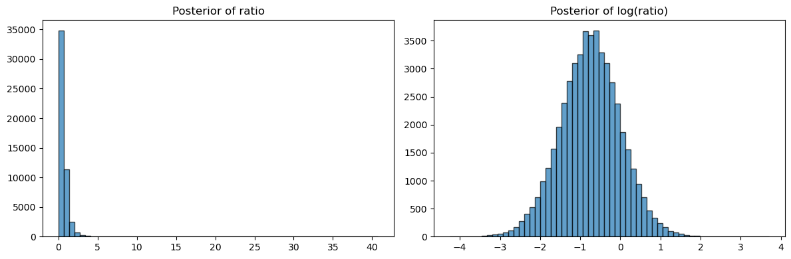

# Bayes 분산 검정

## 개요

이 페이지는 두 집단의 분산을 비교하는 Bayes 접근을 제시한다. $p$값 하나를 계산하는 대신, Bayes 틀은 각 집단의 분산과 분산비에 대한 완전한 사후분포를 만들어 낸다. 켤레 정규-역감마 모형을 쓰고 몬테카를로로 사후표본을 뽑은 뒤 신용구간과 사후확률로 결과를 요약한다.

---

## 정규-역감마 모형

각 집단 $i$에 대해 자료를 $x_{ij} \mid \mu_i, \sigma_i^2 \sim \mathcal{N}(\mu_i, \sigma_i^2)$로 모형화하고 켤레 사전분포를 둔다.

$$
\mu_i \mid \sigma_i^2 \sim \mathcal{N}\!\left(m_0,\; \frac{\sigma_i^2}{\kappa_0}\right), \qquad \sigma_i^2 \sim \text{Inv-Gamma}(\alpha_0, \beta_0)
$$

여기서 $m_0$, $\kappa_0$, $\alpha_0$, $\beta_0$은 초모수이다. 모호한 사전분포($\kappa_0 \approx 0$, $\alpha_0 \approx 0$, $\beta_0 \approx 0$)에서는 사후분포를 자료가 지배한다.

## 사후 갱신

표본평균 $\bar{x}$와 편차제곱합 $S = \sum_{j=1}^{n}(x_j - \bar{x})^2$을 갖는 $n$개 관측값이 주어지면 사후 모수는

$$
\kappa_n = \kappa_0 + n, \qquad m_n = \frac{\kappa_0 m_0 + n \bar{x}}{\kappa_n}
$$

$$
\alpha_n = \alpha_0 + \frac{n}{2}, \qquad \beta_n = \beta_0 + \frac{1}{2}\left(S + \frac{\kappa_0 n}{\kappa_n}(\bar{x} - m_0)^2\right)
$$

분산의 주변 사후분포는

$$
\sigma_i^2 \mid \mathbf{x}_i \sim \text{Inv-Gamma}(\alpha_n,\, \beta_n)
$$

!!! note "$n/2$인가 $(n-1)/2$인가"
    여기서 $\alpha_n = \alpha_0 + n/2$인 것이 15.6절 [Bayes 분산 검정](./bayesian_variance.md)의 $\alpha_n = \alpha_0 + (n-1)/2$와 다르다. **두 모형이 다르기 때문이다.**

    - **15.6절**은 $\mu$에 사전분포를 두지 않고 $\bar{x}$로 대체한 뒤 자유도 $n-1$을 쓴다. 이 경우 무정보 극한에서 빈도주의 결과와 정확히 일치한다.
    - **여기**는 $\mu \mid \sigma^2 \sim \mathcal{N}(m_0, \sigma^2/\kappa_0)$이라는 결합 켤레 사전분포를 둔다. $\mu$를 적분해 내면 $\alpha_n = \alpha_0 + n/2$가 된다.

    $\kappa_0 \to 0$인 극한은 사전분포 $p(\mu, \sigma^2) \propto (\sigma^2)^{-\alpha_0 - 3/2}$에 해당하며, 표준적인 Jeffreys 사전분포 $p(\mu,\sigma^2) \propto 1/\sigma^2$과 다르다. 그래서 **신용구간이 빈도주의 신뢰구간보다 약간 좁게 나온다.**

    아래 예제에서 $\sigma_1^2$의 95% 신용구간은 $(1.133, 9.085)$인데 빈도주의 신뢰구간은 $(1.241, 11.761)$이다. 로그 척도 폭으로 $2.082$ 대 $2.249$로 **7% 좁다**. $n = 8$처럼 작은 표본에서 이 차이가 눈에 띈다.

    빈도주의 결과와 일치시키려면 $\alpha_0 = -1/2$로 두어 $\alpha_n = (n-1)/2$가 되게 하면 된다(부적절 사전분포이지만 사후분포는 적절하다).

---

## 구현

다음 코드는 사후 모수를 계산하고 $\sigma^2$의 사후분포에서 표본을 뽑는다.

```python
import numpy as np
from scipy.stats import invgamma

def posterior_params(x, m0=0.0, k0=1e-6, a0=1e-2, b0=1e-2):
    x = np.asarray(x, dtype=float)
    n = x.size
    xbar = x.mean()
    S = np.sum((x - xbar)**2)
    k_n = k0 + n
    m_n = (k0 * m0 + n * xbar) / k_n
    a_n = a0 + n / 2.0
    b_n = b0 + 0.5 * (S + (k0 * n / k_n) * (xbar - m0)**2)
    return m_n, k_n, a_n, b_n

def draw_posterior_sigma2(x, n_draws=10000, rng=None):
    if rng is None:
        rng = np.random.default_rng()
    m_n, k_n, a_n, b_n = posterior_params(x)
    sig2 = invgamma(a=a_n, scale=b_n).rvs(size=n_draws, random_state=rng)
    return sig2
```

---

## 두 집단 비교

$\sigma_1^2$과 $\sigma_2^2$을 비교하려면 각 사후분포에서 독립적으로 뽑아 비를 만든다.

$$
\rho = \frac{\sigma_1^2}{\sigma_2^2}
$$

$\rho$의 95% 신용구간이 1을 제외하면 분산이 다르다는 증거가 된다.

```python
x1 = np.array([12, 15, 14, 10, 13, 14, 12, 11], dtype=float)
x2 = np.array([22, 25, 20, 18, 24, 23, 19, 21], dtype=float)

rng = np.random.default_rng(0)
s1 = draw_posterior_sigma2(x1, n_draws=20000, rng=rng)
s2 = draw_posterior_sigma2(x2, n_draws=20000, rng=rng)
ratio = s1 / s2

print(f"Sample variances:           {np.var(x1, ddof=1):.4f}, "
      f"{np.var(x2, ddof=1):.4f}")
print(f"Posterior mean of sigma1^2: {s1.mean():.3f}")
print(f"Posterior mean of sigma2^2: {s2.mean():.3f}")
print(f"Posterior mean of ratio:    {ratio.mean():.3f}")
print(f"95% credible interval:      ({np.percentile(ratio, 2.5):.3f}, "
      f"{np.percentile(ratio, 97.5):.3f})")
print(f"P(sigma1^2 > sigma2^2):     {np.mean(ratio > 1.0):.4f}")
```

출력:

```text
Sample variances:           2.8393, 6.0000
Posterior mean of sigma1^2: 3.317
Posterior mean of sigma2^2: 6.956
Posterior mean of ratio:    0.634
95% credible interval:      (0.106, 2.074)
P(sigma1^2 > sigma2^2):     0.1573
```

신용구간 $(0.106, 2.074)$가 1을 포함하므로 등분산과 일관된다. $P(\sigma_1^2 > \sigma_2^2 \mid \text{자료}) = 0.157$이므로 집단 1의 분산이 더 작을 가능성이 84%이지만 확정하기에는 부족하다.

!!! warning "사후평균이 표본분산보다 크다"
    표본분산은 $2.839$와 $6.000$인데 사후평균은 $3.317$과 $6.956$이다. 각각 17%와 16% 크다.

    사전분포의 영향이 아니라 **역감마분포가 오른쪽으로 치우쳐 있어서** 평균이 최빈값보다 크기 때문이다. 사후 최빈값은 $\beta_n/(\alpha_n+1) = 9.948/5.01 = 1.986$, 중앙값은 $2.702$로 오히려 표본분산보다 작다.

    **분산의 사후분포를 요약할 때는 평균보다 중앙값이나 최빈값이 나을 때가 많다.** 특히 $n$이 작으면 사후평균이 크게 위로 치우친다.

---

## 해석

- 각 $\sigma_i^2$의 사후분포가 자료와 사전분포가 주어졌을 때 집단분산에 대한 모든 정보를 요약한다.
- 사후확률 $P(\sigma_1^2 > \sigma_2^2 \mid \text{자료})$는 고정된 유의수준 없이 관심 질문에 직접 답한다.
- 모호한 사전분포에서 Bayes 신용구간이 빈도주의 신뢰구간을 근사하지만 해석이 다르다. 신용구간은 "참 모수가 이 구간에 있을 확률이 95%"라고 말한다(모형과 사전분포가 주어졌을 때).

!!! danger "이 방법도 정규성을 가정한다"
    "고전적 $F$ 검정과 달리 이 접근은 검정 절차 자체에서 정규성을 가정하지 않는다"는 서술을 볼 수 있으나 **오해를 부른다.**

    가능도가 $x_{ij} \sim \mathcal{N}(\mu_i, \sigma_i^2)$이므로 **정규성 가정이 모형의 핵심에 들어 있다.** 자료가 비정규이면 사후분포 자체가 잘못 설정되며, 그 취약성은 Bartlett 검정이나 $F$ 검정과 본질적으로 같다.

    Bayes 접근이 얻는 것은 (1) 확률적 해석과 (2) 사전정보의 반영이지, 분포 가정으로부터의 자유가 아니다.

    비정규 자료에 로버스트한 Bayes 분석을 하려면 가능도를 $t$ 분포로 바꾸거나 비모수 사전분포(Dirichlet 과정 등)를 써야 하며, 그러면 켤레성이 깨져 MCMC가 필요하다.

---

## 연습문제

<div class="drillbox" markdown>

**연습문제 1.** 역감마 사전분포 $\sigma^2 \sim \text{Inv-Gamma}(\alpha_0, \beta_0)$과 정규 가능도에서 출발하여 위의 사후 모수 $\alpha_n$과 $\beta_n$을 유도하라. 켤레 갱신의 각 단계를 보여라.

</div>

??? success "풀이"

    $\mu$가 알려진 $\mathcal{N}(\mu, \sigma^2)$에서 나온 $n$개 관측값의 가능도는

    $$
    L(\sigma^2) \propto (\sigma^2)^{-n/2} \exp\!\left(-\frac{S}{2\sigma^2}\right)
    $$

    여기서 $S = \sum(x_j - \mu)^2$이다. 역감마 사전분포의 밀도는

    $$
    p(\sigma^2) \propto (\sigma^2)^{-\alpha_0 - 1} \exp\!\left(-\frac{\beta_0}{\sigma^2}\right)
    $$

    곱하면

    $$
    p(\sigma^2 \mid \mathbf{x}) \propto (\sigma^2)^{-(\alpha_0 + n/2) - 1} \exp\!\left(-\frac{\beta_0 + S/2}{\sigma^2}\right)
    $$

    이는 $\text{Inv-Gamma}(\alpha_0 + n/2,\; \beta_0 + S/2)$ 밀도의 핵이다.

    **$\mu$를 모를 때.** 결합 정규-역감마 사전분포를 쓰면 $\mu$를 적분해 낼 때 추가 항이 나타난다.

    $$
    \int \exp\!\left(-\frac{n(\bar x - \mu)^2 + \kappa_0(\mu - m_0)^2}{2\sigma^2}\right) d\mu
    $$

    지수부의 이차식을 $\mu$에 대해 완전제곱으로 정리하면

    $$
    n(\bar x - \mu)^2 + \kappa_0(\mu - m_0)^2 = \kappa_n(\mu - m_n)^2 + \frac{\kappa_0 n}{\kappa_n}(\bar{x} - m_0)^2
    $$

    이고, $\mu$에 대해 적분하면 첫 항이 $\sqrt{2\pi\sigma^2/\kappa_n}$을 낳고(이것이 $\sigma^2$의 지수를 $1/2$만큼 바꾼다) 두 번째 항이 $\beta_n$에 더해진다. 그 결과

    $$
    \beta_n = \beta_0 + \frac{1}{2}\left(S + \frac{\kappa_0 n}{\kappa_n}(\bar{x} - m_0)^2\right)
    $$

    이고 $\alpha_n = \alpha_0 + n/2$이다. 여기서 $S$가 $\bar{x}$에 대한 편차제곱합으로 바뀐다는 점에 주의하라. $\square$

<div class="drillbox" markdown>

**연습문제 2.** 정보 사전분포를 쓰도록 코드를 수정하라. $\alpha_0 = 3$, $\beta_0 = 10$으로 두면 사전분포가 $\sigma^2 = 5$ 근처를 중심으로 한다. 모호한 사전분포로 얻은 신용구간과 비교하라. 표본크기가 작을 때 정보 사전분포가 결과에 어떤 영향을 주는가?

</div>

??? success "풀이"

    ```python
    import numpy as np
    from scipy.stats import invgamma

    def posterior_params(x, m0=0.0, k0=1e-6, a0=1e-2, b0=1e-2):
        x = np.asarray(x, dtype=float)
        n = x.size
        xbar = x.mean()
        S = np.sum((x - xbar)**2)
        k_n = k0 + n
        a_n = a0 + n / 2.0
        b_n = b0 + 0.5 * (S + (k0 * n / k_n) * (xbar - m0)**2)
        return a_n, b_n

    x1 = np.array([12, 15, 14, 10, 13, 14, 12, 11], dtype=float)
    rng = np.random.default_rng(0)

    a_v, b_v = posterior_params(x1, a0=1e-2, b0=1e-2)      # vague
    draws_v = invgamma(a=a_v, scale=b_v).rvs(20000, random_state=rng)

    a_i, b_i = posterior_params(x1, a0=3, b0=10)           # informative
    draws_i = invgamma(a=a_i, scale=b_i).rvs(20000, random_state=rng)

    print(f"Vague:       a={a_v:.2f}, b={b_v:.2f}, mean={draws_v.mean():.2f}, "
          f"CI=({np.percentile(draws_v,2.5):.2f}, {np.percentile(draws_v,97.5):.2f})")
    print(f"Informative: a={a_i:.2f}, b={b_i:.2f}, mean={draws_i.mean():.2f}, "
          f"CI=({np.percentile(draws_i,2.5):.2f}, {np.percentile(draws_i,97.5):.2f})")
    ```

    출력:

    ```text
    Vague:       a=4.01, b=9.95, mean=3.32, CI=(1.13, 9.11)
    Informative: a=7.00, b=19.94, mean=3.32, CI=(1.53, 7.09)
    ```

    !!! note "평균은 거의 그대로이고 구간만 좁아졌다"
        정보 사전분포가 사후평균을 $\sigma^2 = 5$ 쪽으로 끌어당길 것으로 예상되지만, 두 사후평균이 모두 $3.32$로 사실상 같다.

        우연이 아니라 역감마분포의 구조 때문이다. 사후평균은 $\beta_n/(\alpha_n-1)$인데, 정보 사전분포가 $\alpha_n$을 $4.01 \to 7.00$으로, $\beta_n$을 $9.95 \to 19.94$로 **비슷한 비율로** 키웠다. $19.94/6 = 3.32$와 $9.95/3.01 = 3.31$이 우연히 일치한 것이다.

        분명하게 바뀐 것은 **구간의 폭**이다. $(1.13, 9.11)$에서 $(1.53, 7.09)$로, 로그 척도 폭이 $2.087$에서 $1.533$으로 **27% 좁아졌다**. 정보 사전분포가 추가한 정보가 불확실성을 줄인 것이다.

    $\alpha_0 = 3$은 관측값 약 $2\alpha_0 = 6$개어치의 정보에 해당하므로, $n = 8$인 자료와 대등한 영향력을 갖는다. 그래서 구간이 눈에 띄게 좁아진다.

    $n$이 커지면 사전분포의 영향이 줄어들고 두 사후분포가 수렴한다. $n = 100$이면 $\alpha_n$이 $50.01$ 대 $53$으로 6% 차이에 불과하다. $\square$

<div class="drillbox" markdown>

**연습문제 3.** $\mathcal{N}(0, 4)$에서 $n_1 = 30$개, $\mathcal{N}(0, 9)$에서 $n_2 = 30$개를 생성하라. 분산비 $\rho = \sigma_1^2 / \sigma_2^2$의 사후분포를 계산하고 $P(\rho < 1 \mid \text{자료})$를 구하라. 고전적 $F$ 검정의 $p$값과 비교하라.

</div>

??? success "풀이"

    ```python
    import numpy as np
    from scipy.stats import invgamma, f as f_dist

    def posterior_params(x, m0=0.0, k0=1e-6, a0=1e-2, b0=1e-2):
        n = x.size
        xbar = x.mean()
        S = np.sum((x - xbar)**2)
        k_n = k0 + n
        a_n = a0 + n / 2.0
        b_n = b0 + 0.5 * (S + (k0 * n / k_n) * (xbar - m0)**2)
        return a_n, b_n

    rng = np.random.default_rng(42)
    x1 = rng.normal(0, 2, 30)     # sd = 2, so variance = 4
    x2 = rng.normal(0, 3, 30)     # sd = 3, so variance = 9

    print(f"sample variances: {np.var(x1, ddof=1):.3f}, "
          f"{np.var(x2, ddof=1):.3f} (true: 4, 9)")

    a1, b1 = posterior_params(x1)
    a2, b2 = posterior_params(x2)
    s1 = invgamma(a=a1, scale=b1).rvs(50000, random_state=rng)
    s2 = invgamma(a=a2, scale=b2).rvs(50000, random_state=rng)
    ratio = s1 / s2

    print(f"P(rho < 1 | data) = {np.mean(ratio < 1):.4f}")

    F_stat = np.var(x1, ddof=1) / np.var(x2, ddof=1)
    p_val = 2 * min(f_dist.cdf(F_stat, 29, 29), f_dist.sf(F_stat, 29, 29))
    print(f"F-test: F = {F_stat:.4f}, p = {p_val:.4f}")
    ```

    출력:

    ```text
    sample variances: 2.413, 5.828 (true: 4, 9)
    P(rho < 1 | data) = 0.9908
    F-test: F = 0.4141, p = 0.0205
    ```

    두 접근이 같은 방향의 결론을 준다. 사후확률 $P(\rho < 1) = 0.991$이 높고 $F$ 검정의 $p$값 $0.021$이 작다.

    **두 수치의 관계.** 양측 $p$값 $0.0205$의 절반인 단측 $p$값이 $0.0103$이고, $1 - 0.9908 = 0.0092$와 매우 가깝다. **우연이 아니다.** 무정보 사전분포에서 Bayes 사후확률과 빈도주의 단측 $p$값이 수치적으로 일치하는 것이 위치-척도 모수에 대한 일반적 성질이다.

    작은 차이($0.0092$ 대 $0.0103$)는 앞서 논한 $n/2$ 대 $(n-1)/2$ 자유도 차이에서 온다.

    **해석은 다르다.** $p = 0.021$은 "등분산이 참이라면 이만큼 극단적인 자료가 나올 확률이 2.1%"이고, $P(\rho < 1) = 0.991$은 "이 자료를 보았을 때 $\sigma_1^2 < \sigma_2^2$일 확률이 99.1%"이다. 후자가 대체로 사람들이 알고 싶어 하는 것이며, $p$값을 이렇게 해석하는 흔한 오류의 근원이기도 하다. $\square$

<div class="drillbox" markdown>

**연습문제 4.** Bayes 접근이 분산비 자체보다 그 로그($\log(\sigma_1^2/\sigma_2^2)$)로 요약하는 이유를 설명하라. 사후표본 50,000개를 뽑아 $\rho$와 $\log(\rho)$의 히스토그램을 그려라. 어느 쪽이 대칭에 가까운가?

</div>

??? success "풀이"

    ```python
    import numpy as np
    from scipy.stats import invgamma, skew
    import matplotlib.pyplot as plt

    def posterior_params(x, m0=0.0, k0=1e-6, a0=1e-2, b0=1e-2):
        n = x.size; xbar = x.mean(); S = np.sum((x - xbar)**2)
        k_n = k0 + n
        a_n = a0 + n / 2.0
        b_n = b0 + 0.5 * (S + (k0 * n / k_n) * (xbar - m0)**2)
        return a_n, b_n

    x1 = np.array([12, 15, 14, 10, 13, 14, 12, 11], dtype=float)
    x2 = np.array([22, 25, 20, 18, 24, 23, 19, 21], dtype=float)
    rng = np.random.default_rng(0)

    a1, b1 = posterior_params(x1)
    a2, b2 = posterior_params(x2)
    s1 = invgamma(a=a1, scale=b1).rvs(50000, random_state=rng)
    s2 = invgamma(a=a2, scale=b2).rvs(50000, random_state=rng)
    ratio = s1 / s2

    print(f"skewness of ratio:     {skew(ratio):.3f}")
    print(f"skewness of log ratio: {skew(np.log(ratio)):.3f}")

    fig, axes = plt.subplots(1, 2, figsize=(12, 4))
    axes[0].hist(ratio, bins=60, edgecolor='k', alpha=0.7)
    axes[0].set_title("Posterior of ratio")
    axes[1].hist(np.log(ratio), bins=60, edgecolor='k', alpha=0.7)
    axes[1].set_title("Posterior of log(ratio)")
    plt.tight_layout()
    plt.show()
    ```

    출력:

    ```text
    skewness of ratio:     9.518
    skewness of log ratio: -0.017
    ```

    

    **차이가 극적이다.** 비의 왜도가 $9.52$인데 로그를 취하면 $-0.017$로 사실상 완벽히 대칭이 된다.

    비 $\rho = \sigma_1^2/\sigma_2^2$은 아래로 0에 의해 유계이고 오른쪽 꼬리가 무겁다. 로그 변환은 $(0, \infty)$를 $(-\infty, \infty)$로 보내 훨씬 대칭에 가까운 분포를 만든다.

    **왜 정확히 대칭이 되는가.** $\sigma_1^2$과 $\sigma_2^2$이 독립인 역감마이므로 $\rho$는 척도가 조정된 $F$ 분포를 따르고, $\log \rho$는 Fisher의 $z$ 분포를 따른다. $\alpha_1 = \alpha_2$(여기서 둘 다 $4.01$)이면 $\log\rho$의 분포가 그 중심을 기준으로 **정확히 대칭**이다. 15.8절 [F 분포와 자유도](../f_test/f_distribution_details.md) 연습문제 4에서 확인한 역수 성질과 같은 사실이다.

    대칭 분포는 평균과 신용구간으로 요약하기 쉽고, 로그 척도의 백분위 구간은 상대적 관점에서 더 균형 잡힌 구간으로 되돌아간다.

    (다만 15.8절 [붓스트랩 분산 검정](bootstrap_var_test.md)에서 논했듯, **백분위 구간 자체는 단조변환에 불변**이므로 신용구간의 끝점은 어느 척도에서 계산하든 같다. 로그가 도움이 되는 것은 시각화, 정규근사, 사후 요약통계량의 해석에서다.) $\square$

<div class="drillbox" markdown>

**연습문제 5.** Bayes 분산 검정과 고전적 $F$ 검정이 실질적으로 다른 결론을 낼 상황을 기술하라. 표본크기, 사전분포의 정보량, 정규성 이탈의 역할을 고려하라.

</div>

??? success "풀이"

    두 접근이 가장 크게 갈리는 상황은 다음과 같다.

    **1. 작은 표본 + 정보 사전분포.** $n$이 매우 작고(집단당 5 정도) 연구자가 등분산을 지지하는 강한 사전정보를 갖고 있으면, 표본분산이 중간 정도로 달라도 $\rho$의 사후분포가 1 근처에 집중된다. $F$ 검정은 사전정보를 무시하고 잡음이 섞인 표본추정값만으로 기각 여부를 정한다.

    연습문제 2에서 $n = 8$, $\alpha_0 = 3$인 사전분포가 신용구간을 27% 좁혔음을 보았다. $n = 5$이면 효과가 더 크다.

    **2. 비정규 자료.** $F$ 검정은 정규성 이탈에 매우 민감하다. 꼬리가 두꺼우면 표본분산이 부풀려져 제1종 오류가 커진다.

    **그러나 여기 제시한 Bayes 모형도 가능도에서 정규성을 가정하므로 같은 오설정을 겪는다.** 위 경고 상자에서 지적한 대로이다. 이것이 두 방법이 **다르게** 반응하는 경우가 아니라 **똑같이** 실패하는 경우이다.

    Bayes 틀이 유리해지는 지점은 로버스트 가능도(Student $t$ 등)로 확장할 수 있다는 것이며, 그러면 이상점을 우아하게 처리한다. 하지만 그것은 다른 모형이지 위 코드가 아니다.

    **3. 단측 질문.** Bayes 접근은 $P(\sigma_1^2 > \sigma_2^2)$에 자연스럽게 답하지만, $F$ 검정은 보통 양측으로 설정되며 단측 대립가설에는 명시적 수정이 필요하다. 질문이 방향성을 가질 때 사후확률이 더 직접적이고 해석하기 쉬운 답을 준다.

    연습문제 3에서 $P(\rho < 1) = 0.991$이 단측 $p$값 $0.010$과 수치적으로 대응했음을 보았다. **무정보 사전분포에서는 두 수치가 사실상 같으므로 이 항목의 차이는 계산이 아니라 해석에 있다.**

    **4. 결정이론적 활용.** Bayes 사후분포는 손실함수와 결합하여 최적 결정을 내리는 데 쓸 수 있다. 예컨대 "$\rho > 1.5$이면 공정을 조정한다"는 결정 규칙에 대해 $P(\rho > 1.5 \mid \text{자료})$를 직접 계산할 수 있다. $F$ 검정은 $H_0: \rho = 1$이라는 점가설만 다루므로 이런 질문에 직접 답하지 못한다.

    **요약.** 무정보 사전분포와 정규 자료에서는 두 방법이 수치적으로 거의 같다. 차이가 나는 것은 (1) 사전정보가 있을 때, (2) 관심 질문이 점가설이 아닐 때이며, (3) 비정규성은 **두 방법 모두의 문제**이지 한쪽의 장점이 아니다. $\square$

---

## 정리하며

베이즈 분산 비교의 **구현**이다.

- **정규–역감마 켤레 모형을 쓴다.** 사후분포가 닫힌 형태로 나오므로 MCMC 없이 직접 표본을 뽑을 수 있다.
- **몬테카를로로 사후표본을 만든다.** 각 집단의 $\sigma_i^2$ 을 사후분포에서 뽑고 비를 계산하면 분산비의 사후표본이 된다.
- **결과가 세 가지 형태로 요약된다.** 사후평균, 신용구간, 그리고 $P(\sigma_1^2/\sigma_2^2>1\mid\text{자료})$ 같은 직접 확률.
- **신용구간이 $1$ 을 포함하는지가 판정에 해당하지만**, 베이즈에서는 그 확률 자체를 보고하는 편이 자연스럽다.
- **사전분포를 바꿔 가며 민감도를 본다.** 결론이 크게 흔들리면 자료가 부족하다는 신호다.

다음 절 **응용**으로 15장을 마무리한다.
