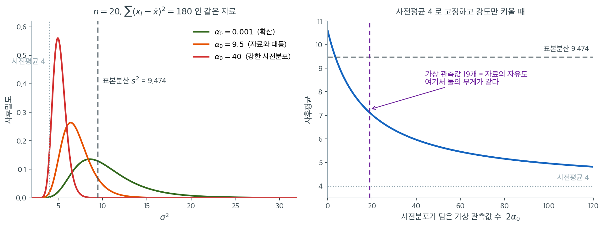
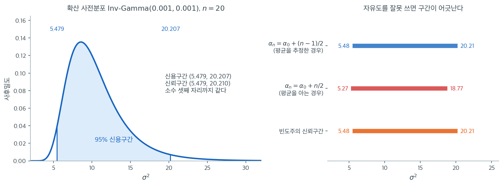

# Bayes 분산 검정

빈도주의 분산 검정은 표집분포와 $p$값에 기댄다. Bayes 접근은 근본적으로 다른 관점을 취한다. 모분산 $\sigma^2$을 사전분포를 갖는 확률변수로 취급하고, 관측 자료로 이 분포를 갱신한 뒤, 그 결과인 사후분포를 통해 추론한다. 이 틀은 $\sigma^2$에 대한 불확실성을 수량화하고 집단 간 분산을 비교하는 자연스러운 방법을 제공한다.

---

## 1. 분산에 대한 켤레 사전분포

자료가 알려진 평균 $\mu$를 갖는 정규분포를 따를 때 분산 $\sigma^2$의 켤레 사전분포는 **역감마**분포이다.

$$
\sigma^2 \sim \text{Inv-Gamma}(\alpha_0, \beta_0)
$$

밀도는

$$
p(\sigma^2) = \frac{\beta_0^{\alpha_0}}{\Gamma(\alpha_0)} (\sigma^2)^{-\alpha_0 - 1} \exp\!\left(-\frac{\beta_0}{\sigma^2}\right), \quad \sigma^2 > 0
$$

초모수 $\alpha_0 > 0$과 $\beta_0 > 0$이 사전 믿음을 부호화한다.

- $\alpha_0$은 사전분포의 강도를 조절한다($\alpha_0$이 클수록 사전 믿음이 강하다)
- $\beta_0 / \alpha_0$은 $\sigma^2$의 사전 기댓값을 근사한다($\alpha_0$이 클 때)
- 사전평균은 $\alpha_0 > 1$일 때 $E[\sigma^2] = \beta_0 / (\alpha_0 - 1)$이다

흔히 쓰는 약정보 선택은 $\alpha_0 = \beta_0 = 0.01$(또는 $\alpha_0 = \beta_0 = 0.001$)이며, 자료가 지배하도록 하는 확산 사전분포를 만든다.

!!! note "$\alpha_0$을 "가상 관측값 수"로 읽기"
    사후 갱신식 $\alpha_n = \alpha_0 + (n-1)/2$을 보면 $\alpha_0$이 자유도의 절반 단위로 더해진다. 곧 **사전분포는 약 $2\alpha_0$개의 관측값에 해당하는 정보를 담는다.**

    $\alpha_0 = 0.01$이면 관측값 0.02개어치이므로 사실상 무정보이다. $\alpha_0 = 50$이면 관측값 100개어치이므로 $n = 100$인 자료와 대등한 영향력을 갖는다(연습문제 3 참조).

이 "가상 관측값" 해석이 말뿐이 아니라는 것을 그림으로 확인하자. 연습문제 1의 자료($n = 20$, $\sum(x_i-\bar{x})^2 = 180$, 곧 $s^2 = 9.474$)를 고정해 놓고 사전평균만 4로 두고 사전분포의 **강도** $\alpha_0$을 바꾼다.



왼쪽에서 초록($\alpha_0 = 0.001$)은 사실상 자료만으로 만든 사후분포다. 봉우리가 표본분산 $9.474$ 근처에 있다. 빨강($\alpha_0 = 40$)은 사전평균 4 쪽으로 완전히 끌려가 봉우리가 5 부근이고 폭도 훨씬 좁다. **같은 자료인데 사전분포만 바꾸어 결론이 두 배 가까이 달라졌다.**

오른쪽이 그 관계를 하나의 곡선으로 요약한다. 가로축이 $2\alpha_0$, 곧 사전분포가 담고 있다는 가상 관측값의 수다. $2\alpha_0 = 0$에서 사후평균은 표본분산 근처이고, $2\alpha_0$가 커질수록 사전평균 4로 단조롭게 내려간다.

주목할 곳은 보라색 세로선이다. $2\alpha_0 = 19$, 곧 자료의 자유도 $n - 1$과 같아지는 지점에서 사후평균이 $7.11$이다. 표본분산 $9.474$와 사전평균 $4$의 대략 중간이다. **사전분포와 자료가 정확히 같은 무게를 갖는 자리**이며, $\alpha_n = \alpha_0 + (n-1)/2$라는 갱신식이 문자 그대로 말하던 것이 이 그림이다.

실무적 함의는 두 가지다. 첫째, 사전분포를 고를 때 $\alpha_0$을 "얼마나 믿는가"가 아니라 **"관측값 몇 개어치를 보태는가"**로 바꿔 생각하면 판단이 훨씬 쉬워진다. 둘째, $n$이 작을수록 같은 $\alpha_0$의 영향력이 커진다. $n = 20$에서 $\alpha_0 = 10$은 자료를 압도하지만 $n = 500$에서는 거의 보이지 않는다.

---

## 2. 사후분포

$\mu$가 알려진 관측값 $X_1, \ldots, X_n \sim N(\mu, \sigma^2)$이 주어지면 $\sigma^2$의 사후분포도 역감마이다.

$$
\sigma^2 \mid X_1, \ldots, X_n \sim \text{Inv-Gamma}(\alpha_n, \beta_n)
$$

여기서

$$
\alpha_n = \alpha_0 + \frac{n}{2}, \qquad \beta_n = \beta_0 + \frac{1}{2}\sum_{i=1}^{n}(X_i - \mu)^2
$$

$\mu$를 모르는 (보통의) 경우에는 $\mu$를 $\bar{X}$로 바꾸고 자유도 $n - 1$을 쓴다.

$$
\alpha_n = \alpha_0 + \frac{n - 1}{2}, \qquad \beta_n = \beta_0 + \frac{(n-1)S^2}{2}
$$

!!! warning "두 공식을 섞지 말라"
    $\mu$를 아는 경우는 $\alpha_n = \alpha_0 + n/2$, 모르는 경우는 $\alpha_n = \alpha_0 + (n-1)/2$이다. $\beta_n$의 제곱합도 각각 $\sum(X_i-\mu)^2$과 $\sum(X_i-\bar X)^2 = (n-1)S^2$으로 다르다.

    실무에서는 거의 항상 $\mu$를 모르므로 두 번째 공식을 쓴다. $n$과 $n-1$을 혼동하면 $n$이 작을 때 결과가 눈에 띄게 달라진다.

이 켤레성 덕분에 사후분포가 닫힌 형태를 가지므로 계산이 간단하다.

---

## 3. Bayes 신용구간

$\sigma^2$의 $100(1-\alpha)\%$ 신용구간은 다음을 만족하는 구간 $[L, U]$이다.

$$
P(L \le \sigma^2 \le U \mid \text{자료}) = 1 - \alpha
$$

역감마 사후분포에서는 $\text{Inv-Gamma}(\alpha_n, \beta_n)$의 분위수로 신용구간을 얻는다.

!!! note "신용구간과 신뢰구간"
    Bayes 신용구간은 직접적인 확률 해석을 갖는다. 자료와 사전분포가 주어졌을 때 $\sigma^2$이 그 구간 안에 있을 확률이 $(1-\alpha)$이다. 빈도주의 신뢰구간은 그런 주장을 하지 않는다. 반복된 표본의 $(1-\alpha)$에서 절차가 $\sigma^2$을 포함한다는 뜻이다. 확산 사전분포에서는 두 구간이 수치적으로 비슷하다.

    연습문제 1에서 확산 사전분포를 쓰면 두 구간이 소수 셋째 자리까지 **일치**함을 확인한다.



왼쪽은 같은 자료($n = 20$, $\sum(x_i-\bar{x})^2 = 180$)에 $\text{Inv-Gamma}(0.001, 0.001)$을 쓴 사후분포다. 95% 신용구간이 $(5.479,\ 20.207)$이고 빈도주의 신뢰구간이 $(5.479,\ 20.210)$이다. **소수 셋째 자리까지 같다.** 우연이 아니라 확산 사전분포에서 사후분포 $\text{Inv-Gamma}(\alpha_0 + (n-1)/2,\ \beta_0 + (n-1)S^2/2)$가 $(n-1)S^2/\chi^2_{n-1}$의 분포와 사실상 같아지기 때문이다.

같은 숫자라고 해서 같은 말은 아니다. **신용구간은 "$\sigma^2$이 이 구간에 있을 확률이 0.95"라고 말하고, 신뢰구간은 "이 절차를 반복하면 95%가 참값을 덮는다"고 말한다.** 전자는 이 한 번의 자료에 대한 진술이고 후자는 절차의 장기 성질에 대한 진술이다. 숫자가 겹치는 것은 확산 사전분포라는 특수한 상황의 결과일 뿐이며, 사전분포가 정보를 담기 시작하면 두 구간은 곧바로 갈라진다.

오른쪽은 자유도를 잘못 썼을 때다. $\mu$를 모르는데도 $\alpha_n = \alpha_0 + n/2$를 쓰면 구간이 $(5.27,\ 18.77)$로 **위쪽이 눈에 띄게 짧아진다.** 자료가 주지 않은 정보 한 조각을 있다고 친 셈이라 불확실성이 과소평가된 것이다. $n$이 작을수록 이 차이가 커지므로, 평균을 자료에서 추정했다면 반드시 $(n-1)/2$를 써야 한다.

---

## 4. Bayes 가설검정

$H_0\colon \sigma^2 = \sigma_0^2$을 $H_1\colon \sigma^2 \neq \sigma_0^2$에 대해 검정하려면 Bayes 접근은 $H_0$의 사후확률을 계산하거나 **Bayes 인자**를 쓴다.

$$
\text{BF}_{01} = \frac{p(\text{자료} \mid H_0)}{p(\text{자료} \mid H_1)}
$$

여기서 $p(\text{자료} \mid H_0)$은 $H_0$ 아래의 주변가능도($\sigma^2$이 $\sigma_0^2$으로 고정)이고 $p(\text{자료} \mid H_1)$은 $\sigma^2$의 사전분포에 대해 가능도를 적분한 것이다.

두 분산을 비교하는 더 간단한 접근은 분산비의 사후분포를 쓰는 것이다. $\sigma_1^2$과 $\sigma_2^2$의 독립인 사후분포가 주어지면

$$
R = \frac{\sigma_1^2}{\sigma_2^2}
$$

를 계산한다. $R$의 $95\%$ 신용구간이 1을 포함하면 자료가 등분산과 일관된다.

---

## 5. 두 분산 비교

역감마 사후분포를 갖는 독립인 두 집단에 대해

$$
\sigma_1^2 \mid \text{자료}_1 \sim \text{Inv-Gamma}(\alpha_{n_1}, \beta_{n_1})
$$

$$
\sigma_2^2 \mid \text{자료}_2 \sim \text{Inv-Gamma}(\alpha_{n_2}, \beta_{n_2})
$$

비 $R = \sigma_1^2 / \sigma_2^2$은 사실 **닫힌 형태를 갖는다.** 독립인 두 역감마의 비는 척도변환된 $F$ 분포다:

$$
R = \frac{\sigma_1^2}{\sigma_2^2} \sim \frac{\beta_{n_1}\,\alpha_{n_2}}{\beta_{n_2}\,\alpha_{n_1}}\; F(2\alpha_{n_2},\, 2\alpha_{n_1})
$$

$\sigma^2 \sim \text{Inv-Gamma}(\alpha, \beta)$이면 $1/\sigma^2 \sim \text{Gamma}(\alpha, \text{rate}=\beta)$이고, 독립인 두 감마의 비가 $F$가 되는 표준 결과를 쓰면 바로 나온다. 그러므로 사후확률과 신뢰구간을 모의실험 없이 $F$ 분포함수로 바로 구할 수 있다.

그래도 몬테카를로 표집을 쓰는 이유는 **이 꼴이 켤레 사전분포에만 통하기** 때문이다. 사전분포를 바꾸거나 모수를 하나 더 넣으면 닫힌 꼴이 사라지지만 표집은 그대로 쓸 수 있다. 아래는 그 일반적인 방법이고, 닫힌 꼴은 그 결과를 검산하는 데 쓴다. 첫 사후분포에서 $\sigma_1^{2(b)}$을, 둘째에서 $\sigma_2^{2(b)}$을 뽑고 $b = 1, \ldots, B$에 대해 $R^{(b)} = \sigma_1^{2(b)} / \sigma_2^{2(b)}$을 계산한다.

$\sigma_1^2 > \sigma_2^2$일 사후확률은

$$
P(\sigma_1^2 > \sigma_2^2 \mid \text{자료}) \approx \frac{1}{B}\sum_{b=1}^{B} \mathbf{1}(R^{(b)} > 1)
$$

<div class="exbox" markdown>

**보기 1.** <span class="diff easy" title="쉬움"></span> 분산의 베이즈 추정. 관측값 $n = 20$개의 표본분산이 $S^2 = 15.3$이다. 약정보 사전분포 $\sigma^2 \sim \text{Inv-Gamma}(0.01, 0.01)$을 쓰면

</div>

??? success "풀이"
    $$
    \alpha_n = 0.01 + \frac{19}{2} = 9.51
    $$

    $$
    \beta_n = 0.01 + \frac{19 \times 15.3}{2} = 145.36
    $$

    사후분포는 $\sigma^2 \mid \text{자료} \sim \text{Inv-Gamma}(9.51, 145.36)$이다.

    사후평균은 $\beta_n / (\alpha_n - 1) = 145.36 / 8.51 = 17.08$로 표본분산 15.3보다 크다. 이 차이는 사전분포의 영향이 아니라(사전분포는 거의 무정보이다) **역감마분포가 오른쪽으로 치우쳐 있어서 평균이 최빈값보다 크기** 때문이다. 최빈값은 $\beta_n/(\alpha_n+1) = 145.36/10.51 = 13.83$이고 중앙값은 $15.84$이다.

<div class="exbox" markdown>

**보기 2.** <span class="diff easy" title="쉬움"></span> 분산의 사후분포와 신용구간. 보기 1 의 자료($n = 20$, $S^2 = 15.3$, $\text{Inv-Gamma}(0.01, 0.01)$)를 쓴다.

**(1)** 추축량 $2\beta_n/\sigma^2 \sim \chi^2_{2\alpha_n}$ 을 끌어내 신용구간을 적고, **확산 사전분포에서 그것이 빈도주의 신뢰구간과 거의 같아지는 까닭**을 밝히시오. 또 두 구간 모두 **상한/하한 비가 자료와 무관**함과 사후 최빈값/평균의 비가 $\dfrac{\alpha_n-1}{\alpha_n+1}$ 임을 보이시오.

**(2)** 두 집단의 비 $R = \sigma_1^2/\sigma_2^2$ 의 사후분포도 **닫힌 꼴로 적힌다**는 것을 보이고($\alpha$ 가 서로 달라도 된다), 몬테카를로 추정값이 그 닫힌 꼴과 맞는지 확인하시오.

</div>

??? success "풀이"

    **(1) 추축량을 꺼낸다.** $V \sim \text{Inv-Gamma}(\alpha, \beta)$ 이면 $1/V \sim \text{Gamma}(\alpha, \text{rate } \beta)$ 이고, 감마의 척도를 두 배로 늘리면 비율모수가 $1/2$ 이 되어

    $$
    \frac{2\beta}{V} \sim \text{Gamma}\!\left(\alpha, \text{rate } \tfrac12\right) = \chi^2_{2\alpha}
    $$

    이다. 사후분포에 적용하면 $2\beta_n/\sigma^2 \sim \chi^2_{2\alpha_n}$ 이고, 이 추축량을 뒤집으면 등꼬리 신용구간이

    $$
    \left(\frac{2\beta_n}{\chi^2_{0.975,\,2\alpha_n}},\;
    \frac{2\beta_n}{\chi^2_{0.025,\,2\alpha_n}}\right)
    $$

    로 적힌다.

    **빈도주의와 거의 같아지는 까닭.** $\mu$ 를 모르는 경우의 갱신식은 $\alpha_n = \alpha_0 + \frac{n-1}{2}$, $\beta_n = \beta_0 + \frac{(n-1)S^2}{2}$ 이므로

    $$
    2\alpha_n = 2\alpha_0 + (n-1), \qquad 2\beta_n = 2\beta_0 + (n-1)S^2
    $$

    이다. $\alpha_0 = \beta_0 \to 0$ 이면 $2\alpha_n \to n-1$, $2\beta_n \to (n-1)S^2$ 가 되어 위 구간이

    $$
    \left(\frac{(n-1)S^2}{\chi^2_{0.975,\,n-1}},\;
    \frac{(n-1)S^2}{\chi^2_{0.025,\,n-1}}\right)
    $$

    로, 곧 15.2절의 빈도주의 신뢰구간과 **글자 하나까지 같은 식**이 된다. 빈도주의는 $(n-1)S^2/\sigma^2 \sim \chi^2_{n-1}$ 을 표집분포로 읽고 베이즈는 같은 양을 사후분포로 읽는데, 확산 사전분포에서는 그 두 읽기가 **같은 수**를 준다. $\alpha_0 = \beta_0 = 0.01$ 은 $0$ 이 아니므로 완전히 같지는 않고, $2\alpha_n = 19.02$ 대 $19$, $2\beta_n = 290.72$ 대 $290.70$ 만큼 비껴 있다.

    **상한/하한 비는 자료와 무관하다.** 두 구간 모두

    $$
    \frac{U}{L} = \frac{\chi^2_{0.975,\,d}}{\chi^2_{0.025,\,d}}
    $$

    인데 분자의 $2\beta_n$ (또는 $(n-1)S^2$)이 약분되기 때문이다. **자료는 구간의 위치만 정하고 그 상대적 폭은 자유도가 혼자 정한다.** 8장이 다룬 사실이며, 여기서는 $d = 2\alpha_n$ 인지 $d = n-1$ 인지만 다르다.

    **최빈값과 평균의 비.** 역감마의 최빈값은 $\beta_n/(\alpha_n+1)$, 평균은 $\beta_n/(\alpha_n-1)$ 이므로 $\beta_n$ 이 약분되어

    $$
    \frac{\text{최빈값}}{\text{평균}} = \frac{\alpha_n - 1}{\alpha_n + 1} < 1
    $$

    이다. **자료와 무관하게 평균이 최빈값보다 크다.** $\alpha_n$ 이 작을수록, 곧 $n$ 이 작을수록 비가 1 에서 멀어진다. 중앙값은 그 사이에 놓이는데 이것은 닫힌 꼴이 없으므로 수치로 확인한다.

    **(2) 비의 사후분포도 닫힌 꼴이다.** (1)의 추축량을 두 집단에 쓰면 $\sigma_i^2 = 2\beta_{n_i}/W_i$, $W_i \sim \chi^2_{2\alpha_{n_i}}$ 이고 두 집단이 독립이므로

    $$
    R = \frac{\sigma_1^2}{\sigma_2^2}
    = \frac{\beta_{n_1}}{\beta_{n_2}}\cdot\frac{W_2}{W_1}
    = \frac{\beta_{n_1}}{\beta_{n_2}}\cdot\frac{\alpha_{n_2}}{\alpha_{n_1}}
    \cdot\frac{W_2/(2\alpha_{n_2})}{W_1/(2\alpha_{n_1})}
    $$

    이다. 맨 끝의 비는 정의상 $F(2\alpha_{n_2},\, 2\alpha_{n_1})$ 이므로

    $$
    R \;\sim\; \frac{\beta_{n_1}\alpha_{n_2}}{\beta_{n_2}\alpha_{n_1}}\;
    F\bigl(2\alpha_{n_2},\, 2\alpha_{n_1}\bigr)
    $$

    가 된다. **두 집단의 $\alpha$ 가 달라도 성립한다.** 자유도만 비대칭으로 들어갈 뿐이다. 그러므로 신용구간과 $P(R>1)$ 도 손으로 적힌다.

    $$
    P(R > 1) = P\!\left(F(2\alpha_{n_2}, 2\alpha_{n_1}) > \frac{\beta_{n_2}\alpha_{n_1}}{\beta_{n_1}\alpha_{n_2}}\right)
    $$

    몬테카를로는 이 값을 $1/\sqrt B$ 만큼 흐려 돌려줄 뿐이다. 아래에서 그것을 확인한다.

    ```python
    import numpy as np
    from scipy import stats

    # 자료 요약값만 있으면 된다.
    n = 20
    s_squared = 15.3

    # 거의 정보를 주지 않는 사전분포. 값이 작을수록 사후분포가 자료에 맡겨진다.
    alpha_0, beta_0 = 0.01, 0.01

    # 역감마는 정규분포 분산의 켤레사전분포이므로 사후분포도 역감마다.
    # 평균을 모르는 경우라 자유도가 n-1 로 들어간다.
    alpha_n = alpha_0 + (n - 1) / 2
    beta_n = beta_0 + (n - 1) * s_squared / 2

    # 역감마는 오른쪽으로 치우쳐 있어 평균·최빈값·중앙값이 모두 다르다.
    # 어느 것을 점추정값으로 쓸지는 손실함수에 달렸다.
    print(f"Posterior: Inv-Gamma({alpha_n}, {beta_n:.2f})")
    print(f"Posterior mean:   {beta_n / (alpha_n - 1):.4f}")
    print(f"Posterior mode:   {beta_n / (alpha_n + 1):.4f}")
    print(f"Posterior median: {stats.invgamma.median(a=alpha_n, scale=beta_n):.4f}")

    # 95% 신용구간: 사후분포의 2.5·97.5 백분위점
    ci_lower = stats.invgamma.ppf(0.025, a=alpha_n, scale=beta_n)
    ci_upper = stats.invgamma.ppf(0.975, a=alpha_n, scale=beta_n)
    print(f"95% credible interval: ({ci_lower:.4f}, {ci_upper:.4f})")

    # 빈도주의 신뢰구간과 견준다. 사전분포가 거의 무정보이므로 두 구간이
    # 거의 겹친다. 다만 읽는 법이 다르다 — 신용구간은 "모수가 이 안에 있을
    # 확률이 95%"라고 그대로 말할 수 있다.
    fl = (n - 1) * s_squared / stats.chi2.ppf(0.975, n - 1)
    fu = (n - 1) * s_squared / stats.chi2.ppf(0.025, n - 1)
    print(f"95% confidence interval: ({fl:.4f}, {fu:.4f})")

    # 두 분산을 견주는 일은 베이즈 쪽에서 특히 간단하다. 두 사후분포에서
    # 뽑아 나누기만 하면 비의 사후분포가 나온다.
    rng = np.random.default_rng(42)
    alpha_n1, beta_n1 = 9.51, 145.36   # 집단 1 의 사후 모수
    alpha_n2, beta_n2 = 12.01, 120.10  # 집단 2 의 사후 모수

    sigma1_samples = stats.invgamma.rvs(a=alpha_n1, scale=beta_n1,
                                        size=10000, random_state=rng)
    sigma2_samples = stats.invgamma.rvs(a=alpha_n2, scale=beta_n2,
                                        size=10000, random_state=rng)

    ratio = sigma1_samples / sigma2_samples
    print(f"P(sigma1^2 > sigma2^2 | data) = {np.mean(ratio > 1):.3f}")
    print(f"95% credible interval for ratio: "
          f"({np.percentile(ratio, 2.5):.3f}, {np.percentile(ratio, 97.5):.3f})")

    # === (1) 추축량 2 beta_n / sigma^2 ~ chi2(2 alpha_n) 인가 ===
    print(f"\n--- (1) 추축량과 두 구간 ---")
    print(f"2 a_n = {2 * alpha_n:.2f}   (무정보 극한 n-1 = {n - 1})")
    print(f"2 b_n = {2 * beta_n:.2f}  (무정보 극한 (n-1)s^2 = {(n - 1) * s_squared:.2f})")
    piv = 2 * beta_n / stats.chi2(2 * alpha_n).ppf([0.975, 0.025])
    print(f"역감마 분위수로    : ({ci_lower:.6f}, {ci_upper:.6f})")
    print(f"2b_n/chi2(2a_n) 로 : ({piv[0]:.6f}, {piv[1]:.6f})")
    print(f"상한/하한  신용 {ci_upper / ci_lower:.6f}   신뢰 {fu / fl:.6f}")
    print(f"  chi2 분위수 비 (자료와 무관)")
    print(f"    d = 2a_n = {2 * alpha_n:.2f}: "
          f"{stats.chi2(2 * alpha_n).ppf(0.975) / stats.chi2(2 * alpha_n).ppf(0.025):.6f}")
    print(f"    d = n-1  = {n - 1}   : "
          f"{stats.chi2(n - 1).ppf(0.975) / stats.chi2(n - 1).ppf(0.025):.6f}")
    print(f"최빈값/평균 = (a_n-1)/(a_n+1) = {(alpha_n - 1) / (alpha_n + 1):.6f}"
          f"   실제 {(beta_n / (alpha_n + 1)) / (beta_n / (alpha_n - 1)):.6f}")

    # === (2) 비의 사후분포는 척도를 바꾼 F 분포다 ===
    print(f"\n--- (2) 비의 닫힌 꼴 ---")
    sc = (beta_n1 / beta_n2) * (alpha_n2 / alpha_n1)
    Fd = stats.f(2 * alpha_n2, 2 * alpha_n1)
    print(f"R ~ (b1/b2)(a2/a1) x F(2a2, 2a1) = {sc:.6f} x F({2 * alpha_n2:.2f}, {2 * alpha_n1:.2f})")
    print("                 닫힌 꼴    모의 1만개       표준오차")
    for name, closed, mc, se in (
            ("q(0.025)", sc * Fd.ppf(0.025), np.percentile(ratio, 2.5),
             np.sqrt(0.025 * 0.975 / 10000) / (Fd.pdf(Fd.ppf(0.025)) / sc)),
            ("median  ", sc * Fd.ppf(0.5), np.median(ratio),
             np.sqrt(0.25 / 10000) / (Fd.pdf(Fd.ppf(0.5)) / sc)),
            ("q(0.975)", sc * Fd.ppf(0.975), np.percentile(ratio, 97.5),
             np.sqrt(0.975 * 0.025 / 10000) / (Fd.pdf(Fd.ppf(0.975)) / sc)),
            ("P(R>1)  ", Fd.sf(1 / sc), np.mean(ratio > 1),
             np.sqrt(Fd.sf(1 / sc) * Fd.cdf(1 / sc) / 10000)),
            ("mean    ", (beta_n1 / (alpha_n1 - 1)) * (alpha_n2 / beta_n2), ratio.mean(),
             ratio.std(ddof=1) / 100)):
        print(f"  {name}   {closed:10.6f}  {mc:12.6f}   +-{se:.5f}  ({abs(closed - mc) / se:.2f} SE)")

    ks = stats.kstest(ratio / sc, Fd.cdf)
    print(f"KS: 모의표본을 {sc:.4f} 로 나눈 것이 F({2 * alpha_n2:.2f},{2 * alpha_n1:.2f}) 인가")
    print(f"  KS = {ks.statistic:.6f},  p = {ks.pvalue:.4f}")
    ```

    출력:

    ```text
    Posterior: Inv-Gamma(9.51, 145.36)
    Posterior mean:   17.0811
    Posterior mode:   13.8306
    Posterior median: 15.8365
    95% credible interval: (8.8422, 32.5915)
    95% confidence interval: (8.8487, 32.6390)
    P(sigma1^2 > sigma2^2 | data) = 0.835
    95% credible interval for ratio: (0.644, 3.674)

    --- (1) 추축량과 두 구간 ---
    2 a_n = 19.02   (무정보 극한 n-1 = 19)
    2 b_n = 290.72  (무정보 극한 (n-1)s^2 = 290.70)
    역감마 분위수로    : (8.842184, 32.591487)
    2b_n/chi2(2a_n) 로 : (8.842184, 32.591487)
    상한/하한  신용 3.685909   신뢰 3.688572
      chi2 분위수 비 (자료와 무관)
        d = 2a_n = 19.02: 3.685909
        d = n-1  = 19   : 3.688572
    최빈값/평균 = (a_n-1)/(a_n+1) = 0.809705   실제 0.809705

    --- (2) 비의 닫힌 꼴 ---
    R ~ (b1/b2)(a2/a1) x F(2a2, 2a1) = 1.528496 x F(24.02, 19.02)
                     닫힌 꼴    모의 1만개       표준오차
      q(0.025)     0.652027      0.644370   +-0.00774  (0.99 SE)
      median       1.539898      1.530933   +-0.00848  (1.06 SE)
      q(0.975)     3.746550      3.674472   +-0.04754  (1.52 SE)
      P(R>1)       0.838272      0.835000   +-0.00368  (0.89 SE)
      mean         1.708108      1.699165   +-0.00804  (1.11 SE)
    KS: 모의표본을 1.5285 로 나눈 것이 F(24.02,19.02) 인가
      KS = 0.007850,  p = 0.5660
    ```

    **추축량이 정확히 맞는다.** 역감마 분위수로 잡은 신용구간 $(8.842184,\, 32.591487)$ 과 $2\beta_n/\chi^2_{2\alpha_n}$ 로 잡은 것이 소수점 여섯째 자리까지 같다.

    **두 구간이 사실상 일치한다.** 신용 $(8.8422,\, 32.5915)$, 신뢰 $(8.8487,\, 32.6390)$ 으로 상대차가 $0.07\%$ 와 $0.15\%$ 다. (1)이 예측한 대로 $2\alpha_n = 19.02$ 가 $n-1 = 19$ 와 거의 같고 $2\beta_n = 290.72$ 가 $(n-1)S^2 = 290.70$ 과 거의 같기 때문이다. **같은 식에 거의 같은 수를 넣었으니 거의 같은 답이 나온 것**이고, 사전분포가 정보를 담기 시작하면 이 일치는 즉시 깨진다.

    **상한/하한 비가 자료와 무관하다.** 신용 $3.685909$, 신뢰 $3.688572$ 이고, 각각 $\chi^2_{0.975,d}/\chi^2_{0.025,d}$ 를 $d = 19.02$ 와 $d = 19$ 에서 잰 값과 **소수점 여섯째 자리까지 같다**. $S^2 = 15.3$ 을 어떤 값으로 바꾸어도 이 비는 그대로다.

    **최빈값/평균이 공식과 정확히 같다.** $(\alpha_n-1)/(\alpha_n+1) = 0.809705$ 와 실제 비가 자리 하나까지 일치한다. 그리고 세 요약값의 순서가 최빈값 $13.8306$ < 중앙값 $15.8365$ < 평균 $17.0811$ 로, 중앙값이 과연 사이에 놓인다. 표본분산 $15.3$ 은 중앙값 바로 아래에 있다. **$n = 20$ 에서도 평균과 최빈값이 $24\%$ 벌어진다.** 한 숫자로 보고해야 한다면 중앙값이다.

    **(2)의 닫힌 꼴도 맞는다.** $R \sim 1.528496 \times F(24.02,\, 19.02)$ 가 예측한 다섯 값이 모의실험과 각각 $0.89$–$1.52$ 표준오차 안에서 맞는다. 다섯이 모두 같은 방향으로 조금 작은 것은 한 표본에서 계산한 양들이라 서로 상관되어 있기 때문이고, 분포가 정말 일치하는지는 콜모고로프–스미르노프 검정이 답한다. 모의표본을 $1.5285$ 로 나눈 것이 $F(24.02, 19.02)$ 와 구별되지 않는다($\text{KS} = 0.00785$, $p = 0.5660$). **비의 사후분포는 몬테카를로 없이 적을 수 있다.**

    **판정.** $P(R>1) = 0.8383$ 이고 $95\%$ 신용구간 $(0.652,\, 3.747)$ 이 1 을 담는다. 집단 1 의 분산이 더 클 사후확률이 $0.84$ 지만 구간이 $5.7$ 배에 걸쳐 있어 확정하기에는 부족하다.

---

## 6. 장점과 한계

**장점:**

- $\sigma^2$에 대한 직접적인 확률 진술(신용구간이 직관적으로 해석된다)
- 분야 지식에서 오는 사전정보를 반영할 수 있다
- 점근근사에 의존하지 않는다
- 사후표집으로 여러 분산을 비교하는 자연스러운 틀

**한계:**

- 사전분포를 지정해야 하며 그 선택이 논쟁적일 수 있다
- 켤레 분석이 정규성을 가정한다. 비정규 자료에는 더 복잡한 모형이 필요하다
- 모형이 복잡해지면 계산 비용이 늘어난다(MCMC로 다룰 수 있기는 하다)

**정규성 가정에 대한 유의.** 마지막 한계가 특히 중요하다. 켤레 역감마 분석은 정규 가능도에 기반하므로 **비정규성에 대한 취약성이 Bartlett 검정과 본질적으로 같다.** "Bayes 방법이므로 가정에서 자유롭다"는 오해를 경계해야 한다. 자료가 두꺼운 꼬리를 갖는다면 $t$ 가능도를 쓰는 모형으로 확장해야 하며, 그러면 켤레성이 깨져 MCMC가 필요하다.

---

## 연습문제

<div class="drillbox" markdown>

**연습문제 1.** <span class="diff med" title="중간"></span>
무정보 사전분포 $\sigma^2 \sim \text{Inv-Gamma}(0.001, 0.001)$과 $\sum(x_i - \bar{x})^2 = 180$인 $n = 20$ 표본에 대해 사후분포와 $\sigma^2$의 95% 신용구간을 구하라.

</div>

??? success "풀이"
    $\mu$를 모르므로 $\alpha_n = \alpha_0 + (n-1)/2$를 쓴다.

    $$
    \alpha_n = 0.001 + \frac{19}{2} = 9.501, \qquad \beta_n = 0.001 + \frac{180}{2} = 90.001.
    $$

    사후분포는 $\text{Inv-Gamma}(9.501, 90.001)$이다.

    !!! warning "$n/2$가 아니라 $(n-1)/2$이다"
        평균을 자료에서 추정했으므로 자유도가 $n-1 = 19$이고 $\alpha_0$에 더해지는 값은 $9.5$이다. $n/2 = 10$을 쓰면 $\alpha_n = 10.001$이 되어 아래의 모든 결과가 달라진다(신용구간이 $(5.27, 18.77)$이 되어 빈도주의 구간과 어긋난다).

    사후평균은 $\beta_n/(\alpha_n - 1) = 90.001/8.501 = 10.587$이다. 표본분산 $s^2 = 180/19 = 9.474$보다 큰데, 이는 역감마분포의 오른쪽 치우침 때문이다.

    ```python
    from scipy import stats

    alpha_n, beta_n = 0.001 + 19 / 2, 0.001 + 180 / 2
    print(f"Posterior: Inv-Gamma({alpha_n}, {beta_n})")
    print(f"mean = {beta_n / (alpha_n - 1):.4f}, s^2 = {180 / 19:.4f}")
    print(f"95% credible: ({stats.invgamma.ppf(0.025, a=alpha_n, scale=beta_n):.4f}, "
          f"{stats.invgamma.ppf(0.975, a=alpha_n, scale=beta_n):.4f})")
    print(f"95% confidence: ({180 / stats.chi2.ppf(0.975, 19):.4f}, "
          f"{180 / stats.chi2.ppf(0.025, 19):.4f})")
    ```

    출력:

    ```text
    Posterior: Inv-Gamma(9.501, 90.001)
    mean = 10.5871, s^2 = 9.4737
    95% credible: (5.4787, 20.2071)
    95% confidence: (5.4791, 20.2099)
    ```

    **95% 신용구간은 $(5.479, 20.207)$이다.**

    빈도주의 신뢰구간 $(5.479, 20.210)$과 소수 셋째 자리까지 일치한다. 우연이 아니다. $\alpha_0, \beta_0 \to 0$일 때 역감마 사후분포가 $2\beta_n/\sigma^2 \sim \chi^2_{2\alpha_n}$을 만족하는데, $2\alpha_n \to n-1 = 19$이고 $2\beta_n \to (n-1)s^2 = 180$이므로 정확히 빈도주의 추축량 $(n-1)S^2/\sigma^2 \sim \chi^2_{n-1}$과 같아진다.

    **곧 무정보 사전분포를 쓴 Bayes 분석은 빈도주의 결과와 수치적으로 동일하다.** 차이는 오직 해석에 있다. $\square$

<div class="drillbox" markdown>

**연습문제 2.** <span class="diff med" title="중간"></span>
분산에 대한 Bayes 신용구간과 빈도주의 신뢰구간을 비교하라. 핵심적인 철학적 차이는 무엇인가?

</div>

??? success "풀이"
    **빈도주의 신뢰구간:** $P(L < \sigma^2 < U) = 0.95$는 실험을 여러 번 반복하면 계산된 구간의 95%가 참 $\sigma^2$을 포함한다는 뜻이다. 모수는 고정이고 구간이 확률변수이다.

    **Bayes 신용구간:** $P(L < \sigma^2 < U \mid \text{자료}) = 0.95$는 관측 자료와 사전분포가 주어졌을 때 $\sigma^2$이 이 구간에 있을 사후확률이 95%라는 뜻이다. (자료가 주어지면) 구간이 고정이고 모수가 확률변수로 취급된다.

    무정보 사전분포와 큰 $n$에서 두 구간은 수치적으로 비슷하며, 연습문제 1에서 보았듯 아예 일치할 수도 있다.

    **핵심 차이는 "확률"이라는 말의 대상이다.** 빈도주의에서 확률은 절차의 장기적 성질이고, Bayes에서는 모수에 대한 믿음의 정도이다.

    **왜 이 구분이 실무적으로 중요한가.** 흔한 오해는 빈도주의 95% CI를 두고 "$\sigma^2$이 이 구간에 있을 확률이 95%"라고 말하는 것이다. 빈도주의 틀에서 $\sigma^2$은 상수이므로 이 진술은 무의미하다(확률이 0 또는 1이다). Bayes 신용구간에서만 그 진술이 정당하다.

    구간이 수치적으로 같더라도 이 해석의 차이는 남는다. 연습문제 1처럼 두 구간이 완전히 일치하는 경우, 그 구간에 어느 해석을 붙일지는 사전분포를 인정하느냐에 달려 있다. $\square$

<div class="drillbox" markdown>

**연습문제 3.** <span class="diff med" title="중간"></span>
작은 표본에서 사전분포의 선택이 Bayes 분산 검정에 어떤 영향을 주는가? 강한 정보 사전분포로 예시하라.

</div>

??? success "풀이"
    강한 정보 사전분포 $\sigma^2 \sim \text{Inv-Gamma}(50, 500)$을 생각하자. 사전평균은 $500/49 = 10.20$이고 10 근처에 촘촘하다.

    ```python
    from scipy import stats

    alpha_0, beta_0 = 50, 500
    print(f"Prior mean: {beta_0 / (alpha_0 - 1):.3f}")
    for n, s2 in [(5, 25), (20, 25), (100, 25), (1000, 25)]:
        an = alpha_0 + (n - 1) / 2
        bn = beta_0 + (n - 1) * s2 / 2
        lo = stats.invgamma.ppf(0.025, a=an, scale=bn)
        hi = stats.invgamma.ppf(0.975, a=an, scale=bn)
        print(f"n = {n:>4}: posterior mean = {bn / (an - 1):6.3f}, "
              f"95% CrI = ({lo:6.3f}, {hi:6.3f})")
    ```

    출력:

    ```text
    Prior mean: 10.204
    n =    5: posterior mean = 10.784, 95% CrI = ( 8.202, 14.162)
    n =   20: posterior mean = 12.607, 95% CrI = ( 9.763, 16.262)
    n =  100: posterior mean = 17.640, 95% CrI = (14.482, 21.474)
    n = 1000: posterior mean = 23.678, 95% CrI = (21.777, 25.743)
    ```

    자료는 모두 $s^2 = 25$를 시사하는데도 사후평균이 다음과 같이 이동한다.

    | $n$ | 사후평균 | 사전평균(10.2)과 자료(25) 사이의 위치 |
    |---|---|---|
    | 5 | 10.78 | 사실상 사전분포 |
    | 20 | 12.61 | 사전분포 쪽 16% |
    | 100 | 17.64 | 중간 (50%) |
    | 1000 | 23.68 | 자료 쪽 91% |

    !!! warning "$n = 100$으로도 사전분포를 이기지 못한다"
        "$n = 100$이면 자료가 사전분포를 압도한다"는 서술은 이 사전분포에 대해 **틀리다**. 사후평균 $17.64$는 사전평균 $10.2$와 자료 $25$의 거의 정확한 중간이다.

        이유는 본문의 "가상 관측값" 해석으로 설명된다. $\alpha_0 = 50$은 자유도 $2\alpha_0 = 100$, 곧 **관측값 약 101개어치**의 정보를 담는다. $n = 100$인 자료의 자유도는 99이므로 사전분포와 자료가 대등하다.

        자료가 사전분포를 압도하려면 $n - 1 \gg 2\alpha_0 = 100$, 곧 $n \gg 100$이어야 한다. 표에서 $n = 1000$이 되어야 자료 쪽으로 91% 이동한다.

    **실무 지침.** 작은 표본에서는 사전분포 민감도 분석이 필수적이다. 여러 사전분포(정보, 약정보, 무정보) 아래에서 사후분포를 계산하여 결론이 바뀌는지 확인하라. 그리고 사전분포를 고를 때는 $\alpha_0$이 몇 개의 가상 관측값에 해당하는지 늘 확인하여, 자신이 실제로 가진 사전 지식의 양에 맞추어야 한다. $\square$

<div class="drillbox" markdown>

**연습문제 4.** <span class="diff med" title="중간"></span>
Bayes 인자로 분산에 대한 두 가설 $H_0: \sigma^2 = \sigma_0^2$과 $H_1: \sigma^2 \neq \sigma_0^2$을 비교하는 방법을 기술하라.

</div>

??? success "풀이"
    Bayes 인자 $BF_{01}$은 주변가능도의 비이다.

    $$
    BF_{01} = \frac{P(\text{자료} \mid H_0)}{P(\text{자료} \mid H_1)}
    $$

    $H_0$ 아래에서 $\sigma^2$이 $\sigma_0^2$으로 고정되므로 주변가능도는 $\sigma_0^2$에서 평가한 가능도이다. $H_1$ 아래에서는 $\sigma^2$의 사전분포에 대해 가능도를 적분한다.

    $$
    P(\text{자료} \mid H_1) = \int_0^\infty L(\sigma^2)\, p(\sigma^2)\, d\sigma^2.
    $$

    정규 가능도와 역감마 사전분포에서는 이 적분이 닫힌 형태로 계산된다.

    $BF_{01} > 1$이면 $H_0$에 유리하고 $BF_{01} < 1$이면 $H_1$에 유리하다. 흔한 해석 기준은 $BF > 10$이면 강한 증거, $BF > 100$이면 결정적 증거이다. $p$값과 달리 Bayes 인자는 귀무가설에 **반대하는** 증거뿐 아니라 **찬성하는** 증거도 제공할 수 있다.

    !!! warning "Bayes 인자는 사전분포에 민감하다"
        $H_1$ 아래의 주변가능도가 사전분포 $p(\sigma^2)$에 대한 적분이므로 **사전분포의 선택이 $BF$에 직접 영향을 준다.** 특히 사전분포를 넓게(확산되게) 만들수록 $H_1$의 주변가능도가 작아져 $BF_{01}$이 커진다. 곧 무정보 사전분포를 쓰려는 시도가 자동으로 $H_0$에 유리하게 작용한다.

        이를 **Lindley 역설** 또는 Jeffreys-Lindley 역설이라 한다. 극단적으로 $\beta_0 \to 0$, $\alpha_0 \to 0$인 부적절 사전분포에서는 $BF$가 정의되지 않는다.

        신용구간이 사전분포에 둔감한 것과 대조적이다. 연습문제 1에서 무정보 사전분포의 신용구간이 빈도주의 구간과 일치했지만, 같은 사전분포로 Bayes 인자를 계산하면 무의미한 값이 나온다.

        **실무 지침.** Bayes 인자를 쓸 때는 반드시 (1) 적절한(proper) 사전분포를 쓰고, (2) 그 사전분포를 정당화하며, (3) 사전분포를 바꿔 가며 $BF$의 안정성을 확인해야 한다. 분산 비교에서는 Bayes 인자보다 **분산비의 사후분포와 신용구간**을 보고하는 편이 사전분포 의존성이 훨씬 낮아 안전하다. $\square$

---

## 정리하며

베이즈는 $\sigma^2$ 을 **확률변수로** 다룬다.

- **역감마가 켤레 사전분포다.** 정규 가능도와 짝을 이루어 사후분포도 역감마가 되며, 6장에서 본 켤레족의 성질 그대로다.
- **$p$ 값 대신 사후분포 전체를 얻는다.** 신용구간과 $P(\sigma_1^2>\sigma_2^2\mid\text{자료})$ 같은 직접적인 확률 진술이 가능하다. **빈도주의로는 할 수 없는 말이다.**
- **분산비의 사후분포를 그릴 수 있다.** 두 집단을 비교할 때 비의 분포를 직접 얻어 $1$ 이 어디쯤 놓이는지 본다.
- **사전분포가 소표본에서 결과를 좌우한다.** 무정보 사전분포를 쓰더라도 그 선택이 결론에 미치는 영향을 민감도 분석으로 확인해야 한다.
- **여전히 정규 가능도를 가정한다.** 베이즈라고 분포 가정이 없는 것이 아니며, 이 점을 오해하기 쉽다.

다음 절 **가능도비 검정**으로 넘어간다.
