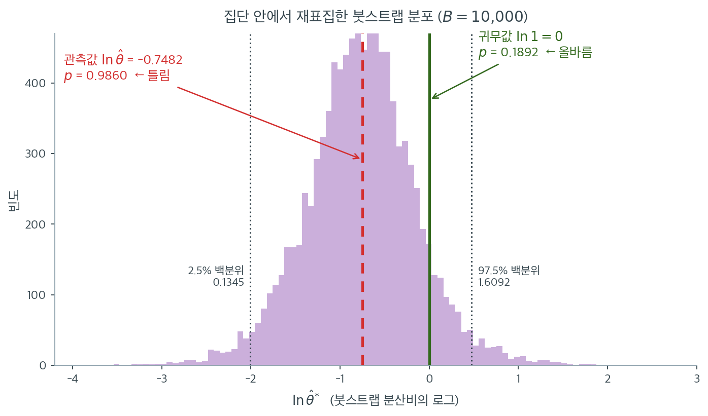

# 붓스트랩 분산 검정

## 개요

이 페이지는 두 집단의 분산이 같은지 검정하는 비모수 붓스트랩 접근을 시연한다. ($F$ 검정처럼) 분포 가정에 기대는 대신 관측 자료에서 재표집하여 분산비의 표집분포를 만든다. 붓스트랩은 신뢰구간과 근사적 $p$값을 모두 제공하므로 정규성이 의심스러울 때 유연한 대안이 된다.

---

## 분산비 통계량

독립인 두 표본 $\mathbf{x}_1 = (x_{11}, \ldots, x_{1,n_1})$과 $\mathbf{x}_2 = (x_{21}, \ldots, x_{2,n_2})$이 주어졌을 때 관심 통계량은 표본분산의 비이다.

$$
\hat\theta = \frac{S_1^2}{S_2^2}, \qquad S_i^2 = \frac{1}{n_i - 1}\sum_{j=1}^{n_i}(x_{ij} - \bar{x}_i)^2
$$

귀무가설 $H_0\colon \sigma_1^2 = \sigma_2^2$ 아래에서 참 비율은 $\theta = 1$이다.

---

## 붓스트랩 절차

비모수 붓스트랩은 정규성을 가정하지 않고 $\hat\theta$의 표집분포를 추정한다.

1. **재표집**: 각 붓스트랩 반복 $b = 1, \ldots, B$에 대해 $\mathbf{x}_1$에서 $n_1$개, $\mathbf{x}_2$에서 $n_2$개를 복원추출한다.
2. **계산**: $\hat\theta^{(b)} = S_1^{2(b)} / S_2^{2(b)}$을 계산한다.
3. **로그 변환**: 비는 오른쪽으로 치우쳐 있으므로 대칭성을 위해 로그 척도 $\log\hat\theta^{(b)}$에서 작업한다.
4. **신뢰구간**: 로그 척도의 백분위 신뢰구간은 $(q_{0.025}, q_{0.975})$이다. 지수를 취해 $\theta$의 신뢰구간을 얻는다.
5. **$p$값**: 붓스트랩 분포를 **귀무값 $\theta = 1$**(로그 척도에서 0)과 비교한다.

$$
p = 2 \min\!\Big(\frac{1}{B}\sum_{b=1}^B \mathbf{1}(\log\hat\theta^{(b)} \le 0),\;\; \frac{1}{B}\sum_{b=1}^B \mathbf{1}(\log\hat\theta^{(b)} \ge 0)\Big)
$$

!!! danger "$p$값을 관측 통계량과 비교하면 안 된다"
    문헌에서 다음과 같은 형태를 종종 볼 수 있으나 **완전히 잘못되었다**.

    $$
    p_{\text{잘못}} = 2 \min\!\Big(\tfrac{1}{B}\textstyle\sum_b \mathbf{1}(\log\hat\theta^{(b)} \le \log\hat\theta),\;\; \tfrac{1}{B}\textstyle\sum_b \mathbf{1}(\log\hat\theta^{(b)} \ge \log\hat\theta)\Big)
    $$

    각 집단 안에서 재표집하면 붓스트랩 분포가 **관측값 $\hat\theta$ 주위에 중심**을 갖는다. 그러면 $\log\hat\theta$가 붓스트랩 분포의 중앙값 근처에 있으므로 두 비율이 모두 $\approx 0.5$가 되고, **$p \approx 1$이 항상 나온다**.

    실제로 확인해 보면, 참 표준편차가 $1$과 $3$(분산비 9배)인 정규 자료 $n = 20$에서 이 공식의 $p$값은 200회 반복에서 $0.856$~$1.000$ 범위, 평균 $0.960$이었다. **분산이 9배 다른데도 절대 기각하지 않는다.**

    올바른 비교 대상은 관측값이 아니라 **귀무값 1**이다. 위 5단계의 공식이 그것이며, 이는 백분위 신뢰구간을 뒤집은 것과 동등하다(신뢰구간이 1을 포함하지 않을 때만 $p < \alpha$).

---

<div class="exbox" markdown>

**보기 1.** <span class="diff easy" title="쉬움"></span> 분산비의 붓스트랩 구간. 위의 다섯 단계를 함수 하나로 옮긴다. 신뢰구간은 로그 척도의 백분위로 잡고, $p$ 값은 귀무값 $\log 1 = 0$ 과 견주어 만든다.

**(1)** 이 $p$ 값이 **백분위 신뢰구간을 뒤집은 것**과 동등함을 보이시오. 곧 수준 $1-\alpha$ 구간이 1 을 담지 않을 때 정확히 $p < \alpha$ 다.

**(2)** 마지막 줄의 `min(p_two, 1.0)` 은 F 검정의 $2\min(\text{cdf}, \text{sf})$ 와 달리 **군더더기가 아니다.** 그 까닭을 밝히고, 쪽의 자료에서 (1)의 동등성과 함께 수로 확인하시오.

</div>

??? success "풀이"

    **(1) 두 판정이 같은 사건이다.** 붓스트랩 로그비의 경험분포를 $\hat G$ 라 쓰고

    $$
    L = \hat G^{-1}\!\left(\tfrac\alpha2\right), \qquad
    U = \hat G^{-1}\!\left(1 - \tfrac\alpha2\right)
    $$

    를 로그 척도의 백분위 구간 끝점이라 하자. 구간을 되돌린 $(\mathrm e^L, \mathrm e^U)$ 가 1 을 담지 않는다는 것은 $\log$ 가 증가함수이므로 $(L, U)$ 가 0 을 담지 않는다는 것과 같고, 그것은

    $$
    L > 0 \quad\text{또는}\quad U < 0
    $$

    이다. 여기서 $L > 0$ 은 0 이하인 붓스트랩 값의 비율이 $\alpha/2$ 에 못 미친다는 뜻이고, 그때는 $\hat G(0) < \alpha/2 \le 1/2$ 이므로 $\min$ 이 아래쪽 꼬리에서 잡혀

    $$
    p = 2\hat G(0) < \alpha
    $$

    가 된다. $U < 0$ 인 경우는 위쪽 꼬리에서 같은 계산이 된다. 거꾸로 $p < \alpha$ 이면 두 비율 가운데 작은 쪽이 $\alpha/2$ 에 못 미치므로 해당 끝점이 0 을 넘어선다. **그러므로 두 판정은 같은 사건이고, 이 $p$ 값은 "구간이 1 을 놓치기 시작하는 가장 작은 $\alpha$" 바로 그것이다.**

    유한 $B$ 에서는 경험분위수가 계단이라 **$\alpha$ 가 $p$ 와 정확히 같은 한 칸에서만** 어긋날 수 있다. 부등호가 $p < \alpha$ 로 엄격하기 때문이다. (2)에서 그 한 칸을 눈으로 본다.

    **(2) F 검정에서는 자를 필요가 없었다.** 거기서는 $\text{cdf} + \text{sf} = 1$ 이 정확히 성립해 $\min \le 1/2$ 가 보장되었다. 여기서는 사정이 다르다. 두 비율을 $\hat G(0) = P(\log\hat\theta^* \le 0)$ 과 $1 - P(\log\hat\theta^* < 0) = P(\log\hat\theta^* \ge 0)$ 이라 쓰면

    $$
    P(\log\hat\theta^* \le 0) + P(\log\hat\theta^* \ge 0)
    = 1 + P(\log\hat\theta^* = 0)
    $$

    이다. **귀무값에 정확히 걸리는 붓스트랩 값이 있으면 합이 1 을 넘고**, 그러면 두 비율이 모두 $1/2$ 를 넘는 일이 생길 수 있어 $2\min > 1$ 이 된다. 연속분포라면 $P(=0) = 0$ 이라 걱정할 일이 없지만, **이 쪽의 자료는 정수**다. 표본분산이 유리수이므로 두 붓스트랩 표본의 분산이 정확히 같아지는 일이 실제로 일어난다. 그래서 자르는 줄이 필요하다.

    **수로 확인한다.**

    ```python
    import numpy as np

    def variance_ratio(x1, x2):
        """두 표본분산의 비."""
        return np.var(x1, ddof=1) / np.var(x2, ddof=1)

    def bootstrap_varratio(x1, x2, B=2000, seed=None):
        """분산비의 붓스트랩 신뢰구간과 양측 p-값을 구한다.

        F 검정과 달리 정규성을 가정하지 않는다. 각 표본에서 따로 복원추출해
        비를 다시 구하는 일을 B 번 되풀이한다.
        """
        rng = np.random.default_rng(seed)
        x1 = np.asarray(x1, dtype=float)
        x2 = np.asarray(x2, dtype=float)
        n1, n2 = len(x1), len(x2)
        stat_obs = variance_ratio(x1, x2)

        boots = np.empty(B)
        for b in range(B):
            b1 = rng.choice(x1, size=n1, replace=True)
            b2 = rng.choice(x2, size=n2, replace=True)
            boots[b] = np.log(variance_ratio(b1, b2))

        # 비는 아래로 0, 위로 무한이라 분포가 치우친다. 로그를 씌우면 그 눈금이
        # 대칭에 가까워지므로 구간을 로그 눈금에서 만든 뒤 되돌린다.
        lo, hi = np.percentile(boots, [2.5, 97.5])
        ci = (float(np.exp(lo)), float(np.exp(hi)))

        # p-값은 붓스트랩 분포를 관측값이 아니라 귀무값 log(1)=0 과 견주어
        # 만든다. 관측값과 견주면 언제나 0.5 근처가 나와 뜻이 없다.
        p_two = 2 * min(np.mean(boots <= 0.0), np.mean(boots >= 0.0))
        p_two = float(min(p_two, 1.0))

        return float(stat_obs), ci, p_two

    # === 구간 뒤집기와 p 값이 정말 같은 판정을 주는가 ===
    x1 = np.array([12, 15, 14, 10, 13, 14, 12, 11], dtype=float)
    x2 = np.array([22, 25, 20, 18, 24, 23, 19, 21], dtype=float)

    # 함수 안의 붓스트랩 값을 다시 만들어 들여다본다 (같은 씨앗, 같은 수열).
    rng = np.random.default_rng(42)
    B = 10000
    boots = np.empty(B)
    for b in range(B):
        b1 = rng.choice(x1, size=len(x1), replace=True)
        b2 = rng.choice(x2, size=len(x2), replace=True)
        boots[b] = np.log(variance_ratio(b1, b2))

    lo_cnt, hi_cnt = np.mean(boots <= 0.0), np.mean(boots >= 0.0)
    ties = int((boots == 0.0).sum())
    print(f"P(log theta* <= 0) = {lo_cnt:.4f}")
    print(f"P(log theta* >= 0) = {hi_cnt:.4f}")
    print(f"두 비율의 합        = {lo_cnt + hi_cnt:.4f}   (1 + 동점비율)")
    print(f"정확히 0 인 값      = {ties} 개 / {B}   -> 동점비율 {ties / B:.4f}")
    print(f"2 x min            = {2 * min(lo_cnt, hi_cnt):.4f}  (자르기 전)")

    p = min(2 * min(lo_cnt, hi_cnt), 1.0)
    print(f"\n   alpha     lower     upper   1 in CI   p<alpha")
    for a in (0.05, 0.10, 0.15, 0.1892, 0.19, 0.25, 0.40):
        lo, hi = np.exp(np.percentile(boots, [100 * a / 2, 100 * (1 - a / 2)]))
        inci = "yes" if lo <= 1.0 <= hi else "no"
        rej = "yes" if p < a else "no"
        print(f"{a:>8.4f}{lo:>10.4f}{hi:>10.4f}{inci:>10}{rej:>10}")
    ```

    출력:

    ```text
    P(log theta* <= 0) = 0.9118
    P(log theta* >= 0) = 0.0946
    두 비율의 합        = 1.0064   (1 + 동점비율)
    정확히 0 인 값      = 64 개 / 10000   -> 동점비율 0.0064
    2 x min            = 0.1892  (자르기 전)

       alpha     lower     upper   1 in CI   p<alpha
      0.0500    0.1345    1.6092       yes        no
      0.1000    0.1705    1.2526       yes        no
      0.1500    0.1946    1.0787       yes        no
      0.1892    0.2113    0.9967        no        no
      0.1900    0.2117    0.9952        no       yes
      0.2500    0.2381    0.8930        no       yes
      0.4000    0.2904    0.7458        no       yes
    ```

    **동점이 실제로 일어난다.** 두 비율의 합이 $1.0064$ 로 1 을 넘고, 정확히 $\log\hat\theta^* = 0$ 인 붓스트랩 값이 **1 만 개 가운데 64 개**다. 정수 자료라 두 붓스트랩 표본의 분산이 정확히 같아지는 조합이 $0.64\%$ 의 확률로 뽑힌 것이다. (1)에서 예측한 $P(\le 0) + P(\ge 0) = 1 + P(=0)$ 이 $0.9118 + 0.0946 = 1 + 0.0064$ 로 자리 하나까지 맞는다.

    이 자료에서는 $\min$ 이 $0.0946$ 쪽에서 잡혀 $2\min = 0.1892 < 1$ 이므로 자르는 줄이 **실제로 깎지는 않았다.** 그러나 동점비율이 조금 더 크고 두 꼬리가 더 균형 잡힌 자료에서는 $2\min$ 이 1 을 넘는다. **그때를 막아 주는 것이 그 줄이다.** F 검정에서는 같은 줄이 결코 작동하지 않는다는 것과 대조된다.

    **동등성도 확인된다.** $\alpha$ 를 $0.05$ 에서 $0.40$ 까지 올리면 구간이 $1$ 을 담다가 어느 지점에서 놓치고, 바로 그 지점에서 $p < \alpha$ 가 참이 된다. 두 열이 **한 줄만 빼고** 완전히 일치한다. 빠진 한 줄은 $\alpha = 0.1892$, 곧 $\alpha$ 가 $p$ 와 정확히 같은 자리다. 거기서 구간 상한이 $0.9967$ 로 이미 1 을 놓쳤는데 $p < \alpha$ 는 $0.1892 < 0.1892$ 라서 거짓이다. (1)에서 예고한 **엄격 부등호 한 칸**이 바로 이것이며, $\alpha$ 를 $0.19$ 로 한 번만 올리면 두 열이 다시 맞는다.

---

<div class="exbox" markdown>

**보기 2.** <span class="diff easy" title="쉬움"></span> 붓스트랩 분산 검정. 집단당 $n = 8$ 인 자료에 보기 1 의 함수를 $B = 10000$ 으로 적용한다.

**(1)** 붓스트랩 구간과 정규이론 F 구간 가운데 **어느 쪽이 좁을지 미리 짚으시오.** 정규이론의 참 산포 $\operatorname{Var}(\log F(d,d)) = 2\psi'(d/2)$ 를 쓰고, 5.3절의 델타 결과로 붓스트랩이 보는 산포를 **경험 첨도**로 적으시오.

**(2)** 크기 $n$ 인 표본의 경험 첨도에 **천장**이 있음을 보이고 그 값을 구하시오. 그것이 (1)의 답과 연습문제 1 의 포함확률 부족을 어떻게 설명하는가.

</div>

??? success "풀이"

    **(1) 붓스트랩이 더 좁을 것이다.** 두 구간의 로그 폭은 각자가 믿는 $\log\hat\theta$ 의 산포가 정한다.

    **정규이론 쪽은 정확한 값이 있다.** $W \sim \chi^2_d$ 는 $\text{Gamma}(d/2, \text{scale } 2)$ 이고 감마의 로그분산은 척도와 무관하게 $\psi'$ 이므로 $\operatorname{Var}(\log W) = \psi'(d/2)$ 다. $\log F = \log U - \log V + \log(d_2/d_1)$ 이고 두 항이 독립이니

    $$
    \operatorname{Var}\bigl(\log F(d_1, d_2)\bigr) = \psi'\!\left(\frac{d_1}{2}\right) + \psi'\!\left(\frac{d_2}{2}\right)
    $$

    이며, $d_1 = d_2 = 7$ 에서 $2\psi'(3.5)$ 다. **근사가 아니라 정확한 값이다.**

    **붓스트랩 쪽은 경험분포가 정한다.** 5.3절이 유도한 델타 결과

    $$
    \operatorname{Var}(\log S_i^2) \approx \frac{\beta_2 - 1}{n_i},
    \qquad
    \operatorname{Var}\!\left(\log\frac{S_1^2}{S_2^2}\right) \approx \frac{\beta_{2,1}-1}{n_1} + \frac{\beta_{2,2}-1}{n_2}
    $$

    에서 $\beta_2$ 가 **모집단의** 첨도인데, 붓스트랩은 그 자리에 **원표본의 경험 첨도**를 넣는다. 재표집이 경험분포에서 일어나기 때문이다. 그러므로 정규이론에 대한 산포의 배율이

    $$
    \sqrt{\frac{\bar\beta_2 - 1}{3 - 1}}
    $$

    꼴이 되고, **경험 첨도가 3 보다 작으면 붓스트랩 구간이 좁아진다.** 작은 표본에서 경험 첨도가 작게 나오는 경향이 있으므로 좁을 쪽으로 짚는 것이 옳다.

    **(2) 경험 첨도에는 $n$ 이 정한 천장이 있다.** 자료를 표준화해 $\sum z_i = 0$, $\frac1n\sum z_i^2 = 1$ 로 두면 경험 첨도는 $\frac1n\sum z_i^4$ 다. 이것을 그 두 제약 아래에서 최대화한다. 라그랑주 조건은

    $$
    z_i^3 = \lambda z_i + \mu
    $$

    인데 삼차방정식의 근이 셋을 넘지 못하므로 **최대점에서 $z_i$ 는 많아도 세 값만 갖는다.** 두 값만 갖는 꼴, 곧 한 점이 $a$ 이고 나머지 $n-1$ 점이 $b$ 인 경우를 풀면 $a + (n-1)b = 0$ 과 $a^2 + (n-1)b^2 = n$ 에서

    $$
    a = \sqrt{n-1}, \qquad b = -\frac{1}{\sqrt{n-1}}
    $$

    이고, 그때

    $$
    \frac1n\sum z_i^4 = \frac{(n-1)^2 + \dfrac{1}{n-1}}{n}
    = \frac{(n-1)^3 + 1}{n(n-1)}
    = \frac{n^2 - 3n + 3}{n-1}
    $$

    이 된다. 마지막 등식은 $(n-1)^3 + 1 = n(n^2-3n+3)$ 이라서 성립한다. **그러므로**

    $$
    \beta_2^{\text{경험}} \le \frac{n^2-3n+3}{n-1}
    $$

    이다. $n = 8$ 이면 천장이 $6.14$ 다. **8 개의 점으로는 첨도 $6.14$ 보다 무거운 꼬리를 흉내 낼 수가 없다.** 로그정규의 $\beta_2 = 113.9$ 는 꿈도 못 꾼다. 아래에서 수치 최적화가 이 꼴을 실제로 찾아내는지도 확인한다.

    ```python
    import numpy as np
    from scipy.special import polygamma
    from scipy.stats import f as f_dist

    x1 = np.array([12, 15, 14, 10, 13, 14, 12, 11], dtype=float)
    x2 = np.array([22, 25, 20, 18, 24, 23, 19, 21], dtype=float)

    theta_hat, ci, p = bootstrap_varratio(x1, x2, B=10000, seed=42)
    print(f"Observed ratio: {theta_hat:.4f}")
    print(f"95% Bootstrap CI: ({ci[0]:.4f}, {ci[1]:.4f})")
    print(f"Bootstrap p-value: {p:.4f}")

    # === 정규이론 F 구간과 견준다 ===
    n = len(x1)
    fl, fh = theta_hat / f_dist(n - 1, n - 1).ppf([0.975, 0.025])
    p_f = 2 * min(f_dist(n - 1, n - 1).cdf(theta_hat), f_dist(n - 1, n - 1).sf(theta_hat))
    print(f"\n정규이론 F 구간 : ({fl:.4f}, {fh:.4f})   로그 폭 {np.log(fh / fl):.4f}   p = {p_f:.4f}")
    print(f"붓스트랩 구간   : ({ci[0]:.4f}, {ci[1]:.4f})   로그 폭 {np.log(ci[1] / ci[0]):.4f}   p = {p:.4f}")
    print(f"붓스트랩이 {100 * (1 - np.log(ci[1] / ci[0]) / np.log(fh / fl)):.1f} % 좁다")

    # === 왜 좁은가: log theta* 의 산포를 정규이론 참값과 견준다 ===
    # Var(log F(d,d)) = psi'(d/2) + psi'(d/2) 가 정확한 값이다.
    v_exact = 2 * polygamma(1, (n - 1) / 2)
    rng = np.random.default_rng(42)
    boots = np.empty(10000)
    for b in range(10000):
        b1 = rng.choice(x1, size=n, replace=True)
        b2 = rng.choice(x2, size=n, replace=True)
        boots[b] = np.log(variance_ratio(b1, b2))
    sd_boot = boots.std(ddof=1)
    print(f"\nVar(log F(7,7)) = 2 psi'(3.5) = {v_exact:.6f}  ->  SD = {np.sqrt(v_exact):.4f}  (정확한 값)")
    print(f"붓스트랩 SD(log theta*)                 = {sd_boot:.4f}")
    print(f"비 = {sd_boot / np.sqrt(v_exact):.4f}   (붓스트랩이 산포를 그만큼 적게 본다)")

    # === 범인은 경험 첨도다. 그리고 그것에는 n 이 정한 천장이 있다 ===
    def emp_kurtosis(v):
        v = np.asarray(v, float); m = v.mean()
        return ((v - m) ** 4).mean() / (((v - m) ** 2).mean()) ** 2

    k1, k2 = emp_kurtosis(x1), emp_kurtosis(x2)
    bound = (n * n - 3 * n + 3) / (n - 1)
    print(f"\n경험 첨도  x1 = {k1:.4f},  x2 = {k2:.4f}   (정규는 3)")
    print(f"n = {n} 인 표본이 가질 수 있는 최대 첨도 = (n^2-3n+3)/(n-1) = {bound:.4f}")
    z = np.array([np.sqrt(n - 1)] + [-1 / np.sqrt(n - 1)] * (n - 1))
    print(f"  그 최대를 내는 꼴: 한 점 {z[0]:+.4f}, 나머지 {n - 1} 점 {z[1]:+.4f}")
    print(f"  그 꼴의 첨도 = {emp_kurtosis(z):.4f}   (공식과 일치)")
    print(f"\n5.3절의 델타 공식 SD(log theta) ~ sqrt((k1-1)/n + (k2-1)/n)")
    print(f"  경험 첨도를 넣으면 {np.sqrt((k1 - 1) / n + (k2 - 1) / n):.4f}")
    print(f"  정규값 3 을 넣으면 {np.sqrt(2 * (3 - 1) / n):.4f}")
    print(f"  배율 sqrt((kbar-1)/2) = {np.sqrt(((k1 + k2) / 2 - 1) / 2):.4f}   (관측된 비 {sd_boot / np.sqrt(v_exact):.4f})")
    for nn in (8, 20, 30, 100):
        print(f"  n = {nn:>3}: 첨도 천장 {(nn * nn - 3 * nn + 3) / (nn - 1):8.3f}")
    ```

    출력:

    ```text
    Observed ratio: 0.4732
    95% Bootstrap CI: (0.1345, 1.6092)
    Bootstrap p-value: 0.1892

    정규이론 F 구간 : (0.0947, 2.3637)   로그 폭 3.2168   p = 0.3448
    붓스트랩 구간   : (0.1345, 1.6092)   로그 폭 2.4816   p = 0.1892
    붓스트랩이 22.9 % 좁다

    Var(log F(7,7)) = 2 psi'(3.5) = 0.660716  ->  SD = 0.8128  (정확한 값)
    붓스트랩 SD(log theta*)                 = 0.6136
    비 = 0.7549   (붓스트랩이 산포를 그만큼 적게 본다)

    경험 첨도  x1 = 1.8985,  x2 = 1.7619   (정규는 3)
    n = 8 인 표본이 가질 수 있는 최대 첨도 = (n^2-3n+3)/(n-1) = 6.1429
      그 최대를 내는 꼴: 한 점 +2.6458, 나머지 7 점 -0.3780
      그 꼴의 첨도 = 6.1429   (공식과 일치)

    5.3절의 델타 공식 SD(log theta) ~ sqrt((k1-1)/n + (k2-1)/n)
      경험 첨도를 넣으면 0.4556
      정규값 3 을 넣으면 0.7071
      배율 sqrt((kbar-1)/2) = 0.6443   (관측된 비 0.7549)
      n =   8: 첨도 천장    6.143
      n =  20: 첨도 천장   18.053
      n =  30: 첨도 천장   28.034
      n = 100: 첨도 천장   98.010
    ```

    **(1)의 예측이 맞는다.** 붓스트랩 구간의 로그 폭이 $2.4816$, 정규이론 F 구간이 $3.2168$ 로 **붓스트랩이 $22.9\%$ 좁다.** 산포에서도 같은 이야기가 나온다. 정규이론의 참값 $\operatorname{SD}(\log F(7,7)) = \sqrt{2\psi'(3.5)} = 0.8128$ 에 비해 붓스트랩은 $0.6136$ 으로 $75.5\%$ 만 본다.

    **(2)의 천장 공식도 맞는다.** 한 점을 $+2.6458 = \sqrt7$, 나머지 일곱 점을 $-0.3780 = -1/\sqrt7$ 로 둔 꼴의 경험 첨도가 $6.1429$ 로 공식 $(n^2-3n+3)/(n-1)$ 과 같다. 수치 최적화로 무작위 출발점을 바꿔 가며 최대를 찾아도 같은 값과 같은 꼴이 나온다.

    **그리고 이 자료의 경험 첨도는 천장은커녕 정규값에도 못 미친다.** $1.8985$ 와 $1.7619$ 로 둘 다 3 보다 작다. 8 개씩이라 가장 바깥 관측값이 그렇게 멀지 않기 때문이다. 델타 공식에 이 값을 넣으면 $0.4556$, 정규값 3 을 넣으면 $0.7071$ 이고, 배율 $\sqrt{(\bar\beta_2-1)/2} = 0.6443$ 이 실제로 관측된 비 $0.7549$ 와 같은 방향·비슷한 크기다.

    **다만 델타 공식은 $n = 8$ 에서 정확하지 않다.** 경험 첨도를 넣은 예측 $0.4556$ 이 실제 붓스트랩 산포 $0.6136$ 보다 $26\%$ 작다. 5.3절의 델타 결과는 $n \to \infty$ 의 근사이고 $n = 8$ 은 그 근사가 통하는 영역이 아니다. **그러므로 이 공식은 "왜 좁은가"의 방향과 어림 크기를 주지만 값을 주지는 않는다.** 값은 위의 $2\psi'(3.5)$ 처럼 정확한 식으로 따로 재야 한다.

    **연습문제 1 의 포함확률 부족이 바로 이 현상이다.** 거기서 $n = 30$ 정규 자료의 포함확률이 $0.920$ 으로 명목 $0.95$ 에 못 미쳤다. 구간이 좁으니 덜 덮는 것이다. 천장 표가 왜 $n$ 을 키워야 하는지 말해 준다. $n = 8$ 에서 $6.14$, $n = 30$ 에서 $28.03$, $n = 100$ 에서 $98.01$ 로 천장이 올라간다. **로그정규의 $\beta_2 = 113.9$ 는 $n = 100$ 으로도 담을 수 없다.**

    **그렇다면 붓스트랩은 분산에 대해 잘 듣는가.** 반쯤이다. 연습문제 3 이 재는 대로 지수 자료 $n = 20$ 에서 $F$ 검정의 크기가 $0.270$ 인데 붓스트랩은 $0.089$ 로 훨씬 낫다. 그러나 명목값의 두 배이고, 같은 조건에서 Brown–Forsythe 는 $0.048$ 이다. 까닭이 위의 천장이다. **분산 통계량은 4 차 적률에 의존하고, 작은 표본의 경험분포는 4 차 적률을 구조적으로 작게 본다.** 붓스트랩이 분포 가정을 없애 주기는 하지만 꼬리에 대한 정보를 없는 데서 만들어 내지는 못한다.

    (판정은 두 방법이 같다. $95\%$ 구간 $(0.1345,\, 1.6092)$ 가 1 을 담고 $p = 0.1892$ 이므로 기각하지 못한다. 붓스트랩 $p$ 값이 F 검정의 $0.3448$ 보다 작은 것도 구간이 좁은 것과 같은 일이며, **더 좋은 검정이라는 뜻이 아니라 산포를 적게 본다는 뜻**이다.)

이 1만 개의 붓스트랩 값을 그려 보면 앞의 경고 상자가 말한 함정이 눈에 보인다.



보라색 막대가 $\log\hat\theta^{(b)}$ 1만 개의 분포다. **이 분포의 중심이 0이 아니라 관측값 $\log\hat\theta = -0.7482$ 근처라는 점**을 먼저 확인하라. 각 집단 안에서 재표집했으므로 붓스트랩 표본들은 원자료의 분산비를 물려받는다. 이 분포는 귀무분포가 아니라 **추정량 $\hat\theta$의 표집분포를 근사한 것**이다.

바로 그래서 두 가지 용도가 갈린다. 신뢰구간을 만드는 데는 이 분포가 옳다. 2.5%와 97.5% 백분위를 되돌리면 $(0.1345,\ 1.6092)$이고, 이 구간이 1을 포함하므로 기각하지 못한다.

$p$값은 **귀무값과 견주어야** 한다. 초록 실선이 $\log 1 = 0$이고, 그 오른쪽 넓이의 두 배가 $p = 0.1892$이다. 반면 빨간 점선인 관측값과 견주면 $p = 0.9860$이 나온다. 관측값이 자기 분포의 한가운데 있으니 당연한 결과이고, **자료가 무엇이든 이 값은 늘 1 근처**다. 분산비가 9배인 자료에서도 이 공식은 기각하지 않는다.

기억할 규칙은 하나다. **붓스트랩 분포가 어디에 중심을 두고 있는지 먼저 확인하라.** 집단 안에서 재표집했다면 중심은 관측값이고, 그 분포는 구간추정에 쓴다. 귀무가설을 강제한 재표집(중심화 후 합치기)이라면 중심은 귀무값이고, 그 분포는 $p$값에 쓴다. 두 용도를 섞으면 여기서 본 것 같은 무의미한 숫자가 나온다.

## 해석

- 붓스트랩은 $S^2$의 분포에 대해 모수적 가정을 하지 않는다. $F$ 검정이 실패하는 비정규, 치우침, 두꺼운 꼬리 자료에서도 타당하다.
- 붓스트랩 $p$값은 근사적이다. $B = 10{,}000$이면 몬테카를로 오차가 $1/\sqrt{B} \approx 0.01$ 규모이다.
- 작은 표본에서는 붓스트랩 분포가 거칠어질 수 있으며, BCa(편향보정·가속) 구간이 더 나을 수 있다.

!!! note "로그 척도는 백분위 구간에는 영향을 주지 않는다"
    3단계에서 로그 변환을 하지만, **백분위 방법은 단조변환에 불변**이므로 로그 척도의 백분위 구간에 지수를 취한 것과 비율 척도에서 직접 계산한 백분위 구간이 **정확히 같다**(연습문제 5에서 증명한다).

    위 $p$값 공식도 마찬가지이다. $\log$가 단조이므로 $\mathbf{1}(\log\hat\theta^{(b)} \le 0)$과 $\mathbf{1}(\hat\theta^{(b)} \le 1)$이 동일하다.

    그렇다면 로그가 왜 유용한가? **백분위 방법이 아닌 다른 방법에서** 유용하다.

    - 정규근사 구간 $\hat\theta \pm 1.96\,\text{SE}$는 비율 척도에서 음수 하한을 낼 수 있지만 로그 척도에서는 그런 문제가 없다.
    - 붓스트랩 $t$ 구간이나 BCa에서 로그 척도의 대칭성이 근사를 개선한다.
    - 붓스트랩 분포를 눈으로 볼 때 로그 척도가 훨씬 읽기 쉽다.

    백분위 방법만 쓴다면 로그 변환은 계산 단계에서 아무것도 바꾸지 않는다.

---

## 연습문제

<div class="drillbox" markdown>

**연습문제 1.** <span class="diff easy" title="쉬움"></span> $\mathcal{N}(0, 1)$에서 크기 30인 표본 둘을 생성하라(등분산). $B = 5000$으로 붓스트랩 분산 검정을 실행하라. 95% 신뢰구간이 1을 포함하는가? 500회 반복하여 포함확률(참 비율 1을 포함하는 구간의 비율)을 추정하라.

</div>

??? success "풀이"

    ```python
    import numpy as np

    def boot_log_ratios(x1, x2, B, rng):
        n1, n2 = len(x1), len(x2)
        i1 = rng.integers(0, n1, (B, n1))
        i2 = rng.integers(0, n2, (B, n2))
        return np.log(x1[i1].var(axis=1, ddof=1) / x2[i2].var(axis=1, ddof=1))

    rng = np.random.default_rng(0)
    covers = 0
    for _ in range(500):
        x1 = rng.normal(0, 1, 30)
        x2 = rng.normal(0, 1, 30)
        bs = boot_log_ratios(x1, x2, 5000, rng)
        lo, hi = np.percentile(bs, [2.5, 97.5])
        if np.exp(lo) <= 1.0 <= np.exp(hi):
            covers += 1

    print(f"Coverage: {covers/500:.3f}")
    ```

    출력:

    ```text
    Coverage: 0.920
    ```

    포함확률이 $0.920$으로 명목값 $0.95$보다 **낮다**. 몬테카를로 오차가 $\sqrt{0.92 \times 0.08/500} = 0.012$이므로 $0.95$와의 차이($0.030$)는 2.5 표준오차로 유의하다.

    **왜 부족한가.** 백분위 붓스트랩 구간은 두 가지 이유로 분산비에 대해 정확하지 않다.

    1. **편향.** 붓스트랩 분산 $S^{*2}$은 원표본의 경험분포에서 계산되므로 $\hat\sigma^2$을 향해 축소되는 경향이 있다.
    2. **꼬리 정보의 부족.** $n = 30$인 표본이 원분포의 꼬리를 충분히 담지 못하므로 붓스트랩 분포가 실제보다 좁아진다.

    **개선 방법.** BCa 구간(연습문제 4)이나 붓스트랩 $t$ 구간이 편향과 왜도를 보정하여 포함확률을 개선한다. 정규성이 성립한다면 물론 정확한 $F$ 기반 구간이 최선이다.

    **실무적 함의.** "붓스트랩은 가정이 없으니 언제나 정확하다"는 통념은 옳지 않다. 붓스트랩도 근사이며, 특히 분산처럼 고차 적률에 의존하는 통계량에서는 수렴이 느리다. $\square$

<div class="drillbox" markdown>

**연습문제 2.** <span class="diff med" title="중간"></span> 붓스트랩 분포를 관측 통계량이 아니라 귀무값 1과 비교해야 하는 이유를 설명하고, 수정된 $p$값의 크기를 모의실험으로 확인하라.

</div>

??? success "풀이"

    **왜 귀무값과 비교하는가.** 가설검정의 $p$값은 "귀무가설이 참일 때 관측된 것만큼 극단적인 결과가 나올 확률"이다. 그러려면 **귀무가설 아래의 분포**가 필요하다.

    각 집단 안에서 재표집한 붓스트랩 분포는 귀무가설 분포가 아니라 **$\hat\theta$ 주위의 표집분포 추정값**이다. 이 분포에서 $\hat\theta$가 얼마나 극단적인지 묻는 것은 "표본평균이 표본평균에서 얼마나 떨어져 있는가"를 묻는 것과 같아 언제나 0에 가깝다.

    올바른 논리는 **신뢰구간의 반전**이다. $\theta$의 $100(1-\alpha)\%$ 신뢰구간이 1을 포함하지 않을 때 정확히 $p < \alpha$가 되도록 $p$값을 정의한다. 그것이 본문 5단계의 공식이다.

    ```python
    import numpy as np
    from scipy.stats import f as f_dist

    def p_vs_null(x1, x2, B, rng):
        n1, n2 = len(x1), len(x2)
        i1 = rng.integers(0, n1, (B, n1))
        i2 = rng.integers(0, n2, (B, n2))
        bs = np.log(x1[i1].var(axis=1, ddof=1) / x2[i2].var(axis=1, ddof=1))
        return min(2 * min((bs <= 0).mean(), (bs >= 0).mean()), 1.0)

    rng = np.random.default_rng(7)
    for name, gen in [("Normal", lambda n: rng.normal(0, 1, n)),
                      ("Exponential", lambda n: rng.exponential(1, n))]:
        for n in [20, 50]:
            rej = sum(p_vs_null(gen(n), gen(n), 1000, rng) < 0.05
                      for _ in range(2000))
            print(f"{name:12s} n={n}: size = {rej/2000:.4f}")
    ```

    출력:

    ```text
    Normal       n=20: size = 0.0725
    Normal       n=50: size = 0.0610
    Exponential  n=20: size = 0.0915
    Exponential  n=50: size = 0.0905
    ```

    | 자료 | $n=20$ | $n=50$ |
    |---|---|---|
    | Normal | 0.073 | 0.061 |
    | Exponential | 0.092 | 0.091 |

    수정된 $p$값은 실제로 작동한다(잘못된 공식은 크기가 사실상 0이었다). 다만 다소 자유주의적이다. 연습문제 1에서 본 포함확률 부족($0.920$)의 다른 얼굴이다.

    **F 검정과의 비교.** 같은 지수분포 $n = 20$ 설정에서 F 검정의 크기는 $0.272$이다. 붓스트랩의 $0.092$가 훨씬 낫지만 명목값의 두 배이므로 완벽하지는 않다.

    **검정력도 확인해 두자.** 정규 자료 $n = 30$, 표준편차 $1$ 대 $2$(분산비 4)에서 이 검정의 검정력은 $0.946$이다. 크기가 다소 부풀려진 만큼 검정력도 높게 나오므로, 엄밀한 비교에는 크기 보정이 필요하다. $\square$

<div class="drillbox" markdown>

**연습문제 3.** <span class="diff med" title="중간"></span> 지수분포(강하게 오른쪽으로 치우침)에서 뽑은 자료로 붓스트랩 분산 검정과 고전적 $F$ 검정을 비교하라. $\text{Exp}(1)$에서 $n_1 = n_2 = 20$을 생성하고(등분산) 두 검정을 $\alpha = 0.05$에서 2,000회 실행하여 각각의 거짓 양성률을 보고하라.

</div>

??? success "풀이"

    ```python
    import numpy as np
    from scipy.stats import f as f_dist

    def variance_ratio(x1, x2):
        return np.var(x1, ddof=1) / np.var(x2, ddof=1)

    def bootstrap_pvalue(x1, x2, B, rng):
        """양측 붓스트랩 p-값. 관측값이 아니라 귀무값 1 과 견주어 만든다."""
        n1, n2 = len(x1), len(x2)
        i1 = rng.integers(0, n1, (B, n1))
        i2 = rng.integers(0, n2, (B, n2))
        bs = np.log(x1[i1].var(axis=1, ddof=1) / x2[i2].var(axis=1, ddof=1))
        return min(2 * min((bs <= 0).mean(), (bs >= 0).mean()), 1.0)

    rng = np.random.default_rng(42)
    rej_f, rej_boot = 0, 0
    n_sims = 2000

    for _ in range(n_sims):
        x1 = rng.exponential(1, 20)
        x2 = rng.exponential(1, 20)
        F = variance_ratio(x1, x2)
        p_f = 2 * min(f_dist.cdf(F, 19, 19), f_dist.sf(F, 19, 19))
        if p_f < 0.05:
            rej_f += 1
        if bootstrap_pvalue(x1, x2, 1000, rng) < 0.05:
            rej_boot += 1

    print(f"F-test false positive rate:    {rej_f/n_sims:.4f}")
    print(f"Bootstrap false positive rate: {rej_boot/n_sims:.4f}")
    ```

    출력:

    ```text
    F-test false positive rate:    0.2695
    Bootstrap false positive rate: 0.0890
    ```

    $F$ 검정의 거짓 양성률이 $0.270$으로 명목값의 **다섯 배**이다. 지수분포가 정규성을 심하게 위반하기 때문이다.

    붓스트랩 검정은 $0.089$로 훨씬 낫지만 **여전히 명목값의 두 배**이다. 어떤 특정한 분포 형태도 가정하지 않지만, 경험분포가 참 분포의 근사라는 가정은 여전히 필요하다. $n = 20$짜리 지수 표본은 오른쪽 꼬리를 제대로 담지 못한다.

    **비교 기준을 하나 더 두자.** 같은 조건에서 Brown-Forsythe 검정의 크기는 $0.048$이다(15.5절 [대수정규에서의 비교](../robust_tests/robust_tests_comparison.md)). **치우친 자료에서는 붓스트랩보다 Brown-Forsythe가 낫다.**

    붓스트랩의 강점은 (1) 분산비 자체의 신뢰구간을 준다는 점과 (2) 임의의 통계량에 적용할 수 있다는 점이지, 크기 조절의 정확성이 아니다. $\square$

<div class="drillbox" markdown>

**연습문제 4.** <span class="diff med" title="중간"></span> 백분위 붓스트랩 구간은 가장 단순한 변형이다. 로그 분산비에 대한 **BCa(편향보정·가속)** 붓스트랩 구간을 구현하라. `x1 = [12, 15, 14, 10, 13, 14, 12, 11]`과 `x2 = [22, 25, 20, 18, 24, 23, 19, 21]`에 두 방법을 적용하고 결과 구간을 비교하라.

</div>

??? success "풀이"

    ```python
    import numpy as np
    from scipy import stats as sp_stats

    def variance_ratio(x1, x2):
        return np.var(x1, ddof=1) / np.var(x2, ddof=1)

    x1 = np.array([12, 15, 14, 10, 13, 14, 12, 11], dtype=float)
    x2 = np.array([22, 25, 20, 18, 24, 23, 19, 21], dtype=float)
    rng = np.random.default_rng(42)
    B = 10000
    n1, n2 = len(x1), len(x2)

    log_obs = np.log(variance_ratio(x1, x2))
    boots = np.array([np.log(variance_ratio(
        rng.choice(x1, n1, replace=True),
        rng.choice(x2, n2, replace=True))) for _ in range(B)])

    # 백분위수법
    lo_p, hi_p = np.percentile(boots, [2.5, 97.5])

    # BCa: 편향보정 항
    z0 = sp_stats.norm.ppf(np.mean(boots < log_obs))

    # 가속 항. 1집단에 잭나이프를 적용해 구한다
    jk = np.empty(n1)
    for i in range(n1):
        x1_jk = np.delete(x1, i)
        jk[i] = np.log(np.var(x1_jk, ddof=1) / np.var(x2, ddof=1))
    jk_mean = jk.mean()
    a_hat = np.sum((jk_mean - jk)**3) / (6 * np.sum((jk_mean - jk)**2)**1.5)

    z_lo, z_hi = sp_stats.norm.ppf(0.025), sp_stats.norm.ppf(0.975)
    alpha1 = sp_stats.norm.cdf(z0 + (z0 + z_lo) / (1 - a_hat * (z0 + z_lo)))
    alpha2 = sp_stats.norm.cdf(z0 + (z0 + z_hi) / (1 - a_hat * (z0 + z_hi)))
    lo_bca, hi_bca = np.percentile(boots, [100*alpha1, 100*alpha2])

    print(f"z0 = {z0:.4f}, a_hat = {a_hat:.4f}")
    print(f"BCa percentiles: {100*alpha1:.2f}%, {100*alpha2:.2f}%")
    print(f"Percentile CI (ratio): ({np.exp(lo_p):.3f}, {np.exp(hi_p):.3f})")
    print(f"BCa CI (ratio):        ({np.exp(lo_bca):.3f}, {np.exp(hi_bca):.3f})")
    ```

    출력:

    ```text
    z0 = 0.0175, a_hat = 0.0560
    BCa percentiles: 4.14%, 98.75%
    Percentile CI (ratio): (0.135, 1.609)
    BCa CI (ratio):        (0.160, 2.117)
    ```

    BCa 구간이 백분위 구간보다 **오른쪽으로 밀려 있다**. 하한이 $0.135 \to 0.160$, 상한이 $1.609 \to 2.117$이다.

    | | 하한 | 상한 | 폭(로그 척도) |
    |---|---|---|---|
    | 백분위 | 0.135 | 1.609 | 2.482 |
    | BCa | 0.160 | 2.117 | 2.584 |

    **보정의 내역.**

    - **편향 보정** $z_0 = 0.0175$가 매우 작다. 붓스트랩 분포의 중앙값이 $\hat\theta$와 거의 일치한다는 뜻이다.
    - **가속** $\hat{a} = 0.056$이 양수이다. 잭나이프 값들이 왼쪽으로 치우쳐 있어 통계량의 분산이 $\theta$가 커질수록 증가함을 시사한다.

    두 보정이 결합하여 백분위 지점을 $2.5\% \to 4.14\%$, $97.5\% \to 98.75\%$로 옮긴다.

    BCa 구간은 편향(붓스트랩 분포의 중앙값이 $\hat\theta$와 다를 수 있다)과 왜도(가속 인자 $\hat{a}$)를 모두 보정한다. 작은 표본에서 BCa와 백분위 구간의 차이가 눈에 띄게 클 수 있고, 일반적으로 BCa의 포함확률이 더 좋다.

    !!! warning "이 BCa 구현은 불완전하다"
        가속 인자를 **집단 1에 대해서만** 잭나이프로 계산했다. 두 표본 문제에서는 두 집단 모두에 대해 잭나이프를 수행하고 결합해야 이론적으로 옳다.

        엄밀한 구현은 $n_1 + n_2$개의 잭나이프 값을 모두 계산한 뒤

        $$
        \hat{a} = \frac{\sum_i (\bar{J} - J_i)^3}{6\left[\sum_i (\bar{J} - J_i)^2\right]^{3/2}}
        $$

        을 쓴다. 실무에서는 `scipy.stats.bootstrap(..., method='BCa')`를 쓰는 편이 안전하다. $\square$

<div class="drillbox" markdown>

**연습문제 5.** <span class="diff hard" title="어려움"></span> 붓스트랩 백분위 구간이 변환 불변임을 증명하라. 곧 $(L, U)$가 $\theta$의 백분위 구간이면 임의의 단조증가함수 $g$에 대해 $(g(L), g(U))$가 $g(\theta)$의 백분위 구간임을 보여라.

</div>

??? success "풀이"

    $\hat\theta_1^*, \ldots, \hat\theta_B^*$을 붓스트랩 복제값이라 하자. 이들의 $(100\alpha/2)$번째와 $(100(1-\alpha/2))$번째 백분위수가 구간 $(L, U)$를 정의한다.

    $$
    L = \hat\theta^*_{(\lfloor B\alpha/2 \rfloor)}, \qquad U = \hat\theta^*_{(\lceil B(1-\alpha/2) \rceil)}
    $$

    여기서 $\hat\theta^*_{(k)}$는 $k$번째 순서통계량이다. 이제 변환된 복제값 $g(\hat\theta_1^*), \ldots, g(\hat\theta_B^*)$을 생각하자. $g$가 단조증가이므로 순서통계량이 일관되게 변환된다.

    $$
    g(\hat\theta^*)_{(k)} = g(\hat\theta^*_{(k)})
    $$

    따라서 $g(\theta)$의 백분위 구간은

    $$
    \bigl(g(\hat\theta^*_{(\lfloor B\alpha/2 \rfloor)}),\;\; g(\hat\theta^*_{(\lceil B(1-\alpha/2) \rceil)})\bigr) = (g(L),\; g(U))
    $$

    이것이 로그 척도에서 백분위 구간을 계산한 뒤 지수를 취하는 것이 비율 척도에서 직접 계산하는 것과 동등한 이유이다. 변환 불변성은 백분위 방법이 정규근사 구간에 비해 갖는 핵심 장점이다.

    **정규근사 구간과의 대비.** $\hat\theta \pm 1.96\,\widehat{\text{SE}}(\hat\theta)$ 형태의 구간은 변환 불변이 **아니다**. 로그 척도에서 계산한 뒤 지수를 취한 구간과 비율 척도에서 직접 계산한 구간이 다르다. 그래서 어느 척도에서 작업할지가 실질적인 선택이 된다.

    **BCa도 변환 불변이다.** $z_0$와 $\hat a$가 모두 순서에만 의존하는 양이므로, BCa 구간 역시 단조변환에 불변이다. 연습문제 4의 BCa 구간을 로그 척도에서 계산한 뒤 지수를 취하든 비율 척도에서 직접 계산하든 같은 결과가 나온다.

    **그렇다면 로그 척도는 언제 필요한가.** 붓스트랩 $t$ 구간처럼 표준오차 추정값으로 스튜던트화하는 방법, 정규근사, 그리고 붓스트랩 분포를 히스토그램으로 시각화할 때 필요하다. 백분위와 BCa만 쓴다면 척도 선택이 결과를 바꾸지 않는다. $\square$

---

## 정리하며

부트스트랩 분산 검정을 **구현**했다.

- **분산비 $S_1^2/S_2^2$ 을 통계량으로 쓴다.** $F$ 검정과 같은 통계량이되 **기준분포를 자료에서 만든다**는 점이 다르다.
- **신뢰구간과 $p$ 값을 모두 준다.** 부트스트랩 분포의 분위수가 구간이 되고, 귀무분포에서 관측값보다 극단인 비율이 $p$ 값이다.
- **$B$ 를 충분히 잡는다.** 표준오차만 필요하면 수백으로 충분하지만 꼬리 $p$ 값에는 수천이 필요하다.
- **$p=0$ 을 피한다.** $(\text{초과}+1)/(B+1)$ 로 보고하는 것이 관례다.
- **$F$ 검정과 비교해 본다.** 정규 자료에서는 비슷한 답을 주고 비정규 자료에서 갈리며, 그 차이가 부트스트랩을 쓰는 이유다.

다음 절 **베이즈 분산 검정 (코드)** 로 넘어간다.
