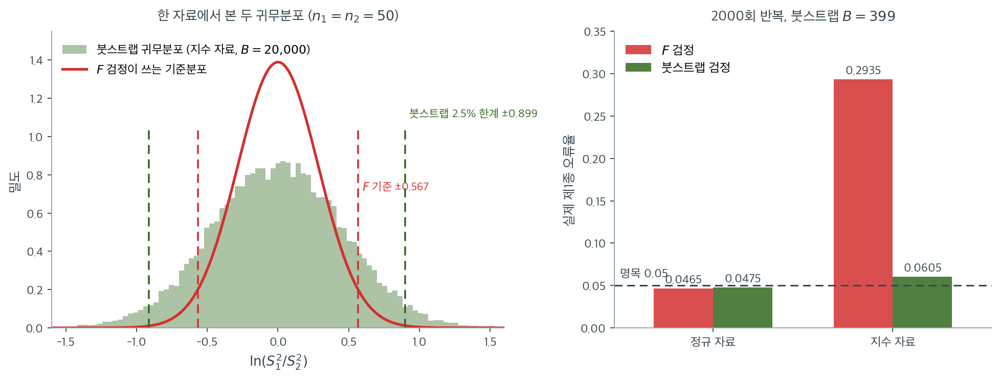

# 붓스트랩 분산 검정

분산에 대한 고전적 검정(카이제곱, F 검정, Bartlett)은 정규성을 가정하고, 로버스트 검정(Levene, Brown-Forsythe)조차 기준분포에 점근근사를 쓴다. 붓스트랩은 재표집으로 검정통계량의 귀무분포를 추정하여 분포 가정을 피하는 대안을 제공한다. 표본크기가 작거나 분포를 모르거나 모수적 검정에 내장된 가정을 피하고 싶을 때 특히 유용하다.

## 분산에 대한 붓스트랩 원리

핵심 아이디어는 단순하다. 두 모집단의 분산이 같은지 검정하려면 귀무가설 아래에서 자료를 재표집하고 검정통계량을 여러 번 계산하면 된다. 재표집된 검정통계량들의 모임이 귀무분포를 근사하고, 관측된 통계량을 이 분포와 비교하여 $p$값을 얻는다.

붓스트랩은 모집단에 특정한 모수적 형태를 가정하지 않는다. 대신 표본의 경험분포를 참 모집단분포의 추정값으로 취급한다.

## 일표본 붓스트랩 분산 검정

$H_0\colon \sigma^2 = \sigma_0^2$을 $H_1\colon \sigma^2 \neq \sigma_0^2$에 대해 검정하려면

**1단계.** 크기 $n$인 원표본에서 관측 검정통계량을 계산한다.

$$
T_{\text{obs}} = \frac{(n-1)S^2}{\sigma_0^2}
$$

**2단계.** 원표본에서 관측값 $n$개를 복원추출하여 붓스트랩 표본 $B$개를 생성한다. 각 붓스트랩 표본 $b = 1, \ldots, B$에 대해 붓스트랩 표본분산 $S_b^{*2}$과 붓스트랩 검정통계량을 계산한다.

$$
T_b^* = \frac{(n-1)S_b^{*2}}{S^2}
$$

분모에 $\sigma_0^2$이 아니라 $S^2$을 쓴다. 붓스트랩 표본이 분산 $\sigma_0^2$이 아니라 $S^2$을 갖는 자료에서 추출되기 때문이다. 이렇게 해야 붓스트랩 분포가 귀무가설 주위에 중심을 갖는다.

**3단계.** 관측 통계량만큼 극단적인 붓스트랩 통계량의 비율로 붓스트랩 $p$값을 계산한다.

$$
p = \frac{1}{B}\sum_{b=1}^{B} \mathbf{1}(|T_b^* - (n-1)| \ge |T_{\text{obs}} - (n-1)|)
$$

## 이표본 붓스트랩 등분산 검정

$H_0\colon \sigma_1^2 = \sigma_2^2$을 검정하려면

**1단계.** 관측 분산비를 계산한다.

$$
F_{\text{obs}} = \frac{S_1^2}{S_2^2}
$$

**2단계.** 두 표본을 합쳐 $H_0$(등분산)을 만족하는 결합 자료를 만든다. 한 가지 방법은 각 집단을 0으로 중심화한 뒤 합치는 것이다.

$$
\tilde{X}_{1j} = X_{1j} - \bar{X}_1, \qquad \tilde{X}_{2j} = X_{2j} - \bar{X}_2
$$

그런 다음 중심화된 잔차를 하나의 풀 $\{\tilde{X}_{11}, \ldots, \tilde{X}_{1n_1}, \tilde{X}_{21}, \ldots, \tilde{X}_{2n_2}\}$로 합친다.

**3단계.** 각 붓스트랩 반복 $b = 1, \ldots, B$에 대해

- 풀에서 관측값 $n_1$개를 복원추출한다(붓스트랩 "집단 1")
- 풀에서 관측값 $n_2$개를 복원추출한다(붓스트랩 "집단 2")
- 붓스트랩 분산비 $F_b^* = S_{1b}^{*2} / S_{2b}^{*2}$을 계산한다

**4단계.** 붓스트랩 $p$값을 계산한다.

$$
p = \frac{1}{B}\sum_{b=1}^{B} \mathbf{1}\!\left(\left|\ln F_b^*\right| \ge \left|\ln F_{\text{obs}}\right|\right)
$$

분산비의 로그를 쓰면 검정이 대칭이 된다. $F = 2$와 $F = 0.5$가 등분산에서 같은 정도로 벗어난 것으로 취급된다.

!!! note "왜 귀무가설 아래에서 합치는가"
    두 집단의 중심화된 잔차를 합치면 두 붓스트랩 표본이 추출되는 단일 모집단이 만들어진다. 이는 재표집 체계에 $\sigma_1^2 = \sigma_2^2$을 강제하여 검정통계량의 귀무분포를 생성한다.

!!! warning "합치기가 항상 무해하지는 않다"
    중심화된 잔차를 합치는 것은 등분산뿐 아니라 두 집단의 **분포 모양이 같다**는 것도 강제한다. 예컨대 한 집단은 대칭이고 다른 집단은 치우쳐 있다면, 합쳐진 풀은 어느 쪽도 아닌 혼합분포가 된다.

    실무에서는 대체로 문제가 되지 않지만, 모양이 크게 다르다고 의심되면 각 집단의 잔차를 그 집단 안에서만 재표집한 뒤 표준편차로 나누어 척도를 맞추는 방법(스튜던트화 붓스트랩)이 더 안전하다.

## 붓스트랩이 실제로 무엇을 고치는가

이 절차가 비정규 자료에서 얼마나 도움이 되는지 재어 보자. $n_1 = n_2 = 50$인 두 표본을 **같은 분포**에서 뽑아($H_0$이 참) $F$ 검정과 위의 붓스트랩 검정을 각각 2000번 돌렸다.



왼쪽이 핵심이다. 지수분포 자료 한 벌에서 만든 붓스트랩 귀무분포(초록 막대)와 $F$ 검정이 쓰는 이론 기준분포(빨간 곡선)를 같은 축에 올렸다. **붓스트랩 분포가 훨씬 넓다.** 2.5% 한계가 $\pm 0.899$인데 $F$ 기준은 $\pm 0.567$이다. 곧 $F$ 검정은 실제보다 1.6배 좁은 자로 재고 있고, 그 좁은 자 때문에 기각선을 자주 넘는다.

붓스트랩이 이 폭을 어떻게 알아냈는지 생각해 보라. 어떤 공식도 첨도도 쓰지 않았다. 그저 **자료 자신을 다시 뽑았을 뿐**이다. 자료가 두꺼운 꼬리를 가졌다면 재표집된 표본도 두꺼운 꼬리를 갖고, 그 결과 분산비도 실제만큼 넓게 흩어진다. 분포 가정이 필요 없다는 말의 구체적인 뜻이 이것이다.

오른쪽이 그 대가다. 정규 자료에서는 두 검정이 $0.0465$와 $0.0475$로 사실상 같다. **붓스트랩을 쓴다고 해서 잃는 것이 거의 없다.** 지수 자료로 바꾸면 $F$ 검정이 $0.2935$로 무너지는 동안 붓스트랩은 $0.0605$에 머문다. 명목 5%를 완벽하게 지키지는 못하지만 여섯 배 부풀린 것과 20% 부풀린 것은 차원이 다른 이야기다.

붓스트랩이 완벽하지 않은 이유도 짚어 둘 만하다. $0.0605$의 초과분은 재표집이 **표본의 경험분포**를 참 분포로 취급하는 데서 온다. $n = 50$짜리 표본은 지수분포의 오른쪽 꼬리를 충분히 담지 못하므로 붓스트랩 분포도 참 분포보다 약간 좁다. $n$이 커지면 이 오차는 사라진다. 15.5절에서 본 용어로 말하면 이것은 **유한표본 근사 오차**이지 모형 오설정이 아니다.

## 다표본 확장

$k > 2$개 집단에 대해 붓스트랩 접근은 자연스럽게 일반화된다.

1. 각 집단에서 집단평균을 빼서 중심화한다.
2. 중심화된 잔차를 모두 합친다.
3. 각 붓스트랩 반복에서 집단 $i$마다 풀에서 관측값 $n_i$개를 추출한다.
4. 붓스트랩 표본에 대해 검정통계량(Bartlett의 $T$나 Levene의 $W$ 등)을 계산한다.
5. 관측 통계량을 붓스트랩 분포와 비교한다.

이 접근은 어떤 고전적·로버스트 분산 검정에 대해서도 귀무분포를 비모수적으로 추정한 붓스트랩 판을 제공한다.

## 붓스트랩 접근의 장점

- **분포 가정이 없다.** 붓스트랩은 정규성이나 다른 모수적 형태를 요구하지 않는다.
- **유한표본 분포를 직접 추정한다.** 점근근사에 의존하는 대신 재표집으로 유한표본 귀무분포의 모양을 추정한다.
- **유연하다.** 표준 표에 없는 사용자 정의 통계량을 포함해 어떤 검정통계량이든 붓스트랩할 수 있다.

!!! warning "붓스트랩은 "정확"하지 않다"
    붓스트랩이 유한표본에서 **정확한**(exact) 검정이라는 서술을 종종 볼 수 있으나 옳지 않다. 붓스트랩은 참 모집단분포 $F$ 대신 경험분포 $\hat{F}_n$에서 표집하므로, 얻어지는 것은 $\hat{F}_n$ 아래의 정확한 분포일 뿐 $F$ 아래의 분포가 아니다. $\hat{F}_n \to F$이므로 **일치성**은 있지만 유한표본 오차는 남는다.

    아래 연습문제 3의 모의실험이 이를 확인해 준다. 정규와 $t_5$ 자료에서는 크기가 0.05에 가깝지만 강하게 치우친 지수분포에서는 0.082로 부풀려진다. 붓스트랩도 만병통치약은 아니다.

## 한계

- **계산 비용.** 신뢰할 만한 $p$값을 얻으려면 수천 번의 붓스트랩 반복이 필요하다(선별용 $B \ge 1000$, 출판용 $B \ge 10000$).
- **이산 자료.** 이산분포에서는 복원추출이 이상한 성질을 갖는 붓스트랩 표본을 만들 수 있다.
- **아주 작은 표본.** $n < 10$이면 경험분포가 모집단의 나쁜 근사이므로 붓스트랩 결과를 믿기 어렵다.
- **치우친 자료.** 위 경고에서 보듯 강한 치우침에서는 크기가 다소 부풀려진다.

<div class="exbox" markdown>

**보기 1.** <span class="diff easy" title="쉬움"></span> 붓스트랩 등분산 검정. 집단당 $n = 8$, 중심화한 잔차를 합쳐 만든 풀에서 재표집해 $|\log F^*|$ 의 귀무분포를 만든다.

**(1)** $n_1 = n_2$ 이면 $\log F^*$ 의 분포가 **0 에 대하여 정확히 대칭**임을 보이시오. 따라서 $|\log F^*| \ge |\log F_{\text{obs}}|$ 로 세는 것이 올바른 양측 $p$ 값이다.

**(2)** 두 집단의 분산이 다를 때 **풀의 첨도가 부풀려짐**을 보이고, 잔차의 분산 $v_1, v_2$ 와 첨도 $\kappa_1, \kappa_2$ 로 풀의 첨도를 적으시오. $\kappa_1 = \kappa_2$ 이면 그 부풀림이 $r = v_1/v_2$ 만의 함수임을 밝히고, 그것이 $p$ 값을 F 검정보다 크게 만드는 과정을 수로 확인하시오.

</div>

??? success "풀이"

    **(1) 대칭성은 교환가능성에서 나온다.** 중심화한 잔차를 합쳐 만든 풀의 경험분포를 $\hat F$ 라 쓰자. 두 붓스트랩 표본 `boot1`, `boot2` 는 **같은** $\hat F$ 에서 복원추출한 것이고 서로 독립이며, $n_1 = n_2 = n$ 이라 크기까지 같다. 그러므로 쌍 $(\text{boot1}, \text{boot2})$ 와 $(\text{boot2}, \text{boot1})$ 의 결합분포가 같고, 뒤의 쌍이 주는 통계량은

    $$
    \log \frac{S^2(\text{boot2})}{S^2(\text{boot1})} = -\log F^*
    $$

    이므로

    $$
    \log F^* \;\overset{d}{=}\; -\log F^*
    $$

    이다. **0 에 대하여 정확히 대칭**이다. 그래서 $E[\log F^*] = 0$, 중앙값도 $0$ 이고, 양쪽 꼬리가 같은 확률을 가지므로

    $$
    p = \frac1B\sum_b \mathbf 1\!\left(|\log F_b^*| \ge |\log F_{\text{obs}}|\right)
    $$

    가 양쪽 꼬리를 한꺼번에 세는 올바른 양측 $p$ 값이 된다. 로그를 씌우는 까닭도 이것이다. $F$ 눈금에서 $|F^* - 1|$ 로 세면 $F = 2$ 와 $F = 0.5$ 가 다른 이탈로 세어져 대칭이 깨진다.

    **여기서는 귀무값과 관측값 둘 다 쓴다는 점을 짚어 두자.** 15.6절 [붓스트랩 분산 검정](bootstrap_var_test.md)의 재표집은 집단 **안에서** 하므로 분포의 중심이 관측값이었고, 그래서 $p$ 값을 귀무값 1 과 견주어야 했다. 여기는 풀에서 뽑으므로 분포의 중심이 **귀무값**이고, 그래서 관측값과 견주는 것이 옳다. **어느 쪽이 맞는지는 공식이 아니라 분포가 어디에 중심을 두는지가 정한다.**

    **(2) 합치면 첨도가 부풀려진다.** 두 집단의 크기가 같고 잔차가 각각 평균 0 이므로, 풀의 적률은 두 집단 적률의 산술평균이다. 잔차의 분산을 $v_i$, 첨도를 $\kappa_i$ 라 하면 $i$ 집단의 4 차 적률이 $\kappa_i v_i^2$ 이므로

    $$
    m_2^{\text{pool}} = \frac{v_1 + v_2}{2},
    \qquad
    m_4^{\text{pool}} = \frac{\kappa_1 v_1^2 + \kappa_2 v_2^2}{2}
    $$

    이고, 따라서

    $$
    \beta_2^{\text{pool}} = \frac{m_4^{\text{pool}}}{\bigl(m_2^{\text{pool}}\bigr)^2}
    = \frac{2\left(\kappa_1 v_1^2 + \kappa_2 v_2^2\right)}{(v_1+v_2)^2}
    $$

    이다. $\kappa_1 = \kappa_2 = \kappa$ 인 경우를 보면 $r = v_1/v_2$ 로 쓸 때

    $$
    \beta_2^{\text{pool}} = \kappa \cdot \frac{2(r^2+1)}{(r+1)^2}
    $$

    가 되어, **부풀림이 $r$ 만의 함수**다. 이 배율은 $r = 1$ 에서 최솟값 $1$ 을 갖고 ($(r-1)^2 \ge 0$ 에서 $2(r^2+1) \ge (r+1)^2$), $r \to 0$ 이나 $r \to \infty$ 에서 $2$ 로 간다. **등분산이 아닌 두 집단을 합치면 풀의 첨도가 최대 두 배까지 올라간다.**

    그 결과가 검정에 하는 일은 분명하다. 분산비의 산포는 첨도와 함께 커지므로 **귀무분포가 넓어지고, 넓은 자로 재면 같은 관측값이 덜 극단적으로 보인다.** 곧 이 검정은 $H_1$ 이 참일 때 스스로 기각선을 밀어내므로 **검정력을 깎아먹는다.** 앞의 "합치기가 항상 무해하지는 않다"는 경고의 정량판이 이것이다.

    **수로 확인한다.**

    ```python
    import numpy as np

    def bootstrap_variance_test(x, y, B=10000, seed=42):
        """두 분산이 같은지를 붓스트랩으로 검정한다.

        귀무가설 아래에서의 분포를 얻으려면 두 집단이 같은 분포에서 나온
        상태를 만들어야 한다. 집단마다 중심을 맞춘 뒤 하나로 합치는 것이
        그 방법이다.
        """
        rng = np.random.default_rng(seed)
        n1, n2 = len(x), len(y)

        # 관측된 분산비
        f_obs = np.var(x, ddof=1) / np.var(y, ddof=1)

        # 중심만 맞추고 퍼짐은 그대로 둔다. 이렇게 합쳐야 "분산이 같다"는
        # 상태를 흉내 낼 수 있다.
        x_centered = x - np.mean(x)
        y_centered = y - np.mean(y)
        pool = np.concatenate([x_centered, y_centered])

        # 비의 로그를 쓰는 까닭은 대칭을 얻기 위해서다. F 와 1/F 이 같은 크기의
        # 이탈로 세어져야 양측검정이 제대로 된다.
        count = 0
        for _ in range(B):
            boot1 = rng.choice(pool, size=n1, replace=True)
            boot2 = rng.choice(pool, size=n2, replace=True)
            f_boot = np.var(boot1, ddof=1) / np.var(boot2, ddof=1)
            if abs(np.log(f_boot)) >= abs(np.log(f_obs)):
                count += 1

        p_value = count / B
        return f_obs, p_value

    # 보기
    x = np.array([10, 12, 14, 11, 13, 15, 12, 10])
    y = np.array([20, 28, 22, 35, 25, 18, 30, 22])

    f_stat, p_val = bootstrap_variance_test(x, y)
    print(f"Sample variances: {np.var(x, ddof=1):.3f}, {np.var(y, ddof=1):.3f}")
    print(f"Variance ratio: {f_stat:.4f}")
    print(f"Bootstrap p-value: {p_val:.4f}")

    # ===== (1) 대칭성과 풀의 첨도 =====
    from scipy.special import polygamma
    from scipy.stats import f as f_dist

    def emp_kurtosis(v):
        v = np.asarray(v, float)
        m = v.mean()
        return ((v - m) ** 4).mean() / (((v - m) ** 2).mean()) ** 2

    rx, ry = x - x.mean(), y - y.mean()
    v1, v2 = rx.var(ddof=0), ry.var(ddof=0)
    k1, k2 = emp_kurtosis(rx), emp_kurtosis(ry)
    pool = np.concatenate([rx, ry])
    r = v1 / v2

    print(f"\n--- (1) 풀의 첨도 ---")
    print(f"잔차의 분산  v1 = {v1:.6f},  v2 = {v2:.6f},   r = v1/v2 = {r:.6f}")
    print(f"잔차의 첨도  k1 = {k1:.6f},  k2 = {k2:.6f}")
    formula = 2 * (k1 * v1**2 + k2 * v2**2) / (v1 + v2) ** 2
    print(f"풀의 첨도  직접 계산 = {emp_kurtosis(pool):.6f}")
    print(f"           공식      = {formula:.6f}   (차 {abs(emp_kurtosis(pool) - formula):.2e})")

    # 등분산이었다면? y 잔차를 x 잔차의 척도로 되돌려 같은 일을 한다.
    pool_eq = np.concatenate([rx, ry * np.sqrt(v1 / v2)])
    print(f"등분산이면 풀의 첨도 = {emp_kurtosis(pool_eq):.6f}   (= (k1+k2)/2 = {(k1 + k2) / 2:.6f})")
    print(f"부풀림 = {emp_kurtosis(pool) / emp_kurtosis(pool_eq):.4f} 배")
    print(f"k1 = k2 일 때의 배율 공식 2(r^2+1)/(r+1)^2 = {2 * (r * r + 1) / (r + 1) ** 2:.4f}")
    print("  r 에 따른 그 배율 (1 에서 최소, 양 끝에서 2 로)")
    for rr in (1.0, 0.5, 0.2, r, 0.05):
        print(f"    r = {rr:<9.6f} -> {2 * (rr * rr + 1) / (rr + 1) ** 2:.4f}")

    # ===== (2) 그 부풀림이 귀무분포와 p 값에 하는 일 =====
    rng = np.random.default_rng(42)
    B, n = 10000, len(x)
    lf = np.empty(B)
    for b in range(B):
        b1 = rng.choice(pool, size=n, replace=True)
        b2 = rng.choice(pool, size=n, replace=True)
        lf[b] = np.log(b1.var(ddof=1) / b2.var(ddof=1))

    sd_norm = np.sqrt(2 * polygamma(1, (n - 1) / 2))
    print(f"\n--- (2) 귀무분포의 폭 ---")
    print(f"붓스트랩 귀무분포:  평균 {lf.mean():+.4f}  중앙값 {np.median(lf):+.4f}"
          f"  (대칭이면 둘 다 0, 몬테카를로 오차 +-{lf.std(ddof=1) / np.sqrt(B):.4f})")
    print(f"붓스트랩 SD(log F*)            = {lf.std(ddof=1):.4f}")
    print(f"정규이론 SD = sqrt(2 psi'(3.5)) = {sd_norm:.4f}   (정확한 값)")
    print(f"  붓스트랩이 {100 * (lf.std(ddof=1) / sd_norm - 1):.1f} % 넓다")
    print(f"델타 공식 sqrt(2(k_pool-1)/n)   = {np.sqrt(2 * (emp_kurtosis(pool) - 1) / n):.4f}"
          f"   (n=8 에서는 믿을 수 없다)")

    fobs = np.log(f_stat)
    c_boot = np.percentile(np.abs(lf), 95)
    c_norm = abs(np.log(f_dist(n - 1, n - 1).ppf(0.025)))
    print(f"\n5% 기각선 |log F|:  붓스트랩 {c_boot:.4f}   정규이론 {c_norm:.4f}")
    print(f"관측값 |log F_obs| = {abs(fobs):.4f}  ->  둘 다 넘는다")
    p_f = 2 * min(f_dist(n - 1, n - 1).cdf(f_stat), f_dist(n - 1, n - 1).sf(f_stat))
    print(f"p 값:  붓스트랩 {np.mean(np.abs(lf) >= abs(fobs)):.4f}   F 검정 {p_f:.4f}"
          f"   비 {np.mean(np.abs(lf) >= abs(fobs)) / p_f:.2f} 배")
    ```

    출력:

    ```text
    Sample variances: 3.268, 32.286
    Variance ratio: 0.1012
    Bootstrap p-value: 0.0206

    --- (1) 풀의 첨도 ---
    잔차의 분산  v1 = 2.859375,  v2 = 28.250000,   r = v1/v2 = 0.101217
    잔차의 첨도  k1 = 1.890442,  k2 = 2.176208
    풀의 첨도  직접 계산 = 3.621034
               공식      = 3.621034   (차 0.00e+00)
    등분산이면 풀의 첨도 = 2.033325   (= (k1+k2)/2 = 2.033325)
    부풀림 = 1.7808 배
    k1 = k2 일 때의 배율 공식 2(r^2+1)/(r+1)^2 = 1.6661
      r 에 따른 그 배율 (1 에서 최소, 양 끝에서 2 로)
        r = 1.000000  -> 1.0000
        r = 0.500000  -> 1.1111
        r = 0.200000  -> 1.4444
        r = 0.101217  -> 1.6661
        r = 0.050000  -> 1.8186

    --- (2) 귀무분포의 폭 ---
    붓스트랩 귀무분포:  평균 +0.0008  중앙값 +0.0151  (대칭이면 둘 다 0, 몬테카를로 오차 +-0.0098)
    붓스트랩 SD(log F*)            = 0.9844
    정규이론 SD = sqrt(2 psi'(3.5)) = 0.8128   (정확한 값)
      붓스트랩이 21.1 % 넓다
    델타 공식 sqrt(2(k_pool-1)/n)   = 0.8095   (n=8 에서는 믿을 수 없다)

    5% 기각선 |log F|:  붓스트랩 1.9187   정규이론 1.6084
    관측값 |log F_obs| = 2.2905  ->  둘 다 넘는다
    p 값:  붓스트랩 0.0206   F 검정 0.0073   비 2.83 배
    ```

    **(1)의 대칭성이 확인된다.** 붓스트랩 귀무분포의 평균이 $+0.0008$ 로 몬테카를로 오차 $\pm0.0098$ 안에 있고 중앙값도 $+0.0151$ 로 거의 $0$ 이다. 분포 자체는 (1)에서 보았듯 정확히 대칭이고, 남은 흔들림은 $B = 10000$ 에서 오는 것뿐이다.

    **(2)의 첨도 공식이 정확히 맞는다.** 풀의 첨도를 직접 계산한 $3.621034$ 와 $2(\kappa_1 v_1^2 + \kappa_2 v_2^2)/(v_1+v_2)^2$ 가 **차 $0$** 으로 같다. 그리고 두 집단의 분산이 같았다면 풀의 첨도가 $(\kappa_1+\kappa_2)/2 = 2.033325$ 였을 것이므로, 분산비 $r = 0.101$ 이 첨도를 **$1.78$ 배** 부풀린 셈이다.

    $\kappa_1 = \kappa_2$ 를 가정한 배율 공식은 $r = 0.101$ 에서 $1.6661$ 을 준다. 실제 $1.7808$ 보다 조금 작은데, 이 자료는 $\kappa_1 = 1.890$ 과 $\kappa_2 = 2.176$ 으로 서로 다르고 **분산이 큰 쪽($v_2$)이 $m_4$ 를 지배**하므로 그쪽의 더 큰 첨도가 더 무겁게 셈되기 때문이다. 배율 표를 보면 $r = 1$ 에서 $1.0000$, $r = 0.2$ 에서 $1.4444$, $r = 0.05$ 에서 $1.8186$ 으로 $2$ 를 향해 올라간다.

    **그 부풀림이 귀무분포를 넓혔다.** 붓스트랩 $\operatorname{SD}(\log F^*) = 0.9844$ 가 정규이론의 정확한 값 $\sqrt{2\psi'(3.5)} = 0.8128$ 보다 $21\%$ 크다. 그래서 $5\%$ 기각선이 $|\log F| = 1.9187$ 로 정규이론의 $1.6084$ 보다 $19\%$ 멀리 밀려 있다. **관측값 $|\log F_{\text{obs}}| = 2.2905$ 는 두 선을 다 넘지만, 선이 멀어진 만큼 $p$ 값이 커졌다.** 붓스트랩 $0.0206$ 이 F 검정 $0.0073$ 의 $2.83$ 배다.

    (델타 공식에 풀의 첨도를 넣으면 $0.8095$ 가 나와 실제 $0.9844$ 보다 $18\%$ 작다. 5.3절의 델타 결과는 $n \to \infty$ 근사이고 $n = 8$ 은 그 영역이 아니다. **방향만 쓰고 값은 쓰지 말아야 한다.**)

    **그래서 이 $p$ 값 차이를 "붓스트랩이 더 보수적"이라고만 읽으면 안 된다.** 이 자료의 분산비가 10 배라서 풀이 과분산된 것이고, 등분산이 참일 때는 이 부풀림이 일어나지 않는다. 앞 절 그림에서 정규 자료의 크기가 $0.0465$ 대 $0.0475$ 로 두 검정이 사실상 같았던 것이 그 증거다. **부풀림은 $H_0$ 아래의 크기를 망치는 것이 아니라 $H_1$ 아래의 검정력을 깎는다.** 모양이 크게 다르다고 의심되면 앞의 경고가 권한 스튜던트화 붓스트랩을 쓰라.

같은 자료에 다른 검정을 적용하면 F 검정은 $p = 0.0073$, Brown-Forsythe는 $p = 0.0272$이다. 세 검정 모두 5% 수준에서 기각하지만 $p$값이 네 배 차이 난다. 붓스트랩 결과가 두 값 사이에 놓인다는 점이 시사적이다. F 검정만큼 낙관적이지도, Brown-Forsythe만큼 보수적이지도 않다.

## 연습문제

<div class="drillbox" markdown>

**연습문제 1.** <span class="diff med" title="중간"></span>
독립인 두 표본에 대해 $H_0: \sigma_1^2 = \sigma_2^2$을 검정하는 붓스트랩 절차를 기술하라.

</div>

??? success "풀이"

    1. 관측 검정통계량 $T_{\text{obs}} = s_1^2/s_2^2$(또는 $|s_1^2 - s_2^2|$)을 계산한다.
    2. 두 표본을 (중심화한 뒤) 합쳐 결합 자료를 만든다($H_0$ 강제).
    3. $b = 1, \dots, B$에 대해 합쳐진 자료에서 크기 $n_1$, $n_2$인 붓스트랩 표본을 뽑고 $T_b^*$을 계산한다.
    4. $p$값은 $T_{\text{obs}}$만큼 극단적인 $T_b^*$ 값의 비율이다.

    붓스트랩 기준분포가 실제 자료 분포에 적응하므로 정규성 없이도 타당하다.

    **중심화가 왜 필요한가.** 중심화하지 않고 원자료를 그대로 합치면 집단 간 **평균 차이**가 풀의 분산에 섞여 들어간다. 그러면 붓스트랩 표본의 분산이 실제보다 커지고 귀무분포가 오른쪽으로 이동하여 검정이 지나치게 보수적이 된다. 우리가 검정하려는 것은 분산이지 평균이 아니므로 반드시 평균 차이를 제거해야 한다. $\square$

<div class="drillbox" markdown>

**연습문제 2.** <span class="diff med" title="중간"></span>
고전적 방법과 비교하여 붓스트랩이 분산 검정에 특히 유용한 이유는 무엇인가?

</div>

??? success "풀이"
    고전적 분산 검정(카이제곱, F 검정)은 비정규성에 매우 민감하다. 15.3절에서 보았듯 가벼운 이탈만으로도 제1종 오류율이 심각하게 왜곡된다($t_{10}$에서 이미 두 배). 붓스트랩은 분포 가정을 피하므로 치우쳤거나 꼬리가 두꺼운 자료에서 더 신뢰할 만하다.

    또한 붓스트랩은 단순한 고전적 검정통계량이 없는 복잡한 분산 가설(분산의 비, 분산의 함수)도 검정할 수 있다. 예컨대 "집단 1의 분산이 집단 2의 두 배를 넘는가"($H_0: \sigma_1^2/\sigma_2^2 \leq 2$) 같은 가설은 표준 F 검정으로 다루기 번거롭지만 붓스트랩으로는 자연스럽다.

    **다만 만능은 아니다.** 붓스트랩의 타당성도 (1) 관측값의 독립성과 (2) 경험분포가 참 분포의 좋은 근사라는 조건에 기댄다. 표본이 작으면 두 번째 조건이 무너지고, 종속 자료에서는 첫 번째 조건이 무너진다(그 경우 블록 붓스트랩이 필요하다). $\square$

<div class="drillbox" markdown>

**연습문제 3.** <span class="diff med" title="중간"></span>
붓스트랩 등분산 검정의 실제 크기를 모의실험으로 확인하라. 정규, $t_5$, 지수분포에서 균형 설계와 불균형 설계를 비교하라.

</div>

??? success "풀이"

    ```python
    import numpy as np

    rng = np.random.default_rng(0)

    def boot_p(x, y, B, rng):
        n1, n2 = len(x), len(y)
        f = np.log(np.var(x, ddof=1) / np.var(y, ddof=1))
        pool = np.concatenate([x - np.mean(x), y - np.mean(y)])
        b1 = rng.choice(pool, (B, n1), True)
        b2 = rng.choice(pool, (B, n2), True)
        fb = np.log(b1.var(axis=1, ddof=1) / b2.var(axis=1, ddof=1))
        return (np.abs(fb) >= abs(f)).mean()

    R, B = 2000, 999
    cases = [
        ("Normal",      lambda n: rng.normal(0, 1, n)),
        ("t(5)",        lambda n: rng.standard_t(5, n)),
        ("Exponential", lambda n: rng.exponential(1, n)),
    ]

    for name, gen in cases:
        for n1, n2 in [(20, 20), (10, 40)]:
            rej = sum(boot_p(gen(n1), gen(n2), B, rng) < 0.05 for _ in range(R))
            print(f"{name:>12} n=({n1},{n2}): size = {rej / R:.4f}")
    ```

    출력:

    ```text
          Normal n=(20,20): size = 0.0480
          Normal n=(10,40): size = 0.0545
            t(5) n=(20,20): size = 0.0455
            t(5) n=(10,40): size = 0.0520
     Exponential n=(20,20): size = 0.0820
     Exponential n=(10,40): size = 0.0620
    ```

    | 분포 | $n = (20,20)$ | $n = (10,40)$ |
    |---|---|---|
    | Normal | 0.048 | 0.055 |
    | $t_5$ | 0.046 | 0.052 |
    | Exponential | **0.082** | 0.062 |

    **결과 해석.**

    - 정규와 $t_5$에서는 크기가 0.046~0.055로 잘 통제된다. 15.3절 표에서 F 검정이 $t_5$에서 0.156이었던 것과 극명하게 대비된다. **붓스트랩이 두꺼운 꼬리 문제를 성공적으로 해결한다.**
    - 지수분포에서는 균형 설계에서 0.082로 부풀려진다. 명목값의 1.6배이다. F 검정의 0.266보다는 훨씬 낫지만 완벽하지 않다.
    - 불균형 설계 $(10, 40)$에서 정규·$t_5$의 크기가 약간 올라간다($0.052$~$0.055$). 작은 집단의 붓스트랩 분산 추정이 불안정하기 때문이다.

    **왜 지수분포에서 나빠지는가.** 붓스트랩 표본은 원표본의 값들만 재사용하므로 원표본이 담지 못한 꼬리 영역을 재현할 수 없다. 강하게 치우친 분포에서는 $n = 20$짜리 표본이 오른쪽 꼬리를 제대로 담지 못하므로 경험분포가 참 분포를 과소대표하고, 붓스트랩 귀무분포가 실제보다 좁아진다. 그래서 관측 통계량이 상대적으로 극단적으로 보이고 기각이 늘어난다.

    **개선 방법.** 스튜던트화 붓스트랩(통계량을 표준오차 추정값으로 나눈 뒤 붓스트랩)이나 BCa 방법을 쓰면 이 편향을 상당 부분 보정할 수 있다. $\square$

<div class="drillbox" markdown>

**연습문제 4.** <span class="diff med" title="중간"></span>
신뢰할 만한 분산 검정을 위해 보통 몇 번의 붓스트랩 반복 $B$가 필요한가? 무엇이 이 선택을 결정하는가?

</div>

??? success "풀이"
    가설검정에서 근사적 $p$값에는 $B = 1000$이면 대체로 충분하지만, 정밀한 $p$값(특히 $\alpha = 0.01$처럼 작은 유의수준에서 검정할 때)에는 $B = 10{,}000$ 이상이 권장된다.

    필요한 $B$는 (1) 원하는 $p$값의 정밀도($\text{SE}(\hat{p}) \approx \sqrt{p(1-p)/B}$), (2) 유의수준(작은 $\alpha$일수록 큰 $B$ 필요), (3) 검정통계량의 변동성에 달려 있다.

    | $B$ | $p = 0.05$에서 SE | 95% 오차한계 |
    |---|---|---|
    | 200 | 0.0154 | $\pm 0.030$ |
    | 1,000 | 0.0069 | $\pm 0.014$ |
    | 2,000 | 0.0049 | $\pm 0.010$ |
    | 10,000 | 0.0022 | $\pm 0.004$ |
    | 100,000 | 0.0007 | $\pm 0.001$ |

    $\alpha = 0.05$에서 $B = 2000$이면 $p$값의 표준오차가 약 $0.005$이다.

    **실무 기준.** 결정이 문턱에서 멀면 작은 $B$로 충분하다. $\hat{p} = 0.30$이면 $B = 200$이어도 결론이 바뀌지 않는다. 반면 $\hat{p}$가 $0.04$~$0.06$ 구간에 있으면 $B$를 10배로 늘려 안정성을 확인해야 한다.

    **덧붙임: $p$값이 0으로 나올 때.** $B$번 모두 관측값보다 덜 극단적이면 $\hat{p} = 0$이 나오는데, 이는 "$p$가 정확히 0"이 아니라 "$p < 1/B$"라는 뜻이다. 관례적으로 $(c+1)/(B+1)$ 형태의 보정을 써서 $p = 0$을 피한다($c$는 극단적인 붓스트랩 통계량의 개수). $B = 999$이면 최소 $p$값이 $1/1000 = 0.001$이 된다. $\square$

<div class="drillbox" markdown>

**연습문제 5.** <span class="diff med" title="중간"></span>
붓스트랩 등분산 검정이 $p = 0.047$을, Levene 검정이 $p = 0.12$를 냈다. 불일치의 가능한 원인을 논하라.

</div>

??? success "풀이"
    두 검정은 조금씩 다른 것을 재고 민감도도 다르므로 어긋날 수 있다. Levene 검정은 집단평균(또는 중앙값)으로부터의 절대편차에 기반하는 반면, 붓스트랩은 분산비를 직접 쓸 수 있다. Levene 검정은 비정규성에 로버스트하도록 설계되었지만, 붓스트랩은 자료의 실제 분포에 더 유연하게 적응한다.

    다른 원인들.

    1. **몬테카를로 오차.** 붓스트랩 $p$값에는 오차가 있다. $B = 1000$이면 $p = 0.047$의 표준오차가 $0.0067$이므로 참값이 $0.034$~$0.060$ 어디든 될 수 있다. **더 큰 $B$로 다시 돌려 안정성을 확인해야 한다.**

    2. **통계량의 차이.** 붓스트랩이 분산비 $S_1^2/S_2^2$을 쓰면 제곱편차 기반이므로 이상점에 민감하다. Levene은 절대편차 기반이라 덜 민감하다. 자료에 이상점이 있으면 붓스트랩 쪽이 작은 $p$값을 낼 가능성이 높다.

    3. **검정력 프로파일의 차이.** 두 검정은 서로 다른 대립가설에 대해 검정력이 다르다. 한 집단만 분산이 크게 다른 경우와 여러 집단이 조금씩 다른 경우에 각각 유리한 검정이 다르다.

    4. **크기의 차이.** 연습문제 3에서 보았듯 붓스트랩은 치우친 자료에서 크기가 0.082까지 부풀려질 수 있다. 자료가 치우쳐 있다면 붓스트랩의 $p = 0.047$이 과대 유의일 가능성이 있다.

    **실무적 대응.** (1) $B$를 늘려 붓스트랩 $p$값을 안정시킨다. (2) 자료의 왜도와 이상점을 확인한다. (3) 두 결과를 모두 보고하고 어느 것을 사전에 지정했는지 밝힌다. (4) $p = 0.047$과 $p = 0.12$는 모두 "증거가 약하다"는 범위이므로, 어느 쪽이든 강한 결론을 내리지 않는다. $\square$

---

## 정리하며

부트스트랩은 **귀무분포를 자료에서 만든다.**

- **분포 가정을 통째로 피한다.** 고전적 검정은 정규성을, 로버스트 검정도 점근근사를 쓰지만 부트스트랩은 경험분포에서 직접 재표집한다.
- **귀무가설을 자료에 부과하는 것이 관건이다.** 등분산을 검정하려면 두 표본을 각자의 표준편차로 나눠 같은 척도로 맞춘 뒤 재표집해야 한다. **그냥 재표집하면 대립가설 아래의 분포를 얻게 된다.**
- **표본이 작거나 분포를 모를 때 유용하다.**
- **만능은 아니다.** 표본이 모집단을 대표하지 못하면 그 편향이 복제되며, 분산은 4차적률에 의존해 부트스트랩도 표본이 아주 작으면 불안정하다.
- **계산이 비싸다.** $B$ 를 충분히 크게 잡아야 하며, 꼬리 $p$ 값이 필요하면 더 그렇다.

다음 절 **베이즈 분산 추론**으로 넘어간다.
