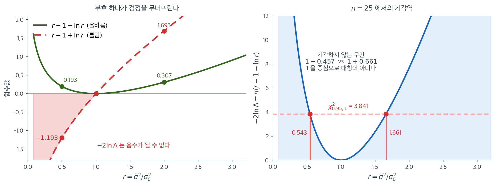

# 분산에 대한 가능도비 검정

가능도비 검정(LRT)은 귀무가설과 대립가설 아래의 최대화된 가능도를 비교하는 범용 가설검정 틀을 제공한다. $k$개 정규 모집단의 분산이 같은지 검정하는 문제에 적용하면 Bartlett 검정과 밀접하게 관련된 통계량이 나온다. 이 절은 분산 동질성에 대한 LRT를 유도하고 그 연결을 설명한다.

---

## 1. 가능도비의 틀

일반적인 가설검정 $H_0$ 대 $H_1$에 대해 가능도비 통계량은

$$
\Lambda = \frac{\sup_{\theta \in \Theta_0} L(\theta)}{\sup_{\theta \in \Theta} L(\theta)}
$$

여기서 $\Theta_0$은 $H_0$ 아래의 모수공간이고 $\Theta$는 전체 모수공간이다. $\Theta_0 \subseteq \Theta$이므로 항상 $0 \le \Lambda \le 1$이다. $\Lambda$가 작다는 것은 $H_0$의 제약이 가능도를 크게 떨어뜨린다는 뜻이다.

Wilks 정리에 의해 정칙조건 아래에서 $n \to \infty$일 때

$$
-2\ln\Lambda \stackrel{d}{\to} \chi^2_r
$$

여기서 $r$은 $\Theta$와 $\Theta_0$의 자유모수 개수 차이이다.

---

## 2. 일표본 분산 LRT

$\mu$를 모르는 단일 표본 $X_1, \ldots, X_n \sim N(\mu, \sigma^2)$에서 $H_0\colon \sigma^2 = \sigma_0^2$을 검정한다고 하자.

**$H_0$ 아래에서:** $\mu$의 최대가능도추정량은 $\bar{X}$이고 $\sigma^2$은 $\sigma_0^2$으로 고정된다. 최대화된 로그가능도는

$$
\ell_0 = -\frac{n}{2}\ln(2\pi\sigma_0^2) - \frac{1}{2\sigma_0^2}\sum_{i=1}^{n}(X_i - \bar{X})^2
$$

**전체 모형 아래에서:** 최대가능도추정량은 $\hat{\mu} = \bar{X}$, $\hat{\sigma}^2 = \frac{1}{n}\sum(X_i - \bar{X})^2$이다. 최대화된 로그가능도는

$$
\ell_1 = -\frac{n}{2}\ln(2\pi\hat{\sigma}^2) - \frac{n}{2}
$$

로그가능도비 통계량은 $r = \hat{\sigma}^2/\sigma_0^2$이라 쓰면

$$
-2\ln\Lambda = -2(\ell_0 - \ell_1) = n\ln\!\left(\frac{\sigma_0^2}{\hat{\sigma}^2}\right) + \frac{n\hat{\sigma}^2}{\sigma_0^2} - n = n\left(r - 1 - \ln r\right)
$$

$H_0$ 아래에서 이 값은 분포수렴으로 $\chi^2_1$에 접근한다.

!!! warning "로그의 방향에 주의하라"
    이 통계량은 $n(r - 1 - \ln r)$이지 $n(r - 1 + \ln r)$이 아니다. 부호를 뒤집으면 검정이 완전히 망가진다.

    함수 $g(r) = r - 1 - \ln r$는 $r > 0$에서 항상 음이 아니고 $r = 1$에서만 0이 된다($g'(r) = 1 - 1/r$이므로 $r=1$이 유일한 최소점). 이는 $-2\ln\Lambda \geq 0$이라는 요구조건을 만족한다.

    반면 $r - 1 + \ln r$는 $r < 1$에서 음수가 된다($r = 0.5$에서 $-1.193$). $-2\ln\Lambda$는 정의상 음수가 될 수 없으므로 이 형태는 틀린 것이다.

    | $r = \hat{\sigma}^2/\sigma_0^2$ | 0.5 | 1 | 2 |
    |---|---|---|---|
    | $r - 1 - \ln r$ (올바름) | 0.193 | 0 | 0.307 |
    | $r - 1 + \ln r$ (틀림) | $-1.193$ | 0 | 1.693 |



왼쪽에서 초록 곡선 $g(r) = r - 1 - \ln r$는 $r = 1$에서 바닥을 치고 양쪽으로 올라가는 **골짜기 모양**이다. 분산 추정값이 가설값보다 크든 작든 증거가 쌓인다는 뜻이며, 가능도비 검정이 자동으로 양측검정이 되는 이유이기도 하다. 붉은 곡선은 부호를 뒤집은 것인데 $r < 1$에서 통째로 음수 영역(분홍 음영)에 잠긴다. $-2\ln\Lambda$는 가능도의 비의 로그이고 $\Lambda \le 1$이므로 음수가 될 수 없으니, 이 형태는 정의부터 어긋난다.

곡선이 **비대칭**이라는 점도 중요하다. $g(0.5) = 0.193$인데 $g(2) = 0.307$이다. 분산이 절반이 된 것과 두 배가 된 것은 직관적으로 같은 정도의 이탈처럼 보이지만, 가능도는 두 배 쪽에 1.6배 강한 증거를 준다. 로그가능도가 $\ln \sigma^2$의 형태로 들어가기 때문에 생기는 자연스러운 비대칭이다.

오른쪽이 그 비대칭의 실제 결과다. $n = 25$에서 $-2\ln\Lambda = 25\,g(r)$을 그리고 임계값 $\chi^2_{0.95,1} = 3.841$을 그으면 기각하지 않는 구간이 $(0.543,\ 1.661)$이다. 1에서 **아래로는 $0.457$, 위로는 $0.661$**만큼 뻗는다. 15.2절 카이제곱 검정의 기각역이 비대칭이었던 것과 같은 현상이며, 분산을 다루는 검정에서는 "1을 중심으로 대칭"이라는 직관을 버려야 한다.

마지막으로 부호 확인법을 하나 기억해 두자. **$r = 1$을 넣어 0이 나오는지, 그리고 $r$을 1에서 조금 움직여 값이 커지는지 보면 된다.** 두 조건을 모두 만족하지 않는 식은 $-2\ln\Lambda$가 아니다.

---

## 3. 다표본 등분산 LRT

정규 모집단 $N(\mu_i, \sigma_i^2)$에서 나온 표본크기 $n_i$, 표본분산 $S_i^2$인 독립 표본 $k$개를 생각하자.

**$H_0\colon \sigma_1^2 = \cdots = \sigma_k^2 = \sigma^2$ 아래에서:** 공통 분산의 추정량은 합동분산이다.

$$
\hat{\sigma}^2 = S_p^2 = \frac{\sum_{i=1}^{k}(n_i - 1)S_i^2}{N - k}
$$

**대립가설 아래에서:** 각 집단이 자기 추정량 $\hat{\sigma}_i^2 = \frac{n_i - 1}{n_i}S_i^2 \approx S_i^2$($n_i$가 클 때)을 갖는다.

로그가능도비 통계량은 (자유도 $\nu_i = n_i - 1$을 써서) 다음으로 정리된다.

$$
-2\ln\Lambda = \sum_{i=1}^{k} \nu_i \ln\!\left(\frac{S_p^2}{S_i^2}\right) = (N - k)\ln S_p^2 - \sum_{i=1}^{k}\nu_i \ln S_i^2
$$

이것이 정확히 보정인자를 적용하기 전의 Bartlett 검정통계량 분자이다.

여기서는 일표본의 경우와 달리 $r-1$에 해당하는 항이 나타나지 않는다는 점에 주목하라. $S_p^2$이 $S_i^2$들의 가중평균이므로 $\sum_i \nu_i (S_i^2/S_p^2 - 1) = 0$이 되어 그 항이 소거되기 때문이다.

---

## 4. Bartlett 검정과의 연결

Bartlett 검정통계량은 LRT의 보정판이다.

$$
T_{\text{Bartlett}} = \frac{-2\ln\Lambda}{C}
$$

여기서

$$
C = 1 + \frac{1}{3(k-1)}\left(\sum_{i=1}^{k}\frac{1}{\nu_i} - \frac{1}{N-k}\right)
$$

보정인자 $C > 1$이 유한표본 카이제곱 근사를 개선한다. 보정하지 않으면 원래의 LRT 통계량 $-2\ln\Lambda$가 작은 표본에서 지나치게 자주 기각한다.

!!! note "Bartlett 검정의 토대로서의 LRT"
    Bartlett 검정은 독립적으로 고안된 것이 아니라 작은 표본 보정을 더한 가능도비 검정이다. LRT 유도를 이해하면 Bartlett 검정이 왜 그런 형태를 갖는지, 그리고 왜 정규성을 요구하는지(가능도가 Gauss 가능도이기 때문) 알 수 있다.

---

## 5. 자유도

$H_0$ 아래에서 자유모수는 $k + 1$개이다($\mu_1, \ldots, \mu_k, \sigma^2$). 대립가설 아래에서는 $2k$개이다($\mu_1, \ldots, \mu_k, \sigma_1^2, \ldots, \sigma_k^2$). 차이는 $r = 2k - (k+1) = k - 1$이다.

따라서 Wilks 정리에 의해

$$
-2\ln\Lambda \stackrel{d}{\to} \chi^2_{k-1}
$$

Bartlett 검정이 올바른 기준분포를 쓴다는 것이 확인된다.

<div class="exbox" markdown>

**보기 1.** <span class="diff easy" title="쉬움"></span> 두 집단 분산의 가능도비 검정. $n_1 = 15$, $S_1^2 = 22.4$인 집단과 $n_2 = 18$, $S_2^2 = 35.1$인 집단이 있다.

</div>

??? success "풀이"
    **1단계.** 합동분산:

    $$
    S_p^2 = \frac{14(22.4) + 17(35.1)}{31} = \frac{313.6 + 596.7}{31} = 29.3645
    $$

    **2단계.** LRT 통계량:

    $$
    -2\ln\Lambda = 14\ln\!\left(\frac{29.3645}{22.4}\right) + 17\ln\!\left(\frac{29.3645}{35.1}\right)
    $$

    $$
    = 14(0.2707) + 17(-0.1784) = 3.790 - 3.033 = 0.757
    $$

    **3단계.** 보정인자:

    $$
    C = 1 + \frac{1}{3}\left(\frac{1}{14} + \frac{1}{17} - \frac{1}{31}\right) = 1 + \frac{1}{3}(0.0714 + 0.0588 - 0.0323) = 1 + 0.0327 = 1.0327
    $$

    **4단계.** Bartlett 통계량: $T = 0.757 / 1.0327 = 0.733$.

    **5단계.** $\chi^2_{0.95, 1} = 3.841$과 비교한다. $0.733 < 3.841$이므로 $H_0$을 기각하지 못한다($p = 0.392$).

<div class="exbox" markdown>

**보기 2.** <span class="diff easy" title="쉬움"></span> 가능도비 검정과 Bartlett 보정. 보기 1 과 같은 요약값을 코드로 옮긴다.

**(1)** 보정인자 $C$ 가 **자료에 전혀 의존하지 않고** 자유도만의 함수임을 지적하고, 늘 $C > 1$ 임을 증명하시오. 또 $\nu_i$ 가 모두 $\nu$ 로 같으면 $C = 1 + \dfrac{k+1}{3k\nu}$ 이고, 이것이 **총자유도를 고정했을 때 $C$ 의 최솟값**임을 보이시오.

**(2)** 보정이 실제로 1종 오류율을 고치는지 모의실험으로 재시오. $H_0$ 아래에서는 $\nu_i S_i^2/\sigma^2 \sim \chi^2_{\nu_i}$ 이므로 원자료 없이 카이제곱에서 바로 뽑을 수 있다.

</div>

??? success "풀이"

    **(1) $C$ 는 자료를 보지 않는다.**

    $$
    C = 1 + \frac{1}{3(k-1)}\left(\sum_{i=1}^{k}\frac{1}{\nu_i} - \frac{1}{N-k}\right)
    $$

    에 들어 있는 것은 $k$ 와 $\nu_1, \ldots, \nu_k$ 뿐이고 $S_i^2$ 은 어디에도 없다. **그러므로 설계가 정해지면 $C$ 도 정해지고, 자료를 보기 전에 계산할 수 있다.** 보정은 통계량을 자료와 무관한 상수로 나누는 일, 곧 **눈금을 한 번 다시 매기는 일**이다. 따라서

    $$
    \frac{T_{\text{Bartlett}}}{-2\ln\Lambda} = \frac1C
    $$

    가 모든 자료에서 같은 값이고, 두 검정의 $p$ 값 순서도 결코 뒤바뀌지 않는다.

    **늘 $C > 1$ 이다.** $\nu_i \ge 1$ 이고 $\sum_i \nu_i = N - k$ 이므로, $k \ge 2$ 일 때

    $$
    \sum_{i=1}^k \frac{1}{\nu_i} \;\ge\; \frac{1}{\max_i \nu_i} \;>\; \frac{1}{\sum_i \nu_i} = \frac{1}{N-k}
    $$

    이다(가운데 부등호는 $k \ge 2$ 라 $\max_i \nu_i < \sum_i \nu_i$ 이기 때문이다). 괄호 안이 양수이므로 $C > 1$ 이고, 따라서

    $$
    T_{\text{Bartlett}} = \frac{-2\ln\Lambda}{C} \;<\; -2\ln\Lambda
    $$

    가 **언제나** 성립한다. **보정은 늘 통계량을 줄이고, 그러므로 늘 기각을 덜 하게 만든다.** 보정하지 않은 LRT 가 작은 표본에서 지나치게 자주 기각한다는 말과 방향이 맞는다.

    **등자유도일 때.** $\nu_i = \nu$ 이면 $\sum 1/\nu_i = k/\nu$ 이고 $N - k = k\nu$ 이므로

    $$
    C = 1 + \frac{1}{3(k-1)}\left(\frac{k}{\nu} - \frac{1}{k\nu}\right)
    = 1 + \frac{k^2-1}{3(k-1)k\nu}
    = 1 + \frac{k+1}{3k\nu}
    $$

    이다. $k = 2$ 면 $C = 1 + \dfrac{1}{2\nu}$ 로 아주 간단하다.

    **이것이 최솟값이다.** 산술–조화평균 부등식(또는 코시–슈바르츠)에서

    $$
    \sum_{i=1}^k \frac{1}{\nu_i} \;\ge\; \frac{k^2}{\sum_i \nu_i} = \frac{k^2}{N-k}
    $$

    이고 등호는 $\nu_i$ 가 모두 같을 때만 성립한다. 이를 넣으면

    $$
    C \;\ge\; 1 + \frac{1}{3(k-1)}\cdot\frac{k^2-1}{N-k} = 1 + \frac{k+1}{3(N-k)}
    $$

    인데, $N - k = k\nu$ 를 쓰면 이 하한이 바로 위의 등자유도 공식이다. **총자유도가 같다면 집단 크기가 고를 때 보정이 가장 작다.** 거꾸로 말하면 **집단 크기가 불균형할수록 카이제곱 근사가 더 나쁘고 보정이 더 커야 한다.**

    **(2) 수로 확인한다.** $H_0$ 이 참이고 자료가 정규라면 $\nu_i S_i^2/\sigma^2 \sim \chi^2_{\nu_i}$ 이 서로 독립이다. 통계량이 $S_i^2$ 의 비에만 의존하므로 $\sigma^2 = 1$ 로 두어도 일반성을 잃지 않고, 원자료를 만들 필요 없이 카이제곱에서 바로 뽑으면 된다.

    ```python
    import numpy as np
    from scipy import stats

    # 원자료 없이 집단별 크기와 표본분산만으로 계산할 수 있다.
    n = np.array([15, 18])
    s2 = np.array([22.4, 35.1])
    k = len(n)
    nu = n - 1
    N = n.sum()

    # 귀무가설(분산이 모두 같다) 아래에서의 공통 분산 추정값
    s2_pooled = np.sum(nu * s2) / np.sum(nu)

    # 가능도비 검정통계량. 제약 있는 최대가능도와 없는 것의 비에 로그를 씌운
    # 값이며, 각 집단의 분산이 공통값에서 얼마나 벗어났는지를 재는 셈이다.
    lrt = np.sum(nu * np.log(s2_pooled / s2))

    # 그대로 두면 카이제곱 근사가 작은 표본에서 어긋난다. Bartlett 보정은
    # 통계량을 이 인자로 나눠 근사를 개선한다.
    C = 1 + (1 / (3 * (k - 1))) * (np.sum(1 / nu) - 1 / np.sum(nu))

    # 보정한 통계량
    T = lrt / C

    # p-값
    p_value = stats.chi2.sf(T, k - 1)

    print(f"Pooled variance: {s2_pooled:.4f}")
    print(f"LRT statistic (uncorrected): {lrt:.4f}")
    print(f"Correction factor: {C:.4f}")
    print(f"Bartlett statistic (corrected): {T:.4f}")
    print(f"P-value: {p_value:.4f}")

    # === (1) C 가 자료를 보지 않는다. 불균형이 C 를 키우는가 ===
    def corr_factor(nu):
        nu = np.asarray(nu, dtype=float)
        kk = len(nu)
        return 1 + (1 / (3 * (kk - 1))) * (np.sum(1 / nu) - 1 / np.sum(nu))

    print(f"\n총자유도 N-k = {nu.sum()} 를 2 집단에 어떻게 쪼개는가")
    print(f"  균형 하한 1+(k+1)/(3(N-k)) = {1 + (k + 1) / (3 * nu.sum()):.6f}")
    for split in ([15, 16], [14, 17], [10, 21], [5, 26], [1, 30]):
        print(f"  nu = {str(split):10s} -> C = {corr_factor(split):.6f}")

    # === (2) 보정이 1종 오류율을 고치는가 ===
    def sizes(nu, M=200_000, alpha=0.05, rng=None):
        """H0 아래에서 nu_i S_i^2 ~ chi2(nu_i) 이므로 바로 뽑는다."""
        nu = np.asarray(nu, dtype=float)
        kk = len(nu)
        W = rng.chisquare(nu, size=(M, kk))       # nu_i * S_i^2  (sigma^2 = 1)
        s2b = W / nu                              # S_i^2
        sp = W.sum(axis=1) / nu.sum()             # 합동분산
        stat = (nu * np.log(sp[:, None] / s2b)).sum(axis=1)
        crit = stats.chi2(kk - 1).ppf(1 - alpha)
        Cc = corr_factor(nu)
        return np.mean(stat > crit), np.mean(stat / Cc > crit), Cc

    rng = np.random.default_rng(0)
    M = 200_000
    print(f"\n정규 자료, H0 참, alpha = 0.05, 반복 {M} 회 "
          f"(0.05 근처 표준오차 +-{np.sqrt(0.05 * 0.95 / M):.5f})")
    print("  nu                    C      보정 전    보정 후   등자유도 공식")
    for nus in ([4, 4], [3, 3, 3, 3], [4, 4, 4, 4, 4], [9, 9], [9, 9, 9],
                [14, 17], [49, 49]):
        a, b, Cc = sizes(nus, M=M, rng=rng)
        kk = len(nus)
        eq = (f"{1 + (kk + 1) / (3 * kk * nus[0]):.4f}"
              if len(set(nus)) == 1 else "-")
        print(f"  {str(nus):18s}{Cc:7.4f}   {a:.4f}     {b:.4f}   {eq:>8s}")
    ```

    출력:

    ```text
    Pooled variance: 29.3645
    LRT statistic (uncorrected): 0.7571
    Correction factor: 1.0327
    Bartlett statistic (corrected): 0.7332
    P-value: 0.3919

    총자유도 N-k = 31 를 2 집단에 어떻게 쪼개는가
      균형 하한 1+(k+1)/(3(N-k)) = 1.032258
      nu = [15, 16]   -> C = 1.032303
      nu = [14, 17]   -> C = 1.032665
      nu = [10, 21]   -> C = 1.038454
      nu = [5, 26]    -> C = 1.068734
      nu = [1, 30]    -> C = 1.333692

    정규 자료, H0 참, alpha = 0.05, 반복 200000 회 (0.05 근처 표준오차 +-0.00049)
      nu                    C      보정 전    보정 후   등자유도 공식
      [4, 4]             1.1250   0.0650     0.0500     1.1250
      [3, 3, 3, 3]       1.1389   0.0736     0.0475     1.1389
      [4, 4, 4, 4, 4]    1.1000   0.0697     0.0493     1.1000
      [9, 9]             1.0556   0.0561     0.0496     1.0556
      [9, 9, 9]          1.0494   0.0572     0.0494     1.0494
      [14, 17]           1.0327   0.0531     0.0494          -
      [49, 49]           1.0102   0.0507     0.0494     1.0102
    ```

    **보기 1 의 손계산과 코드가 맞는다.** 합동분산 $29.3645$, 보정 전 $0.7571$, $C = 1.0327$, 보정 후 $0.7332$, $p = 0.3919$ 로 다섯 값 모두 보기 1 과 같다.

    **(1)의 등자유도 공식이 정확히 맞는다.** 마지막 열의 $1 + (k+1)/(3k\nu)$ 가 실제 $C$ 와 네 자리까지 모두 같다. $\nu = 4$, $k = 2$ 에서 $1 + 1/(2\cdot4) = 1.1250$, $\nu = 3$, $k = 4$ 에서 $1 + 5/36 = 1.1389$ 이다.

    **균형이 $C$ 를 최소로 한다는 것도 확인된다.** 총자유도 $31$ 을 두 집단에 쪼갤 때 하한이 $1.032258$ 인데, 가장 고른 $[15,16]$ 이 $1.032303$ 으로 거의 거기에 붙고, 불균형을 키우면 $[10,21]$ $1.038454$, $[5,26]$ $1.068734$, $[1,30]$ $1.333692$ 로 올라간다. **한 집단이 자유도 1 밖에 없으면 보정이 $33\%$ 나 된다.** 보기 1 의 $[14,17]$ 은 거의 균형이라 보정이 $3.3\%$ 로 작다.

    **보정은 정말로 1종 오류율을 고친다.** 보정하지 않은 $-2\ln\Lambda$ 의 크기가 $\nu = 4$ 두 집단에서 $0.0650$, 네 집단 $\nu = 3$ 에서 $0.0736$, 다섯 집단 $\nu = 4$ 에서 $0.0697$ 으로 모두 명목값을 넘는다. 같은 자료에 $C$ 로 나누면 $0.0500$, $0.0475$, $0.0493$ 이 된다. 20 만 번 반복에서 표준오차가 $\pm0.00049$ 이므로 보정 전의 초과($0.0650$ 은 명목값보다 $31$ 표준오차 위다)는 의심의 여지 없이 실재하고, 보정 후에는 거의 다 명목값으로 돌아온다.

    자유도가 커지면 보정할 것도 줄어든다. $\nu = 49$ 두 집단에서는 보정 전이 이미 $0.0507$ 이고 보정 후 $0.0494$ 이며 $C$ 도 $1.0102$ 로 1 에 가깝다. **$C$ 는 $\nu \to \infty$ 에서 1 로 가고, Wilks 정리의 $\chi^2_{k-1}$ 근사가 그 극한에서 정확해진다.** 보정은 그 수렴을 앞당기는 유한표본 손질이다.

    **다만 완벽하지는 않다.** 가장 작은 자유도인 $[3,3,3,3]$ 에서 보정 후가 $0.0475$ 로 명목값보다 $5$ 표준오차 **낮다.** 보정이 살짝 지나친 것이다. $\nu = 3$ 은 집단당 관측값 4 개이니 그 정도는 당연하고, 실무에서 문제가 될 크기도 아니다(보정 전 $0.0736$ 과 견주라). **그러나 "보정했으니 정확하다"가 아니라 "보정했으니 훨씬 낫다"가 맞는 말이다.** 보정 후 값들이 $0.0475$–$0.0500$ 으로 모두 명목값 쪽에서 조금 아래에 모이는 것을 보면, 이 보정은 평균적으로 아주 조금 보수적인 편이다.

    그리고 이 모의실험은 **정규성을 가정한 것**이다. $\nu_i S_i^2 \sim \chi^2_{\nu_i}$ 자체가 정규모집단에서만 참이기 때문이다. 정규성이 깨지면 $C$ 로 나누는 일은 아무 도움이 되지 않는다. Bartlett 검정이 꼬리가 무거운 자료에서 무너지는 것은 **보정의 실패가 아니라 가능도의 실패**다. 15.4절 [Bartlett 검정의 한계](../bartlett_test/limitations.md)가 그 이야기다.

---

## 연습문제

<div class="drillbox" markdown>

**연습문제 1.** <span class="diff med" title="중간"></span>
정규 자료에서 $H_0: \sigma^2 = \sigma_0^2$ 대 $H_a: \sigma^2 \neq \sigma_0^2$을 검정하는 가능도비 검정통계량을 쓰라.

</div>

??? success "풀이"
    가능도비 통계량은

    $$
    \Lambda = \frac{L(\sigma_0^2)}{L(\hat{\sigma}^2)} = \left(\frac{\hat{\sigma}^2}{\sigma_0^2}\right)^{n/2} \exp\!\left(-\frac{n}{2}\left(\frac{\hat{\sigma}^2}{\sigma_0^2} - 1\right)\right)
    $$

    여기서 $\hat{\sigma}^2 = \frac{1}{n}\sum(x_i - \bar{x})^2$은 최대가능도추정량이다.

    양변에 로그를 취하고 $-2$를 곱하면 $r = \hat{\sigma}^2/\sigma_0^2$에 대해

    $$
    -2\ln\Lambda = -n\ln r + n(r - 1) = n\left(r - 1 - \ln r\right)
    $$

    이며 $H_0$ 아래에서 점근적으로 $-2\ln\Lambda \sim \chi^2_1$이다. 본문의 유도와 일치한다.

    **검산.** $\Lambda \leq 1$이어야 하므로 $\ln \Lambda \leq 0$, 곧 $-2\ln\Lambda \geq 0$이다. $g(r) = r - 1 - \ln r$가 $r>0$에서 항상 음이 아니므로 조건이 충족된다. $\square$

<div class="drillbox" markdown>

**연습문제 2.** <span class="diff med" title="중간"></span>
일표본 분산에 대한 가능도비 검정과 카이제곱 검정을 비교하라. 두 검정은 동등한가?

</div>

??? success "풀이"
    고전적 카이제곱 검정은 $\chi^2 = (n-1)s^2/\sigma_0^2 \sim \chi^2_{n-1}$을 쓰며 정규성 아래에서 **정확**하다. 가능도비 검정은 $-2\ln\Lambda \sim \chi^2_1$을 점근적으로 쓴다.

    **동등하지 않다.** 유한표본에서 카이제곱 검정은 정확하고 LRT는 근사에 기댄다. 큰 $n$에서는 거의 같은 결과를 준다.

    모의실험으로 확인해 보자($H_0$ 참, $\alpha = 0.05$, 반복 20,000회).

    ```python
    import numpy as np
    from scipy import stats

    rng = np.random.default_rng(0)
    R = 20000

    for n in [10, 25, 50, 100, 500]:
        a = b = 0
        for _ in range(R):
            x = rng.normal(0, 1, n)
            r = x.var(ddof=0)                      # MLE / sigma0^2 with sigma0=1
            lrt = n * (r - 1 - np.log(r))
            a += lrt > stats.chi2.ppf(0.95, 1)

            c = (n - 1) * x.var(ddof=1)
            p = 2 * min(stats.chi2.cdf(c, n - 1), stats.chi2.sf(c, n - 1))
            b += p < 0.05
        print(f"n = {n:>4}: LRT size {a/R:.4f}, exact chi2 size {b/R:.4f}")
    ```

    출력:

    ```text
    n =   10: LRT size 0.0731, exact chi2 size 0.0500
    n =   25: LRT size 0.0586, exact chi2 size 0.0500
    n =   50: LRT size 0.0558, exact chi2 size 0.0519
    n =  100: LRT size 0.0515, exact chi2 size 0.0490
    n =  500: LRT size 0.0537, exact chi2 size 0.0521
    ```

    | $n$ | LRT | 정확 카이제곱 |
    |---|---|---|
    | 10 | 0.073 | 0.050 |
    | 25 | 0.059 | 0.050 |
    | 50 | 0.056 | 0.052 |
    | 100 | 0.052 | 0.049 |
    | 500 | 0.054 | 0.052 |

    정확 카이제곱 검정은 모든 $n$에서 정확히 0.05이다(당연하다, 정확한 검정이므로). LRT는 $n = 10$에서 0.073으로 46% 부풀려져 있고 $n$이 커지면서 0.05로 수렴한다.

    **그렇다면 왜 LRT를 쓰는가.** 일표본 분산 문제에서는 쓸 이유가 없다. 정확한 검정이 존재하기 때문이다. LRT의 가치는 정확한 검정이 존재하지 않는 복잡한 가설($k$개 분산의 동시 검정 등)로 쉽게 일반화된다는 점에 있다. $\square$

<div class="drillbox" markdown>

**연습문제 3.** <span class="diff med" title="중간"></span>
$H_0: \sigma_1^2 = \sigma_2^2 = \dots = \sigma_k^2$의 검정에서 LRT 통계량이 Bartlett 검정과 어떻게 관련되는지 보여라.

</div>

??? success "풀이"
    Bartlett 검정통계량은 정규 모집단에서 $k$개 분산의 동일성에 대한 가능도비 검정이다. LRT는 $H_0$ 아래의 합동분산 추정값과 개별 분산 추정값들을 비교한다.

    $$
    -2\ln\Lambda = \sum_{j=1}^k (n_j - 1)\ln\!\left(\frac{s_p^2}{s_j^2}\right)
    $$

    여기서 $s_p^2 = \sum(n_j-1)s_j^2/\sum(n_j-1)$이다. Bartlett 검정은 카이제곱 근사를 개선하기 위해 보정인자 $C$를 적용한다. 보정된 통계량은 $-2\ln\Lambda / C \sim \chi^2_{k-1}$이다.

    **일표본의 경우와의 차이.** 연습문제 1에서 일표본 LRT는 $n(r - 1 - \ln r)$로 $r-1$ 항을 포함했다. 다표본에서는 그 항이 사라진다. 이유는

    $$
    \sum_i \nu_i\left(\frac{S_i^2}{S_p^2} - 1\right) = \frac{\sum_i \nu_i S_i^2}{S_p^2} - \sum_i \nu_i = \frac{(N-k)S_p^2}{S_p^2} - (N-k) = 0
    $$

    이기 때문이다. 곧 합동분산이 개별 분산의 가중평균이라는 사실이 선형항을 정확히 소거한다.

    이는 일표본에서 $\sigma_0^2$이 **외부에서 주어진 고정값**인 반면 다표본에서는 $S_p^2$이 **자료에서 추정된 값**이라는 차이에서 온다. 추정하면서 이미 최적화 조건을 만족시켰으므로 1차 항이 0이 된다. $\square$

<div class="drillbox" markdown>

**연습문제 4.** <span class="diff med" title="중간"></span>
분산에 대한 가능도비 검정이 비정규성에 민감한 이유는 무엇이며 어떤 대안이 있는가?

</div>

??? success "풀이"
    LRT는 자료가 정규분포를 따른다고 가정한다. 가능도함수 $L(\sigma^2)$이 정규 가능도이기 때문이다. 비정규성 아래에서는 가능도가 잘못 설정되고 점근 $\chi^2$ 분포가 성립하지 않는다. 두꺼운 꼬리가 분산 추정값을 부풀려 검정통계량을 왜곡한다.

    **더 정확히는 정보행렬 등식이 깨진다.** 올바르게 설정된 모형에서는 Fisher 정보의 두 표현(스코어의 분산과 헤시안의 음수 기댓값)이 일치하고, 그 덕분에 $-2\ln\Lambda$가 $\chi^2$을 따른다. 모형이 잘못 설정되면 두 값이 달라지고 $-2\ln\Lambda$는 $\chi^2$이 아니라 **가중 카이제곱**의 혼합을 따른다. 정규 모형에서 그 가중치는 $(\gamma_2+2)/2$에 비례하며, 이것이 15.1절부터 반복해 온 팽창 인자와 정확히 같은 양이다.

    **대안.**

    1. **Levene 검정**(절대편차 기반, 비정규성에 로버스트)
    2. **Brown-Forsythe 검정**(평균 대신 중앙값 사용)
    3. **붓스트랩 LRT**($\chi^2$ 기준분포를 붓스트랩 기준분포로 대체). LRT 통계량은 그대로 쓰되 기준분포만 자료에서 얻는다. 모형 오설정의 영향을 대부분 제거한다.
    4. **Fligner-Killeen 검정**(순위 기반, 분포무관)
    5. **샌드위치(로버스트) 보정.** 정보행렬 등식이 깨진 것을 명시적으로 보정하는 방법으로, $-2\ln\Lambda$를 추정된 가중치로 나눈다. 준가능도(quasi-likelihood) 이론의 표준 도구이다.

    실무적으로는 3번(붓스트랩)이 가장 간단하면서도 효과적이다. 기존 코드에서 $p$값 계산 부분만 바꾸면 되기 때문이다. $\square$

---

## 정리하며

가능도비 검정이 **바틀렛의 출처**다.

$$
\Lambda=\frac{\sup_{H_0}L}{\sup_{H_0\cup H_1}L},
\qquad -2\log\Lambda\;\dot\sim\;\chi^2_{k-1}
$$

- **범용 틀이다.** 제약된 최대가능도와 제약 없는 최대가능도를 비교하며, 6장의 최대가능도 이론 위에 선다.
- **분산 동질성에 적용하면 바틀렛 통계량이 나온다.** 바틀렛 보정은 그 카이제곱 근사를 소표본에서 개선한 것이다. **두 절이 같은 것을 다른 각도에서 본 셈이다.**
- **윌크스 정리가 점근 분포를 준다.** 정칙 조건 아래에서 $-2\log\Lambda$ 가 카이제곱으로 가며, 자유도는 제약의 개수다.
- **정규 가능도에서 출발하므로 같은 취약성을 물려받는다.** 가능도비라는 일반적 틀이 강건성을 보장하지는 않는다.
- **다른 가설에도 그대로 적용된다.** 회귀의 내포모형 비교, 혼합모형의 성분 수 검정 등이 같은 구조다.

다음 절 **고급 방법 개관**으로 넘어간다.
