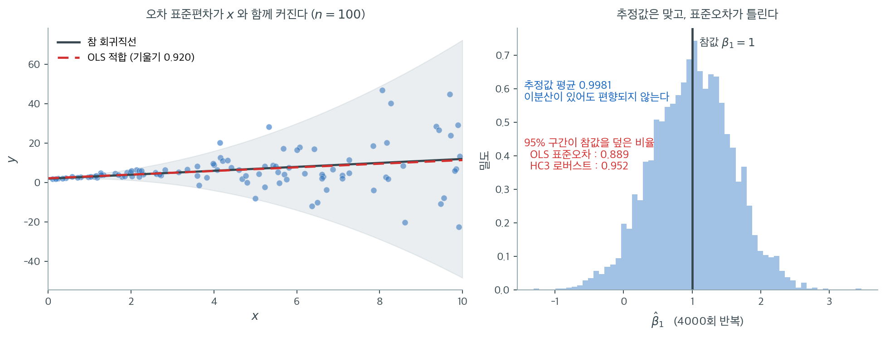

# 회귀와 분산분석에서의 응용


분산의 동일성 검정은 여러 통계 방법, 특히 회귀분석과 분산분석에서 결정적인 단계이다. 두 기법 모두 분산의 동질성(등분산성)에 대한 가정이 타당하고 신뢰할 만한 추론을 보장하는 근본적인 역할을 한다.

## 회귀에서의 분산 검정

회귀분석의 핵심 가정 가운데 하나가 **등분산성**이다. 잔차의 분산이 설명변수의 모든 수준에서 일정해야 한다. 이 가정이 위배되면 추론이 무효가 되어 잘못된 결론으로 이어질 수 있다.

!!! warning "이분산은 계수를 편향시키지 않는다"
    "이분산이 있으면 회귀계수 추정값이 편향된다"는 서술을 흔히 보는데 **틀렸다**. Gauss-Markov 정리의 불편성 부분은 등분산을 요구하지 않는다. $E[\varepsilon \mid X] = 0$이면 이분산이 있어도 OLS는 불편이고 일치성을 갖는다.

    이분산이 망가뜨리는 것은 **표준오차**이다. OLS 표준오차 공식 $s^2(\mathbf{X}'\mathbf{X})^{-1}$이 등분산을 가정하므로, 이분산 아래에서 이 값이 편향된다. 그 결과 $t$ 통계량, $p$값, 신뢰구간이 모두 틀린다.

    실무적 함의가 다르다. 계수가 편향된다면 결과를 폐기해야 하지만, 표준오차만 문제라면 **로버스트 표준오차로 고칠 수 있다.** 계수 추정값은 그대로 쓴다.

모의실험으로 이 주장을 확인해 보자. $y = 2 + x + \varepsilon$에서 오차의 표준편차를 $0.2 + 0.3x^2$으로 두어 $x$가 커질수록 산포가 급격히 커지게 했다. $n = 100$짜리 자료를 4000번 생성해 매번 OLS로 적합한다.



왼쪽이 자료 한 벌이다. 오른쪽으로 갈수록 점들이 나팔처럼 벌어지는 전형적인 이분산이다. 그런데 OLS 적합선(빨강 점선)은 참 회귀직선(검정)과 거의 겹친다. 분산이 들쭉날쭉해도 **최소제곱은 여전히 올바른 직선을 찾아낸다.**

오른쪽이 4000번의 기울기 추정값이다. 분포의 중심이 $0.9981$로 참값 1과 사실상 같다. $E[\varepsilon \mid X] = 0$만 성립하면 불편성은 이분산과 무관하게 유지되며, 이것이 가우스–마르코프 정리에서 등분산이 **효율성** 부분에만 쓰인다는 사실의 구체적 의미다.

문제는 그 아래 숫자다. **명목 95% 신뢰구간이 참값을 덮은 비율이 OLS 표준오차로는 $0.889$에 그친다.** 100번 중 11번은 참값이 구간 밖에 있다는 뜻이고, 그만큼 $p$값도 작게 나온다. 이분산 자료에서 "$p < 0.05$이므로 유의하다"는 결론이 실제보다 자주 나오는 이유가 이것이다.

HC3 로버스트 표준오차로 바꾸면 포함률이 $0.952$로 회복된다. **계수는 그대로 두고 표준오차 계산만 바꾸었을 뿐인데 추론이 정상으로 돌아온다.** 이분산을 발견했을 때 모형을 버리거나 변수를 변환할 필요가 없는 경우가 많다는 실무적 결론이 여기서 나온다. 다만 효율성은 여전히 손해이므로, 오차 구조를 안다면 가중최소제곱이 더 정밀한 추정값을 준다.

### 등분산성과 이분산

**등분산성:** 잔차의 분산이 독립변수의 모든 수준에서 일정하다.

$$
\text{Var}(\epsilon_i) = \sigma^2 \quad \text{(모든 } i \text{에 대해)}
$$

**이분산:** 잔차의 분산이 독립변수에 따라 달라진다.

$$
\text{Var}(\epsilon_i) = f(x_i)
$$

이분산은 회귀계수 추정의 비효율성과 잘못된 $p$값으로 이어져 가설검정에 영향을 준다. 따라서 회귀분석을 진행하기 전에 이분산을 검정하는 것이 중요하다.

### 등분산성 검정

등분산성을 확인하는 검정으로 **Breusch-Pagan 검정**과 **White 검정**이 있다. 이 검정들은 잔차와 설명변수의 관계를 조사한다.

### Breusch-Pagan 검정

Breusch-Pagan 검정은 잔차의 분산이 모형의 독립변수와 관련되어 있는지 검정하여 이분산을 탐지한다.

**가설:**

- $H_0$: 잔차가 등분산이다. 곧 분산이 일정하다: $\text{Var}(\epsilon_i) = \sigma^2$
- $H_1$: 잔차분산이 독립변수의 함수이다: $\text{Var}(\epsilon_i) = f(x_i)$

**Python 구현:**

<div class="exbox" markdown>

**보기 1.** <span class="diff easy" title="쉬움"></span> 회귀에서의 등분산 검정. $n = 10$짜리 자료에 `Y ~ X`를 적합하고 `het_breuschpagan` 으로 Breusch-Pagan 검정을 돌린다.

**(1)** 이 함수가 돌려주는 LM 통계량과 F 통계량이 **제곱잔차를 설명변수에 회귀시킨 보조회귀**의 $nR^2$과 $F$임을 밝히고, 두 수를 $R^2$ 하나로부터 손으로 조립해 함수의 값과 맞추시오. `robust=False`로 바뀌는 것은 무엇인가.

**(2)** 두 판본의 **실제 크기**를 등분산 자료에서 $n = 10, 50, 200$으로 재고, 어느 쪽이 표본을 키워 고쳐지고 어느 쪽이 고쳐지지 않는지 밝히시오. 또 $n = 10$에서 검정력이 얼마인지 재어 본문의 $p = 0.777$을 어떻게 읽어야 하는지 결론하시오.

</div>

??? success "풀이"

    **(1) 보조회귀 하나가 전부다.** 원래 회귀 $y_i = \beta_0 + \beta_1 x_i + \varepsilon_i$의 OLS 잔차를 $e_i$라 하자. 등분산이면 $E[\varepsilon_i^2]$이 $x_i$와 무관해야 하므로, 제곱잔차를 설명변수에 회귀시켜

    $$
    e_i^2 = \gamma_0 + \gamma_1 x_i + u_i
    $$

    의 기울기가 $0$인지 보면 된다. 이 **보조회귀**의 결정계수를 $R_{\text{aux}}^2$, 설명변수 개수를 $k$라 하면 코엔커(1981)의 **스튜던트화 BP 통계량**은

    $$
    \text{LM} = n R_{\text{aux}}^2 \;\xrightarrow{\;d\;}\; \chi^2_k \quad (H_0 \text{ 아래})
    $$

    이고, F 판본은 그 보조회귀 자체의 F 통계량

    $$
    F = \frac{R_{\text{aux}}^2/k}{(1-R_{\text{aux}}^2)/(n-k-1)} \;\sim\; F(k,\; n-k-1)
    $$

    이다. **둘 다 $R_{\text{aux}}^2$ 하나의 함수**이므로, $R_{\text{aux}}^2$만 알면 두 수를 손으로 적을 수 있다. 여기서는 $k = 1$, $n = 10$이다.

    `robust=False`로 바꾸면 **원래 Breusch-Pagan(1979)** 통계량이 나온다. 그쪽은 제곱잔차를 $\hat\sigma^2 = \frac1n\sum e_i^2$으로 나눈 $g_i = e_i^2/\hat\sigma^2$을 설명변수에 회귀시킨 뒤 설명제곱합의 절반

    $$
    \text{BP} = \tfrac12 \,\text{ESS}_g \;\xrightarrow{\;d\;}\; \chi^2_k
    $$

    을 쓴다. **$\chi^2_k$ 극한이 오차의 정규성에 기대고 있다는 것이 이 판본의 약점**이고, 코엔커 판본은 $\hat\sigma^2$ 대신 $g$의 실제 표본분산으로 눈금을 맞춰 그 의존을 없앤 것이다. 두 판본이 같은 자료에서 다른 수를 준다.

    **(2) 먼저 함수를 그대로 돌린다.**

    ```python
    import statsmodels.api as sm
    import statsmodels.formula.api as smf
    from statsmodels.stats.diagnostic import het_breuschpagan
    import pandas as pd

    data = pd.DataFrame({
        'X': [1, 2, 3, 4, 5, 6, 7, 8, 9, 10],
        'Y': [2, 4, 6, 8, 10, 9, 15, 16, 18, 20]
    })

    model = smf.ols('Y ~ X', data=data).fit()

    # 회귀에서 등분산성은 잔차의 퍼짐이 적합값에 따라 달라지지 않는다는 가정이다.
    # Breusch-Pagan 은 잔차의 제곱을 설명변수에 회귀해 그 관계를 찾는다.
    lm_stat, lm_p, f_stat, f_p = het_breuschpagan(model.resid, model.model.exog)

    print(f"Breusch-Pagan LM = {lm_stat:.4f}, p = {lm_p:.4f}")
    print(f"Breusch-Pagan F  = {f_stat:.4f}, p = {f_p:.4f}")
    ```

    출력:

    ```text
    Breusch-Pagan LM = 0.0803, p = 0.7769
    Breusch-Pagan F  = 0.0648, p = 0.8055
    ```

    **이제 (1)을 손으로 조립해 맞추고, 두 판본의 크기와 검정력을 잰다.**

    ```python
    import numpy as np
    import statsmodels.api as sm
    from scipy import stats

    # --- (1) 손으로 조립해 het_breuschpagan 과 맞춘다. 위 model 을 이어받는다. ---
    e = model.resid.values
    X = model.model.exog                       # [1, x]
    n, k = len(e), X.shape[1] - 1

    aux = sm.OLS(e ** 2, X).fit()              # 보조회귀: e^2 을 x 에 회귀
    R2 = aux.rsquared
    lm_sm, p_lm, f_sm, p_f = het_breuschpagan(model.resid, X)

    print(f"보조회귀 R^2  = {R2:.8f}")
    print(f"n R^2 (손)    = {n * R2:.8f}      LM  (statsmodels) = {lm_sm:.8f}")
    F_hand = (R2 / k) / ((1 - R2) / (n - k - 1))
    print(f"F     (손)    = {F_hand:.8f}      F   (statsmodels) = {f_sm:.8f}")
    print(f"p(chi2_{k})     = {stats.chi2.sf(n * R2, k):.6f}      p   (statsmodels) = {p_lm:.6f}")
    print(f"p(F({k},{n - k - 1}))     = {stats.f.sf(F_hand, k, n - k - 1):.6f}      p   (statsmodels) = {p_f:.6f}")

    # 정규성을 쓰는 원래 BP(1979) 는 robust=False 다. (1/2)*ESS of e^2/sigmahat^2
    sig2 = (e ** 2).mean()
    g = e ** 2 / sig2
    ess0 = ((sm.OLS(g, X).fit().fittedvalues - g.mean()) ** 2).sum()
    print(f"\n원래 BP = ESS/2 = {ess0 / 2:.8f}      robust=False  = "
          f"{het_breuschpagan(model.resid, X, robust=False)[0]:.8f}")


    # --- (2) 두 판본의 크기와 검정력을 모의실험으로 잰다 ---
    def bp_both(E, X):
        """E: (R,n) 잔차.  (코엔커 nR^2, 원래 BP) 를 한꺼번에."""
        R, n = E.shape
        P = X @ np.linalg.pinv(X)
        G = E ** 2
        Gc = G - G.mean(axis=1, keepdims=True)
        ess = ((Gc @ P.T) ** 2).sum(axis=1)     # 중심화한 g 의 사영 제곱합 = ESS
        tss = (Gc ** 2).sum(axis=1)
        return n * ess / tss, 0.5 * ess / G.mean(axis=1) ** 2


    def size_power(n, R, dist, slope, seed):
        rng = np.random.default_rng(seed)
        x = np.linspace(1, 10, n)
        X = np.column_stack([np.ones(n), x])
        if dist == "Normal":
            u = rng.normal(size=(R, n))
        elif dist == "t(3)":
            u = rng.standard_t(3, size=(R, n))
        else:                                    # 로그정규를 평균 0, 분산 1 로 표준화
            z = rng.lognormal(0, 1, size=(R, n))
            u = (z - np.exp(0.5)) / np.sqrt((np.e - 1) * np.e)
        y = 2 + x + u * (1 + slope * x)          # slope = 0 이면 등분산
        P = X @ np.linalg.pinv(X)
        lm, bp = bp_both(y - y @ P.T, X)
        return (stats.chi2.sf(lm, 1) < 0.05).mean(), (stats.chi2.sf(bp, 1) < 0.05).mean()


    print("\n등분산 자료에서의 실제 크기 (명목 0.05, 4만 회)")
    print(f"{'n':>5}  {'errors':<8}{'Koenker':>10}{'orig BP':>10}")
    for nn in (10, 50, 200):
        for d in ("Normal", "t(3)", "LogN"):
            a, b = size_power(nn, 40_000, d, 0.0, seed=1)
            print(f"{nn:>5}  {d:<8}{a:>10.4f}{b:>10.4f}")

    print("\n이분산 자료에서의 검정력 (정규오차, sd = 1 + 0.5x)")
    for nn in (10, 30, 100, 300):
        a, b = size_power(nn, 40_000, "Normal", 0.5, seed=2)
        print(f"  n = {nn:>3}:  코엔커 {a:.4f}   원래 BP {b:.4f}")
    ```

    출력:

    ```text
    보조회귀 R^2  = 0.00803084
    n R^2 (손)    = 0.08030838      LM  (statsmodels) = 0.08030838
    F     (손)    = 0.06476684      F   (statsmodels) = 0.06476684
    p(chi2_1)     = 0.776880      p   (statsmodels) = 0.776880
    p(F(1,8))     = 0.805534      p   (statsmodels) = 0.805534

    원래 BP = ESS/2 = 0.23674242      robust=False  = 0.23674242

    등분산 자료에서의 실제 크기 (명목 0.05, 4만 회)
        n  errors     Koenker   orig BP
       10  Normal      0.0580    0.0237
       10  t(3)        0.0663    0.0637
       10  LogN        0.1103    0.1262
       50  Normal      0.0507    0.0463
       50  t(3)        0.0428    0.2449
       50  LogN        0.0523    0.4062
      200  Normal      0.0502    0.0489
      200  t(3)        0.0409    0.3776
      200  LogN        0.0435    0.5475

    이분산 자료에서의 검정력 (정규오차, sd = 1 + 0.5x)
      n =  10:  코엔커 0.1656   원래 BP 0.1189
      n =  30:  코엔커 0.5497   원래 BP 0.6179
      n = 100:  코엔커 0.9913   원래 BP 0.9958
      n = 300:  코엔커 1.0000   원래 BP 1.0000
    ```

    **(1)의 조립이 여덟 자리까지 맞는다.** 보조회귀의 $R_{\text{aux}}^2 = 0.00803084$ 하나에서 $n R^2 = 0.08030838$과 $F = 0.06476684$가 나오고, 둘 다 `het_breuschpagan` 의 값과 소수 여덟째 자리까지 같다. $p$값도 $\chi^2_1$과 $F(1,8)$에서 각각 $0.776880$과 $0.805534$로 맞는다. **같은 $R^2$을 두 참조분포에 들이댄 것이 LM 과 F 판본의 차이 전부**이고, 그래서 $n = 10$처럼 작은 표본에서 두 $p$값이 $0.78$과 $0.81$로 갈린다. $\chi^2$ 쪽은 $n \to \infty$의 극한이므로 작은 표본에서는 F 쪽이 낫다.

    원래 BP 도 맞는다. 손으로 센 $\tfrac12 \text{ESS}_g = 0.23674242$가 `robust=False` 의 값과 같다. **같은 자료에서 $0.0803$과 $0.2367$, 곧 세 배 차이**다. 어느 판본을 돌렸는지 모르면 통계량을 보고할 수도 없다.

    **(2) 표가 이 장의 주제를 그대로 되풀이한다.** 등분산 자료의 실제 크기를 보라.

    - **코엔커 판본은 $n$을 키우면 고쳐진다.** $n = 10$에서 $0.058$–$0.110$으로 흐트러져 있다가 $n = 50$에서 $0.043$–$0.052$, $n = 200$에서 $0.041$–$0.050$으로 세 오차분포 모두 명목값에 모인다.
    - **원래 BP 는 $n$을 키우면 더 나빠진다.** $t(3)$에서 $0.064 \to 0.245 \to 0.378$, 로그정규에서 $0.126 \to 0.406 \to 0.548$이다. 표본을 스무 배 늘리는 동안 거짓 양성률이 다섯 배, 네 배로 올라갔다.

    **이것이 15장이 되풀이해 온 바로 그 실패다.** $F$ 검정과 Bartlett 검정도 같은 일을 하며, 5.3절이 그 극한 오류율이 모집단 첨도만의 함수이고 표본을 키워도 낫지 않음을 유도해 두었다. 분산에 관한 통계량은 네 번째 적률에 기대므로 중심극한정리의 보호를 받지 못한다. 원래 BP 가 정규성 아래에서만 $\chi^2$인 것도 같은 이유이고, 코엔커의 눈금 바꾸기가 그 의존을 끊어 준 것이다. 그러므로 **`het_breuschpagan` 의 기본값 `robust=True` 를 건드리지 말라.**

    **$n = 10$에서는 어느 판본도 쓸 수 없다.** 마지막 표가 그 까닭이다. 오차 표준편차가 $x = 1$에서 $1.5$, $x = 10$에서 $6$으로 **네 배** 벌어지는 뚜렷한 이분산인데도 $n = 10$에서 코엔커의 검정력이 $0.1656$이다. 여섯 번에 한 번만 잡아낸다. 같은 이분산을 $n = 100$에서는 $0.9913$으로 거의 늘 잡는다.

    그러므로 본문 자료의 $p = 0.777$은 **"등분산이다"는 증거가 아니다.** 등분산이어도 $p$가 크고, 네 배짜리 이분산이 있어도 다섯 번 중 네 번은 $p$가 크다. 두 경우를 $n = 10$으로는 구별할 수 없다. 게다가 $n = 10$에서 코엔커의 실제 크기가 정규오차에서조차 $0.058$, 로그정규에서 $0.110$이라 **검정 자체도 아직 눈금이 맞지 않는다.** 이 자료에 대해 할 수 있는 정직한 말은 "판정할 수 없다" 하나뿐이다.

**해석:**

- $p$값이 0.05보다 작으면 귀무가설을 기각하고 이분산이 존재한다고 결론짓는다.
- $p$값이 0.05보다 크면 귀무가설을 기각하지 못하고 잔차가 등분산과 일관된다고 본다.

여기서는 $p = 0.777$로 기각하지 못한다. 다만 $n = 10$으로 매우 작아 검정력이 사실상 없으므로, **"등분산성이 확인되었다"가 아니라 "이 자료로는 판정할 수 없다"**가 옳은 결론이다.

### 이분산의 해결책

이분산이 탐지되면 다음 해결책이 가능하다.

**1. 종속변수의 변환:** 로그나 제곱근 변환이 분산을 안정시킬 수 있다.

$$
Y' = \log(Y) \quad \text{또는} \quad Y' = \sqrt{Y}
$$

**2. 가중최소제곱(WLS):** 추정된 분산에 기반해 관측값에 가중치를 부여하여, 분산이 작은 관측값에 더 큰 비중을 준다.

$$
\hat{\beta} = (X^T W X)^{-1} X^T W Y
$$

**3. 로버스트 표준오차:** 회귀계수를 바꾸지 않으면서 이분산을 반영하는 로버스트 표준오차를 쓴다. 셋 중 가장 간단하고 가장 널리 쓰인다.

---

## 분산분석에서의 분산 검정

분산분석은 셋 이상 집단의 평균을 비교하여 유의한 차이가 있는지 판정한다. 핵심 가정은 집단들의 분산이 같다는 것(**분산의 동질성**)이다. 이 가정이 위배되면 분산분석 결과가 오도할 수 있다.

### 분산분석에서의 분산 동질성

**가설:**

- $H_0$: 집단들의 분산이 같다: $\sigma_1^2 = \sigma_2^2 = \dots = \sigma_k^2$
- $H_1$: 적어도 한 집단의 분산이 다르다: 적어도 한 쌍의 $i \neq j$에 대해 $\sigma_i^2 \neq \sigma_j^2$

### 분산분석에서의 Levene 검정

Levene 검정은 분산분석의 등분산 가정을 확인하는 데 자주 쓰인다. 분산이 같지 않으면(분산의 이질성) Welch 분산분석 같은 대안을 써야 한다.

**Python 구현:**

<div class="exbox" markdown>

**보기 2.** <span class="diff easy" title="쉬움"></span> 평균이 달라도 분산이 같으면. 세 집단의 평균은 $14, 26, 36$으로 크게 다르지만 표본분산은 똑같다.

**(1)** Levene 통계량 $W$가 **집단별 위치이동에 불변**임을 보이시오. 곧 각 집단에 제멋대로의 상수 $a_i$를 더해도 $W$가 변하지 않는다. 어느 중심을 쓰든 성립하는가. 또 `scipy.stats.levene`을 `center` 없이 부르면 실제로 돌아가는 검정은 무엇인가.

**(2)** 불변성을 수치로 확인하고, 이 보기 자료가 불변성보다 **더 강한** 뜻에서 퇴화되어 있음을 밝히시오. 그리고 집단별로 중심을 빼는 대신 **전체 중앙값 하나로** 빼면 어떤 일이 벌어지는지 보이시오.

</div>

??? success "풀이"

    **(1) 중심 함수가 위치이동에 공변하면 그만이다.** 집단 $i$의 자료를 $y_{i1}, \ldots, y_{in_i}$, 중심 함수를 $c(\cdot)$이라 하면 Levene 검정은 변환값

    $$
    z_{ij} = \lvert y_{ij} - c(y_i) \rvert
    $$

    에 보통의 일원분산분석을 돌려 $W$를 얻는다. **$W$는 $z$만의 함수다.** 그러므로 $z$가 변하지 않으면 $W$도 변하지 않는다.

    이제 집단 $i$에 상수 $a_i$를 더한다. 중심 함수가 **위치이동에 공변**, 곧

    $$
    c(y_i + a_i \mathbf{1}) = c(y_i) + a_i
    $$

    를 만족하면

    $$
    \lvert (y_{ij} + a_i) - c(y_i + a_i\mathbf{1}) \rvert
    = \lvert y_{ij} + a_i - c(y_i) - a_i \rvert
    = \lvert y_{ij} - c(y_i) \rvert
    = z_{ij}
    $$

    로 $z$가 **그대로**다. 따라서 $W$도 그대로다. $\square$

    세 중심 모두 공변한다.

    - **평균**은 선형이므로 $\overline{y_i + a_i} = \bar y_i + a_i$.
    - **중앙값**은 순서통계량이 통째로 $a_i$만큼 밀리므로 중앙값도 $a_i$만큼 밀린다.
    - **절사평균**도 순서가 보존되어 잘라낼 꼬리가 바뀌지 않으므로 $a_i$만큼 밀린다.

    **그러므로 Levene 검정은 집단평균의 차이를 아예 보지 않는다.** 중심을 빼는 단계가 위치 정보를 전부 걷어 내기 때문이고, 이것이 등분산 검정이 평균 검정과 섞이지 않는 이유다.

    **`center` 를 주지 않으면 Brown-Forsythe 가 돌아간다.** `scipy.stats.levene` 의 `center` 기본값은 `'median'` 이다. 그러므로 위 코드의 `levene(group1, group2, group3)` 은 Levene(1960)의 원래 검정이 아니라 **중앙값 중심의 Brown-Forsythe 변형**이다. 두 선택은 치우친 자료에서 꽤 다른 답을 주므로(15.5절), 어느 것을 돌렸는지 늘 밝혀 두어야 한다. 이 보기 자료는 대칭이라 둘이 일치한다.

    **(2) 확인한다.**

    ```python
    import numpy as np
    from scipy.stats import levene

    # 세 집단의 평균은 크게 다르지만 분산은 똑같다. 등분산 검정이 평균 차이에
    # 휘둘리지 않는다는 것을 보이는 자료다.
    group1 = [10, 12, 14, 16, 18]
    group2 = [22, 24, 26, 28, 30]
    group3 = [32, 34, 36, 38, 40]

    print("variances:", [np.var(g, ddof=1) for g in (group1, group2, group3)])

    # Levene 은 각 값에서 제 집단의 중심을 뺀 절대편차에 분산분석을 돌린다.
    # 중심을 빼는 단계가 평균 차이를 걷어 내므로, 평균이 아무리 달라도
    # 분산만 같으면 기각되지 않는다.
    test_stat, p_value = levene(group1, group2, group3)
    print(f"Levene's test statistic: {test_stat}")
    print(f"P-value: {p_value}")
    ```

    출력:

    ```text
    variances: [10.0, 10.0, 10.0]
    Levene's test statistic: 0.0
    P-value: 1.0
    ```

    이제 (1)의 세 주장을 차례로 확인한다.

    ```python
    import inspect
    import numpy as np
    from scipy.stats import levene, f_oneway

    # (0) 기본값 확인: 아무 인자도 주지 않은 위의 levene(...) 은 무엇이었나.
    print("levene 의 center 기본값 =", inspect.signature(levene).parameters["center"].default)

    groups = [np.array([10, 12, 14, 16, 18], float),
              np.array([22, 24, 26, 28, 30], float),
              np.array([32, 34, 36, 38, 40], float)]

    # (1) 집단별 중심을 뺀 절대편차 Z. 세 집단이 완전히 같은 다중집합이다.
    for g in groups:
        print(f"  {g.astype(int)}  ->  Z = {np.abs(g - np.median(g)).astype(int)}")

    for c in ("mean", "median", "trimmed"):
        kw = {"proportiontocut": 0.1} if c == "trimmed" else {}
        r = levene(*groups, center=c, **kw)
        print(f"  center={c:>8}:  W = {r.statistic:.4f},  p = {r.pvalue:.4f}")

    # 평균은 얼마나 다른가. 원자료에 분산분석을 돌려 본다.
    r0 = f_oneway(*groups)
    print(f"\n집단평균 = {[g.mean() for g in groups]}")
    print(f"원자료에 분산분석(평균 비교):  F = {r0.statistic:.4f},  p = {r0.pvalue:.3e}")

    # (2) 위치이동 불변성. 퇴화되지 않은 자료로 보여야 "0 = 0" 이 아님이 분명해진다.
    nd = [np.array([10, 12, 14, 16, 18], float),    # 공차 2, 표본분산 10.0
          np.array([22, 25, 28, 31, 34], float),    # 공차 3, 표본분산 22.5
          np.array([32, 37, 42, 47, 52], float)]    # 공차 5, 표본분산 62.5
    base = levene(*nd, center="median")
    print(f"\n이동 전:  W = {base.statistic:.10f},  p = {base.pvalue:.10f}")
    rng = np.random.default_rng(0)
    worst = 0.0
    for _ in range(1000):
        shifted = [g + s for g, s in zip(nd, rng.normal(0, 1e4, 3))]
        worst = max(worst, abs(levene(*shifted, center="median").statistic - base.statistic))
    print(f"임의 이동 1000 번 뒤 통계량의 최대 변화 = {worst:.3e}")

    # (3) 집단별로 중심을 빼지 않으면(전체 중앙값 하나로 빼면) 어떻게 되는가.
    allv = np.concatenate(groups)
    Zg = [np.abs(g - np.median(allv)) for g in groups]
    print(f"\n전체 중앙값 = {np.median(allv):.1f}")
    for z in Zg:
        print(f"  Z = {z.astype(int)}")
    r = f_oneway(*Zg)
    print(f"그 Z 에 분산분석:  F = {r.statistic:.4f},  p = {r.pvalue:.6f}")
    ```

    출력:

    ```text
    levene 의 center 기본값 = median
      [10 12 14 16 18]  ->  Z = [4 2 0 2 4]
      [22 24 26 28 30]  ->  Z = [4 2 0 2 4]
      [32 34 36 38 40]  ->  Z = [4 2 0 2 4]
      center=    mean:  W = 0.0000,  p = 1.0000
      center=  median:  W = 0.0000,  p = 1.0000
      center= trimmed:  W = 0.0000,  p = 1.0000

    집단평균 = [14.0, 26.0, 36.0]
    원자료에 분산분석(평균 비교):  F = 60.6667,  p = 5.314e-07

    이동 전:  W = 1.8947368421,  p = 0.1926999286
    임의 이동 1000 번 뒤 통계량의 최대 변화 = 1.517e-13

    전체 중앙값 = 26.0
      Z = [16 14 12 10  8]
      Z = [4 2 0 2 4]
      Z = [ 6  8 10 12 14]
    그 Z 에 분산분석:  F = 16.8772,  p = 0.000325
    ```

    **기본값이 `median` 이다.** 그러므로 위에서 돌아간 것은 Brown-Forsythe 검정이다. 다만 이 자료는 세 중심이 모두 같은 답($W = 0$)을 주므로 구별되지 않는다.

    **불변성이 수치로 확인된다.** 퇴화되지 않은 자료(공차 $2, 3, 5$, 표본분산 $10.0,\ 22.5,\ 62.5$)에서 $W = 1.8947368421$이고, 집단마다 표준편차 $10^4$의 정규난수를 더해 **1000번** 흔들어도 통계량의 최대 변화가 $1.5\times10^{-13}$이다. 이것은 $10^4$을 더했다 뺀 데서 생긴 부동소수점 반올림이며, 수학적으로는 정확히 $0$이어야 하는 양이다. **집단평균을 제멋대로 옮겨도 $W$가 꿈쩍하지 않는다.**

    그 대비가 선명하다. 같은 자료의 집단평균이 $14,\ 26,\ 36$으로 크게 다르고, 원자료에 분산분석을 돌리면 $F = 60.67$, $p = 5.3\times10^{-7}$으로 평균 차이를 압도적으로 기각한다. **평균에 대해서는 이렇게 강한 증거가 있는데 분산에 대해서는 $W = 0$, $p = 1$이다.** 두 질문이 완전히 분리되어 있다.

    **이 자료는 불변성보다 강한 뜻에서 퇴화되어 있다.** 불변성은 "이동해도 $W$가 변하지 않는다"는 말일 뿐이고, 이동하지 않은 자료에서 $W$가 $0$이어야 할 이유는 없다. 위의 퇴화되지 않은 자료가 $W = 1.89$를 주는 것이 그 증거다. 여기서 $W = 0$이 나오는 까닭은 세 집단의 $Z$가 모두 $\{4,2,0,2,4\}$로 **같은 다중집합**이라 집단간 제곱합이 정확히 $0$이기 때문이다. 아래 상자와 연습문제 2 가 그 까닭을 등차수열의 분산 공식으로 적어 둔다.

    **집단별로 빼는 것이 핵심이다.** 마지막 묶음이 그것을 보인다. 집단 중심 대신 **전체 중앙값 $26$ 하나**로 빼면 $Z$가 $\{16,14,12,10,8\}$, $\{4,2,0,2,4\}$, $\{6,8,10,12,14\}$로 집단마다 전혀 달라지고, 그 $Z$에 분산분석을 돌리면 $F = 16.88$, $p = 0.000325$로 **"분산이 다르다"고 기각한다.** 분산은 세 집단이 정확히 같은데도 그렇다. 새어 든 것은 분산 차이가 아니라 **평균 차이**다. (1)의 증명에서 $c(y_i)$가 집단마다 따로 계산되어야 $a_i$가 약분된 것이고, 상수 하나를 쓰면 $\lvert y_{ij} + a_i - c_0 \rvert$에서 $a_i$가 남는다. **Levene 검정에서 집단별 중심화는 선택이 아니라 검정의 정의 그 자체다.**

!!! note "이 보기 자료는 퇴화되어 있다"
    세 집단이 모두 등차수열 $\{a, a+2, a+4, a+6, a+8\}$의 형태이므로 **표본분산이 정확히 10으로 동일**하다. 중앙값으로부터의 절대편차도 세 집단 모두 $\{4, 2, 0, 2, 4\}$로 같다.

    그래서 Levene 통계량이 **정확히 0**, $p$값이 **정확히 1**이 된다. 검정을 시연하는 자료로는 적절하지 않다. 분산 차이가 있는 자료를 쓰려면 예컨대 `group3 = [26, 31, 36, 41, 46]`처럼 간격을 바꾸면 된다.

**해석:**

- $p$값이 0.05보다 작으면 귀무가설을 기각하고 분산이 같지 않다고 결론짓는다.
- $p$값이 0.05보다 크면 귀무가설을 기각하지 못한다. 이는 "분산이 같다"의 증명이 아니라 "다르다는 증거가 없다"는 뜻이다.

### 분산 이질성의 해결책

Levene 검정이 이분산을 시사하면 집단 간 등분산을 가정하지 않는 **Welch 분산분석**을 적용할 수 있다.

!!! danger "`anova_lm(..., robust='hc3')`은 Welch 분산분석이 아니다"
    다음 코드가 Welch 분산분석으로 소개되는 경우가 있으나 **틀렸다**.

    ```python
    import numpy as np
    import pandas as pd
    import statsmodels.api as sm

    # 집단마다 분산이 다른 자료 (표준편차 1, 2, 4)
    rng = np.random.default_rng(0)
    data = pd.DataFrame({
        "Score": np.concatenate([rng.normal(10, 1, 20),
                                 rng.normal(12, 2, 20),
                                 rng.normal(14, 4, 20)]),
        "Group": np.repeat(["A", "B", "C"], 20),
    })

    # Welch 분산분석이 아니다 — 등분산을 가정한 보통의 분산분석이다
    model = sm.formula.ols('Score ~ Group', data=data).fit()
    print(sm.stats.anova_lm(model, typ=2, robust='hc3'))
    ```

    출력:

    ```
                  sum_sq    df          F        PR(>F)
    Group     424.427668   2.0  30.736759  8.794817e-10
    Residual  393.541447  57.0        NaN           NaN
    ```

    표가 나오기는 하지만 이것은 Welch 분산분석이 아니다. 분모 자유도가 $57 = N - k$ 그대로이고, Welch라면 등분산이 깨진 만큼 자유도가 줄어들어야 한다.

    이것은 OLS 적합에 이분산 일치 공분산 행렬(HC3)을 적용한 **Wald 형태의 분산분석표**이다. Welch 분산분석과 다음 점에서 다르다.

    | | Welch 분산분석 | `anova_lm(robust='hc3')` |
    |---|---|---|
    | 집단평균의 가중 | 정밀도 $n_i/s_i^2$로 가중 | 가중하지 않음(OLS) |
    | 분모 자유도 | Welch-Satterthwaite 근사 | $N - k$ 그대로 |
    | 소표본 성질 | 잘 연구되어 있음 | 근사가 거칠 수 있음 |

    Welch 분산분석은 SciPy에 없으므로 직접 구현하거나(15.7절 [분산분석 사전검정](anova_pretest.md) 페이지 참조) `pingouin.welch_anova`를 쓴다.

**Welch 분산분석의 Python 구현:**

<div class="exbox" markdown>

**보기 3.** <span class="diff easy" title="쉬움"></span> Welch 분산분석. 집단 셋, 집단당 $n_i = 3$인 자료 $\{10,12,14\}$, $\{22,24,26\}$, $\{32,34,36\}$에 Welch 와 고전 분산분석을 모두 돌린다.

**(1)** 세 표본분산을 구하고, Welch 의 $A$, $\Lambda$, $F_W$, 분모 자유도 $\nu_2$를 **분수로 정확히** 계산하시오. 표본분산이 모두 같을 때 $A$가 고전적 $F$와 일치하는 까닭도 밝히시오.

**(2)** $d_1 = 2$인 $F$ 분포의 꼬리확률이 닫힌 꼴임을 보이고, 그것으로 두 $p$값을 **분수로** 적으시오. 두 $p$값이 갈리는 몫을 **통계량이 작아진 탓**과 **자유도가 줄어든 탓**으로 나누면 어느 쪽이 주범인가.

</div>

??? success "풀이"

    **(1) 손으로 끝까지 간다.** 세 집단이 모두 $\{a, a+2, a+4\}$ 꼴이므로 평균이 $a+2$, 편차가 $-2, 0, 2$, 제곱합이 $8$이고

    $$
    s_i^2 = \frac{8}{3-1} = 4 \qquad (i = 1,2,3)
    $$

    으로 **세 표본분산이 정확히 같다.** 집단평균은 $12, 24, 34$다.

    가중치는 $w_i = n_i/s_i^2 = 3/4$로 모두 같고 $\sum_j w_j = 9/4$이므로, 가중평균이 단순평균으로 떨어진다.

    $$
    \bar X_w = \frac{12 + 24 + 34}{3} = \frac{70}{3}
    $$

    이제 $A$를 계산한다. $12 - \frac{70}{3} = -\frac{34}{3}$, $24 - \frac{70}{3} = \frac{2}{3}$, $34 - \frac{70}{3} = \frac{32}{3}$이므로

    $$
    A = \frac{1}{k-1}\sum_i w_i(\bar X_i - \bar X_w)^2
    = \frac{1}{2}\cdot\frac{3}{4}\cdot\frac{34^2 + 2^2 + 32^2}{9}
    = \frac{3}{8}\cdot\frac{2184}{9}
    = 91
    $$

    이다. $\Lambda$는 $w_i/\sum_j w_j = 1/3$이 세 번 같으므로

    $$
    \Lambda = \frac{1}{k^2-1}\sum_i \frac{1}{n_i-1}\left(1 - \frac{w_i}{\sum_j w_j}\right)^2
    = \frac{1}{8}\cdot 3 \cdot \frac{1}{2}\left(\frac23\right)^2
    = \frac{1}{8}\cdot\frac{2}{3} = \frac{1}{12}
    $$

    이고, 따라서

    $$
    F_W = \frac{A}{1 + 2(k-2)\Lambda} = \frac{91}{1 + \frac16} = \frac{91 \cdot 6}{7} = 78,
    \qquad
    \nu_2 = \frac{1}{3\Lambda} = 4
    $$

    이다. **네 수가 모두 정수 또는 깔끔한 분수로 떨어진다.** 균형자료에서 표본분산이 모두 같을 때의 일반형

    $$
    \Lambda = \frac{k-1}{k(k+1)(n-1)}
    $$

    에 $k = 3$, $n = 3$을 넣어도 $\frac{2}{3 \cdot 4 \cdot 2} = \frac{1}{12}$로 같다(15.7절 [분산분석 사전검정](anova_pretest.md) 연습문제 3).

    **$A$가 고전적 $F$와 같아지는 까닭.** 모든 $s_i^2 = s^2$, 모든 $n_i = n$이면 $w_i = n/s^2$으로 같아져 $\bar X_w$가 전체평균 $\bar X$가 되고

    $$
    A = \frac{1}{k-1}\cdot\frac{n}{s^2}\sum_i (\bar X_i - \bar X)^2 = \frac{\text{MSB}}{s^2}
    $$

    이다. 한편 균형자료의 합동분산은 집단분산의 단순평균이므로 $\text{MSE} = s^2$이다. 그러므로

    $$
    A = \frac{\text{MSB}}{\text{MSE}} = F_{\text{고전}}
    $$

    이고, 실제로 $A = 91$이 고전적 $F = 91$과 같다. **그러면 두 통계량의 차이는 보정항 하나로 줄어든다.**

    $$
    \frac{F_W}{F_{\text{고전}}} = \frac{1}{1 + 2(k-2)\Lambda} = \frac{6}{7}
    $$

    $91 \times \frac67 = 78$이다.

    **(2) $d_1 = 2$이면 꼬리확률이 닫힌 꼴이다.** $F = \dfrac{U/2}{V/\nu}$에서 $U \sim \chi^2_2$, $V \sim \chi^2_\nu$가 독립이라 하자. $\chi^2_2$는 평균 $2$인 지수분포이므로 $U/2 \sim \text{Exp}(1)$이고, $E \sim \text{Exp}(1)$에 대해 $P(E > t) = e^{-t}$다. $V$로 조건을 걸면

    $$
    P(F > x) = P\!\left(\frac U2 > \frac{xV}{\nu}\right) = E\!\left[e^{-xV/\nu}\right] = M_V\!\left(-\frac x\nu\right)
    $$

    이고, $\chi^2_\nu$의 적률생성함수가 $M_V(t) = (1-2t)^{-\nu/2}$이므로

    $$
    P(F > x) = \left(1 + \frac{2x}{\nu}\right)^{-\nu/2}
    $$

    이다. 이제 두 $p$값을 분수로 적을 수 있다.

    $$
    p_W = \left(1 + \frac{2 \cdot 78}{4}\right)^{-2} = 40^{-2} = \frac{1}{1600} = 0.000625
    $$

    $$
    p_{\text{고전}} = \left(1 + \frac{2 \cdot 91}{6}\right)^{-3} = \left(\frac{94}{3}\right)^{-3} = \frac{27}{830584} = 3.250725\times10^{-5}
    $$

    **두 $p$값의 비가 $19.2$배다.** 그 몫을 쪼개려면 중간 두 경우를 더 재면 된다. 같은 닫힌 꼴로

    $$
    p(F=78,\ \nu=6) = 27^{-3} = \frac{1}{19683}, \qquad
    p(F=91,\ \nu=4) = \left(\frac{93}{2}\right)^{-2} = \frac{4}{8649}
    $$

    이다. 고전값을 $1$로 보면 통계량만 $91 \to 78$로 바꾼 쪽이 $1.563$배, 자유도만 $6 \to 4$로 줄인 쪽이 $14.227$배다. **주범은 자유도다.** 보정항 $6/7$이 통계량을 깎는 몫은 작고, $\nu_2$가 $6$에서 $4$로 내려앉는 몫이 압도적이다.

    **확인한다.**

    ```python
    import numpy as np
    from scipy import stats

    def welch_anova(groups):
        """Welch 의 일원배치 분산분석. 등분산을 가정하지 않는다."""
        k = len(groups)
        n = np.array([len(g) for g in groups])
        m = np.array([np.mean(g) for g in groups])
        v = np.array([np.var(g, ddof=1) for g in groups])
        w = n / v
        m_w = np.sum(w * m) / np.sum(w)
        A = np.sum(w * (m - m_w) ** 2) / (k - 1)
        lam = np.sum((1 - w / np.sum(w)) ** 2 / (n - 1)) / (k ** 2 - 1)
        F = A / (1 + 2 * (k - 2) * lam)
        df2 = 1 / (3 * lam)
        return F, k - 1, df2, stats.f.sf(F, k - 1, df2)

    groups = [[10, 12, 14], [22, 24, 26], [32, 34, 36]]
    F, df1, df2, p = welch_anova(groups)
    print(f"Welch ANOVA: F = {F:.4f}, df = ({df1}, {df2:.2f}), p = {p:.6f}")

    # 고전적 분산분석과 견준다. 분산이 크게 다르면 두 p-값이 갈린다.
    print(f"Classical ANOVA: {stats.f_oneway(*groups)}")
    ```

    출력:

    ```
    Welch ANOVA: F = 78.0000, df = (2, 4.00), p = 0.000625
    Classical ANOVA: F_onewayResult(statistic=91.0, pvalue=3.2507247912312294e-05)
    ```

    함수가 $F = 78.0000$, $\nu_2 = 4.00$, $p = 0.000625$를 주고 (1)·(2)의 손계산과 그대로 맞는다. 분수까지 맞춰 보려면 `fractions` 로 같은 길을 따라가면 된다.

    ```python
    from fractions import Fraction as Fr

    import numpy as np
    from scipy import stats

    # --- (1) 분수로 정확히 따라가 본다. 위의 welch_anova 를 그대로 쓴다. ---
    g = [[10, 12, 14], [22, 24, 26], [32, 34, 36]]
    k, n = len(g), len(g[0])
    m = [Fr(sum(x), len(x)) for x in g]
    v = [Fr(sum((Fr(t) - mi) ** 2 for t in x), len(x) - 1) for x, mi in zip(g, m)]
    print(f"집단평균   = {[str(x) for x in m]}")
    print(f"표본분산   = {[str(x) for x in v]}")

    w = [Fr(n, 1) / vi for vi in v]
    sw = sum(w)
    mw = sum(wi * mi for wi, mi in zip(w, m)) / sw
    A = sum(wi * (mi - mw) ** 2 for wi, mi in zip(w, m)) / (k - 1)
    lam = sum((1 - wi / sw) ** 2 / Fr(n - 1) for wi in w) / (k ** 2 - 1)
    F_W = A / (1 + 2 * (k - 2) * lam)
    print(f"w_i = {[str(x) for x in w]},  sum w = {sw},  가중평균 = {mw}")
    print(f"A = {A},   Lambda = {lam},   F_W = {F_W},   nu2 = {1 / (3 * lam)}")
    print(f"균형·등분산일 때의 Lambda 공식 (k-1)/(k(k+1)(n-1)) = {Fr(k - 1, k * (k + 1) * (n - 1))}")
    print(f"F_W / F_classical = 1/(1+2(k-2)Lambda) = {1 / (1 + 2 * (k - 2) * lam)}")

    # --- (2) d1 = 2 이면 꼬리확률이 닫힌 꼴이다:  sf(x) = (1 + 2x/nu)^(-nu/2) ---
    def f2_sf(x, nu):
        return Fr(1) / (1 + Fr(2) * Fr(x) / Fr(nu)) ** Fr(nu, 2)

    print()
    for FF, d2, name in [(91, 6, "고전     "), (78, 6, "통계량만 "),
                         (91, 4, "자유도만 "), (78, 4, "Welch    ")]:
        exact = f2_sf(FF, d2)
        print(f"{name} F={FF}, df=(2,{d2}):  p = {str(exact):>10} = {float(exact):.6e}"
              f"   scipy {stats.f.sf(FF, 2, d2):.6e}")

    base = float(f2_sf(91, 6))
    print(f"\n고전 대비 배율:  통계량만 {float(f2_sf(78, 6)) / base:.3f} 배,"
          f"  자유도만 {float(f2_sf(91, 4)) / base:.3f} 배,"
          f"  둘 다 {float(f2_sf(78, 4)) / base:.3f} 배")
    ```

    출력:

    ```text
    집단평균   = ['12', '24', '34']
    표본분산   = ['4', '4', '4']
    w_i = ['3/4', '3/4', '3/4'],  sum w = 9/4,  가중평균 = 70/3
    A = 91,   Lambda = 1/12,   F_W = 78,   nu2 = 4
    균형·등분산일 때의 Lambda 공식 (k-1)/(k(k+1)(n-1)) = 1/12
    F_W / F_classical = 1/(1+2(k-2)Lambda) = 6/7

    고전      F=91, df=(2,6):  p =  27/830584 = 3.250725e-05   scipy 3.250725e-05
    통계량만  F=78, df=(2,6):  p =    1/19683 = 5.080526e-05   scipy 5.080526e-05
    자유도만  F=91, df=(2,4):  p =     4/8649 = 4.624812e-04   scipy 4.624812e-04
    Welch     F=78, df=(2,4):  p =     1/1600 = 6.250000e-04   scipy 6.250000e-04

    고전 대비 배율:  통계량만 1.563 배,  자유도만 14.227 배,  둘 다 19.226 배
    ```

    **손계산이 한 자리도 어긋나지 않는다.** $A = 91$, $\Lambda = 1/12$, $F_W = 78$, $\nu_2 = 4$가 모두 분수로 정확히 떨어지고, 균형·등분산일 때의 일반 공식 $(k-1)/(k(k+1)(n-1))$도 $1/12$을 준다. 보정비는 정확히 $6/7$이다.

    **네 $p$값 모두 닫힌 꼴이다.** $d_1 = 2$ 덕분에 $27/830584$, $1/19683$, $4/8649$, $1/1600$으로 적히고 네 값이 `scipy` 와 여섯 자리까지 같다. $\nu/2$가 정수가 되는 $\nu = 4, 6$이어서 지수가 정수 거듭제곱으로 떨어진 것이다.

    **배율의 분해가 (2)의 답을 준다.** 고전 $p$를 $1$로 보면 통계량만 $91 \to 78$로 바꾼 쪽이 $1.563$배, 자유도만 $6 \to 4$로 줄인 쪽이 $14.227$배, 둘 다 하면 $19.226$배다. **자유도가 주범이고 통계량의 몫은 작다.** 두 효과가 곱으로 분해되지는 않지만($1.563 \times 14.227 = 22.2 \neq 19.2$) 어느 쪽이 크냐는 분명하다.

    이것이 "Welch 가 등분산 아래에서 잃는 것"의 정체다. **통계량을 $6/7$로 깎는 것은 사소하고, 분모 자유도를 $N - k = 6$에서 $\nu_2 = 4$로 내려놓는 것이 값을 치른다.** $p$값이 $3.3\times10^{-5}$에서 $6.3\times10^{-4}$로 올라가 **19 배**가 되었다. 다만 두 값 모두 어떤 관례적 수준에서도 기각하므로 **이 자료의 결론은 바뀌지 않는다.**

    **$n_i = 3$이기 때문에 대가가 이렇게 크다.** $\nu_2 = 1/(3\Lambda)$에 균형·등분산 공식을 넣으면

    $$
    \nu_2 = \frac{k(k+1)(n-1)}{3(k-1)}
    $$

    이고 $n$에 비례하므로, 집단당 관측값을 늘리면 $\nu_2$가 $N - k = k(n-1)$에 비해 덜 뒤처진다. $k = 3$이면 $\nu_2/(N-k) = (k+1)/(3(k-1)) = 2/3$으로 비율 자체는 $n$과 무관하지만, $F$ 분포는 분모 자유도가 $30$을 넘으면 거의 변하지 않으므로 **절대적인 대가가 사라진다.** 15.7절 [분산분석 사전검정](anova_pretest.md) 연습문제 2 가 재어 둔 검정력 손실 $2$–$3$퍼센트포인트가 그 크기다.

    거꾸로 말하면 **$n_i = 3$에서는 $\nu_2 = 4$라 Welch-Satterthwaite 근사 자체를 믿기 어렵다.** 이 보기는 공식을 손으로 따라가 보기에 좋은 자료일 뿐, 실제 추론에 쓸 자료가 아니다.

**해석:**

Welch 분산분석은 집단 간 등분산을 가정하지 않고 집단평균을 비교하는 F 통계량과 $p$값을 제공한다. $p$값이 0.05보다 작으면 집단평균에 유의한 차이가 있다고 결론짓는다.

---

## 흐름: 회귀와 분산분석에서의 분산 검정

세 처치집단의 평균을 분산분석으로 비교하고 자료에 회귀분석을 수행하는 상황을 생각하자.

1. **분산분석:** 처치집단에 Levene 검정(또는 Brown-Forsythe 검정)을 수행한다. 분산이 같으면 표준 분산분석으로, 아니면 Welch 분산분석으로 진행한다.
2. **회귀:** 회귀모형을 적합한 뒤 Breusch-Pagan 검정으로 이분산을 확인한다. 이분산이 있으면 로버스트 표준오차를 적용하거나 종속변수를 변환한다.

이 단계들이 모형의 가정을 충족시켜 더 정확하고 신뢰할 만한 통계적 추론으로 이어진다.

!!! tip "더 단순한 대안"
    위 흐름은 두 단계 절차의 문제(15.7절 [분산분석 사전검정](anova_pretest.md) 참조)를 안고 있다. 실무에서는 다음이 더 간단하고 안전하다.

    1. **분산분석:** 사전검정 없이 처음부터 Welch 분산분석을 쓴다.
    2. **회귀:** 사전검정 없이 처음부터 로버스트 표준오차(HC3)를 쓴다.

    두 경우 모두 가정이 성립할 때 잃는 것이 적고(검정력 2~3%p), 가정이 깨졌을 때 얻는 것이 크다. 검정 결과에 따라 방법을 바꾸는 자료 의존적 절차 자체를 없애는 것이 핵심이다.


## 연습문제

<div class="drillbox" markdown>

**연습문제 1.** <span class="diff med" title="중간"></span>
"이분산이 있으면 회귀계수가 편향된다"는 서술이 왜 틀렸는지 설명하고, 실제로 무엇이 편향되는지 밝혀라.

</div>

??? success "풀이"
    **OLS 추정량의 불편성.** $\hat{\boldsymbol{\beta}} = (\mathbf{X}'\mathbf{X})^{-1}\mathbf{X}'\mathbf{Y}$이고 $\mathbf{Y} = \mathbf{X}\boldsymbol{\beta} + \boldsymbol{\varepsilon}$이므로

    $$
    \hat{\boldsymbol{\beta}} = \boldsymbol{\beta} + (\mathbf{X}'\mathbf{X})^{-1}\mathbf{X}'\boldsymbol{\varepsilon}.
    $$

    $E[\boldsymbol{\varepsilon} \mid \mathbf{X}] = \mathbf{0}$이면

    $$
    E[\hat{\boldsymbol{\beta}} \mid \mathbf{X}] = \boldsymbol{\beta} + (\mathbf{X}'\mathbf{X})^{-1}\mathbf{X}'E[\boldsymbol{\varepsilon}\mid\mathbf{X}] = \boldsymbol{\beta}.
    $$

    이 유도 어디에도 $\operatorname{Var}(\varepsilon_i)$이 등장하지 않는다. **불편성은 오차의 분산 구조와 무관하다.**

    **편향되는 것은 분산 추정량이다.** 참 공분산행렬은

    $$
    \operatorname{Var}(\hat{\boldsymbol{\beta}}) = (\mathbf{X}'\mathbf{X})^{-1}\mathbf{X}'\boldsymbol{\Omega}\mathbf{X}(\mathbf{X}'\mathbf{X})^{-1}, \quad \boldsymbol{\Omega} = \operatorname{diag}(\sigma_1^2, \ldots, \sigma_n^2)
    $$

    인데 OLS는 $\boldsymbol{\Omega} = \sigma^2 \mathbf{I}$를 가정하여

    $$
    \widehat{\operatorname{Var}}_{\text{OLS}}(\hat{\boldsymbol{\beta}}) = s^2(\mathbf{X}'\mathbf{X})^{-1}
    $$

    을 쓴다. $\boldsymbol{\Omega} \neq \sigma^2\mathbf{I}$이면 이 추정값이 참값과 다르며, 15.7절 [회귀에서의 분산 검정](regression_variance.md) 연습문제 2에서 보았듯 **어느 방향으로든** 틀릴 수 있다.

    **추가로 잃는 것: 효율성.** OLS는 여전히 불편이지만 최소분산은 아니다. 참 $\boldsymbol{\Omega}$를 알면 GLS가 더 작은 분산을 갖는다. 다만 실무에서 $\boldsymbol{\Omega}$를 모르는 경우가 많으므로, 효율성 손실을 감수하고 OLS + 로버스트 표준오차를 쓰는 것이 표준 관행이다.

    **왜 이 구분이 중요한가.** 계수가 편향된다고 믿으면 결과를 폐기하거나 모형을 다시 설정해야 한다고 생각하게 된다. 실제로는 **표준오차 계산 방식만 바꾸면 된다.** `cov_type='HC3'` 한 줄이면 해결된다. $\square$

<div class="drillbox" markdown>

**연습문제 2.** <span class="diff med" title="중간"></span>
본문의 Levene 보기 자료가 왜 퇴화되어 있는지 보이고, 분산 차이가 있는 자료로 바꾸어 검정을 다시 수행하라.

</div>

??? success "풀이"
    **퇴화의 이유.** 세 집단이 모두 공차 2인 등차수열이다.

    $$
    g_1 = \{10,12,14,16,18\}, \quad g_2 = \{22,24,26,28,30\}, \quad g_3 = \{32,34,36,38,40\}.
    $$

    등차수열의 분산은 공차와 항의 개수에만 의존하고 시작값과 무관하다. 공차 $d$, 항 $n = 5$이면

    $$
    s^2 = \frac{d^2 n(n+1)}{12} = \frac{4 \times 5 \times 6}{12} = 10.
    $$

    세 집단 모두 $s^2 = 10$이다.

    더 나아가 중앙값으로부터의 절대편차도 세 집단 모두 $\{4, 2, 0, 2, 4\}$로 **완전히 동일**하다. Levene 검정은 이 편차들의 집단평균을 비교하므로, 집단간 제곱합이 정확히 0이 되어 $W = 0$, $p = 1$이 나온다.

    **분산 차이를 만든 자료.**

    ```python
    import numpy as np
    from scipy.stats import levene, bartlett, fligner

    g1 = [10, 12, 14, 16, 18]      # d = 2, var = 10
    g2 = [22, 25, 28, 31, 34]      # d = 3, var = 22.5
    g3 = [32, 37, 42, 47, 52]      # d = 5, var = 62.5

    print("variances:", [round(np.var(g, ddof=1), 2) for g in (g1, g2, g3)])
    # 이름있는 튜플을 그대로 찍으면 유효숫자가 너무 많다. 자리수를 맞춰 출력한다.
    for name, res in [("Levene (median)", levene(g1, g2, g3)),
                      ("Levene (mean)  ", levene(g1, g2, g3, center='mean')),
                      ("Bartlett       ", bartlett(g1, g2, g3)),
                      ("Fligner-Killeen", fligner(g1, g2, g3))]:
        print(f"{name}: stat = {res.statistic:.4f}, p = {res.pvalue:.4f}")
    ```

    출력:

    ```text
    variances: [10.0, 22.5, 62.5]
    Levene (median): stat = 1.8947, p = 0.1927
    Levene (mean)  : stat = 1.8947, p = 0.1927
    Bartlett       : stat = 2.9323, p = 0.2308
    Fligner-Killeen: stat = 3.5932, p = 0.1659
    ```

    이제 검정통계량이 0이 아니고 $p$값도 1이 아니다. 다만 **어느 검정도 기각하지 못한다**($p$값이 0.17~0.23).

    분산비가 $62.5/10 = 6.25$배로 상당한데도 그렇다. 각 집단 $n = 5$, 총 15개 관측값으로는 검정력이 매우 낮기 때문이다. 15.4절 연습문제 4에서 총 30개로도 4배 차이를 겨우 탐지했음을 떠올리면 당연한 결과이다.

    (평균 중심과 중앙값 중심 Levene의 결과가 완전히 같다. 다섯 개 등차수열에서는 평균과 중앙값이 일치하기 때문이다.)

    **교육적 함의.** 보기 자료를 만들 때는 (1) 보이려는 현상이 실제로 존재하는지, (2) 그것을 탐지할 만한 표본크기인지 확인해야 한다. 등차수열처럼 규칙적인 자료는 의도치 않은 퇴화를 낳기 쉽다. $\square$

<div class="drillbox" markdown>

**연습문제 3.** <span class="diff med" title="중간"></span>
`sm.stats.anova_lm(model, typ=2, robust='hc3')`이 Welch 분산분석과 어떻게 다른지 구체적으로 설명하고, 두 결과를 비교하라.

</div>

??? success "풀이"
    **본질적 차이.** 두 절차 모두 이분산에 대응하지만 방식이 다르다.

    - **`anova_lm(robust='hc3')`:** OLS로 적합한 뒤, 계수의 공분산행렬만 HC3 샌드위치 추정량으로 바꾸어 Wald 검정을 수행한다. 집단평균의 **추정 방식은 그대로**이고, 분모 자유도도 $N - k$를 그대로 쓴다.
    - **Welch 분산분석:** 집단평균을 정밀도 $w_i = n_i/s_i^2$로 **가중**하여 결합하고, Welch-Satterthwaite 근사로 분모 자유도를 줄인다.

    ```python
    import numpy as np, pandas as pd
    import statsmodels.api as sm
    from scipy import stats

    data = pd.DataFrame({'Group': list('AAABBBCCC'),
                         'Score': [10, 12, 14, 22, 24, 26, 32, 34, 36]})
    m = sm.formula.ols('Score ~ Group', data=data).fit()
    print(sm.stats.anova_lm(m, typ=2, robust='hc3'))

    groups = [[10, 12, 14], [22, 24, 26], [32, 34, 36]]
    print(stats.f_oneway(*groups))
    ```

    출력:

    ```text
                  sum_sq   df          F    PR(>F)
    Group     485.333333  2.0  60.666667  0.000105
    Residual   24.000000  6.0        NaN       NaN
    F_onewayResult(statistic=91.0, pvalue=3.2507247912312294e-05)
    ```

    고전 분산분석의 $F = 91.0$이고 HC3 판은 $F = 60.67$이다. HC3 쪽이 더 보수적이다.

    **이 자료에서는 세 집단의 분산이 정확히 같다**($\{10,12,14\}$의 분산 = $\{22,24,26\}$의 분산 = $\{32,34,36\}$의 분산 = 4). 그러므로 Welch 분산분석은 고전 분산분석과 사실상 같은 결과를 낼 것이고, HC3 판만 다르게 나온다.

    **왜 HC3가 더 보수적인가.** HC3는 잔차를 $(1-h_{ii})$로 나누어 지렛대 보정을 한다. $n = 9$, 모수 3개로 자유도가 매우 적으므로 $h_{ii}$가 커서($1/3$) 보정이 크게 작용한다. 작은 표본에서 HC3는 알려진 대로 보수적이다.

    **결론.** 세 절차가 모두 다른 답을 준다. 이름이 "robust"라고 해서 Welch와 같은 것이 아니며, 무엇을 쓰는지 명확히 하고 그 소표본 성질을 알아야 한다. $n = 9$처럼 극단적으로 작은 자료에서는 어느 것도 신뢰하기 어렵고, 순열검정이 더 나은 선택이다. $\square$

<div class="drillbox" markdown>

**연습문제 4.** <span class="diff med" title="중간"></span>
본문의 두 단계 흐름 대신 "처음부터 Welch + HC3"를 쓰는 대안이 제시되었다. 각 방식의 장단점을 정리하고 언제 어느 쪽을 택할지 논하라.

</div>

??? success "풀이"

    | | 두 단계 (사전검정 후 선택) | 처음부터 로버스트 |
    |---|---|---|
    | 제1종 오류 조절 | 왜곡 가능(15.7절 표: 0.057) | 안정적(0.044) |
    | 검정력 (가정 성립 시) | 최대 | 2~3%p 손실 |
    | 자료 의존적 선택 | 있음 | 없음 |
    | 사전등록 가능성 | 어려움 | 쉬움 |
    | 보고의 투명성 | 낮음(선택 과정 서술 필요) | 높음 |
    | 계산 복잡도 | 검정 두 번 | 한 번 |

    **처음부터 로버스트를 택할 상황(대부분).**

    - 탐색적 분석이 아닌 확증적 분석
    - 사전등록된 연구
    - 가정의 성립 여부가 불확실한 관찰자료
    - 표본이 작아 사전검정의 검정력이 낮은 경우

    **두 단계를 택할 만한 상황(드묾).**

    - 표본이 매우 커서 사전검정의 검정력이 충분한 경우
    - 등분산성 자체가 과학적 관심사인 경우(이때는 사전검정이 아니라 **보고할 결과**이다)
    - 물리적·이론적 근거로 등분산을 강하게 기대할 수 있고 최대 검정력이 필요한 경우

    **핵심 원칙.** 통계적 절차의 선택은 **자료를 보기 전에** 정해야 한다. 자료를 보고 방법을 고르면, 아무리 각 방법이 개별적으로 타당해도 결합된 절차의 오류율이 통제되지 않는다.

    "처음부터 로버스트"의 진짜 장점은 검정력이나 크기 수치가 아니라 **이 선택 문제를 아예 없앤다는 것**이다. 자료를 보고 결정할 일이 없으면 자료 의존적 편향도 없다. $\square$

---

## 정리하며

분산 검정이 **어디에 쓰이는지** 정리한다.

- **회귀의 등분산성 확인**이 가장 흔한 용도다. 위반하면 계수는 불편이지만 표준오차가 틀리며, 13장에서 본 대로 로버스트 표준오차나 가중최소제곱으로 대처한다.
- **분산분석의 가정 확인**이 두 번째다. 다만 11장에서 논했듯 **사전 검정으로 방법을 고르는 2단계 절차는 권하지 않으며**, 웰치를 기본으로 쓰는 편이 낫다.
- **분산 자체가 관심사인 경우**가 세 번째다. 품질관리의 공정 변동, 금융의 변동성 비교가 그렇다. 이때는 검정이 보조가 아니라 목적이다.
- **어느 용도든 정규성 확인이 먼저다.** 이 장 전체가 그 점을 반복했으며, 고전적 검정과 로버스트 검정의 선택이 거기서 갈린다.
- **검정보다 그림이 먼저다.** 집단별 상자그림과 적합값 대 잔차 그림이 대부분의 판단을 해 준다.

**이것으로 15장이 끝난다.** 일표본 카이제곱 검정에서 시작해 $F$·바틀렛의 고전적 검정과 그 취약성, 레빈 계열의 로버스트 대안, 그리고 부트스트랩·베이즈·가능도비의 현대적 접근까지 보았다.

다음 장 **비모수 검정**으로 넘어간다. 분포 가정을 아예 최소화하는 방법들이며, 이 장의 로버스트 검정이 그 예고편이었다.
