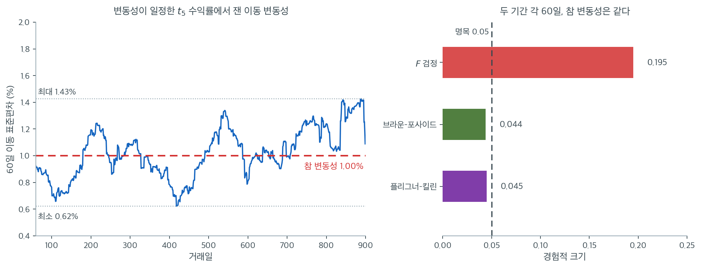

# 금융 변동성 비교

금융에서 변동성(수익률의 표준편차)은 위험의 핵심 척도이다. 포트폴리오 관리자, 위험 분석가, 규제당국은 변동성이 시간에 따라 변했는지 또는 자산에 따라 다른지를 일상적으로 판단해야 한다. 이 장의 분산 검정들이 그 비교의 통계적 도구를 제공하지만, 금융 자료에는 고유한 어려움이 있다. 수익률은 꼬리가 두껍고, 때로 자기상관되어 있으며, 정규분포를 따르는 경우가 드물다.

---

## 1. 금융 맥락에서의 변동성

$P_t$가 시각 $t$의 자산 가격이면 로그수익률은

$$
r_t = \ln\!\left(\frac{P_t}{P_{t-1}}\right)
$$

주어진 기간의 자산 변동성은 로그수익률의 표준편차이다.

$$
\sigma = \sqrt{\operatorname{Var}(r_t)}
$$

연율화 변동성은 보통 $\sigma_{\text{annual}} = \sigma_{\text{daily}} \times \sqrt{252}$로 보고한다. 252는 연간 거래일 수의 근사값이다.

---

## 2. 흔한 질문

금융 변동성 검정은 다음과 같은 질문을 다룬다.

1. **변동성이 변했는가?** 사건(실적 발표, 정책 변경, 위기) 전후의 수익률 분산을 비교한다.
2. **두 자산의 변동성이 같은가?** 두 주식, 채권, 포트폴리오의 수익률 분산을 비교한다.
3. **시장 국면에 따라 변동성이 같은가?** 시계열을 국면(상승장, 하락장, 횡보장)으로 나누어 등분산을 검정한다.

---

## 3. F 검정이 금융 자료에서 실패하는 이유

금융 수익률의 꼬리가 두껍고 초과첨도가 크다는 것은 잘 알려져 있다. 실증적으로 일별 주식 수익률의 초과첨도 $\gamma_2$는 흔히 3에서 10 사이로, 정규분포의 0보다 훨씬 크다. 15.3절에서 논한 대로 F 검정은 첨도에 매우 민감하다.

| 자료 유형 | 전형적 초과첨도 | F 검정 신뢰성 |
|---|---|---|
| 정규 모의생성 | 0 | 타당 |
| 일별 주식 수익률 | 3~10 | 신뢰 불가 |
| 일별 외환 수익률 | 2~5 | 신뢰 불가 |
| 월별 주식 수익률 | 1~3 | 경계선 |
| 국채 수익률 | 1~2 | 경계선 |

!!! danger "일별 수익률 자료에 F 검정을 쓰지 말라"
    일별 금융 수익률에 적용하면 F 검정은 $H_0\colon \sigma_1^2 = \sigma_2^2$을 지나치게 자주 기각한다. 두꺼운 꼬리가 검정통계량을 부풀리기 때문이다. 유의한 F 검정 결과는 진짜 변동성 차이가 아니라 비정규성을 반영하는 것일 수 있다.

    수치로 확인하자. $t_5$ 수익률(초과첨도 6), 두 기간 각 60일, **참 변동성이 같은** 상황에서 명목 $\alpha = 0.05$의 실제 기각률은

    | 검정 | 경험적 크기 |
    |---|---|
    | F 검정 | **0.195** |
    | Brown-Forsythe | 0.044 |
    | Fligner-Killeen | 0.045 |

    F 검정은 변동성이 전혀 변하지 않았는데도 다섯 번에 한 번꼴로 "변했다"고 판정한다. 로버스트 검정들은 올바른 크기를 유지한다.

문제의 뿌리를 보려면 검정 이전에 **추정** 단계부터 봐야 한다. 아래 왼쪽은 참 변동성이 시종일관 일 $1.00\%$로 **고정된** $t_5$ 수익률 900일치에서 60일 이동 표준편차를 계산한 것이다. 변동성은 한 번도 변하지 않았다.



그런데 파란 선은 $0.62\%$에서 $1.43\%$까지 출렁인다. **최대가 최소의 2.3배다.** 200일 무렵의 고점과 420일 무렵의 저점만 떼어 놓고 보면 "변동성이 절반으로 줄었다"는 이야기를 쓰고 싶어진다. 850일 이후의 상승은 "시장이 불안해졌다"는 해설을 부를 것이다. 전부 잡음이다.

두 가지가 겹쳐 이 출렁임을 만든다. 첫째, 60일은 분산을 추정하기에 짧다. 정규 자료라도 $S$의 상대오차가 $1/\sqrt{2(n-1)} \approx 9\%$이다. 둘째, 꼬리가 두꺼우면 그 변동이 더 커진다. $t_5$의 초과첨도가 6이므로 $\operatorname{Var}(S^2)$가 정규의 4배다. 셋째로 이동창이 겹쳐 있어 인접한 추정값이 강하게 상관되므로, 잡음이 **추세처럼 보이는 매끄러운 곡선**을 그린다. 무작위 산점이었다면 아무도 속지 않았을 것이다.

오른쪽 막대가 이 잡음을 검정으로 넘겼을 때의 결과다. $F$ 검정의 실제 크기가 $0.195$다. 앞 표에서 본 숫자와 같지만, 이제 그 숫자가 어디서 오는지 알 수 있다. **검정통계량이 재고 있는 것의 상당 부분이 변동성의 변화가 아니라 변동성 추정의 잡음이다.** 브라운–포사이드 $0.044$, 플리그너–킬린 $0.045$는 그 잡음의 크기를 자료에서 다시 읽어 내므로 속지 않는다.

실무 규칙 하나. **두 기간의 변동성을 비교하기 전에 각 기간의 변동성이 얼마나 정밀하게 추정되었는지부터 물어라.** 60일짜리 추정값 두 개로 1.5배 차이를 논하는 것은, 위 그림에서 아무 두 지점을 골라 비교하는 것과 다르지 않다.

---

## 4. 금융 자료에 권장되는 검정

수익률의 두꺼운 꼬리를 고려하면 다음 중에서 고르는 것이 좋다.

1. **Brown-Forsythe 검정.** 로버스트성이 좋고 검정력도 합리적이다. 수익률의 꼬리가 중간 정도로 두꺼울 때 적합하다.
2. **Fligner-Killeen 검정.** 매우 두꺼운 꼬리 자료에서 제1종 오류 조절이 가장 좋다. 분포가 강하게 비정규일 때 선호된다.
3. **붓스트랩 검정.** 분포 가정을 하지 않는다. 15.6절의 붓스트랩 분산 검정은 수익률 분포의 실제 모양에 적응하므로 금융 자료에 잘 맞는다.

<div class="exbox" markdown>

**보기 1.** <span class="diff easy" title="쉬움"></span> 두 기간의 변동성 비교. 어떤 분석가가 중앙은행 정책 발표 후 주식의 일별 수익률 변동성이 변했는지 판정하려 한다. 자료는 발표 전 60거래일과 발표 후 60거래일이다.

**설정:**

- 기간 1 (전): $n_1 = 60$개 일별 수익률, $S_1^2 = 0.000324$ (일별 변동성 $= 1.8\%$)
- 기간 2 (후): $n_2 = 60$개 일별 수익률, $S_2^2 = 0.000576$ (일별 변동성 $= 2.4\%$)

**가설:**

</div>

??? success "풀이"
    $$
    H_0\colon \sigma_{\text{before}}^2 = \sigma_{\text{after}}^2 \quad \text{대} \quad H_1\colon \sigma_{\text{before}}^2 \neq \sigma_{\text{after}}^2
    $$

    **참고: F 검정을 쓴다면.** $F = 0.000324/0.000576 = 0.5625$이고 $F_{59,59}$ 아래에서 양측 $p = 0.0288$이다. 5% 수준에서 기각한다.

    **그러나 이 $p$값을 믿어서는 안 된다.** 위 경고 상자에서 보았듯 $t_5$ 수준의 두꺼운 꼬리에서 F 검정의 실제 크기는 0.195이다. 명목 $p = 0.029$는 실제로는 훨씬 약한 증거이다.

    **검정 선택.** 일별 수익률의 꼬리가 두꺼우므로 분석가는 F 검정 대신 Brown-Forsythe 검정을 써야 한다. 요약통계량만으로는 로버스트 검정을 계산할 수 없고 **원자료가 필요하다**는 점도 실무적으로 중요하다. 표본분산만 보고된 논문의 결과를 재검토할 수 없는 이유이다.

---

## 5. 금융 자료 고유의 어려움

### 제곱 수익률의 자기상관

원래의 수익률 $r_t$는 근사적으로 무상관이지만, 순간분산의 대리변수인 제곱 수익률 $r_t^2$은 흔히 강한 양의 자기상관을 보인다. **변동성 군집**이라 불리는 이 현상은 변동성이 높은 날 뒤에 다시 변동성이 높은 날이 오는 경향을 뜻한다.

$r_t^2$의 자기상관은 이 장의 모든 분산 검정이 요구하는 독립성 가정을 위배한다. 변동성 군집이 있으면 실효 표본크기가 명목 $n$보다 작아지고 분산 검정이 인위적으로 작은 $p$값을 낸다.

!!! danger "로버스트 검정도 변동성 군집은 해결하지 못한다"
    GARCH(1,1) 과정($\alpha = 0.1$, $\beta = 0.85$)에서 120일을 생성하고 전반 60일과 후반 60일을 비교하는 모의실험을 하자. **두 기간의 무조건분산이 정확히 같으므로 $H_0$이 참이다.**

    | 검정 | $t_5$ 독립 자료 | GARCH 자료 |
    |---|---|---|
    | F 검정 | 0.195 | **0.331** |
    | Brown-Forsythe | 0.044 | **0.297** |
    | Fligner-Killeen | 0.045 | **0.287** |

    독립인 두꺼운 꼬리 자료에서는 로버스트 검정이 크기를 완벽히 통제했지만(0.044, 0.045), **변동성 군집이 있으면 세 검정 모두 0.29~0.33으로 무너진다.**

    이유는 명확하다. 로버스트 검정은 **분포 모양**에 대한 가정을 완화할 뿐 **독립성** 가정은 그대로 요구한다. 15.1절 연습문제 3에서 자기상관에 대해 확인한 것과 같은 결론이다.

    실무적 함의: 금융 시계열에서 "Brown-Forsythe를 썼으니 안전하다"고 생각해서는 안 된다. 두꺼운 꼬리보다 변동성 군집이 훨씬 심각한 문제이다.

**완화 전략:**

- 자기상관이 감쇠할 만큼 충분히 긴 비중첩 부분기간을 쓴다
- GARCH 모형을 적합하여 변동성 동학을 포착하고 GARCH 모수의 구조변화를 검정한다
- 자기상관 구조를 보존하는 블록 붓스트랩을 적용한다

### 비정상성

금융 변동성은 한 시점에서 급격히 바뀌기보다 시간에 걸쳐 점진적으로 변하는 경우가 많다. 두 기간을 각각 일정한 분산을 갖는 것처럼 검정하는 것은 지나친 단순화일 수 있다. 형식적 변화점 탐지 방법이나 이동창 추정이 더 미묘한 그림을 제공한다.

<div class="exbox" markdown>

**보기 2.** <span class="diff easy" title="쉬움"></span> 변동성 변화 검정하기. $t_5$ 수익률 $60$일씩 두 기간을 만들되 참 변동성을 $1.8\%$와 $2.4\%$로 **정말 다르게** 두고, F 검정·Brown-Forsythe·Fligner-Killeen 을 나란히 돌린다.

**(1)** $t_5$의 첨도를 구하고, 5.3절의 극한 오류율 공식으로 이 자료에서 F 검정의 **극한 크기**를 계산하시오. 표본을 키우면 그 값이 $0.05$로 수렴하는가?

**(2)** 세 검정을 돌려 $p$값을 견주고, F 검정이 증거를 몇 배 과장하는지 적으시오. 또 (1)의 극한값을 모의실험으로 확인하시오.

</div>

??? success "풀이"

    **(1) 첨도 하나가 극한 크기를 정한다.** $t_\nu$ 분포의 첨도는 $\nu > 4$에서

    $$
    \beta_2(t_\nu) = 3 + \frac{6}{\nu - 4}
    $$

    이므로 $\nu = 5$이면 $\beta_2 = 9$, 초과첨도가 $6$이다. 위 표가 말하는 "$t_5$ 수익률(초과첨도 6)"이 이것이다. ($\nu = 5$라 네 번째 적률이 **겨우** 존재한다. $\nu \le 4$이면 첨도가 무한대가 되어 아래 계산 자체가 성립하지 않는다.)

    5.3절이 유도해 둔 것을 가져온다. 델타법으로 $\operatorname{Var}(\log S^2) \approx (\beta_2-1)/n$이고 두 표본이 독립이므로

    $$
    \operatorname{Var}\!\left(\log \frac{S_1^2}{S_2^2}\right) \approx (\beta_2-1)\left(\frac{1}{n_1}+\frac{1}{n_2}\right)
    $$

    인데, F 검정은 이 값을 정규 이론의 $2\left(\frac1{n_1}+\frac1{n_2}\right)$로 믿는다. 그러므로 **참 산포가 믿는 산포의 $\sqrt{(\beta_2-1)/2}$배**다. $\beta_2 = 9$를 넣으면

    $$
    \sqrt{\frac{9-1}{2}} = 2
    $$

    로 정확히 **두 배**다. 임계값이 참 산포 단위로는 $\pm 1.96/2 = \pm 0.98$만큼만 뻗으므로

    $$
    \text{극한 크기} = 2\left[1 - \Phi\!\left(1.96\sqrt{\frac{2}{\beta_2-1}}\right)\right]
    = 2\left[1 - \Phi(0.98)\right] = 0.327
    $$

    이다. 5.3절의 표에서 $\beta_2 = 9$인 지수분포 줄에 적힌 $0.327$과 같은 수이고, 그래야 한다. **극한 오류율은 첨도만의 함수**이므로 분포 모양이 달라도 첨도가 같으면 같은 값이 나온다.

    **$0.05$로 수렴하지 않는다. 오히려 올라간다.** 위 식에 $n$이 아예 들어 있지 않다는 것이 요점이다. 임계값도 $1/\sqrt n$로 줄고 참 산포도 $1/\sqrt n$로 줄어 둘의 비가 처음부터 끝까지 $2$로 고정되기 때문이다. 작은 $n$에서는 $F$ 분포 자체가 넓어 왜곡이 가려지므로, 실제 크기는 **아래에서 위로 올라가** $0.327$에 다가간다. 연습문제 2 이 $n = 60$에서 잰 $0.195$는 극한값이 아니라 그 도중의 한 점이다.

    **(2) 먼저 자료 한 벌로 세 검정을 견준다.**

    ```python
    import numpy as np
    from scipy import stats

    rng = np.random.default_rng(42)

    # t(5) 의 표준편차는 sqrt(5/3) 이다. 목표 변동성을 정확히 맞추려면
    # 이 값으로 나눠야 한다. 이러면 달라지는 것은 꼬리 두께뿐이다.
    scale_correction = np.sqrt(5 / 3)

    # 1구간: 일변동성 1.8%
    returns_before = rng.standard_t(df=5, size=60) * 0.018 / scale_correction

    # 2구간: 일변동성 2.4%. 실제로 분산이 달라진 자료다.
    returns_after = rng.standard_t(df=5, size=60) * 0.024 / scale_correction

    print(f"sample sd: {returns_before.std(ddof=1):.5f}, "
          f"{returns_after.std(ddof=1):.5f}")

    # 중앙값을 중심으로 쓰므로 꼬리가 두꺼운 자료에서도 버틴다.
    bf_stat, bf_p = stats.levene(returns_before, returns_after, center='median')
    print(f"Brown-Forsythe:  W = {bf_stat:.4f}, p = {bf_p:.4f}")

    # 순위만 쓰는 검정이라 셋 중 가장 로버스트하다.
    fk_stat, fk_p = stats.fligner(returns_before, returns_after)
    print(f"Fligner-Killeen: H = {fk_stat:.4f}, p = {fk_p:.4f}")

    # F 검정은 정규성에 매우 민감하다. 수익률처럼 꼬리가 두꺼운 자료에서는
    # 분산이 같아도 자주 기각해 버리므로 쓰지 않는 편이 낫다.
    f_stat = np.var(returns_before, ddof=1) / np.var(returns_after, ddof=1)
    f_p = 2 * min(stats.f.cdf(f_stat, 59, 59), stats.f.sf(f_stat, 59, 59))
    print(f"F-test:          F = {f_stat:.4f}, p = {f_p:.4g} "
          f"(unreliable for heavy-tailed data)")
    ```

    출력:

    ```text
    sample sd: 0.01504, 0.02611
    Brown-Forsythe:  W = 5.4046, p = 0.0218
    Fligner-Killeen: H = 3.2325, p = 0.0722
    F-test:          F = 0.3317, p = 3.791e-05 (unreliable for heavy-tailed data)
    ```

    **세 $p$값이 자릿수째로 갈린다.** F 검정 $3.791\times10^{-5}$, Brown-Forsythe $0.0218$, Fligner-Killeen $0.0722$다. 비로 적으면 F 검정이 Brown-Forsythe 보다 **$575$배**, Fligner-Killeen 보다 $1900$배 작은 $p$값을 준다. **F 검정이 증거를 500배 넘게 과장한다.** 이 자료에는 실제로 변동성 차이가 있으므로($1.8\%$ 대 $2.4\%$, 분산비 $1.78$배) 기각 자체는 옳지만, 그 확신의 정도가 완전히 부풀려져 있다.

    (1)이 왜 그런지 말해 준다. **$\log F$의 참 산포가 F 검정이 믿는 것의 두 배**이므로, F 검정은 관측된 $\log F$를 실제보다 두 배 멀리 있는 것으로 읽는다. 정규 꼬리에서 $z$를 두 배로 읽으면 $p$값은 자릿수로 줄어든다. Brown-Forsythe 와 Fligner-Killeen 은 산포의 크기를 자료에서 다시 읽어 내므로 속지 않는다.

    **이제 (1)의 극한값 $0.327$을 확인한다.** 참 변동성을 두 기간에 **같게** 두고 $n$을 키우며 실제 크기를 잰다.

    ```python
    import numpy as np
    from scipy import stats

    # (1) 극한 크기를 식으로 먼저 적는다. t_5 의 첨도는 3 + 6/(nu-4) = 9 다.
    beta2 = 3 + 6 / (5 - 4)
    c = stats.norm.isf(0.025) * np.sqrt(2 / (beta2 - 1))
    print(f"t_5 의 첨도 beta2 = {beta2:.1f}   (초과첨도 {beta2 - 3:.1f})")
    print(f"산포 배율 sqrt((beta2-1)/2) = {np.sqrt((beta2 - 1) / 2):.3f}")
    print(f"1.96*sqrt(2/(beta2-1)) = {c:.4f}   ->  극한 크기 = {2 * stats.norm.sf(c):.4f}")


    def bf_p2(A, B):
        """두 표본에 대한 중앙값 중심 Levene(= Brown-Forsythe) p-값을 벡터화.
        scipy.stats.levene(a, b, center='median') 와 같은 값을 준다."""
        Z = [np.abs(X - np.median(X, axis=1, keepdims=True)) for X in (A, B)]
        n1, n2 = A.shape[1], B.shape[1]
        m = [z.mean(axis=1) for z in Z]
        gm = (n1 * m[0] + n2 * m[1]) / (n1 + n2)
        msb = n1 * (m[0] - gm) ** 2 + n2 * (m[1] - gm) ** 2
        msw = (((Z[0] - m[0][:, None]) ** 2).sum(axis=1)
               + ((Z[1] - m[1][:, None]) ** 2).sum(axis=1)) / (n1 + n2 - 2)
        return stats.f.sf(msb / msw, 1, n1 + n2 - 2)


    # (2) 표본을 키우며 두 검정의 실제 크기를 잰다. 참 변동성은 두 기간이 같다.
    rng = np.random.default_rng(11)
    print(f"\n{'n':>6}{'R':>8}{'F-test':>10}{'Brown-Forsythe':>17}")
    for n, R in [(60, 20_000), (250, 20_000), (1000, 10_000), (4000, 4_000)]:
        A = rng.standard_t(5, size=(R, n))
        B = rng.standard_t(5, size=(R, n))
        F = A.var(axis=1, ddof=1) / B.var(axis=1, ddof=1)
        d = stats.f(n - 1, n - 1)
        p_f = 2 * np.minimum(d.cdf(F), d.sf(F))
        print(f"{n:>6}{R:>8}{np.mean(p_f < 0.05):>10.4f}{np.mean(bf_p2(A, B) < 0.05):>17.4f}")
    ```

    출력:

    ```text
    t_5 의 첨도 beta2 = 9.0   (초과첨도 6.0)
    산포 배율 sqrt((beta2-1)/2) = 2.000
    1.96*sqrt(2/(beta2-1)) = 0.9800   ->  극한 크기 = 0.3271

         n       R    F-test   Brown-Forsythe
        60   20000    0.2028           0.0474
       250   20000    0.2399           0.0481
      1000   10000    0.2696           0.0499
      4000    4000    0.2755           0.0493
    ```

    **(1)의 예측이 그대로 보인다.** 산포 배율이 정확히 $2.000$이고 극한 크기가 $0.3271$이다. 그리고 모의실험한 F 검정의 크기가

    $$
    0.2028 \;\to\; 0.2399 \;\to\; 0.2696 \;\to\; 0.2755
    $$

    으로 $n$을 $60$에서 $4000$까지 키우는 동안 **단조증가**한다. 표본을 $67$배 늘렸는데 거짓 양성률이 $0.20$에서 $0.28$로 올라갔다. **표본을 키우면 더 나빠진다.** 연습문제 2 의 $n = 60$ 값 $0.1948$은 이 수열의 첫 점이고(여기서는 $0.2028$, 씨앗과 반복 횟수가 달라 생긴 차이이며 $R = 20000$에서 표준오차 $0.0028$이니 두 표준오차 안이다), 끝점은 $0.05$가 아니라 $0.327$이다.

    수렴이 느린 것도 눈여겨볼 만하다. $n = 4000$에서도 아직 $0.276$으로 극한값에서 $0.05$나 떨어져 있다. 델타근사의 오차가 $1/\sqrt n$로만 줄기 때문이다. 그러나 **방향은 처음부터 끝까지 한쪽**이다.

    **Brown-Forsythe 는 네 경우 모두 $0.047$–$0.050$으로 명목값에 붙어 있다.** 같은 $t_5$ 자료, 같은 표본크기인데 한쪽은 $n$과 함께 망가지고 한쪽은 꿈쩍하지 않는다. 15.6절이 보일 붓스트랩 검정도 같은 이유로 버틴다. **"분산 검정에는 중심극한정리의 보호가 없다"는 말은 고전적 검정에만 해당하는 말이고, 그 보호를 자료에서 직접 만들어 내는 것이 로버스트 검정이 하는 일이다.**

    다만 이 결론은 **독립성을 전제로 한 것**이다. 아래의 변동성 군집 상자가 그 전제가 깨지면 Brown-Forsythe 도 $0.297$까지 무너짐을 보인다.

!!! warning "`standard_t(df)*scale`의 표준편차는 `scale`이 아니다"
    원래 코드는 `rng.standard_t(df=5, size=60) * 0.018`로 "일별 변동성 1.8%"를 만들려 했지만, $t_5$의 표준편차가 $\sqrt{5/3} = 1.291$이므로 실제 표준편차는 $0.018 \times 1.291 = 0.0232$, 곧 **2.3%**이다.

    위 코드는 `/ np.sqrt(5/3)`으로 이를 보정했다. 14장 금융 수익률 페이지에서 지적한 것과 같은 함정이다.

    (분산 **비**는 척도에 불변이므로 검정통계량과 $p$값은 보정 전후가 같다. 보정은 "1.8%"라는 서술을 자료와 일치시키기 위한 것이다.)

---

## 연습문제

<div class="drillbox" markdown>

**연습문제 1.** <span class="diff easy" title="쉬움"></span>
분석가가 논문에서 두 기간의 표본분산 $S_1^2 = 0.000324$, $S_2^2 = 0.000576$($n_1 = n_2 = 60$)만 보고했다. 이 정보만으로 로버스트 검정을 수행할 수 있는가? 할 수 없다면 무엇이 필요한가?

</div>

??? success "풀이"
    **할 수 없다.**

    F 검정과 Bartlett 검정은 **요약통계량만으로** 계산할 수 있다. 표본분산과 표본크기만 있으면 된다.

    $$
    F = \frac{S_1^2}{S_2^2} = \frac{0.000324}{0.000576} = 0.5625, \quad p = 0.0288.
    $$

    그러나 로버스트 검정은 다르다.

    | 검정 | 필요한 정보 |
    |---|---|
    | F 검정 | $S_1^2, S_2^2, n_1, n_2$ |
    | Bartlett | $S_i^2, n_i$ |
    | Levene | **원자료 전체** |
    | Brown-Forsythe | **원자료 전체** |
    | Fligner-Killeen | **원자료 전체** |
    | 붓스트랩 | **원자료 전체** |

    Levene 계열은 각 관측값과 집단 중심의 절대편차 $|X_{ij} - c_i|$를 계산해야 하므로 개별 관측값이 필요하다. Fligner-Killeen은 그 편차들의 순위까지 필요하다.

    **실무적 함의.**

    1. **논문 재검토가 불가능하다.** 요약통계량만 보고된 연구의 F 검정 결과가 두꺼운 꼬리 때문에 부풀려졌는지 확인할 방법이 없다.
    2. **보고 관행에 대한 시사.** 금융이나 다른 두꺼운 꼬리 분야에서는 분산 검정 결과와 함께 **왜도와 첨도를 반드시 보고**해야 한다. 그래야 독자가 F 검정의 신뢰성을 가늠할 수 있다. 가능하면 원자료나 재현 코드를 공개하는 것이 최선이다.
    3. **부분적 대안.** 표본첨도 $g_2$를 알면 대략적인 보정이 가능하다. 15.3절 연습문제 4에서 유도했듯 $\ln F$의 실제 분산이 명목값의 $(\gamma_2+2)/2$배이므로, $p$값을 다시 계산할 때 $\ln F$를 $\sqrt{(g_2+2)/2}$로 나누어 보정할 수 있다.

        이 자료에서 $g_2 = 6$($t_5$ 수준)이라면 보정계수가 $\sqrt{4} = 2$이므로 유효 $z$가 절반이 된다. 구체적으로 $\ln F = \ln 0.5625 = -0.5754$이고 $\operatorname{sd}(\ln F) \approx \sqrt{4/59} = 0.2604$이므로 명목 $z = -2.21$($p = 0.027$)인데, 보정하면 $z = -1.10$이 되어 $p = 0.269$가 된다. **유의하지 않게 된다.**

    이 간단한 계산만으로도 원래 결론이 뒤집힌다는 사실이, 첨도를 함께 보고하는 것이 왜 중요한지를 잘 보여준다. $\square$

---

<div class="drillbox" markdown>

**연습문제 2.** <span class="diff med" title="중간"></span>
$t_5$ 수익률에서 F 검정, Brown-Forsythe, Fligner-Killeen의 경험적 크기를 모의실험으로 확인하라. 두 기간의 참 변동성은 같게 둔다.

</div>

??? success "풀이"

    ```python
    import numpy as np
    from scipy import stats

    rng = np.random.default_rng(3)
    R = 5000
    counts = [0, 0, 0]

    for _ in range(R):
        a = rng.standard_t(5, 60)
        b = rng.standard_t(5, 60)
        f = a.var(ddof=1) / b.var(ddof=1)
        counts[0] += 2 * min(stats.f.cdf(f, 59, 59),
                             stats.f.sf(f, 59, 59)) < 0.05
        counts[1] += stats.levene(a, b, center='median')[1] < 0.05
        counts[2] += stats.fligner(a, b)[1] < 0.05

    print(f"F-test:          {counts[0] / R:.4f}")
    print(f"Brown-Forsythe:  {counts[1] / R:.4f}")
    print(f"Fligner-Killeen: {counts[2] / R:.4f}")
    ```

    출력:

    ```text
    F-test:          0.1948
    Brown-Forsythe:  0.0438
    Fligner-Killeen: 0.0448
    ```

    F 검정의 크기가 $0.195$로 명목값의 **네 배**이다. 참 변동성이 같은데도 다섯 번에 한 번 "변했다"고 판정한다.

    Brown-Forsythe($0.044$)와 Fligner-Killeen($0.045$)은 올바른 크기를 유지한다.

    **실무적 해석.** 어떤 분석가가 F 검정으로 "변동성이 유의하게 변했다($p = 0.03$)"고 보고했다면, 그 결과가 실제 변동성 변화 때문일 확률과 두꺼운 꼬리 때문일 확률을 구별할 수 없다. 명목 5% 검정의 실제 크기가 19.5%이므로 그 "유의한" 결과의 상당 부분이 거짓 양성이다. $\square$

---

<div class="drillbox" markdown>

**연습문제 3.** <span class="diff med" title="중간"></span>
변동성 군집이 있을 때 로버스트 검정도 무너짐을 모의실험으로 확인하라. GARCH(1,1) 자료로 두 인접 기간을 비교하라.

</div>

??? success "풀이"

    ```python
    import numpy as np
    from scipy import stats

    def garch11(n, rng, omega=1e-5, alpha=0.1, beta=0.85):
        """GARCH(1,1) 수익률을 만든다. 무조건분산은 omega/(1-alpha-beta) 다.

            변동성이 뭉쳐 다니는 실제 수익률의 성질을 흉내 내기 위한 모형이다.
            """
        h = omega / (1 - alpha - beta)
        r = np.zeros(n)
        for t in range(n):
            r[t] = np.sqrt(h) * rng.normal()
            h = omega + alpha * r[t] ** 2 + beta * h
        return r

    rng = np.random.default_rng(3)
    R = 5000
    counts = [0, 0, 0]

    for _ in range(R):
        x = garch11(120, rng)
        a, b = x[:60], x[60:]           # two adjacent periods, same true variance
        f = a.var(ddof=1) / b.var(ddof=1)
        counts[0] += 2 * min(stats.f.cdf(f, 59, 59),
                             stats.f.sf(f, 59, 59)) < 0.05
        counts[1] += stats.levene(a, b, center='median')[1] < 0.05
        counts[2] += stats.fligner(a, b)[1] < 0.05

    print(f"F-test:          {counts[0] / R:.4f}")
    print(f"Brown-Forsythe:  {counts[1] / R:.4f}")
    print(f"Fligner-Killeen: {counts[2] / R:.4f}")
    ```

    출력:

    ```text
    F-test:          0.3312
    Brown-Forsythe:  0.2968
    Fligner-Killeen: 0.2868
    ```

    | 검정 | $t_5$ 독립 (연습문제 2) | GARCH |
    |---|---|---|
    | F 검정 | 0.195 | 0.331 |
    | Brown-Forsythe | 0.044 | **0.297** |
    | Fligner-Killeen | 0.045 | **0.287** |

    **결과가 충격적이다.** 독립인 두꺼운 꼬리 자료에서 완벽하게 작동하던 로버스트 검정들이 변동성 군집 앞에서는 F 검정과 거의 같은 수준으로 무너진다. 세 검정 모두 세 번에 한 번꼴로 잘못 기각한다.

    **왜 그런가.** GARCH 과정에서 무조건분산은 두 기간이 같지만, 어떤 표본경로에서는 전반 60일이 우연히 고변동성 국면에, 후반 60일이 저변동성 국면에 놓인다. 그러면 두 기간의 **표본**분산이 크게 달라진다.

    검정들은 이것을 "참 변동성 차이"로 읽지만, 실은 하나의 정상 과정 안에서의 국면 변동일 뿐이다. 어떤 검정도 이를 구별할 수 없다. 분포 모양의 문제가 아니라 **종속성의 문제**이기 때문이다.

    **해결책.** (1) 블록 붓스트랩으로 자기상관을 보존한 귀무분포를 만들거나, (2) GARCH 모형을 적합하고 그 모수의 구조변화를 검정하거나, (3) 애초에 "두 기간의 무조건분산이 같은가"라는 질문 자체가 적절한지 재검토한다. 금융 변동성은 본래 시간에 따라 변하는 양이므로, 두 상수를 비교하는 틀이 문제에 맞지 않을 수 있다. $\square$

---

<div class="drillbox" markdown>

**연습문제 4.** <span class="diff med" title="중간"></span>
"일별 변동성 1.8%"를 $t_5$ 분포로 모의생성할 때 `standard_t(5) * 0.018`이 왜 틀렸는지 설명하고, 여러 자유도에 대한 보정계수를 계산하라.

</div>

??? success "풀이"
    $t_\nu$ 분포의 표준편차는 $\nu > 2$일 때

    $$
    \operatorname{sd}(t_\nu) = \sqrt{\frac{\nu}{\nu - 2}}
    $$

    이다. 곧 `standard_t(nu)`는 표준편차가 1이 **아니다**. 여기에 `scale`을 곱하면 표준편차가 $\text{scale} \times \sqrt{\nu/(\nu-2)}$가 된다.

    ```python
    import numpy as np

    print(f"{'nu':>5} {'sd(t_nu)':>10} {'sd from *0.018':>15}")
    for nu in [3, 4, 5, 6, 10, 30, 100]:
        sd = np.sqrt(nu / (nu - 2))
        print(f"{nu:>5} {sd:>10.4f} {0.018 * sd:>15.5f}")
    ```

    출력:

    ```text
       nu   sd(t_nu)  sd from *0.018
        3     1.7321         0.03118
        4     1.4142         0.02546
        5     1.2910         0.02324
        6     1.2247         0.02205
       10     1.1180         0.02012
       30     1.0351         0.01863
      100     1.0102         0.01818
    ```

    $\nu = 5$이면 목표 1.8%가 실제로는 **2.32%**가 되어 29% 초과한다. $\nu = 3$이면 3.12%로 73%나 초과한다. 자유도가 작을수록(꼬리가 두꺼울수록) 오차가 커진다는 점이 특히 곤란하다. 두꺼운 꼬리를 모의생성하려 할수록 변동성이 더 심하게 어긋난다.

    **올바른 방법.** 목표 표준편차 $\sigma$를 얻으려면

    ```python
    rng = np.random.default_rng(0)
    nu, n, sigma = 5, 100_000, 0.018

    naive = rng.standard_t(nu, n) * sigma
    correct = rng.standard_t(nu, n) * sigma / np.sqrt(nu / (nu - 2))

    print(f"target sd:  {sigma:.5f}")
    print(f"naive sd:   {naive.std(ddof=1):.5f}")
    print(f"correct sd: {correct.std(ddof=1):.5f}")
    ```

    출력:

    ```
    target sd:  0.01800
    naive sd:   0.02316
    correct sd: 0.01805
    ```

    순진한 방법은 표준편차가 $0.0232$로 목표보다 29% 크지만, $\sqrt{\nu/(\nu-2)}$로 나누면 $0.0181$로 목표에 맞는다.

    **왜 중요한가.** 검정통계량은 분산의 **비**에 의존하므로 두 집단에 같은 척도 오차가 있으면 $p$값은 바뀌지 않는다. 그러나 (1) "변동성 1.8%"라는 서술이 자료와 어긋나고, (2) VaR나 절대적 위험 수준을 계산하면 결과가 틀리며, (3) 다른 분포에서 생성한 자료와 비교할 때 공정하지 않다. $\square$

---

## 정리하며

금융 변동성 비교는 수익률 자료에 있는 두꺼운 꼬리와 자기상관 때문에 검정 선택에 주의가 필요하다. Brown-Forsythe와 Fligner-Killeen 검정은 횡단면 비교나 두 기간 비교에서 신뢰할 만한 추론을 제공한다. 변동성 군집이 있는 시계열 자료에서는 종속 구조를 반영하기 위해 추가적인 모형화(GARCH, 블록 붓스트랩)가 필요하다.
