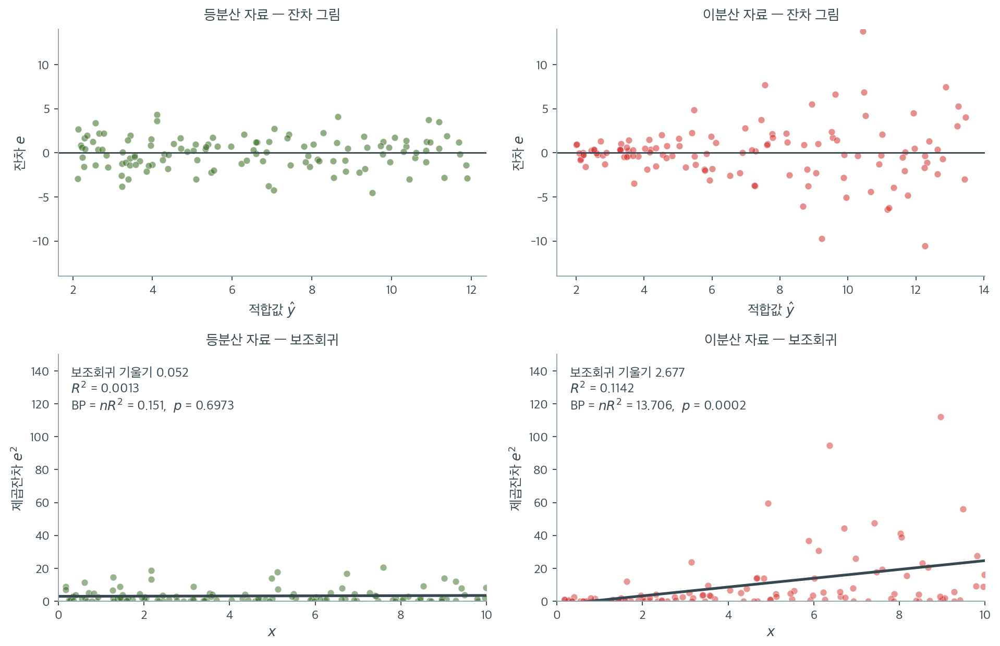

# 회귀에서의 분산 검정

선형회귀는 오차항이 설명변수의 모든 수준에서 일정한 분산을 갖는다고 가정한다. 곧 모든 $i$에 대해 $\operatorname{Var}(\varepsilon_i) = \sigma^2$이다. 이 가정을 **등분산성**이라 한다. 이것이 무너져 오차의 분산이 설명변수 값이나 적합값에 의존하면 **이분산**이라 부른다. 이 절은 회귀 잔차에서 이분산을 탐지하는 형식적 검정들을 다루고 이분산을 무시했을 때의 결과를 논한다.

---

## 1. 이분산이 왜 문제인가

선형회귀모형

$$
Y_i = \beta_0 + \beta_1 X_{i1} + \cdots + \beta_p X_{ip} + \varepsilon_i
$$

에서 OLS 추정량 $\hat{\boldsymbol{\beta}}$는 이분산 아래에서도 불편이고 일치성을 갖는다. 그러나 두 가지 중요한 문제가 생긴다.

1. **비효율성.** OLS가 더 이상 최량선형불편추정량(BLUE)이 아니다. 가중최소제곱(WLS)이나 일반화최소제곱(GLS)이 더 효율적인 추정값을 낼 수 있다.
2. **무효한 추론.** OLS가 계산하는 표준오차는 일정한 분산을 가정한다. 이분산 아래에서 이 표준오차가 편향되어 회귀계수의 $t$ 통계량, $p$값, 신뢰구간이 모두 틀리게 된다.

**두 번째가 훨씬 심각하다.** 계수 추정값 자체는 여전히 옳으므로 "얼마나 큰 효과인가"에 대한 답은 유지되지만, "그 효과가 통계적으로 유의한가"에 대한 답이 무너진다.

---

## 2. 시각적 탐지

형식적 검정을 적용하기 전에 잔차를 적합값 $\hat{Y}_i$에 대해 그린다.

- **등분산 패턴:** 잔차가 0 주위에서 대략 일정한 띠를 이룬다.
- **이분산 패턴:** 잔차의 산포가 $\hat{Y}_i$에 따라 체계적으로 커지거나 작아진다. 흔한 패턴으로 깔때기 모양(적합값에 따라 산포 증가)과 나비넥타이 모양(산포가 커졌다가 작아짐)이 있다.

---

## 3. Breusch-Pagan 검정

Breusch-Pagan(1979) 검정은 이분산에 대해 가장 널리 쓰이는 형식적 검정이다. 제곱잔차가 설명변수와 관련되어 있는지 검정한다.

**절차:**

**1단계.** 회귀모형을 적합하고 OLS 잔차 $e_i = Y_i - \hat{Y}_i$를 얻는다.

**2단계.** 제곱잔차 $e_i^2$을 원래의 설명변수 $X_{i1}, \ldots, X_{ip}$에 회귀시킨다.

$$
e_i^2 = \gamma_0 + \gamma_1 X_{i1} + \cdots + \gamma_p X_{ip} + u_i
$$

**3단계.** 이 보조회귀의 $R^2$에 $n$을 곱한 값을 검정통계량으로 삼는다.

$$
\text{BP} = n \cdot R^2_{\text{aux}}
$$

**4단계.** $H_0\colon$ 등분산 아래에서 이 통계량은 근사적으로 카이제곱분포를 따른다.

$$
\text{BP} \sim \chi^2_p
$$

여기서 $p$는 보조회귀의 설명변수 개수이다.

**가설:**

$$
H_0\colon \operatorname{Var}(\varepsilon_i) = \sigma^2 \text{ (일정)}
$$

$$
H_1\colon \operatorname{Var}(\varepsilon_i) = h(X_{i1}, \ldots, X_{ip}) \text{ (설명변수에 의존)}
$$

$\text{BP} > \chi^2_{1-\alpha,\, p}$이면 $H_0$을 기각한다.

이 네 단계가 실제로 무엇을 보는지 등분산 자료와 이분산 자료에 나란히 적용해 보았다. 두 자료 모두 $n = 120$이고 참 회귀식은 $y = 2 + x$로 같다. 다른 것은 오차의 표준편차뿐이다(왼쪽은 $2.0$으로 일정, 오른쪽은 $0.4 + 0.5x$).



위 두 칸이 1단계의 잔차다. 왼쪽은 적합값과 무관하게 일정한 띠를 이루고, 오른쪽은 오른쪽으로 갈수록 벌어지는 **깔때기 모양**이다. 눈으로도 구별되지만 "얼마나 벌어져야 문제인가"에는 답하지 못한다. 형식적 검정이 필요한 이유다.

아래 두 칸이 2–3단계다. 제곱잔차 $e^2$을 $x$에 회귀시킨 결과인데, **이 보조회귀의 기울기가 곧 "분산이 $x$에 의존하는가"라는 질문 자체**다. 등분산 자료에서 기울기는 $0.052$로 사실상 0이고 $R^2 = 0.0013$이다. 이분산 자료에서는 기울기가 $2.677$이고 $R^2 = 0.1142$이다.

검정통계량은 이 $R^2$에 $n$을 곱한 것뿐이다. $\text{BP} = 120 \times 0.0013 = 0.151$ ($p = 0.697$)과 $\text{BP} = 120 \times 0.1142 = 13.706$ ($p = 0.0002$). 앞쪽은 기각하지 못하고 뒤쪽은 강하게 기각한다. **$n$을 곱하는 이유도 여기서 보인다.** 같은 $R^2$이라도 관측값이 많을수록 그 관계가 우연일 가능성이 줄어들기 때문이다.

한 가지 유의할 점. 이분산 자료의 $R^2$이 $0.114$에 불과하다는 사실을 보라. 제곱잔차는 그 자체로 변동이 매우 크므로 **뚜렷한 이분산에서도 보조회귀의 설명력은 낮게 나온다.** $R^2$이 작다고 이분산이 약한 것이 아니다. 판정은 $R^2$이 아니라 $n R^2$과 카이제곱 기준으로 해야 한다.

!!! warning "원래의 Breusch-Pagan 검정은 정규성을 요구한다"
    Breusch와 Pagan의 원래 검정통계량은 오차의 정규성을 가정하며, 이 장에서 반복해 본 대로 그 가정이 깨지면 크기가 왜곡된다.

    위에 제시한 $n \cdot R^2$ 형태는 Koenker(1981)의 **스튜던트화 판**으로, 정규성 없이도 타당하다. `statsmodels`의 `het_breuschpagan`은 두 값을 모두 반환하며(`lm` 통계량과 `fvalue`), 실무에서는 스튜던트화 판을 쓰는 것이 표준이다.

---

## 4. White 검정

White(1980)는 이분산의 함수 형태를 지정할 필요가 없는 더 일반적인 검정을 제안했다. $e_i^2$을 원래 설명변수에만 회귀시키는 대신 그 제곱항과 교차항까지 포함한다.

**White 검정의 보조회귀:**

$$
e_i^2 = \gamma_0 + \sum_{j=1}^{p}\gamma_j X_{ij} + \sum_{j=1}^{p}\gamma_{jj} X_{ij}^2 + \sum_{j<l}\gamma_{jl} X_{ij} X_{il} + u_i
$$

검정통계량은 다시 $n \cdot R^2_{\text{aux}}$이지만 이제 설명변수가 $q$개이다($q$는 원래 설명변수, 그 제곱, 교차항을 모두 포함한다).

$$
\text{W} = n \cdot R^2_{\text{aux}} \sim \chi^2_q
$$

!!! note "Breusch-Pagan과 White"
    Breusch-Pagan 검정은 설명변수의 **선형**함수인 이분산을 탐지한다. White 검정은 **어떤** 함수 형태의 이분산이든 탐지한다. White 검정이 더 일반적이지만 자유도를 더 쓰므로, 이분산이 실제로 선형일 때는 검정력이 떨어질 수 있다.

    설명변수가 많을 때 이 대가가 커진다. $p$개 설명변수에 대해 White 검정의 자유도는 $p(p+3)/2$로 늘어난다. $p = 10$이면 $65$개이므로 검정력이 크게 떨어진다.

---

## 5. Goldfeld-Quandt 검정

Goldfeld-Quandt(1965) 검정은 이분산의 원인으로 의심되는 변수에 따라 자료를 두 집단으로 나눈 뒤 등분산 F 검정을 적용하는 더 단순한 접근이다.

**절차:**

1. 이분산을 일으킨다고 의심되는 설명변수 $X$로 관측값을 정렬한다.
2. 대비를 뚜렷하게 하기 위해 가운데 $c$개 관측값을 제거한다(보통 $c \approx n/5$).
3. 아래 집단과 위 집단에 각각 회귀를 적합한다.
4. 위 집단의 잔차제곱합을 아래 집단의 잔차제곱합으로 나눈 비를 F 통계량으로 삼는다.

$H_0$ 아래에서 이 비는 $F$ 분포를 따른다. Goldfeld-Quandt 검정은 직관적이지만 하나의 설명변수와 관련된 이분산에만 적용된다.

또한 15.3절에서 본 대로 **F 검정은 비정규성에 극도로 민감하므로** Goldfeld-Quandt 검정도 그 취약성을 물려받는다. 실무에서는 Breusch-Pagan(Koenker 판)이나 White 검정이 더 안전하다.

---

## 6. 결과와 대책

이분산이 탐지되면

1. **이분산 일치 표준오차.** 계수 추정값은 바꾸지 않고 이분산 아래에서도 타당한 로버스트 표준오차(White 표준오차 또는 샌드위치 추정량)를 쓴다.

$$
\widehat{\operatorname{Var}}(\hat{\boldsymbol{\beta}}) = (\mathbf{X}'\mathbf{X})^{-1}\left(\sum_{i=1}^{n} e_i^2 \mathbf{x}_i\mathbf{x}_i'\right)(\mathbf{X}'\mathbf{X})^{-1}
$$

2. **가중최소제곱.** 이분산의 형태를 알거나 추정할 수 있으면($\operatorname{Var}(\varepsilon_i) \propto X_i^2$ 등) WLS가 더 효율적인 추정값을 낸다.

3. **분산안정화 변환.** $\ln Y$나 $\sqrt{Y}$ 같은 변환이 분산을 안정시킬 때가 있다.

<div class="exbox" markdown>

**보기 1.** <span class="diff easy" title="쉬움"></span> 이분산 진단과 로버스트 표준오차. $y_i = 3 + 2x_i + \varepsilon_i$에서 $\varepsilon_i = x_i z_i$, $z_i \overset{\text{iid}}{\sim} N(0,1)$으로 두어 $\operatorname{Var}(\varepsilon_i) = x_i^2$이 되게 한다. $x_i \sim U(1,10)$, $n = 100$이다.

**(1)** 참 공분산행렬 $\operatorname{Var}(\hat{\boldsymbol\beta}) = (\mathbf{X}'\mathbf{X})^{-1}\mathbf{X}'\boldsymbol\Omega\mathbf{X}(\mathbf{X}'\mathbf{X})^{-1}$에 이 자료의 $\boldsymbol\Omega$를 넣어, **모수를 하나도 추정하지 않고** 참 표준오차를 설계행렬만으로 계산하시오. OLS 공식 $s^2(\mathbf{X}'\mathbf{X})^{-1}$이 겨누는 값도 구해 두 값의 비를 적으시오.

**(2)** 오차만 다시 뽑아 반복하여 ① 계수가 불편인지 ② 어느 표준오차가 참값을 맞히는지 ③ 명목 $95\%$ 구간의 실제 포함률을 재시오. 절편과 기울기에서 **어긋나는 방향이 서로 반대**임을 확인하시오.

</div>

??? success "풀이"

    **(1) 참값은 설계행렬만으로 정해진다.** $\hat{\boldsymbol\beta} = (\mathbf{X}'\mathbf{X})^{-1}\mathbf{X}'\mathbf{Y}$에 $\mathbf{Y} = \mathbf{X}\boldsymbol\beta + \boldsymbol\varepsilon$을 넣으면

    $$
    \hat{\boldsymbol\beta} - \boldsymbol\beta = (\mathbf{X}'\mathbf{X})^{-1}\mathbf{X}'\boldsymbol\varepsilon
    $$

    이다. $E[\boldsymbol\varepsilon \mid \mathbf{X}] = \mathbf{0}$이므로 **이 줄에서 이미 불편성이 끝난다.** 오차의 분산 구조가 어떻든 상관없다. 분산을 재면

    $$
    \operatorname{Var}(\hat{\boldsymbol\beta} \mid \mathbf{X})
    = (\mathbf{X}'\mathbf{X})^{-1}\mathbf{X}' \boldsymbol\Omega \mathbf{X} (\mathbf{X}'\mathbf{X})^{-1},
    \qquad \boldsymbol\Omega = \operatorname{Var}(\boldsymbol\varepsilon \mid \mathbf{X})
    $$

    이고, 이 자료에서는 $\varepsilon_i = x_i z_i$이므로

    $$
    \boldsymbol\Omega = \operatorname{diag}(x_1^2, \ldots, x_n^2)
    $$

    으로 **완전히 알려져 있다.** 그러므로 참 표준오차를 추정 없이 수로 적을 수 있다. 단순회귀에서는 손으로도 쓸 수 있다.

    $$
    \operatorname{Var}(\hat\beta_1 \mid \mathbf{X}) = \frac{\sum_i (x_i - \bar x)^2 x_i^2}{\left[\sum_i (x_i-\bar x)^2\right]^2}
    $$

    **OLS 공식이 겨누는 값은 다르다.** OLS는 $\boldsymbol\Omega = \sigma^2\mathbf{I}$로 믿고 $\sigma^2$을 $s^2 = \mathbf{e}'\mathbf{e}/(n-2)$로 추정한다. $\mathbf{e} = (\mathbf{I}-\mathbf{H})\boldsymbol\varepsilon$이므로

    $$
    E[\mathbf{e}'\mathbf{e}] = E[\boldsymbol\varepsilon'(\mathbf{I}-\mathbf{H})\boldsymbol\varepsilon] = \operatorname{tr}\!\left[(\mathbf{I}-\mathbf{H})\boldsymbol\Omega\right]
    \quad\Longrightarrow\quad
    E[s^2] = \frac{1}{n-2}\sum_i (1-h_{ii})\,\sigma_i^2
    $$

    이다. 곧 $s^2$은 $\sigma_i^2$들을 지렛대로 가중한 **평균 하나**로 수렴한다. 등분산이면 $\operatorname{tr}(\mathbf{I}-\mathbf{H}) = n-2$라 정확히 $\sigma^2$이 되지만, 이분산이면 **스칼라 하나로 대각이 다른 $\boldsymbol\Omega$를 흉내 내야 한다.**

    여기에 문제의 핵심이 있다. OLS 표준오차는 참 표준오차에 **공통 배수**를 곱한 꼴

    $$
    \widehat{\operatorname{SE}}_{\text{OLS}}(\hat\beta_j) \;\approx\; \sqrt{E[s^2]\cdot\left[(\mathbf{X}'\mathbf{X})^{-1}\right]_{jj}}
    $$

    인데 참값은 $\sqrt{\left[(\mathbf{X}'\mathbf{X})^{-1}\mathbf{X}'\boldsymbol\Omega\mathbf{X}(\mathbf{X}'\mathbf{X})^{-1}\right]_{jj}}$이다. **고를 수 있는 수가 하나뿐이므로 여러 계수를 동시에 맞힐 수 없고, 어느 쪽으로 틀릴지도 정해져 있지 않다.** 연습문제 2 가 지렛대와 잔차의 상관으로 설명한 것이 이 대수의 내용이다.

    **(2) 수치로 확인한다.** 설계행렬 $\mathbf{X}$는 보기의 것을 그대로 고정하고 오차만 4000번 다시 뽑는다. $\mathbf{X}$를 고정하는 것은 위의 모든 식이 $\mathbf{X}$에 조건을 건 식이기 때문이다.

    ```python
    import numpy as np
    from scipy import stats
    import statsmodels.api as sm
    from statsmodels.stats.diagnostic import het_breuschpagan, het_white

    rng = np.random.default_rng(42)
    n = 100
    X = rng.uniform(1, 10, size=n)

    # 잡음에 X 를 곱해 분산이 X 에 비례해 커지도록 만든다. 전형적인 이분산이다.
    epsilon = rng.normal(0, 1, size=n) * X
    Y = 3 + 2 * X + epsilon

    X_with_const = sm.add_constant(X)
    model = sm.OLS(Y, X_with_const).fit()
    residuals = model.resid

    # Breusch-Pagan 은 분산이 설명변수의 선형함수로 커지는 경우를 잘 잡는다.
    bp_stat, bp_p, bp_f, bp_fp = het_breuschpagan(residuals, X_with_const)
    print(f"Breusch-Pagan: LM = {bp_stat:.4f}, p = {bp_p:.6f}")

    # White 는 제곱항과 교차항까지 넣어 비선형 형태의 이분산도 잡는다.
    w_stat, w_p, w_f, w_fp = het_white(residuals, X_with_const)
    print(f"White:         LM = {w_stat:.4f}, p = {w_p:.6f}")

    # 이분산이 있어도 계수 추정값 자체는 여전히 불편이다. 망가지는 것은
    # 표준오차다. HC3 로버스트 표준오차는 이분산을 셈에 넣어 계산하므로,
    # 모형을 바꾸지 않고도 추론을 바로잡을 수 있다.
    # 아래 출력에서 계수는 그대로이고 표준오차와 t 값만 달라지는 것을 본다.
    robust_model = model.get_robustcov_results(cov_type='HC3')
    print(f"\ncoefficients:      {np.round(model.params, 4)}")
    print(f"OLS std errors:    {np.round(model.bse, 4)}")
    print(f"Robust std errors: {np.round(robust_model.bse, 4)}")
    print(f"OLS t-values:      {np.round(model.tvalues, 3)}")
    print(f"Robust t-values:   {np.round(robust_model.tvalues, 3)}")
    ```

    출력:

    ```text
    Breusch-Pagan: LM = 14.2174, p = 0.000163
    White:         LM = 14.7165, p = 0.000637

    coefficients:      [3.1523 1.9672]
    OLS std errors:    [1.5014 0.254 ]
    Robust std errors: [1.0664 0.2719]
    OLS t-values:      [2.1   7.746]
    Robust t-values:   [2.956 7.235]
    ```

    두 검정 모두 이분산을 강하게 탐지한다($p = 0.00016$과 $p = 0.00064$). 자료를 $\operatorname{Var}(\varepsilon_i) \propto X_i^2$이 되도록 생성했으므로 당연한 결과이다. 그런데 **이 한 벌만 보면 어느 표준오차가 옳은지 알 수 없다.** $1.5014$와 $1.0664$ 가운데 무엇이 참값에 가까운가. (1)의 식과 반복추출이 그 답을 준다.

    ```python
    import numpy as np
    from scipy import stats
    import statsmodels.api as sm

    # 위 보기의 설계행렬을 그대로 쓴다. X 는 고정하고 오차만 다시 뽑는다.
    rng = np.random.default_rng(42)
    n = 100
    X = rng.uniform(1, 10, size=n)
    Xc = sm.add_constant(X)

    # (1) 참 공분산행렬을 설계행렬만으로 정확히 계산한다.
    #     Var(eps_i) = X_i^2 이므로 Omega = diag(X^2) 다. 모수 추정이 전혀 없다.
    XtX_inv = np.linalg.inv(Xc.T @ Xc)
    Omega = np.diag(X ** 2)
    V_true = XtX_inv @ Xc.T @ Omega @ Xc @ XtX_inv
    se_true = np.sqrt(np.diag(V_true))

    # OLS 공식이 겨누는 값:  sigma^2 (X'X)^-1 에서 sigma^2 을 s^2 으로 바꾼 것.
    # E[s^2] = tr((I-H) Omega)/(n-2) 이므로 그것을 넣는다.
    H = Xc @ XtX_inv @ Xc.T
    Es2 = np.trace((np.eye(n) - H) @ Omega) / (n - 2)
    se_ols_target = np.sqrt(Es2 * np.diag(XtX_inv))

    print(f"참 표준오차 (샌드위치)      : {np.round(se_true, 4)}")
    print(f"OLS 공식이 겨누는 값        : {np.round(se_ols_target, 4)}   (E[s^2] = {Es2:.3f})")
    print(f"비 (OLS 겨냥 / 참)          : {np.round(se_ols_target / se_true, 4)}")

    # (2) 4000 번 반복해 실제 표준편차·표준오차·포함률을 잰다.
    R = 4000
    beta = np.array([3.0, 2.0])
    rng2 = np.random.default_rng(7)
    b = np.empty((R, 2))
    se_o = np.empty((R, 2))
    se_r = np.empty((R, 2))
    for r in range(R):
        Y = beta[0] + beta[1] * X + rng2.normal(0, 1, n) * X
        m = sm.OLS(Y, Xc).fit()
        b[r] = m.params
        se_o[r] = m.bse
        se_r[r] = m.get_robustcov_results(cov_type="HC3").bse

    print(f"\n반복 {R} 회 (X 고정, 오차만 다시 뽑음)")
    print(f"계수의 평균                 : {np.round(b.mean(axis=0), 4)}   참값 [3. 2.]")
    print(f"계수의 평균 - 참값          : {np.round(b.mean(axis=0) - beta, 4)}"
          f"   (몬테카를로 표준오차 {np.round(b.std(axis=0, ddof=1) / np.sqrt(R), 4)})")
    print(f"계수의 실제 표준편차        : {np.round(b.std(axis=0, ddof=1), 4)}")
    print(f"  참 표준오차 (1)           : {np.round(se_true, 4)}")
    print(f"OLS 표준오차의 평균         : {np.round(se_o.mean(axis=0), 4)}")
    print(f"HC3 표준오차의 평균         : {np.round(se_r.mean(axis=0), 4)}")

    t = stats.t(n - 2).ppf(0.975)
    for name, se in [("OLS", se_o), ("HC3", se_r)]:
        cov = np.mean(np.abs(b - beta) <= t * se, axis=0)
        print(f"명목 95% 구간의 포함률 ({name})  : {np.round(cov, 4)}")
    ```

    출력:

    ```text
    참 표준오차 (샌드위치)      : [1.0367 0.2543]
    OLS 공식이 겨누는 값        : [1.4257 0.2412]   (E[s^2] = 34.913)
    비 (OLS 겨냥 / 참)          : [1.3752 0.9481]

    반복 4000 회 (X 고정, 오차만 다시 뽑음)
    계수의 평균                 : [2.9915 2.0019]   참값 [3. 2.]
    계수의 평균 - 참값          : [-0.0085  0.0019]   (몬테카를로 표준오차 [0.0165 0.0041])
    계수의 실제 표준편차        : [1.0404 0.2565]
      참 표준오차 (1)           : [1.0367 0.2543]
    OLS 표준오차의 평균         : [1.4176 0.2398]
    HC3 표준오차의 평균         : [1.0434 0.2547]
    명목 95% 구간의 포함률 (OLS)  : [0.9922 0.937 ]
    명목 95% 구간의 포함률 (HC3)  : [0.952  0.9452]
    ```

    **① 계수는 불편이다.** 평균이 $(2.9915,\ 2.0019)$로 참값 $(3, 2)$에서 $(-0.0085,\ 0.0019)$만큼 떨어져 있고, 몬테카를로 표준오차가 $(0.0165,\ 0.0041)$이다. 두 편차 모두 **한 표준오차 안**이라 $0$과 구별되지 않는다. 이분산이 뚜렷한 자료인데도 그렇다. (1)의 한 줄 유도가 말한 대로다.

    **② 참값을 맞히는 것은 HC3 뿐이다.** 반복추출로 잰 $\hat\beta$의 실제 표준편차가 $(1.0404,\ 0.2565)$이고 (1)이 설계행렬만으로 계산한 참 표준오차가 $(1.0367,\ 0.2543)$이다. **모수 추정 없이 적은 식이 모의실험과 소수 셋째 자리까지 맞는다.** 그리고

    | | 절편 | 기울기 |
    |:---|---:|---:|
    | 참 표준오차 | $1.0367$ | $0.2543$ |
    | OLS 표준오차의 평균 | $1.4176$ | $0.2398$ |
    | HC3 표준오차의 평균 | $1.0434$ | $0.2547$ |

    **HC3 는 두 계수 모두 맞히고 OLS 는 두 계수 모두 틀린다.** (1)에서 예측한 OLS 의 겨냥값 $(1.4257,\ 0.2412)$도 관측된 평균 $(1.4176,\ 0.2398)$과 맞는다(제곱근을 먼저 취해 평균하므로 Jensen 부등식으로 조금 작게 나온다).

    **③ 어긋나는 방향이 서로 반대다.** 비 $(1.3752,\ 0.9481)$이 그 말이다. OLS 는 **절편의 표준오차를 $38\%$ 과대**, **기울기의 표준오차를 $5\%$ 과소**평가한다. 그 결과 포함률이

    - OLS: 절편 $0.9922$(과대포함, 구간이 너무 넓다), 기울기 $0.9370$(과소포함, 구간이 너무 좁다)
    - HC3: 절편 $0.9520$, 기울기 $0.9452$ — 둘 다 명목 $0.95$

    가 된다. **같은 자료, 같은 적합인데 한 계수는 지나치게 보수적이고 다른 계수는 지나치게 자신만만하다.** (1)에서 본 대로 OLS 에는 고를 수 있는 수가 $E[s^2] = 34.913$ 하나뿐이므로 두 계수를 동시에 맞힐 길이 없다. 아래 상자와 연습문제 2 가 그 방향이 왜 계수마다 다른지를 지렛대로 설명한다.

    **그러므로 "로버스트 표준오차는 보수적"이 아니라 "로버스트 표준오차는 옳다"가 맞는 말이다.** 기울기에서는 커지고 절편에서는 작아졌는데, 두 변화 모두 참값 쪽으로의 이동이었다.

!!! note "로버스트 표준오차가 항상 커지는 것은 아니다"
    흔한 오해는 "로버스트 표준오차는 OLS보다 크다"는 것이다. 위 출력에서 **절편의 표준오차는 오히려 줄었다**($1.501 \to 1.066$). 기울기의 표준오차만 커졌다($0.254 \to 0.272$).

    이유는 이분산의 **패턴**에 있다. 여기서 분산이 $X$에 따라 커지므로, $X$가 작은(따라서 절편 추정에 영향력이 큰) 관측값들은 오히려 잔차가 작다. OLS는 모든 관측값이 같은 분산을 갖는다고 가정하여 이 정보를 버리므로 절편의 불확실성을 **과대추정**한다.

    결과적으로 절편의 $t$ 값이 $2.10$에서 $2.96$으로 **커진다**. 로버스트 표준오차를 쓰면 유의성이 오히려 강해질 수 있다는 뜻이다. "로버스트 = 보수적"이라는 도식은 틀렸다.

---

## 연습문제

<div class="drillbox" markdown>

**연습문제 1.** <span class="diff med" title="중간"></span>
$\text{BP} = n \cdot R^2_{\text{aux}}$가 왜 $\chi^2_p$을 따르는지 설명하라. 이 형태가 다른 라그랑주 승수 검정과 어떻게 연결되는가?

</div>

??? success "풀이"
    **일반적 결과.** 보조회귀 $Z_i = \gamma_0 + \boldsymbol{\gamma}'\mathbf{X}_i + u_i$에서 $H_0: \boldsymbol{\gamma} = \mathbf{0}$을 검정할 때, $n$개 관측값에 대한 라그랑주 승수(스코어) 검정통계량은

    $$
    \text{LM} = n R^2 \stackrel{d}{\to} \chi^2_p
    $$

    이다. 여기서 $R^2$은 보조회귀의 결정계수이고 $p$는 검정하는 계수의 개수이다.

    **직관.** $R^2$은 $Z_i$의 변동 중 $\mathbf{X}_i$가 설명하는 비율이다. $H_0$이 참이면 $\mathbf{X}_i$가 아무것도 설명하지 못하므로 $R^2 \approx 0$이고, $nR^2$이 작다. 관계가 있으면 $R^2$이 커지고 $nR^2$도 커진다.

    $n$을 곱하는 이유는 $R^2$ 자체가 표본크기와 무관한 비율이기 때문이다. 같은 $R^2 = 0.1$이라도 $n = 20$에서는 우연일 수 있지만 $n = 1000$에서는 확실한 신호이다. $nR^2$이 그 차이를 반영한다.

    **다른 LM 검정과의 연결.** 같은 $nR^2$ 형태가 여러 진단검정에 등장한다.

    | 검정 | 보조회귀의 종속변수 | 설명변수 |
    |---|---|---|
    | Breusch-Pagan | $e_i^2$ | 원래 설명변수 |
    | White | $e_i^2$ | 설명변수 + 제곱 + 교차항 |
    | Breusch-Godfrey (자기상관) | $e_i$ | 설명변수 + 시차잔차 $e_{i-1},\ldots$ |
    | ARCH-LM (조건부 이분산) | $e_i^2$ | 시차 제곱잔차 |

    모두 "잔차(또는 그 제곱)에 아직 설명되지 않은 구조가 남아 있는가"를 묻는 같은 질문의 변형이다. $\square$

<div class="drillbox" markdown>

**연습문제 2.** <span class="diff med" title="중간"></span>
본문 보기에서 로버스트 표준오차를 쓰자 절편의 표준오차가 오히려 **줄었다**. 이 현상을 설명하고, 어떤 상황에서 로버스트 표준오차가 OLS보다 작아지는지 일반화하라.

</div>

??? success "풀이"
    **관찰.** 절편은 $1.501 \to 1.066$(29% 감소), 기울기는 $0.254 \to 0.272$(7% 증가)이다.

    **원인.** 샌드위치 추정량

    $$
    \widehat{\operatorname{Var}}(\hat{\boldsymbol{\beta}}) = (\mathbf{X}'\mathbf{X})^{-1}\left(\sum_i e_i^2 \mathbf{x}_i\mathbf{x}_i'\right)(\mathbf{X}'\mathbf{X})^{-1}
    $$

    은 각 관측값의 실제 잔차 크기 $e_i^2$로 가중한다. OLS는 이를 공통 $s^2$으로 대체한다.

    $$
    \widehat{\operatorname{Var}}_{\text{OLS}}(\hat{\boldsymbol{\beta}}) = s^2 (\mathbf{X}'\mathbf{X})^{-1}.
    $$

    두 값의 차이는 **$e_i^2$과 관측값의 지렛대(leverage) 사이의 상관**으로 결정된다.

    - $e_i^2$이 큰 관측값이 그 계수에 대해 지렛대도 크면 → 로버스트 표준오차가 **커진다**.
    - $e_i^2$이 큰 관측값이 그 계수에 대해 지렛대가 작으면 → 로버스트 표준오차가 **작아진다**.

    **이 예에서.** $\operatorname{Var}(\varepsilon_i) \propto X_i^2$이므로 $X$가 큰 관측값의 잔차가 크다.

    - **기울기**에 대해서는 $X$가 극단적인(작거나 큰) 관측값의 지렛대가 크다. $X$가 큰 쪽에서 잔차도 크므로 양의 상관이 생겨 로버스트 표준오차가 커진다.
    - **절편**에 대해서는 $X$가 **작은** 관측값의 영향력이 크다(외삽 거리가 짧으므로). 그런데 그 관측값들의 잔차는 작다. 음의 상관이 생겨 로버스트 표준오차가 작아진다.

    **일반화.** 로버스트 표준오차는 "OLS보다 보수적인 값"이 아니라 **올바른 값**이다. OLS 표준오차가 참값보다 클 수도 작을 수도 있으며, 로버스트 추정량은 어느 방향이든 바로잡는다.

    실무적 함의: 이분산이 의심되면 로버스트 표준오차를 쓰되, 그것이 자동으로 "더 안전한" 결과를 준다고 기대하지 말라. 유의성이 오히려 강해질 수 있다. $\square$

<div class="drillbox" markdown>

**연습문제 3.** <span class="diff med" title="중간"></span>
설명변수가 $p$개일 때 White 검정의 자유도가 $p(p+3)/2$임을 보이고, 이것이 왜 검정력 문제를 일으키는지 논하라.

</div>

??? success "풀이"
    **자유도 계산.** White 검정의 보조회귀에 들어가는 항(상수 제외)은

    - 원래 설명변수: $p$개
    - 제곱항 $X_j^2$: $p$개
    - 교차항 $X_j X_l$ ($j < l$): $\binom{p}{2} = \frac{p(p-1)}{2}$개

    합계는

    $$
    p + p + \frac{p(p-1)}{2} = 2p + \frac{p^2 - p}{2} = \frac{4p + p^2 - p}{2} = \frac{p(p+3)}{2}.
    $$

    | $p$ | 1 | 2 | 3 | 5 | 10 | 20 |
    |---|---|---|---|---|---|---|
    | White df | 2 | 5 | 9 | 20 | 65 | 230 |
    | BP df | 1 | 2 | 3 | 5 | 10 | 20 |

    (이진 설명변수가 있으면 $X_j^2 = X_j$이므로 그만큼 항이 줄어들고, `statsmodels`는 이런 완전공선 항을 자동으로 제거한다. 본문 보기에서 $p=1$인데 White 자유도가 2인 것이 표와 일치한다.)

    **검정력 문제.** 카이제곱 검정에서 자유도가 커지면 임계값이 커진다.

    $$
    \chi^2_{0.95, 2} = 5.99, \quad \chi^2_{0.95, 20} = 31.4, \quad \chi^2_{0.95, 65} = 84.8.
    $$

    이분산의 신호가 소수의 항에만 집중되어 있다면, 나머지 무의미한 항들이 $R^2$을 거의 올리지 못하면서 임계값만 높인다. 곧 **신호를 잡음으로 희석한다.**

    구체적으로 $p = 10$이면 White 검정은 65개 항을 쓴다. $n = 200$인 자료에서 65개 설명변수의 보조회귀는 그 자체로 과적합 위험이 있고, 검정력이 Breusch-Pagan(자유도 10)보다 크게 떨어진다.

    **실무 지침.**

    - $p$가 작고(3 이하) 이분산의 형태를 모르면 White 검정.
    - $p$가 크거나 이분산이 특정 변수와 관련될 것으로 예상되면 Breusch-Pagan, 또는 의심되는 변수만 넣은 보조회귀.
    - 어느 쪽이든 **탐지 여부와 무관하게 로버스트 표준오차를 기본으로 쓰는 것**이 가장 간단한 해법이다. 이분산이 없으면 로버스트 표준오차가 OLS와 거의 같으므로 잃는 것이 거의 없다. $\square$

<div class="drillbox" markdown>

**연습문제 4.** <span class="diff med" title="중간"></span>
Goldfeld-Quandt 검정에서 가운데 $c \approx n/5$개 관측값을 제거하는 이유를 설명하고, 이 절차의 한계를 논하라.

</div>

??? success "풀이"
    **왜 제거하는가.** 검정의 목적은 $X$가 작은 구간과 큰 구간에서 오차분산이 다른지 보는 것이다. 자료를 정렬하여 절반씩 나누면 두 집단의 경계 근처 관측값들은 $X$ 값이 비슷하므로 분산도 비슷하다. 이 관측값들이 두 집단의 대비를 흐린다.

    가운데를 잘라내면 두 집단의 $X$ 범위가 확실히 분리되어 분산 차이가 뚜렷해진다. 검정력이 올라간다.

    **$c = n/5$의 근거.** Goldfeld와 Quandt의 원논문은 모의실험으로 $c \approx n/3$까지 검토했고, 이후 문헌에서 $n/5$ 정도가 대비 강화와 표본 손실 사이의 절충으로 자리 잡았다. 너무 많이 자르면 각 집단의 자유도가 줄어 오히려 검정력이 떨어진다.

    **한계.**

    1. **정렬 변수를 미리 알아야 한다.** 이분산이 어느 변수와 관련되는지 모르면 쓸 수 없다. 여러 변수를 시도하면 다중검정 문제가 생긴다.
    2. **단조 이분산만 탐지한다.** 나비넥타이 모양(가운데가 좁고 양끝이 넓은)처럼 비단조 패턴은 놓친다. 오히려 가운데를 잘라내는 것이 역효과를 낸다.
    3. **F 검정의 정규성 민감도를 물려받는다.** 4단계에서 두 잔차제곱합의 비를 F 분포와 비교하는데, 15.3절에서 보았듯 F 검정은 비정규성에 극도로 민감하다. 오차가 두꺼운 꼬리를 가지면 크기가 심하게 부풀려진다.
    4. **관측값을 버린다.** $n/5$를 버리는 것은 정보의 낭비이다. Breusch-Pagan은 모든 관측값을 쓴다.
    5. **다변량으로 확장되지 않는다.** 설명변수가 여러 개일 때 하나만 골라 정렬해야 한다.

    **결론.** Goldfeld-Quandt 검정은 역사적 의의와 교육적 직관은 있지만, 오늘날 실무에서는 Breusch-Pagan(Koenker 판)이나 White 검정이 거의 모든 면에서 낫다. 이분산의 원인 변수가 명확하고 관계가 단조이며 오차가 정규에 가깝다고 확신하는 특수한 경우에만 고려할 만하다. $\square$

---

## 정리하며

회귀의 이분산은 시각적 검토(잔차 그림)와 형식적 검정(Breusch-Pagan, White, Goldfeld-Quandt)으로 탐지한다. Breusch-Pagan 검정은 단순성과 검정력의 균형 덕분에 표준적인 첫 선택이다. 이분산이 있으면 로버스트 표준오차가 올바른 분산함수를 지정하지 않고도 타당한 추론을 제공한다.
